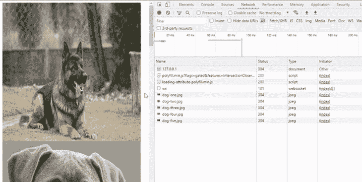

# JavaScript 中的跨浏览器原生延迟加载

> 原文：<https://blog.logrocket.com/cross-browser-native-lazy-loading-javascript/>

延迟加载是一种网站优化技术，其中页面元素(如图像)仅在到达距视口的计算距离时才被加载。

另一方面，开始时适合视口的元素会立即加载。这允许用户尽快开始与页面交互。



上面的 GIF 展示了图片惰性加载的实现。视窗中可见的图像(或近距离内的图像)会被立即加载，而视窗下方较远的图像只有在用户滚动到它们附近时才会被获取。

在本教程中，我们将涵盖:

让我们开始学习如何在跨所有浏览器的 JavaScript 网站中实现原生惰性加载。

## 实现延迟加载属性的不同方法

虽然大多数现代浏览器本身支持带有属性的图片的惰性加载，但是旧的浏览器可能不支持这个特性。在这种情况下，浏览器会简单地忽略该属性，而不会产生副作用。

为了处理本身不支持延迟加载的浏览器，你可以使用第三方库或者 polyfill。在本教程中，我们将使用 polyfill 方法来构建上面显示的页面。

有许多 polyfill 选项可用于帮助在旧浏览器上实现延迟加载。我们将使用一个名为[loading-attribute-poly fill](https://github.com/mfranzke/loading-attribute-polyfill)的轻量级、高效的包来实现图片和 iframes 的本地延迟加载。

loading-attribute-polyfill 包使用优雅退化的 JavaScript 来解决``的兼容性问题。它还通过及时为搜索引擎爬虫加载图像和 iframe 内容来提升页面的 SEO 性能。

我们将使用另一种 polyfill 来确保与 Microsoft Internet Explorer 9 的兼容性。

## 如何设置延迟加载的基本示例

这个项目的目录结构将会非常简单。

我们将首先为我们的项目创建一个空文件夹。在其中，我们将创建一个名为`/images`的子文件夹。然后，我们将把几张狗的照片放入页面。

除了文件夹`/images`，我们将为标记创建文件`index.html`:

```
project-folder/
├── images/
│   ├── dog-one.jpg
│   ├── dog-two.jpg
│   ├── dog-three.jpg
│   ├── dog-four.jpg
│   ├── dog-five.jpg
│   ├── dog-six.jpg
│   ├── dog-seven.jpg
│   ├── dog-eight.jpg
│   ├── dog-nine.jpg
│   └── dog-ten.jpg
└── index.html

```

可以通过两种方式使用加载-属性-聚合填充包。第一种选择是通过 npm 或 Bower 安装软件包。或者，您可以通过 CDN 异步加载 polyfill，这是一种非常容易设置的方法。

对于本教程，我们将在脚本标签中异步加载 polyfill。进入您的项目的`index.html`文件，并包含以下基本标记:

```
<!DOCTYPE html&gt;
<html>
<head>
  <meta charset="utf-8">
  <meta name="viewport" content="width=device-width">
  <title>JS Bin</title>

  <!-- Including other optional polyfills depending on expected browser support -->
  <script
    src="https://polyfill.io/v3/polyfill.min.js?flags=gated&features=IntersectionObserver"
    crossorigin="anonymous"
  ></script>

  <script async src="https://cdn.jsdelivr.net/npm/[email protected]/loading-attribute-polyfill.min.js" integrity="sha256-kX73NqVUoUbV0K44kgoqP8P8IZfU0OEjr/afCnK2Mrg=" crossorigin="anonymous"></script>

<!-- Ensures that all images appear as block element -->
<style>
    img {
      display: block;
    }
</style>
</head>
<body>
    <!-- Include images here-->
</body>
</html>
```

此代码包含两个聚合填充的链接。原因如下:

首先，我们下载了[Intersection Observer API poly fill，以便在不支持此功能的旧版本](https://blog.logrocket.com/lazy-loading-using-the-intersection-observer-api/) [Microsoft Edge、Microsoft Internet Explorer 11 或 Apple Safari 12.0](https://caniuse.com/intersectionobserver)上实现延迟加载。

之后，我们在解析页面的同时下载了 loading-attribute-polyfill。这一步支持本机惰性加载。

我们还定义了一个样式规则，它将使页面上的每个图像出现在一个新行上。

## 在各种图像类型上实现延迟加载

在 JavaScript 中实现延迟加载的方式取决于您使用的是简单图像、响应图像还是包装在图片标签中的图像。

### 如何惰性加载简单图像

为了延迟加载简单的图像，您需要用一个`noscript` HTML 标签包装所有您想要延迟加载的`` HTML 标签。您还需要将 class 属性设置为`lazy-loading`。

在您的`<body>` HTML 标签中，使用以下标记。记得将`src`属性指向您自己的图像路径:

```
  

  <noscript class="loading-lazy">
      
  </noscript>

  <noscript class="loading-lazy">
      
  </noscript>

  <noscript class="loading-lazy">
      
  </noscript>

  <noscript class="loading-lazy">
      
  </noscript>
```

仅对落在视口下方的图像应用延迟加载。在我们的标记中，第一个``标签肯定会出现在视口中，所以它不应该有`loading-lazy`属性。当用户滚动到它们附近时，剩余的屏幕外图像都被加载。

此外，注意图像应该包括`height`和`width`属性。如果没有用`height`和`width`属性显式设置图像的尺寸，浏览器将不会知道图像的大小。

如果不知道图像的尺寸，浏览器就无法为其保留适当的空间。因此，对于任何没有设置尺寸的图像，浏览器可能默认为 0x0px。这可能会导致图像加载时布局偏移。

此外，因为这样的图像不占用屏幕上的任何空间，所以浏览器可以假设图像在开始时都适合视口。在这种情况下，浏览器可能会决定一次加载所有内容。

* * *

### 更多来自 LogRocket 的精彩文章:

* * *

通过设置高度和宽度，您实际上将一些图像推出了屏幕，从而迫使浏览器将它们识别为适合延迟加载。

### 如何用`srcset`延迟加载响应图像

对于响应图像，使用`srcset`属性并添加同一图像的三个版本，以在不同的屏幕尺寸上显示。

```
<noscript class="loading-lazy">
      
</noscript>

```

同样，确保设置尺寸来帮助浏览器为图像分配足够的空间。这也将确保浏览器根据屏幕大小显示正确的图像版本。在我们的例子中，我们使用:

*   屏幕宽度小于 710 像素时的 140 像素版本(`dog-one-sm.jpg`)
*   屏幕宽度在 710 像素到 991 像素之间的 200 像素版本
*   屏幕宽度大于 991 像素时的 320 像素版本

### 如何延迟加载图片标签中的图片

在`<picture>`的情况下，使用补充的`<source>` HTML 标签:

```
<noscript class="loading-lazy">
    <picture>
        <source
            media="(min-width: 900px)"
            srcset="./images/dog-one-lg.jpg 1x,
             ./images/dog-one-lg.2x.jpg 2x"
        />
        <source srcset="./images/dog-one.jpg 1x 
                    ./images/dog-one.2x.jpg 2x" />
        
    </picture>
</noscript>

```

对于宽度大于 900px 的视窗，浏览器将加载第一个`<source>`标签的`srcset`属性中指定的图像。如果屏幕宽度小于 900px，浏览器将使用第二个`<source>`的正常图像尺寸。

## 在 iframes 上实现延迟加载

对于内嵌框架，使用`<iframe>`标签。`src`属性应该指向您想要延迟加载的文档，并且`loading`属性应该设置为`lazy`:

```
<noscript class="loading-lazy">
  <iframe
      src="https://codepen.io/ubahthebuilder/embed/rNYbaMQ"
      width="400"
      height="400"
      loading="lazy"
  ></iframe>
</noscript>

```

与图像一样，您应该设置尺寸。

## 包扎

概括地说，我们用几张狗的照片构建了一个简单的 HTML 页面，从 CDN 加载了 loading 属性 JS polyfill，并用这个 polyfill 包装了屏幕外的狗的照片，以便在它们上面启用延迟加载特性。

我们还了解了如何使用 polyfill 和其他属性，如`srcset`属性、``标签和 iframes。

现在您应该知道如何延迟加载您的图像，即使是在不支持本地延迟加载的旧浏览器中。

祝你一周愉快。

## 通过理解上下文，更容易地调试 JavaScript 错误

调试代码总是一项单调乏味的任务。但是你越了解自己的错误，就越容易改正。

LogRocket 让你以新的独特的方式理解这些错误。我们的前端监控解决方案跟踪用户与您的 JavaScript 前端的互动，让您能够准确找出导致错误的用户行为。

[](https://lp.logrocket.com/blg/javascript-signup)

LogRocket 记录控制台日志、页面加载时间、堆栈跟踪、慢速网络请求/响应(带有标题+正文)、浏览器元数据和自定义日志。理解您的 JavaScript 代码的影响从来没有这么简单过！

[Try it for free](https://lp.logrocket.com/blg/javascript-signup)

.