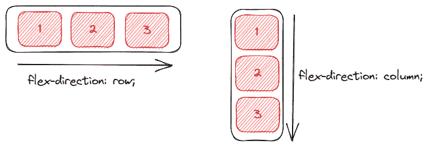
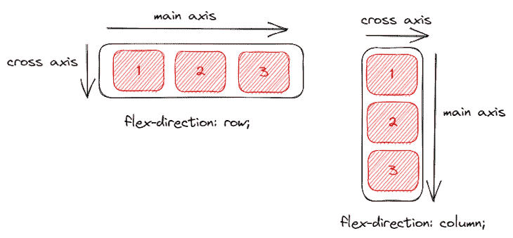
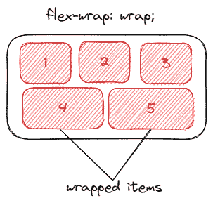
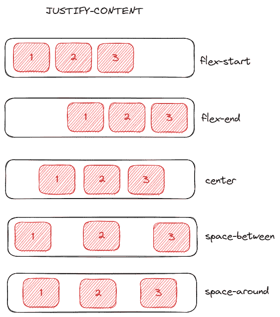
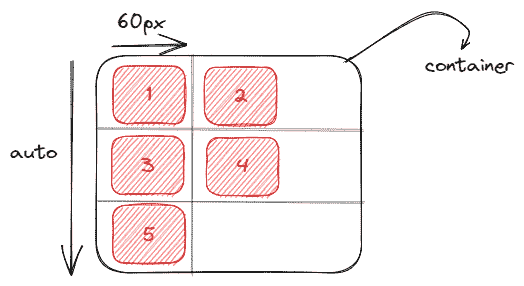
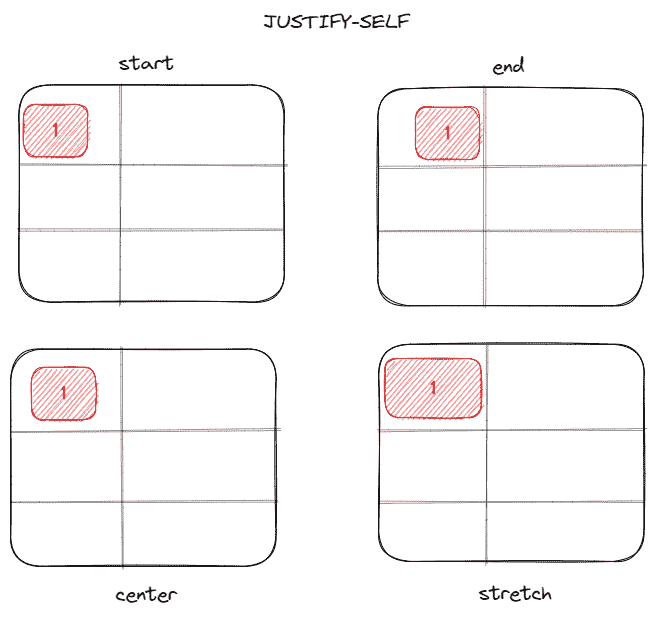
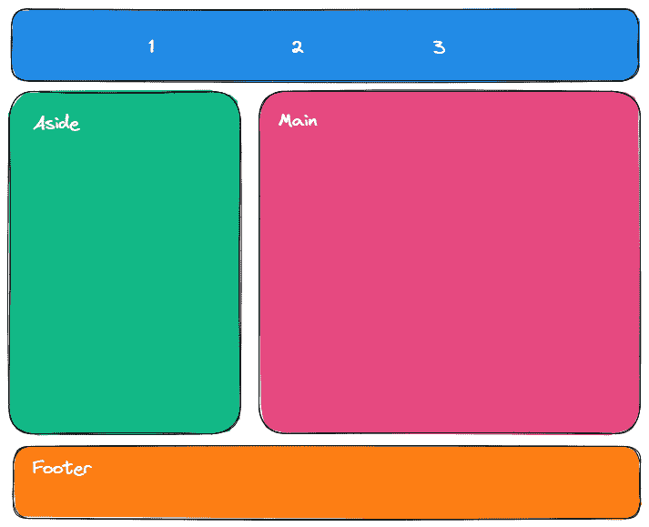

# 何时使用 Flexbox，何时使用 CSS Grid 

> 原文：<https://blog.logrocket.com/css-flexbox-vs-css-grid/>

***编者按**:这篇比较 [Flexbox](https://blog.logrocket.com/responsive-image-gallery-css-flexbox/) 和 [CSS 网格](https://blog.logrocket.com/css-grid-getting-started/)的文章最后一次回顾和更新是在 2023 年 1 月 6 日。*

你展示内容的方式可以透露很多关于你或你的公司的信息。拥有高质量的内容并知道如何以一种用户能够理解的简洁方式来显示它是非常重要的。

那么，我们如何选择如何展示我们的内容呢？通过我们的 CSS 代码，我们有责任以一种漂亮得体的方式展示我们的内容。

CSS 一直是 web 开发中最重要的部分之一，自从浏览器出现以来，我们一直在构建和改进使用它的新方法。几年前，创建网页布局是一件非常困难的工作。我们使用了一些 CSS 属性，比如`float`，用`position`定位了很多元素，以及内嵌块样式。

现在，我们不再依赖这些属性来创建我们的网页，现在在我们的网页上创建不同的体验变得越来越容易。网络的发展已经到了一个地步，现在我们有两个 CSS 布局系统可以使用: [Flexbox](https://developer.mozilla.org/en-US/docs/Web/CSS/CSS_Flexible_Box_Layout) 和 [CSS Grid](https://developer.mozilla.org/en-US/docs/Web/CSS/CSS_Grid_Layout) 。

尽早考虑哪种布局系统最适合您的项目，确实可以帮助您获得更好的结果和编写良好的 CSS 代码。在这篇文章中，我们将看看什么时候使用 Flexbox，什么时候使用 CSS Grid。这不是一个很难回答的问题，但是它可以在将来的维护和重构中为您节省一些时间。

向前跳:

## 什么是 Flexbox？

Flexbox 于 2009 年作为一个新的布局系统推出，目标是帮助我们构建响应迅速的网页并轻松组织我们的元素，从那时起，它获得了越来越多的关注。原来它现在被用作现代网页的主要布局系统。

Flexbox 是一个一维布局系统，我们可以用它来创建行或列轴布局。它让我们更容易设计和构建响应性网页，而不必在 CSS 代码中使用复杂的技巧和大量的浮动和位置属性。

在我们开始讨论什么时候应该使用 Flexbox 和 Grid 之前，让我们回顾一下使这两个概念相互区别的一些属性。如果你想深入了解 Flexbox 和 Grid 的特性，或者如何开始使用它们，你可以分别在 [Flexbox](https://blog.logrocket.com/responsive-image-gallery-css-flexbox/) 和 [G](https://blog.logrocket.com/css-grid-getting-started/) [rid、](https://blog.logrocket.com/css-grid-getting-started/)查看这些初学者友好的文章。

假设我们的 HTML 中有一个`<div>`作为三个子元素的容器。您需要做的就是使用`display: flex`属性创建一个 flex 容器。之后，flex 容器中的每个元素都会变成一个 flex 项目。

相应的代码应该是:

```
<div class="container">
  <div id="one">1</div>
  <div id="two">2</div>
  <div id="three">3</div>
</div>

.container{
  display: flex;
}

```


在我们的 flex 容器中，我们可以决定为容器中的项目设置一个方向。最常用的弯曲方向是`row`和`column`。我们对应的 CSS 将如下所示:

```
.container{
  flex-direction: row | column;
}

```



在某些情况下，`flex-direction`可以设置为`row-reverse`或`column-reverse`。在弯曲方向下需要注意的一件重要事情是轴的概念。根据弯曲方向，我们可以有一个主轴和一个横轴。在弯曲方向为行的情况下，主轴在水平方向，横轴在垂直方向。当弯曲方向是柱时，情况相反。当我们考虑调整时，这将非常有用:



另一个有趣的属性是`flex-wrap`，当没有更多空间时，它让 flex 容器中的项目移到下一行:

```
.container{
  flex-wrap: wrap | nowrap| wrap-reverse;
}

```



然而，`flex-wrap`的问题是，当项目换行时，它们在上面的项目下方形成自己的弯曲线，因此不能与上面的项目完全对齐。你会看到`item4`和`item5`展开，填满了它们上方元素下方的所有空间。

Flexbox 有很多其他的属性，我们可以用它们来创造令人惊叹的东西。我们可以按照我们想要的方式排列元素，颠倒元素的顺序，决定我们的元素应该增长还是收缩，等等。让 Flexbox 如此有用的一个概念是 flex 容器内项目对齐的能力。

为了演示这一点，让我们看看 Flexbox 的一些与对齐相关的属性，比如`align-self`和`justify-content`。

例如，假设我们的`container` div 现在有四个元素，具有相同的宽度和高度:

```
<div id="container">
  <div id="one">1</div>
  <div id="two">2</div>
  <div id="three">3</div>
  <div id="four">4</div>
</div>

```

在我们的 CSS 中，我们可以使用`align-self`在容器中对齐这些项目。也就是说，我们可以为每个项目赋予不同的对齐方式:

```
#one{
  align-self: flex-start | flex-end | center | stretch 
}

```


假设我们想将容器中的所有项目对齐，而不是对齐每个单独的项目。为此，我们将使用`justify-content`。让我们假设我们的容器中又有了三个项目，而不是四个:

```
.container{
  justify-content: flex-start | flex-end | center | space-between | space-around
}

```



您会注意到在 flex 容器中对齐内容是多么容易。无论是容器内的单个物品还是所有物品。以上功能仅展示了 Flexbox 的一些常见属性，以及管理布局的小部分是多么容易。

现在我们知道了 Flexbox 是一个一维的布局系统，下面我们简单了解一下 CSS Grid 的工作原理以及这些布局系统之间的区别。

## 什么是 CSS 网格？

如果 Flexbox 是一个强大的布局系统，因为它是一维系统(这意味着我们可以处理行或列)，CSS Grid 现在被认为是最强大的布局系统。

CSS Grid 是一个二维布局系统，我们可以一起处理行和列，这意味着它提供了许多不同的可能性来构建更复杂和更有组织的设计系统，而不必回到我们过去使用的一些“hacky 方式”。

让我们使用下面的 HTML 代码片段，看看如何从中获得网格布局:

```
<div class="container">
  <div id="one">1</div>
  <div id="two">2</div>
  <div id="three">3</div>
  <div id="four">4</div>
  <div id="five">5</div>
</div>

```

要定义一个网格容器，您需要做的就是将一个`display: grid`属性传递给 block 元素。现在你有了一个网格，所以你应该定义你想要多少行和多少列。

为了创建行和列，我们使用了`grid-template-rows`和`grid-template-columns`属性，并传递告诉我们网格项将跨越容器多少的值:

```
grid-template-columns: 60px 60px;
grid-template-rows: auto;

```

从上面可以看到，我们的布局将被设置为两列，每列占据容器的 60px，由于有五个元素，我们将有三列跨越整个容器，这是由于`auto`属性:



就像现在一样，Grid 也有一些属性，允许您在容器内对齐项目。一个例子是`justify-self`属性。此属性将网格项在其单元格内沿行轴对齐:

```
#one{
  justify-self: start | end | center | stretch
}

```

以网格容器中的第一项为例:



值得注意的是`justify-self`并不是 grid 唯一拥有的对齐属性。我们也可以使用`justify-content`、`justify-items`、`align-items`和`align-self`。您可以很容易地注意到，在对齐和创建复杂布局时，grid 提供了更多的灵活性。

## Flexbox 和 Grid 共享的属性

尽管 Flexbox 和 Grid 有很多不同之处，但它们确实有一些相似的属性。

它们的第一个也是最大的共同点是它们都用于布局。以前，开发人员不得不与浮动作斗争。如今，借助 Flexbox 和 Grid，可以轻松创建各种复杂的布局。

至于 Flexbox 和 grid 共有的属性，包括`justify-content`、`align-content`、`align-self`和`align-items`。

现在我们已经看到了它们是如何工作的，我们将强调每种工具的区别和最佳用例。

* * *

### 更多来自 LogRocket 的精彩文章:

* * *

## CSS 网格用于布局；Flexbox 用于对齐

当 Flexbox 首次发布时，我们认为它可能是构建网页的最佳布局系统，但事实并非如此。

Flexbox 帮助开发人员开始创建更具响应性和可维护性的 web 应用程序，但是当您需要构建更复杂的布局设计时，一维布局系统的主要思想就没有意义了。

CSS Grid 真正来帮助我们使用二维方式构建更复杂的布局设计，使用行和列。我们应该把这两者结合起来使用，但目的不同。对于你的布局，使用 CSS 网格，对于你的元素对齐，使用 Flexbox。

要掌握并准确知道何时需要以及如何使用 CSS Grid，您应该首先学习基础知识以及 Flexbox 如何工作，因为当您需要对齐应用程序中的元素时，您将会想要使用 Flexbox。

## 何时使用 CSS Flexbox

*   **您有一个小的设计要实现**:当您有一个小的布局设计要实现时，Flexbox 是理想的，只有几行或几列
*   **你需要对齐元素** : Flexbox 非常适合这个，我们唯一要做的就是使用`display: flex`创建一个 flex 容器，然后定义我们想要的 flex 方向
*   你需要一个内容优先的设计:如果你不知道你的内容看起来会是什么样子，Flexbox 是创建网页的理想布局系统，所以如果你想让所有东西都适合你，Flexbox 是完美的选择

当然，您可以仅使用 Flexbox 构建整个应用程序，并获得与使用 CSS grid 构建相同的结果。但是对于一个更好的 CSS 方法来说，为了有一个更简洁、写得更好、长期可维护的应用程序，为了完美地创建和适应你的布局，理想的方法是使用 CSS Grid。

## 何时使用 CSS 网格

*   **你有一个复杂的设计要实现**:在一些用例中，我们有复杂的设计要实现，这时候 CSS Grid 的魔力就显现出来了。这里的二维布局系统非常适合创建复杂的设计。我们可以用它来创建更复杂、更易维护的网页
*   **你需要在块元素之间有一个间隙**:CSS Grid 中另一个非常有用的东西，我们在 Flexbox 中没有，就是 gap 属性。我们可以非常容易地定义我们的行或列之间的间隙，而不必使用 margin 属性，这可能会导致一些副作用，尤其是当我们使用许多断点时
*   **你需要重叠元素**:使用 CSS Grid 重叠元素非常容易，你只需要使用`grid-column`和`grid-row`属性就可以非常容易地拥有重叠元素。另一方面，对于 Flexbox，我们仍然需要使用一些技巧，如边距、变换或绝对定位
*   **你需要一个布局优先的设计**:当你已经有了你的布局设计结构，用 CSS Grid 来构建就更容易了，当我们能够一起使用行和列，并按照我们想要的方式放置元素时，二维布局系统帮了我们很多

在您决定应该使用哪一个之前，不要忘记:

> CSS 网格用于布局；Flexbox 用于校准。

这里有一个正确使用 CSS 网格的例子。假设我们要构建一个简单的应用程序，我们的应用程序的准系统看起来有点像这样:


我们有一个页眉，一个侧边菜单，主块内容和一个页脚。要使用 CSS Grid 创建这个布局，我们只需要创建我们的元素:

```
<div id="container">
  <header>Header</header>
  <aside>Aside</aside>
  <main>Main</main>
  <footer>Footer</footer>
</div>

```

现在，使用`display: grid`创建一个网格容器，然后创建一些行和列。

我们非常简单地创建我们的设计，不需要使用像`float`这样的工具或者定位我们的元素，也不需要创建许多 flex 容器。

为了给你的应用程序创建一个非常好的网页布局，你能为你的应用程序做出的最好的决定是两者一起使用。

让我们以 CSS Grid 和 Flexbox 为例，展示这两种布局系统的强大功能。在我们的`header`中，我们将创建三个`div`元素并将它们排成一行:

```
<header>
  <div>1</div>
  <div>2</div>
  <div>3</div>
</header>

```

为此，我们需要做的就是使用`display: flex`属性将`header`声明为一个 flex 容器，使用`flex-direction: row`将 flex-direction 设置为一行，并对齐各项:

查看该代码的[对应代码沙箱](https://codesandbox.io/s/wizardly-rumple-jnr5pe?file=/src/styles.css)。您可以随意摆弄代码，看看您能让布局看起来有多大的不同。

现在，我们的小网页看起来像这样:



对于主要的布局样式，您可以使用 CSS Grid，因为它是一个二维布局系统，您可以非常轻松地处理行和列。对于更简单的布局风格，您可以使用一维系统 [Flexbox](https://codesandbox.io/s/wizardly-rumple-jnr5pe?file=/src/styles.css) ，因为它在处理行时非常有用。

## 结论

在本文中，我们了解了 CSS Flexbox 和 CSS Grid 之间的差异，它们在现代浏览器中的工作方式，以及我们如何使用它们在 CSS 中实现不同的结果。我们还展示了 Flexbox 和 Grid 可以一起使用的用例。

## 你的前端是否占用了用户的 CPU？

随着 web 前端变得越来越复杂，资源贪婪的特性对浏览器的要求越来越高。如果您对监控和跟踪生产环境中所有用户的客户端 CPU 使用情况、内存使用情况等感兴趣，

[try LogRocket](https://lp.logrocket.com/blg/css-signup)

.

[](https://lp.logrocket.com/blg/css-signup)[https://logrocket.com/signup/](https://lp.logrocket.com/blg/css-signup)

LogRocket 就像是网络和移动应用的 DVR，记录你的网络应用或网站上发生的一切。您可以汇总和报告关键的前端性能指标，重放用户会话和应用程序状态，记录网络请求，并自动显示所有错误，而不是猜测问题发生的原因。

现代化您调试 web 和移动应用的方式— [开始免费监控](https://lp.logrocket.com/blg/css-signup)。