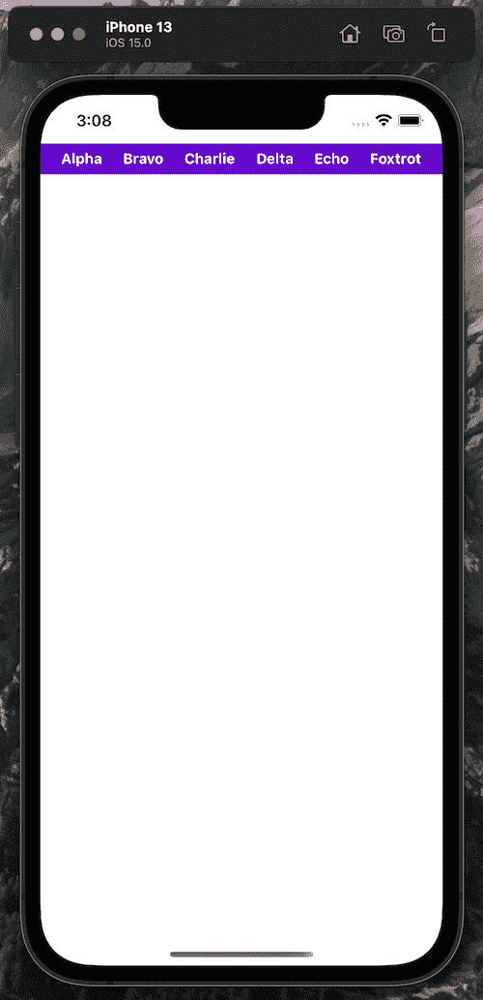
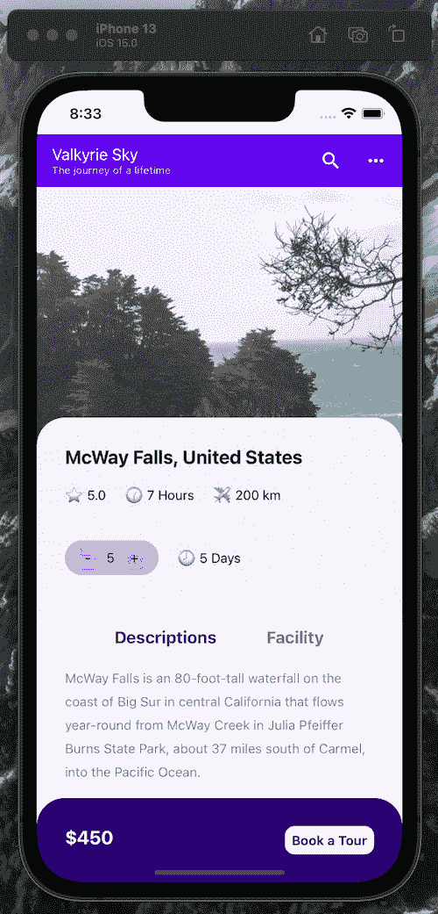

# 在 React Native - LogRocket 博客中使用 CSS 模块

> 原文：<https://blog.logrocket.com/css-modules-react-native/>

在 React 本地应用程序中，有很多方法可以实现良好的样式。在本教程中，我们将回顾 React Native 中的传统样式方法，并向您介绍一种流行的替代方法:CSS 模块。

由于 [React Native](https://blog.logrocket.com/how-to-build-ios-apps-using-react-native/) 的强大功能以及它支持开箱即用的原生 HTML 和 CSS 样式，设计和创建定制移动应用程序的门槛非常低。如果你已经熟悉 web 开发，并且有使用 React for web 的经验，那么你是幸运的，因为这些技能将会非常容易地转化过来。

## 反应原生样式与 CSS 模块

React Native 中使用的核心布局设计系统[是 CSS Flexbox](https://blog.logrocket.com/a-guide-to-flexbox-properties-in-react-native/) ，这是开发者中最受欢迎的用于构建网页的设计系统。拥有 Flexbox 的强大功能使得高级和初级开发人员都可以轻松设计移动应用程序。

React 本机应用程序通常使用内联样式或样式道具进行样式化。CSS 模块为使用传统的 React 原生样式提供了一个可移植的、更健壮的替代方案。CSS 模块使您能够在 React 本机应用程序中使用本地范围的样式，这使您的代码明显更干净，可读性更好。

在本指南中，我们将通过实例展示每种方法的工作原理，并演示为什么应该考虑使用 CSS 模块来设计 React 本机应用程序。

## React Native 中的样式:传统方法

React Native 允许您使用 JavaScript 设计整个应用程序的样式。每个组件都可以使用一个名为`style`的道具，这使您能够为这些组件编写 CSS 样式。

React Native has 创建样式有两种主要方法:内联样式化和使用`style` prop 来样式化子组件。本质上，您有一个`StyleSheet.create`方法来一次定义多个样式，就像 CSS 中的内联样式表一样。

下面的示例展示了内联样式在 React Native 中的工作原理:

`App.js`文件

```
import React from 'react';
import { View, Text, SafeAreaView } from 'react-native';

export default function App() {
  return (
    <>
      <SafeAreaView>
        <View
          style={{
            flexDirection: 'row',
            justifyContent: 'space-evenly',
            alignItems: 'center',
            backgroundColor: '#6804CD',
            width: '100%',
            height: 30,
          }}
        >
          <Text style={{ color: '#ffffff', fontWeight: 'bold' }}>Alpha</Text>
          <Text style={{ color: '#ffffff', fontWeight: 'bold' }}>Bravo</Text>
          <Text style={{ color: '#ffffff', fontWeight: 'bold' }}>Charlie</Text>
          <Text style={{ color: '#ffffff', fontWeight: 'bold' }}>Delta</Text>
          <Text style={{ color: '#ffffff', fontWeight: 'bold' }}>Echo</Text>
          <Text style={{ color: '#ffffff', fontWeight: 'bold' }}>Foxtrot</Text>
        </View>
      </SafeAreaView>
    </>
  );
}

```

内联样式非常适合快速、小型的应用程序，也适用于你想测试一些代码而不需要完全实现的场景。然而，正如你所看到的，有很多重复，代码没有遵循 DRY 原则。这种类型的代码不能很好地伸缩，因为有许多重复的内容可以用 CSS 类来代替。

因为内联 CSS 必须用 camel case 语法编写，与传统的 CSS 样式不同，将普通的 CSS 样式转换成这种语法需要的时间稍长。你不能只是复制和粘贴代码。

此外，使内联样式具有响应性要困难得多，因为媒体查询根本不起作用。唯一的选择是创建某种业务逻辑来让它工作，或者完全使用另一种方法。

以下示例显示了如何使用样式道具产生相同的结果:

`App.js`文件:

```
import React from 'react';
import { StyleSheet, View, Text, SafeAreaView } from 'react-native';

export default function App() {
  return (
    <>
      <SafeAreaView>
        <View style={styles.container}>
          <Text style={styles.text}>Alpha</Text>
          <Text style={styles.text}>Bravo</Text>
          <Text style={styles.text}>Charlie</Text>
          <Text style={styles.text}>Delta</Text>
          <Text style={styles.text}>Echo</Text>
          <Text style={styles.text}>Foxtrot</Text>
        </View>
      </SafeAreaView>
    </>
  );
}

const styles = StyleSheet.create({
  container: {
    flexDirection: 'row',
    justifyContent: 'space-evenly',
    alignItems: 'center',
    backgroundColor: '#6804CD',
    width: '100%',
    height: 30,
  },
  text: {
    color: '#ffffff',
    fontWeight: 'bold',
  },
});

```

[React 本机样式表](https://blog.logrocket.com/react-native-styling-tutorial-with-examples/)方法是在 React 本机应用程序中实现 CSS 样式的默认方法。样式表基本上是一种抽象，非常类似于传统的 CSS 样式表。代码非常容易阅读，增加类名可以确保代码保持干爽。

这种 [CSS-in-JS](https://blog.logrocket.com/5-things-you-can-do-css-in-js/) 方法非常流行，尽管社区中对于 JavaScript 和 CSS 是否应该在同一个文件中还存在争议。这通常被称为关注点分离，它规定您不应该将 JavaScript 和 CSS 混合在一起；每个都应该存在于自己的文件中。

下面是代码在应用程序中呈现时的样子:



## 为什么应该使用 CSS 模块

内联样式和使用样式道具的一个很好的替代方法是使用 CSS 模块。CSS 模块很棒，因为它们使您能够拥有组件范围的 CSS，对于它被分配到的组件来说，它是高度可移植的和本地化的。您不再需要担心选择器名称(如 id)和其他 CSS 文件中可能具有相同命名约定的类之间的冲突。

默认情况下，CSS 模块是本地范围的文件，因此不会与其他 CSS 文件冲突。使用 CSS 模块，文件是用纯 CSS 编写的，但被转换成 JavaScript 中的对象，使它们更健壮，集成起来更安全。

普通 CSS 和 CSS 模块之间的唯一区别是文件扩展名。普通 CSS 使用`header.css`文件命名约定，而 CSS 模块使用`header.module.css`约定。

### CSS 模块:一个实际例子

下面你会发现我们在内联样式和使用样式道具的例子中使用的相同代码，但是这次我们将使用 CSS 模块来样式化我们的 React 本地应用。

`App.js`文件:

```
import React from 'react';
import { View, Text, SafeAreaView } from 'react-native';
import style from './App.module.css';

export default function App() {
  return (
    <>
      <SafeAreaView>
        <View style={style.container}>
          <Text style={style.text}>Alpha</Text>
          <Text style={style.text}>Bravo</Text>
          <Text style={style.text}>Charlie</Text>
          <Text style={style.text}>Delta</Text>
          <Text style={style.text}>Echo</Text>
          <Text style={style.text}>Foxtrot</Text>
        </View>
      </SafeAreaView>
    </>
  );
}

```

当使用 CSS 模块时，你可以看到代码看起来有多干净。该文件中没有 CSS 样式表。相反，它必须被导入，这使得代码保持分离。每个元素都有一个样式类，它来自于`App.module.css`文件。CSS 现在针对每个单独的文件进行了本地化，因此应该不会有任何命名冲突。

`App.module.css`文件:

```
.container {
  flex-flow: row;
  justify-content: space-evenly;
  align-items: center;
  background-color: '#6804CD';
  width: '100%';
  height: 30;
}

.text {
  color: '#ffffff';
  font-weight: bold;
}

```

`App.module.css`文件中的代码是普通的 CSS。没有骆驼案；这只是一个普通的 CSS 文件，因此您可以获得 CSS 的全部功能。这包括媒体查询、悬停事件等。如果你在另一个文件中有一些 CSS，复制和粘贴它是很容易的——不需要转换。

## 使用 CSS 模块设计 React 本机应用程序

让我们更深入一点，使用 CSS 模块设计一个全面的 React 原生应用程序。

在开始之前，请确保您的开发环境已经设置好。出于本教程的目的，我们将使用 Expo 框架和平台来开发 React 本地应用程序。

先决条件:

### 设置 React 本机应用程序

我们将使用 Expo CLI 工具创建 React 本地前端。

将需要以下库:

首先，为项目创建一个文件夹，然后运行下面的命令:

```
npx expo-cli init frontend

```

选择一个空白模板并继续安装。

`cd`到`frontend`文件夹，然后使用 BASH 应用程序安装下面的依赖项:

```
>yarn add babel-plugin-react-native-classname-to-style babel-plugin-react-native-platform-specific-extensions react-native-css-transformer react-native-paper --dev

```

在代码编辑器中打开项目，用下面的代码替换`babel.config.js`文件中的代码:

```
module.exports = function (api) {
  api.cache(true);
  return {
    presets: ['babel-preset-expo'],
    plugins: [
      'react-native-classname-to-style',
      ['react-native-platform-specific-extensions', { extensions: ['css'] }],
    ],
  };
};

```

接下来，将以下内容添加到项目根目录中的`metro.config.js`(如果还没有文件，请创建该文件):

```
const { getDefaultConfig } = require("metro-config");

module.exports = (async () => {
  const {
    resolver: { sourceExts }
  } = await getDefaultConfig();
  return {
    transformer: {
      babelTransformerPath: require.resolve("react-native-css-transformer")
    },
    resolver: {
      sourceExts: [...sourceExts, "css"]
    }
  };
})();

```

最后，将下面的代码添加到根目录下的`app.json`文件中:

```
{
  "expo": {
    "packagerOpts": {
      "config": "metro.config.js",
      "sourceExts": ["js", "jsx", "css"]
    }
  }
}

```

设置完成后，就可以运行下面命令来启动服务器了:

```
yarn start

```

您应该会看到链接和一个二维码来打开 Expo CLI 开发工具。在浏览器窗口中打开它，然后选择一个设备或模拟器来运行它。

* * *

### 更多来自 LogRocket 的精彩文章:

* * *

### 设计前端

创建一个名为`App.module.css`的文件，放在根目录下。将下面的代码复制到相应的文件中，你应该会看到一个使用 React Native 和 CSS 模块设计的非常酷的应用程序。

`App.js`:

```
import React from 'react';
import { SafeAreaView, Text, View, ImageBackground, TouchableOpacity } from 'react-native';
import { Appbar } from 'react-native-paper';
import { Platform } from 'react-native';
import style from './App.module.css';

const MORE_ICON = Platform.OS === 'ios' ? 'dots-horizontal' : 'dots-vertical';

const image = {
  uri: 'https://images.unsplash.com/photo-1510414842594-a61c69b5ae57?ixid=MnwxMjA3fDB8MHxwaG90by1wYWdlfHx8fGVufDB8fHx8&ixlib=rb-1.2.1&auto=format&fit=crop&w=2070&q=80',
};

export default function App() {
  return (
    <SafeAreaView>
      <Appbar.Header>
        <Appbar.Content title="Valkyrie Sky" subtitle={'The journey of a lifetime'} />
        <Appbar.Action icon="magnify" onPress={() => {}} />
        <Appbar.Action icon={MORE_ICON} onPress={() => {}} />
      </Appbar.Header>
      <View style={style.container}>
        <ImageBackground source={image} resizeMode="cover" style={style.appbg}>
          <View style={style.main}>
            <View>
              <Text style={style.mainheading}>McWay Falls, United States</Text>
            </View>
            <View style={style.location}>
              <Text>⭐️ 5.0</Text>
              <Text style={style.locationicons}>🕜 7 Hours</Text>
              <Text>✈️ 200 km</Text>
            </View>
            <View style={style.booking}>
              <View style={style.party}>
                <TouchableOpacity style={style.partybtn}>
                  <Text>-</Text>
                </TouchableOpacity>
                <Text>5</Text>
                <TouchableOpacity style={style.partybtn}>
                  <Text>+</Text>
                </TouchableOpacity>
              </View>
              <View>
                <Text>🕗 5 Days</Text>
              </View>
            </View>
          </View>
          <View style={style.content}>
            <View style={style.contentheading}>
              <Text style={style.selected}>Descriptions</Text>
              <Text style={style.unselected}>Facility</Text>
            </View>
            <View>
              <Text style={style.description}>
                McWay Falls is an 80-foot-tall waterfall on the coast of Big Sur in central California that flows
                year-round from McWay Creek in Julia Pfeiffer Burns State Park, about 37 miles south of Carmel, into the
                Pacific Ocean.
              </Text>
            </View>
          </View>
          <View style={style.book}>
            <Text style={style.bookcost}>$450</Text>
            <TouchableOpacity style={style.bookbtn}>
              <Text style={style.bookbtntext}>Book a Tour</Text>
            </TouchableOpacity>
          </View>
        </ImageBackground>
      </View>
    </SafeAreaView>
  );
}

```

这是一个相当简单的设计。里面有文本、按钮和图像元素。顶部还有一个应用程序栏，它是使用 react-native-paper 包创建的。这只是为了演示而设计的；没有功能性。

`App.module.css`:

```
.container {
  background-color: rgb(44, 0, 95);
  width: 100%;
  height: 100%;
}

.appbg {
  height: 100%;
  width: 100%;
}

.main {
  position: absolute;
  bottom: 0;
  background: rgb(242, 231, 255);
  width: 100%;
  height: 70%;
  border-radius: 30px;
  padding: 30px;
}

.mainheading {
  font-size: 20px;
  font-weight: bold;
  color: rgb(22, 22, 22);
}

.location,
.booking {
  display: flex;
  flex-flow: row nowrap;
  justify-content: flex-start;
  align-items: center;
  margin-top: 20;
  margin-bottom: 20;
}

.locationicons {
  margin-left: 20;
  margin-right: 20;
}

.party {
  display: flex;
  flex-flow: row nowrap;
  justify-content: space-evenly;
  align-items: center;
  background: rgb(208, 166, 255);
  border-radius: 30px;
  width: 100px;
  padding: 5px;
  margin-right: 20px;
}

.partybtn {
  background: rgb(183, 149, 221);
  padding: 5px;
  border-radius: 5px;
}

.content {
  background: #ffffff;
  width: 100%;
  position: absolute;
  bottom: 80;
  height: 300px;
  border-radius: 30px;
  padding: 30px;
}

.contentheading {
  display: flex;
  flex-flow: row nowrap;
  justify-content: space-evenly;
  margin-bottom: 20px;
}

.selected {
  color: rgb(84, 0, 105);
  font-weight: bold;
  font-size: 18px;
}

.unselected {
  font-weight: bold;
  font-size: 18px;
  color: rgb(133, 125, 125);
}

.description {
  line-height: 25px;
  color: rgb(133, 125, 125);
}

.book {
  position: absolute;
  bottom: 78;
  display: flex;
  flex-flow: row nowrap;
  justify-content: space-between;
  padding: 30px;
  background: rgb(44, 1, 114);
  width: 100%;
  border-radius: 30px;
  height: 90px;
}

.bookcost {
  color: #ffffff;
  font-size: 20px;
  font-weight: bold;
}

.bookbtn {
  background: #ffffff;
  border-radius: 10px;
  padding: 7px;
  height: 30px;
}

.bookbtntext {
  color: rgb(44, 1, 114);
  font-weight: bold;
}

```

这里有很多 CSS 样式。它们被恰当地命名，所以应该很容易理解它们在代码中的位置以及它们在做什么。

参见下面的最终设计:



## **结论**

如您所见，在 React 本地应用程序中使用 CSS 模块非常简单。这是一个相当简单的例子；当然，当您拥有多个都包含组件的文件时，CSS 模块的真正威力就显而易见了。创建本地范围的样式将显著提高代码库的可读性和整洁性。

## [LogRocket](https://lp.logrocket.com/blg/react-native-signup) :即时重现 React 原生应用中的问题。

[](https://lp.logrocket.com/blg/react-native-signup)

[LogRocket](https://lp.logrocket.com/blg/react-native-signup) 是一款 React 原生监控解决方案，可帮助您即时重现问题、确定 bug 的优先级并了解 React 原生应用的性能。

LogRocket 还可以向你展示用户是如何与你的应用程序互动的，从而帮助你提高转化率和产品使用率。LogRocket 的产品分析功能揭示了用户不完成特定流程或不采用新功能的原因。

开始主动监控您的 React 原生应用— [免费试用 LogRocket】。](https://lp.logrocket.com/blg/react-native-signup)