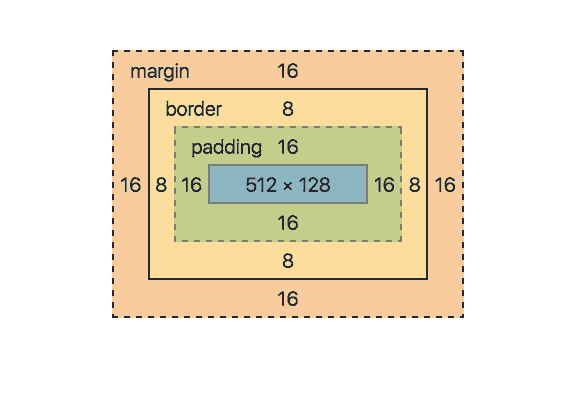

# CSS 参考指南:border - LogRocket 博客

> 原文：<https://blog.logrocket.com/css-reference-guide-border/>

CSS `border`属性是用来设置元素边框的宽度、样式和/或颜色的简写。

#### *向前跳转:*

* * *

CSS 中的一个元素用盒子模型来表示。



上面，你可以看到一个元素的边框仅仅是围绕元素内容和填充的一行或多行。元素的边框不会延伸到边距中，因为元素的内容在填充处停止。考虑一个例子:

```
border: 1px solid green;
```

这会将目标元素的边框宽度设置为 1px，边框外观设置为纯色，颜色设置为绿色。

参见 [CodePen](https://codepen.io) 上 Chidume David([@ philipsz-davido](https://codepen.io/philipsz-davido))
的 Pen [css 边框示例](https://codepen.io/philipsz-davido/pen/zYqWmQJ)。

句法

* * *

## `border`的正常语法是:

在`border`中可以省略一些值，这将强制 CSS 引擎分配初始值。

```
border: <border-width> <border-style> <border-color>;
```

一个价值:

#### 如果`border`只被赋值一个值，那么它一定是`<border-style>`；如果未定义边框，它将是不可见的。然后 CSS 将获取边框宽度(`medium`)和颜色(`currentcolor`)的初始值。宽度被计算为大约 3px，颜色将是元素的文本颜色或前景色。

```
border: <border-style>
```

在这里，边框样式是实心的。CSS 然后将边框宽度设置为`medium`，即 3px，并将颜色设置为黑色(`rgb(0, 0, 0);`)，如果元素本身没有颜色集或者没有从其父元素继承的颜色，则黑色是元素的默认颜色。这就是为什么我们会看到元素周围出现 3px 的黑色边框。

```
border: solid;
```

上面，我们将元素的颜色设置为红色。边框将是 3px 宽，纯色，红色。正如我们所看到的，如果没有设置，元素的颜色，或者从其父元素继承的颜色，会影响元素的边框颜色。

```
border: solid;
color: red;
```

两个值:

* * *

#### 该语法设置边框的宽度和样式。然后，CSS 将根据元素的颜色属性或其继承的颜色属性来计算边框的颜色。

```
border: <border-width> <border-style>
```

该元素的边框宽度将为 9px，边框外观将为点状。边框颜色将是元素的颜色或其继承的颜色。如上所述，在缺少 set/inherited color 属性的情况下，CSS 将默认颜色设置为黑色。

```
border: 9px dotted;
```

在这种情况下，我们将元素的颜色属性设置为绿色。元素的边框颜色将会是绿色。

```
color: green;
border: 9px dotted;
```

上面的语法只显式设置了边框样式和颜色。CSS 将计算并设置`border-width`为中等，大约 3px 宽。

```
border: <border-style> <border-color>
```

这会将元素的边框样式和颜色设置为红色，宽度为 3px。

```
border: solid red;
```

组件属性

* * *

## 每当我们使用 sole `border`速记属性时，我们就设置了三个 CSS 边框属性。

`border-color`

*   `border-style`
*   `border-width`
*   `border-color`

### 此属性设置元素的边框颜色。

边框颜色设置为红色。

```
border-color: red;
```

第一个规则设置宽度和样式，颜色由 CSS 计算为黑色，这是元素的默认文本颜色。`border-color`然后通知 CSS 忽略默认的文本颜色，而使用它的值`red`。

```
border: 9px solid;
border-color: red;
```

因此，我们在元素上有一个 9px 宽的红色实心边框。

更多来自 LogRocket 的精彩文章:

* * *

### `border-color`具有单侧计算属性:

* * *

`border-top-color`

*   `border-bottom-color`
*   `border-right-color`
*   `border-left-color`
*   如果没有单独定义，它们都取`border-color`的值。

`border-style`

* * *

### 此属性设置边框的外观样式。它可以采用以下 10 个值:

`none`:即使设置了边框宽度和颜色，元素上也不会有边框

*   `hidden`:相当于`none`，但应用于表格时效果略有不同
*   `dotted`:指定虚线边框
*   `dashed`:指定虚线边框
*   `solid`:指定一个连续的实心边框
*   `double`:指定双边框。线条的宽度以及它们之间的空间宽度等于`border-width`的值
*   `groove`:指定一个 3D 凹槽边框，看起来好像被凿刻过一样
*   `ridge`:指定一个 3D 脊状边界，看起来好像在边缘切割出了脊
*   `inset`:边框的顶部和左侧颜色较深，底部和左侧颜色较浅
*   `outset`:插图的反面；边框的底部和左侧颜色较深，而右侧和顶部颜色较浅
*   `border-style`还具有单侧计算属性:

`border-top-style`

*   `border-bottom-style`
*   `border-left-style`
*   `border-right-style`
*   如果没有单独定义，它们都取`border-style`的值。

设置多种样式

#### 我们可以通过使用`border-style`的单边属性在一个元素的边框上设置多种样式。它的语法是:

值分配如下:

```
border-style: <top> <right> <bottom> <left>
```

这里有一个例子:

```
//one value:
border-style: <top, bottom, right, left>

//two values:
border-style: <top, bottom> <right, left>

//three values:
border-style: <top> <right, left> <bottom>
```

这会将边框顶部和底部的样式设置为`solid`，将左边和右边的样式设置为`dotted`。

```
border-style: solid dotted
```

这将顶部设置为`solid`，底部设置为`dashed`，左右两侧设置为`dotted`。

```
border-style: solid dotted dashed
```

`border-width`

* * *

### 此属性设置边框的宽度。它可以接受以下值:

`<length>`:这是用户明确设置的边框宽度值。它可以是任何单位:px、em、pt 等。

*   `thin` : ~1px
*   `medium` : ~3px
*   `thick` : ~5px
*   **注意** : CSS 并没有为上面的关键字定义确切的值；其结果可能因实施而异。

> `border-width`也具有单侧计算属性:

`border-top-width`

*   `border-bottom-width`
*   `border-left-width`
*   `border-right-width`
*   如果没有单独定义，它们都取`border-width`的值。

你的前端是否占用了用户的 CPU？

## 随着 web 前端变得越来越复杂，资源贪婪的特性对浏览器的要求越来越高。如果您对监控和跟踪生产环境中所有用户的客户端 CPU 使用、内存使用等感兴趣，

.

[try LogRocket](https://lp.logrocket.com/blg/css-signup)

LogRocket 就像是网络和移动应用的 DVR，记录你的网络应用或网站上发生的一切。您可以汇总和报告关键的前端性能指标，重放用户会话和应用程序状态，记录网络请求，并自动显示所有错误，而不是猜测问题发生的原因。

[](https://lp.logrocket.com/blg/css-signup)[https://logrocket.com/signup/](https://lp.logrocket.com/blg/css-signup)

现代化您调试 web 和移动应用的方式— [开始免费监控](https://lp.logrocket.com/blg/css-signup)。

Modernize how you debug web and mobile apps — [Start monitoring for free](https://lp.logrocket.com/blg/css-signup).