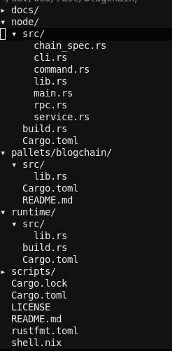
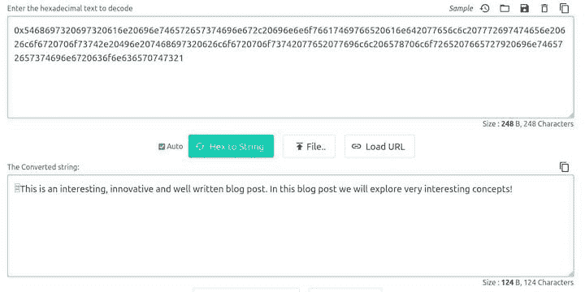
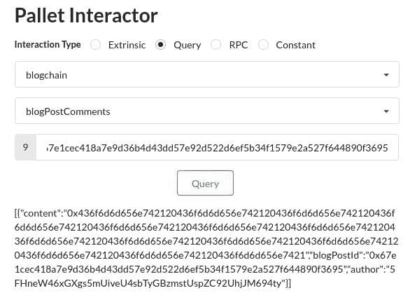
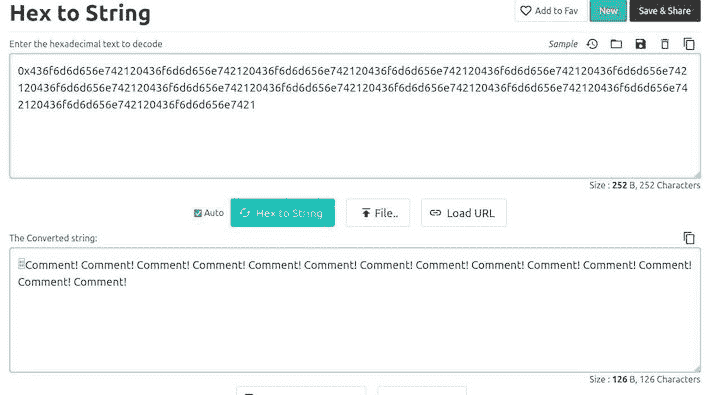
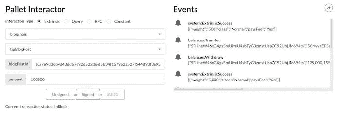

# 如何在 Rust 中使用 Substrate 构建自定义区块链实现

> 原文：<https://blog.logrocket.com/custom-blockchain-implementation-rust-substrate/>

在上一篇文章中，我们探讨了[衬底](https://substrate.dev/)区块链框架背后的核心概念。在本教程中，我们将实际动手实现一个非常基本的自定义区块链应用程序。

阅读这篇介绍性的文章并不是绝对必要的，但是如果一些术语对你来说是陌生的或者令人困惑的，在继续阅读本教程之前，浏览一下“[底层区块链开发:核心概念](https://blog.logrocket.com/substrate-blockchain-framework-core-concepts/)”可能是有意义的。

我们将构建一个简单的基于区块链的博客应用程序的后端，用户可以在其中提交博客文章，对用户的博客文章进行评论，并向其他博客文章作者发送提示，如果他们喜欢他们的内容。

根据操作的执行时间，所有这些操作都要花费用户少量的金钱。要了解这个概念的更多信息，您可以查看[基底文档](https://docs.substrate.io/v3/runtime/weights-and-fees/)。

该应用程序的基础是[基板节点模板](https://github.com/substrate-developer-hub/substrate-node-template)，一个完全设置好的基板节点，可随时进行定制。

在本教程中，我们将只关注应用程序的后端部分，并依靠[基板前端模板](https://github.com/substrate-developer-hub/substrate-front-end-template)与区块链和我们的自定义功能进行交互。在以后的文章中，我们可能会扩展这个例子，并基于这个模板为它构建一个定制的前端应用程序。

## 设置

为了设置我们的节点模板，我们将使用 [Kickstart](https://github.com/Keats/kickstart) ，您可以通过执行以下命令来安装它:

```
cargo install kickstart

```

Kickstart 只是一个 CLI 工具，用于根据预先制作的模板设置项目。好在 Kickstart 有[基板模板。](https://github.com/sacha-l/kickstart-substrate)

现在，您可以在工作区的根目录下运行该命令:

```
kickstart https://github.com/sacha-l/kickstart-substrate

```

这将提示您输入名称。在这两种情况下，只需输入`blogchain`，它就会下载并设置一个本地基板节点模板，该模板带有一个以您给定的名称命名的完全连接的托盘。

让我们看看`blogchain`项目中的文件结构:



如你所见，我们这里有相当多的文件和文件夹。最重要的是，我们有自己的`pallets/blockchain`区域，在这里我们将进行大部分定制并实现我们所有的业务逻辑。

`node`包含了我们运行底层节点模板所需的所有代码。在`runtime`中，所有内部和外部托盘被连接在一起，因此它们可以在节点内部运行。

我们将只对`pallets/blogchain/lib.rs`和`runtime/src/lib.rs`文件进行修改。

如果您在某个时候迷路了，或者事情不顺利，您可以参考[这个库](https://github.com/zupzup/blogchain-example-substrate)并查看提交历史，这与我们将在本教程中采用的路径大致一致。

首先，在`runtime/src/lib,rs`中，更改以下行:

```
TemplateModule: pallet_blogchain,

```

收件人:

```
Blogchain: pallet_blogchain,

```

这对于确保我们的货盘稍后在前端显示正确的名称非常重要。

此外，出于设置的原因，我们将把`Currency`特征添加到我们的托盘中，因为我们希望稍后将一些货币从一个用户转移到另一个用户。

在`pallets/blogchain/lib.rs`中，更改以下内容:

```
use frame_support::pallet_prelude::*;

```

收件人:

```
use frame_support::{pallet_prelude::*, traits::Currency};

```

范围内:

```
#[pallet::config]
pub trait Config: frame_system::Config {
    type Event: From<Event<Self>> + IsType<<Self as frame_system::Config>::Event>;
    type Currency: Currency<Self::AccountId>; // <-- new
}

```

这给我们的货盘增加了`Currency`特征。我们还需要将这个添加到`runtime/lib.rs`:

```
pub use frame_support::{
...
        traits::{Currency, KeyOwnerProofSystem, Randomness, StorageInfo},
...
};

impl pallet_blogchain::Config for Runtime {
        type Event = Event;
        type Currency = Balances; // <-- new
}

```

好了，这就是设置。确保一切都编译好了，让我们继续讨论一些数据结构和状态定义。

## 数据结构和存储

在这一节中，我们将实现一个简单的博客系统，带有评论和提示功能。

我们先在`/pallets/blogchain/lib.rs`中添加一些博文和评论的数据结构:

```
use frame_support::{
...
inherent::Vec,
...
};

#[derive(Clone, Encode, Decode, PartialEq, RuntimeDebug, TypeInfo)]
#[scale_info(skip_type_params(T))]
pub struct BlogPost<T: Config> {
        pub content: Vec<u8>,
        pub author: <T as frame_system::Config>::AccountId,
}

#[derive(Clone, Encode, Decode, PartialEq, RuntimeDebug, TypeInfo)]
#[scale_info(skip_type_params(T))]
pub struct BlogPostComment<T: Config> {
        pub content: Vec<u8>,
        pub blog_post_id: T::Hash,
        pub author: <T as frame_system::Config>::AccountId,
}

```

这看起来有点复杂，所以让我们打开它。

让我们先来看看结构上面的宏。我们衍生出几个众所周知的辅助特征，如`Clone`、`PartialEq`等。，但是我们也派生了`scale_info::TypeInfo`特征并使用了`scale_info`宏。这些用于底层内部的序列化和反序列化，以及在运行时检索关于类型的编译时信息的[。](https://docs.substrate.io/rustdocs/latest/scale_info/index.html)

结构本身相当简单。帖子只有一个字节的内容向量，作者基本上只是系统中的一个`AccountId`。`frame_system::Config`本质上是底层托盘配置。`frame_system`模块为托盘底层的一切提供功能和数据类型。这也是为什么这些结构对于`T: Config`来说是通用的，因为它们总是在托盘配置的上下文中使用。

这个`BlogPostComment`有一个内容和一个作者，但是它也持有`blog_post_id`，这是一个`T::Hash`。这是配置的哈希函数的输出。我们将对所有内容使用基板默认值，但是如果您希望将此托盘用于不同的区块链系统，这将非常有用，这些系统依赖于不同的配置，例如不同的哈希算法。这样，它不需要任何必要的修改就可以工作。

下一步是定义我们希望区块链保持的状态。为此，我们将创建两个保存帖子和评论的`StorageMap`实例:

```
/// Storage Map for BlogPosts by BlogPostId (Hash) to a BlogPost
#[pallet::storage]
#[pallet::getter(fn blog_posts)]
pub(super) type BlogPosts<T: Config> = StorageMap<_, Twox64Concat, T::Hash, BlogPost<T>>;

/// Storage Map from BlogPostId (Hash) to a list of BlogPostComments for this BlogPost
#[pallet::storage]
#[pallet::getter(fn blog_post_comments)]
pub(super) type BlogPostComments<T: Config> =
        StorageMap<_, Twox64Concat, T::Hash, Vec<BlogPostComment<T>>>;

```

使用`pallet::storage`宏，我们告诉系统这是一个持久存储块，并且`pallet::getter`宏创建了它，所以我们可以稍后在给定的函数名下查询它。

对于博客文章，我们使用一个`StorageMap`，它本质上是一个哈希映射，从`T::Hash`映射到`BlogPost`，因此从博客文章 id 映射到博客文章。

对于博文评论，我们希望从博文 ID 映射到评论列表，这样我们就可以查询给定博文的评论。

这就是我们在这个例子中想要保持的所有状态，但是您可以想象如何在数据上有其他有用的数据点和视图。我们可能希望持久化，以便我们的客户稍后查询。

在 Substrate 中，有一个`Events`的概念，它可以用来通知客户端和用户发生了一些事情——例如，想象一下使用 WebSockets 来通知您一篇帖子已经被评论了。

为此，我们需要为我们的每个操作添加一个事件:

```
#[pallet::event]
#[pallet::generate_deposit(pub(super) fn deposit_event)]
pub enum Event<T: Config> {
        BlogPostCreated(Vec<u8>, T::AccountId, T::Hash),
        BlogPostCommentCreated(Vec<u8>, T::AccountId, T::Hash),
        Tipped(T::AccountId, T::Hash),
}

```

我们为博客文章的创建添加事件，包括博客文章的内容、作者和 ID，评论也是如此。当用户为一篇博客文章支付小费时，我们会发送小费者的帐户 ID 和作者被小费的博客文章的 ID。

在实现创建博客帖子、评论和提示的实际逻辑之前，我们需要更多的错误处理类型。我们希望限制博客帖子和评论的大小。博客帖子的长度应该在 64 到 4，096 字节之间，评论应该在 64 到 1，024 字节之间。这主要是为了稍后展示一些错误处理，但无论如何都是一个好主意。

首先，我们在托盘配置中为此添加一些常数:

```
#[pallet::config]
pub trait Config: frame_system::Config {
        type Event: From<Event<Self>> + IsType<<Self as frame_system::Config>::Event>;

        type Currency: Currency<Self::AccountId>;

        #[pallet::constant]
        type BlogPostMinBytes: Get<u32>;// <-- new

        #[pallet::constant]
        type BlogPostMaxBytes: Get<u32>;// <-- new

        #[pallet::constant]
        type BlogPostCommentMinBytes: Get<u32>;// <-- new

        #[pallet::constant]
        type BlogPostCommentMaxBytes: Get<u32>; // <-- new
}

```

和一些错误类型:

```
// Errors inform users that something went wrong.
#[pallet::error]
pub enum Error<T> {
        /// Error names should be descriptive.
        NoneValue,
        /// Errors should have helpful documentation associated with them.
        StorageOverflow,
        BlogPostNotEnoughBytes, // <-- new
        BlogPostTooManyBytes, // <-- new
        BlogPostCommentNotEnoughBytes,// <-- new
        BlogPostCommentTooManyBytes,// <-- new
        BlogPostNotFound,// <-- new
        TipperIsAuthor,// <-- new
}

```

太好了！现在我们需要在运行时于`runtime/lib.rs`为我们的常量定义值:

```
parameter_types! {
        pub const Version: RuntimeVersion = VERSION;
        pub const BlockHashCount: BlockNumber = 2400;
        /// We allow for 2 seconds of compute with a 6 second average block time.
        pub BlockWeights: frame_system::limits::BlockWeights = frame_system::limits::BlockWeights
                ::with_sensible_defaults(2 * WEIGHT_PER_SECOND, NORMAL_DISPATCH_RATIO);
        pub BlockLength: frame_system::limits::BlockLength = frame_system::limits::BlockLength
                ::max_with_normal_ratio(5 * 1024 * 1024, NORMAL_DISPATCH_RATIO);
        pub const SS58Prefix: u8 = 42;
        pub const BlogPostMinBytes: u32 = 64; // <-- new
        pub const BlogPostMaxBytes: u32 = 4096;// <-- new
        pub const BlogPostCommentMinBytes: u32 = 64;// <-- new
        pub const BlogPostCommentMaxBytes: u32 = 1024;// <-- new
}

...
...

/// Configure the pallet-blogchain in pallets/blogchain.
impl pallet_blogchain::Config for Runtime {
        type Event = Event;
        type Currency = Balances;
        type BlogPostMinBytes = BlogPostMinBytes; // <-- new
        type BlogPostMaxBytes = BlogPostMaxBytes; // <-- new
        type BlogPostCommentMinBytes = BlogPostCommentMinBytes; // <-- new
        type BlogPostCommentMaxBytes = BlogPostCommentMaxBytes; // <-- new
}

```

这就是类型和存储。接下来，我们将实现我们的功能。

## 功能和外延

让我们从创建博客文章的外部函数开始。

* * *

### 更多来自 LogRocket 的精彩文章:

* * *

```
#[pallet::weight(10000)]
#[transactional]
pub fn create_blog_post(origin: OriginFor<T>, content: Vec<u8>) -> DispatchResult {
        let author = ensure_signed(origin)?;

        ensure!(
                (content.len() as u32) > T::BlogPostMinBytes::get(),
                <Error<T>>::BlogPostNotEnoughBytes
        );

        ensure!(
                (content.len() as u32) < T::BlogPostMaxBytes::get(),
                <Error<T>>::BlogPostTooManyBytes
        );

        let blog_post = BlogPost { content: content.clone(), author: author.clone() };

        let blog_post_id = T::Hashing::hash_of(&blog_post);

        <BlogPosts<T>>::insert(blog_post_id, blog_post);

        let comments_vec: Vec<BlogPostComment<T>> = Vec::new();
        <BlogPostComments<T>>::insert(blog_post_id, comments_vec);

        Self::deposit_event(Event::BlogPostCreated(content, author, blog_post_id));

        Ok(())
}

```

让我们从头开始。用`pallet::weight`，我们定义这个外在的计算权重。在这种情况下，我们硬编码它，因为这只是一个简单的例子。该值应该与发生该操作所需的处理资源量相关，并且执行该操作的费用将包括该权重，因此权重越高，执行外部的事务费用越高。

`transactional`宏使得这个外部变量中的任何状态变化只有在它不返回错误时才发生。这类似于关系数据库的事务行为，在关系数据库中，如果所有的更改都完成了，您只需要持久化一个更改。我们在这里需要它，因为我们添加了一个新的博客帖子和一个空的评论列表。

我们做的第一件事是验证事务和事务的作者。这为我们提供了触发外部事件的用户的帐户 ID。我们还定义了一个传入的`content`向量，我们也期望这个向量由这里的调用者给出。

然后，我们使用类似于断言的`ensure!`宏来验证博文是否在我们的长度限制之内，如果不在，就触发一个错误。

一旦验证通过，我们用我们的内容、作者和`blog_post_id`创建一个 blog post 结构，它是这个结构的散列。

然后这个结构被添加到`BlogPosts` StorageMap 中，我们初始化一个空的注释列表，并把它保存在`BlogPostComments` StorageMap 中。这意味着这个函数实际上改变了区块链的状态。

一旦一切都完成了，我们就触发`BlogPostCreated`事件，客户端可以监听这个事件来查看是否有任何变化。

其实很简单，对吧？这类似于您如何在 web 应用程序中[实现处理程序。这就是添加一个简单的外部变量，使用户能够交互和操作应用程序的共享状态。不需要魔法。](https://blog.logrocket.com/a-guide-to-react-onclick-event-handlers-d411943b14dd/)

添加评论和小费的实现同样简单。接下来让我们看看这些。

```
#[pallet::weight(5000)]
pub fn create_blog_post_comment(
        origin: OriginFor<T>,
        content: Vec<u8>,
        blog_post_id: T::Hash,
) -> DispatchResult {
        let comment_author = ensure_signed(origin)?;

        ensure!(
                (content.len() as u32) > T::BlogPostMinBytes::get(),
                <Error<T>>::BlogPostCommentNotEnoughBytes
        );

        ensure!(
                (content.len() as u32) < T::BlogPostMaxBytes::get(),
                <Error<T>>::BlogPostCommentTooManyBytes
        );

        let blog_post_comment = BlogPostComment {
                author: comment_author.clone(),
                content: content.clone(),
                blog_post_id: blog_post_id.clone(),
        };

        <BlogPostComments<T>>::mutate(blog_post_id, |comments| match comments {
                None => Err(()),
                Some(vec) => {
                        vec.push(blog_post_comment);
                        Ok(())
                },
        })
        .map_err(|_| <Error<T>>::BlogPostNotFound)?;

        Self::deposit_event(Event::BlogPostCommentCreated(
                content,
                comment_author,
                blog_post_id,
        ));

        Ok(())
}

```

你可以看到，这里的重量有点少；没什么可做的，我们想让评论比发帖便宜一点，以鼓励讨论。

过程是相似的:我们检查作者，验证内容，并为注释创建一个结构。

然而，这一次，我们需要操作一个现有的条目，而不是简单地向现有的映射添加一个值。为此，我们在 StorageMap 上使用了`mutate`方法。如果我们没有找到一个值，我们触发一个`BlogPostNotFound`错误。如果用户发送无效的博客文章 id，就会发生这种情况。

如果找到一篇博文，我们只需将博文评论推送到评论向量上，并触发事件来通知客户这一变化——很容易。

对于我们的小费功能，我们希望用户提供一个博客帖子 ID 和他们希望发送给作者的金额。让我们看看它是如何工作的。

```
#[pallet::weight(500)]
pub fn tip_blog_post(
        origin: OriginFor<T>,
        blog_post_id: T::Hash,
        amount: <<T as Config>::Currency as Currency<<T as frame_system::Config>::AccountId>>::Balance,
) -> DispatchResult {
        let tipper = ensure_signed(origin)?;

        let blog_post = Self::blog_posts(&blog_post_id).ok_or(<Error<T>>::BlogPostNotFound)?;
        let blog_post_author = blog_post.author;

        ensure!(tipper != blog_post_author, <Error<T>>::TipperIsAuthor);

        T::Currency::transfer(
                &tipper,
                &blog_post_author,
                amount,
                ExistenceRequirement::KeepAlive,
        )?;

        Self::deposit_event(Event::Tipped(tipper, blog_post_id));

        Ok(())
}

```

如您所见，我们期望托盘中的`blog_post_id`、a `T::Hash`和`amount`，后者是已配置的`Currency`的一个`Balance`。

我们验证`tipper`,并检查给定的博客文章 ID 是否实际上导致了现有的博客文章，如果不是，则返回一个错误。

如果我们找到一篇博客文章，我们需要从该结构中检索它的作者，并确保提示者与作者不是同一个人。这不会是世界末日，但付费给自己寄钱也没有意义。

然后，如果一切正常，我们使用托盘的`C``urrency`上的`T::Currency::transfer`函数——记住，这就是为什么我们在教程开始时向托盘添加了`Currency`处理程序——将资金的`amount`从`tipper`发送到`blog_post_author`。我们不会担心本帖中的`ExistenceRequirement`标志，但是如果你感兴趣，你可以在[基底文档](https://docs.substrate.io/rustdocs/latest/frame_support/traits/tokens/enum.ExistenceRequirement.html)中阅读。

这就是我们现在要实现的所有功能。您可以想象在这里实现许多更有趣的功能，比如作者可以删除他们的博客文章，这可以退还一部分小费。或者你可以实现一个审核功能，用户可以将帖子标记为不合适。您甚至可以实现一个财务激励系统，奖励提供和确认/拒绝标记报告的用户。

一旦你开始考虑这个激励系统和博弈论，能够很容易地实现和调整这些系统是很酷的。有很大的空间来试验和提出新的想法来运行协作系统。

让我们测试我们的系统，看看它是否工作！

## 测试

现在，为了测试我们的简单应用程序，让我们首先为发布构建它:

```
cargo build --release

```

接下来，我们将以开发模式启动一个本地节点，每次启动时都有一个新的状态:

```
./target/release/node-blogchain --tmp --dev

```

为了与我们的应用程序进行交互，我们有两个选项:

在这里，我们将使用基板前端模板，但可以随意使用 Polkadot-JS 应用程序，将其设置为`Development → Local Node`。

要下载、设置和启动前端模板，只需执行:

```
git clone https://github.com/substrate-developer-hub/substrate-front-end-template.git
cd substrate-front-end-template
yarn install
yarn start

```

这将在[http://localhost:8000/substrate-front-end-template](http://localhost:8000/substrate-front-end-template)启动一个前端应用程序。

在那里，您已经可以看到您的区块链应用程序状态。在右上角，您可以看到选定的帐户，并在现有帐户之间切换。


下面，您可以看到每个帐户的货币余额:


现在，让我们使用左下角的`Pallet Interactor`来创建我们的第一篇博文。我们选择`blogchain`托盘和`createBlogPost`外部托盘。然后，在内容字段中写一些文本(最少 64 字节，最多 4096 字节)并点击**签名**。


太好了！正如我们在右边的 **Events** feed 中看到的，博客帖子创建成功了。

让我们通过选择**查询**单选按钮来查询我们的博客文章。然后，再次选择`blogchain`货盘和`blogPosts`仓库(这是我们实际的仓库地图，我们在上面定义过)。
然后，从**事件**提要中，复制博文的 ID，粘贴到表单中，点击**查询**。


如果我们使用一个有效的博客文章 id，我们将获得这个条目在链上的持久化数据，格式如下:

```
{"content":"0x5468697320697320616e20696e746572657374696e672c20696e6e6f76617469766520616e642077656c6c207772697474656e20626c6f6720706f73742e20496e207468697320626c6f6720706f73742077652077696c6c206578706c6f7265207665727920696e746572657374696e6720636f6e636570747321","author":"5GrwvaEF5zXb26Fz9rcQpDWS57CtERHpNehXCPcNoHGKutQY"}

```

内容是十六进制编码的字符串。你可以使用一个免费的在线工具将它转换成一个字符串:



您还可以在 JSON 中找到`author`字段，它对应于您可以在`Balances`表中找到的帐户 ID。

接下来，让我们创建一个评论。切换到右上角的`Bob`账户，使用**托盘交互器**找到`blogchain → createBlogPostComment`。


再次输入博客文章 ID 和评论(长度为 64-1024 字节)。点击**签名**，我们可以再次看到**事件** feed，这表明费用已经从 Bob 的账户中提取，外部工作。

现在我们也可以查询注释:





最后，我们给这篇博文的作者发个提示:



我们可以看到平衡是如何变化的:


就是这样——成功了！非常酷的东西。

您可以通过前端模板随意使用该应用程序。例如，您可以在事件提要中看到在错误情况下(例如，一篇太短的博客文章)会发生什么。探索愉快！

## 结论

基于[基板节点模板](https://github.com/substrate-developer-hub/substrate-node-template)并使用官方文档，我们能够使用基板构建一个非常简单的定制区块链应用。

当然，这篇文章仅仅触及了区块链开发 Substrate 的皮毛，但是正如你在这个例子中看到的，扩展 Substrate 模板来构建定制逻辑是相当简单的。

就开发经验而言，一个确实需要改进的领域是编译时间。即使在强大的硬件上，进行更改和测试这些更改的周期也需要相当多的时间，这在您学习和测试时会令人沮丧。

也就是说，尽管 Substrate 和整个区块链开发生态系统都非常年轻，但它作为一个框架已经被证明是非常强大的，已经有了非常棒的文档、例子和教程，以及它背后充满活力和有益的社区。

## [log rocket](https://lp.logrocket.com/blg/rust-signup):Rust 应用的 web 前端的全面可见性

调试 Rust 应用程序可能很困难，尤其是当用户遇到难以重现的问题时。如果您对监控和跟踪 Rust 应用程序的性能、自动显示错误、跟踪缓慢的网络请求和加载时间感兴趣，

[try LogRocket](https://lp.logrocket.com/blg/rust-signup)

.

[](https://lp.logrocket.com/blg/rust-signup)

LogRocket 就像是网络和移动应用程序的 DVR，记录你的 Rust 应用程序上发生的一切。您可以汇总并报告问题发生时应用程序的状态，而不是猜测问题发生的原因。LogRocket 还可以监控应用的性能，报告客户端 CPU 负载、客户端内存使用等指标。

现代化调试 Rust 应用的方式— [开始免费监控](https://lp.logrocket.com/blg/rust-signup)。