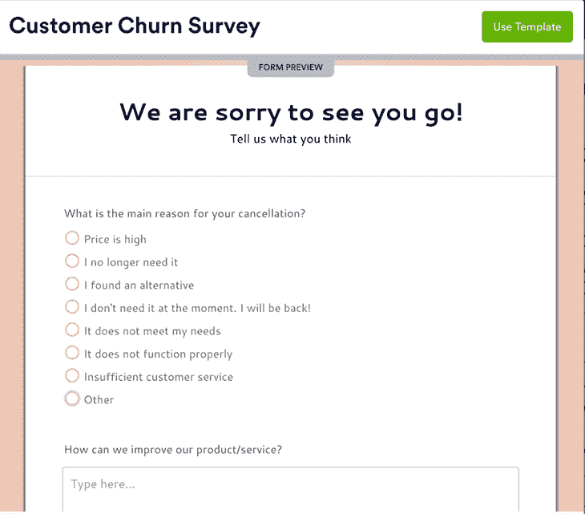

# 产品的顾客退出调查:如何问和问什么

> 原文：<https://blog.logrocket.com/product-management/customer-exit-surveys-for-products-how-what-to-ask/>

客户需求会随着时间的推移而变化，因此监控这些变化并解决客户对产品的任何关键问题非常重要。客户研究在其中起着至关重要的作用，而客户退出调查是其中最重要的一种。

在本文中，我们将讨论什么是客户退出调查，为什么以及何时使用它们，问什么，等等。

* * *

## 目录

* * *

## 什么是客户离职调查？

客户退出调查，有时也称为客户取消调查，是在客户取消订阅(或如果他们即将取消订阅)产品后向客户提供的问卷。

在本文中，当我们提到产品时，我们指的是数字产品，比如 SaaS(软件即服务)产品。

## 客户退出调查的用途是什么？

客户退出调查的目的是找出客户退订(或“倒掉”)的原因。

他们的目的不是发现所有的改进机会，而是发现导致客户流失的关键问题。通过找出这些问题是什么——它们是否与功能、缺陷、设计、支持、成本等相关——并解决它们，您将能够留住更多的未来客户。

使用客户退出调查来说服客户留下来是可能的，但这不是应该关注的事情。通常更好的办法是重建与前客户的关系，并努力重新获得他们，但我们将在后面更详细地讨论这一点。

客户退出调查还可以帮助团队确定他们应该努力满足哪些客户，哪些客户使用不同的产品可能会更好。这反过来帮助[团队微调他们的产品市场适合度(PMF)](https://blog.logrocket.com/product-management/what-is-product-market-fit-measure-examples/) 。

最后，客户退出调查可以跟踪一段时间内的流失率，揭示改进的有效性。

## 在客户的旅程中，您会在哪里使用该调查？

顾名思义，您应该在客户退订或“退出”产品时向他们提供客户退出调查。

重要的是要记住这个调查不是针对用户的。我们特别想听听客户的意见，除非是用户/消费者就是客户的 B2C 产品。最终，在这种情况下，重要的是顾客，他们是购买者和决策者。

这项调查也不是针对仍在使用该产品的客户，即使他们不满意，最终可能会流失，因为我们不只是想要反馈。我们特别想了解真正让客户退出的致命缺陷和最后一根稻草。

因此，考虑到所有这些因素，客户退出调查应该在产品的订阅取消流程中的某个地方进行，最好是在取消后的电子邮件中，或者在客户取消订阅后立即在应用程序中/现场进行。你可以从 VPN 提供商 [TunnelBear](https://www.tunnelbear.com/) 的例子中看到这一点:

通过在退出后进行调查，你会发现那些无法被拯救的真正的搅动者，但是[他们的洞察力将是极其有价值的](https://blog.logrocket.com/product-management/customer-feedback-why-you-should-seek-how-to-obtain/)。他们已经走了，所以问他们问题只会得到同样的结果或者更好的结果。你不会失去什么，但会收获很多。

然而，如果你在退出前展示调查，并试图用销售人员的语言留住客户，这会分散你的注意力，很难获得深刻的见解。你将花费更多的时间说服客户留下来，而不是了解问题，失去任何改善产品和防止更多流失的机会。不要进一步激怒客户，要确保他们对你的最后印象是积极的，因为这将有助于以后重新获得他们。

也就是说，一些客户确实会愤怒辞职——尤其是当他们遇到无法解决的问题时。这在免费试用用户中更常见，但是链接到相关的 FAQ 和帮助部分也无妨。

## 谁应该建议客户退出调查，为什么？

最好的产品团队是这样的团队，每个人都乐于钻研产品分析，发现改进的机会，并向团队提出任何问题。考虑到这一点，任何人都可以提出客户退出调查可能是必要的。

然而，通常是产品经理决定实施客户退出调查。他们通常在确认流失率有提高的空间，并且提高流失率会产生有价值的投资回报(ROI)后才这样做。

最好尽早实施客户退出调查(事实上，在你需要之前)，因为搅拌器的供应有一个天然的限制。不要等到所有人都搅拌好了。

## 产品经理需要哪些资源来开始工作？

进行客户退出调查所需的资源非常少。您只需要一个团队成员就可以完成这项工作(使用免费工具)，但是我将带您完成一个稍微理想一些的设置，在不同的团队成员之间划分职责。

### 分配角色

首先，也是最明显的，需要有人来写问题。没有必要让面试官问问题，因为调查是自由的，所以客户可以在自己的时间里自己填写。也就是说，谬误和偏见可以像找到答案一样找到问题的答案。不同的团队成员应该仔细阅读调查，以确保他们以正确的方式提出了正确的问题。

* * *

订阅我们的产品管理简讯
将此类文章发送到您的收件箱

* * *

实施调查很可能需要开发人员，尽管这是一次性的事情。

帮助编写问题的团队最有能力综合结果。然而，为了从多种角度有效地分析数据，最好是平均分配责任，而不是让一个人来领导。

最后，提名一个人(任何人或牵头人)在必要时跟进调查对象。

产品经理需要寻找合适的工具。这和任何调查工具一样简单。 [SurveyMonkey](https://www.surveymonkey.com/) 、 [Typeform](https://www.typeform.com/) 、 [Jotform](https://www.jotform.com/) 都是不错的选择，然而 [Google Forms](https://www.google.com/forms/about/) 也没什么问题，而且是免费的。

如果你更喜欢更适合产品研究的东西(有预先写好的但可定制的调查模板和其他用于研究和测试的模板/功能)，你肯定会想看看 [Useberry](https://www.useberry.com/) 、[迷宫](https://maze.co/)，或者街区里的新小子[棒球场](https://ballparkhq.com/)(由[漫威](https://marvelapp.com/)的牛人制作)。

这只是一个调查，所以不要过于纠结于比较工具。如果你对这些选项感到有点手足无措，就用谷歌表单吧。

### 决定激励措施

如果可能的话，产品经理还应该决定某种激励措施，以说服顾客接受调查。这种激励不应该与产品相关——你不想给人留下这样的印象，即你的唯一目标是吸引他们回来。表现出你想要他们的洞察力，而不是他们的钱，而是代表他们向慈善机构提供现金/代金券奖励或捐款。

让代表写一条发自内心的信息，表达对产品未能达到他们的期望的悲伤，解释为什么你希望他们参加调查，然后在向他们展示调查之前给他们提供激励。

## 在离职调查中我们应该问什么问题？

首先，确认回答者是决策者，而不仅仅是负责取消订阅的人。如果您使用的工具具有条件逻辑功能，那么如果被调查者不合格，您可以强制结束调查。

接下来，直截了当地问“是什么让你取消的？”这应该是一个开放式的定性问题，让受访者真正敞开心扉谈论主要问题，并立即让他们感到自己被倾听。[这里有一个来自 Jotform](http://jotform.com/form-templates/customer-churn-survey) 的很好的例子:

之后，你会想问“你喜欢这个产品的什么？”以及“您不喜欢该产品的哪些方面？”这只是大同小异，但如果我们真的想让受访者描绘出他们的经历，这是至关重要的。有了这些问题，受访者更有可能列出具体的不满，如程序错误或糟糕的客户支持互动。

“你会做出哪些具体的改进？”是一个奇妙的方法，可以消除一些猜测，使合成更容易。

“您将来会重新考虑我们的产品吗？如果会，需要什么？”本质上是第一个问题，但为了进一步的验证和更加关注以后可能发生的事情，而不是已经发生的事情，稍微做了一些调整。

"你认为谁是我们产品的理想客户？"更加关注产品与市场的契合度。这可能表明产品不符合目标市场的需求，或者你瞄准了错误的市场。

您希望让调查简短明了，以最大限度地完成调查，并最大限度地减少分析瘫痪(即有太多的数据需要分析)，但如果您认为还有更多问题要问，请随意添加一些额外的问题。

Rachel Andrea Go 的离职调查题库列出了一些很棒的额外问题。请记住，新信息不一定意味着有用的信息——注意你在问什么，不要让信息的 FOMO 打败你。之后你可以随时获取更多信息。

在结束调查时，记得收集受访者的电子邮件地址，以便您可以跟进他们的回答，稍后尝试重新获得他们的回答，和/或了解他们是否转投竞争对手以及原因。

## 如何将数据综合成可操作的见解

客户退出调查非常普遍，但只有少数能产生可操作的见解，而能产生积极行动的就更少了。重要的是，客户退出调查不要成为产品团队的打勾练习。这只会造成一种产品正在向前推进的错觉。这意味着正确地综合数据，将它们转化为可操作的见解，然后采取行动。

首先，浏览回答，并尝试将回答者分为三组:

*   那些认为他们需要产品，但并不需要的人。如果这不能归结为他们的错误，那么问题就是营销不善，非常简单的解决方法就是更好的营销——把这个方法传递给营销部门
*   那些需要产品的人，但产品没有交付。满足这个群体需要最大的投资
*   那些需要产品，但还没有。一般来说，这表明他们在观望，可能会轻松获胜

之后，你会想要综合数据，或者更具体地说，与群体相关的问题(在主要的“你为什么取消了？”问题)以使它们更容易消化，然后按大小对分组进行排序。解决最大的群体将满足最大的搅动者，当然，你将使用所有问题的所有定性数据。

接下来，投票决定先实施什么，考虑实施的容易程度和客户需求。参与所有正常的产品设计流程(例如，原型制作、测试等。).

## 现在怎么办？

团队已经完全实施了变更！现在怎么办？

首先，您需要确认流失率是否增加了，这需要一些时间。在此期间避免做任何改变，这样你就不会使实验无效。

在等待新数据积累的同时，通过联系最初提出问题的客户来获得一些定性反馈。为了一石二鸟，奖励他们在有限的时间内免费使用，并要求他们测试变化。谁知道呢，也许他们的免费使用权到期后会回来。

## 结论

也许你以前听说过客户退出调查，但从未实施过。也许你已经实施了一个，但没有实施一个研究结果并在此基础上做出积极改变的过程。或者，也许你是一个专业人士，不断寻找方法来改善他们的过程。

不管怎样，我希望你从这篇文章中学到了一些东西。如果你有任何自己的建议想要分享，你可以在下面的评论中提出来。感谢阅读！

*精选图片来源:[icon scout](https://iconscout.com/icon/customer-satisfaction-2047186)*

## [LogRocket](https://lp.logrocket.com/blg/pm-signup) 产生产品见解，从而导致有意义的行动

[LogRocket](https://lp.logrocket.com/blg/pm-signup) 确定用户体验中的摩擦点，以便您能够做出明智的产品和设计变更决策，从而实现您的目标。

使用 LogRocket，您可以[了解影响您产品的问题的范围](https://logrocket.com/for/analytics-for-web-applications)，并优先考虑需要做出的更改。LogRocket 简化了工作流程，允许工程和设计团队使用与您相同的[数据进行工作](https://logrocket.com/for/web-analytics-solutions)，消除了对需要做什么的困惑。

让你的团队步调一致——今天就试试 [LogRocket](https://lp.logrocket.com/blg/pm-signup) 。

[Daniel Schwarz Follow](https://blog.logrocket.com/author/danielschwarz/) Previously, design blog editor at Toptal and SitePoint. Now I advocate for better UX design alongside industry leaders such as Adobe, InVision, Marvel, Wix, Net Magazine, CreativeBloq, CSS-Tricks, and more.