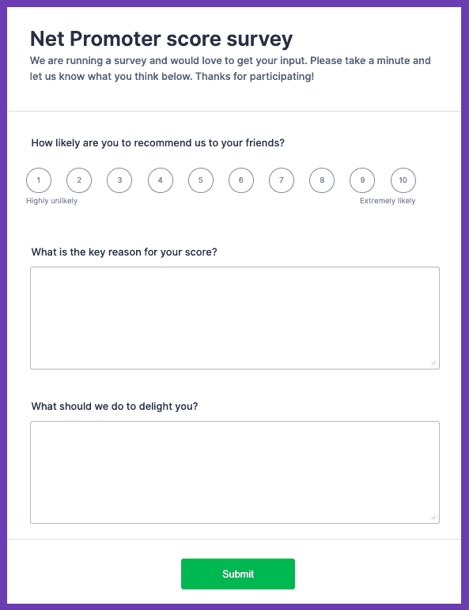
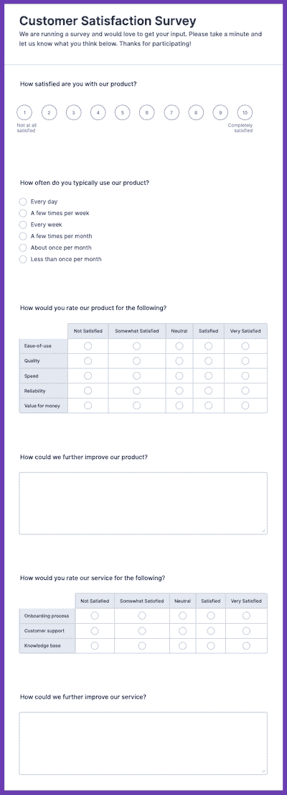
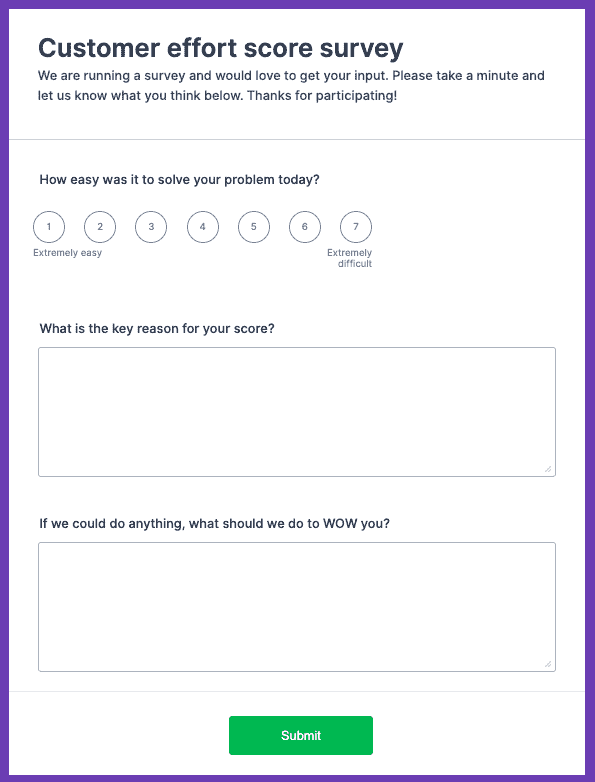
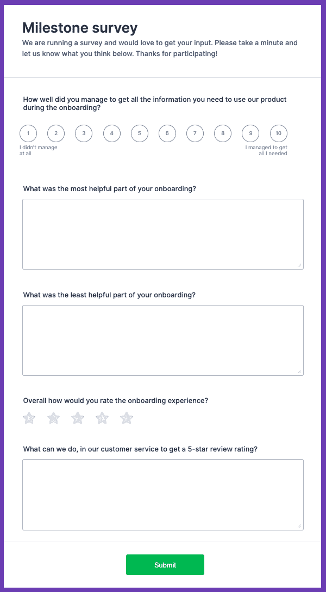

# 客户满意度调查模板、示例和问题

> 原文：<https://blog.logrocket.com/product-management/customer-satisfaction-survey-templates-examples-questions/>

在本指南中，我们将定义什么是客户满意度调查，分解产品团队应该旨在发现的信息，并概述编写和分发客户满意度调查的步骤和最佳实践，以生成可操作的见解。

* * *

## 目录

* * *

想象一下:你的公司销售一种增强歌手声音的产品。对于职业玩家和卡拉 ok 战士来说，这是一个真正的游戏改变者。

你已经有了一个不错的客户群，但你对他们的使用情况或整体体验一无所知。自然，你想扩大你的基础，所以你接触有影响力的人来推广产品。

在几周的无线电静默之后，你在收件箱里看到一条来自一个叫迈克尔·贾格尔的家伙的消息。他为自己的延迟回复道歉——他刚从可能是他乐队的告别巡演回来。

他附上了一个简短的视频剪辑，但内容并不是你所希望的。他唱道:

> *这个产品真烦人，* *怎么能激发我的想象力* *我得不到不，哦，不，不，不，不，嘿，嘿，嘿* *这就是我要说的* *我得不到不满意* *我得不到不满意* *因为我尝试，我尝试，我尝试，我尝试，我*

很明显，迈克尔并不急于推销你的产品。

他的反馈和客户反馈的普遍缺乏让你意识到你需要更多地了解你的用户对你的产品的看法——以及他们在使用它来实现他们的摇滚明星梦想时有多满意。

## 什么是客户满意度调查？

在当今以客户为中心、数据驱动的产品世界中，倾听和捕捉客户的声音至关重要。客户满意度调查有助于您了解客户的想法，以及他们对您的产品及其相关服务的感受。

客户满意度调查包括一系列关于[产品体验](https://blog.logrocket.com/product-management/what-is-product-experience-examples-how-to-improve-px/)的问题。

除了你从客户满意度调查中收集到的大量见解之外，一个额外的好处是，它会让客户觉得他们对你的产品有发言权，他们的反馈很重要。

还不信服？让我总结一下你能获得的额外回报。开展客户满意度调查使您能够:

*   了解你的客户
*   发现用户痛点
*   确定需要改进的地方
*   推动体验差异化
*   超越客户期望
*   改善客户关系

## 4 种客户满意度调查类型

有四种类型的客户满意度调查:

1.  [净推介值(NPS)](#net-promoter-score-nps)
2.  [客户满意度得分(CSAT)](#customer-satisfaction-score-csat)
3.  [客户努力得分(CES)](#customer-effort-score-ces)
4.  [里程碑调查](#milestone-surveys)

让我们进一步探究每种客户满意度调查类型。我们将列出一些你应该问的问题，并为每个问题提供一个模板。

净推广得分(NPS)和客户满意度得分(CSAT)是最重要的基准客户满意度指标。

NPS 是衡量客户体验和预测业务增长的成熟指标。

计算 NPS 的[公式为:](https://blog.logrocket.com/product-management/what-is-a-good-net-promoter-score-nps/#how-is-net-promoter-score-calculated)

*NPS = %的推动者-%的反对者*

促销员是你产品的积极的、经常性的用户和拥护者。诋毁者是那些对你的产品不满意的人，他们可能会通过负面的口碑损害你的产品和品牌。

根据创造 NPS 分数的贝恩公司的说法，一个好的 NPS 分数在 0-19 之间，一个好的分数在 20-49 之间，一个优秀的分数在 50-79 之间。如果你的 NPS 超过 80，你就是世界级的。

请记住，什么是好的 NPS 分数[取决于行业和市场](https://blog.logrocket.com/product-management/what-is-a-good-net-promoter-score-nps/#what-is-a-good-nps-score-depends-on-the-industry)。

#### NPS 调查问题示例

*   你有多大可能把我们的事告诉朋友？

#### NPS 调查模板

从 [Jotform](https://form.jotform.com/223154001941039) 访问此 [NPS 调查模板](https://form.jotform.com/223154001941039):

[Net Promoter Score (NPS) survey template](https://form.jotform.com/223154001941039)

### 2.客户满意度得分(CSAT)

[Customer Satisfaction Score (CSAT) survey template](https://form.jotform.com/223154174985058)

客户满意度得分(CSAT)提供了客户在使用您的产品时的快乐和满意程度。这既是通过 CSAT 分数的定量，也是通过解释数字的反馈的定性。

CSAT 的计算方法是将满意的客户数除以受访者总数。公式如下:

*CSAT 得分=满意的客户数量/受访者总数*

什么是好的 CSAT 分数？与 NPS 一样，它因行业和市场而异，尽管 CSAT 得分> 75%通常被认为是“好的”

#### CSAT 问题示例

*   您对我们的产品有多满意？
*   您通常多久使用一次我们的产品？
*   我们的产品能在多大程度上帮助您实现目标？

#### CSAT 调查模板

点击[此处](https://form.jotform.com/223154174985058)进入右侧显示的 [CSAT 调查表模板](https://form.jotform.com/223154174985058)。

### 3.客户努力得分(CES)

客户努力分数衡量客户在特定交互过程中体验到的易用性。

CES 数据是在互动发生后实时收集的，计算方法是将调查受访者总数除以回应总数。

对于回答，一些公司使用 1-5 分，另一些公司使用 1-7 分，对于什么是好的 CES，没有通用的基准。不过，总的来说，你可以说在量表中间的分数是正数。

#### CES 调查问题示例

*   使用我们的产品有多容易？
*   与我们公司互动的难易程度如何？
*   你还有什么想分享的可以改善你的体验吗？

#### CES 调查模板

点击[此处](https://form.jotform.com/223153970246354)获取[客户努力分数(CES)调查模板](https://form.jotform.com/223153970246354):

[Customer Effort Score (CES) survey template](https://form.jotform.com/223153970246354)

### 4.里程碑调查

与 NPS、CSAT 和 CES 调查相比，里程碑调查不围绕单一指标。这是一个更全面的调查，旨在收集有关特定主题的信息，例如，入职体验、产品开发想法或功能的可用性。

里程碑调查的分布或者基于时间，或者基于经验。

* * *

订阅我们的产品管理简讯
将此类文章发送到您的收件箱

* * *

#### 里程碑调查问题示例

*   根据您今天的体验，您会再次使用该功能吗？
*   在您看来，我们可以在功能上做哪些改进？
*   在我们的客户服务中，我们可以做些什么来获得 5 星评论评级？

#### 里程碑调查模板

此处提供了一个[里程碑调查模板](https://form.jotform.com/223153906601348):

[Milestone survey template](https://form.jotform.com/223153906601348)

## 3 个客户满意度问题类别

客户满意度调查中最重要的问题围绕以下三个类别:

1.  [客户人口统计](#customer-demographic)
2.  [产品用途](#product-use)
3.  [客户满意度](#customer-satisfaction)

### 1.客户人口统计

客户人口统计问题涵盖了确定客户身份的主要因素。从这些问题中收集的见解使您能够理解、验证和发展您的客户角色。

### 2.产品使用问题

产品使用问题是关于产品本身的问题。它们可以是关于导致实际购买的过程以及产品的实际使用、[功能](https://blog.logrocket.com/product-management/what-are-product-features-define-examples/)、服务或提供的支持。

从产品使用问题中收集的信息提供了对客户旅程、功能集和客户需求的洞察。

### 3.客户满意度问题

客户满意度问题旨在深入了解[产品体验](https://blog.logrocket.com/product-management/what-is-product-experience-examples-how-to-improve-px/)。这些问题更多地围绕着顾客使用产品时的心理。

通常，客户满意度问题旨在确定你的产品给用户的感觉。为什么他们在使用你的产品时会有这种感觉？什么能改变这种感觉？

这些见解让你很好地理解你的客户群的看法。

## 开放式和封闭式问题

现在，您已经知道了客户满意度调查的类型和要问问题的主题类别，让我们来看看客户满意度调查中常见的两种主要问题类型:

1.  [开放式问题](#open-ended-questions)
2.  [封闭式问题](#closed-ended-questions)

### 开放式问题

开放式问题旨在找出客户的想法，并了解所采取行动背后的背景。这种类型的问题允许客户提供更长、更全面的答案。

开放式问题通常以如下开头:

*   “为什么……”
*   “如何…”
*   “什么……”
*   “描述…”
*   “告诉我关于……”

当您希望通过真正了解客户对某个话题的感受和态度，更好地了解如何实现客户满意度时，最好使用开放式问题。

### 封闭式问题

封闭式问题只能通过选择预先填充的答案来回答。当你需要定量数据，需要对回答者和回答进行分类，或者你的听众对这个话题不感兴趣时，它们会非常有用。

封闭式问题可以是静态的，也可以是动态的——动态意味着对封闭式问题的回答会影响接下来要提出的问题。

封闭式问题有四种常见形式:

1.  [名词性问题](#nominal-questions)
2.  [顺序问题](#ordinal-questions)
3.  [区间题](#interval-questions)
4.  [比率问题](#ratio-questions)

#### 1.名词性问题

**名词性问题**用于衡量包含互斥属性的类别，例如，行业类型(农业、教育、金融服务等。).

#### 2.顺序问题

序数问题用于排列顺序，意味着下一个值大于前一个值。重要的是顺序；这两个值之间的差异无关紧要。

语义差别疑问句是顺序疑问句的一个例子。语义差异问题的答案位于两个相反特征之间的多点评级尺度上，例如爱和恨。

另一个例子是[李克特量表问题](https://en.wikipedia.org/wiki/Likert_scale)，尽管它有时被视为[区间问题](#interval-questions)。

李克特量表问题可能看起来类似于语义差异问题，不同之处在于它服务的目的。当语义差异问题谈论一个特征时，李克特量表问题旨在了解与陈述一致或不一致的程度。

#### 3.区间问题

区间问题以多点量表的形式呈现，要求回答者指出他们处于哪一点。因此，顺序问题和区间问题可能看起来相似，但还是有区别的。顺序问题不会在两个连续的步骤之间呈现相等的分裂或差异，而在区间问题中，相等的分裂或差异是显而易见的。

#### 4.比率问题

比率问题是下一个层次。尽管名词性问题可以分类，顺序性问题可以分级，顶部的区间问题有相等的区间，比率性问题有一个真正的零。

封闭式问题可以以复选框、多项选择、下拉列表或评分标准的形式呈现。

## 撰写客户满意度调查的 5 个技巧

创建一个客户愿意填写和提交的调查是一门艺术。为了获得良好的回复率，请遵循以下最佳实践:

1.  从心中的目标开始
2.  [提出有用且可行的问题](#ask-useful-and-actionable-questions)
3.  [不要问引导性问题](#dont-ask-leading-questions)
4.  [集中你的问题](#focus-your-questions)
5.  [限制问题数量](#limit-the-number-of-questions)

### 1.从心中的目标开始

通过定义调查的目标开始调查创建过程。你想从调查中得到什么？

清楚地了解目标将有助于确定调查流程，并确定要包含的问题。

### 2.提出有用且可行的问题

你是在要求你的客户花一些宝贵的时间来提供信息。花时间确定你实际上在问客户什么。

调查的目的是什么，什么问题会产生最有用、可操作和可测量的信息？

### 3.不要问引导性的问题

你知道他们是怎么说假设的，受影响的见解是没用的。当你相信你的产品的一个特性是自切片面包以来最伟大的东西时，就很难提出客观的、非引导性的问题。

退一步，制定客观问题，避免使用最高级。

### 4.集中你的问题

涵盖一个以上主题的问题令人困惑，并扭曲数据。当问题不清楚时，很难判断客户实际上在回答什么。

### 5.限制问题的数量

请记住，您是在请求客户帮助您，并且您希望他们完成调查。如果他们中途放弃，你永远不知道他们想说什么。

限制问题的数量，挑战自己只问真正重要的问题。

## 分发客户满意度调查的 3 种方式

收集客户满意度洞察的最大挑战是让您的客户真正参与进来。通过接触尽可能多的客户，可以部分降低这种风险。

为了进一步降低风险，值得花些时间考虑样本大小和分布方式，以获得最高的响应率。

如何分发调查有许多选择，例如通过博客帖子、电话、短信或应用程序本身的提示。

在数字时代，有三种分发客户满意度调查的常用方法:

1.  [二维码](#qr-codes)
2.  [网站](#website)
3.  [电子邮件](#email)

### 1.二维码

QR 码是链接的可视化图形，可以用 QR 阅读器读取。

使用二维码的好处在于，你可以轻松地在网站上或在纸张、贴纸和其他印刷品上使用它们。这样做的主要好处是没有额外的费用要分发，而且很容易接触到大量的观众。

### 2.网站(全球资讯网的主机站)

无论是通过弹出窗口、标注，还是使用普通的旧文本或由图像或视频支持的调查，网站都是收集客户满意度反馈的有效方式。

在您的网站上发布客户调查问题的好处是，当客户已经确认他们的兴趣时，可以显示调查。这减少了调查的侵扰，增加了完成的机会。

### 3.电子邮件

过去用邮件做的事现在用电子邮件做了。这种方法可能仍然是最流行的方法之一。

通过电子邮件分发客户满意度调查的好处是易于设置、个性化和自动化，而且成本很低。

## 摘要

在产品管理方面，我们要赢得胜利。只有当你收到顾客的反馈并了解他们对你的产品有多满意时，你才能赢。

NPS、CSAT、CES 和里程碑调查等客户满意度调查是获得成功所需洞察力的绝佳工具。这四种类型涵盖了客户人口统计、产品使用和满意度问题。问题要么是封闭式的，要么是开放式的，要么是封闭式和开放式问题的混合。

*精选图片来源:[icon scout](https://iconscout.com/icon/customer-satisfaction-2047186)*

## [LogRocket](https://lp.logrocket.com/blg/pm-signup) 产生产品见解，从而导致有意义的行动

[LogRocket](https://lp.logrocket.com/blg/pm-signup) 确定用户体验中的摩擦点，以便您能够做出明智的产品和设计变更决策，从而实现您的目标。

使用 LogRocket，您可以[了解影响您产品的问题的范围](https://logrocket.com/for/analytics-for-web-applications)，并优先考虑需要做出的更改。LogRocket 简化了工作流程，允许工程和设计团队使用与您相同的[数据进行工作](https://logrocket.com/for/web-analytics-solutions)，消除了对需要做什么的困惑。

让你的团队步调一致——今天就试试 [LogRocket](https://lp.logrocket.com/blg/pm-signup) 。

[Klaas Hermans Follow](https://blog.logrocket.com/author/klaashermans/) Lifetime in digital and innovation, ensuring value delivery. I enjoy energizing and motivating teams that create and exceed product expectations.