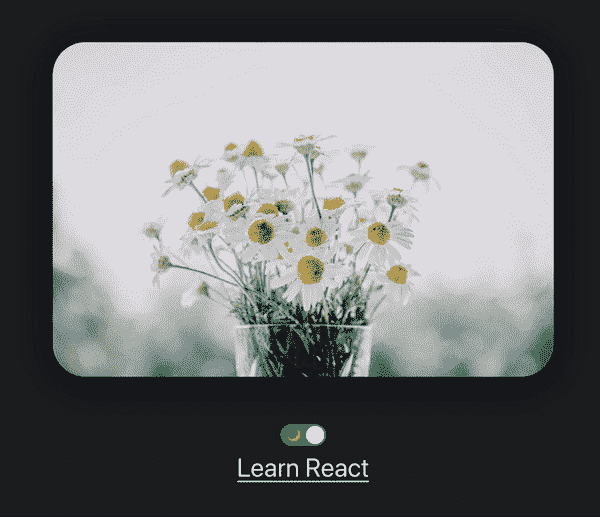

# React 中的黑暗模式:深度指南

> 原文：<https://blog.logrocket.com/dark-mode-in-react-an-in-depth-guide/>

随着我们一天天向更好、更易访问的用户体验迈进，黑暗模式已经成为网络应用的主流功能。说到黑暗模式的开发，它不仅仅是添加一个简单的切换按钮和管理 CSS 变量。这里我们将讨论在 React app 中创建一个完整的黑暗模式体验。

以下是我们将要介绍的内容:

*   使用系统设置
*   使用 CSS 变量管理主题
*   使用 react-toggle 实现颜色方案切换
*   使用 use-persisted-state 存储用户首选模式
*   选择适合更广泛受众的颜色组合
*   在黑暗模式下处理图像

你可以在 Github 上找到[演示应用](https://sleepy-yalow-542f99.netlify.app/)和[它的代码](https://github.com/zsajjad/dark-mode-sample)。

## 使用系统设置

没有人想在用户登陆他们的网站时伤害他们的眼睛！最佳做法是根据设备的设置来设定应用程序的主题。CSS 媒体查询，通常用于响应式设计，也帮助我们检查其他设备特性。

这里我们将使用`[prefers-color-scheme](https://developer.mozilla.org/en-US/docs/Web/CSS/@media/prefers-color-scheme)`，根据设备选择的配色方案给出`dark`、`light`或`no-preference`。

即使是最简单的形式，这也能帮助我们为网络应用添加黑暗模式:

```
@media (prefers-color-scheme: dark) {
  background-color: #1F2023
  color: #DADADA
}

```

与任何其他媒体查询一样，当设备的配色方案设置为深色时，将应用此块中的样式。将它放在一些组件样式中，看起来会像这样:

```
import { styled } from '@linaria/react';

const Text = styled.p`
  margin: 12px;
  color: #1F2023;
  background-color: #FAFAFA;
  @media (prefers-color-scheme: dark) {
    background-color: #1F2023
    color: #DADADA
  }
`;

```

这是一个好的开始，但是你不能在每个组件中添加这些样式。在这种情况下， [CSS 变量](https://blog.logrocket.com/how-to-use-css-variables-like-a-pro/)就是答案。

## 使用 CSS 变量管理主题

CSS 变量是 web 样式中很久很久以前就缺少的一个工具。现在所有的浏览器都可以使用 CSS 了，CSS 变得更有趣，痛苦也更少了。

CSS 变量的作用域是声明它们并参与级联的元素(即元素是子元素的覆盖值)。

我们可以利用 CSS 变量[来定义应用程序的主题](https://blog.logrocket.com/how-to-create-better-themes-with-css-variables-5a3744105c74/)。这里有一个小片段来回忆 CSS 变量是如何声明的:

```
body {
  --color-background: #FAFAFA;
  --color-foreground: #1F2023;
}

```

为了在我们的组件中使用这些变量，我们将用变量交换颜色代码:

```
const Text = styled.p`
  margin: 12px;
  color: var(--color-foreground);
  background-color: var(--color-background);
`;

```

现在，我们的颜色是通过 CSS 变量定义的，我们可以在 HTML 树的顶部更改值(例如，`<body>`)，并且可以在所有元素上看到反射:

```
body {
  --color-background: #FAFAFA;
  --color-foreground: #1F2023;

  @media (prefers-color-scheme: dark) {
    --color-background: #1F2023;
    --color-foreground: #EFEFEF;
  }
}

```

## 实现配色方案切换

此时，我们有了最简单的解决方案，它基于设备的偏好。现在，我们必须针对本身不支持黑暗模式的设备对其进行扩展。

在这种情况下，我们必须让用户能够轻松地为我们的 web 应用程序设置偏好。我选择了[反应-切换](https://github.com/aaronshaf/react-toggle)来使我们的解决方案在 a11y 时更好，并且美观。这可以通过简单的`button`和`useState`来实现。


下面是我们的 toggle 组件的外观:

```
import React, { useState } from "react";
import Toggle from "react-toggle";

export const DarkModeToggle: React.FC = () => {
  const [isDark, setIsDark] = useState<boolean>(true);

  return (
    <Toggle
      className="dark-mode-toggle"
      checked={isDark}
      onChange={({ target }) => setIsDark(target.checked)}
      icons={{ checked: "🌙", unchecked: "🔆" }}
      aria-label="Dark mode toggle"
    />
  );
};

```

这个组件将保存用户选择的模式，但是默认值呢？我们的 CSS 解决方案尊重设备的偏好。为了在 react 组件中获取媒体查询结果，我们将利用 [react-responsive](https://github.com/contra/react-responsive) 。在幕后，它使用`[Window.matchMedia()](https://developer.mozilla.org/en-US/docs/Web/API/Window/matchMedia)`并在查询的输出改变时重新呈现我们的组件。

该按钮的更新版本如下所示:

```
import React, { useState } from "react";
import Toggle from "react-toggle";

export const DarkModeToggle: React.FC = () => {
  const [isDark, setIsDark] = useState<boolean>(true);

  const systemPrefersDark = useMediaQuery(
    {
      query: '(prefers-color-scheme: dark)',
    },
    undefined,
    (isSystemDark: boolean) => setIsDark(isSystemDark)
  );

  return (
    <Toggle
      className="dark-mode-toggle"
      checked={isDark}
      onChange={({ target }) => setIsDark(target.checked)}
      icons={{ checked: "🌙", unchecked: "🔆" }}
      aria-label="Dark mode toggle"
    />
  );
};

```

`useMediaQuery`钩子接受一个查询、初始值和一个`onChange`处理程序，每当查询的输出发生变化时，这个处理程序就会被触发。

## 在浏览器中模拟黑暗模式

现在，我们的组件将与设备的首选项同步，并且它的值将相应地更新。但是我们如何测试它是否做对了呢？

由于开发人员友好的浏览器，我们可以从浏览器检查器模拟设备偏好；这是它在 Firefox 中的样子:


是时候将我们的切换组件的状态更改连接到 CSS 了。这可以通过几种不同的技术来实现。这里，我们选择了最简单的一个:在根 HTML 标签上添加一个类，让 CSS 变量完成剩下的工作。

为了适应这种情况，我们将更新 body 标签的 CSS:

```
body {
  --color-background: #FAFAFA;
  --color-foreground: #1F2023;

  &.dark {
    --color-background: #1F2023;
    --color-foreground: #EFEFEF;
  }
}

```

下面是我们根据状态添加和删除类的效果:

```
...
useEffect(() => {
  if (isDark) {
    document.body.classList.add('dark');
  } else {
    document.body.classList.remove('dark');
  }
}, [isDark]); 
...

```

## 使用 use-persisted-state 存储用户的首选模式

如果我们在组件的状态中保留用户偏好的配色方案，这可能会有问题，因为我们将无法获取该组件之外的值。此外，一旦我们的应用程序再次安装，它就会消失。这两个问题可以用不同的方式解决，包括用 React Context 解决[或者任何其他状态管理方法。](https://blog.logrocket.com/a-deep-dive-into-react-context-api/)

另一个解决方案是使用[使用持久状态](https://github.com/donavon/use-persisted-state)。这将有助于我们满足所有要求。当应用程序在浏览器的不同标签中打开时，它使用`localStorage`保持状态并保持状态同步。

我们现在可以在一个自定义钩子中移动我们的黑暗模式状态，该钩子封装了与媒体查询和持久状态相关的所有逻辑。这个钩子应该是这样的:

```
import { useEffect, useMemo } from 'react';
import { useMediaQuery } from 'react-responsive';
import createPersistedState from 'use-persisted-state';

const useColorSchemeState = createPersistedState('colorScheme');

export function useColorScheme(): {
  isDark: boolean;
  setIsDark: (value: boolean) => void;
} {
  const systemPrefersDark = useMediaQuery(
    {
      query: '(prefers-color-scheme: dark)',
    },
    undefined,
  );
  const [isDark, setIsDark] = useColorSchemeState<boolean>();
  const value = useMemo(() => isDark === undefined ? !!systemPrefersDark : isDark,
    [isDark, systemPrefersDark])
  useEffect(() => {
    if (value) {
      document.body.classList.add('dark');
    } else {
      document.body.classList.remove('dark');
    }
  }, [value]);
  return {
    isDark: value,
    setIsDark,
  };
}

```

切换按钮组件现在将更加简单:

```
/**
 *
 * ColorSchemeToggle
 *
 */
import Toggle from 'react-toggle';
import { useColorScheme } from 'platform/ColorScheme';
import { DarkToggle } from './Styled';

const ColorSchemeToggle: React.FC = () => {
  const { value, setValue } = useColorScheme();
  return (
    <DarkToggle>
      <Toggle
        checked={value === 'dark'}
        onChange={(event) => setValue(event.target.checked ? 'dark' : 'light')}
        icons={{ checked: '🌙', unchecked: '🔆' }}
        aria-label="Dark mode"
      />
    </DarkToggle>
  );
};

export default ColorSchemeToggle;
```

## 选择深色主题颜色

虽然黑暗模式本身可以被认为是[一个辅助功能](https://blog.logrocket.com/a-developers-guide-to-designing-accessible-websites/)，我们应该专注于保持这个功能对更广泛的受众是可访问的。

我们在演示中利用了 react-toggle 来确保用于改变配色方案的按钮遵循所有 a11y 标准。另一个重要的部分是在暗模式和亮模式下背景色和前景色的选择。在我看来， [colors.review](https://color.review/) 是测试颜色间对比度的绝佳工具；拥有 AAA 级使我们的应用程序更容易导航，看起来更舒服。



## 在黑暗模式下处理图像

为了更好的美观，我们通常有明亮图像的页面。在黑暗模式下，明亮的图像可能会让用户感到不适。

有几种技术可以避免这些问题，包括对两种模式使用不同的图像以及改变 SVG 图像的颜色。一种方法是对所有图像元素使用 CSS 滤镜；当明亮的图像出现在用户的画布上时，这将有助于降低眼睛的疲劳。

为此，我们的全局样式如下所示:

```
body {
  --color-background: #FAFAFA;
  --color-foreground: #1F2023;

  --image-grayscale: 0;
  --image-opacity: 100%;

  &.dark {
    --color-background: #1F2023;
    --color-foreground: #EFEFEF;

    --image-grayscale: 50%;
    --image-opacity: 90%;
  }
}

img,
video {
  filter: grayscale(var(--image-grayscale)) opacity(var(--image-opacity));
}

```

## 结论

如今，web 应用程序中的可访问性不仅仅是一个实用工具。相反，这是基本要求之一。在这方面，当实现时，黑暗模式应该被认为是一个需要更多关注的完整功能，就像任何其他关键功能一样。

在本文中，我们建立了一种方法来最大限度地实现黑暗模式；如果你觉得我错过了什么，请在评论中告诉我。

## [LogRocket](https://lp.logrocket.com/blg/react-signup-general) :全面了解您的生产 React 应用

调试 React 应用程序可能很困难，尤其是当用户遇到难以重现的问题时。如果您对监视和跟踪 Redux 状态、自动显示 JavaScript 错误以及跟踪缓慢的网络请求和组件加载时间感兴趣，

[try LogRocket](https://lp.logrocket.com/blg/react-signup-general)

.

[ ](https://lp.logrocket.com/blg/react-signup-general) [](https://lp.logrocket.com/blg/react-signup-general) 

LogRocket 结合了会话回放、产品分析和错误跟踪，使软件团队能够创建理想的 web 和移动产品体验。这对你来说意味着什么？

LogRocket 不是猜测错误发生的原因，也不是要求用户提供截图和日志转储，而是让您回放问题，就像它们发生在您自己的浏览器中一样，以快速了解哪里出错了。

不再有嘈杂的警报。智能错误跟踪允许您对问题进行分类，然后从中学习。获得有影响的用户问题的通知，而不是误报。警报越少，有用的信号越多。

LogRocket Redux 中间件包为您的用户会话增加了一层额外的可见性。LogRocket 记录 Redux 存储中的所有操作和状态。

现代化您调试 React 应用的方式— [开始免费监控](https://lp.logrocket.com/blg/react-signup-general)。