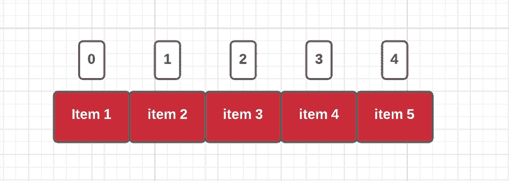
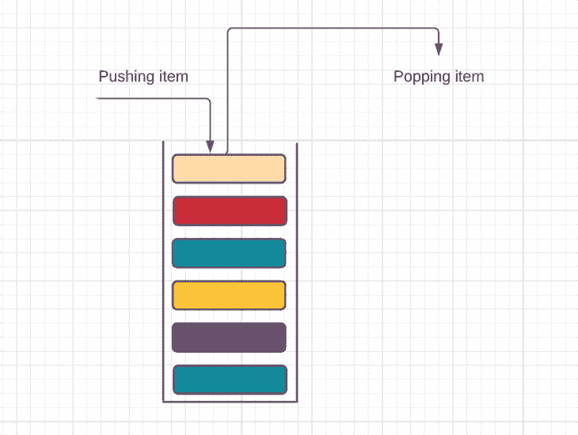

# Dart 和颤振数据结构:综合指南

> 原文：<https://blog.logrocket.com/dart-flutter-data-structures-comprehensive-guide/>

这可能不是你第一次听说数据结构。作为一名有经验的开发人员，您可能在其他编程语言中或者甚至在 Dart 编程语言本身中分别使用过它们。

数据结构是软件开发和计算机科学的核心。它们是构建不同复杂程度的系统的重要基础之一。

随着 Dart 以惊人的速度增长，主要是由于流行的 Flutter 框架，清楚地理解这种语言中可用的数据结构以及如何使用它们执行操作变得很重要。

让我们继续探索并在构建 Dart 或 Flutter 应用程序时会遇到的各种数据结构上执行一些 CRUD 操作。

## 先决条件

*   [飞镖](https://blog.logrocket.com/introduction-to-using-dart-in-flutter/)的基础知识
*   [Dart SDK](https://dart.dev/get-dart) 安装在您的机器上
*   您选择的任何文本编辑器或 IDE！

## 目录

列表是作为单个实体存储和引用的数据的有序集合。列表中的每个元素都通过其索引来访问，索引指的是它的位置。索引从`0`开始，延续到`n - 1`，其中`n`是列表的长度。



列表的一些实际使用案例是:

*   存储您的浏览历史
*   在音乐播放器中存储歌曲或在视频播放器中存储视频
*   在浏览器上导航网页

当数据动态增长时，列表最适合。列表中项目的排列由它们的添加顺序决定。这意味着第一个添加的元素具有索引`0`，第二个添加的元素具有索引`1`，等等。

在 Dart 中，列表可以是可增长的，也可以是固定长度的。您可以在创建列表时指定这一点，方法是将列表的`growable`属性设置为`true`或`false`。

当列表设置为`growable`时，列表的大小是灵活的。在这种情况下，您可以向列表中添加项目，增加其容量以容纳这些项目。

另一方面，固定长度列表保留您在创建时指定的确切长度。试图直接或通过列表操作如`add`或`remove`改变其大小将导致错误。

## 创建一个空的可增长列表

```
// Creating an empty list in a non-null-safe program.
var list = List();
 print(list); // []
 list.add(1);
 print(list); // [1]
 list.add(2);
 print(list); // [1, 2]

// Creating an empty list in a null-safe program.
 var nullSafeList = List.empty(growable: true);
  print(nullSafeList); // []
  nullSafeList.add(1);
  print(nullSafeList); // [1]
  nullSafeList.add(2);
  print(nullSafeList); // [1, 2]

```

在上面的代码块中，我们演示了两种创建空的可增长列表的技术。Dart 团队否决了创建空列表的`List()`方法，这种方法不能应用于[空安全程序](https://dart.dev/null-safety)。他们用空白方括号`[]`代替了这种技术。

因此，如果您想要创建一个空的可增长列表，建议您使用上面示例中显示的空白方括号样式。

## 创建固定长度的列表

有时，您希望确保列表的长度在程序的整个生命周期中不会改变。以下示例显示了如何通过创建固定长度的列表来实现这一点:

```
// Creating a list with a fixed length.
var list = List.filled(3, 0);
print(list); // [0, 0, 0]
list[1] = 3;
print(list); // [0, 3, 0]
list.add(1); // error
```

在上面的例子中，我们用变量`filled`的构造函数初始化了变量`list`，用相同的值填充列表。构造函数中的第一个参数是列表的长度，第二个参数表示列表中元素的初始值。

这个构造函数还接受一个可选的数据类型为`bool`的第三个参数，您可以用它来设置列表的`growable`属性。默认情况下，这个属性是`false`，意味着长度是固定的。传递`true`将使列表的大小变得灵活，您可以调用改变列表长度的操作。

否则，也就是说，如果将`growable`保留为默认值(即`false`，则长度不能发生变化。这意味着我不能在列表中添加新元素或删除元素，因为这会改变列表的大小或长度。我只能修改列表中现有元素的值，或者执行任何其他不改变大小的操作。

调用任何改变上面列表长度的操作都会抛出一个错误。

## 创建具有初始化值的列表

您也可以创建一个列表，同时为其赋值。

```
var list = [1,2,3,4,5,6];
print(list); // [1,2,3,4,5,6]

```

## 为相同数据类型的项目创建列表

我们上面举例说明的例子是可以包含不同类型数据的列表。这意味着您可以拥有`int`、`String`、`bool`等类型的数据。，在同一个列表中。

List 是一个[通用数据类型](https://dart.dev/guides/language/language-tour#generics)，可以包含严格相同数据类型的元素。

```

// creating a list of Strings with a fixed length of 5 and all // elements have initial values - "foo";
  var stringList = List<String>.filled(5, "foo");
  print(stringList); // [foo, foo, foo, foo, foo]
  stringList[4] = "bar";
  print(stringList); // [foo, foo, foo, foo, bar]
//   stringList[2] = 3; // error

 // creating a growable list of integers.
var intList = List<int>.empty(growable: true);
  print(intList); // []
  intList.add(3);
  print(intList); // [3]
//   intList.add("doe"); // error

```

## 从列表中检索项目

请记住，列表中的项目是使用它们的索引来标识的。要从列表中获取一个项目，可以使用它的索引来定位这个项目。

* * *

### 更多来自 LogRocket 的精彩文章:

* * *

```
var values = [10, 20, 30, 40, 50, 60, 70, 80, 90, 100];

// using the index to retrieve its respective element.
print(values[3]); // 40
print(values[7]); // 80
print(values[0]); // 10

// using a for loop to access an array
for(int i = 0; i < values.length; i++ ){
  print("The element in index $i is ${values[i]}");
}
Output
/**  
The element in index 0 is 10
The element in index 1 is 20
The element in index 2 is 30
The element in index 3 is 40
The element in index 4 is 50
The element in index 5 is 60
The element in index 6 is 70
The element in index 7 is 80
The element in index 8 is 90
The element in index 9 is 100  
**/
```

## 修改列表中的项目

您还可以通过索引将新值重新分配给所需项目来更改列表中的值。

```
var values = [10, 20, 30, 40, 50, 60, 70, 80, 90, 100];

// using the index to retrieve its respective element.
print(values[3]); // 40
print(values[7]); // 80
print(values[0]); // 10

// modifying an item in the list by reassigning a new value to each //index 
values[3] = 12; 
values[7] = 19;
values[0] = 38;

print(values[3]); // 12
print(values[7]); // 19
print(values[0]); // 38
```

## 修改列表中的项目范围

您还可以使用`setAll()`方法修改列表中的项目序列。这个方法有两个参数:第一个是要修改的内容的起始索引，第二个是包含新值的列表。

请注意，新列表的长度不得大于从起始索引可获得的长度。否则，应用程序将抛出一个错误。

```
var values = [10, 20, 30, 40, 50, 60, 70, 80, 90, 100];
print(values); // [10, 20, 30, 40, 50, 60, 70, 80, 90, 100]

// modifying the items in the list by reassigning a new values 
  values.setAll(4, [1,3,4,5,6]);
  print(values); // [10, 20, 30, 40, 1, 3, 4, 5, 6, 100]
```

## 从列表中删除项目

您可以使用`remove()`方法从列表中删除一个元素。此方法删除列表中项的第一个实例。

```
var values = [15, 16, 17, 18, 19, 20, 21, 22, 23, 24];
print(values); // [15, 16, 17, 18, 19, 20, 21, 22, 23, 24]

// remove an instance of 18\. This removes the first occurence of the instance in the list.  
values.remove(18);
print(values); // [15, 16, 17, 19, 20, 21, 22, 23, 24]

// remove the value at index 8  
values.removeAt(8);
print(values); // [15, 16, 17, 19, 20, 21, 22, 23]

// remove items that meet a condition, in this case even numbers.  
values.removeWhere((int num) => num % 2 == 0);   
 print(values); [15, 17, 19, 21, 23]

  // remove items between index 1 and 3
  values.removeRange(1,4);
  print(values); // [15, 23]

  // remove the last item in the list.
  values.removeLast();
  print(values); // [15]
```

## 迭代一个列表

您可以通过使用列表的`for loop`或`forEach()`方法来遍历列表中的项目。

```
var values = [15, 16, 17, 18, 19, 20, 21, 22, 23, 24];

  // iterating with for loop
 for(int i = 0; i < values.length; i++){
   print(values[i]);
 }

  // Iterating with for each method
  values.forEach((int num) => print(num));

```

您还可以使用`Iterator`实例遍历列表，这允许您对列表中的每个项目执行操作。

```
 var iterator = values.iterator;
 while(iterator.moveNext()){
  print(iterator.current);
 }
```

## 打乱列表

Dart 中的列表有一个隐式的`shuffle`方法，您可以调用它来打乱列表中的项目。

```
var values = [15, 16, 17, 18, 19, 20, 21, 22, 23, 24];
print(values);

values.shuffle();
 print(values);
```

## 颤振数据结构:地图

映射是存储为键值对的项目的动态通用集合。键是唯一的实体，用于引用和检索它们各自的值。

这些键和值也称为条目，可以是您在创建地图或使其动态化时选择声明的任何数据类型。您需要对这些值进行的任何交互都需要通过它们各自的键来访问它们。

地图数据结构的一些实际使用案例有:

*   字典——单词是关键，意义是价值
*   你的联系人列表——联系人的名字可以被认为是关键，而完整的联系信息，则是价值
*   您还可以在创建银行系统时使用它，其中帐号是键，帐户实体或详细信息是值

### 创建空地图

您可以通过以下两种方式之一创建空地图:

### 初始化地图中的值

当使用文字创建技术时，也可以初始化映射的值。

```
var map = {"name": "dami", "age": "10"};
print(map);
```

### 向地图添加条目

请记住，每个条目都包含一个键及其各自的值。向映射中添加条目时，可以在方括号中指定键，并为其赋值。您还可以使用`addAll()`方法将不同地图对象中的条目集合添加到您想要的地图中。

同样，如果提供的键在 map 中不存在，您可以使用`putIfAbsent()`方法添加一个条目。

```
var map = {};
print(map);

// adding an entry whose key is "name" and value is "dami"
map["name"] = "dami";
print(map);
// adding an entry whose key is "age" and value is 10
map['age'] = 10;
print(map);

//adding a collection of entries  
map.addAll({"school": "semicolon", "degree": "Bsc"});
print(map);

//adding an entry if the key does not already exist
map.putIfAbsent("school", () => "semicolon");
print(map);

```

### 检索条目的值

使用条目的键作为对它的引用来检索条目的值。

```
var map = {'name': 'dami', 'age': 10};
print(map['name']);

var nameValue = map['name'];
print(nameValue);  

```

### 更新地图中的条目

您可以通过键给条目重新分配一个新值来更新条目的值。

```
 var map = {'name': 'dami', 'age': 10};
  print(map['name']);

// assigning a new value to the key
  map['name'] = 'john';
  print(map['name']);
```

### 从地图中删除条目

您可以通过调用`remove()`方法从地图对象中移除键。此方法将键作为参数，并删除具有匹配键及其相应值的条目。

```
 var map = {
    'ten': 10,
    'eleven': 11,
    'twelve': 12,
    'thirteen': 13,
    'fourteen': 14,
    'fifteen': 15,
    'sixteen': 16
    };

  map.remove('twelve');
  print(map);
```

您还可以使用`removeWhere()`删除符合特定条件的条目。该方法采用一个双参数函数来执行其任务。函数中的第一个参数表示键，第二个参数表示值。

在下面的例子中，我们删除了所有以字符`t`开头的偶数值和键。

```
 // remove all entries with even number values
  map.removeWhere((key, value) => value % 2 == 0);
  print(map);

  //remove all entries with key starting with 't'
  map.removeWhere((key, value) => key.startsWith('t'));
  print(map);
```

## 创建包含特定数据类型的地图

您可以创建包含已定义数据类型的键和值的映射。例如，您可能希望您的映射包含数据类型为`String`和值为`int`的键。下面是一个例子，告诉你如何去做:

```
Map<String, int> map = {'first': 10, 'second': 20, 'third': 30, 'fourth': 40};

map['fifth'] = 50;

print(map);  

map['sixth'] = "value" // error  

// defining the data types via the constructor
var secondMap =  Map<String, int>();
secondMap['name'] = 5;
print(secondMap); // {name: 5}

secondMap['age'] = 'six'; //error

```

在上面的例子中，添加一个数据类型为`String`的值将会抛出一个错误，因为我们已经指定在 map 中只接受`int`值。

## 遍历地图

您可以使用`forEach()`或`for...in`技术遍历地图。

```
// iterating through the keys of the map using the for...in loop to print all the values  
for(String k in map.keys){
  print(map[k]);
}
```

在上面的`for...in`循环示例中，我们遍历了 map 中的键。对于每次迭代，我们获取每个键，将其存储在变量`k`中，并使用它来打印地图中的值。

`forEach()`方法采用一个双参数函数，正如我们用`removeWhere()`方法描述的那样。使用`forEach()`方法允许您同时对键和值执行操作。

```
map.forEach((key, value) {print("key = $key, value = $value");});

// key = ten, value = 10
// key = eleven, value = 11
// key = twelve, value = 12
// key = thirteen, value = 13
// key = fourteen, value = 14
// key = fifteen, value = 15
// key = sixteen, value = 16

```

## 颤振数据结构:集

集合是独特物品的集合。与列表不同，集合是特别独特的数据结构，可以确保集合中不存在重复的值。

集合的一个非常常见的真实用例是检查两个集合的交集。也就是说，您可以有效地获得两个集合共有的元素。下面是说明这一点的一个片段:

```
 Set set = {1,2,3,4,5, 6};
  Set other = {5,6,7,8};
  print(set.intersection(other)); // {5,6}
```

集合最适合于存储其顺序作为变量并不重要的唯一值。下面我们将详细介绍三种类型的器械包:

### HashSet

这种类型的集合没有指定的迭代顺序。`hashcode`和`equalTo()`方法决定集合中项目的顺序。`HashSet`最适合插入顺序不重要，并且希望存储唯一值的情况。

### LinkedHashSet

这个集合根据插入项目的顺序存储数据，因此，如果您首先插入项目 A，然后插入项目 B，那么在迭代集合时，您肯定会在 B 之前获得 A。这是使用集合的文本创建集合实例时应用的默认实现。它也接受空值。

### splaytrreset

`SplayTreeSet`的默认操作是存储可比较的数据。例如，如果您插入数值，默认情况下,`SplayTreeSet`会对它们进行排序；插入一个字符串和一个数值会抛出一个错误，因为它不能将它们相互比较。

同样，插入空值也会引发错误。当您想以自己确定的形式存储数据时，也可以使用`SplayTreeSet`。还可以通过在构造函数中传递一个比较函数来指定如何比较这些项。

让我们比较一下这三种器械包类型:

| **哈希集** | **LinkedHashSet** | **SplayTreeSet** |
| 在插入、检索和删除数据时，它的复杂度为 O(1)。 | 在插入、检索和删除数据时，它的复杂度为 O(1)。 | 在插入、检索和删除数据时，它的复杂度为 O(log(n))。 |
| 允许空值。 | 允许空值。 | 不允许`null`值。 |
| 它使用 hashcode 和`equalTo()`方法来比较条目。 | 它使用 hashcode 和`equalTo()`方法来比较条目。 | 它使用`Comparable.compareTo()`方法来比较项目。 |

现在，让我们来看看用集合执行 CRUD 操作。

### 创建集合

您可以通过其实现者的任何构造函数或文本来创建集合。

```
 // Creating an empty hashSet.
 Set hashSet = HashSet();

 // creating an empty splayTreeSet
 var splayTreeSet = SplayTreeSet();

 // creating an empty linked hash set
 Set linkedHashSet = LinkedHashSet();

 // creating an empty linked hash set by literal.
 Set literalSet = {};

 // creating a linked hash set of integer values.
 var intSet = <int> {2,3,4,5};
```

### 向集合中添加元素

Set 有一个`add()`方法，可以用来插入数据。当您尝试添加集合中已存在的值时，这个新值将被忽略。集合将这个新值与已经存在的值进行比较，并在添加之前检查它的数据是否都不等于这个新值。

该方法返回一个`bool`值，如果数据是添加的，则返回`true`，如果新数据是重复的，则返回`false`。

```
var set = <int> {2,3,4,5};
 print(set); // {2, 3, 4, 5}

 // adding a unique item
 print(set.add(1)); // true
 print(set); // {2, 3, 4, 5, 1}

// adding a duplicate item
 print(set.add(2)); // false
 print(set); // {2, 3, 4, 5, 1}
```

### 更新集合中的元素

集合数据结构没有更新其数据的默认方法。这是因为修改集合中的值可能会改变集合的迭代顺序。例如，如果您正在使用一个`LinkedHashSet`，新值可以添加到集合的末尾。这将根据您插入数据的方式改变已经定义的数据顺序。

但是，您可以使用 map 方法更新集合中的值。这个更新创建了一个新的`Set`实例，您必须将它存储在一个变量中以供进一步引用。

```
 var set = <int> {1,2,3,4,5,6,7,8,9};
 print(set); // {1, 2, 3, 4, 5, 6, 7, 8, 9}

 // updating the value 4 to 11
 var newSet = set.map((e) => e == 4 ? 11 : e).toSet();
 print(newSet); // {1, 2, 3, 11, 5, 6, 7, 8, 9}
```

请注意，如果您使用上述技术将一个较低的值替换为一个高于集合中其余数据的值，您就不必对`SplayTreeSet`应用这种特殊的排序功能。

### 从集合中移除元素

您可以使用`remove()`方法从器械包中移除物品。若要从集合中移除一个项目，请传递一个与要从集合中移除的数据相等的值。这个方法还返回一个`bool`数据类型——如果您想要删除的值存在于集合中，它再次返回`true`,否则返回`false`。

```
var set = <int> {1, 2, 3, 4, 5};
 print(set); // {1, 2, 3, 4, 5}

// removing an item that exists in the set
 var isRemoved =  set.remove(4);
 print(isRemoved); // true
 print(set); // {1, 2, 3, 5}

 // removing an item that does not exist in the set
 isRemoved = set.remove(20);
 print(isRemoved); // false
 print(set); // {1, 2, 3, 5}
```

正如我们对 map 和 list 所做的一样，您也可以从集合中移除满足指定条件的一个或多个项目。这可以使用`removeWhere()`方法来完成，操作类似于我在上面的列表和地图部分描述的。

### 在集合上迭代

您可以使用`for...in`循环或`forEach()`方法对集合进行迭代。

```
var set = <int> {1,2,3,4,5};

 // iterating a set using the for...in loop
 for(int value in set){
  print(value);
 }

 //iterating a set using the forEach
 set.forEach((element) {print(element);});

 // Using the iterator object
 var iterator = set.iterator;
 while(iterator.moveNext()){
  print(iterator.current);
 }
```

## Dart 数据结构:堆栈

堆栈是一个抽象的集合，它以有序的顺序存储数据。栈中只有一个入口和出口。堆栈使用后进先出(LIFO)模型—最后进入堆栈的项目也是第一个离开堆栈的项目。

将 Dart 堆栈想象成一堆书可能会有所帮助。您只能从书库顶部挑选一本书，并将一本书添加到书库顶部。在书架底部或两者之间挑选一本书需要你在找到想要的书之前先把上面的书拿出来。

需要注意的是，这里讨论的堆栈数据结构不同于 [Flutter 堆栈小部件](https://api.flutter.dev/flutter/widgets/Stack-class.html)。尽管它们具有相同的底层结构，但在应用程序和操作方面有所不同。

Flutter Stack 小部件使您能够将小部件一个放在另一个上面。组成的小部件以层的形式出现，因此位于堆栈顶部的小部件位于屏幕的最前面。然后，最顶层堆栈下的小部件一个接一个地出现。如果你想了解更多信息，你可以[阅读 Flutter Stack widget](https://blog.logrocket.com/intro-flutter-stack-widget/) 。

### Dart 堆栈操作

*   推入:将一个项目添加到堆栈中的过程
*   弹出:从堆栈中移除一个项目的过程
*   顶部:查看堆栈顶部的项目而不移除它的过程



您通常会在以下情况下应用堆栈:

*   像在文字处理器中一样，执行一个要求您撤消/重做一项或一组任务的操作。
*   构建计算器时评估数学表达式。

## 创建 Dart 堆栈

Dart 使用外部包[实现堆栈数据结构](https://pub.dev/packages/stack/install)。在您的终端上运行以下命令来安装堆栈包:

```
dart pub add stack
```

```
  // create a dynamic stack to hold data of any type
Stack dynamicStack = Stack();

// create a stack of int to hold int values
  Stack<int> intStack = Stack();
```

让我们探索一下如何在栈上执行操作。

### 将项目推入镖栈

```
kStack<int> intStack = Stack();

// pushing items into the stack.
intStack.push(3);
intStack.push(4);
intStack.push(5);

// printing the values of the items in the stack
intStack.print();

  // 5
  // 4
  // 3
```

### 从镖栈中弹出一个物品

```
Stack<int> intStack = Stack();

// pushing items into the stack.
intStack.push(3);
intStack.push(4);
intStack.push(5);

// printing the length of the stack
print(intStack.length); // 3

// popping the element at the top of the stack
print(intStack.pop()); // 5

print(intStack.length); // 2
```

### 检查堆栈是否包含值

您可以使用`contains()`方法来检查堆栈中是否存在某个值。如果值存在，这个方法返回`true`，否则返回`false`。

```
Stack<int> intStack = Stack();

// pushing items into the stack.
intStack.push(3);
intStack.push(4);
intStack.push(5);

// checking that an existent value exists in the stack
print(intStack.contains(4)); // true

// checking that a non-existent value exists in the stack
print(intStack.contains(8)); // false
```

`contains()`方法也出现在列表和队列数据结构中。队列非常类似于堆栈，除了它使用先进先出模型(FIFO)。

如果你曾经使用过队列，你会注意到我们在列表和堆栈部分举例说明的一些操作，比如`add()`、`remove()`、`removeWhere()`、`Iterator`、`forEach()`、`elementAt()`，工作方式非常相似。

## 选择正确的数据结构

当编写一个算法来解决一个复杂的任务时，您可能会纠结于选择正确的数据结构来解决您的问题。有时可能有几种数据结构可以完成这项工作，但是您必须考虑每种数据结构的复杂性和计算能力。

选择数据结构时要考虑的最大因素之一是程序中使用的算法的复杂性。你应该首先确定你的算法中最常用的操作:你会做很多插入、删除或检索吗？如果您执行许多插入操作并从集合中检索数据，并且您对唯一值非常关注，那么您可能需要考虑映射或集合。

下面总结了在数据结构中执行的操作的复杂性，以指导您选择下一个应用程序:

| **数据结构** | **插入** | **移除** | **包含** |
| 目录 | O(1) | O(n) | O(n) |
| LinkedHashSet | O(1) | O(1) | O(1) |
| 播放树集 | o(登录号) | o(登录号) | o(登录号) |
| 地图 | O(1) | O(1) | O(1) |

## 结论

对数据结构的深刻理解是每个软件开发人员的基本要求。在本文中，我们探讨了 Dart 和 Flutter 中一些最常用的数据结构的 CRUD 操作，以及在为算法选择合适的数据结构时需要考虑的问题。更多信息，你可以[查阅官方文档](https://api.dart.dev/stable/2.14.4/dart-collection/dart-collection-library.html)。

## 使用 [LogRocket](https://lp.logrocket.com/blg/signup) 消除传统错误报告的干扰

[](https://lp.logrocket.com/blg/signup)

[LogRocket](https://lp.logrocket.com/blg/signup) 是一个数字体验分析解决方案，它可以保护您免受数百个假阳性错误警报的影响，只针对几个真正重要的项目。LogRocket 会告诉您应用程序中实际影响用户的最具影响力的 bug 和 UX 问题。

然后，使用具有深层技术遥测的会话重放来确切地查看用户看到了什么以及是什么导致了问题，就像你在他们身后看一样。

LogRocket 自动聚合客户端错误、JS 异常、前端性能指标和用户交互。然后 LogRocket 使用机器学习来告诉你哪些问题正在影响大多数用户，并提供你需要修复它的上下文。

关注重要的 bug—[今天就试试 LogRocket】。](https://lp.logrocket.com/blg/signup-issue-free)