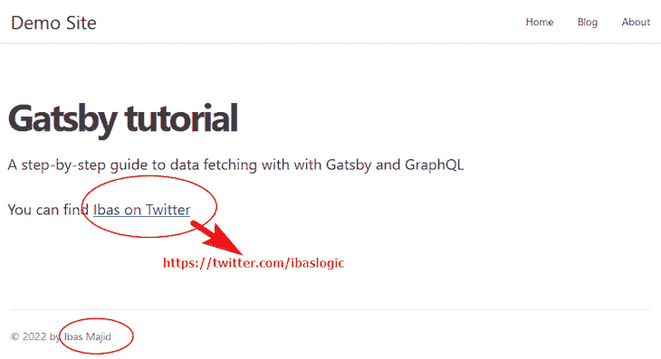
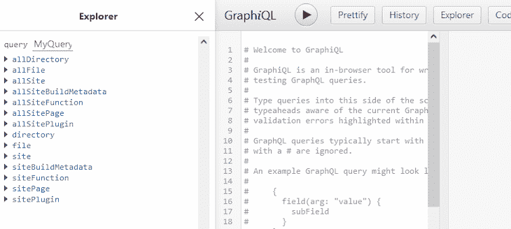
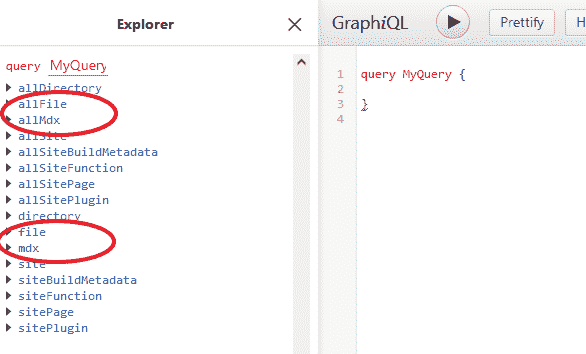
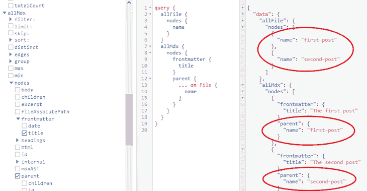
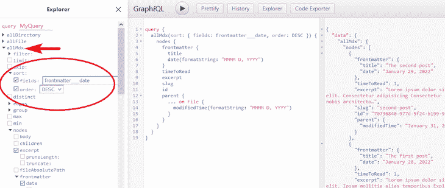
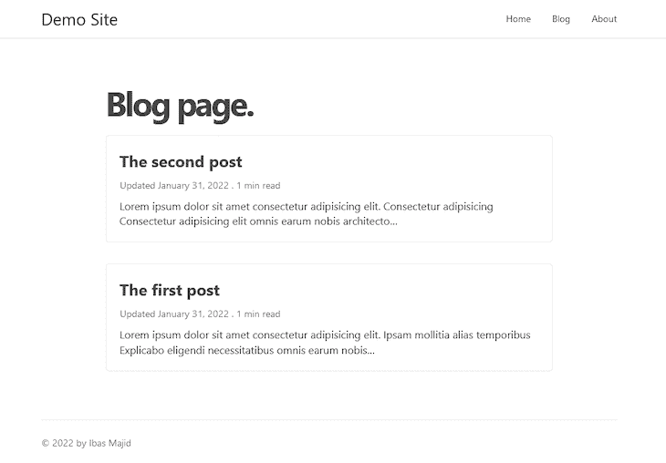
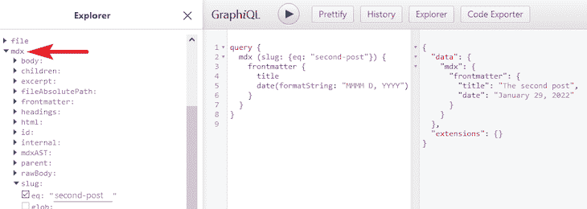
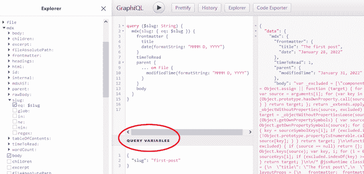
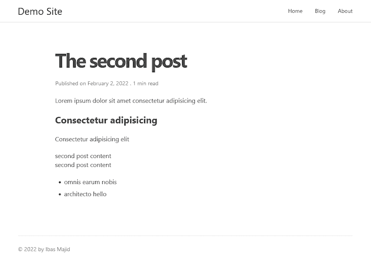
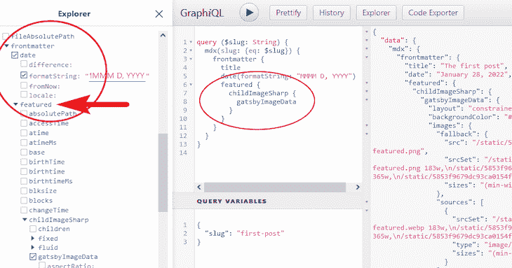

# 用 Gatsby 和 GraphQL - LogRocket Blog 获取数据

> 原文：<https://blog.logrocket.com/data-fetching-gatsby-graphql/>

当我们用 Gatsby 构建一个应用程序时，我们需要数据来使它起作用。我们可以直接在应用程序组件中添加数据，或者将数据存储在组件之外，并允许 Gatsby 在构建时为我们获取数据。

虽然随着应用程序的增长，前者是不可维护的，但我们的重点是后者。有了 Gatsby，我们可以从不同的来源获取数据，包括文件系统、外部 API、数据库和 CMS，如 Contentful 或 WordPress。

在这里，我们将介绍如何使用 GraphQL 从 Gatsby 配置文件和 Gatsby 外部的源获取数据。为此，我们将构建一个 Gatsby 博客站点，从文件系统中获取 MDX 文件，并将内容呈现为博客文章。[你可以在这里看到完成的项目](https://gatsbydatafetchinggraphql.gatsbyjs.io/)。

在本指南的最后，我们将了解 Gatsby 数据获取技术以及如何从我们选择的任何后端获取数据。

要遵循本教程，请确保您熟悉 Gatsby，并确保您安装了 Node.js、Git 和 Gatsby CLI。如果你熟悉 GraphQL，这也是有益的。但是如果没有，不要担心，因为我们将在本教程中涵盖您需要的所有内容。

## 建立一个盖茨比项目

让我们通过在我们的计算机终端上运行以下命令来下载一个启动项目:

```
git clone https://github.com/Ibaslogic/gatsby-starter-data-fetching

```

完成后，更改项目中的目录，`cd gatsby-starter-data-fetching`并运行`npm install`。之后，用代码编辑器打开项目并运行`gatsby develop`。最后，我们可以在 [http://localhost:8000](http://localhost:8000) 的浏览器中打开项目。

如果我们看一下项目结构，我们应该会看到:

```
project_folder
    ├── node_modules
    ├── public
    ├── src
    │    ├── components
    │    │      ├── Footer.js
    │    │      ├── Header.js
    │    │      ├── Hero.js
    │    │      ├── layout.css
    │    │      └── ...
    │    ├── images
    │    ├── pages
    │    │      ├── ...
    │    │      ├── blog.js
    │    │      └── index.js
    │    └── menuItems.js
    ├── ...
    ├── gatsby-config.json
    └── ...

```

请注意，项目 CSS 样式位于`components/layout.css`文件中，其中包括我们将在项目中稍后创建的 JSX 的样式。现在我们已经建立了项目，是时候开始获取数据了。

在任何 web 项目中，我们都有一些跨站点重用的数据，这是很常见的。例如，我们可以在应用程序的多个组件中使用站点 URL 或社交句柄。

使用 Gatsby，我们可以将这组数据存储在名为`gatsby-config.js`的 Gatsby 配置文件内的`siteMetadata`对象中。

这个对象也是存储静态数据的好地方，比如英雄标题和页面描述。这样，我们可以在一个中心位置进行更新，而无需修改源代码。

如果我们看一下 starter 项目的主页，我们会看到标题文本、描述、Twitter 句柄(在 Twitter URL 中)和作者姓名:



我们将把这些信息存储在`siteMetadata`对象中。因此，让我们打开根目录中的`gatsby-config.js`文件并更新`siteMetadata`，这样我们就有了以下内容:

```
module.exports = {
 siteMetadata: {
  title: `Gatsby tutorial`,
  description: `A step-by-step guide to data fetching with with Gatsby and GraphQL`,
  twitterHandle: "ibaslogic",
  author: "Ibas Majid",
 },
 plugins: [],
};

```

保存文件。

为了获取这些数据并在我们的应用程序组件中使用它们，让我们讨论一下 Gatsby 的数据层。

## 了解 Gatsby 的 GraphQL 数据层

[在 Gatsby 中，有不同的方式将数据](https://blog.logrocket.com/is-gatsby-really-that-great-e7b19c4c1c05/)拉入应用程序组件。其中一种方法是使用 GraphQL。

GraphQL 是一种查询语言，它允许我们查询在某处可用并在我们的项目文件中使用的数据。在 [GraphQL 中，保存数据以获取数据的位置](https://blog.logrocket.com/fetching-dynamically-structured-data-cms-graphql/)被称为数据层。幸运的是，Gatsby 有一个由 GraphQL 支持的内置数据层。

对于我们存储在配置文件的`siteMetadata`中的数据，它会自动被拉入 Gatsby 的数据层。对于存储在 Gatsby 之外的数据，情况就不一样了，我们将在后面谈到。

为了探索数据层并查看`siteMetadata`信息，我们需要使用一个叫做 GraphiQL 的工具。我们可以在[localhost:8000/*_*graph QL](http://localhost:8000/___graphql)访问这个工具，但是只能在运行`gatsby develop`的时候；请注意，URL 中有三个下划线。

让我们通过上面的链接打开这个工具，点击**浏览器**按钮来查看**浏览器**面板。我们应该会看到这个图形界面:



我们可以通过切换 **Explorer** 窗格中的下拉菜单并点击可用的数据字段来构建查询。

### 查询`siteMetadata`内容

在**浏览器**窗格中，我们在**站点**下拉字段中找到了`siteMetadata`对象。这里，我们有两个`siteMetadata`,但是保存数据的是蓝色的那个。让我们点击它，并选择我们想要的数据字段。

如果我们在 **Explorer** 窗格中找不到数据，重启开发服务器并刷新 GraphiQL 工具。如果我们修改`gatsby-config.js`文件，这是必要的。现在我们已经检查了数据，让我们点击**执行查询按钮**(即**播放**按钮)来运行查询。


正如在结果窗口中看到的，我们得到的响应包含 JSON 格式的数据。此外，在查询编辑器中，我们总是可以删除查询名称`MyQuery`，因为如果有多个查询具有相同的名称，这可能会导致问题。因此，上面的查询现在看起来像这样:

```
query {
 site {
  siteMetadata {
   title
   description
   twitterHandle
   author
  }
 }
}

```

现在我们有了一个获取数据的查询，接下来我们将学习如何使用它在组件中加载数据。

## 使用页面查询和`StaticQuery`

为了使用 GraphQL 查询加载数据，我们将使用页面查询或`StaticQuery`。当我们想要在页面组件(即位于`src/pages`文件夹中的组件)中执行查询时，我们可以使用任何查询类型。

然而，对于非页面组件(即我们可以嵌入到其他组件中的组件，如`Header`或`Footer`)，我们必须只使用`StaticQuery`或它的钩子版本`useStaticQuery`。

* * *

### 更多来自 LogRocket 的精彩文章:

* * *

### 使用`useStaticQuery`将数据拉入`Hero`组件

在`src/components/Hero.js`文件中，我们硬编码了标题、描述和 Twitter 句柄。相反，我们将使用 GraphQL 查询从数据层获取这些数据。

记住，我们可以使用`StaticQuery`或`useStaticQuery`来加载数据。但是在这个项目中，我们将使用`useStaticQuery`钩子，因为它的灵活性和它提供的创建自定义可重用钩子的选项，所以我们不需要在需要`siteMetadata`信息的多个文件中手工编写查询。

现在，打开`Hero.js`文件，导入`useStaticQuery`函数和`graphql`，如下所示:

```
import { useStaticQuery, graphql } from "gatsby";

```

然后，在`return`语句上方添加以下内容:

```
const data = useStaticQuery(graphql`
 query {
  site {
   siteMetadata {
    title
    description
    twitterHandle
   }
  }
 }
`);

```

我们调用`useStaticQuery`函数，该函数接受一个`graphql`标记的模板，模板中有我们之前创建的添加在两个反勾号之间的查询。请注意，我们只获取我们需要的数据；我们不获取`author`，因为我们不需要它在这个文件中。

接下来，我们将像这样渲染 JSX 中的数据:

```
const { title, description, twitterHandle } = data.site.siteMetadata;

return (
 <div className="hero">
  <h1>{title}</h1>
  <p>{description}</p>
  <p>You can find{" "}
   <a
    href={`https://twitter.com/${twitterHandle}`}
    // ...
   >
    Ibas on Twitter
   </a>
  </p>
 </div>
);

```

注意我们是如何通过析构`data.site.siteMetadata`对象来获取数据的。让我们保存文件并测试我们的项目。如果我们修改并重新保存`gatsby-config.js`文件中的数据，我们将立即在前端看到变化。

## 创建自定义`useStaticQuery`挂钩

如果我们打开`components/Footer.js`文件，我们也硬编码了作者姓名。之前，我们学习了如何从数据层获取数据。

在这个文件中，我们将为这个功能编写一个定制的可重用钩子，而不是编写另一个查询来从`siteMetadata`中获取`author`字段。

在`src`文件夹中，我们创建一个名为`useSiteMetadata.js`的文件，并添加以下代码:

```
import { useStaticQuery, graphql } from "gatsby";

export const useSiteMetadata = () => {
 const data = useStaticQuery(graphql`
  query {
   site {
    siteMetadata {
     title
     description
     twitterHandle
     author
    }
   }
  }
 `);

 return data.site.siteMetadata;
};

```

在这里，我们创建了一个名为`useSiteMetadata`的定制钩子，并返回保存数据的`siteMetadata`对象。这个查询应该很熟悉。另外，请注意，我们已经包含了添加到`gatsby-config.js`文件的`siteMetadata`中的所有数据。保存文件。

让我们重温一下`components/Hero.js`，删除查询和`useStaticQuery`，`graphql`导入。然后，我们导入`useSiteMetadata`自定义钩子，并像这样使用它:

```
import React from "react";
import { useSiteMetadata } from "../useSiteMetadata";

const Hero = () => {
 const { title, description, twitterHandle } = useSiteMetadata();

 return (
  // ...
 );
};

export default Hero;

```

让我们保存并测试我们的项目。应该能行。

现在，我们可以使用`components/Footer.js`文件中的自定义钩子从 Gatsby 数据层获取作者姓名，如下所示:

```
import React from "react";
import { useSiteMetadata } from "../useSiteMetadata";

const Footer = () => {
 const { author } = useSiteMetadata();
 return (
  // ...
   <p>
    &copy; {new Date().getFullYear().toString()} by {author}
   </p>
  // ...
 );
};

export default Footer;

```

让我们保存并测试我们的项目。

到目前为止，我们已经学会了如何从 Gatsby 文件中获取数据。接下来，我们将从盖茨比以外的地方获取数据。

## 从文件系统获取数据

从文件系统获取数据的过程类似于任何其他来源，包括内容管理系统(CMS)。

与自动拉入 GraphQL 数据层的`siteMetadata`对象中的数据不同，默认情况下，来自其他来源的内容将不可用。

相反，我们需要一个特定的[源插件](https://www.gatsbyjs.com/plugins)，它与源进行通信，并将数据拉入 Gatsby 的 GraphQL 数据层。从那里，我们可以在组件文件中编写 GraphQL 查询来加载我们想要的数据。

在我们的项目中，我们希望在博客页面上显示来自文件系统的博客文章列表和单个文章。为此，我们必须创建 post 文件。

### 创建博客帖子 MDX 文件

让我们首先在根目录下创建一个`posts`文件夹，然后创建`.mdx`文件和一个`images`文件夹。我们的目录应该是这样的:

```
project_folder
   ...
    ├── node_modules
    ├── posts
    │    ├── images
    │    ├── first-post.mdx
    │    ├── second-post.mdx

```

接下来，我们可以在文件中添加[一些降价内容](https://github.com/adam-p/markdown-here/wiki/Markdown-Cheatsheet)。在我的例子中，我将在`first-post.mdx`文件中添加以下内容:

```
---
title: "The first post"
date: "2022-01-28"
---

Lorem ipsum dolor sit amet consectetur adipisicing elit.

## Ipsam mollitia alias temporibus

Explicabo eligendi necessitatibus

1\. omnis earum nobis
2\. architecto

```

然后，在`second-post.mdx`中添加以下内容:

```
---
title: "The second post"
date: "2022-02-03"
---

Lorem ipsum dolor sit amet consectetur adipisicing elit.

## Consectetur adipisicing

Consectetur adipisicing elit

- omnis earum nobis
- architecto hello

```

在 MDX 文件中，我们在指定了`title`和`date`的前面添加了简单的降价内容。让我们保存我们的文件。

## 查询文件系统数据

如前所述，`.mdx`数据不会被自动拉入数据层。我们将需要一个名为`gatsby-source-filesystem`的源插件的帮助，它将从文件系统创建`File`节点，并允许我们查询关于文件的数据。

除了 source 插件，我们还需要一个名为`gatsby-plugin-mdx`的 transformer 插件，它接受`File` *节点，并创建名为`MDX`节点的新节点，这些节点包含我们需要的格式的数据。*

 *运行`gatsby-plugin-mdx`需要以下额外的依赖项:`@mdx-js/mdx`和`@mdx-js/react`。

### 安装和配置 MDX 文件系统插件

在终端中，让我们运行以下命令来安装必要的插件:

```
npm install gatsby-source-filesystem gatsby-plugin-mdx @mdx-js/mdx @mdx-js/react

```

然后，将它们添加到`gatsby-config.js`文件中:

```
module.exports = {
 siteMetadata: { ... },
 plugins: [
  {
   resolve: `gatsby-source-filesystem`,
   options: {
    name: `posts`,
    path: `${__dirname}/posts/`,
   },
  },
  `gatsby-plugin-mdx`,
 ],
};

```

这个配置告诉 Gatsby 从我们指定的路径获取数据。因此，我们必须确保在指定的目录中有要获取的文件，否则，我们需要添加一个类似的配置对象来捕获数据所在的位置。

让我们保存文件并重启开发服务器。

如果我们刷新 GraphiQL IDE，我们应该会看到由我们安装的插件添加的额外节点。source 插件创建`File`节点，transformer 插件将这些节点转换成`MDX`节点，这就是我们所需要的。



现在让我们使用`allMdx`来获取我们博客页面上的所有博客文章，并使用`mdx`来获取单个文章。如果我们研究一下`allFile`和`allMdx`节点上的一些可用字段，我们将得到如下结果:



注意，`allFile`中的`name`字段返回与`allMdx`中的`parent`相同的文件名。这是因为当 transformer 插件从`File`节点创建一个新的`MDX`节点时，它允许我们通过`parent`字段访问父`File`节点的数据。

因此，我们可以忽略`allFile`根字段，因为我们可以通过`allMdx`获得相同的数据和额外的内容(如前面的内容或正文内容)。

### 获取博客文章的数据列表

记住，这里的重点是`allMdx`字段。如果我们再次探索其中的一些字段，我们将会看到以下内容:



在 GraphQL 数据层中，我们的数据存储在`nodes`中，它作为一个对象数组返回，如结果窗口中所示。请注意，我们使用了`sort`参数来按时间倒序组织文章，并按前面的事件日期排序。

还要注意我们如何通过`parent`字段获得关于`File`节点中文件的数据。`File`节点中的`modifiedTime`字段返回文件被修改的日期。我们稍后将使用它来区分新帖子和更新的帖子。

接下来，让我们在我们站点的博客页面上呈现数据。

## 使用`useStaticQuery`将博客文章拉进博客页面

正如我们之前了解到的，我们可以使用`StaticQuery`(它的钩子版本)或页面查询将数据加载到页面组件中。这里，我们将再次使用钩子版本。稍后，我们将学习如何使用页面查询。

在`src/pages/blog.js`文件中，包含必要的导入，并将生成的查询添加到`return`语句之上:

```
// ...
import { useStaticQuery, graphql, Link } from "gatsby";

const BlogPage = () => {

 const data = useStaticQuery(
  graphql`
   query {
    allMdx(sort: { fields: frontmatter___date, order: DESC }) {
     nodes {
      frontmatter {
       title
       date(formatString: "MMMM D, YYYY")
      }
      timeToRead
      excerpt
      slug
      id
      parent {
       ... on File {
        modifiedTime(formatString: "MMMM D, YYYY")
       }
      }
     }
    }
   }
  `
 );

 const posts = data.allMdx.nodes;

 return (
  <Layout>
   {/* ... */}
  </Layout>
 );
};

export default BlogPage;

```

记住，查询将我们的数据作为一个对象数组返回到`nodes`中。我们将循环通过分配给`posts`变量的`nodes`来呈现我们的帖子。`return`语句中的 JSX 现在应该是这样的:

```
return (
 <Layout>
  <h1>Blog page.</h1>
  <ul>
   {posts.map((post) => {
    const { id, frontmatter, parent, timeToRead, excerpt, slug } = post;
    const { title, date } = frontmatter;

    const postStatus =
     date === parent.modifiedTime ? "Published " : "Updated ";

    return (
     <li className="post_item" key={id}>
      <Link to={`/${slug}`}>
       <article>
        <h2>{title}</h2>
        <div className="post__meta">
         <span>
          {postStatus} {parent.modifiedTime}
         </span>{" "}
         . <span>{timeToRead} min read</span>
        </div>
        <p>{excerpt}</p>
       </article>
      </Link>
     </li>
    );
   })}
  </ul>
 </Layout>
);

```

让我们保存我们的文件并访问前端博客页面。我们应该有我们的 MDX 职位上市。



这太棒了。如上面的代码所示，每个帖子都使用`Link`组件链接到单个帖子页面。

如果我们点击任何帖子，我们会看到一个盖茨比错误页面。这是因为单一的文章页面还不存在。接下来，我们将创建此页面来呈现 MDX 正文。

## 获取和呈现单个帖子的数据

要获取和呈现 MDX 正文，我们必须创建一个页面模板，Gatsby 将使用该模板以编程方式创建单个帖子页面。有了 [Gatsby 文件系统路由 API](https://www.gatsbyjs.com/docs/reference/routing/file-system-route-api/) ，创建这个模板就是小菜一碟。

让我们打开`src/pages`目录并创建一个名为`{mdx.slug}.js`的文件。在该文件中，添加以下起始代码:

```
import React from "react";
import Layout from "../components/layout";

const BlogPost = () => {
 return (
  <Layout>
   <article className="single__post">Single post page</article>
  </Layout>
 );
};

export default BlogPost;

```

现在，Gatsby 将使用这个模板动态呈现基于 MDX slug 的单个帖子页面。

### 查询单个帖子数据

如前所述，我们将使用`mdx`字段获取单个帖子，而不是使用获取所有帖子的`allMdx`。如果我们打开 GraphiQL IDE 并浏览`mdx`根目录上的字段，我们将会看到如下内容:



单个 post 的工作方式是，我们必须向`mdx`字段传递参数，以更改我们从查询中返回的数据。在这里，我们改变了基于 slug 的数据。

如果我们用`"first-post"`手动替换`"second-post"` slug，我们会得到`first-post.mdx`文件中的数据。

现在，我们可以使用查询变量来动态地发送请求，而不是手动替换 slug。如果我们在 IDE 中实现查询变量，我们的查询应该如下所示:



GraphiQL 还提供了一个部分来添加要传递给我们的查询的 slug。然后在查询中，我们必须定义并使用将`$`添加到 slug 中的变量。然而，在页面模板文件中，Gatsby 自动使单个页面段可用作我们查询中的查询变量。

## 使用页面查询将帖子的数据拉入单个帖子页面

为了在查询中使用查询变量，我们必须构造一个页面查询，而不是静态查询。在这个页面查询中，我们必须导出一个分配给变量的 GraphQL 查询。而且，这种类型的查询被放在组件之外。

让我们看看它是如何工作的。打开`pages/{mdx.slug}.js`文件，将构建的查询添加到组件定义之上，这样我们就有了以下内容:

```
// ...
import { graphql } from "gatsby";
import { MDXRenderer } from "gatsby-plugin-mdx";

export const query = graphql`
 query ($slug: String) {
  mdx(slug: { eq: $slug }) {
   frontmatter {
    title
    date(formatString: "MMMM D, YYYY")
   }
   timeToRead
   parent {
    ... on File {
     modifiedTime(formatString: "MMMM D, YYYY")
    }
   }
   body
  }
 }
`;

const BlogPost = () => {
 return (
  // ...
 );
};

export default BlogPost;

```

让我们确保从各自的模块中导入`graphql`和`MDXRenderer`。我们将使用`MDXRenderer`来呈现 MDX 主体内容。注意，我们还查询了上面的`body`字段。

当我们使用页面查询时，Gatsby 会自动将查询结果作为`data`道具注入页面组件。让我们使用这个属性，通过更新组件来呈现 JSX 中的内容，这样我们就有了以下内容:

```
// ...
const BlogPost = ({ data }) => {
 const { frontmatter, parent, timeToRead, body } = data.mdx;
 const { title, date } = frontmatter;
 const postStatus =
  date === parent.modifiedTime ? "Published on" : "Updated on";

 return (
  <Layout>
   <article className="single__post">
    <header>
     <h1>{title}</h1>
     <span className="post__meta">
      {postStatus} {parent.modifiedTime}
      <span> . </span> {timeToRead} min read{" "}
     </span>
    </header>
    <div>
     <MDXRenderer>{body}</MDXRenderer>
    </div>{" "}
   </article>
  </Layout>
 );
};

export default BlogPost;

```

保存文件并重新访问其中一个帖子页面。我们应该看到内容呈现如下:



## 获取和渲染图像

在 markdown 或 MDX 文件中，我们可以通过 front matter 或在 markdown 主体中向帖子添加图像。但是在 Gatsby 中，默认情况下，在 MDX 文件中添加图像不会呈现在 post 页面上。

我们必须为 Gatsby 提供支持来呈现这些图像，这对于 Gatsby 提供图像的优化版本是必要的。让我们添加这些图像。

在`posts/first-post.mdx`中，添加一个名为`featured`的前台事件字段和一个内嵌的降价图像，这样我们就有了以下内容:

```
---
 title: "The first post"
date: "2022-01-28"
featured: "./images/first-post-featured.png"
 ---


```

图像路径相对于页面文件。记住我们在`posts`文件夹中有一个`images`文件夹。在 GitHub 上打开这个 [Gatsby 项目，抓取图片，保存在`images`文件夹中。](https://github.com/Ibaslogic/gatsby-data-fetching-graphql/tree/main/posts/images)

接下来，打开`posts/second-post.mdx`文件，更新如下:

```
---
title: "The second post"
date: "2022-02-03"
featured: "./images/second-post-featured.jpg"
---


```

让我们保存我们的文件。

接下来，我们可以安装几个插件来告诉 Gatsby 这些图像。前往终端，运行以下命令:

```
npm install gatsby-plugin-image gatsby-plugin-sharp gatsby-remark-images gatsby-transformer-sharp

```

这里，每个插件做以下事情:

*   `gatsby-plugin-image`提供了一个名为`GatsbyImage`的图像组件来呈现我们的特色图像
*   `gatsby-transformer-sharp`创建一个特殊的节点字段，用于处理特色图像
*   `gatsby-remark-images`处理降价主体中的图像
*   `gatsby-plugin-sharp`处理图像并缩小图像尺寸

安装完成后，打开`gatsby-config.js`文件并添加插件，如下所示:

```
module.exports = {
 siteMetadata: {...},
 plugins: [
  `gatsby-plugin-image`,
  `gatsby-plugin-sharp`,
  `gatsby-transformer-sharp`,
  {
   resolve: `gatsby-source-filesystem`,
   options: {...},
  },
  `gatsby-remark-images`,
  {
   resolve: `gatsby-plugin-mdx`,
   options: {
    gatsbyRemarkPlugins: [
     {
      resolve: `gatsby-remark-images`,
      options: {
       maxWidth: 750,
       linkImagesToOriginal: false,
      },
     },
    ],
   },
  },
 ],
};

```

注意，我们已经将`gatsby-remark-images`作为一个字符串添加到了`gatsby-plugin-mdx`的`options`字段中。

让我们保存文件并重启开发服务器。我们应该看到身体图像出现在帖子中。

### 获取特色图像

由于特色图片位于前端，我们将使用 GraphQL 查询获取它。如果我们刷新 GraphiQL IDE，我们应该有一个额外的功能字段，如下所示:



如上所述，`gatsbyImageData`字段包含关于我们的特色图像的信息，它位于`childImageSharp`字段中。

### 使用`GatsbyImage`组件渲染特色图像

让我们打开`src/pages/{mdx.slug}.js`文件，更新查询的 front matter 字段，使其包含`featured`字段，如下所示:

```
frontmatter {
 title
 date(formatString: "MMMM D, YYYY")
 featured {
  childImageSharp {
   gatsbyImageData
  }
 }
}

```

接下来，我们将从`frontmatter`中析构`featured`对象。所以在文件中，找到下面一行:

```
const { title, date } = frontmatter;

```

并更新为:

```
const { title, date, featured } = frontmatter;

```

之后，像这样导入`GatsbyImage`组件:

```
import { GatsbyImage } from "gatsby-plugin-image";

```

然后使用`GatsbyImage`组件渲染特色图像，如下所示:

```
return (
 <Layout>
  <article className="single__post">
   <header>
    {/* ... */}
    <GatsbyImage
     image={featured.childImageSharp.gatsbyImageData}
     alt={title}
    />
   </header>
   <div>
    <MDXRenderer>{body}</MDXRenderer>
   </div>{" "}
  </article>
 </Layout>
);

```

保存文件并重新访问单个帖子页面；我们应该会看到渲染的特色图像。

## 结论

我很高兴我们在这里。我们学习了如何使用 GraphQL 从文件系统和 [Gatsby 配置文件](https://blog.logrocket.com/whats-new-in-gatsby-v4/)的`siteMetadata`对象获取数据。现在，我们可以从 [Gatsby 插件页面](https://blog.logrocket.com/4-plugins-to-add-comments-to-your-gatsbyjs-blog/)使用他们的特定插件复制我们学到的东西，并从我们选择的任何来源获取数据。

如果你喜欢这个教程，确保你在网上分享它。如果你有任何问题或贡献，我在评论区。

下面是 GitHub 上的[项目源代码。](https://github.com/Ibaslogic/gatsby-data-fetching-graphql)

## 监控生产中失败和缓慢的 GraphQL 请求

虽然 GraphQL 有一些调试请求和响应的特性，但确保 GraphQL 可靠地为您的生产应用程序提供资源是一件比较困难的事情。如果您对确保对后端或第三方服务的网络请求成功感兴趣，

[try LogRocket](https://lp.logrocket.com/blg/graphql-signup)

.

[](https://lp.logrocket.com/blg/graphql-signup)[https://logrocket.com/signup/](https://lp.logrocket.com/blg/graphql-signup)

LogRocket 就像是网络和移动应用的 DVR，记录下你网站上发生的每一件事。您可以汇总并报告有问题的 GraphQL 请求，以快速了解根本原因，而不是猜测问题发生的原因。此外，您可以跟踪 Apollo 客户机状态并检查 GraphQL 查询的键值对。

LogRocket 检测您的应用程序以记录基线性能计时，如页面加载时间、到达第一个字节的时间、慢速网络请求，还记录 Redux、NgRx 和 Vuex 操作/状态。

[Start monitoring for free](https://lp.logrocket.com/blg/graphql-signup)

.*