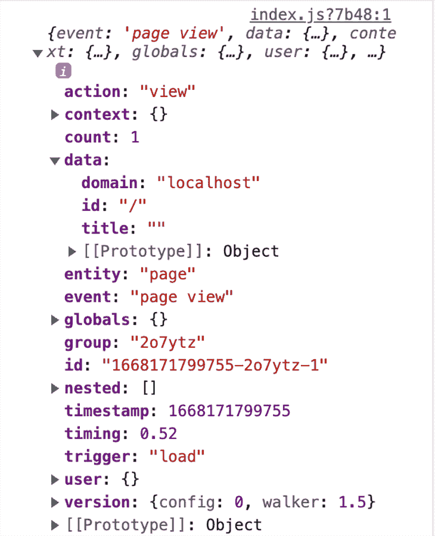
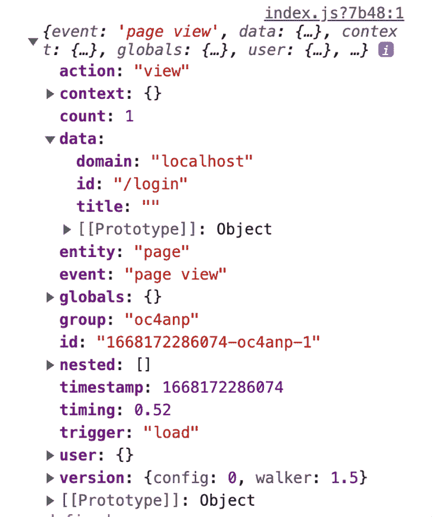
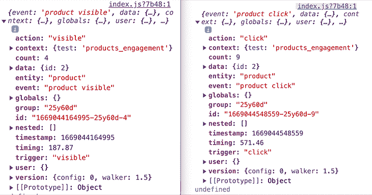
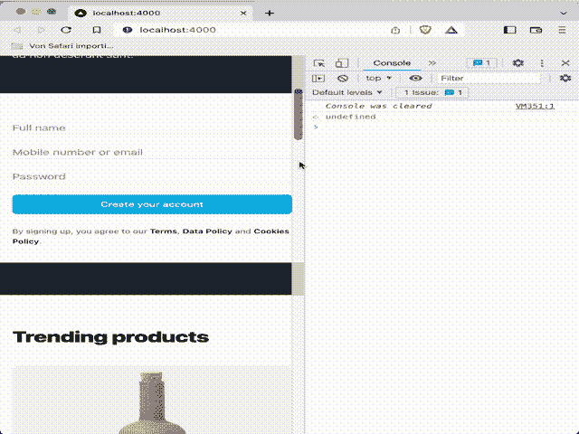

# React with walker.js 中的隐私友好数据跟踪

> 原文：<https://blog.logrocket.com/data-tracking-react-walker-js/>

在本文中，我们将了解第一方事件跟踪的主题。谷歌今年早些时候宣布，Chrome 将不再支持第三方 cookies，因此，这个话题变得更加重要。

在这种情况下，我们将研究第一方跟踪实际上是什么，以及如何使用名为 [walker.js](https://www.elbwalker.com) 的库来实现隐私友好的跟踪。为此，我们将从头开始用 Next.js 和 walker.js 创建一个示例应用程序。本教程将不涉及管理同意和用户身份等主题。

*向前跳转:*

## 什么是第一方数据？

在深入实际代码和 walker.js 库之前，让我们先了解什么是第一方数据。这对于理解 walker.js 等工具的好处和价值至关重要。

最后，很简单:第一方数据是一个公司或网站自己收集和拥有的信息。使用公司或网站自己的工具收集数据；相比之下，第三方数据来自外部的公司，其商业模式是收集数据并出售。

## walker.js 简介

walker.js 是一个[开源库](https://github.com/elbwalker/walker.js)和第一方跟踪解决方案，这意味着您使用该库捕获的数据完全归您所有。

walker.js 还以其他一些方式处理隐私问题。使用 walker.js，您可以自由地将数据直接发送到您自己的端点，就像使用 Google Tag Manager 或 Google Analytics 一样，这使得拥有整个收集过程成为可能，从在浏览器中捕获数据到摄取并最终分析数据。不需要第三方供应商！

GDPR 迫使你意识到哪些工具从你的用户那里接收什么类型的数据，并记录下来。如果在数据到达任何第三方工具之前，您拥有数据收集过程，这将容易得多。

除此之外，walker.js 由于其同意功能，使您的网站、同意管理平台(又名 CMP 或 [cookie 通知横幅](https://blog.logrocket.com/ui-ux-best-practices-cookie-notifications/))和第三方工具之间的通信更加容易。通过一个简单的函数，walker.js 处理初始化和任何进一步的通信，包括您需要用户同意的功能、统计和营销工具的适当竞争条件。这样，没有你的用户的同意，任何工具都不会因为技术问题或者糟糕的实现而被加载。

如果您希望通过捕获匿名会话 id 或进行基于活动的归因而不收集任何个人身份信息来实现无 cookie 跟踪，也可以使用 walker . js(PII)。无 Cookie 跟踪使您能够衡量基本的营销活动绩效，而无需将这些数据与单个用户联系起来。

如果您在 walker.js 中使用第一方数据收集器和显式跟踪方法，也不太可能意外捕获敏感数据，从而降低丢失重要信息的风险，并增加对您真正需要关注的用户事件的关注。

walker.js 的另一个很酷的地方是，您不一定需要 JavaScript 来跟踪事件。相反，使用 HTML 属性是为了跟踪用户事件，并用必要的信息丰富它们。这使得您的代码和跟踪系统更具可读性和可维护性。

下面，你可以从他们的[文档](https://docs.elbwalker.com/tagging/basics)中找到一个用 walker.js 标记页面的例子:

```
<!-- Generic usage -->
<div
  data-elb="ENTITY"
  data-elb-ENTITY="KEY:VALUE"
  data-elbaction="TRIGGER:ACTION"
  data-elbcontext="KEY:VALUE"
  data-elbglobals="KEY:VALUE"
/>

<!-- Example usage -->
<div data-elbglobals="language:en">
  <div data-elbcontext="test:engagement">
    <div data-elb="promotion" data-elbaction="visible:view">
      <h1 data-elb-promotion="name:Setting up tracking easily">
        Setting up tracking easily
      </h1>
      <p data-elb-promotion="category:analytics">Analytics</p>
    </div>
  </div>
</div>
```

如您所见，walker.js 基于实体-动作模型。为了理解某个事件发生的上下文，我们可以用`data-elb`属性定义一个实体范围。您甚至可以扩展上下文，用`data-elbglobals`和`data-elbcontext`属性包含更多的一般信息。

通过设置`data-elbaction`属性，您可以定义触发动作的触发器，并最终使用`data-elb-ENTITY`来设置实体属性。

上面的例子将导致下面的数据结构，一旦`div`容器在视窗中可见，该数据结构将存储在浏览器的数据层中:

```
{
  event: 'promotion view', // combination of entity and action
  data: {
    // arbitrary set properties with the data-elb-promotion attribute
    name: 'Setting up tracking easily',
    category: 'analytics',
  },
  context: {
    // Related properties defined with the data-elbcontext attribute
    test: 'engagement'
  },
  globals: {
    // General Properties defined with the data-elbglobals attribute
    language: 'en'
  },
  user: {
    // stored user ids (manually added once)
    id: 'userid',
    device: 'cookieid',
    hash: 'sessionid',
  },
  nested: [], // all nested entities within the promotion
  id: '1647968113641-01b5e2-5', // timestamp, group & count of the event
  trigger: 'visible', // name of the trigger that fired
  entity: 'promotion', // entity name
  action: 'view', // entity action
  timestamp: 1647968113641, // time when the event fired
  timing: 3.14, // how long it took from the page load to trigger the event
  group: '01b5e2', // random group id for all events on a page
  count: 2, // incremental counter of the events on a page
  version: {
    // Helpful when working with raw data
    walker: 1.5, // used walker.js version
    config: 42, // a custom configuration version number
  },
  walker: true, // flag to filter events
}
```

## Next.js 和 walker.js 入门

如果你对 Next.js 之外的其他标记示例感兴趣，可以查看`elbwalker`包中的[示例目录](https://github.com/elbwalker/walker.js/tree/main/examples)。在这种情况下，我建立了一个简单的电子商务演示网站，包括主页、产品详情和登录页面。

我不打算在这篇博文中解释如何[设置 Next.js 项目](https://blog.logrocket.com/build-server-rendered-react-app-next-express/)；如果你需要帮助，请访问他们的[医生](https://nextjs.org/docs/getting-started)。为了将 walker.js 集成到现有的 Next.js 项目中，请运行以下命令:

```
npm i --save @elbwalker/walker.js
```

接下来我们需要做的是初始化`walker`:

```
// ./data/index.ts
import Elbwalker, { elb, WebDestination } from "@elbwalker/walker.js";

export default function setupAnalytics() {
 window.elbLayer = [];
 window.elbwalker = Elbwalker();
 window.elb = elb;

 elb("walker destination", {
   push: console.log,
 } as WebDestination.Function);

 elb("walker run");
}
```

作为第一步，我们接受`setupAnalytics()`函数，然后创建`elblayer`数组，在那里我们将存储我们所有的信息。随着`Elbwalker()`函数的创建，我们也可以将其他选项传递给`elbLayer`。

我们还导入了将事件推送到`elbLayer`的`elb`辅助函数。此时，它将帮助我们定义一个目的地，并调用`elb("walker run")`来实际启动沃克。

为了简单起见，在本教程中，我们将只把控制台定义为我们的目的地。walker.js 默认支持以下目的地(以后还会有更多):

*   GA 4
*   地面试验导弹(Ground Testing Missile)
*   可信的分析
*   谷歌广告
*   元像素

通常，您可以将任何目的地添加到 walker 中。查看关于目的地的[文档，了解如何添加您的自定义目的地。](https://docs.elbwalker.com/destinations/basics)

我们将使用`pages/_app.tsx`组件中的`setupAnalytics()`函数来实际设置 walker:

```
// pages/_app.tsx
...
import "../styles/globals.css";
import type { AppProps } from "next/app";
import { useEffect } from "react";

export default function App({ Component, pageProps }: AppProps) {
 useEffect(() => {
   const initTracking = async () => {
     const setupAnalytics = (await import("../data/index")).default;
     setupAnalytics();
   };
   initTracking();
 }, []);

 return (
   <>
    ...   
   </>
 );
}
```

您会注意到，我将导入和对`setupAnalytics()`函数的调用外包到了一个`useEffect`钩子中。因为 Next.js 在服务器端创建了这个页面，所以我们需要等待设置，直到页面加载到浏览器中。原因是 walker.js 需要访问`document` 接口，这个接口只在客户端可用。如果我们在`useEffect`钩子之外调用`setupAnalytics()`函数，我们会得到一个`ReferenceError`，表示文档没有被定义。

## 如何用 walker.js 标记页面

现在我们已经成功地设置了 walker，我们可以继续标记页面了。第一步，我们将使用 walker.js 附带的一些预定义触发器。下面是一个列出所有可用触发器的[表:](https://docs.elbwalker.com/tagging/available-triggers)

| **事件** | **定义** |
| `load` | 当 DOM 准备好加载页面后 |
| `click` | 当单击元素或子元素时 |
| `visible` | 当元素在视口中至少停留 50%一秒钟后 |
| `hover` | 每当鼠标进入相应的元素时 |
| `submit` | 在有效的表单提交上 |
| `wait(ms)` | 等待*毫秒*秒(默认为 15 秒)直到触发 |
| `pulse(ms)` | 如果页面未隐藏，每*毫秒*秒(默认为 15 秒)重复触发一次 |
| `custom` | 使用 JavaScript 调用`elbLayer.push()`，查看 |
| `scroll(y)` | 最小时触发。`y`元素高度的百分比高于窗口底部，例如，`scroll(80)`表示 80%的阈值 |

在接下来的部分中，我们将添加页面视图、`hover`和`click`事件。

### 添加页面视图事件

在代表我们主页的`pages/index.tsx`文件中，我们将首先添加`load` 和`wait` 触发器。感谢我们如何设置我们的 walker，我们不必显式地添加一个`load`触发器来为我们的示例生成一个页面视图事件；这将在每次步行机运行时自动抛出。

如果我们访问演示网页的主页，控制台中将生成以下输出:



`login`路线将生成此事件:

但是，我们必须显式地添加其余的触发器。

### 将`wait`触发器添加到我们的主页

接下来，我们想将`wait` 触发器添加到我们的主页。这个触发器可以用来确定用户是否对我们的站点感兴趣(例如，测量跳出率)。walker 将等待指定的毫秒数，直到触发。

```
// pages/index.tsx
export default function Home() {
 ...

 return (
   <div
     className="relative bg-gray-800 overflow-hidden"
     data-elbcontext="test:home_engagement"
   >
     <div className="relative pt-6 pb-16 sm:pb-24">
       <main className="mt-16 sm:mt-24">
         <div className="mx-auto max-w-7xl" data-elb="home">
           <div
             className="lg:grid lg:grid-cols-12 lg:gap-8"
             data-elbaction="wait(10000):interested"
           >
        ...    
         );
}
```

在这种情况下，我们等待`10`秒，直到触发器被触发。对于`data-elbcontext="test:home_engagement"`，我们说我们通常在测试主页上的用户参与度；用 `data-elb="home"`设置实体和范围，最后用`data-elbaction="wait(10000):interested"`设置触发器和相应的动作。

### 添加`click`和`hover`事件

接下来，让我们为产品概述实现`click`和`hover`事件:





对应的代码是这样的，可以在`components/organisms/products.tsx`中找到:

```
import { products } from "../../utils/mockProducts";

export default function Products() {
 return (
   <div className="bg-white" data-elbcontext="test:products_engagement">
     <div className="mx-auto max-w-2xl py-16 px-4 sm:py-24 sm:px-6 lg:max-w-7xl lg:px-8">
       <h2 className="text-3xl font-extrabold tracking-tight text-gray-900 sm:text-4xl mb-10">
         Trending products
       </h2>

       <div className="grid grid-cols-1 gap-y-10 gap-x-6 sm:grid-cols-2 lg:grid-cols-3     xl:grid-cols-4 xl:gap-x-8">
         {products.map((product) => (
           <a
             key={product.id}
             href={product.href}
             className="group"
             target="_blank"
             data-elb="product"
             data-elbaction="click"
             data-elb-product={`id: ${product.id}`}
           >
          <div data-elbaction="visible" className="aspect-w-1 aspect-h-1 w-full overflow-hidden rounded-lg bg-gray-200 xl:aspect-w-7 xl:aspect-h-8">
            …             
           </div>

       );
}
```

这个片段中最重要的信息可以在`map-method`中找到，在这里我们迭代了`products`数组中的所有条目。通过`data-elb="product"`，我们将我们的实体设定为一个产品。我们可以使用`data-elbaction="click; hover"`来跟踪用户在产品上的点击和悬停。

如果您仔细看看显示来自`hover`和`click`事件的控制台日志的截图，您会注意到`data`属性保存了悬停/点击产品的产品 ID。我们可以通过在代码中添加 `data-elb-product={`id: ${product.id}`}`来动态地将产品 ID 添加到事件中。您可以向您的实体添加任何属性，但是在这种情况下，我们还可以添加名称、价格等。

## 如何用 JavaScript 添加自定义事件

到目前为止，我们已经了解了如何使用预构建的触发器轻松标记页面。但是 Walker.js 也允许我们实现自定义触发器，我们可以使用 JavaScript 自己将它们推送到`elbLayer`。

为此，我们将实现一个触发器来检测用户是否输入了无效密码(密码长度少于 8 个字符),以及另一个触发器来跟踪用户是否关注特定的输入字段。

您可以在 walker.js 文档中找到关于如何使用 JavaScript 跟踪事件的更多信息。通常，工作流程如下所示:

```
import { elb } from '@elbwalker/walker.js';

elb('entity action', data, trigger, nested, context);
```

首先，让我们实现密码验证事件。类似于上面的代码片段，我们可以定义一个名为`checkPassword`的新事件:

```
// utils/customEvents.ts
export const checkPassword = async (entity: string) => {
 const { elb } = await import('@elbwalker/walker.js');
 elb(`${entity} shortPassword`, { domain: 'localhost' }, 'validation', {
   test: 'password validation',
 });
};
```

第二步，我们需要在我们想要验证密码输入的位置导入`checkPassword`函数。下面的`handleSubmit`函数将在每次点击**创建您的账户**按钮时被调用。

```
// components/organisms/account.tsx
const handleSubmit = (e: MouseEvent<HTMLButtonElement>) => {
   if (password.length < 8) {
     e.preventDefault();
     checkPassword('account');
   }
 };
```

对于第二个自定义事件，我们再次需要一个将事件推送到`elbLayer`的函数:

```
// utils/customEvents.ts
export const trackInput = async (
 e: React.ChangeEvent<HTMLInputElement>,
 entityAction: string
) => {
 const { elb } = await import("@elbwalker/walker.js");

 elb(entityAction, { domain: "localhost", inputField: e.target.id }, "focus", {
   test: "input field engagement",
 });
};
```

我们将`inputField: e.target.id`传递给我们的数据对象，这样我们就可以在几个输入字段之间区分我们的焦点。此事件现在可以添加到应用程序中的任何输入字段。在我们的例子中，我们将把它添加到主页上的`signup`组件中。

```
// components/organisms/account.tsx/AccountSignUp
<div>
     <label htmlFor="name" className="sr-only">
       Full name
     </label>
     <input
       onFocus={(e) => {
          trackInput(e, "account focus");
       }}
       type="text"
       name="name"
       id="name"
       autoComplete="name"
       placeholder="Full name"
      />
…
</div>
```

正如您所看到的，我们只是将`trackInput`函数添加到 input 元素的`onFocus`属性中。您可以在下面找到这一实现的结果:


## 结论

在这篇博文中，我们讨论了隐私友好数据跟踪的主题，并详细介绍了 [walker.js 库](https://www.elbwalker.com)，它允许您在应用程序中轻松实现第一方数据跟踪。

如果您对使用 walker.js 库感兴趣，请随意查看 [GitHub repo](https://github.com/elbwalker/walker.js) ！

## [LogRocket](https://lp.logrocket.com/blg/react-signup-general) :全面了解您的生产 React 应用

调试 React 应用程序可能很困难，尤其是当用户遇到难以重现的问题时。如果您对监视和跟踪 Redux 状态、自动显示 JavaScript 错误以及跟踪缓慢的网络请求和组件加载时间感兴趣，

[try LogRocket](https://lp.logrocket.com/blg/react-signup-general)

.

[ ](https://lp.logrocket.com/blg/react-signup-general) [](https://lp.logrocket.com/blg/react-signup-general) 

LogRocket 结合了会话回放、产品分析和错误跟踪，使软件团队能够创建理想的 web 和移动产品体验。这对你来说意味着什么？

LogRocket 不是猜测错误发生的原因，也不是要求用户提供截图和日志转储，而是让您回放问题，就像它们发生在您自己的浏览器中一样，以快速了解哪里出错了。

不再有嘈杂的警报。智能错误跟踪允许您对问题进行分类，然后从中学习。获得有影响的用户问题的通知，而不是误报。警报越少，有用的信号越多。

LogRocket Redux 中间件包为您的用户会话增加了一层额外的可见性。LogRocket 记录 Redux 存储中的所有操作和状态。

现代化您调试 React 应用的方式— [开始免费监控](https://lp.logrocket.com/blg/react-signup-general)。