# 使用 Seaborn 在 Python 中实现数据可视化

> 原文：<https://blog.logrocket.com/data-visualization-python-seaborn/>

数据可视化在所有与数据相关的职业中占据着特殊的位置。对于数据科学家来说，没有什么比获取一大组随机数并将其转化为美丽的视觉效果更令人满意的了。

数据科学家创建的大多数数据可视化是用 Python 和它的孪生可视化库:Matplotlib 和 Seaborn 创建的。Matplotlib 和 [Seaborn](https://seaborn.pydata.org/) 被广泛用于创建图表，使个人和公司能够理解万亿字节的数据。

## 什么是 Seaborn？

那么，这两个库到底是什么？

Matplotlib 是 Python 数据可视化库之王，它使可视化探索表格数据变得轻而易举。

Seaborn 是另一个构建在 Matplotlib 之上的 Python 数据可视化库，它引入了一些以前没有的特性，在本教程中，我们将使用 Seaborn。

为了跟进这个项目，您还需要了解 [Pandas](https://pandas.pydata.org/) ，这是一个处理和分析表格数据的强大库。

在这篇博文中，我们将学习如何通过 Seaborn 创建的可视化来执行数据分析。将向您介绍直方图、kde、条形图等等。最后，您将对如何可视化数据有一个坚实的理解。

## 安装库和加载数据

我们将从安装库和导入数据开始。运行以下命令将安装用于数据可视化的 Pandas、Matplotlib 和 Seaborn 库:

```
pip install pandas matplotlib seaborn
```

现在，让我们以标准别名导入这些库:

```
import matplotlib.pyplot as plt
import pandas as pd
import seaborn as sns
```

接下来，加载要分析的数据。该数据集包含 54，000 颗钻石的物理尺寸及其价格。您可以从 Kaggle 上的[下载原始数据集作为 CSV 文件，但我们将使用一个快捷方式:](https://www.kaggle.com/shivam2503/diamonds)

```
diamonds = sns.load_dataset("diamonds")
```

因为数据集已经构建到 Seaborn 中，所以我们可以使用`load_dataset`函数将其作为`[pandas.DataFrame](https://pandas.pydata.org/docs/reference/api/pandas.DataFrame.html)`加载。

```
>>> type(diamonds)
pandas.core.frame.DataFrame
```

## 探索数据集

在我们一头扎进视觉之前，让我们确保对我们的数据集有一个高层次的理解:

```
>>> diamonds.head()
```


我们使用了 Pandas 的便利的`head`功能，它打印出数据帧的前五行。`head`应该是您第一次将数据集加载到环境中时使用的第一个函数。

请注意，数据集有十个变量—三个分类变量和七个数值变量。

*   **克拉**:一颗钻石的重量
*   **切割**:切割质量，有五个可能值，按升序排列:一般、良好、非常好、优质、理想
*   **颜色**:钻石的颜色，颜色代码从 D(最好)到 J(最差)
*   **净度**:钻石的净度有八个净度代码
*   **X** :钻石的长度(毫米)
*   **Y** :钻石的高度(毫米)
*   **Z** :钻石的深度(毫米)
*   **深度**:以 Z /平均值(X，Y)计算的总深度百分比
*   **表**:钻石的高度与其最宽点的比值
*   **价格**:钻石价格，以美元计

我们可以使用数据框的`shape`属性，而不是逐个计算所有变量:

```
>>> diamonds.shape
(53940, 10)
```

记录了 53，940 颗钻石，以及它们的十种不同特征。现在，让我们打印数据集的五位数摘要:

```
>>> diamonds.describe()
```


`describe`函数显示数据框中每个数值变量的一些关键指标。以下是对上述输出的一些观察:

*   数据集中最便宜的钻石价格为 326 美元，而最贵的要贵 60 倍，为 18823 美元
*   一颗钻石的最小重量是 0.2 克拉，最大重量是 5.01 克拉。平均重量约为 0.8
*   观察 X 和 Y 特征的平均值，我们看到钻石平均具有相同的高度和宽度

既然我们已经对数据集中的要素感到满意，我们就可以开始绘制它们以揭示更多的见解。

## 使用 Seaborn 进行单变量分析

在上一节中，我们开始了一个叫做“[探索性数据分析](https://towardsdatascience.com/my-6-part-powerful-eda-template-that-speaks-of-ultimate-skill-6bdde3c91431)”(EDA)的东西，它是任何数据相关项目的基础。

EDA 的目标很简单——尽可能深入地了解数据集。熟悉数据并了解其变量之间的关系是绝对必要的。

完成成功而全面的 EDA 为数据项目的未来阶段奠定了基础。

我们已经完成了 EDA 的第一阶段，这是一个简单的“熟悉”步骤。现在，让我们更深入，从单变量分析开始。

顾名思义，我们将一次探索一个变量，而不是它们之间的关系。在我们开始绘图之前，我们取了一个小的数据集样本，因为 54，000 比我们需要的要多，而且我们只需要 3，000 就可以很好地了解数据集，以防止过度绘图。

```
sample = diamonds.sample(3000)
```

为了获取样本，我们使用 pandas 的`sample`函数，传递要包含在样本中的随机数据点的数量。

### 在 Seaborn 中创建直方图

现在，我们创建第一个图，这是一个直方图:

```
sns.histplot(x=sample["price"])
```

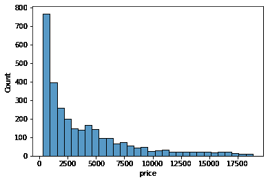

直方图只对数值变量有效。他们将数据分成任意数量的大小相等的箱，并显示每个箱中有多少钻石。在这里，我们可以大致估算一下，将近 800 颗钻石的价格在 0 到 1000 之间。

每个箱子里都装有钻石。相反，我们可能希望看到有多少百分比的钻石落入每个箱子中。为此，我们将把`histplot` 函数的`stat` 参数设置为`percent`:

```
>>> sns.histplot(sample["price"], stat="percent")
```


现在，每个柱/条的高度显示了钻石的百分比。让我们对钻石的克拉数做同样的计算:

```
sns.histplot(sample["carat"], stat="percent")
```

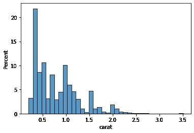

观察最初的几根金条，我们可以得出结论，大多数钻石重量不到 0.5 克拉。直方图旨在获取一个数值变量，并显示其形状。统计学家关注变量的分布。

然而，直方图并不是完成这项工作的唯一图表。还有一个叫做 [KDE 图](https://seaborn.pydata.org/generated/seaborn.kdeplot.html)(内核密度估计)的图，它使用一些复杂的数学来绘制这样的曲线:

```
sns.kdeplot(sample["table"])
```

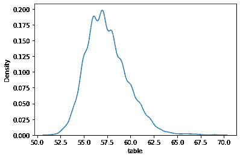

创建表格变量的 KDE 图向我们展示了大多数钻石的尺寸在 55.0 到 60.0 之间。此时，我将把绘制其他数值变量的 kde 和直方图的任务留给您，因为我们必须继续讨论分类特征。

### 在 Seaborn 创建计数图

最常见的分类特征图是计数图。将我们数据集中的分类特征的名称传递给 Seaborn 的`countplot`会绘制一个条形图，每个条形的高度代表每个类别中的钻石数量。以下是钻石切割的计数图:

```
sns.countplot(sample["cut"])
```

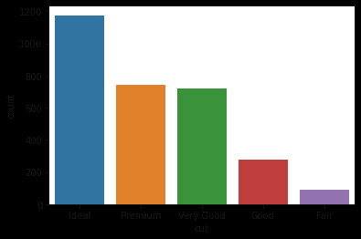

我们可以看到，我们的数据集包含的理想钻石比优质或非常好的钻石要多得多。这是感兴趣的颜色列表:

```
sns.countplot(sample["color"])
```

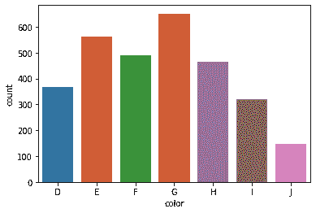

EDA 的单变量分析部分到此结束。

## 使用 Seaborn 执行双变量分析

现在，让我们一次看两个变量之间的关系。先说钻石克拉和价格的联系。

### 创建散点图

我们已经知道，克拉越高的钻石价格越高。让我们看看能否直观地捕捉到这一趋势:

```
sns.scatterplot(x=sample["carat"], y=sample["price"])
```

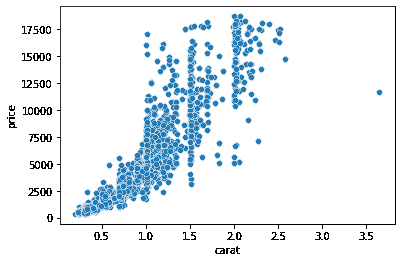

这里，我们使用另一个 Seaborn 函数来绘制散点图。散点图是使用最广泛的图表之一，因为它们通过使用点云精确地显示两个变量之间的关系。

上图中，每个点代表一颗钻石。这些点的位置由它们的克拉数和价格决定，我们将它们传递给散点图函数的 X 和 Y 参数。

该图证实了我们的假设——越重的钻石越贵。我们是根据这些点的曲线上升趋势得出这个结论的。

```
sns.scatterplot(x=sample["depth"], y=sample["table"])
```

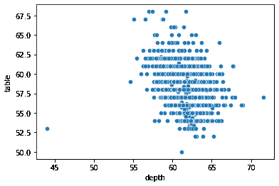

让我们试着在桌子上画出深度。坦率地说，这个散点图令人失望，因为我们无法像上一个散点图那样得出切实的结论。

### 建筑箱线图

另一个典型的二元图是箱线图，它根据五个数字的总结，绘制一个变量相对于另一个变量的分布:

```
sns.boxplot(x=sample["color"], y=sample["price"])
```

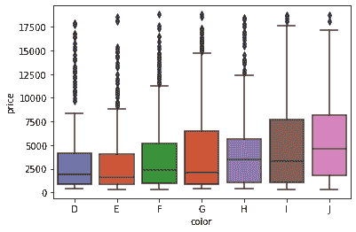

上面的方框图显示了每个颜色类别与其各自价格之间的关系。方框中每条垂直线底部和顶部的水平顶点代表该类别的最小值和最大值。方框的边缘，特别是底部和顶部边缘，代表第 25 和第 75 个百分点。

换句话说，第一个方框的底部边缘告诉我们，25%的 D 色钻石价格低于约 1250 美元，而顶部边缘则显示 75%的钻石价格低于约 4500 美元。中间的小水平线表示中间值，即 50%的标志。

上面的黑点是[异常值](https://en.wikipedia.org/wiki/Outlier#:~:text=In%20statistics%2C%20an%20outlier%20is,serious%20problems%20in%20statistical%20analyses.)。让我们绘制一个钻石净度及其与克拉的关系的箱线图:

```
sns.boxplot(diamonds["clarity"], diamonds["carat"])
```

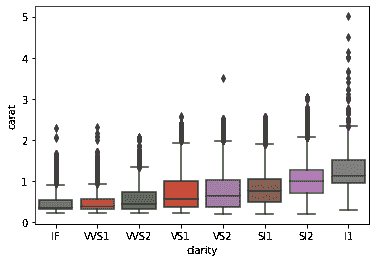

这里我们看到一个有趣的趋势。钻石净度从最好到最差依次显示，我们可以看到，净度越低的钻石在数据集中的权重越大。最后一个方框显示了最低净度(l1)钻石的平均重量为 1 克拉。

## 多变量分析

最后，是时候同时考虑多个变量了。

### 在 Seaborn 创建配对图

你将遇到的最常见的多元图是 Seaborn 的配对图。 [Pair plots](https://seaborn.pydata.org/generated/seaborn.pairplot.html) 采用几个数字变量，并绘制它们之间的每一个组合。下面，我们将创建一个价格、克拉、表格和深度特征的配对图，以使事情易于管理:

```
sns.pairplot(sample[["price", "carat", "table", "depth"]])
```

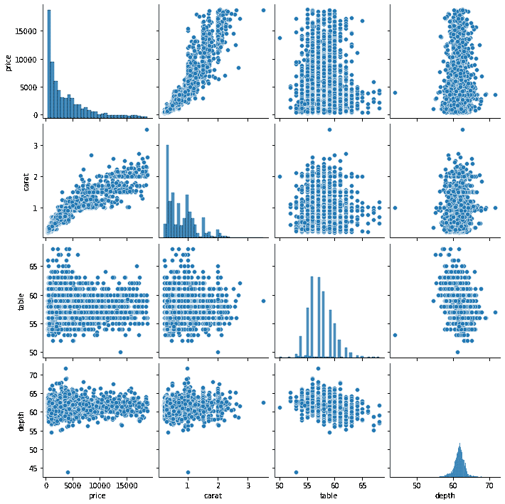

每个变量都是相对于其他变量绘制的，导致对角线上的双倍绘图。对角线本身包含直方图，因为每个直方图都是相对于自身绘制的变量。

配对图是同时创建多个散点图和直方图的紧凑单线版本。

到目前为止，我们仅仅依靠我们的视觉直觉来解读不同特征之间的关系。然而，许多分析师和统计学家需要数学或统计方法来量化这些关系，以支持我们的“眼球估计”这些统计方法之一是计算特征之间的相关系数。

[相关系数](https://en.wikipedia.org/wiki/Pearson_correlation_coefficient)，通常表示为 R，衡量一个数字变量与另一个变量的线性关联程度。它的范围从-1 到 1，接近范围限制的值表示强关系。

换句话说，如果系数的绝对值在 0 和 0.3 之间，则认为是弱(或没有)关系。如果它在 0.3-0.7 之间，关系的强度被认为是中等的，而大于 0.7 的相关性代表强连接。

Pandas 使得计算每个特征对之间的相关系数变得容易。通过在我们的数据帧上调用`corr` 方法，我们得到一个相关矩阵:

```
correlation_matrix = diamonds.corr()

>>> correlation_matrix
```

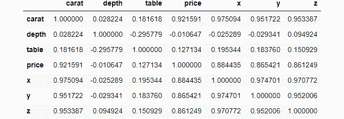

```
>>> correlation_matrix.shape
(7, 7)
```

仔细看，我们看到 1 的对角线。这些是完美的关系，因为对角线包含了一个特征和它本身之间的相关性。

### 在 Seaborn 引入热图

然而，查看原始相关矩阵并不能揭示太多信息。我们将再次使用另一个名为热图的 Seaborn 图来解决这个问题:

```
>>> sns.heatmap(correlation_matrix)
```

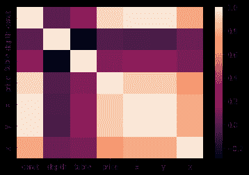

将我们的关联矩阵传递给 heatmap 函数会显示一个图，该图根据矩阵的大小给矩阵的每个单元格着色。右边的颜色条作为图例，说明不同的颜色代表不同的星等。

但是我们可以做得更好。我们可以对热图进行注释，使每个单元格都包含其大小，而不是让查看者去猜测数字:

```
sns.heatmap(correlation_matrix, square=True, annot=True, linewidths=3)
```

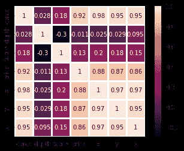

为此，我们将`annot`参数设置为`True`，它在图上显示原始相关性。我们还将`square`设置为`True`，以使热图呈方形，从而更具视觉吸引力。我们还增加了线条宽度，以便热图中的每个单元格更加清晰。

通过解释该热图，我们可以了解到 X、Y 和 Z 要素之间的关系最为密切。它们都具有> 0.8 的相关性。我们还看到，表和深度负相关，但很弱。我们也可以从散点图中证实我们的假设——克拉和价格之间的相关性相对较高，为 0.92。

我们可以用来探索多变量关系的另一种方法是使用包含更多变量的散点图。看看下面这张:

```
sns.scatterplot(sample["carat"], sample["price"], hue=sample["cut"])
```

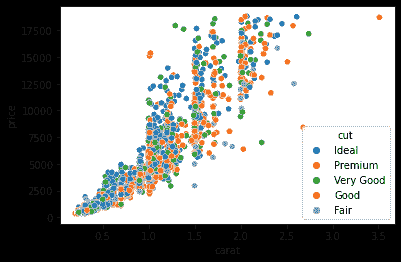

现在，每个点根据其切割类别进行着色。我们通过将`cut`列传递给`scatterplot`函数的`hue`参数实现了这一点。我们也可以将数字变量传递给`hue`:

```
sns.scatterplot(sample["carat"], sample["price"], hue=sample["x"])
```

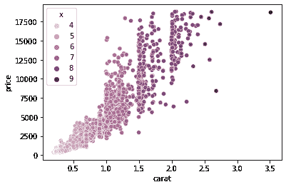

在上面的例子中，我们绘制了克拉与价格的关系，并根据钻石的宽度为其上色。

这里我们可以做两个观察:

1.  较重的钻石价格更高
2.  较重的钻石也较宽

我们可以增加点的大小，而不是用颜色对第三个变量进行编码:

```
sns.scatterplot(sample["carat"], sample["price"], size=sample["y"])
```

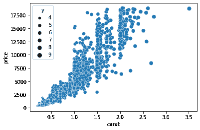

这一次，我们将 Y 变量传递给`size`参数，它根据每个菱形的 Y 值来缩放点的大小。最后，我们可以通过将单独的列传递给`hue`和`size`来同时绘制四个变量:

```
sns.scatterplot(sample["carat"], sample["price"], hue=sample["cut"], size=sample["z"])
```

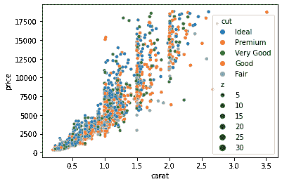

现在，该图将钻石切割类别编码为颜色，并将它们的深度编码为点的大小。

### 使用 Seaborn 的子管道

让我们看看你可以用 Seaborn 创建的一些更复杂的视觉效果，比如一个支线剧情。当我们使用`pairplot`函数时，我们已经看到了一个支线剧情的例子:

```
g = sns.pairplot(sample[["price", "carat", "depth"]])
```


```
>>> type(g)
seaborn.axisgrid.PairGrid
```

`pairplot`函数是创建一组叫做`PairGrid`的支线剧情的简写。幸运的是，我们不仅仅局限于`pairplot`功能。我们可以创建自定义的`PairGrids`:

```
g = sns.PairGrid(sample[["price", "carat", "depth"]])
```

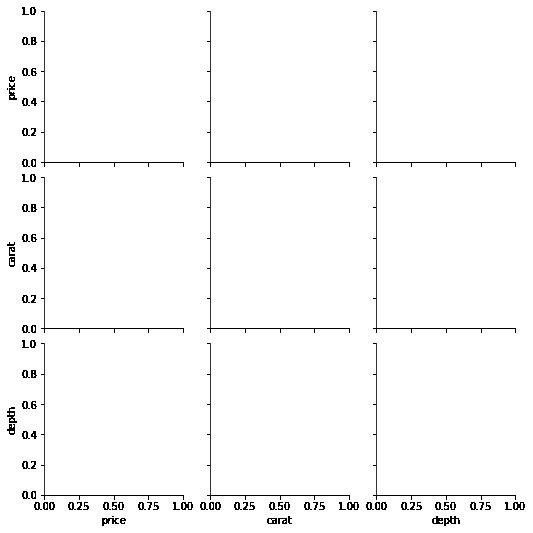

将 dataframe 传递给`PairGrid` 类会返回一组空的支线剧情，如上所示。现在，我们将使用`map`函数来填充每个:

```
g = sns.PairGrid(sample[["price", "carat", "depth"]])
g.map(sns.scatterplot)
```

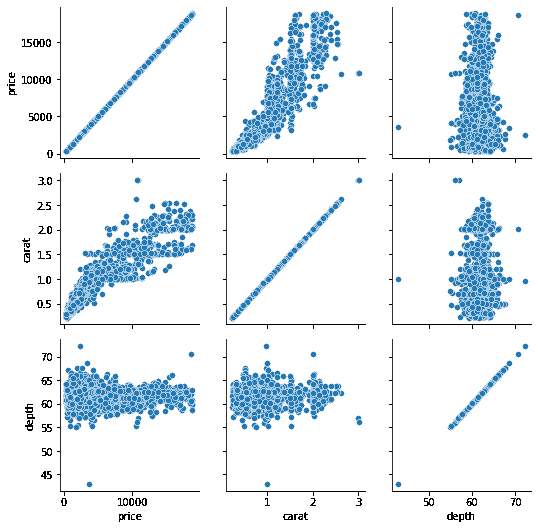

接受一个海底绘图函数的名字，并将其应用于所有支线剧情。这里，我们不需要对角线上的散点图，所以我们可以用直方图填充它:

```
g = sns.PairGrid(sample[["price", "carat", "depth"]])
g.map_offdiag(sns.scatterplot)
g.map_diag(sns.histplot);
```

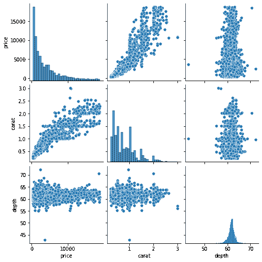

使用`map_offdiag` 和`map_diag` 函数，我们得到了与`pairplot`相同的结果。但是我们可以进一步改进上面的图表。例如，我们可以使用`map_lower` 和`map_upper`在上下三角形中绘制不同的图表:

```
g = sns.PairGrid(sample[["price", "carat", "depth"]])
g.map_lower(sns.scatterplot)
g.map_upper(sns.kdeplot)

g.map_diag(sns.histplot);
```

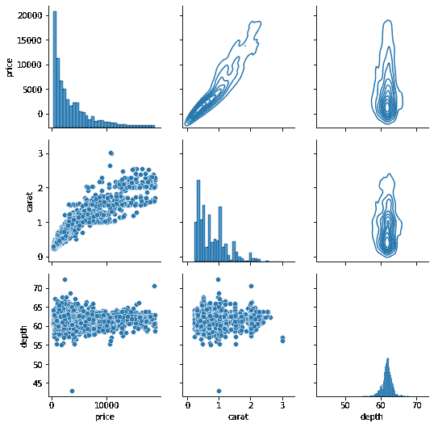

上三角 KDE 图由于其 2D 性质而变成了[等高线](https://en.wikipedia.org/wiki/Contour_line)。

最后，我们还可以使用`hue` 参数对每个子情节中的第三个变量进行编码:

```
g = sns.PairGrid(sample[["price", "carat", "depth", "cut"]], hue="cut")

g.map_diag(sns.histplot)
g.map_offdiag(sns.scatterplot)
g.add_legend();
```

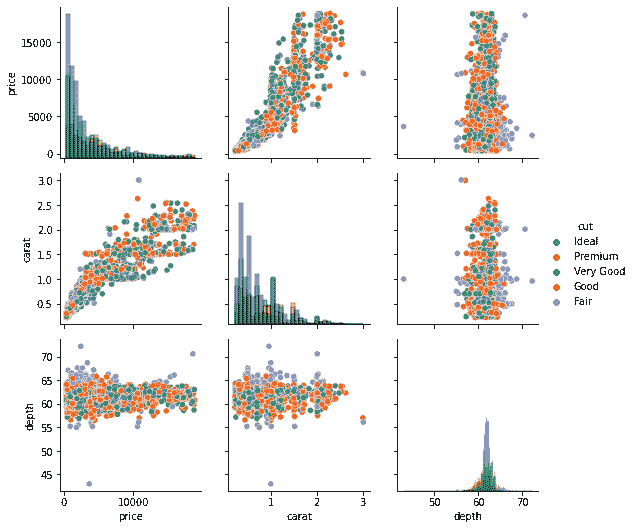

调用`PairGrid`类时指定了`hue`参数。我们还调用网格上的`add_legend`函数来使图例可见。

但是，上面的支线剧情有问题。这些点完全是过度绘制的，所以我们无法合理地区分每个钻石切割之间的任何模式。

为了解决这个问题，我们可以使用一组不同的叫做`FacetGrid`的支线剧情。一个`FacetGrid` 可以像一个`PairGrid`一样被创建，但是有不同的参数:

```
g = sns.FacetGrid(sample, col="cut")
```


将切割列传递给参数`col` 会为每个钻石切割类别创建一个带有五个子情节的`FacetGrid`。让我们用`map`填充它们:

```
g = sns.FacetGrid(sample, col="cut")

g.map(sns.scatterplot, "price", "carat");
```


这一次，我们在每个钻石切割类别的独立支线剧情中有独立的散点图。如您所见，FacetGrid 足够智能，可以放置相关的轴标签。

我们还可以通过将一个列名传递给`row` 参数来引入另一个分类变量作为一行:

```
g = sns.FacetGrid(sample, col="cut", row="color")

g.map(sns.scatterplot, "price", "carat");
```

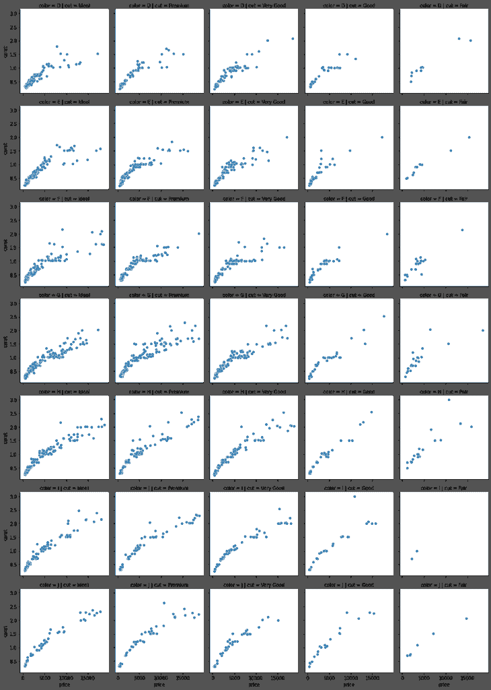

由此产生的情节是巨大的，因为每个钻石切割/颜色组合都有一个副情节。还有许多其他方式可以定制这些面网格和[对网格](https://seaborn.pydata.org/generated/seaborn.PairGrid.html)，所以请查看文档以了解更多信息。

### seaborn vs . Matplotlib——选哪个？

我们已经专门使用了 Seaborn，但是您可以考虑使用 Matplotlib。

我们使用 Seaborn 是因为它简单，而且，因为 Seaborn 构建在 Matplotlib 之上，所以它旨在补充 Matplotlib 的弱点，使其更加用户友好。

另一个主要原因是默认的绘图样式。默认情况下，Seaborn 创造了更多的轻松的眼睛情节。另一方面，Matplotlib 的默认样式很糟糕。例如，下面是同样的钻石价格直方图:

```
fig, ax = plt.subplots()

ax.hist(sample["price"])
```

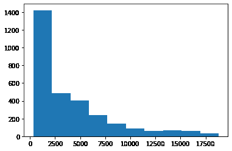

这是非常不同的。虽然 Seaborn 会自动找到最佳的箱数，但 Matplotlib 总是使用十个箱(尽管您可以手动更改)。另一个例子是克拉与价格散点图:

```
fig, ax = plt.subplots()

ax.scatter(sample["carat"], sample["price"])
```

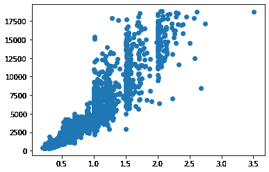

一般来说，Seaborn 适合希望使用较少代码创建漂亮图表的开发人员。

然而，视觉杰作的关键在于定制，这也是 Matplotlib 真正的亮点。虽然它有一个更陡峭的学习曲线，一旦你掌握了它，你就可以创造出令人瞠目结舌的视觉效果，如[这些](https://ibexorigin.medium.com/yes-these-unbelievable-masterpieces-are-created-with-matplotlib-2256a4c54b12)。

## 结论

本教程只是作为真实世界 EDA 的一瞥。尽管我们已经了解了许多不同类型的情节，但你还可以创造更多的情节。

从这里，你可以深入了解每一个介绍的剧情功能。每一个都有许多参数，阅读文档和尝试示例应该足以满足您绘制更好图表的需要。

我还推荐阅读 Matplotlib 文档,了解数据可视化中更高级的方法。感谢您的阅读！

## 使用 [LogRocket](https://lp.logrocket.com/blg/signup) 消除传统错误报告的干扰

[](https://lp.logrocket.com/blg/signup)

[LogRocket](https://lp.logrocket.com/blg/signup) 是一个数字体验分析解决方案，它可以保护您免受数百个假阳性错误警报的影响，只针对几个真正重要的项目。LogRocket 会告诉您应用程序中实际影响用户的最具影响力的 bug 和 UX 问题。

然后，使用具有深层技术遥测的会话重放来确切地查看用户看到了什么以及是什么导致了问题，就像你在他们身后看一样。

LogRocket 自动聚合客户端错误、JS 异常、前端性能指标和用户交互。然后 LogRocket 使用机器学习来告诉你哪些问题正在影响大多数用户，并提供你需要修复它的上下文。

关注重要的 bug—[今天就试试 LogRocket】。](https://lp.logrocket.com/blg/signup-issue-free)