# 千刀万剐:消除常见 React 性能问题的清单

> 原文：<https://blog.logrocket.com/death-by-a-thousand-cuts-a-checklist-for-eliminating-common-react-performance-issues/>

你有没有想过如何让你的应用反应更快？

什么事？

有一个清单来消除常见的 React 性能问题怎么样？

嗯，你来对地方了。

在本文中，我将带您通过一个实用的、逐步的指南来消除常见的 React 性能问题。

首先，我会给你看问题，然后提供解决方案。通过这样做，您将能够将相同的概念应用到现实世界的项目中。

这篇文章的目标不是成为一篇冗长的文章，相反，我将讨论一些你现在就可以开始在应用程序中使用的快速技巧。

我们开始吧！

## 示例项目

为了使本文尽可能实用，我将带您浏览在单个 React 应用程序上工作时的各种用例。

我把这个 app 叫做 [Cardie](https://github.com/ohansemmanuel/Cardie-performace) 。


The Cardie app.

如果你想跟进的话，这是 GitHub 的回购协议。

Cardie 是一个简单的应用程序。它所做的只是显示用户的个人资料信息。通常称为用户档案卡。


The user details being displayed.

它还增加了一个功能，可以通过点击按钮来改变用户的职业。


Cardie in action 🙂

点击应用程序底部的按钮后，用户的职业就会改变。

虽然您可能很快会一笑置之，认为这是一个简单的应用程序，与现实世界的应用程序相去甚远，但您可能会惊讶地发现，从这个示例应用程序的性能问题中获得的知识适用于您构建的任何现实世界的应用程序。

所以，保持冷静，享受这篇文章。

清单来了！

## 1.识别浪费的渲染

识别 React 应用程序中浪费的渲染是识别大多数性能问题的完美开端。

有几种不同的方法可以实现这一点，但是最简单的方法是在 React DevTools 中打开“高亮更新”选项。

* * *

### 更多来自 LogRocket 的精彩文章:

* * *


How to enable the highlight update toggle in React DevTools.

在与应用程序交互时，更新会以绿色闪烁的方式在屏幕上突出显示。

绿色闪光显示应用程序中由 React 重新渲染的组件。

使用 Cardie，在改变用户的职业时，整个父组件`App`似乎被重新渲染。


Note the green flash around the user card.

这看起来不对劲。

该应用程序可以工作，但当要更新的更改只是一小部分时，真的没有理由重新呈现整个组件。

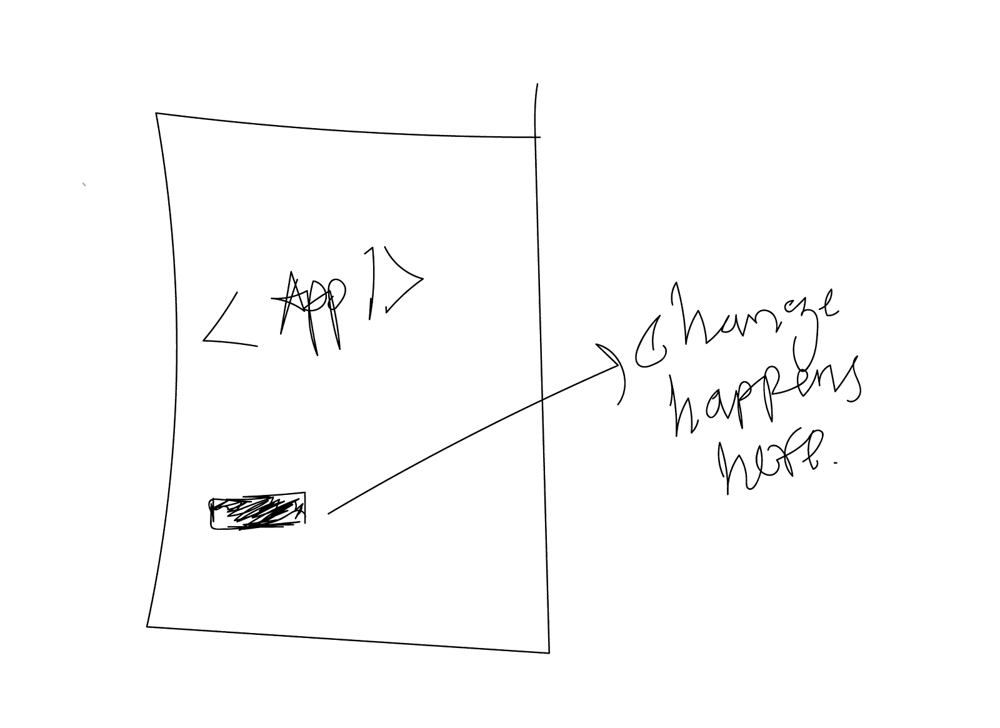

The actual update happens in a small part of the app.

更理想的突出显示更新应该是这样的:


Note how the highlighted update is contained within the small updated region.

在更复杂的应用程序中，浪费渲染的影响可能是巨大的！重新呈现的组件可能大到足以提升性能。

看到了问题，有什么解决的办法吗？

一旦你从视觉上注意到应用程序中浪费的渲染，一个好的开始就是尝试分解你的组件树来支持频繁更新的区域。

让我告诉你我的意思。

在 Cardie 中，`App`组件通过来自`react-redux`的`connect`函数连接到 Redux store。从商店领取道具`name`、`location`、`likes`、`description`。

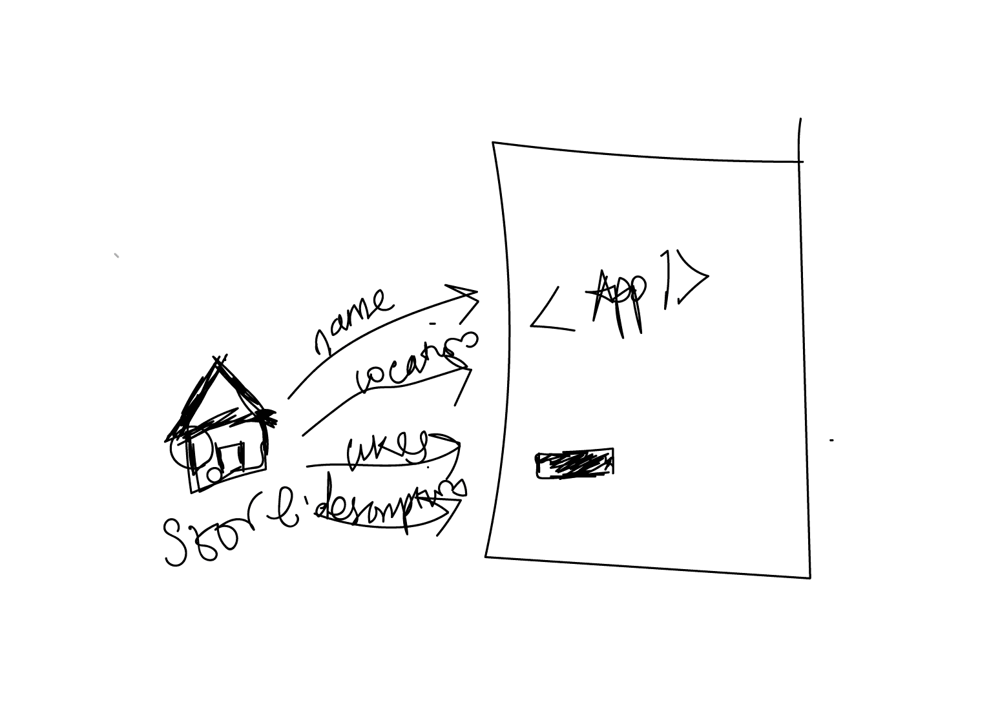

`<App/>` receives the props it needs directly from the Redux store.

`description`道具定义了用户当前的职业。

本质上，正在发生的事情是，每当点击按钮改变用户职业时，`description`道具也随之改变。道具的这种变化导致`App`组件被完全重新渲染。

如果你还记得 React 101，每当组件的`props`或`state`改变时，就会触发重新渲染。

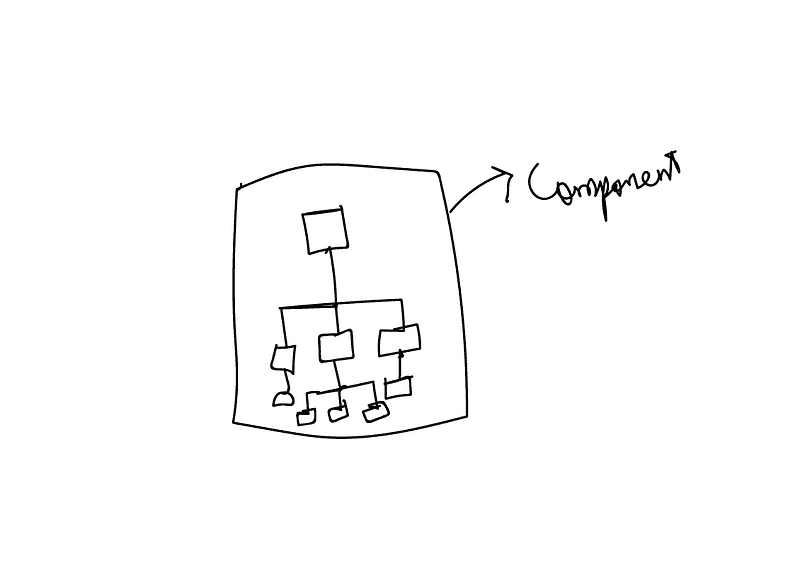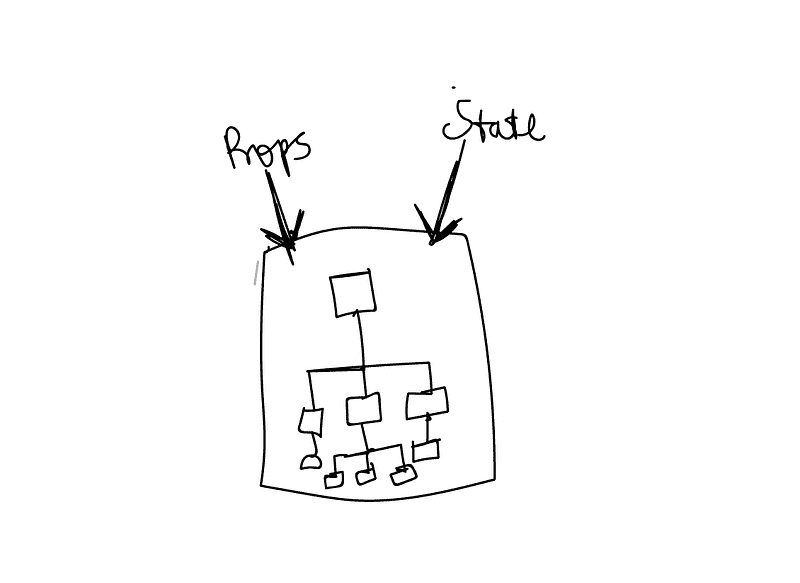

A React component renders a tree of elements. These elements are defined via props and state. If the props or state values changes, the tree of elements is re-rendered. This results in a new tree.

与其让`App`组件无意义地重新呈现，不如我们将被更新的元素本地化到一个特定的 React 组件？

例如，我们可以创建一个名为`Profession`的新组件，它呈现自己的 DOM 元素。


在这种情况下，`Profession`组件将呈现用户职业的描述，例如，“我是一名编码员”。

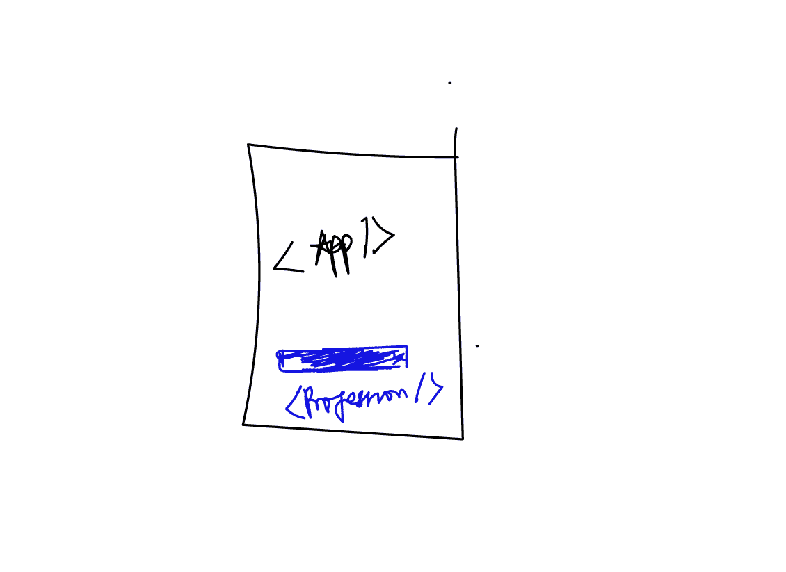

The `<Profession/>` component will be rendered in the `<App/>` component.

组件树现在看起来像这样:

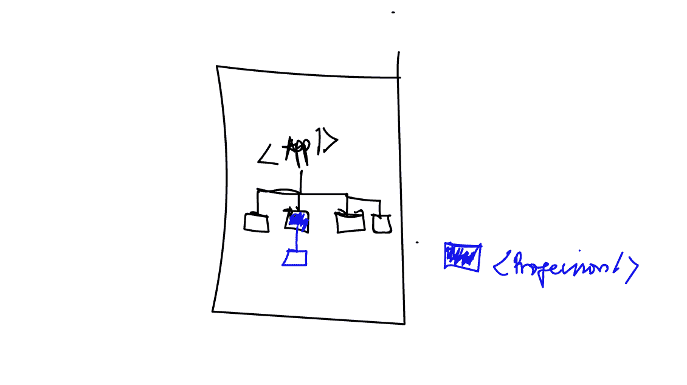

The `<App/>` component renders the elements it renders plus the `<Profession/>` component.

这里需要注意的重要一点是，与其让`<App/>`担心`profession`道具，不如现在考虑`<Profession/>`组件。

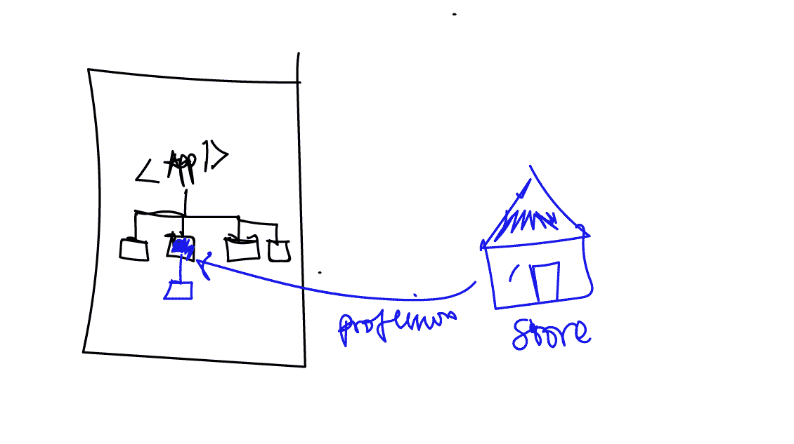

The profession will now be retrieved directly from the redux store by the `<Profession/>` component.

不管你是否使用`redux`，这里的要点是`App`不再需要因为`profession`道具的改变而被重新渲染。取而代之的是`<Profession/>`组件。

完成此重构后，我们突出显示了一个理想的更新，如下所示:


Note how the highlighted updates is contained within `<Profession />`.

要查看代码更改，请查看 repo 中的[隔离组件分支](https://github.com/ohansemmanuel/Cardie-performace/tree/isolated-component)。

## 3.适当时使用纯成分

任何谈论性能的 React 资源都很可能会提到纯组件。

但是，你怎么知道什么时候正确使用[纯组件](https://reactjs.org/docs/react-api.html#reactpurecomponent)？

当然，你可以让每个组件都是纯组件，但是记住这是有原因的——因此有了`shouldComponentUpdate`函数。

纯组件的前提是，如果`props`与之前的道具和状态不同，组件*只有*重新渲染。

实现纯组件的一个简单方法是使用`React.PureComponent`而不是默认的`React.Component`。

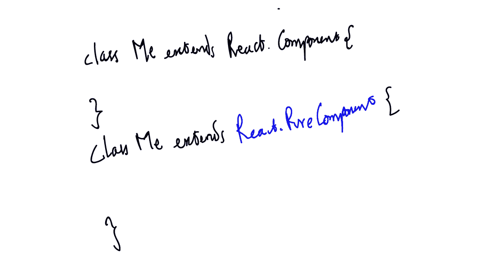

Using `React.PureComponent` as opposed to `React.Component`.

为了说明 Cardie 中的这个特定用例，让我们将`Profession`组件的渲染元素分解成更小的组件。

所以，这是之前`Profession`的内容:

```
const Description = ({ description }) => {
  return (
    <p>
     <span className="faint">I am</span> a {description}
    </p>
  );
}
```

我们将把它改为:

```
const Description = ({ description }) => {
  return (
    <p>
      <I />
      <Am />
      <A />
      <Profession profession={description} />
    </p>
  );
};
```

现在，`Description`组件呈现了 4 个子组件。

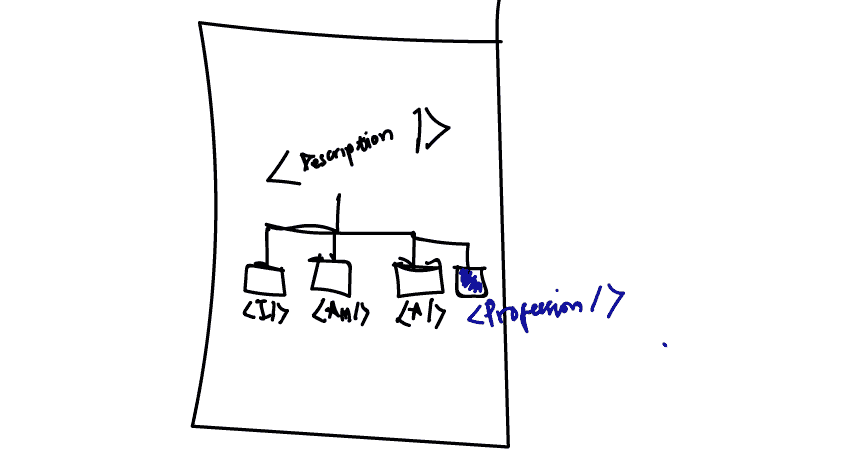

注意，描述组件接受一个`profession`属性。然而，它将这个属性传递给了`Profession`组件。从技术上讲，其他三个组件都不关心这个`profession`道具。

这些新组件的内容非常简单。例如，`<I />`组件只返回一个带有“I”文本的`span`元素:`span >I </span>`

如果应用程序运行，结果是一样的。这款应用很好用。

有趣的是，当`description`道具改变时，`Profession`的每个子组件也被重新渲染。

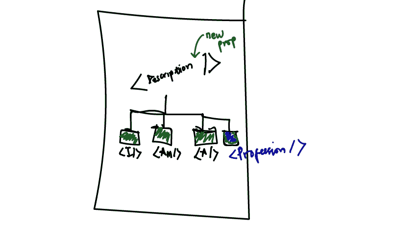

Once a new prop value is passed into the Description component, all the child components also re-render.

我在每个子组件的`render`方法中添加了一些日志——正如你所看到的，它们确实都被重新渲染了。

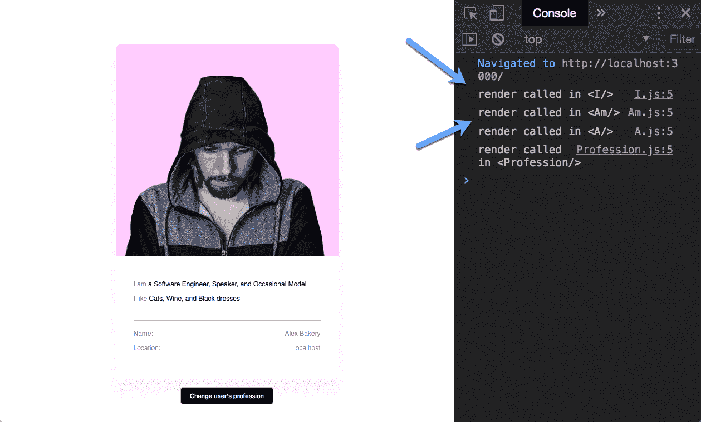

您还可以使用 react dev 工具查看突出显示的更新。


Note how there are green flashes around each of the words “I,” “am,” and “a.”

这种行为是意料之中的。每当组件的`props`或`state`发生变化时，它所呈现的元素树就会被重新计算。这等同于重新渲染。

在这个特殊的例子中，你会同意我的观点，即重新渲染`<I/>`、`<Am/>`和`<A/>`子组件是没有意义的。是的，父元素`<Description/>` 中的`props`发生了变化，但是如果这是一个足够大的应用程序，这种行为可能会造成一些性能威胁。

如果我们把这些子组件变成纯组件会怎么样？

考虑一下`<I/>`组件:

```
import React, {Component, PureComponent} from "react"

class I extends Component {
  render() {
    return <span className="faint">I </span>;
}

class I extends PureComponent {
  render() {
    return <span className="faint">I </span>;
}
```

言下之意，React 在幕后得到通知，因此如果这些子组件的属性值没有改变，就没有必要重新渲染它们。

是的，即使父元素的属性发生了变化，也不要重新渲染它们！


在重构后检查突出显示的更新时，您可以看到子组件不再被重新呈现。只有`prop`实际改变的`Profession`组件被重新渲染。


There are no flashes around the words “I”, “am,” and “a.” Just the overall container, and the profession flashes.

在一个更大的应用程序中，您可能会发现通过将某些组件变成纯组件可以获得巨大的性能优化。

要查看代码更改，请查看 repo 中的[纯组件分支](https://github.com/ohansemmanuel/Cardie-performace/tree/pure-components)。

## 4.避免传递新的对象作为道具

再次记住，每当组件的`props`改变时，就会发生重新渲染。

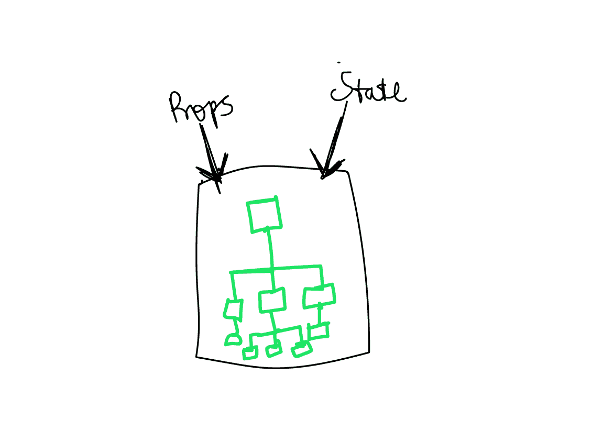

If the props or state values changes, the tree of elements is re-rendered. This results in a new element tree.

如果组件的`props`没有改变，但是 React 认为它改变了，该怎么办？

嗯，还会有重新渲染！但这不是很奇怪吗？

这种看似奇怪的行为之所以发生，是因为 Javascript 的工作方式 React 如何处理新旧属性值之间的比较。

让我给你看一个例子。

下面是`Description`组件的内容:

```
const Description = ({ description }) => {
  return (
    <p>
       <I />
       <Am />
       <A />
       <Profession profession={description} />
    </p>
  );
};
```

现在，我们将重构`I`组件以接受某个`i`道具。这将是以下形式的对象:

```
const i = { 
  value: "i"
};
```

无论`i`中的值属性是什么，都将被设置为`I`组件中的值。

```
class I extends PureComponent {
  render() {
    return <span className="faint">{this.props.i.value} </span>;
  }
}
```

在`Description`组件中，`i`道具被创建并传入，如下所示:

```
class Description extends Component {
  render() {
    const i = {
      value: "i"
    };
    return (
      <p>
            <I i={i} />
        <Am />
        <A />
        <Profession profession={this.props.description} />
      </p>
    );
  }
}
```

请耐心听我解释。

这是完全正确的代码，而且运行良好——但是有一个问题。

即使`I`是一个纯粹的组件，现在每当用户的职业改变时它都会重新渲染！


On clicking the button, the logs show that both `<I/>` and `<Profession/>` are re-rendered. Remember there’s been no actual props change in `<I/>`. Why the re-render?

但是为什么呢？

一旦`Description`组件收到新的 props，就会调用`render`函数来创建它的元素树。

在调用`render`函数时，它创建一个新的`i`常量:

```
const i = { 
  value: "i"
};
```

当 React 开始评估线`<I i={i} />`时，它将道具`i`视为不同的道具，一个新的对象——因此重新渲染。

如果你还记得 React 101，React 对上一个和下一个道具做了一个浅显的比较。

字符串和数字等标量值按值进行比较。对象通过引用进行比较。

这意味着，即使常量`i`在重新渲染时具有相同的值，引用也是不同的。在内存中的位置不是。

它是每次渲染调用时新创建的对象。因此，传递给`<I/>`的`prop`值被认为是“新的”，从而产生一个重新渲染。

在较大的应用程序中，这可能导致渲染浪费和潜在的性能缺陷。

避免这个。

这适用于每个`prop`，包括事件处理程序。

如果可以避免，就不应该这样做:

```
... 
render() {
  <div onClick={() => {
}
...
```

每次在 render 中创建一个新的函数对象。最好这样做:

```
...
handleClick:() ={
}
render() {
  <div onClick={this.handleClick}
}
...
```

明白了吗？

同样，我们可以重构发送给`<I />`的道具，如下所示:

```
class Description extends Component {
  i = {
    value: "i"
  };
  render() {
    return (
      <p>
       <I i={this.i} />
       <Am /> 
       <A />
       <Profession profession={this.props.description} />
      </p>
    );
  }
}
```

现在，引用总是相同的，`this.i`。

渲染时不会创建新对象。

要查看代码更改，请查看 repo 的[新对象分支](https://github.com/ohansemmanuel/Cardie-performace/tree/new-objects)。

## 5.使用生产版本

部署到生产环境时，请始终使用生产版本。这是一个非常简单但很棒的练习。


The “development build” warning you get with the React DevTools in development.

如果您已经用`create-react-app`引导了您的应用程序来运行生产构建，请使用命令`npm run build`。

这将产生用于生产的包优化文件。

## 6.使用代码分割

当您捆绑您的应用程序时，您很可能将整个应用程序捆绑在一个大块中。这样做的问题是，随着应用程序的增长，捆绑包也会增长。

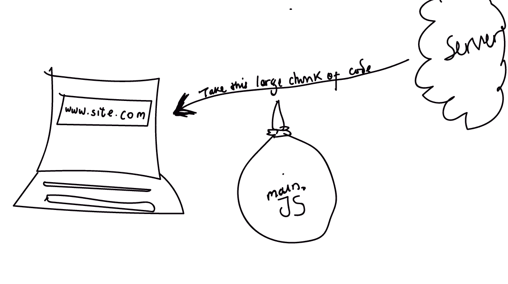

Once users visit the site, they are sent a large chunk of code for the entire app.

代码拆分提倡不要一次将这一大块代码发送给用户，而是可以在用户需要时动态地将代码块发送给用户。

一个常见的例子是基于路由的代码分割。在这种方法中，基于应用程序中的路由将代码分割成块。


The /home route gets a small chunk of code, so does the /about route.

另一种方法是基于组件的代码分割。在这种方法中，如果一个组件当前没有显示给用户，它的代码可能会延迟发送给用户。

无论您坚持使用哪种方法，重要的是理解其中的利弊，并且不降低应用程序的用户体验。

代码分割很棒，它可以提高应用程序的性能。

我采用了一种概念性的方法来解释代码分割。如果你想要更多的技术依据，请看看官方的 [React 文档](https://reactjs.org/docs/code-splitting.html)。他们在从技术上解释这个概念方面做得不错。

### 结论

现在，您已经有了一个不错的清单，用于跟踪和修复 React 应用程序中常见的性能问题。去构建一些快速应用程序吧！

## [LogRocket](https://lp.logrocket.com/blg/react-signup-general) :全面了解您的生产 React 应用

调试 React 应用程序可能很困难，尤其是当用户遇到难以重现的问题时。如果您对监视和跟踪 Redux 状态、自动显示 JavaScript 错误以及跟踪缓慢的网络请求和组件加载时间感兴趣，

[try LogRocket](https://lp.logrocket.com/blg/react-signup-general)

.

[ ](https://lp.logrocket.com/blg/react-signup-general) [](https://lp.logrocket.com/blg/react-signup-general) 

LogRocket 结合了会话回放、产品分析和错误跟踪，使软件团队能够创建理想的 web 和移动产品体验。这对你来说意味着什么？

LogRocket 不是猜测错误发生的原因，也不是要求用户提供截图和日志转储，而是让您回放问题，就像它们发生在您自己的浏览器中一样，以快速了解哪里出错了。

不再有嘈杂的警报。智能错误跟踪允许您对问题进行分类，然后从中学习。获得有影响的用户问题的通知，而不是误报。警报越少，有用的信号越多。

LogRocket Redux 中间件包为您的用户会话增加了一层额外的可见性。LogRocket 记录 Redux 存储中的所有操作和状态。

现代化您调试 React 应用的方式— [开始免费监控](https://lp.logrocket.com/blg/react-signup-general)。