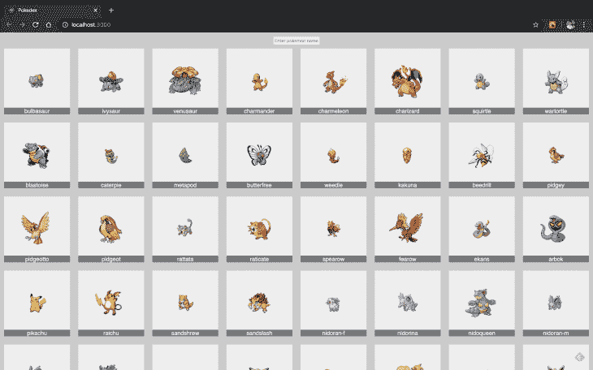
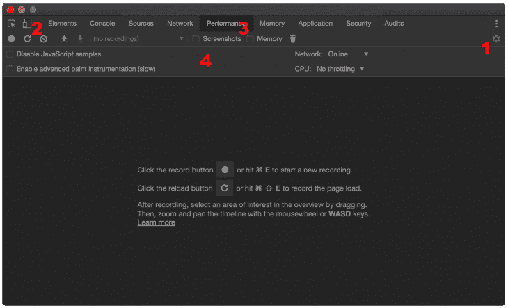
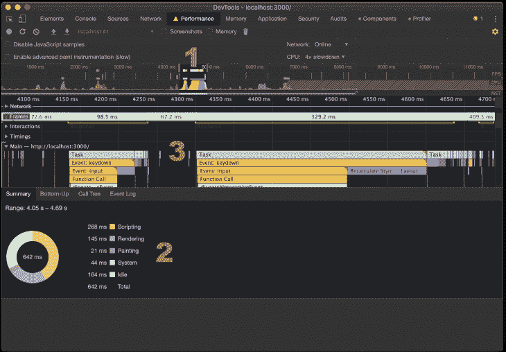
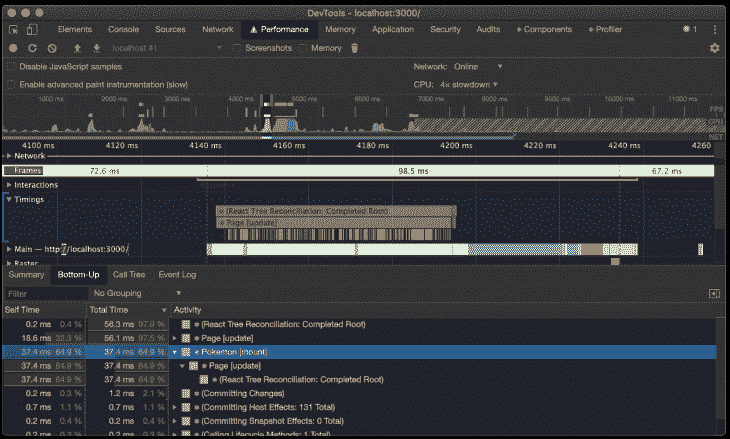
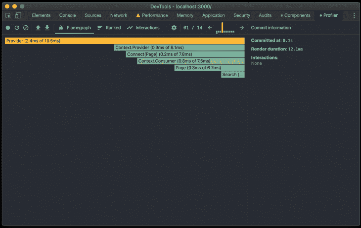
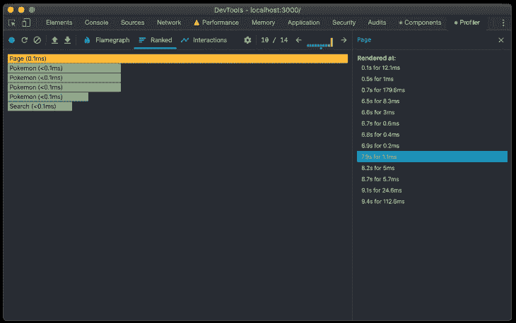

# 在 React 中调试性能问题

> 原文：<https://blog.logrocket.com/debugging-performance-problems-in-react/>

在开发任何应用程序时，确保高水平的性能是关键，无论是 API、前端应用程序还是后端应用程序。

尽管性能很重要，但是性能测试和调试比您想象的更容易被遗忘。

关于基于 React 的应用程序，已经有数百篇好文章关注于消除性能问题的策略，识别和消除瓶颈，以及排除通常导致内存泄漏、内存不足或死锁错误的常见错误。

然而，当涉及到快速增长、处理大量并发数据或包含大量嵌套在一起的复杂流程的应用程序时，事情会变得有点棘手和难以预测——甚至是测试和调试。

这就是坚实的工具发挥作用的时候了。了解它们是如何工作的只是第一步。

您可以经常使用它，将您的日常工作作为一个开发工具来不断地度量一个新特性的性能，并判断它是否会影响现有的特性。

一旦你习惯了自动化测试和持续的集成和交付，自动化你的性能测试会更加顺利。

本文将重点讨论工具部分。

我们将深入探讨当前在评测方面的最佳解决方案:Chrome [性能选项卡](https://developers.google.com/web/tools/chrome-devtools/evaluate-performance)，来自 [React Chrome 插件](https://chrome.google.com/webstore/detail/react-developer-tools/fmkadmapgofadopljbjfkapdkoienihi?hl=en) DevTools 的评测器，以及 React 官方[评测器 API](https://reactjs.org/docs/profiler.html) 。

这样，您将更好地了解哪些选项是可用的，哪一个最适合您的用例。

## 使用 Chrome Performance 选项卡进行性能分析

React 已经以性能著称。这是近年来它最好的旗舰产品之一。凭借其虚拟 dom，效率是每个开发人员都信任的一个众所周知的特性。

然而，你也知道不存在什么灵丹妙药，当你的一些组件开始变得太慢而无法渲染，或者你曾经引以为豪的一些嵌套结构不再执行得那么好时，这就是你必须停下来分析整个事情的时候。

我们将从 Chrome Performance 选项卡开始，这是一个很好的资源，不仅可以找到 React 的问题，还可以找到您可能开发的任何前端应用程序的问题。这是一个很好的方法，因为它是框架/库不可知的，这意味着您在这里获得的知识可以用于其他栈中的未来项目。

首先，一些依赖性:

*   您必须在开发模式下安装了 Node、npm 和 React(16+)；
*   谷歌 Chrome，或 Chromium，DevTools(它已经在浏览器里了)。

为了更好地理解它，我们需要一个项目样本来玩。

为了保持文章的重点，我们将使用官方 React 示例[项目](https://reactjs.org/community/examples.html)之一:[口袋妖怪搜索应用](https://github.com/alik0211/pokedex)。

将其克隆到您的本地计算机上，并运行以下命令:

```
npm install
npm start
```

然后，下面的屏幕将在您的浏览器中提示:



### 本地运行的 Pokedex React 应用程序

要让 Chrome 插件与 React 一起工作，你应该在开发模式下运行应用程序。一旦我们使用的应用程序是用这个设置创建的，你就不用担心了。

现在，打开你的 Chrome 开发工具，进入性能标签。在那里，你会看到如下界面:



### 性能选项卡概述

这里必须考虑一些因素:这个齿轮，当切换时，启用数字 4 可用的选项。它们对于微调你的侧写记录的方式很重要。

这里有三个按钮，分别是:切换新记录、通过重新加载页面开始新的分析，以及清除当前记录。我们也有更多的输入，以确定您是否想要对屏幕导航/渲染进行截图，以及内存使用情况。

我们已经提到了控制——在这里，重要的是您在“CPU”项选择“4x 减速”选项。这将有助于在模拟环境中测试页面，在模拟环境中，计算机的处理速度应该较慢。

现在，去你的 [http://locahost:3000/](http://locahost:3000/) ，启动录制按钮，玩玩口袋妖怪 app。录制时间不要超过 20 秒，这一点很重要，因为 Chrome 会因为要处理的数据太多而变得太慢。

结果取决于许多变量，如机器设置、CPU 和内存、互联网连接等。

所以，如果你的和我的不一样，不要担心——重要的是理解这个工具是如何工作的。

下图代表了我的测试记录:



### 报告记录示例

最重要的是第一点:时间线上的红色分段条清楚地表明某件事处理时间过长(通常与 CPU 消耗有关)。这是一个很好的调查起点。

还要注意，为了便于识别每个组有多少资源(脚本文件、绘画、图像等),每个过程都用不同的颜色表示。)在 2 号消费。

数字 3 显示了时间线中每个组的加载历史。但是“Main”部分对我们来说并不是很有用，因为它显示了太多:所有的 JavaScript 函数调用、事件触发等等。相反，我们将使用“计时”部分(见下图)。

这是因为 React 通过[用户计时 API 提供了大量的度量数据。](https://developer.mozilla.org/en-US/docs/Web/API/User_Timing_API)这是一个很好的方法来跟踪 JavaScript 文件中某些动作的时间，并将信息集中在浏览器的本机功能中。



### 探索时序部分

要了解这一部分，请单击其中一个计时块(注意，React 计时块在计时块的开头带有 React 徽标)，转到名为“自下而上”的底部菜单，并按“总时间”降序排列结果。

在这里，您可以看到每个 React 组件完成所用的时间，以及占总处理时间的百分比。一旦你知道了每个人所花的时间，就更容易找出差距所在，并采取行动。

此外，DevTools 在执行的操作类型(更新、装载等)的层次结构中的每个活动(在括号之间)之后打印。).

“自身时间”列依次表示在特定活动之前累积的时间总量。

最好能更好地了解到这一点已经过去了多长时间。

如果您想对问题的确切位置有更多的控制，您可以配置您的项目使用一个[源映射](https://developer.mozilla.org/en-US/docs/Tools/Debugger/How_to/Use_a_source_map)。

源地图是一种通向真实的、未统一的 JavaScript 代码版本的捷径。换句话说，它结合了从转换代码(美化、缩小等)生成的地图。)到原始源代码，让浏览器确切地知道为了调试目的如何重构原始代码。

## 使用 React DevTools 进行性能分析

在继续这一部分之前，您必须安装 [React 开发工具](https://chrome.google.com/webstore/detail/react-developer-tools/fmkadmapgofadopljbjfkapdkoienihi?hl=en)扩展。[默认情况下，分析器](https://reactjs.org/blog/2018/09/10/introducing-the-react-profiler.html)只在开发模式下工作。

目前，有一种方法可以在生产模式下运行并激活该特性:如果您感兴趣，只需关注这个[链接](https://gist.github.com/bvaughn/25e6233aeb1b4f0cdb8d8366e54a3977)。

通常，前端开发人员处理这个扩展只是为了检查 React 组件，但它不止于此。您也可以在 Profiler 选项卡中检查组件的性能。

### React 开发工具概述


看看上面的图片。这里，我们有扩展的四个主要部分。

首先，我们有扩展中的两个默认选项卡。

第一个，组件，是最有名的。在那里，您可以找到 React 组件的嵌套堆栈，并检查它们的状态。

第二个是指剖析机制。这里我们有几乎相同的 Chrome 性能标签的按钮。它们的功能也是相似的。

这三个选项卡指的是分析结果的显示方式。我们很快就会谈到这一点。

gear 将选择一系列选项来调整必须如何进行分析。我们将让一切都默认在这里。

现在，我们去录音。再次打开你的 Pokedex 应用程序，点击图 2(上图)所示的“开始剖析”按钮，然后玩这个应用程序。

完成后，再次单击同一按钮停止录制。

结果应该类似于下图:



### Pokedex DevTools 分析结果

这是 flamegraph 的结果，flame graph 是一个显示每个组件渲染所花费的总时间的图表，已经按平铺的长度排序。

DevTools 还引入了`commit`的概念，它类似于我们在 Performance 选项卡中看到的`self time`，即 React 实际上将更改应用于 DOM 的时间。

这里的颜色不是随机的——事实上，它们很重要。黄色瓷砖意味着他们花了更长的时间来完成。

蓝绿色的人说他们的渲染速度非常快。在上面的屏幕截图中，我们没有第三种颜色，灰色，但是它代表了提交时没有花费任何时间渲染(或重新渲染)的组件。

但是，如果您使用选项卡顶部的箭头导航到其他提交，您将看到一些灰色的组件，因为它们没有参与 React 的任何更新。



### 带有组件渲染历史记录的分级选项卡结果

上图显示了“排名”选项卡的可视化效果。注意，它侧重于计时。

单击左侧的任何组件后，右侧部分将更新该组件的所有历史信息，包括何时渲染以及渲染了多长时间。

另一方面，如果您单击时间表中的任何一项，您将看到左侧部分会更新，显示相同历史的平铺视图。

请注意，如果 React 组件化太复杂，那么需要一些定制规则来更好地过滤结果。为此，转到我们提到的齿轮图标，并探索它的选项。

## 探查器 API

从 React 16.4 开始，你可以受益于一个名为`<Profiler/>`的新组件，它属于 React 的[分析器 API](https://reactjs.org/docs/profiler.html) 。它有助于从源代码定制您的度量标准，为您的组件的生命周期测量时间。

它的用法非常简单:您只需要在代码中任何您希望收集渲染成本的地方添加标签。只有两个可能的道具:一个字符串`id`和一个`callback function`在每次提交执行后被调用。

让我们修改 Pokedex 应用程序来收集一些指标。在您最喜欢的 IDE 中打开项目并转到`cmp-page.js.`，然后将您的 import React 语句更新为以下内容:

```
import React, { Component, unstable_Profiler as Profiler } from 'react'
```

之后，在渲染函数上方添加以下内容:

```
onRenderCallback = (
    id, // the "id" prop of the Profiler tree that has just committed
    phase, // either "mount" (if the tree just mounted) or "update" (if it re-rendered)
    actualDuration, // time spent rendering the committed update
    baseDuration, // estimated time to render the entire subtree without memoization
    startTime, // when React began rendering this update
    commitTime, // when React committed this update
    interactions // the Set of interactions belonging to this update
  ) => {
    console.log({id, phase, actualDuration, baseDuration, startTime, commitTime, interactions});
}
```

这个回调函数将简单地打印 React profiler 提供的所有属性。您可以在代码片段中查看对每一项的描述。

接下来，将`render`功能内容更改如下:

```
<Profiler id="pokemon_profiler" onRender={this.onRenderCallback}>
    <li className="pokemons__item" key={pokemon.id}>
        <Pokemon pokemon={pokemon} />
    </li>
</Profiler>
```

以下是您可以在控制台上查看的输出示例:


### 探查器结果输出

这种方法的优点之一是，您可以根据自己的愿望在概要分析上实现条件。你不必记录所有的事情。

例如，您可以创建警报，在速度太慢时发出警告。这将使您在信任您的实现或相信新代码不会干扰正在运行的应用程序时感到更安全。

## 结论

正如我们目前所见，有许多工具。

真正的问题是:我们如何从这些工具中提取最好的来适应我们在项目中可能遇到的任何情况？

此外，作为开发人员，我们如何适应并习惯在日常生活中使用它们，以便更快地获得关于我们正在编写的代码的反馈？

就个人而言，我认为混合方法比使用单一工具更适合您的需求。您可以了解每个工具的哪个功能最适合您和您的团队，然后使用图表、日志、警报、指标、过滤器等来调整您的流程和测试。

有许多不同的方法可以自定义您的分析操作，所以给他们一个机会。测试，收集，分析，最后决定。这是一个值得信任的良性循环。

如果您有自己的其他工具或技术来衡量 React 的性能，请在下面评论并告诉我们。

## 使用 LogRocket 消除传统反应错误报告的噪音

[LogRocket](https://lp.logrocket.com/blg/react-signup-issue-free)

是一款 React analytics 解决方案，可保护您免受数百个误报错误警报的影响，只针对少数真正重要的项目。LogRocket 告诉您 React 应用程序中实际影响用户的最具影响力的 bug 和 UX 问题。

[ ](https://lp.logrocket.com/blg/react-signup-general) [  ](https://lp.logrocket.com/blg/react-signup-general) [LogRocket](https://lp.logrocket.com/blg/react-signup-issue-free)

自动聚合客户端错误、反应错误边界、还原状态、缓慢的组件加载时间、JS 异常、前端性能指标和用户交互。然后，LogRocket 使用机器学习来通知您影响大多数用户的最具影响力的问题，并提供您修复它所需的上下文。

关注重要的 React bug—[今天就试试 LogRocket】。](https://lp.logrocket.com/blg/react-signup-issue-free)