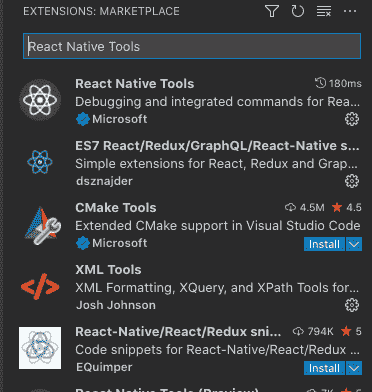
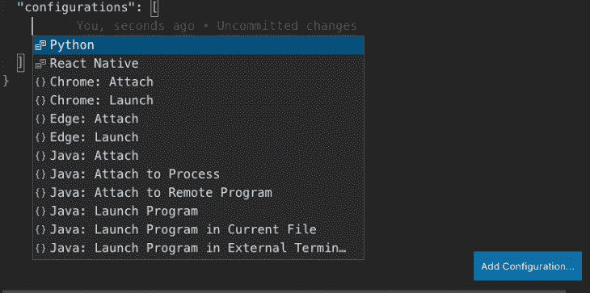
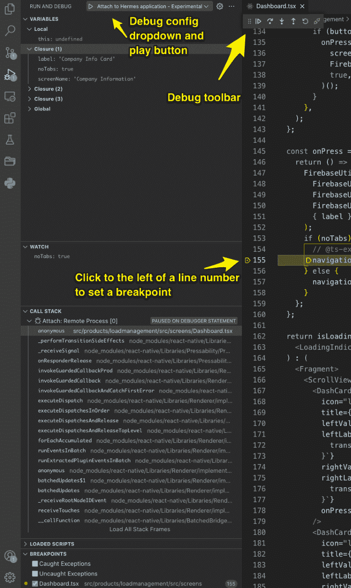

# 使用 VS 代码调试 React Native-log rocket 博客

> 原文：<https://blog.logrocket.com/debugging-react-native-vs-code/>

当我开发原生 Android 应用程序时，我从来不需要设置调试。它刚刚在 Android Studio 中工作。不过，当我转向 React Native 时，我大部分时间都使用`console.log`来调试我的应用程序。但是我错过了我可以在 Android Studio 中进行的调试类型。然而，我发现我可以使用 [VS 代码](https://code.visualstudio.com/)。

有几种方法可以调试 React 原生应用，包括使用谷歌 Chrome、 [Flipper、](https://blog.logrocket.com/debugging-react-native-apps-flipper/)或 [React 原生调试器](https://blog.logrocket.com/debugging-your-app-with-react-native-debugger/)，但拥有相同的 Android Studio 或 XCode 体验也很好，可以在同一个应用中编写代码和调试。

在本文中，我们将通过使用 VS 代码调试 React 本机应用程序来做到这一点。

## 设置 React 本机和 VS 代码

首先，确保你已经准备好了一些东西。安装 VS 代码，设置 React 本地开发环境，并有一个要调试的项目。

若要检查开发环境是否设置正确，可以在项目文件夹中运行以下命令:

```
npx react-native doctor

```

下一步是在 VS 代码中安装 React 原生工具扩展。打开 VS 代码和 React 原生项目，搜索“React 原生工具”的扩展。请确保在分机上看到 Microsoft 名称。



## 使用 VS 代码在 iOS 上调试

接下来，您需要为 VS 代码创建一个调试配置。在 VS 代码中点击**运行**视图，然后点击**创建一个** `launch.json` **文件**。


选择显示的任何选项，因为我们将粘贴文件的内容。您也可以在项目的`.vscode`文件夹中手动创建`launch.json`文件。


现在，将它粘贴到文件中:

```
{
  "version": "0.2.0",
  "configurations": []
}

```

点击打开文件时出现的**添加配置**按钮，然后点击**反应本地**。



这将打开另一个菜单，询问您想要创建哪种调试配置。选择**调试应用**。


接下来，它将询问您将为哪个平台创建调试配置。选择 **iOS** 。


接下来，将询问您希望如何调试应用程序。我们有两个选择:

*   直接模式下的应用
*   经典应用


iOS 中对直接调试的支持是实验性的。你可以选择任何一个，但如果你在你的应用程序中使用 [Hermes](https://github.com/facebook/hermes) ，你会想选择直接模式下的**应用程序。在下一个也是最后一个询问你是否使用爱马仕的问题中，选择**是**。您也可以添加两种配置，看看哪种效果最好。**

让我们转到 **Run** 视图，GUI 顶部的下拉菜单将显示新的调试配置。


点击**绿色三角形**应该会在 iOS 模拟器中启动你的应用，除非你用 [create-react-native-app](https://github.com/expo/create-react-native-app) 创建了你的应用，并且正在使用 Expo。如果是这样，您可能会得到几个错误代码，并且什么都不会运行。我们把它固定在下面。

最后，一旦应用运行，打开开发者菜单[启用远程调试](https://reactnative.dev/docs/debugging#accessing-the-in-app-developer-menu)。

## 在 Android 上调试 React Native

在 Android 中创建调试配置与在 iOS 中是一样的，除了您将从平台选项中选择 **Android** 。当您选择 React 本地应用程序的类型时，您可以选择直接模式下的**应用程序**和**经典** **应用程序**。

在安卓系统中，直接模式只能和爱马仕一起使用。如果你用的不是爱马仕，选择**经典应用**。同样，在应用程序运行后启用远程调试。

## 如果您使用 Expo，请调试 React Native

如果你使用 Expo，什么都不会起作用，`npx react-native doctor`也不会帮你找到问题。要解决这个问题，请在平台选项中选择**指数**，而不是 Android 或 iOS。

确保您已在全球范围内安装了`expo-cli`。如果没有，请在终端中运行以下命令进行安装:

```
npm install -g expo-cli

```

现在，选择您想要使用的 Expo 主机参数。如果你选择**隧道**，你将被要求创建一个世博会帐户用户名和密码，如果你还没有这样做。不想建账号的可以选择**兰**或者**隧道**。


一旦打包程序启动，VS code 将向您显示一个二维码，您可以使用手机上安装的 Expo 应用程序扫描该二维码，无论是用于 [Android](https://play.google.com/store/apps/details?id=host.exp.exponent) 还是 [iOS](https://apps.apple.com/us/app/expo-go/id982107779) ，都可以远程运行和调试手机上的应用程序。一旦应用程序运行，你还必须在手机上启用远程调试。

## 附加到正在运行的实例

尽管在 VS 代码中单击 play 按钮可以使应用程序的运行和调试变得简单易行，但还是要通过将调试器附加到正在运行的应用程序来以标准方式运行项目。这样，你就不需要经历上面所有的步骤来为你的应用程序定制调试配置——而且它在大多数时候都是有效的。

为此，请遵循上面为 iOS 创建调试配置的第一步。一旦出现第一个菜单，选择**附加到应用**。

随后，VS 代码会询问您想要附加的 React 本地应用程序的类型，而不是询问您正在使用哪个平台。如果你在任何一个移动平台上使用爱马仕或者想在 iOS 中使用直接模式，选择**直接模式的应用**，如果你不想，选择**经典应用**。


如果您选择**经典应用**，您将被要求输入主机的地址，该地址将由`localhost`自动填充。然后会要求您输入主机的端口，这个端口会用`8081`自动填充。如果您使用的是打包程序的默认值，自动填充的值将起作用，所以只需在每个菜单中点击**输入**。

现在，在 VS Code 的**运行和调试**下拉菜单中，你应该有**附加到 Hermes 应用程序-实验**或者**附加到打包程序**，这取决于你在最后一个菜单中选择的选项。

你可以用你使用的标准命令在 Android 或 iOS 中启动你的应用。一旦它开始运行，点击**播放按钮**来调试你的应用。

当您在使用调试配置启动仿真器或模拟器时遇到问题时，这也是有效的。单击一个 run 按钮很方便，但是当连接到一个正在运行的实例时，为了找出阻止应用程序启动的错误，这样做可能不值得。

## 使用 VS 代码 React 本机调试器

现在你已经有了所有你需要的调试配置，要么启动一个应用程序，要么附加到一个正在运行的应用程序实例。还要熟悉运行和调试视图。你可以看到我在下面设置的断点:



这里，我在 React Navigation 的调用中放置了一个断点，因为我想确保参数设置正确。

例如，仪表板上的一个卡片将用户带到了错误的导航栈，所以我点击了代码中导航发生的行号的左边，直到出现一个红点。这会设置一个断点。该断点将被列在左侧面板的**断点**部分。

我还想观察`noTabs`变量，它决定了将使用哪个导航栈。所以，我把这个变量添加到了**手表**部分。然后，我点击应用程序，直到代码被执行。现在我可以看到变量被设置为`true`。

VS 代码的调试视图中有很多功能。熟悉它将帮助你提高调试技能，尤其是如果你到目前为止只使用过`console.log`。

让我们回顾一下左侧面板中的内容。

### 调试配置下拉列表

这列出了在`launch.json file`中创建的所有调试和播放配置。选择一个并点击**播放**运行配置。

### 变量

此处列出了应用程序在断点处暂停时范围内的所有变量。它们由包含它们的闭包来划分，所以您必须挖掘以找出哪个闭包保存了您正在寻找的变量。

### 看

这一部分允许您设置想要监视的变量，这些变量可能在任何一个闭包中。如果您确切地知道您想要检查哪个变量，这是很方便的，这样您就不必查看所有的闭包。

### 调用栈

在本节中，您可以深入了解调用堆栈。通过单击堆栈中的一个函数，可以在编辑器中打开该函数。

### 加载的脚本

此部分列出了所有正在运行的脚本。

### 断点列表

断点部分列出了您在代码中设置的所有断点。您可以在这里使用复选框激活和停用它们。还有一个选项可以检查捕获和未捕获的表达式，以在每一种类型的异常时中断，这在您想要跟踪应用程序崩溃的原因时非常有用。

## 在 VS 代码中使用调试视图

调试视图有一个浮动的调试工具栏，它的左侧有一个拖动手柄，因此您可以将它放在编辑器面板中的任何位置。不过，我还没有找到一个最终不会碍事的地方。它上面还有五个按钮可以做这些事情:

*   **暂停/继续:**当您的应用程序暂停在一个断点上时，您可以点击此按钮运行到下一个断点
*   **单步执行:**这将导致应用程序执行您有断点的当前行，然后暂停
*   **单步执行:**这类似于单步执行，但是将单步执行一个方法并在那里暂停
*   **单步执行:**这将执行当前方法的剩余部分，并在方法返回时中断
*   **停止/断开:**如果您用调试器启动了应用程序，它将停止调试器。如果将调试器附加到正在运行的应用程序，它将与应用程序断开连接

我只使用暂停和停止按钮。如果您想知道您设置的断点周围发生了什么，其他三个按钮很有用。使用这些按钮单步执行代码可能需要一段时间，因为默认情况下，它将带您遍历节点模块文件夹以及在那里执行的所有代码。

为了防止这种情况，您可以将`skipFiles`添加到您的调试配置中。您可以添加希望调试器忽略的文件路径数组。下面是一个例子，我在我的`Attach to packager`调试配置中使用它来跳过节点模块文件夹:

```
{
  "name": "Attach to packager",
  "request": "attach",
  "type": "reactnative",
  "cwd": "${workspaceFolder}",
  "skipFiles": [
    "node_modules/**",
  ],
}

```

## 结论

如果使用 VS 代码进行 React 原生开发，只需要几分钟就可以配置并开始调试代码。如果你觉得`console.log`已经足够了，但是没有尝试过真正的调试器，你不知道你错过了什么！感谢阅读。

## [LogRocket](https://lp.logrocket.com/blg/react-native-signup) :即时重现 React 原生应用中的问题。

[](https://lp.logrocket.com/blg/react-native-signup)

[LogRocket](https://lp.logrocket.com/blg/react-native-signup) 是一款 React 原生监控解决方案，可帮助您即时重现问题、确定 bug 的优先级并了解 React 原生应用的性能。

LogRocket 还可以向你展示用户是如何与你的应用程序互动的，从而帮助你提高转化率和产品使用率。LogRocket 的产品分析功能揭示了用户不完成特定流程或不采用新功能的原因。

开始主动监控您的 React 原生应用— [免费试用 LogRocket】。](https://lp.logrocket.com/blg/react-native-signup)