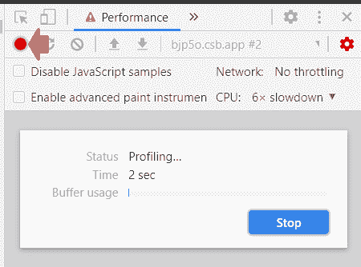
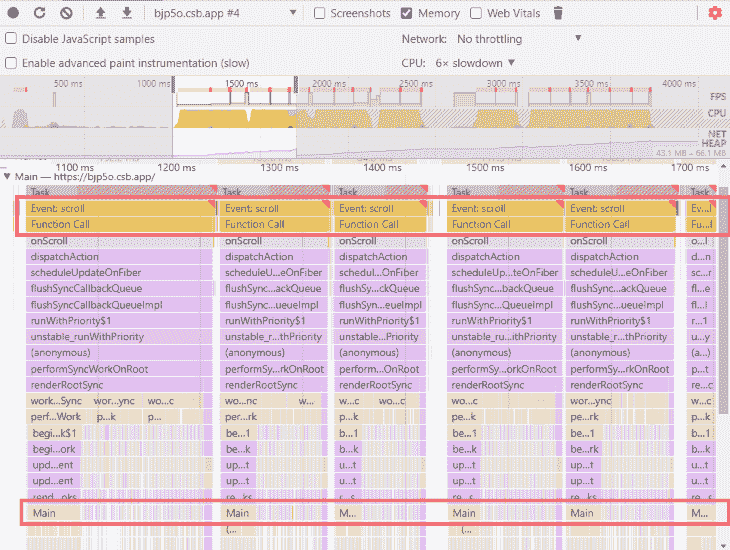
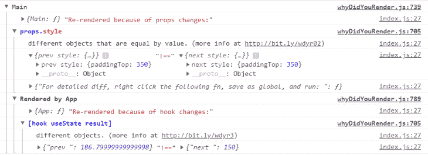

# 调试反应性能问题与你为什么渲染-日志火箭博客

> 原文：<https://blog.logrocket.com/debugging-react-performance-issues-with-why-did-you-render/>

反应快如闪电。通常，它的速度足够快，以至于很难在我们的机器上的沙箱中重现性能问题。因此，我们可能会相信，无论我们做什么，我们的 web 应用程序都会顺利运行。

但这是个陷阱。开发者通常使用强大的机器和互联网连接来构建 web 应用。然而，我们的高性能环境可能会对我们隐藏性能问题，从而伤害我们的用户。与开发人员不同，我们的许多用户使用中端移动智能手机从网络连接不好的地方访问我们的网络应用。

但是你的应用程序的速度和性能很重要，对转化率有很大的影响。

> 如果我们不分析性能，由于我们相对强大的机器和互联网连接，我们将不会知道伤害我们的用户并随后伤害我们的转化率的性能问题。

本文将展示一个沙箱，它的性能问题是由一个小的 React 反模式引起的。然后，我将向你展示如何使用库[来检测它，你为什么渲染](https://github.com/welldone-software/why-did-you-render)以及如何解决这个问题。

## 再现性能问题

下面的应用程序模拟了一个当用户滚动时改变大小的标题。多行列表用于表示大中型应用程序。

> 注意:在实践中，我们希望将这样一个长列表做成一个虚拟列表，但是在我们的例子中，我们只是用它来模拟一个应用程序。

我们的应用程序在滚动时标题高度变化的动画有性能问题。

这是沙盒:

> vzaidman 使用 create-react-app、react、react-dom 进行 React 时出现性能问题

为了在强大的机器上重现性能问题，我建议通过限制 CPU 人为地降低浏览器的速度。你可以在 Chrome 中使用 **Performance** 标签来完成。

在处理性能问题时，使用这个重要的工具以这种方式运行您的应用程序是一个很好的实践，可以了解在较慢的设备上是如何工作的:


您能发现是什么导致了代码中的性能问题吗？

## 用为什么渲染来检测 bug

发现问题的通常方法是使用 React 或浏览器开发工具。许多[的优秀文章](https://blog.logrocket.com/death-by-a-thousand-cuts-a-checklist-for-eliminating-common-react-performance-issues/)深入演示了如何调试。

简而言之，我们打开浏览器开发工具(在这种情况下，是 Chrome 的开发工具，但其他现代浏览器也有类似的功能)并记录几秒钟，同时再现问题:



然后我们停止侧写。我们可以立即看到，`Main`组件及其许多子组件在每个滚动事件中重新呈现，导致应用程序中的[抖动](https://developers.google.com/web/fundamentals/performance/rendering#60fps_and_device_refresh_rates)。



但在我们跳到代码并试图理解`Main`有什么问题之前，让我们试试[你为什么渲染](https://github.com/welldone-software/why-did-you-render)。

## 你为什么要渲染？

why You Render 是由 [Welldone Software](https://github.com/welldone-software) 创建的一个库，它通过 React 中的 [monkey-patches](https://en.wikipedia.org/wiki/Monkey_patch) 检测应用程序中某个组件被重新渲染的原因，并将通知您潜在可避免的重新渲染。

> 注意:确保不要在生产中添加库，因为它会降低反应速度，甚至在某些极端情况下会导致库崩溃。只有在调试性能问题时才打开它。

* * *

首先，我们添加来自`npm`的库:

```
npm install @welldone-software/why-did-you-render --save

```

接下来，我们向项目的根目录添加一个`wdyr.js`文件:

```
import React from "react";

// Make sure to only include the library in development
if (process.env.NODE_ENV === "development") {
  const whyDidYouRender = require("@welldone-software/why-did-you-render");
  whyDidYouRender(React, {
    trackAllPureComponents: true
  });
}

```

第三，我们在`index.js`中导入`wdyr.js`作为我们应用程序的第一个导入:

```
import "./wdyr"; // <-- first import

import React from "react";
import ReactDOM from "react-dom";
...

```

有关详细的安装指南，请查看[自述文件](https://github.com/welldone-software/why-did-you-render#setup)。

这里是一个安装了库的[沙箱](https://codesandbox.io/s/performance-issue-in-react-detected-with-why-did-you-render-offn3?fontsize=14&hidenavigation=1&theme=dark)。现在，如果您滚动浏览，您将在控制台中看到以下信息:



*   `Main`被*“因为道具变化重新渲染”*
*   问题中的道具是`style`
*   `style`已收到不同的值相等的对象:
    `{paddingTop: 350} !== {paddingTop: 350}`
*   `Main`被`App`重新渲染，`App`因为`useState`钩子的触发而重新渲染

如你所见，我们很清楚为什么`Main`被重新渲染。基于这些信息，我们可以推断这个问题是由处理[纯组件](https://reactjs.org/docs/react-api.html#reactmemo)时广泛存在的 React 反模式引起的。

我们来看看`App.js`:

```
export default function App() {
  const headerHeight = useHeaderScroll({
    min: 50,
    max: maxHeaderHeight,
    maxOffset: 3000
  });
  return (
    <div className="App">
      <Header style={{ height: headerHeight }} />
      <Main style={{ paddingTop: maxHeaderHeight }} />
    </div>
  );
}

```

当滚动发生时，钩子`useHeaderScroll`导致`App`重新渲染。这种重新渲染导致`Main`元素被重新创建:

```
<Main style={{ paddingTop: maxHeaderHeight }} />

```

现在，因为`Main`是一个纯组件，当`App`重新渲染时，它不应该重新渲染，因为看起来，它的道具与之前`App`的渲染是一样的。然而，在现实中，`style`道具是每次渲染的新对象:

```
{ paddingTop: maxHeaderHeight } !== { paddingTop: maxHeaderHeight }

```

## 调试 React 应用

性能问题的一个简单解决方案是只将相关值传递给`Main`而不是`style`对象。

让我们改变:

```
<Main style={{ paddingTop: maxHeaderHeight }} />

```

对此:

```
<Main paddingTop={paddingTop} />

```

`Main`将不再重新渲染，因为它唯一的道具始终是`paddingTop={350}`。

现在我们只需要确保`Main`被相应地调整，以期望`paddingTop`作为道具，而不是如果`style`:

```
const Main = ({ paddingTop } /* instead of {style} */) => {

```

您可以在下面的沙箱中找到没有性能问题的正确应用[。](https://codesandbox.io/s/performance-issue-in-react-solved-onucd)

## 结论

使用 Why You Render 可以非常有效地帮助识别 React 应用程序中的错误，即使在人们通常不会发现它们的地方。它还报告了非常详细的信息，因此您可以确切地知道哪里出错了。我的建议是至少用它来运行你的初始页面加载，看看你如何能在几分钟内加速它。感谢阅读。

## [LogRocket](https://lp.logrocket.com/blg/react-signup-general) :全面了解您的生产 React 应用

调试 React 应用程序可能很困难，尤其是当用户遇到难以重现的问题时。如果您对监视和跟踪 Redux 状态、自动显示 JavaScript 错误以及跟踪缓慢的网络请求和组件加载时间感兴趣，

[try LogRocket](https://lp.logrocket.com/blg/react-signup-general)

.

[ ](https://lp.logrocket.com/blg/react-signup-general) [](https://lp.logrocket.com/blg/react-signup-general) 

LogRocket 结合了会话回放、产品分析和错误跟踪，使软件团队能够创建理想的 web 和移动产品体验。这对你来说意味着什么？

LogRocket 不是猜测错误发生的原因，也不是要求用户提供截图和日志转储，而是让您回放问题，就像它们发生在您自己的浏览器中一样，以快速了解哪里出错了。

不再有嘈杂的警报。智能错误跟踪允许您对问题进行分类，然后从中学习。获得有影响的用户问题的通知，而不是误报。警报越少，有用的信号越多。

LogRocket Redux 中间件包为您的用户会话增加了一层额外的可见性。LogRocket 记录 Redux 存储中的所有操作和状态。

现代化您调试 React 应用的方式— [开始免费监控](https://lp.logrocket.com/blg/react-signup-general)。