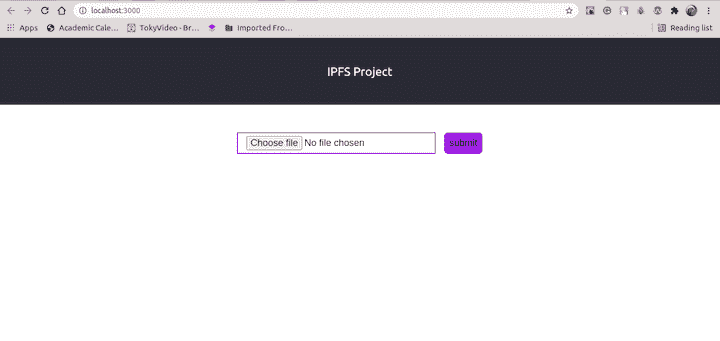
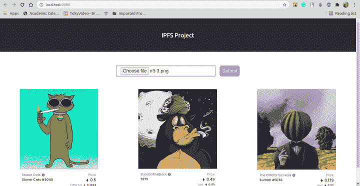

# 使用 IPFS 和 React 的分散式数据存储:示例教程

> 原文：<https://blog.logrocket.com/decentralized-data-storage-using-ipfs-and-react-a-tutorial-with-examples/>

数据不断地从一个网络转移到另一个网络。在某些时候，需要存储、检索、共享或删除数据。

在本教程中，我们将向您介绍星际文件系统(IPFS ),并演示如何通过分布式文件系统上传和存储数据。

为了用一个实际的例子来展示 IPFS，我们将[构建一个带有 React 前端的 DApp](https://blog.logrocket.com/ethereum-blockchain-development-using-web3-js/) ，并将其连接到 IPFS 来上传文件，并将从 IPFS 返回的 CID 存储到我们应用程序的状态中。

以下是我们将要介绍的内容:

## 什么是 IPFS？

[IPFS](https://ipfs.io/) **，**代表星际文件系统，是一种通过分布式文件系统机制使用对等网络来存储、检索和共享数据的通信协议。

IPFS 是一种分散的对等文件共享协议。IPFS 网络运行在 web 上，使用内容寻址存储(CAS)来存储数据，并根据内容而不是位置来检索数据。IPFS 使用这种方法来唯一地识别和获取有问题的数据。

使用 IPFS 存储归档数据可以实现重复数据删除、集群持久性和数据后代的高性能。

## IPFS 是如何工作的？

当您将数据上传到协议上的现有节点时，数据会被分割成更小的数据块，然后进行哈希处理，并被赋予一个唯一的内容标识符(CID ),作为指纹。这使得在网络上快速存储小块数据变得更快更容易。

一旦数据被上传到网络，网络中的其他节点更新它们的节点以包含数据的缓存副本。这样，它们也可以像初始节点一样提供数据。例如，作为节省内存的一种方式，由节点决定是保留还是提供这些数据，还是丢弃这些数据。

对于新数据的每次新上传或以前上传的数据，都会生成一个新的加密哈希(CID ),使每次上传到网络的数据都是唯一的，并且可以防止安全漏洞或篡改。

IPFS 使用一个分散的命名系统来查找文件名——也就是长 CID 字符串——然后使用 [DNSLink](https://docs.ipfs.io/concepts/dnslink/) 将 CID 映射到一个更容易理解的 DNS 名称。

IPFS 可供任何人使用，不仅仅是区块链的开发者。这包括 Web 2.0 开发人员、内容创建者、服务提供商、研究人员、档案管理员等等。无论何种用例，使用 IPFS 的主要好处是它提供了一个分散的平台来存储和处理数据。

## 如何建立前端 DApp 与 IPFS 和反应

现在我们已经了解了什么是 IPFS 以及分布式文件系统是如何工作的，让我们在 React 中构建一个连接到 IPFS 的示例前端，在这里我们将上传文件并将从 IPFS 返回的 CID 存储到我们应用程序的状态中。

首先，使用`npx create-react-app`命令创建一个新的 React 项目。对于本教程，我们将我们的项目命名为`IPFS project`。

```
npx create-react-app IPFS\ project

```

将目录更改为新创建的文件夹，并从代码库中删除任何多余的源文件。然后，用下面的 JSX 代码片段更新`/src/App.jsx`文件:

```
...
const App = () => {
  return (
    <div className="App">
      <form className="form" onSubmit={handleSubmit}>
        <input type="file" name="data" onChange={retrieveFile} />
        <button type="submit" className="btn">Upload file</button>
      </form>
    </div>
  )
}
...

```

上面的代码提供了一个`form`元素。在`form`元素中，我们定义了两个额外的元素:`input`和`button`。在`form`元素上，我们为`onSubmit`事件定义了一个函数`handleSubmit`。

我们还在`handleSubmit`函数中定义了样本代码，用于将我们从本地机器上传的文件上传到 IPFS。

最后，我们为`input`元素中的`onChange`事件定义了另一个函数`retrieveFile`。该功能将帮助我们在从本地机器上传文件时访问文件。



接下来，让我们定义上面的函数，从`retrieveFile`函数开始。在`App`组件中，定义一个`retrieveFile`函数，如下所示:

```
...
const App = () => {
  const retrieveFile = (e) => {
    const data = e.target.files[0];
    const reader = new window.FileReader();
    reader.readAsArrayBuffer(data);
    reader.onloadend = () => {
      console.log("Buffer data: ", Buffer(reader.result));
    }

    e.preventDefault();  
  }

  return (
    <div className="App">
     ...
    </div>
  )
}
...

```

文件上传后，我们将从`e.target.files`数组中检索数据，然后将其传递给`FileReader`对象。

使用`FileReader`对象，我们可以异步读取从本地机器上传的数据内容。使用`Buffer(reader.result)`，我们可以将结果转换成一组`Uint8Array`数据:


现在让我们使用 React 钩子 [`useState`](https://blog.logrocket.com/a-guide-to-usestate-in-react-ecb9952e406c/) 来更新`App`组件以在应用程序状态中存储这些数据。

```
...
import { useState } from "react";

const App = () => {
  const [file, setFile] = useState(null);
  const retrieveFile = (e) => {
    ...
    reader.onloadend = () => {
      setFile(Buffer(reader.result));
    }

    e.preventDefault();  
  }
  return (
    <div className="App">
     ...
    </div>
  )
}
...

```

现在让我们创建第二个函数，`handleSubmit`。这个函数将处理把我们从本地机器上传和处理的数据上传到 IPFS 的任务。

在创建函数之前，让我们先了解一下访问 IPFS 网络可用的 [IPFS 网关](https://docs.ipfs.io/concepts/ipfs-gateway/#overview)的类型。可供使用的网关有[因富拉](https://infura.io/docs/ipfs)、[皮纳塔](https://pinata.cloud/)和[弗利克](https://fleek.co/)。这些网关有些是免费的，有些则不是。此外，有些提供只读访问，而有些提供读写访问。

对于本教程，我们需要一个读写访问网关，因为我们将从 IPFS 上传和获取数据。出于演示的目的，我们将使用 Infura。

接下来，安装`ipfs-http-client`库，它使我们能够连接到 Infura。

```
yarn add ipfs-http-client

```

用以下代码片段更新`App`组件:

```
...
import { create } from "ipfs-http-client";

const client = create('https://ipfs.infura.io:5001/api/v0');

const App = () => {
  ...
  const [urlArr, setUrlArr] = useState([]);
  ...
  const handleSubmit = async (e) => {
    e.preventDefault();
    try {
      const created = await client.add(file);
      const url = `https://ipfs.infura.io/ipfs/${created.path}`;
      setUrlArr(prev => [...prev, url]);      
    } catch (error) {
      console.log(error.message);
    }
  };

  return (
    <div className="App">
     ...
    </div>
  )
}
...

```

在上面的代码中，我们使用由`ipfs-http-client`库提供的导入的`create`函数创建了一个`client`实例。然后，使用`client.add`功能，我们将数据上传到 IPFS。

此操作的响应返回一个包含上载数据的 CID 的对象。使用`[https://ipfs.infura.io/ipfs/](https://ipfs.infura.io/ipfs/)` URL 加上存储在`created`对象上的`path`键/对值，我们可以从 IPFS 检索上传的数据，并将其存储在`urlArr`状态。

更新 UI JSX 代码以显示返回的 URL，这些 URL 在我们从本地机器上传到 IPFS 后存储在`urlArr`状态中。

```
...
const App = () => {
  ...
  return (
    <div className="App">
      ...
      <div className="main">
        ...
      </div>

      <div className="display">
        {urlArr.length !== 0
          ? urlArr.map((el) => )
          : <h3>Upload data</h3>}
      </div>
   </div>
 )
}

```

接下来，从您的本地机器上传一些数据(在这个演示中我们将使用图片)到 IPFS，从而在从 IPFS 取回数据时将其添加到 UI 中:



## 结论

在本教程中，我们介绍了什么是 IPFS，它是如何工作的，以及如何使用可用的网关连接到 P2P 网络。我们构建了一个样例项目，它将一个文件从本地机器上传到 IPFS，然后在我们的应用程序中检索并存储返回的文件`path`。

您可以使用 IPFS 构建各种东西——下一步，您可能会考虑构建一个博客平台、一个购物车或一个存储代码库的远程库。IPFS 展示的可能性远远不止存储数据。

本教程中使用的代码可以在 [GitHub](https://github.com/IkehAkinyemi/IPFS-ethereum) 上获得。

## 使用 LogRocket 消除传统反应错误报告的噪音

[LogRocket](https://lp.logrocket.com/blg/react-signup-issue-free)

是一款 React analytics 解决方案，可保护您免受数百个误报错误警报的影响，只针对少数真正重要的项目。LogRocket 告诉您 React 应用程序中实际影响用户的最具影响力的 bug 和 UX 问题。

[ ](https://lp.logrocket.com/blg/react-signup-general) [  ](https://lp.logrocket.com/blg/react-signup-general) [LogRocket](https://lp.logrocket.com/blg/react-signup-issue-free)

自动聚合客户端错误、反应错误边界、还原状态、缓慢的组件加载时间、JS 异常、前端性能指标和用户交互。然后，LogRocket 使用机器学习来通知您影响大多数用户的最具影响力的问题，并提供您修复它所需的上下文。

关注重要的 React bug—[今天就试试 LogRocket】。](https://lp.logrocket.com/blg/react-signup-issue-free)