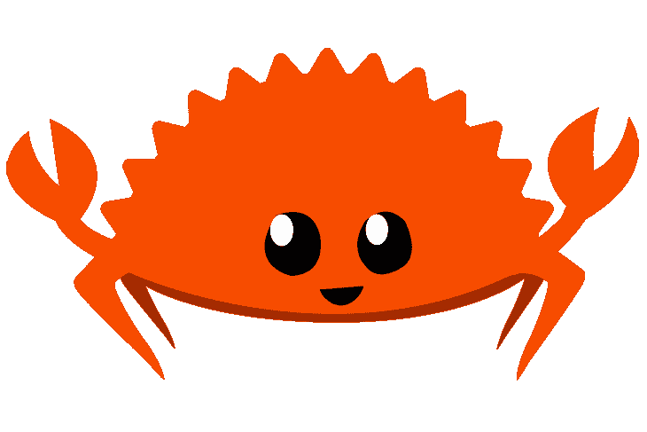
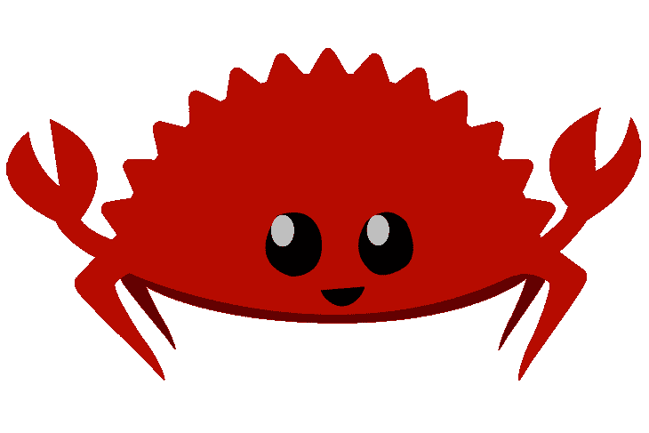

# 使用 image crate - LogRocket 博客对 Rust 中的图像进行解码和编码

> 原文：<https://blog.logrocket.com/decoding-encoding-images-rust-using-image-crate/>

Rust 的安全性和性能保证对于从事各种工作的开发人员来说都非常有用，这使得它成为许多场景的理想选择。然而，Rust 的软件包生态系统非常庞大，例子可能很简洁，这常常使得 Rust 没有得到充分利用。

Rust 在它的图像处理能力上特别有前途，但是许多人不使用这些功能，因为它们看起来令人生畏。这就是为什么在这篇文章中，我们将涵盖 Rust 的 [`image`箱](https://crates.io/crates/image)和它给我们解码，处理和编码图像的各种方法。

## 使用图像

在处理图像时，我们希望将它们作为二维数组来操作。理想情况下，我们会使用如下所示的代码 API 对图像进行迭代:

```
for pixel in img.pixels() {
    // modify RBGA pixel
}

```

不幸的是，大多数图像格式都是为了优化压缩和性能而不是易用性。PPM 图像格式本质上是一系列 ASCII RGB 值，但即使这样，它也有额外的数据，如包含高度和宽度的标题，我们需要考虑这些数据。

从那以后，随着 PNG 和 JPEG 等格式增加压缩和有损编码层，它变得越来越复杂。更糟糕的是，我们经常在同一个程序中处理各种类型的图像编码。

试图使用 Rust 内置的二进制文件功能对图像进行操作将很快变得令人头疼。这就是`image`机箱拯救我们的地方，它给了我们一个非常干净的 API。

## 使用`image`箱解码图像

`image`箱有`[DynamicImage](https://docs.rs/image/latest/image/enum.DynamicImage.html)`和`[ImageBuffer](https://docs.rs/image/latest/image/struct.ImageBuffer.html)`枚举，允许我们用 API 对图像进行操作，就像上一节的例子一样。

`ImageBuffer`代表一种特定类型的图像，它本质上已经被转换为 2D 阵列，而`DynamicImage`允许我们在不同类型的图像之间移动，并且仍然提供一些通用的图像处理能力。

为了创建其中任何一个，crate 为我们提供了一些打开图像和解码图像的工具。让我们用我们的吉祥物蟹费里斯来测试一下。



Ferris the Crab, the Rust programming language’s official mascot.

### `image::open(path)`

如果我们只是想要快速简单的东西，我们可以使用`[image::open(path)](https://docs.rs/image/latest/image/fn.open.html)`。这是 crate 中的顶级方法，它接受满足`[AsRef<Path>](https://doc.rust-lang.org/stable/std/path/struct.Path.html#impl-AsRef%3CPath%3E)`的参数，并返回包含`DynamicImage`的`Result`。由于`String`和`str`实现了`AsRef<Path>`，我们可以这样使用它:

```
use image;
use image::GenericImageView; // to allow calling .pixels()
// ...
let img = image::open("ferris.png").expect("File not found!");
for pixel in img.pixels() {
    // modify RGBA pixel
}

```

该函数将根据我们给它的文件扩展名进行编码，这对于大多数目的来说已经足够了。

### `image::io::Reader`

板条箱还允许我们对如何加载图像进行更细粒度的控制。例如，如果我们通过网络连接或从 GPU 加载图像，并将其作为缓冲区接收，而不是处理磁盘上的文件，会怎么样？或者，如果我们不信任用户给我们的文件扩展名怎么办？

像这样更详细的案例，我们可以用`[image::io::Reader](https://docs.rs/image/latest/image/io/struct.Reader.html)`。这种方法使我们能够控制装载过程。

例如，给定内存中的 PPM 图像，我们可以这样加载它:

```
use image::io::Reader;
use std::io::Cursor;

let data = Cursor::new(b"\
P3 3 2 255
255   0   0     0 255   0     0   0 255
255 255   0   255 255 255     0   0   0");
let reader = Reader::new(data)
    .with_guessed_format()
    .expect("This will never fail using Cursor");

let img = reader.decode().expect("Failed to read image");

```

让我们一步一步地看这个例子。在最开始，我们创建一个`Cursor`对象来表示直接来自字符串的二进制数据流。在我们的例子中，这只是一个简单的测试图像，但实际上，这可能来自网络套接字、GPU 或其他形式的通信。

一旦我们构造了一个 reader 对象，我们需要弄清楚我们的流的图像格式。

#### `with_guessed_format`

`with_guessed_format`方法试图从流中读取并使用头部来确定其数据类型，在我们的例子中，这是 PPM 格式的 P3。因为我们的`Cursor`总是可读的，所以这个方法永远不会失败，我们可以安全地调用`expect`。如果我们给它一些实现`Read`的其他类型，但失败了，它将返回一个错误类型。

#### `decode`

到目前为止，我们已经为读者提供了关于我们想要阅读的图像的信息，比如它是什么类型的图像。为了从阅读器中获取图像，我们需要调用`decode`，它返回一个包含前面的`DynamicImage`的`Result`。解码可能以两种方式中断:

##### 用不支持的图像格式解码

如果调用`with_guessed_format`时未能确定图像格式，我们将触发一个错误。读取器对象的格式将成为错误类型。

我们可以通过将`decode`的返回与`ImageError::Unsupported`进行模式匹配，或者在调用`decode`之前检查`reader.format()`是否返回了一个`Some`值，来[具体检查这一点。](https://blog.logrocket.com/rust-enums-and-pattern-matching/)

##### 解码坏图像

如果图像不符合我们指定的格式，我们也可以触发一个错误。例如，PPM 文件格式将每个像素表示为代表 RGB 的三个 ASCII 值的块。如果出于某种原因，我们每个像素只有两个值，`decode`将返回一个`ImageError::DecodingError`。

#### `Reader::open`

如果我们想利用`Reader`更高级的格式，但仍然像以前一样打开文件，我们可以调用`Reader::open`。这个方法假设图像格式来自文件扩展名，但是我们可以调用`with_guessed_format()`并让它读取文件头来推断实际的图像格式。

## 使用`image`板条箱编码图像

现在我们将讨论编码图像。板条箱使这变得简单，但是有一些注意事项。我们将复习对图像的操作和保存。

### 对图像进行操作

修改我们加载的图像就像读取和写入图像一样简单，但有一些注意事项。

对于许多常见的操作，如模糊或过滤，板条箱为我们提供了一套内置的操作。[完整的列表可以在这里找到，](https://docs.rs/image/latest/image/imageops/index.html)但是如果我们想自己修改图像呢？

我们需要注意我们是如何操作记忆中的图像的。尽管在迭代时可以修改图像，但我们经常会遇到借用检查器的问题。

如果我们尝试在迭代图像的同时写入图像，我们可能会修改稍后要迭代的内容，从而引发一大堆问题。相反，通常更简单的方法是制作我们写入的图像的副本。

举个例子，假设我们想要迭代我们友好的`ferris.png`图像，并使每个像素更接近黑色。`image` crate 提供了一个实用程序来完成这项工作，但是让我们自己编写一个简单的版本:

```
use image::{GenericImageView, ImageBuffer, Pixel};

fn main() {
    let img = image::open("ferris.png").expect("File not found!");
    let (w, h) = img.dimensions();
    let mut output = ImageBuffer::new(w, h); // create a new buffer for our output

    for (x, y, pixel) in img.pixels() {
        output.put_pixel(x, y, 
            // pixel.map will iterate over the r, g, b, a values of the pixel
            pixel.map(|p| p.saturating_sub(65))
        );
    }
    // What do we do with output now? 
}

```

现在，摩天轮看起来会像这样:



Ferris after we’ve made all of his pixels darker.

只需几行代码，我们就可以读入一个 PNG，遍历它的内部像素，并创建它的新版本。这个基本结构应该是我们在 Rust 中编写任何图像处理算法所需要的一切。

现在我们已经创建了一个新的图像，我们如何将它从内存中取出并发送到某个地方呢？这就是写图像的切入点。

### 书写图像

一旦我们加载并修改了一幅图像或者从头开始创建了一幅全新的图像，我们就可以使用`image`箱来编码并保存它。

保存到文件非常容易。`DynamicImage`和`ImageBuffer`都有一个`save(path)`方法。他们会推断出我们希望使用文件扩展名对图像进行编码的格式。

在完成所有我们想要的修改后，我们可以做一些类似于`img.save("output.png")`的事情，板条箱会为我们处理所有的困难工作。

对于大多数用例，保存到文件就足够了。但是，有时我们希望通过网络连接发送编码图像，或者将图像发送到某个硬件组件。在这种情况下，我们更愿意编写我们的编码图像。

对于这个用例，`write_to`是我们的朋友。`write_to`对`DynamicImage`和任何类型的`ImageBuffer`都可用。它将采用一个实现`Write + Seek`的 writer 对象，以及一个`[ImageOutputFormat](https://docs.rs/image/latest/image/enum.ImageOutputFormat.html)`对象，后者是机箱的一部分。

## 结论

板条箱是一个非常强大的工具，它给了我们很多对我们的图像以及如何操作它们的细粒度控制。它还提供了大量的实用程序和功能，使图像处理变得简单。

如果你发现`image`板条箱处理你的图像很慢，确保你使用`cargo run --release`在发布模式下运行你的代码。

我们使用的很多方法都会在你的图像上运行多个循环，Rust 在没有 release 标志的情况下运行时会保留很多额外的不必要的调试信息。如果您正在创建一个工具，并希望用可用的调试信息来测试它，我建议您使用较小的图像。

我们已经介绍了很多关于使用`image`板条箱解码和编码的信息！现在你应该已经了解了如何继续使用 Rust 中的图片。

## [log rocket](https://lp.logrocket.com/blg/rust-signup):Rust 应用的 web 前端的全面可见性

调试 Rust 应用程序可能很困难，尤其是当用户遇到难以重现的问题时。如果您对监控和跟踪 Rust 应用程序的性能、自动显示错误、跟踪缓慢的网络请求和加载时间感兴趣，

[try LogRocket](https://lp.logrocket.com/blg/rust-signup)

.

[](https://lp.logrocket.com/blg/rust-signup)

LogRocket 就像是网络和移动应用程序的 DVR，记录你的 Rust 应用程序上发生的一切。您可以汇总并报告问题发生时应用程序的状态，而不是猜测问题发生的原因。LogRocket 还可以监控应用的性能，报告客户端 CPU 负载、客户端内存使用等指标。

现代化调试 Rust 应用的方式— [开始免费监控](https://lp.logrocket.com/blg/rust-signup)。