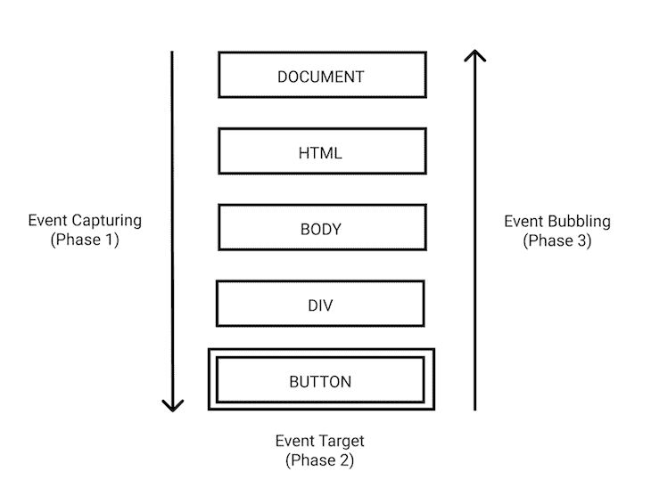

# 深入探究 JavaScript 事件冒泡和捕获

> 原文：<https://blog.logrocket.com/deep-dive-into-event-bubbling-and-capturing/>

如果一个元素和它的父元素有同一个事件的事件处理程序，那么哪个元素会在被触发时首先被触发？

使用冒泡和捕获在 [JavaScript](https://blog.logrocket.com/top-javascript-data-visualization-libraries-2021/) 中传播事件为开发者提供了这个问题的答案。在本文中，我们将了解事件冒泡和捕获是如何工作的，比较访问事件属性的不同方法，并浏览一些不同的示例和用例。

我们开始吧！



Event bubbling and capturing sequence.

## 什么是事件捕获？

在事件捕获(也称为涓滴)中，外部事件处理程序在特定处理程序触发之前触发。例如，div 上的事件在按钮上的事件之前触发:

```
Event capturing hierarchy = document → html → body → parent → child

```

捕获的优先级高于冒泡，这意味着捕获事件处理程序在冒泡事件处理程序之前执行，如事件传播的各个阶段所示:

1.  捕获阶段:事件向下移动到元素
2.  目标阶段:事件到达目标元素
3.  冒泡阶段:事件从元素中冒泡出来

## 什么是事件冒泡？

事件冒泡遵循与事件捕获相反的顺序。事件从子 HTML 元素传播，然后在 DOM 层次结构中向上移动到其父元素:

```
Event bubbling hierarchy = child → parent → body → html → document

```

## 监听传播事件

我们可以使用附加到 HTML 节点的`addEventListener()`方法来监听这些传播事件。它接受三个参数:一个事件名称、一个回调函数和一个可选的捕获值，该值默认设置为`false`:

```
element.addEventListener(event, handler, false)

```

### 捕获值为空

让我们回顾一下，当捕获值为空时，如果用户单击按钮会发生什么情况:

```
element.addEventListener(event, handler)

```

点击事件开始于捕获阶段。它在目标的父元素中搜索任何带有事件处理程序的事件。它不会为捕获阶段找到任何事件处理程序。

接下来，它会滴到目标上。一旦执行了捕获阶段的所有事件，事件就进入冒泡阶段。它执行在目标元素上设置的任何事件处理程序。它再次向上传播，在目标的父元素中搜索冒泡阶段的任何事件处理程序。现在，事件循环完成了。

### 捕获值为`true`

让我们考虑一下如果捕捉值设置为`true`会发生什么:

```
element.addEventListener(event, handler, true)

```

上面的代码片段将遵循与值为空时相同的顺序。关键的区别在于，事件处理程序将在传递到目标之前执行它找到的任何事件处理程序。

## 访问事件对象属性

处理程序访问事件对象属性的方法有所不同:

*   `event.target`:触发事件的 DOM 元素
*   `event.eventPhase`:返回事件传播的当前阶段(捕获:`1`，目标:`2`，冒泡:`3`)
*   `event.currentTarget`:指处理事件的 DOM 元素

注意，如果一个事件监听器被附加到父元素，但是事件传播被子元素停止，`event.currentTarget`指的是停止传播的 DOM 元素。

## 事件冒泡结构

现在我们已经了解了事件冒泡和捕获是如何工作的，让我们来看一个例子！假设我们分别有下面的 DOM 结构和下面的事件监听器:

```
<button class="cta_button">Click me</button>
```

```
document 
.querySelector('.cta_button') 
.addEventListener('click', function(event) { 
  console.info(`Click event fired on ${this.nodeName}`);
 });

```

`Click event fired on BUTTON`将被记录到控制台。

### 嵌套 DOM 结构

让我们看看当 DOM 结构是嵌套的并且使用附加到父元素的同一个事件侦听器时会发生什么:

```
<div class="cta_container">
    <button class="cta_button">Watch me bubble</button>
</div>

```

```
document
.querySelector('.cta_container')
.addEventListener('click', function(event) {
  console.info(`Click event fired on ${this.nodeName}`);
});

```

在上面的代码片段中，我们在按钮的父元素`div`上设置了一个点击事件监听器。单击时，它记录触发的事件类型和触发事件的元素。

当用户点击`Watch me bubble`按钮时，事件被定向到该按钮。如果为按钮设置了事件处理程序，则会触发事件。否则，事件会冒泡或传播到父级`div`，并在父级上触发一个 click 事件。如果没有处理该事件，则该过程继续到外部边界的下一个父级，直到它最终到达文档对象。

即使您点击了按钮，记录到控制台的信息也是`Click event fired on DIV`。

### 将事件侦听器附加到按钮

当我们在按钮上附加一个事件监听器时会发生什么？

```
<div class="cta_container">
    <button class="cta_button">Watch me bubble</button>
</div>

```

```
document
.querySelector('.cta_container')
.addEventListener('click', function(event) {
    console.info(Click event fired on ${this.nodeName}`);
});

```

输出变为`Click event fired on BUTTON`和`Click event fired on DIV`。

正如您所看到的，事件冒泡到了父节点。您可以使用`event.bubbles`属性来确定事件是否冒泡:

```
document
.querySelector('.cta_button')
.addEventListener('click', function(event) {
    console.info(
  Click event fired on ${this.nodeName}. Does it bubble? ${event.bubbles}`
);
});

```

## 停止传播

DOM 元素上的事件会传播到它的所有父元素，除非它被停止。虽然通常不需要防止冒泡，但在某些情况下它是有用的。例如，停止传播可以防止事件处理程序相互干扰。

考虑使用`mousemove`和`mouseup`事件处理拖放。停止传播可以防止由于用户随机移动鼠标而引起的浏览器错误。

在子元素上调用`event.stopPropagation()`可以防止它冒泡到父元素:

```
document.querySelector('.cta_button').addEventListener('click', event => {
   event.stopPropagation();
   // ...
});

```

让我们停止上一节中我们单击按钮的示例的传播:

```
<div class="cta_container">
  <button class="cta_button">Watch the bubble stop</button>
</div>

```

让我们添加事件侦听器:

```
document
.querySelector('.cta_container')
.addEventListener('click', function(event) {
   console.info(`Click event fired on ${this.nodeName}`);
});

document
.querySelector('.cta_button')
.addEventListener('click', function(event) {
    event.stopPropagation();
  console.info(`Click event fired on ${this.nodeName}`);
});

```

使用`event.stopPropagation()`阻止了事件冒泡。输出变为`Click event fired on BUTTON`。

### 防止浏览器默认

假设您希望允许传播继续，但是如果没有侦听器处理事件，您希望阻止浏览器执行其默认操作。可以用`event.preventDefault()`:

```
document.querySelector('.cta_button')
.addEventListener('click', event => {
    event.preventDefault();
  // ...
});

```

## 事件冒泡用例

让我们应用我们已经介绍过的内容，创建一个购物清单应用程序，一旦你购买了一件商品，它就会显示出来。在这种情况下，添加单个事件侦听器是不可行的，因为您可能会在将来决定添加一个新项。

相反，您需要将事件侦听器附加到列表的父元素。事件侦听器将通过事件冒泡处理来自子节点的单击事件。

* * *

### 更多来自 LogRocket 的精彩文章:

* * *

在下面的代码片段中，我们列出了我们的购物项目:

```
<ul class="list">
<li class="item">MacBook Pro</li>
<li class="item">Sony a6400 camera</li>
<li class="item">Boya universal cardioid microphone</li>
<li class="item">Light ring</li>
</ul>

```

添加一个附加到`<ul>`的事件监听器，如下所示:

```
document.querySelector('.list').addEventListener('click', event => {
  event.target.classList.toggle('purchased');
});

```

您可以在下面的[代码栏](https://codepen.io/chiamakaikeanyi/pen/mdWPoGK)中查看该代码:

参见 [CodePen](https://codepen.io) 上 Chiamaka ike Anyi([@ chiamakaikeayi](https://codepen.io/chiamakaikeanyi))
的笔 [事件冒泡](https://codepen.io/chiamakaikeanyi/pen/mdWPoGK)。

事件捕获结构

## 在不支持事件冒泡的事件委托期间，事件捕获对于将事件附加到动态内容变得特别有益。例如，您可能需要处理像`focus`和`blur`这样不支持冒泡的事件。

要在捕获阶段捕获一个事件，您需要将`useCapture`选项设置为`true`。记住，默认情况下，它被设置为`false`:

让我们考虑一个嵌套的 DOM 结构:

```
element.addEventListener(event, handler, true)

```

我们将把父元素的`useCapture`选项设置为`true`:

```
<div class="cta_container">
    <button class="cta_button">Watch me capture</button>
</div>

```

与我们使用冒泡得到的结果相反，输出是`Click event fired on DIV`和`Click event fired on BUTTON`。

```
document.querySelector('.cta_container').addEventListener(
'click', function(event) {
   console.info(Click event fired on ${this.nodeName}`);
},
true
);

document
.querySelector('.cta_button')
.addEventListener('click', function(event) {
   console.info(`Click event fired on ${this.nodeName}`);
});

```

事件捕获用例

## 让我们继续前面构建购物清单的例子。如果您想在购物列表中添加一个输入字段，使您能够为每个项目设置预算，则附加到父级的事件侦听器不会应用于这些输入字段。

让我们看看购物清单和事件监听器的代码:

当您将光标放在任何输入字段上时，什么都不会发生。然而，当您将`useCapture`选项设置为`true`时，您将获得想要的结果:

```
<h1 class="title">Shopping List</h1>
<ul class="list">
          <li class="item">
              MacBook Pro 
              <input class="budget" type="number" min=1>
          </li>
          <li class="item">
              Logitech MX Keys 
              <input class="budget" type="number" min=1>
          </li>
          <li class="item">
              Sony a6400 camera 
              <input class="budget" type="number" min=1>
          </li>
          <li class="item">
              Boya universal cardioid microphone 
             <input class="budget" type="number" min=1>
          </li>
          <li class="item">
              Light ring
              <input class="budget" type="number" min=1>
          </li>   
</ul>

```

```
document.querySelector(".list").addEventListener("focus", function (event) {
      console.info(${event.type} event fired on ${this.nodeName}`);
        event.target.style.background = "#eee";

       console.log("target:", event.target);
        console.log("currentTarget:", event.currentTarget);
        console.log("eventPhase:", event.eventPhase);
});

```

请看 [CodePen](https://codepen.io) 上千寻池上一([@千寻池上一](https://codepen.io/chiamakaikeanyi) )
捕捉的 Pen [事件。](https://codepen.io/chiamakaikeanyi/pen/yLbbVGp)

```
document.querySelector(".list").addEventListener("focus", function (event) {
      console.info(`${event.type} event fired on ${this.nodeName}`);
        event.target.style.background = "#eee";

        console.log("target:", event.target);
        console.log("currentTarget:", event.currentTarget);
        console.log("eventPhase:", event.eventPhase);
}, true);

```

See the Pen [Event Capturing](https://codepen.io/chiamakaikeanyi/pen/yLbbVGp) by Chiamaka Ikeanyi ([@chiamakaikeanyi](https://codepen.io/chiamakaikeanyi))
on [CodePen](https://codepen.io).

你可以在上面的[代码栏](https://codepen.io/chiamakaikeanyi/pen/yLbbVGp?editors=1011)中查看这个列表。

结论

## 对事件冒泡和捕获的深刻理解对于在 JavaScript 中处理用户事件至关重要。在本教程中，我们按照捕获、目标阶段和冒泡的顺序学习了 JavaScript 中事件传播的工作原理。

请注意，冒泡总是从子元素传播到父元素，而捕获则从父元素传播到子元素。为了记住传播顺序，你可以把它想象成“自上而下”

我希望你喜欢这个教程！

通过理解上下文，更容易地调试 JavaScript 错误

## 调试代码总是一项单调乏味的任务。但是你越了解自己的错误，就越容易改正。

LogRocket 让你以新的独特的方式理解这些错误。我们的前端监控解决方案跟踪用户与您的 JavaScript 前端的互动，让您能够准确找出导致错误的用户行为。

LogRocket 记录控制台日志、页面加载时间、堆栈跟踪、慢速网络请求/响应(带有标题+正文)、浏览器元数据和自定义日志。理解您的 JavaScript 代码的影响从来没有这么简单过！

[](https://lp.logrocket.com/blg/javascript-signup)

.

[Try it for free](https://lp.logrocket.com/blg/javascript-signup)

.