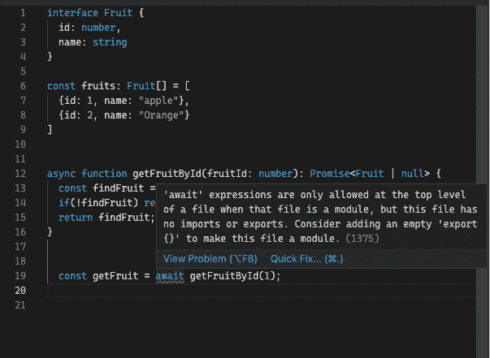
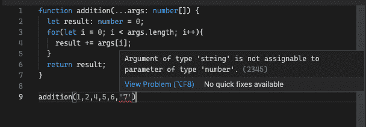

# TypeScript 中关于类型函数的权威指南

> 原文：<https://blog.logrocket.com/definitive-guide-typing-functions-typescript/>

JavaScript 是世界上最流行的编程语言之一，也是网络语言。然而，因为它不是强类型的，所以有可能在不经意间将错误引入我们的代码。这就是[打字稿](https://blog.logrocket.com/tag/typescript/)的用武之地。

TypeScript 是 JavaScript 的强类型子集，它为我们的应用程序创建类型保护提供了必要的工具。函数是 JavaScript 和 TypeScript 中的主要范例之一，也是任何应用程序的构建块。因此，对于 TypeScript 开发人员来说，了解如何在日常工作中构建和使用强类型函数是非常重要的。

本文是关于如何创建和使用强类型函数的指南。我们将使用大量的例子来概述 TypeScript 开发人员可以构建的许多功能。

### 内容

### 先决条件

为了能够遵循本教程，您需要:

*   JavaScript 和 TypeScript 的工作知识
*   一个您可以运行 TypeScript 示例的环境，要么通过在您的本地机器上安装 TypeScript，要么通过[官方 TypeScript 游乐场](https://www.typescriptlang.org/play)

## 为什么类型化函数很重要

当我们构建应用程序时，我们的目标总是使它们稳定、可靠、可用、可维护和可伸缩。拥有和使用类型化函数有助于我们更接近最终目标。

类型化函数帮助我们捕捉没有类型保护时可能会遗漏的错误。TypeScript，以及扩展的类型化函数，已经帮助许多公司减少了产品附带的错误，帮助他们减少了开发或支持时间。

## 创建函数和类型保护

在这一节中，我们将创建函数，然后向它们添加类型保护。

下面是一个叫做`subtraction`的简单函数:

```
function subtraction(foo, bar){
  return foo -  bar;
}

```

这个`subtraction`函数接受两个参数:`foo`和`bar`，然后返回它们之间的差值。

当我们将这段代码粘贴到我们的 TypeScript playground 中时，我们得到一个关于我们的参数具有隐式类型`any`的错误。


我们需要向我们的参数添加类型，如下所示:

```
function subtraction(foo: number, bar: number){
  return foo -  bar;
}

```

我们已经为上面的参数添加了一个`number`类型。这确保了我们的参数是数值。如果我们试图给这个函数赋一个不是数字的参数(就像我下面所做的)，我们会得到一个错误:`Argument of type 'string' is not assignable to parameter of type 'number'`:

```
subtraction(10, 'string')

```

TypeScript 从参数的类型中隐式识别返回值的类型，但是我们也可以向返回值添加类型。如下例所示:

```
function subtraction(foo: number, bar: number): number{
  return foo -  bar;
}

```

我们也可以使用类型接口来声明函数。这里，我们声明一个属性接口来传递给函数:

```
interface Attribute {
  age: number,
  sentence: string
}

function personality(attribute: Attribute): string{
  return `${attribute.sentence} ${attribute.age}`;
}

const attribute: Attribute = {
  age: 18,
  sentence: "My age is"
}

const getPersonality = personality(attribute);

```

如果我们将这段代码粘贴到我们的 TypeScript playground 中，我们将看到它通过了我们的类型检查，并且没有显示任何错误。

## 键入的箭头函数

现在让我们转向类型化的箭头函数，以及如何创建它们。向箭头函数添加类型的语法与普通函数非常相似。

我将把最后一个函数重构为一个箭头函数，并对其应用类型保护:

```
interface Attribute {
  age: number,
  sentence: string
}

const personality = (attribute: Attribute): string => {
  return `${attribute.sentence} ${attribute.age}`;
}

const attribute: Attribute = {
  age: 18,
  sentence: "My age is"
}

const getPersonality = personality(attribute);

```

适用于普通函数的规则也适用于箭头函数。

## 异步类型函数

既然我们已经学习了如何创建普通函数和箭头函数，我们将看看如何创建异步类型函数。键入异步函数和普通函数是有区别的:异步函数的返回类型必须是`Promise<T>`泛型。

这个泛型表示异步函数返回的`promise`对象，其中`<T>`表示承诺解析的值的类型。下面是一个类型化异步函数的示例:

```
interface Fruit {
  id: number,
  name: string
}

const fruits: Fruit[] = [
  {id: 1, name: "apple"},
  {id: 2, name: "Orange"}
]

async function getFruitById(fruitId: number): Promise<Fruit | null> {
  const findFruit = fruits.find(fruit => fruit.id === fruitId);
  if(!findFruit) return null;
  return findFruit;
}

async function runAsyncFunction() {
  const getFruit = await getFruitById(1);
}

```

在上面的例子中，我们创建了一个`fruit`接口来处理参数的类型。我们还创建了`getFruitById`函数，并将`return`类型设置为`Promise`泛型，将`Fruit`或`null`设置为返回值的类型。最后，我们必须将`getFruitById`调用包装到`runAsyncFunction`中，因为我们不能在文件的顶层使用 await，否则我们将从 TypeScript 编译器得到下面的错误。



将它包装在另一个异步函数中可以修复这个错误。

## 可选参数

从上面的例子中，我们已经看到了如何将类型化参数传递到类型化函数中，但是这些例子只涵盖了我们确定每个参数的数量和确切类型的情况。有些时候我们不确定，我们也需要迎合这种情况:

```
interface Fruit {
  id: number,
  name: string | null ,
  type?: string
}

```

上面是一个使用接口声明可选参数的例子。`name`参数可以取一个类型为`string`或`null`的值。

我们使用`?`使`type`参数可选，这意味着我们不需要将参数传递给我们的函数，当我们传递它时，值必须是字符串类型。

我们也可以直接在函数中声明参数和类型，如下所示:

```
function returnUser(firstName: string, lastName?: stringl) {
  return `My name is ${firstName} ${lastName}`;
}

```

在上面的例子中，`firstName`参数是必需的，而`lastName`参数不是，但是如果被传递，它必须是类型`string`。

我们还可以为 rest 参数定义类型。Rest 参数是 JavaScript 中的一个特性，它将许多参数作为单个数组传递给函数。以下示例显示了如何做到这一点:

```
function addition(...args: number[]) {
  let result: number = 0;
  for(let i = 0; i < args.length; i++){
    result += args[i];
  }
  return result;
}

```

`args`参数是一个`number`类型的数组；这有助于我们对我们的`args`参数进行类型检查，并防止我们传递任何不是`Number`类型的参数，如下图所示。



如果传递的参数类型不是数字，TypeScript 编译器将引发错误。

## 功能覆盖

在调用某些 JavaScript 函数时，参数的数量和类型可能会有所不同。例如，编写一个函数，从 ID(一个参数)或电话号码(一个参数)或地址和姓名的组合(两个参数)返回用户。

TypeScript 中的重载签名允许以多种方式调用一个函数。这可以通过编写几个函数签名(通常是两个或更多)来实现，然后是函数体，如下所示:

```
interface User {
  id: number;
  phoneNumber: string;
  fullName: string;
  address: string;
};

const users: User[] = [
  { id: 1, phoneNumber: "08100000000", fullName: "First User" , address: "Santa fe, florida" },
  { id: 2, phoneNumber: "08111111111", fullName: "Second User", address: "San Fransisco, California" }
];

function getUser(id: number): User | undefined;
function getUser(phoneNumber: string): User | undefined;
function getUser(address: string, fullName: string): User | undefined;

function getUser(idOrPhoneNumber: number | string, address?: string): User | undefined {
  if (typeof idOrPhoneNumber === "string") {
    return users.find(user => user.phoneNumber === idOrPhoneNumber);
  }

  if (typeof address === "string") {
    return users.find(user => user.address === address);
  } else {
    return users.find(user => user.id === idOrPhoneNumber);
  }
}

const userById = getUser(1);
const userByPhoneNumber = getUser("08100000000");
const userByAddress = getUser("San Fransisco, California", "Jon Doe");

```

在上面的代码中，我们声明了将在 UI 中传递给函数的输入参数和类型。此外，两个重载接受一个参数，而一个重载接受两个参数；这些被称为过载签名。

然后，我们开发了一个带有兼容签名的函数实现。每个函数都有一个实现签名，但是这个签名不能被直接调用。

## 静态类型构造函数

我们可以添加不同类型、默认值和重载的参数，从这个意义上说，类构造函数与函数非常相似。我们也可以使用带有默认值或重载的普通签名来键入我们的构造函数。

带有重载的正常签名:

```
    class Example {
      a: number;
      b: number;

      constructor(a = 1, b  = 4) {
        this.a = a;
        this.b = b
      }
    }

```

领主:

```
class Example {
        constructor(a:number, b:string);
     constructor(xs: any, y?: any) {
        }
}

```

类型化函数和类型化构造函数之间有一些区别:

1.  类型化的构造函数不能有类型化的注释，因为类实例总是返回的
2.  类型化构造函数不能有类型化参数，因为它们属于外部类

## 结论

在本文中，我们已经讨论了各种类型的类型化函数，包括如何创建和使用它们。类型化函数帮助我们创建安全措施，并编写高度可靠且易于调试的代码。我希望这篇文章为您提供了更多的背景知识，让您了解作为一名 TypeScript 开发人员，为什么必须理解强类型函数，以及可以帮助您构建更快、更安全、更好的 TypeScript 应用程序的信息。

## [LogRocket](https://lp.logrocket.com/blg/typescript-signup) :全面了解您的网络和移动应用

[](https://lp.logrocket.com/blg/typescript-signup)

LogRocket 是一个前端应用程序监控解决方案，可以让您回放问题，就像问题发生在您自己的浏览器中一样。LogRocket 不需要猜测错误发生的原因，也不需要向用户询问截图和日志转储，而是让您重放会话以快速了解哪里出错了。它可以与任何应用程序完美配合，不管是什么框架，并且有插件可以记录来自 Redux、Vuex 和@ngrx/store 的额外上下文。

除了记录 Redux 操作和状态，LogRocket 还记录控制台日志、JavaScript 错误、堆栈跟踪、带有头+正文的网络请求/响应、浏览器元数据和自定义日志。它还使用 DOM 来记录页面上的 HTML 和 CSS，甚至为最复杂的单页面和移动应用程序重新创建像素级完美视频。

[Try it for free](https://lp.logrocket.com/blg/typescript-signup)

.