# 用新的苗条商务部署你的电子商务商店

> 原文：<https://blog.logrocket.com/deploy-ecommerce-store-svelte-commerce/>

苗条商务是 Vercel 的一个新的[苗条模板](https://vercel.com/templates/svelte/sveltekit-commerce),允许你用 Shopify 以惊人的速度推出一个全功能的电子商务商店。尽管它可以被认为是一个初学者工具包，但它功能齐全，具有高性能电子商务商店所需的所有功能。此外，它还采用了快速高效的[苗条网络框架](https://svelte.dev/)。

在这篇文章中，我将一步一步地向你展示如何用 Svelte Commerce 建立一个电子商务商店，并将其部署到 [Vercel](https://podrocket.logrocket.com/vercel) 和 [Netlify](https://blog.logrocket.com/tag/netlify/) 。

*向前跳转:*

## 苗条商务电子商务设置

用 Svelte Commerce 建立你的商店的第一步是确保你的电脑上安装了 [Node.js](http://nodejs.org) 。如果你没有安装 Node.js，查看官方的[文档](https://nodejs.org/en/download/)下载并安装它。

### 细长的商业设施

Svelte Commerce 是一个开源模板，由 Vercel 创建并托管在他们的 [GitHub 库中。](https://github.com/vercel/sveltekit-commerce)

安装它只是意味着从 GitHub 库克隆它。你可以通过运行`git clone [https://github.com/vercel/sveltekit-commerce](https://github.com/vercel/sveltekit-commerce)`克隆它。然后，导航到克隆的项目并使用`cd sveltekit-commerce && npm install`安装依赖项。

记住，在瘦商务中使用的默认包管理器是 [pnpm](https://pnpm.io/) 。如果你已经安装了`pnpm`，那么继续输入`pnpm install`。否则，您可以使用`yarn`或`npm install`——在这种情况下；您需要从项目根目录删除`pnpm-lock.yml`文件。

您的文件结构应该如下所示:

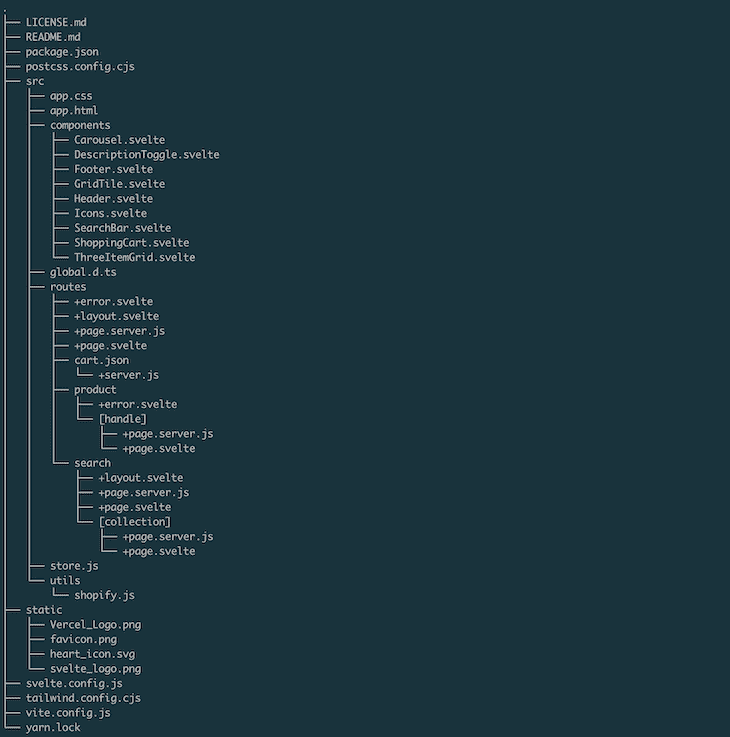

要验证您是否一切正常，请在您的终端上运行`npm run dev`并访问将显示在您屏幕上的 URL。您应该会看到类似以下页面的内容:

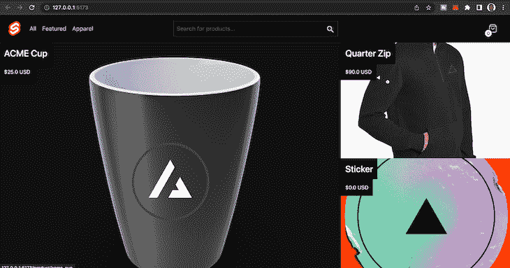

这证实了我们已经成功克隆了默认版本的苗条商务，并且我们准备让它成为我们自己的。

### 集成 Shopify

因此，苗条商务帮助你与你的电子商务商店的表示层。但是，这取决于您将提供的数据存储。默认情况下，Svelte Commerce 通过 [Shopify storefront API](https://shopify.dev/api) 使用来自您的 Shopify 商店的数据。

当您克隆项目时，您会看到它在`shopify.js`文件中有一些默认的 Shopify 凭证。该凭证是由 Vercel 团队添加的示例凭证，以使示例模板能够工作:

```
├── src
│   ├── store.js
│   └── utils
│       └── shopify.js

```

让我们编辑它以添加我们自己的自定义 Shopify 商店凭据。`shopify.js`文件将包含以下代码:

```
// src/utils/shopify.js
export async function shopifyFetch({ query, variables }) {
  const endpoint =
    import.meta.env.VITE_SHOPIFY_API_ENDPOINT ||
    'https://next-js-store.myshopify.com/api/2021-10/graphql.json';
  const key =
    'ef7d41c7bf7e1c214074d0d3047bcd7b';

  try {
    const result = await fetch(endpoint, {
      method: 'POST',
      headers: {
        'Content-Type': 'application/json',
        'X-Shopify-Storefront-Access-Token': key
      },
      body: { query, variables } && JSON.stringify({ query, variables }),
      duplex: 'half'
    });

    return {
      status: result.status,
      body: await result.json()
    };
  } catch (error) {
    console.error('Error:', error);
    return {
      status: 500,
      error: 'Error receiving data'
    };
  }
}

```

请注意，凭据是以明文形式显示的。我们需要将它添加到`.env`文件中，并删除默认凭证。因此，我们更新后的代码将如下所示:

```
// src/utils/shopify.js
...  
const endpoint = import.meta.env.VITE_SHOPIFY_API_ENDPOINT;
const key = import.meta.env.VITE_SHOPIFY_API_ACCESS_TOKEN;
...

```

现在，在项目的根目录下创建一个`.env`文件，并添加以下变量:

```
//.env
VITE_SHOPIFY_API_ENDPOINT=
VITE_SHOPIFY_API_ACCESS_TOKEN=

```

要获得这些凭证，我们需要一个 Shopify 帐户和一个店面。如果您还没有帐户，[创建一个帐户](https://www.shopify.com/)，然后创建一个商店。

当你有一个商店所有的设置，你的 [`SHOPIFY_API_ENDPOINT`](https://shopify.dev/api/admin/getting-started#use-the-graphiql-app) 将在这个模式`[https://](https://){shopname}.myshopify.com/admin/api/2022-10/graphql.json`。所以，把店名换成你的店名。然后，您可以更新您的`.env`变量，使其现在具有:

```
//.env
VITE_SHOPIFY_API_ENDPOINT=https://{shopname}.myshopify.com/admin/api/2022-10/graphql.json
VITE_SHOPIFY_API_ACCESS_TOKEN=

```

接下来，让我们从您的仪表板获取 Shopify 访问令牌。

## 从您的仪表板访问 Shopify

您的 Shopify 后端是一切发生的地方，从生成您的访问令牌和创建将在您的电子商务商店上显示的产品，到查看您的库存和分析，等等。

让我们完成后端的基本设置，这将允许我们为 Svelte Commerce 生成店面访问令牌。在您的 Shopify 管理面板中，点击侧边栏上的**应用链接**。这将返回一个弹出窗口。然后点击弹出窗口中的 **App 和销售渠道设置**:

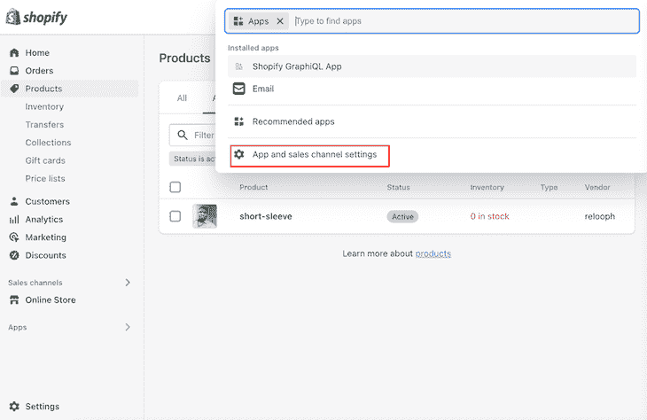

你将进入一个屏幕，在那里你会看到**为你的商店开发应用**按钮，如下所示。点击它:

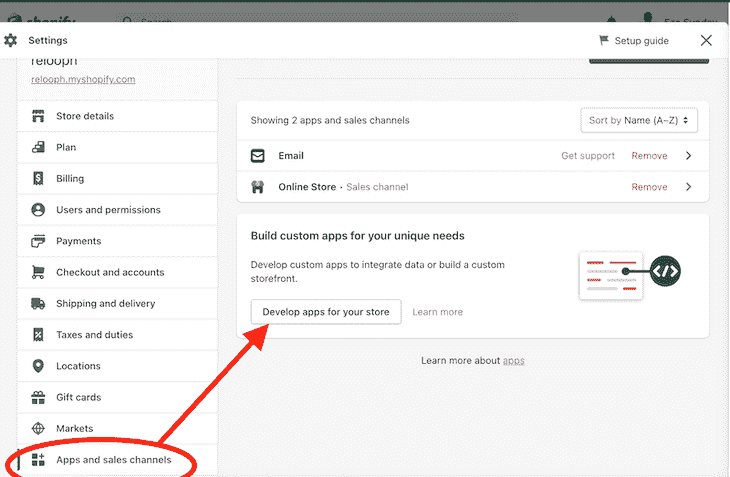

然后，你会被带到另一个屏幕，允许你搜索你的应用程序或创建一个新的。选择**创建应用**按钮，如下图所示:

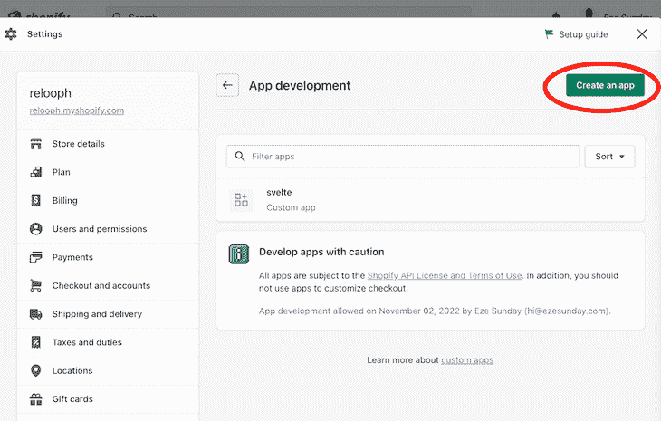

创建应用程序后，您需要配置 Storefront API 范围，如下一页所示:


在那里，选择所有的**店面 API 访问范围**，选择**保存**:

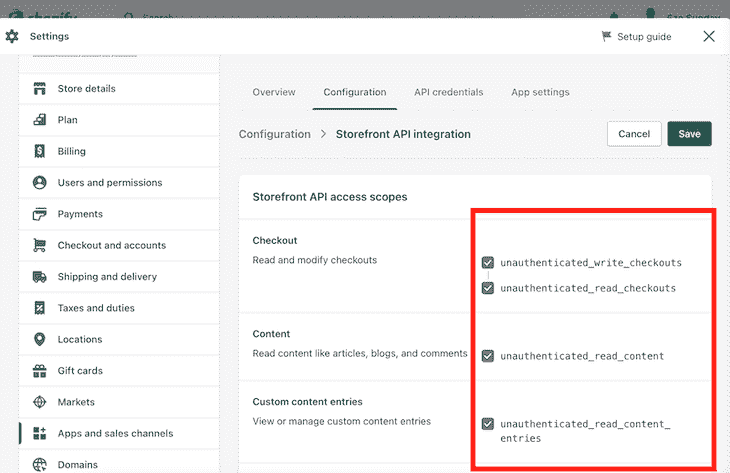

最后，导航到凭证部分并单击**安装应用程序**按钮:

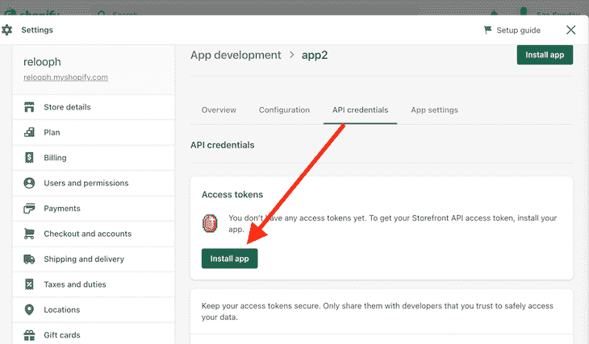

安装过程完成后，您将看到您的 Storefront API 访问令牌，如下所示:

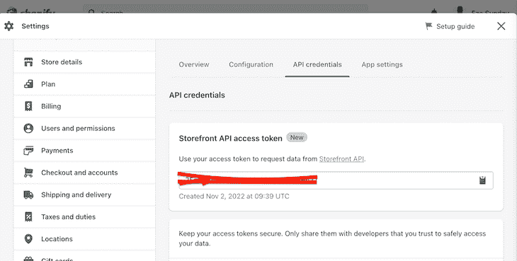

复制令牌，转到您的`.env`文件，并在那里添加访问令牌:

```
//.env
VITE_SHOPIFY_API_ENDPOINT=https://{shopname}.myshopify.com/admin/api/2022-10/graphql.json
VITE_SHOPIFY_API_ACCESS_TOKEN=kjbabfjkhfkjhjbkvhjvfiofguhfy

```

恭喜你。你苗条的电子商务商店已经准备好了。您可以根据需要调整设计或任何附加功能。您在 Shopify 商店创建的所有产品都将出现在您的定制商店中。最好的部分是，你不必支付 Shopify 月费，因为 API 是免费使用的。

现在，我们已经准备好了我们的电子商务商店，让我们部署它，让世界看到。

## 将您的电子商务商店部署到 Vercel

开发人员喜欢使用 Vercel 的原因之一是，任何人都可以在几分钟内轻松地将支持的应用程序部署到他们的服务器上。你不必担心任何复杂的设置。你真正需要做的就是把你的代码推送到 GitHub，连接到 Vercel 一次，每次你推一个新的更新到 GitHub，它就会自动部署。

所以，让我们从在 [Vercel 网站](https://vercel.com)上创建一个账户并登录开始。

接下来，将您的存储代码推送到 GitHub、GitLab 或 BitBucket，因为每次您将更新推送到存储库时，Vercel 都会通过这个媒介触发自动部署。确保仔细检查您已经将`.env`文件添加到您的`.gitignore`文件中，这样您就不会意外地将您的秘密推送到 GitHub:

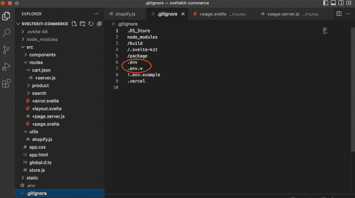

在这一步，当您访问这个[https://vercel.com/new](https://vercel.com/new)时，请保持登录您的 Vercel 帐户。然后，您应该会看到一个请求连接 Git 提供者的页面。继续连接并导入您的项目:

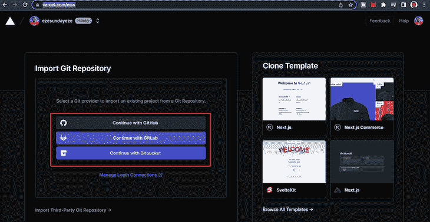

最后，将其配置为使用您的环境变量，并单击 **Deploy** 按钮，如下所示:


这就是全部了。只需等待部署完成，你应该有你的电子商务商店准备向世界展示。很简单，对吧？

让我们也部署到 Netlify。

## 如何在网络生活中部署你的苗条商务

Netlify 用户享受着与 Vercel 用户相似的好处——简单的部署，开发者友好，并且它在前端应用和 lambda 函数方面大放异彩。

就像我们对 Vercel 所做的那样，Netlify 在部署方面没有太大的区别。首先，注册并登录到您的 Netlify 后端。

从那里，点击**添加新站点**按钮，并选择从您的 GitHub 配置文件导入它。然后，您将被引导连接您的 GitHub 存储库:

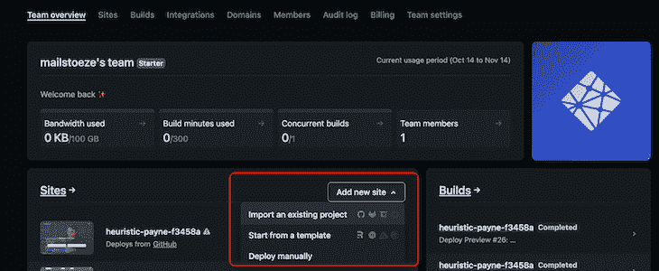

当您选择您的存储库并导入它时，单击**高级选项**并添加您的环境变量:

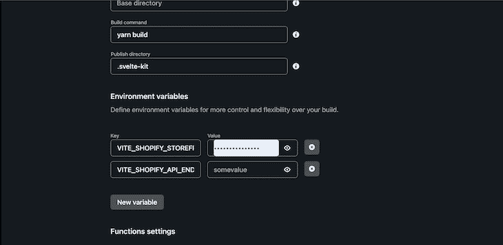

接下来，点击**部署站点**按钮:

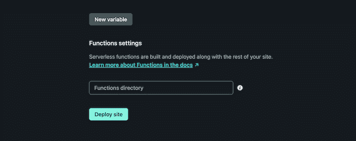

瞧啊。您的电子商务商店已经准备好了。

您可以通过利用 Svelte 的所有功能和 Shopify API 提供的免费功能来改善您的电子商务商店。

## 结论

建立一个全面的电子商务商店需要时间，并伴随着一些财务和精神负担。如果你正试图为你的企业或客户建立一个定制的电子商务商店，并且你想在不损害安全性或质量的情况下快速完成，那么 Svelte Commerce 可能是你最好的选择。

## [日志火箭](https://lp.logrocket.com/blg/ecommerce-signup):看看用户没有完成你的电子商务流程中的一步的技术和 UX 原因。

[](https://lp.logrocket.com/blg/ecommerce-signup)

LogRocket 就像是一个网络和移动应用程序和网站的 DVR，记录你的电子商务应用程序上发生的一切。LogRocket 没有猜测用户不转化的原因，而是主动揭示了阻止你转化的根本原因，比如 JavaScript 错误或死点击。LogRocket 还可以监控应用的性能，报告客户端 CPU 负载、客户端内存使用等指标。

开始主动监控您的电子商务应用程序— [免费试用](https://lp.logrocket.com/blg/ecommerce-signup)。