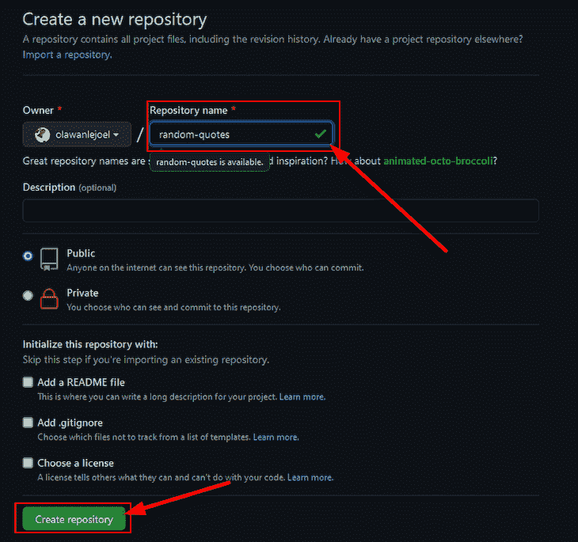
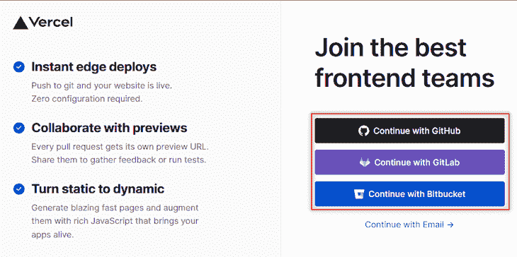
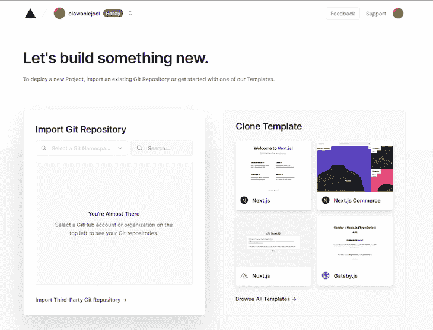
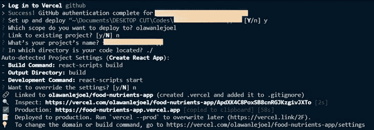
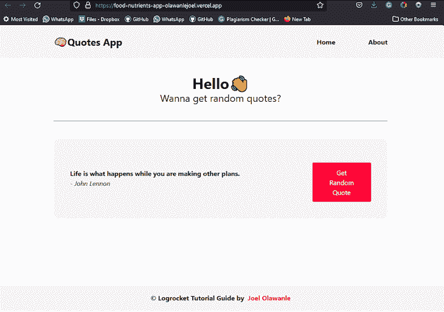
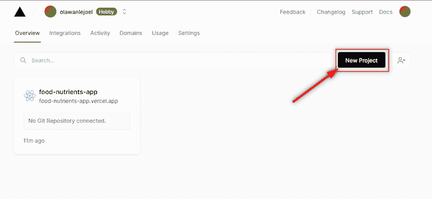
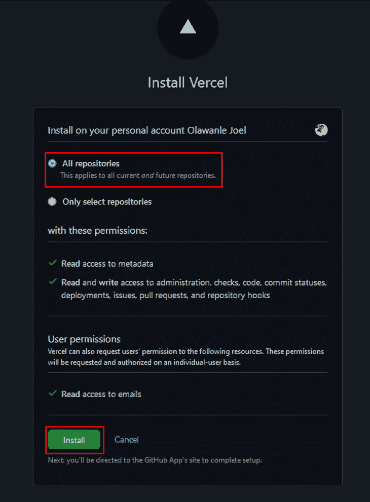
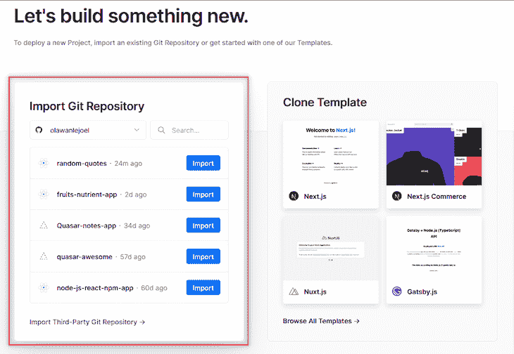
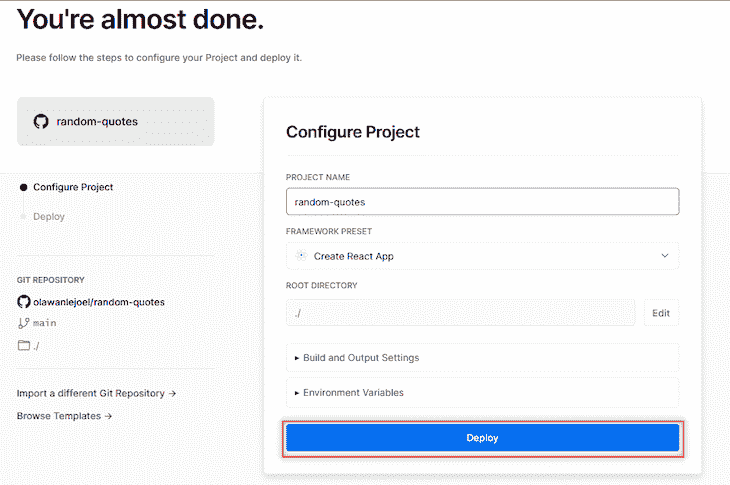
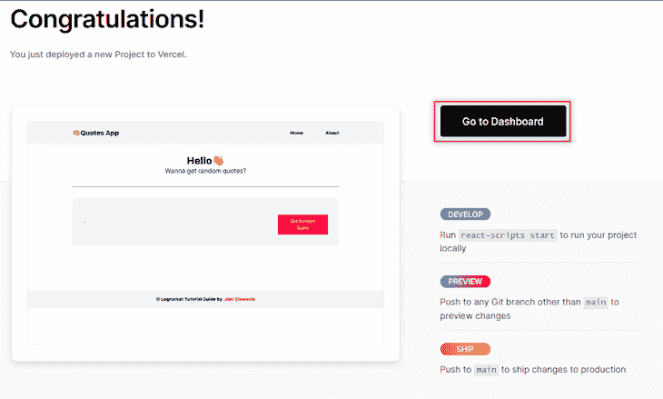

# 使用 Vercel 免费部署 React 应用程序

> 原文：<https://blog.logrocket.com/deploy-react-app-for-free-using-vercel/>

## 介绍

你有没有想过让你的项目可以通过一个活的网址，而不必经历主机提供商的压力？

在过去，在 Vercel 这样的云平台出现之前，托管只能由托管提供商(例如 GoDaddy)执行，这些提供商要求您每次进行更改时都要上传静态资产(例如项目构建文件夹)。这种上传是通过 FTP 软件或 cPanel 之类的系统完成的，这可能会变得非常有压力和技术性。

如今，随着 GitHub 的出现，开发人员可以访问像 Vercel 这样的云平台，从而简化部署。

Vercel 是一个无服务器的云平台，允许开发人员(基本上是前端开发人员)托管网站和在线服务，这些网站和服务即时启动，自动增长，不需要监控，所有这些都只需最少的配置或不需要配置。Vercel 是部署 React 应用程序的完美选择，它提供了构建高性能网站和应用程序的全面工具。

## 为什么要用 Vercel？

*   Vercel 为您提供了免费的域(包含 vercel.app 后缀),让您在实时服务器上部署代码。它还允许你利用自己独特的/个人的领域
*   Vercel 支持自动部署，这意味着每当您将变更推送到您的存储库的生产分支(main 或 master)时，Vercel 会自动检测并将其部署到服务器
*   Vercel 构建的每个部署都受到自动更新 SSL 证书的安全保护，并由他们的边缘网络提供支持。这确保了您的内容始终能够安全快速地交付，无需任何配置
*   只需一次点击，您就可以启用 Vercel GitHub 和 GitLab 连接来进行连续的部署预览
*   Vercel 有一个 [marketplace](https://vercel.com/integrations) 用于整合第三方工具，如 Google Lighthouse、Slack、Shopify 等
*   还有更多…

## 入门指南

对于本指南，我们将使用一个[随机报价生成器应用程序](https://github.com/olawanlejoel/random-quotes)，它从一个 [API](https://type.fit/api/quotes) 获取随机报价。

在开始之前，让我们看一下使用 Vercel 所需的一些先决条件:

*   拥有任何 Git 提供商(GitHub、GitLab 或 Bitbucket)的帐户
*   npm(自带[节点](https://nodejs.org/en/)或[纱线](https://yarnpkg.com/en/docs/install)
*   基本了解如何使用[终端](https://www.linode.com/docs/guides/using-the-terminal/)

### 将您的代码推送到 GitHub

为了在 Vercel 上部署您的应用程序/项目，您需要将您的项目推送到任何 Git 提供者。

对于本指南，我将通过终端使用 GitHub 来推送我们的 React 应用程序。

首先，让我们在 GitHub 上创建一个存储库:


然后确保您填写了必要的信息，并单击**创建存储库**:



回到终端，让我们从暂存所有文件开始，这样我们可以将它们提交到存储库，然后使用以下命令创建一个新的分支`main`:

```
git init
git add .
git commit -m "first commit"
git branch -M main

```

完成后，我们现在可以使用以下命令推送至创建的远程存储库:

```
git remote add origin https://github.com/olawanlejoel/random-quotes.git
git push -u origin main

```

*注意，* *用你的替换 GitHub 远程 URL。*

当您刷新存储库时，您的代码应该会显示出来！


Inputting a new code into a Vercel Repository

接下来，大约有四种[方法](https://vercel.com/docs/concepts/deployments/overview#making-deployments)来部署到 Vercel，但是我们将只考虑两种主要方法(这适用于所有其他框架)。

让我们探索这两种方法，即手动部署(Vercel for Git)和通过 Vercel CLI 的终端部署。最后，我们将得出哪个是最好的结论。

### 使用 Vercel CLI 部署

第一步是访问[https://vercel.com/](https://vercel.com/)，点击右上角的**注册**按钮。您可以注册 GitHub、GitLab 或 Bitbucket:



一旦成功，您的控制面板将如下所示:



下一步是安装 Vercel CLI。我们将只使用必要的命令来推动我们的项目对本指南做出反应。您可以查看他们的 CLI 文档以了解更多命令及其功能。

要全局安装 Vercel CLI，您可以在终端上运行以下命令:

```
npm i -g vercel

```

*注意，t* *o 确认安装成功，就可以在终端上运行* `vercel` `--version` *。*

一旦它被成功安装，下一步将是推动我们的代码。由于这是我们的第一次，我们需要通过终端登录到 Vercel。在您的终端上运行以下命令:

```
vercel

```

这将引出以下内容:


使用方向按钮向上或向下移动，并点击输入按钮选择您的首选选项。

这将把您重定向到一个浏览器选项卡，在那里它将显示成功或失败。

*注意，确保您使用之前创建 Vercel 账户时使用的账户* *登录。*

下一步是返回终端，继续您开始的工作。😄通过回答这些问题，首先要确认这是您想要部署的项目:

```
? Set up and deploy “path to your project”? [Y/n] y

```

下一个问题是确认哪个帐户部署您的应用程序:

```
? Which scope do you want to deploy to? Your Vercel Account

```

*注意，这将提供一个默认选项；按回车键继续。*

接下来，会询问您是否要将此链接到现有项目。只需键入`N`:

```
? Link to existing project? [y/N] n

```

下一步是命名您的项目:

```
? What’s your project’s name? project-name

```

现在会提示您指定路径。这将使用默认选项`./`，因为我们已经在项目目录中:

```
? In which directory is your code located? ./

```

最后，CLI 的一个令人惊叹的特性是它的自动框架检测，这允许它检测您正在使用的框架，并相应地提供默认的项目设置。这包括**构建命令**、**输出目录**和**开发命令**。

这仅仅意味着它将自动检测您的项目是否是使用`create-react-app`初始化的，并相应地配置设置。否则，将要求您设置它们:

```
Auto-detected Project Settings (Create React App):
- Build Command: `npm run build` or `react-scripts build`
- Output Directory: build
- Development Command: react-scripts start

```

最后一个问题是确认您是否想要覆盖这些设置。只需键入`n`:

```
? Want to override the settings? [y/N] n

```

万岁，你的项目成功部署！以下是它的外观总结:



一旦成功，Vercel 会自动将生产链接复制到剪贴板。转到您的浏览器，将生产链接或`ctrl + click`链接粘贴到您的终端。



### 使用 Vercel 手动部署

现在让我们来看看另一种部署方法。对于不熟悉终端并且喜欢手动执行部署的个人来说，这种方法更可取。

第一步是[访问你的仪表板](https://vercel.com/login?next=%2Fdashboard)并点击**新项目**。



这将把您重定向到一个可以创建项目的页面。下一件事就是点击搜索栏**添加 GitHub 名称空间**。


这将从 GitHub 弹出一个授权页面。确保您单击了要从其部署的帐户(可以是您的个人帐户或组织帐户)。然后它会要求你安装 Vercel。



*注意，您需要输入您的 GitHub 密码来确认这是您的帐户。*

一旦成功，所有的 GitHub 存储库都会出现，下一步是选择您想要导入和部署的存储库。



导入存储库，然后将出现以下内容:



*注意，V* *ercel 自动检测你的框架预置。*

你现在可以点击**部署**按钮。这将通过运行构建、检查并最终分配一个域来开始部署您的项目。



您可以点击 **Go to Dashboard** 按钮来查看我们部署的应用程序的详细信息，例如域名和其他部署信息。

## 比较两种部署方法

这两种方法执行相同的功能，但是通过不同的手段/方法。作为开发人员，选择哪一个是最好的将基于您自己的偏好。

*   Vercel CLI 在终端上完成所有工作，这意味着您实际上不需要经历不必要的导航压力
*   虽然其他方法很酷，但您需要做的只是在 Vercel 仪表板中导航

请在评论部分告诉我您认为哪种方法是最好的，以及为什么您认为它是最好的，但对我来说，我总是选择 Vercel CLI，因为它使部署更容易，并且不会让我离开我的 IDE。😋

## 结论

在本文中，我们已经能够看到如何[将 React 应用](https://blog.logrocket.com/8-ways-to-deploy-a-react-app-for-free/)部署到 Vercel。我们看到了两种主要方法及其工作原理。您可以查看以下资源，了解有关部署的更多信息以及 Vercel 为您提供的更多特性:

## 使用 [LogRocket](https://lp.logrocket.com/blg/signup) 消除传统错误报告的干扰

[](https://lp.logrocket.com/blg/signup)

[LogRocket](https://lp.logrocket.com/blg/signup) 是一个数字体验分析解决方案，它可以保护您免受数百个假阳性错误警报的影响，只针对几个真正重要的项目。LogRocket 会告诉您应用程序中实际影响用户的最具影响力的 bug 和 UX 问题。

然后，使用具有深层技术遥测的会话重放来确切地查看用户看到了什么以及是什么导致了问题，就像你在他们身后看一样。

LogRocket 自动聚合客户端错误、JS 异常、前端性能指标和用户交互。然后 LogRocket 使用机器学习来告诉你哪些问题正在影响大多数用户，并提供你需要修复它的上下文。

关注重要的 bug—[今天就试试 LogRocket】。](https://lp.logrocket.com/blg/signup-issue-free)

## 使用 LogRocket 消除传统反应错误报告的噪音

[LogRocket](https://lp.logrocket.com/blg/react-signup-issue-free)

是一款 React analytics 解决方案，可保护您免受数百个误报错误警报的影响，只针对少数真正重要的项目。LogRocket 告诉您 React 应用程序中实际影响用户的最具影响力的 bug 和 UX 问题。

[ ](https://lp.logrocket.com/blg/react-signup-general) [  ](https://lp.logrocket.com/blg/react-signup-general) [LogRocket](https://lp.logrocket.com/blg/react-signup-issue-free)

自动聚合客户端错误、反应错误边界、还原状态、缓慢的组件加载时间、JS 异常、前端性能指标和用户交互。然后，LogRocket 使用机器学习来通知您影响大多数用户的最具影响力的问题，并提供您修复它所需的上下文。

关注重要的 React bug—[今天就试试 LogRocket】。](https://lp.logrocket.com/blg/react-signup-issue-free)