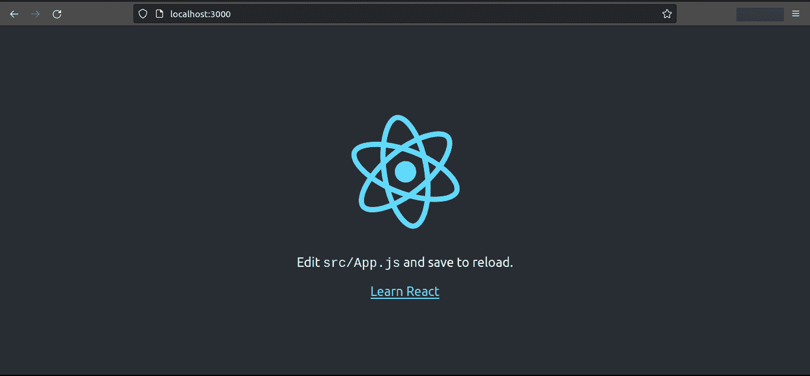

# 使用 Docker - LogRocket 博客将 React 应用程序部署到 Kubernetes

> 原文：<https://blog.logrocket.com/deploy-react-app-kubernetes-using-docker/>

在本教程中，我们将学习如何使用 Docker、 [minikube](https://minikube.sigs.k8s.io/docs/) 和 [kubectl](https://kubernetes.io/docs/tasks/tools/) 将 React 应用程序部署到 [Kubernetes](https://blog.logrocket.com/comparing-kubernetes-cloud-providers-gke-eks-azure/) 。让我们仔细看看这些工具，了解为什么它们是部署容器化 React 应用程序的最佳选择。

Docker 是一个开源软件容器化平台，允许你将应用程序打包成标准化的、孤立的单元，称为容器。这些容器将应用程序源代码与在任何环境中运行该代码所需的操作系统库和依赖项结合起来。

Docker 允许您快速构建、测试、部署和扩展应用程序。它的开发速度、可伸缩性和生态系统的丰富性是我们将使用它来容器化 React 应用程序的许多原因中的一部分。请记住，使用 Docker 进行容器化在开发者社区中也被称为“ [dockerizing](https://blog.logrocket.com/dockerizing-a-django-app/) ”。

Kubernetes 是一个开源工具，允许您自动化容器化应用程序的部署、扩展和管理。我们将使用它来部署和管理我们的 dockerized React 应用程序。

接下来，minikube 是一个在 macOS、Linux 和 Windows 上设置本地 Kubernetes 集群的工具。我们将使用这个工具在本地运行 Kubernetes，而不是使用云提供商。

最后，kubectl 是 Kubernetes 命令行工具，它允许我们对 Kubernetes 集群运行命令。我们将使用这个工具来部署我们的 dockerized React 应用程序，并检查和管理我们的本地 Kubernetes 集群资源。

## 先决条件

为了完成本教程，您需要一台安装了以下工具的机器:

*   Node.js 和 npm (Node ≥v14.0.0 和 npm ≥v5.6)
*   码头工
*   库布特雷
*   迷你库比

除了上面提到的工具，你还需要一个 Docker Hub 账户。

## 创建 React 应用程序

在本节中，我们将创建项目目录结构来存储我们的应用程序文件。之后，我们将使用 Create React App 创建一个 React 应用程序，测试该应用程序，并将其构建用于生产。

### 创建项目目录结构

创建项目目录并导航到其中，如下所示:

```
mkdir react-docker-kubernetes
cd react-docker-kubernetes

```

创建一个名为`K8s`的目录来存储 Kubernetes 文件，另一个名为`react-docker`的目录来存储 React 应用程序和 Docker 文件:

```
mkdir K8s 
mkdir react-docker

```

### 创建 React 应用程序并为生产而构建

运行以下命令在`react-docker`目录中创建一个新的 React 应用程序，然后导航到该目录并启动该应用程序:

```
npx create-react-app react-docker

```

您可以通过导航到以下 URL 来手动导航到您的应用程序: [http://localhost:3000/](http://localhost:3000/)

应用程序应该如下所示:



当您使用`npm start`开始运行应用程序时，默认情况下，如果还没有应用程序在运行，应用程序将在`port 3000`上运行。您可以通过创建一个`.env`文件并在其中手动设置端口来改变这种行为。

关闭运行 React 应用程序的进程，然后创建一个`.env`并向其中添加以下内容，以将端口设置为 3002:

```
PORT=3002

```

让我们使用以下命令来构建我们的生产应用程序:

```
npm run build

```

当上面的命令执行完毕时，我们的生产就绪应用程序的文件将在一个名为`build`的目录中可用。

## 将 React 应用程序归档

在本节中，我们将创建 React 应用程序的 Docker 映像，运行并测试从应用程序映像创建的容器，然后将其推送到 Docker Hub 帐户。

在我们继续之前，您需要登录您的 Docker Hub 帐户。

为此，请运行以下命令:

```
docker login

```

您将被要求输入您的 Docker Hub 帐户的用户名和密码，如果成功，您将看到以下消息:

```
Login Succeeded

```

### 创建 Docker 图像

为了创建 Docker 映像，我们必须创建两个重要的文件:`Dockerfile`和`.dockerignore`。一个`Dockerfile`是一个文本文档，它包含了用户可以在命令行上调用的所有命令来组合一个图像。`.dockerignore`文件是一个文本文档，包含用户在组装图像时想要忽略的文件和目录列表。

在项目的根目录下，将以下代码输入`Dockerfile`:

```
FROM nginx:stable-alpine

COPY build/ /usr/share/nginx/html 

```

在上面的代码中，我们正在为 dockerized 应用程序提取基础映像，它包含运行在 Alpine Linux 上的`Nginx`。`Nginx`是一个开源的 web 服务器，也可以用作反向代理、负载均衡器、邮件代理和`HTTP`缓存。

在提取基础映像之后，您将包含 React 应用程序文件的目录复制到一个目录中，在这个目录中`Nginx`将能够访问它们并为应用程序提供服务。

现在，将以下代码添加到`.dockerignore`:

```
npm-debug.log
.dockerignore
**/.git
**/.DS_Store
**/node_modules

```

在上面的代码中，我们声明了希望从 Docker 映像中排除的文件和目录。

现在我们已经创建了`Dockerfile`和`.dockerignore`，我们准备构建 React 应用程序的 Docker 映像。

运行以下命令来构建映像:

```
docker build -t your_docker_username/react-docker .

```

使用上面的命令，我们创建了图像，并将其名称设置为`react-docker`。用您的 Docker Hub 帐户的用户名替换`your_docker_username`。

现在，用下面的代码运行 dockerized 应用程序:

```
docker run -d -p 3000:80 your_docker_username/react-docker

```

上面的命令以分离模式启动一个 Docker 容器，并将我们的机器`port 3000`映射到 Docker 容器正在运行的容器`port 80`。

打开您喜欢的浏览器并导航到`[http://localhost:3000/](http://localhost:3000/)`，您应该会看到您的 React 应用程序页面。

测试应用程序后，确保使用以下命令停止所有容器:

```
docker stop $(docker ps -a -q)

```

现在您已经成功地测试了容器的运行，使用下面的命令将您的映像推送到您的 Docker Hub 帐户:

```
docker push your_docker_username/react-docker:latest

```

当上面的命令执行完毕后，任何安装了 Docker 的人都可以调用你的 Docker 化的 React 应用程序。

## 将我们的 React 应用部署到 Kubernetes

在本节中，我们将启动一个本地 Kubernetes 集群，配置该集群，然后将我们的 dockerized 应用程序部署到该集群并对其进行扩展。

* * *

### 更多来自 LogRocket 的精彩文章:

* * *

### 启动和配置本地 Kubernetes 集群

首先，像这样导航到`K8s`目录:

```
cd ../K8s

```

使用 minikube 启动您的本地 Kubernetes 集群:

```
minikube start

```

然后，使用 kubectl 创建一个名为`react-docker`的新名称空间:

```
kubectl create namespace react-docker

```

现在，将`react-docker`设置为默认上下文:

```
kubectl config set-context --current --namespace=react-docker

```

### 将 dockerized 应用程序部署到 Kubernetes

创建一个名为`deployment.yaml`的文件，并向其中添加以下代码:

```
kind: Deployment
apiVersion: apps/v1
metadata:
  name: react-docker
spec:
  replicas: 2
  selector:
    matchLabels:
      app: react-docker
  template:
    metadata:
      labels:
        app: react-docker
    spec:
      containers:
      - name: react-docker
        image: your_docker_username/react-docker
        ports:
        - containerPort: 80

```

在上面的`deployment.yaml`文件中，我们将应用部署的名称设置为`react-docker`，将`pods`的编号设置为`2`。

接下来，我们将我们想要用来构建您的应用程序的图像指定为`your_docker_username/react-docker`。现在，用您实际的 Docker Hub 用户名替换`your_docker_username`。

最后，我们指定容器在`port 80`上运行。

使用以下内容部署应用程序:

```
kubectl apply -f deployment.yaml

```

并使用以下命令监视部署的状态:

```
kubectl get deployment -w

```

运行上面的命令后，您应该会看到类似如下的输出:

```
NAME           READY   UP-TO-DATE   AVAILABLE   AGE
react-docker   0/2     2            0           18s
react-docker   1/2     2            1           23s
react-docker   2/2     2            2           29s

```

要从集群外部访问您的应用程序，您需要创建一个服务。该服务将成为负载平衡器。

创建一个文件`load-balancer.yaml`文件，并向其中添加以下代码:

```
apiVersion: v1
kind: Service
metadata:
  name: load-balancer
  labels:
    app: react-docker
spec:
  type: LoadBalancer
  ports:
  - port: 80
    targetPort: 80
    protocol: TCP
    nodePort: 31000
  selector:
    app: react-docker

```

这里，我们将服务的名称设置为`load-balancer`。

我们还指定了服务类型，使服务可以在`port 80`访问，并将`nodePort`设置为`31000`。这个`nodePort`是我们能够访问应用程序的端口。最后，我们表明这项服务是为`react-docker`应用。

现在，我们可以这样部署服务:

```
kubectl apply -f load-balancer.yaml

```

我们可以使用以下命令监控服务的状态:

```
kubectl get services -w

```

我们应该得到类似如下的输出:

```
NAME                TYPE     CLUSTER-IP        EXTERNAL-IP     PORT(S)      AGE
load-balancer   LoadBalancer   10.101.114.62   <pending>     80:31000/TCP   50s

```

可以通过以下 URL 访问该应用程序:

```
http://your_minikube_ip:31000

```

接下来，使用以下命令获取 minikube IP 地址:

```
minikube ip

```

用`minikube ip`命令返回的 IP 地址替换`your_minikube_ip`。

导航到 URL，您将能够访问 Kubernetes 上运行的 dockerized 应用程序。

### 扩展应用程序

现在，我们可以通过使用以下命令将 pod 的数量增加到 10 来扩展我们的应用程序:

```
kubectl scale deployment react-docker --replicas=10

```

像这样监视部署的状态:

```
kubectl get deployment -w

```

您应该会看到我们现在有十个 pods 运行 React 应用程序:

```
NAME           READY   UP-TO-DATE   AVAILABLE   AGE
react-docker   5/10    10           5           39m
react-docker   6/10    10           6           40m
react-docker   7/10    10           7           40m
react-docker   8/10    10           8           40m
react-docker   9/10    10           9           40m
react-docker   10/10   10           10          40m

```

我们还可以通过减少 pod 的数量来缩小应用程序的规模。在这种情况下，三个:

```
kubectl scale deployment react-docker --replicas=3

```

我们可以像以前一样监控部署的状态，您应该会看到我们现在有三个单元在运行应用程序:

```
NAME           READY   UP-TO-DATE   AVAILABLE   AGE
react-docker   3/3     3            3           41m

```

## 结论

在本教程中，我们学习了如何创建一个 React 应用程序并将其构建用于生产。构建应用程序后，我们学习了如何将它 Docker 化并推送到您的 Docker Hub 帐户。最后，我们学习了如何创建和配置本地 Kubernetes 集群，将 dockerized React 应用程序部署到集群，以及如何扩展应用程序。

有关如何对应用程序进行 Docker 化以及如何将它们部署到 Kubernetes 集群的更多信息，请务必阅读 [Docker](https://docs.docker.com/) 和 [Kubernetes](https://kubernetes.io/docs/home/) 文档。

## 使用 LogRocket 消除传统反应错误报告的噪音

[LogRocket](https://lp.logrocket.com/blg/react-signup-issue-free)

是一款 React analytics 解决方案，可保护您免受数百个误报错误警报的影响，只针对少数真正重要的项目。LogRocket 告诉您 React 应用程序中实际影响用户的最具影响力的 bug 和 UX 问题。

[ ](https://lp.logrocket.com/blg/react-signup-general) [  ](https://lp.logrocket.com/blg/react-signup-general) [LogRocket](https://lp.logrocket.com/blg/react-signup-issue-free)

自动聚合客户端错误、反应错误边界、还原状态、缓慢的组件加载时间、JS 异常、前端性能指标和用户交互。然后，LogRocket 使用机器学习来通知您影响大多数用户的最具影响力的问题，并提供您修复它所需的上下文。

关注重要的 React bug—[今天就试试 LogRocket】。](https://lp.logrocket.com/blg/react-signup-issue-free)