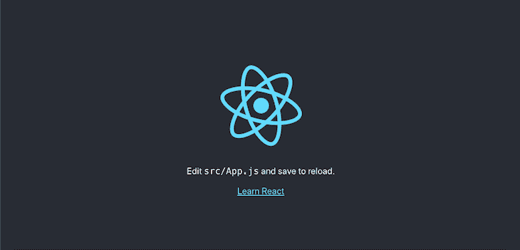
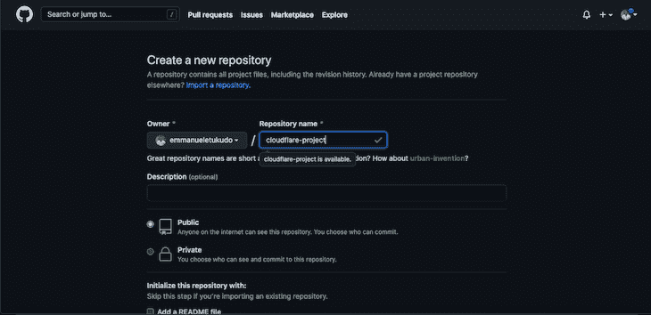
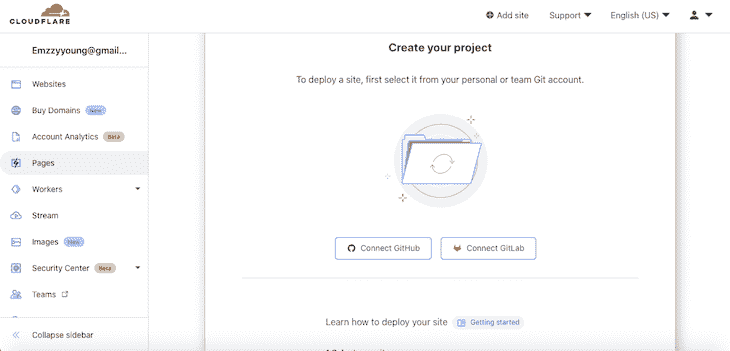
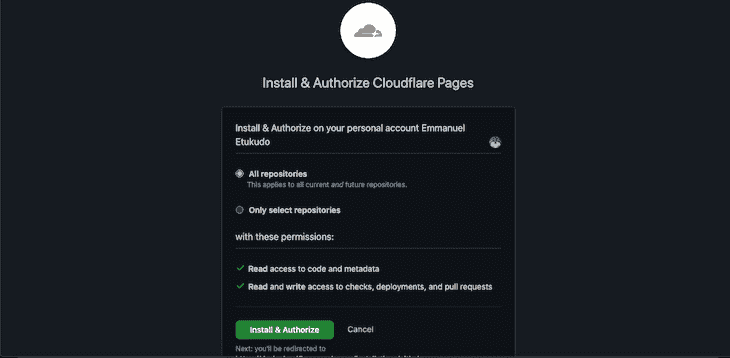
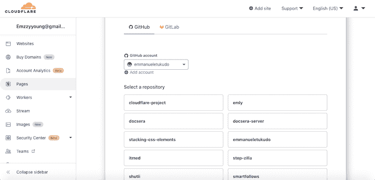
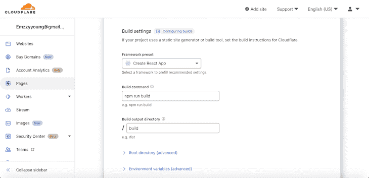
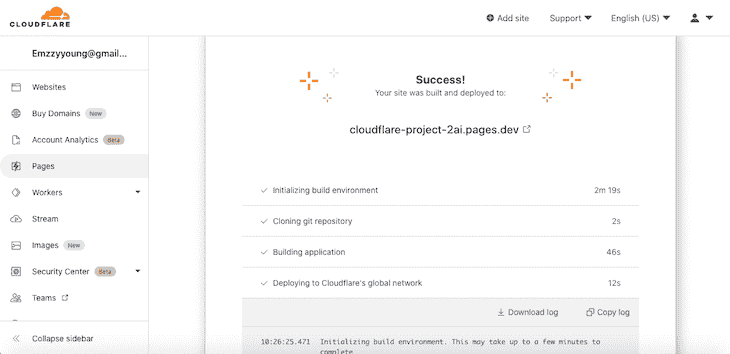
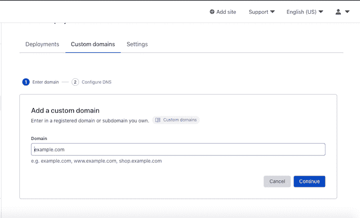
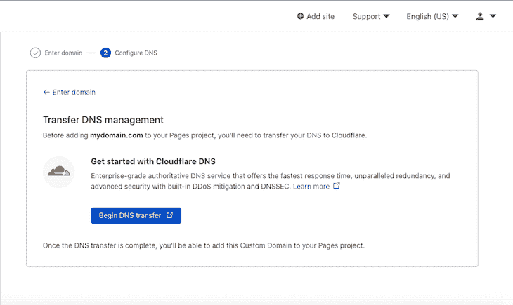

# 使用全栈 Cloudflare Pages 部署 React 应用程序

> 原文：<https://blog.logrocket.com/deploying-react-app-full-stack-cloudflare-pages/>

Cloudflare 主要被称为第三层，用于保护 HTTP 请求、CDN 防火墙和其他面向用户的 web 基础架构，特别是与 web 安全相关的基础架构。然而，Cloudflare 是一家多方投资的公司，一直在大力投资开发人员平台解决方案，如页面、工作人员、视频流等。

随着全球各地的公司迅速采用前端和后端项目的无头和无服务器部署，您的 Jamstack 应用程序有了广泛的选择。选择正确的工具可能会非常困难，但是需要考虑的几个参数可能包括成本、可访问性和开发人员生态系统。

如果您是前端或全栈开发人员，希望通过有限的工作流设置和配置来部署 Jamstack 应用程序，Cloudflare 是一个很好的选择，它可以在几分钟内启动并运行您的应用程序。 [Cloudflare Pages](https://pages.cloudflare.com) 是该公司最受欢迎的开发者平台之一，允许[开发者直接从 GitHub](https://blog.logrocket.com/cloudflare-pages-tutorial-deploy-a-react-app-via-github/) 部署前端应用。在撰写本文时，Cloudflare Pages 已经支持[几乎所有的前端框架](https://developers.cloudflare.com/pages/framework-guides)。

2021 年 11 月，[全栈 Cloudflare Pages](https://blog.cloudflare.com/cloudflare-pages-goes-full-stack/) 发布，提供使用 Cloudflare 构建和部署全栈应用的工具。开发人员现在可以通过一个`git commit`使用 Cloudflare 页面部署全栈应用，使用 Cloudflare workers 部署无服务器功能。

在本教程中，您将了解如何使用全栈 Cloudflare 页面创建和部署 React 应用程序。要跟随本教程，您需要:

*   熟悉 CSS、HTML 和 JavaScript ES6
*   安装在您机器上的网络浏览器
*   熟悉 Git
*   安装在开发机器上的代码编辑器
*   对 React 的基本理解

我们开始吧！

## 使用全栈 Cloudflare 页面

Cloudflare Pages 使开发人员能够直接从他们的 GitHub 或 GitLab 存储库部署前端应用程序。Cloudflare Pages 以前被设计为支持静态站点的部署。

然而，随着 [Cloudflare Workers](https://workers.cloudflare.com/?&_bt=521144407143&_bk=&_bm=b&_bn=g&_bg=123914288844&_placement=&_target=&_loc=9067609&_dv=c&awsearchcpc=1&gclid=Cj0KCQiAsqOMBhDFARIsAFBTN3eyQsvbPzy3y3BOeCnYZMDVjSd8QkaoPbOfFiFWxSK8zEm9lSCNAJsaAnfkEALw_wcB&gclsrc=aw.ds) 的推出，Cloudflare 宣布正式支持全栈 Cloudflare 页面，这意味着开发人员现在可以通过单个`git commit`构建和部署静态和服务器端渲染的应用程序。

全栈 Cloudflare Pages 的工作方式与 Cloudflare Pages 完全相同，涉及`git commit`和`git push`的部署工作流没有任何变化。不同之处在于，Cloudflare Pages 现在支持使用 Cloudflare Workers 进行服务器端渲染。

全栈 Cloudflare Pages 利用您的存储库文件系统，公开您添加到`./functions`文件夹的函数处理程序，并使用 Cloudflare Workers 将它们转换成无服务器函数。要开始编写 Cloudflare 无服务器函数，您需要首先将一个`./functions`文件夹添加到项目的根目录中。文件夹中的任何文件都将被视为无服务器功能。

例如，考虑下面的代码:

```
// GET requests to /filename would return "Hello, world!"
export const onRequestGet = () => {
  return new Response("Hello, world!")
}

// POST requests to /filename with a JSON-encoded body would return "Hello, <name>!"
export const onRequestPost = async ({ request }) => {
  const { name } = await request.json()
  return new Response(`Hello, ${name}!`)
}

```

将上面的代码片段添加到`greetings.js`文件中会向`project-url/greetings.js`发送一个`GET`请求。

## 设置和安装

在本教程中，我们将使用 Create React App 生成 React 应用程序，将该应用程序部署到 GitHub，并最终将其部署到 Cloudflare 页面。运行下面的代码，使用`npx`初始化一个新项目:

```
npx create-react-app cloudflare-project

```

初始化完成后，我们将通过导航到`Cloudflare-project`文件夹并运行以下代码来测试我们的应用程序:

```
npm start

```

您的应用程序应该类似于下面的屏幕截图:



接下来，我们将创建一个新的 GitHub 存储库来托管`Cloudflare-project`文件和源代码。访问[新回购](https://github.com/new/)，你会看到如下屏幕:



要准备本地源文件并将其推送到 GitHub，请运行以下命令:

```
git remote add origin https://github.com/yourusername/cloudflare-project.git
git branch -M main
git push -u origin main

```

## 使用 Cloudflare 页面部署

既然我们已经将项目推送到 GitHub，让我们从 GitHub 将应用程序部署到 Cloudflare 页面。

首先，登录您的 [Cloudflare 仪表盘](https://dash.cloudflare.com/)，导航至**账户主页**，然后点击**页面。**如果您尚未将您的 GitHub 帐户连接到 Cloudflare，您应该会看到类似于以下屏幕截图的屏幕:



要继续，请点击**连接 GitHub** 将 GitHub 链接到您的 Cloudflare 帐户。点击**安装&授权**继续，然后输入你的 GitHub 密码授权操作。见下面截图供参考:



一旦您的 GitHub 成功链接到 Cloudflare，您将在 Cloudflare 仪表板上列出来自 GitHub 的所有存储库的列表，如下图所示:



请注意，列表中的第一个回购是我们在上一节中创建的。选择 **`cloudflare-project`** 回购，然后向下滚动并点击**开始设置**。向下滚动到**构建设置**并添加以下配置:

*   框架预置:`create-react-app`，自动设置构建命令和构建输出
*   构建命令:`npm run build`
*   构建输出:`/build`

见下面截图:



要完成构建过程，请点击**保存并部署**。构建过程完成后，您应该会看到与下面的屏幕截图类似的成功消息:



要预览您的项目，您可以单击唯一链接。你的会与`[https://cloudflare-project-2ai.pages.dev/](https://cloudflare-project-2ai.pages.dev/)`不同，但是，你会得到相同的结果。现在，我们已经使用 Cloudflare 页面成功部署了 React 应用程序！

## 创建无服务器功能

正如前面提到的，我们首先需要在我们的`cloudflare-project`项目的根目录中创建一个`./functions`文件夹。接下来，创建一个名为`api`的新文件夹，导航到该文件夹，添加一个名为`greetings.js`的文件，并添加以下代码:

```
// GET requests to /filename would return "Hello, world!"
export const onRequestGet = () => {
  return new Response("Hello, world!")
}

// POST requests to /filename with a JSON-encoded body would return "Hello, <name>!"
export const onRequestPost = async ({ request }) => {
  const { name } = await request.json()
  return new Response(`Hello, ${name}!`)
}

```

接下来，将您的更改提交并推送到 GitHub，如下所示:

```
git add .
git commit -m "Added serverless functions"
git push

```

导航到`[https://cloudflare-project-2ai.pages.dev/api/greatings](https://cloudflare-project-2ai.pages.dev/api/greatings)`来测试运行项目。您应该会收到类似下面截图的响应:


## 添加自定义域

与其他部署平台一样， [Cloudflare 也支持向您的站点添加自定义域](https://blog.logrocket.com/netlify-vs-cloudflare-pages/)。在继续之前，您需要从您首选的认证注册商处购买域名，如 Google Domains、Namecheap 或 Cloudflare Registrar。

接下来，登录到您的 Cloudflare 仪表板，单击**页面**，然后选择您在上一节中部署的`cloudflare-project`。选择**自定义域**，点击**设置自定义域。**输入你的域名，点击**继续:**



接下来，从您的域注册商处获取您的 DNS 记录，并更新 Cloudflare 上的记录，如下面的屏幕截图所示:



### Cloudflare SSL

Cloudflare 还向其所有用户提供免费的安全套接字层(SSL)服务。SSL 特性是可选的，但是，始终保护 web 应用程序的内容和访问者免受恶意攻击是很重要的。访问[入门](https://developers.cloudflare.com/ssl/get-started)并选择您选择的证书类型，然后按照说明进行操作。

## 删除 Cloudflare Pages 项目

如果您想要删除托管在 Cloudflare `pages.dev`子域上的已发布项目，请导航到项目的设置部分，如下所示:

1.  访问**账户主页**或使用仪表板顶部的下拉菜单返回主页
2.  选择**页**
3.  导航到**页面项目** > **设置** > **删除项目**删除您的项目

对于带有自定义域的项目，确保删除与您的项目相关联的`CNAME`记录。

## 结论

对于希望通过单个`git commit`部署全栈应用的开发人员来说，Cloudflare 全栈页面是一个很好的选择。我认为全栈 Cloudflare Pages 将是全栈应用部署的一场革命。

在本文中，我们介绍了全栈 Cloudflare Pages 如何工作，如何从 GitHub 将我们的应用程序部署到 Cloudflare Pages，创建无服务器功能，以及最后删除项目。我希望你喜欢这个教程！

## [LogRocket](https://lp.logrocket.com/blg/react-signup-general) :全面了解您的生产 React 应用

调试 React 应用程序可能很困难，尤其是当用户遇到难以重现的问题时。如果您对监视和跟踪 Redux 状态、自动显示 JavaScript 错误以及跟踪缓慢的网络请求和组件加载时间感兴趣，

[try LogRocket](https://lp.logrocket.com/blg/react-signup-general)

.

[ ](https://lp.logrocket.com/blg/react-signup-general) [](https://lp.logrocket.com/blg/react-signup-general) 

LogRocket 结合了会话回放、产品分析和错误跟踪，使软件团队能够创建理想的 web 和移动产品体验。这对你来说意味着什么？

LogRocket 不是猜测错误发生的原因，也不是要求用户提供截图和日志转储，而是让您回放问题，就像它们发生在您自己的浏览器中一样，以快速了解哪里出错了。

不再有嘈杂的警报。智能错误跟踪允许您对问题进行分类，然后从中学习。获得有影响的用户问题的通知，而不是误报。警报越少，有用的信号越多。

LogRocket Redux 中间件包为您的用户会话增加了一层额外的可见性。LogRocket 记录 Redux 存储中的所有操作和状态。

现代化您调试 React 应用的方式— [开始免费监控](https://lp.logrocket.com/blg/react-signup-general)。