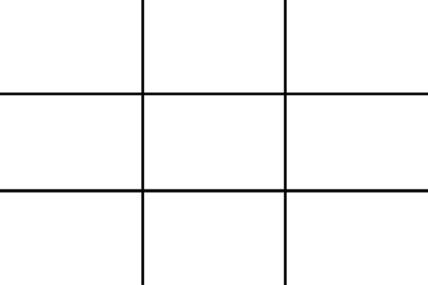
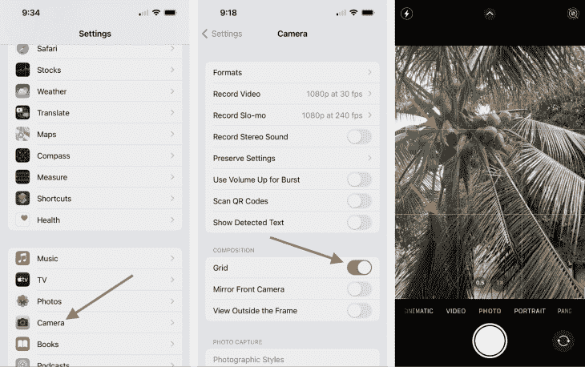
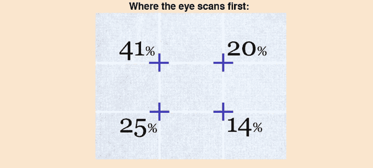
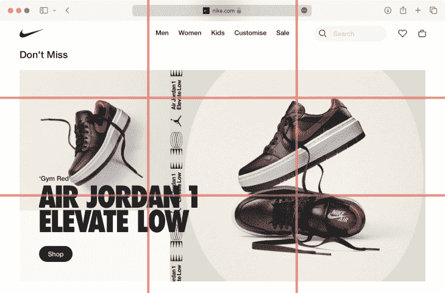
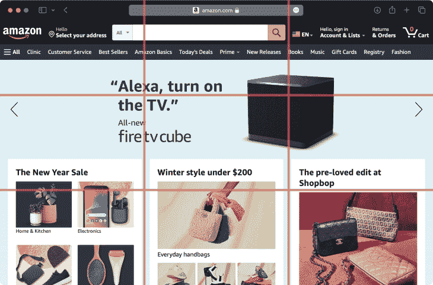
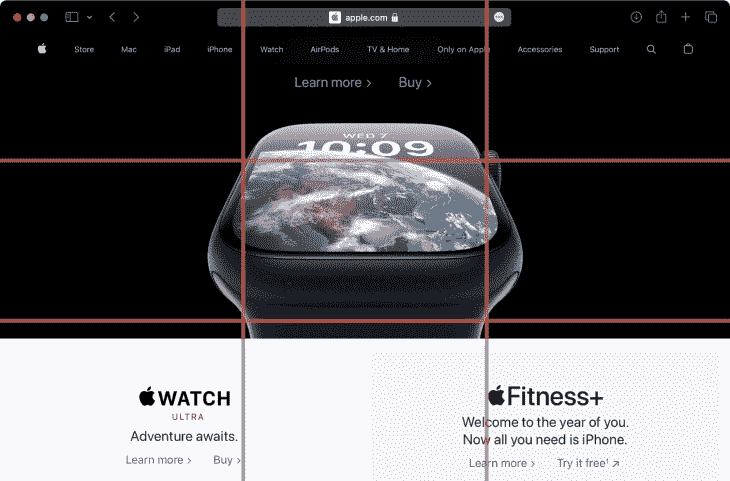

# 用 UX 三分法设计登陆页面

> 原文：<https://blog.logrocket.com/ux-design/designing-landing-page-ux-rule-thirds/>

在设计中，三分法是一个有点隐蔽的规则，但它无处不在。随便说出一个网站，你都能很容易地发现三分法。看到任何广告牌广告，最有可能的是三分法。随便浏览一张营销海报，大概都有。

三分法是一个古老的法则，可以追溯到 18 世纪的艺术家。然而，它的简单应用在现代营销设计中占有突出地位，无论你在哪里看到它，它都被图形艺术家所使用。

所有人都被吸引到作品的中心，例如网页或图像。但这并不意味着只是把一张图片放在一切的中心。在本文中，我将深入探讨三分法。我们会看到这个设计理论从何而来，如何使用，以及耐克、亚马逊、苹果等品牌如何使用这个规则。

这不仅仅是你手机上的一个小把戏。准备好了吗？让我们开始吧。

## 三分法是什么？

在网页设计中，三分法被用来在登陆页面的图片或其他元素中创造平衡。它的主要原则是，如果页面上的元素位于页面的三分之一以内，那么对于浏览者来说，它会比放大和居中更具美感。

三分法是一种将登陆页面分为水平和垂直两条线的方法，形成网格状的交叉点。网格将登录页面分成三份，三个水平列和三个垂直行。然后，网格由水平列和垂直行组成的九个偶数盒组成。

Source: imgbin.com

然后，您可以将相关图像或相关文本放在这些列和行的每个交叉点上。或者，您也可以使用九个框中的每一个来放置您的图像或文本。

例如，如果您的登录页面有一个图像、一个行动号召按钮和联系信息，您可能希望将图像放在两个水平栏上，行动号召按钮放在右下角，联系信息放在左下角。

我们将继续讨论这个问题。

### 三分法的历史

不先讲比例，就不能讲三分法。比例，总的来说，就是物体之间(微观)和整体之间(宏观)有关系的理论。

比如你的登陆页面中的图片、按钮、文字都是相互作用的，这是比例的微观视图，每一个都有助于登陆页面的整体性，这是比例的宏观视图。

三分法是艺术和设计理论的重要组成部分。第一个将三分法完全理论化的人是 18 世纪的约翰·托马斯·史密斯。在他 1797 年出版的《乡村风景评论》一书中，他说:

“简而言之，在应用这一发明时，一般来说，或在任何其他情况下，无论是光、影、形或色，我发现大约三分之二对三分之一或一对二的比例，比精确的形式一半，太远的五分之四——总之，比任何其他比例都好得多，也更和谐。”

有人说三分法自古就有，但约翰·托马斯·史密斯是第一个用书面语言记录的人，这使他的作品成为艺术家的基础作品。

正如你在前面的引用中所看到的，三分法主要是关于比例，确保你的创作，像登陆页面这样重要的东西，在审美上是令人愉悦的，肉眼看起来是和谐的。

三分法在约翰·托马斯·斯密之后延续了很久，成为最重要的“设计基本原则”之一，与黄金分割率和比例法则齐名。

### 你会发现三分法

虽然三分法的理论可以追溯到 18 世纪，但你可以在任何地方找到三分法的最新应用。

首先，看看你的 iPhone。打开**相机选项**，在**构图**下，打开网格选项。相机屏幕上覆盖图像的网格是基于三分法理论。

在所有类型的设计中——无论是平面设计、用户界面设计，还是建筑和电影等其他领域，三分法比比皆是。你所需要的是一个网格，将选中的图像分成九个小方框。你可以看看这篇文章，它会让你了解三分法在电影中是如何运作的。关于它在建筑中是如何工作的，[查看这篇关于建筑网格的文章](https://blog.thenounproject.com/using-the-rule-of-thirds-in-design/)。

## 用三分法设计登陆页面的 3 条规则

如果你在这里，你已经知道了三分法。那么如何实际应用到你的登陆页呢？以下是如何利用这一设计规则将观众转化为潜在客户。

### 使用基本网格布局

为了将三分法应用到登陆页面，你必须使用[网格设计](https://blog.logrocket.com/ux-design/ux-grid-system-principles-best-practices/)。请记住，网格设计覆盖在整个登录页面以及每个元素或每个图像的顶部。眼睛首先看到的地方自然是十字路口。但是，并不是每个交叉点对观察者都有相同的影响。

左上角的交叉点是眼睛首先扫描的地方，占扫描的 41 %,而按钮左边的交叉点占 25%。在眼睛扫描中，右上角的交叉点占 20 %,而右下角占 14%。因此，你的观众很可能会先看左上角，而他们会最后看右下角。

了解这一关于三分法的信息将会让你在将页面上最重要的信息划分为第一、中间和最后的时候领先一步。

以下是来自[设计网络工具包](https://designwebkit.com/wp-content/uploads/2018/02/eyescan.jpg)的指导:

您必须将网格用于整个登录页面。然后，对于每个元素:每个图像、每个 CTA、每个营销信息、每个产品描述等等。

### 使用网格布局的交叉点来显示重要信息

要真正让你的登陆页面与三分法同义，你的登陆页面中所有你想引起注意的元素必须在网格布局的交叉点上。

如果你有一个吸引人的标题/口号，并且你想让它先被看到，直接把它放在左上角的十字路口。如果您想要覆盖图像，请将图像的中心直接放在 20%的交叉点上。

然后你有一个行动号召；确保把它放在 25%的标记处。你的描述在 14%的范围内。你现在有一个标题，一个图片，一个描述，和一个行动号召，访问者会直接浏览你的网站。您可以尽可能地拖动元素。

### 将你的登陆页面分成九个部分

您也可以不使用交叉点，将您的登录页面分成九个部分。我见过的大多数网站都是这样做的

1.  在前两个水平行上将他们的图像切割成六个图像，并使用底部水平行作为带有描述和 CTA 的居中标题
2.  反过来:顶部水平行用于居中的标题，带有描述和 CTA，最后两个水平行用于六个图像

## 著名品牌的三分法举例

### 奈基

耐克的所有图片都使用了三分法。在他们的本地化主页上，他们使用产品照片、CTA 和标题的组合来展示他们最梦寐以求的鞋类设计。他们的一张图片使用了两个垂直行上的人的照片，在右边的垂直行上有一张运动鞋的特写产品照片。运动鞋位于 20%的交叉点上，而带有品牌名称的标题覆盖在 41%交叉点上的用户照片上。

他们的主页也被切成三分之一，不仅仅是他们的图片。在每一个三分点，你都可以看到耐克是如何运用三分法则来展示他们的品牌信息、他们的产品照片、他们不同的描述和他们的 CTA，按照他们的优先顺序。

### 亚马孙

亚马逊的主页使用了三分法。在他们主页的顶部到页面的中间，他们使用了九个偶数框来显示文本和内容。在页面的中间，他们有一个水平的宽框，用于旋转较小的图像。然后，在接近页面末尾时，他们将三个偶数框中的一行与水平宽框中的一行进行旋转。另外三个方框，水平方框的一行，你就到了他们网页的末尾。

亚马逊在他们的主页上严格使用三分法。这是因为，作为一个大众市场，他们希望他们的消费者能够认同他们的品牌。通过能够以一种有组织的、视觉上吸引人的设计向消费者展示他们提供的所有最热门的产品，亚马逊可以增强其作为迎合所有人的大众市场的权威。此外，通过在页面上缩放时详细点击每个产品，消费者可以更方便地个性化他们的体验。

### 苹果

苹果的独创性在他们的 UX 设计中得到了体现，这使得他们成为了市场营销中不可忽视的力量。然而，苹果在他们的登陆页面上也使用了三分法。

在他们的 iPad 登录页面上，他们在整个登录页面上有 21 个水平行，他们把它们分成了两列。但是这两列始终将它们的产品并排放置，它们的图像中心位于三列的交叉点上。不像亚马逊那么明显，比如，但还是三分法。

在一个图像中，他们在 41%的交叉点上放置了彩虹般的 iPads，而在 20%的交叉点上，他们有自己的产品名称、产品描述和产品 CTA。

## 何时不使用三分法

如你所见，三分法是非常可靠的。这是为网页创造可读性和品牌知名度的一种屡试不爽的方法。因为它在网上的优势，它被使用的频率，以及持续的时间，它已经训练访问者在视觉层面上期待不同的元素出现在同一个地方。当我们滚动时，我们希望我们扫描的每一页的内容都在或多或少相同的地方。

如果登陆页本身有与三分法不相容的元素，可以放下。例如，如果你想展示你的电影，如果你只用两行横排可能会更好。对于你的摄影网站，也许你想要一个居中的图片。也许你只是想尝试，并有足够的知识。

所以，如果你对设计有很好的理解，那就去做你觉得适合这个媒介的东西。只要确保使用其他设计原则，如比例，甚至黄金比例。

## 包装东西

这里有三个要点，我希望你已经通过浏览这个学会了:

*   三分法是一个预先存在的设计原则，它可以通过使你的登陆页面与肉眼相协调来帮助你的品牌更加明显。

*   三分法适用于每一张图片、每一个登陆页面和每一个 UX 元素。大多数大品牌都利用这一点

*   三分法并不是真正的规则，它更像是自然之眼对和谐的偏好。如果可以的话，使用它，但是如果你放弃它，确保使用设计的其他主要元素

## [LogRocket](https://lp.logrocket.com/blg/signup) :无需采访即可获得 UX 洞察的分析

[LogRocket](https://lp.logrocket.com/blg/signup) 让您可以回放用户的产品体验，以可视化竞争，了解影响采用的问题，并结合定性和定量数据，以便您可以创建令人惊叹的数字体验。

查看设计选择、交互和问题如何影响您的用户— [立即尝试 LogRocket】。](hhttps://lp.logrocket.com/blg/signup)