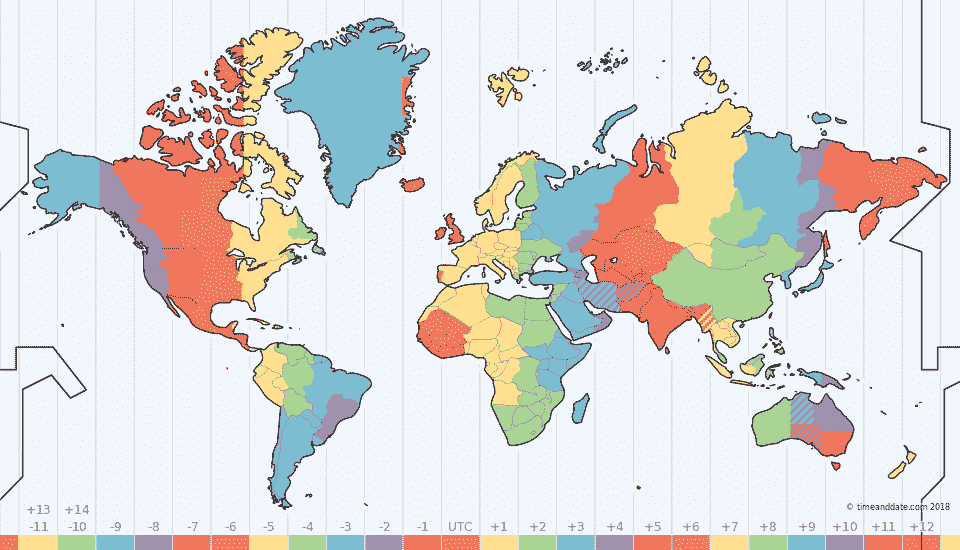
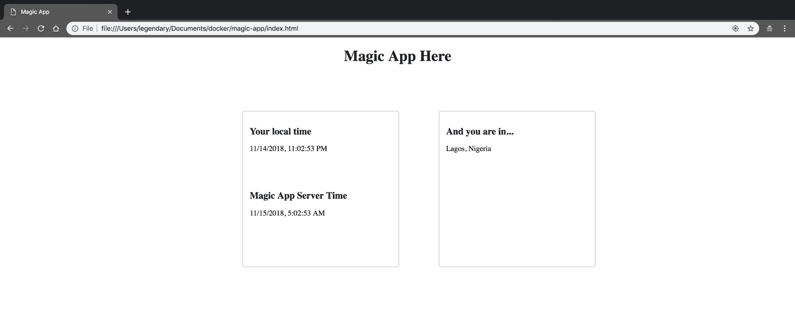

# 检测 JavaScript - LogRocket 博客中用户的位置和本地时区

> 原文：<https://blog.logrocket.com/detect-location-and-local-timezone-of-users-in-javascript-3d9523c011b9/>



如果您想在用户浏览您的网站时个性化用户体验，检测用户的位置会非常有用。想展示一个独特的定制推广？想根据用户的访问位置改变网站或设计的语言吗？

这些是检测用户位置的一些常见用例。它也可以是限制访问您的网站，以保持合规，或者如果你只是还没有迎合某些地方。我们将探索获取用户位置和时区的各种方法(尤其是如果你打算给他们发送大量电子邮件或生成大量报告的话)。

## 检测位置的选项

有两种非常流行的方法可以直接检测用户在浏览器中的位置:

1.  使用地理定位 API
2.  查找用户 IP 地址

### 地理定位 API

[地理定位 API](https://developer.mozilla.org/en-US/docs/Web/API/Geolocation_API) 允许你要求用户分享他们当前的位置。你可以说这是最可靠的定位方法，因为用户会自己告诉你。

然而，在您希望在呈现之前对显示给用户的内容进行格式化的场景中，这并不完全理想。此外，根据用户浏览器权限设置，地理定位 API 可能无法工作。

要使用地理定位 API，您可以执行以下操作:

```
// Excerpt from https://developer.mozilla.org/en-US/docs/Web/API/Geolocation_API
function geoFindMe() {
  if (!navigator.geolocation){
   console.log("Geolocation is not supported by your browser");
    return;
  }
  function success(position) {
    var latitude  = position.coords.latitude;
    var longitude = position.coords.longitude;
    reverseGeocodingWithGoogle(latitude, longitude)
  }
  function error() {
    console.log("Unable to retrieve your location");
  }
  navigator.geolocation.getCurrentPosition(success, error);
}
```

它首先检查浏览器是否具有/支持地理位置 API。如果是，它将执行剩余的代码，包括一个成功和错误回调函数。`navigator.geolocation.getCurrentPosition(success, error)`给你用户的精确坐标，你可以把它放入谷歌地图以获得精确的用户位置。

你可以向 [Google 的反向地理编码 API](https://developers.google.com/maps/documentation/geocoding/start?csw=1#ReverseGeocoding) 发送请求。它需要获得一个 API 密钥。

```
function reverseGeocodingWithGoogle(latitude, longitude) {
  fetch(`https://maps.googleapis.com/maps/api/geocode/json?
      latlng=${latitude},${longitude}&key={GOOGLE_MAP_KEY}`)
  .then( res => res.json())
  .then(response => {
      console.log("User's Location Info: ", response)
   })
   .catch(status => {
      console.log('Request failed.  Returned status of', status)
   })
}
```

> 使用这种方法的缺点是，如果用户不允许你获得他们的位置，你就无法准确地检测到他们的位置，或者你甚至可能根本检测不到。此外，它只能在安全服务器(https)上工作。它在 Internet Explorer 10 及更低版本和 OperaMini 上不受支持。

### 查找用户 IP 地址

这是迄今为止最常见的检测用户位置的方法。与地理定位 API 不同，它只能给你有限的信息，比如`Country`或者`City`，这取决于你使用的 IP 查找提供者。

下面是一个简单的查找:

```
fetch('https://extreme-ip-lookup.com/json/')
.then( res => res.json())
.then(response => {
    console.log("Country: ", response.country);
 })
 .catch((data, status) => {
    console.log('Request failed');
 })
```

这是通过从用户的浏览器向`[https://extreme-ip-lookup.com/json/](https://extreme-ip-lookup.com/json/)` URL 发出请求来实现的，这样就可以检测到他们的位置。该资源提供国家、城市、时区、经度和纬度等信息。

只需一个查询，您就可以知道用户在哪个国家，并获得他们的时区。多方便啊。

很多时候，IP 查找提供的信息可能就是您所需要的。在这种情况下，就不需要获得精确的坐标来确定用户所在城市的确切位置。

以下是执行 IP 查找时要查看的其他位置的列表:

> 要知道，IP 查找主要是为您提供有关发起请求的国家和时区的准确信息。该城市可能是 ISP 的所在地。如果您想要获得用户的确切城市或地区，您应该使用地理定位 API，并想办法说服用户与您共享他们的位置。

## 在 JavaScript 中获取用户的本地时区

人们很容易得出“这很容易”的结论。嗯，你可以很容易地创建一个日期对象，发送到你的服务器并存储时间。然而，它带来了很多挑战，因为你必须担心做内部计算，而不是让它们关闭。这就是为什么获取用户时区比其他任何事情都重要。

正如你在上面看到的，我们可以通过 IP 地址查找来检测时区。您所要做的就是从响应对象中挑选出时区和用户位置。下面，我们将探索检测时区的其他方法。

### Moment.js 时区函数

Moment.js 包含一个函数[，它猜测用户](https://momentjs.com/timezone/)的时区。如果你使用的是最新的版本，这是相当准确的。

下面是它如何工作的一个快速示例:

```
<div id="guess"></div>
<script src="https://cdnjs.cloudflare.com/ajax/libs/moment.js/2.22.2/moment.min.js"></script>
<script src="https://cdnjs.cloudflare.com/ajax/libs/moment-timezone/0.5.23/moment-timezone-with-data-2012-2022.min.js"></script>
<script>
  document.getElementById('guess').innerText = moment.tz.guess();
</script>
```

当你加载页面时，它会显示你当前的时区。创建一个`index.html`文件，并在浏览器中打开该文件。将上述代码复制到文件中并保存。然后刷新刚刚打开的浏览器选项卡。酷吧？

MomentTz 使用的 [Intl API](https://developer.mozilla.org/en-US/docs/Web/JavaScript/Reference/Global_Objects/Intl) 是内置的 JavaScript 国际化 API。它还有自己的数据库，用来检查 Intl API 的结果，以提供更准确的信息。它还需要你已经包含了 [Moment.js](https://momentjs.com/) 才能工作。

### Jstz 包

Jstz 是一个简单的用于检测时区的打火机包。与 Moment.js 相比，我说的是 lighter。它还利用了 Intl API，因此您可以对其结果充满信心。要使用该软件包，您可以按如下方式获取 CDN:

```
<div id="guess"></div>
<script src="https://cdnjs.cloudflare.com/ajax/libs/jstimezonedetect/1.0.6/jstz.min.js"></script>
<script>
  document.getElementById('guess').innerText = jstz.determine().name();
</script>
```

您可以从这些用于检测时区的库中注意到，它们不需要您端的任何网络调用。这意味着如果您打算只选择用户时区，您可能不需要进行 IP 查找。这很好，因为它们会变得很贵，因为你要为每个 API 调用付费。

### 国际化 API ( `Intl`)本身

不要恨我，但是让我们面对它——如果我给你看了这个，你可能会忽略这篇文章的其余部分 lol。

好了，下面是它的使用方法:

```
<div id="guess"></div>
<script>
  document.getElementById('guess').innerText = Intl.DateTimeFormat().resolvedOptions().timeZone;
</script>
```

在你说“哇！！!"了解上面突出显示的包在检测时区时会考虑很多因素。这使得它们比单独的 Intl API 更加精确。你可能永远不会注意到不同，但知道有人支持你感觉很好。

## 构建用于检测用户位置和时区的 JavaScript 应用程序

“空谈是廉价的。给我看看代码！”俗话说得好。让我们做得更好，构建一个真正简单的应用程序，检测用户的位置和时区信息，并告诉他们世界上其他三个时区的时间。

这个简单的应用程序如下所示:



下面是我们如何拼凑代码来实现这一点。将以下代码放在名为`index.html`的文件中:

```
<!-- index.html -->
<!doctype html>
<html class="no-js" lang="">
<head>
    <meta charset="utf-8">
    <meta http-equiv="x-ua-compatible" content="ie=edge">
    <title>Magic App</title>
    <meta name="description" content="Magic App">
    <meta name="viewport" content="width=device-width, initial-scale=1">
    <link rel="stylesheet" href="index.css">
</head> 
<body>
    <h1>Magic App Here</h1>
    <div id="main">
        <div id="time" class="sub">
            <div>
                <h2>Your local time</h2>
                <span class="local"></span>
            </div>
            <div>
                <h2>Magic App Server Time</h2>
                <span class="server"></span>
            </div>
        </div>
        <div id="location" class="sub">
            <h2>And you are in...</h2>
            <div class="address"></div>
        </div>
    </div>
    <!-- Script here -->
</body>
</html>
```

index.css 文件，并添加以下内容:

```
/*index.css*/
h1 {
  text-align: center
}
#main {
  max-width: 900px;
  display: table;
  margin-left: 30vw;
  margin-top: 10vh;
}

#main .sub {
  display: block;
  float: left;
  min-width: 300px;
  min-height: 300px;
  border: 0.5px solid #bbb;
  border-radius: 4px;
  padding: 15px;
}
#main .sub h2{
  font-size: 20px;
}
#main #time {
  margin-right: 5vw;
}

#main #time div {
  display: block;
  min-height: 120px;
}
```

这可能是你见过的最简单的应用。我们没有做任何花哨的东西，只是直奔主题。标准 HTML 和 CSS——仅此而已。

现在，让我们添加 JavaScript 来实现所有这些:将以下内容添加到`index.html`:

```
[...]
<script src="https://cdnjs.cloudflare.com/ajax/libs/jstimezonedetect/1.0.6/jstz.min.js"></script>
<script>
  document.addEventListener("DOMContentLoaded", function(event) {
      // The main sauce here
  });
</script>
[...]
```

我们已经为未来奠定了基础。我们要做的第一件事是检测用户的浏览器是否支持地理位置 API:

```
[...]
document.addEventListener("DOMContentLoaded", function(event) {
  if (!navigator.geolocation){
    console.log("Geolocation is not supported by your browser");
    ipLookup();
  } else {
    navigator.geolocation.getCurrentPosition(success, error);
  }
  // More sauce here
});
[...]
```

现在，如果地理定位 API 可用/可访问，我们就可以执行我们的代码了。如果不是，我们就退回到 IP 查找，就像我们上面看到的那样。

让我们创建`success`、`error`和`ipLookup`方法:

```
[...]
document.addEventListener("DOMContentLoaded", function(event) {
  [...]
  function success(position) {
    var latitude  = position.coords.latitude;
    var longitude = position.coords.longitude;
    reverseGeocodingWithGoogle(latitude, longitude)
  }
  function error() {
    console.log("Unable to retrieve your location");
  }
  function ipLookup() {
    fetch('https://extreme-ip-lookup.com/json/')
    .then( res => res.json())
    .then(response => {
        fallbackProcess(response)
    })
    .catch((data, status) => {
        console.log('We could not find your location');
    })
  }
    // More sauce here
});
[...]
```

我们已经在上面看到了它们是如何工作的，所以我将跳过对它们的解释。现在让我们添加`reverseGeocodingWithGoogle`方法:

```
[...]
document.addEventListener("DOMContentLoaded", function(event) {
  [...]
  function reverseGeocodingWithGoogle(latitude, longitude) {
    fetch(`https://maps.googleapis.com/maps/api/geocode/json?
      latlng=${latitude},${longitude}&key={GOOGLE_MAP_KEY}`)
    .then( res => res.json())
    .then(response => {
      processUserData(response)
    })
    .catch(status => {
      ipLookup()
    })
  }
  // Even more sauce here
});
[...]
```

你可能已经注意到我引入了两个新函数，`processUserData`和`fallbackProcess`。这些只是为了保持东西干净和可重复使用。现在让我们把他们两个加起来:

```
[...]
document.addEventListener("DOMContentLoaded", function(event) {
  [...]
  function processUserData(response) {
    var address = document.querySelector('.address')
    address.innerText = response.results[0].formatted_address
  }

  function fallbackProcess(response) {
    var address = document.querySelector('.address')
    address.innerText = `${response.city}, ${response.country}`
  }
  // timezone sauce here
});
[...]
```

您可以看到这些方法只是执行赋值，没有什么太复杂的。对于`address`变量，我通常应该在全局范围内定义它，但是我把它放到了函数中，这样你就不会错过它。请注意，这不是重用代码的最佳方式。

现在，让我们检测时区:

```
[...]
document.addEventListener("DOMContentLoaded", function(event) {
  [...]
  var localTime = jstz.determine().name();
  var serverTime = "Asia/Novosibirsk";
  document.querySelector('.server').innerText = new Date().toLocaleString("en-US", {timeZone: serverTime});
  document.querySelector('.local').innerText = new Date().toLocaleString("en-US", {timeZone: localTime});
});
[...]
```

这就完成了我们神奇的应用程序。你可以查看下面 Codepen 上的工作应用程序:

参见 [CodePen](https://codepen.io) 上 Chris nwa MBA([@ code beast](https://codepen.io/codebeast))
的 JavaScript 中的 Pen [检测时区和位置。](https://codepen.io/codebeast/pen/LXegVB)

结论

## 希望这篇文章对你有用。我希望它能帮助您改善用户体验，并用 JavaScript 构建更加国际化的应用程序。

最后一件有用的事情是使用 JavaScript 获得特定时区的日期时间字符串。别担心，我抓住你了。下面是您需要的简单代码行:

分享你使用这些工具的经验，让我们一起学习。

```
new Date().toLocaleString("en-US", {timeZone: "TIMEZONE_STRING_HERE"})
```

通过理解上下文，更容易地调试 JavaScript 错误

## 调试代码总是一项单调乏味的任务。但是你越了解自己的错误，就越容易改正。

LogRocket 让你以新的独特的方式理解这些错误。我们的前端监控解决方案跟踪用户与您的 JavaScript 前端的互动，让您能够准确找出导致错误的用户行为。

LogRocket 记录控制台日志、页面加载时间、堆栈跟踪、慢速网络请求/响应(带有标题+正文)、浏览器元数据和自定义日志。理解您的 JavaScript 代码的影响从来没有这么简单过！

[](https://lp.logrocket.com/blg/javascript-signup)

.

[Try it for free](https://lp.logrocket.com/blg/javascript-signup)

.