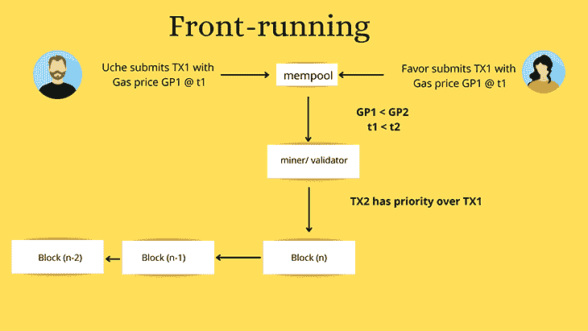

# 智能合同安全审计开发者指南

> 原文：<https://blog.logrocket.com/developers-guide-smart-contract-security-audits/>

智能合同审计使开发人员能够提供对智能合同集的全面分析。智能合同审计的主要目标是检测和消除漏洞。一个好的智能合同审计检查和评论项目的智能合同代码，并提交给项目的开发人员。

编写智能合同时要记住的一个关键方面是保持简单，因为增加的复杂性会增加出错的可能性。在智能合同系统在预定义的时间段内执行有限的一组功能的情况下，智能合同设计的简单性是有效的。鼓励使用预先编写的工具(例如，创建一个随机数生成器)，并且 [OpenZeppelin 的 Solidity 库](https://github.com/OpenZeppelin/openzeppelin-contracts)提供了支持安全代码可重用性的模式。

合同的安全审计必须从开发阶段开始，当发现新的攻击媒介时，增加新的、彻底的测试。在以太坊区块链上编程智能合约时，必须考虑一些陷阱，例如时间戳可能不精确，矿工会影响交易的执行时间。外部智能合约调用必须经过严格审查，因为恶意代码可能会被执行，控制流可能会被更改。

在本文中，我们将逐步介绍审计智能合同的指南。我们将讨论两个要点:审计智能合同和生成文档的必要步骤，以及以太坊区块链上的常见攻击媒介。

## 入门指南

首先，我们将审计批量上传 NFT 的智能合约。审计智能合同的一个关键组成部分是在部署到以太坊主网之前调查代码的各个方面以发现错误、漏洞和风险的过程。

智能合同审计不能 100%保证合同不会出现错误或漏洞。但是，它保证智能合同是安全的，并且已经过专家审查。

## 智能合同审计的结构

smart contract 审计报告应包含下面列出的各种项目，包括已识别漏洞的详细信息、免责声明和建议的补救措施。

*   **免责声明**:本节很重要，说明审计不是具有法律约束力的文件，也不提供任何保证
*   **审核概述**:简要查看合同及其创建过程中观察到的最佳实践
*   **对合同实施的攻击**:概述对合同实施的攻击，确保其安全性
*   **关键级漏洞**:概述在合同中发现的关键漏洞，例如允许攻击者窃取货币的漏洞
*   **中级漏洞**:可能破坏合同但有限制的漏洞
*   **低级漏洞**:不影响合同的问题
*   **逐行检查代码**:分析具有潜在改进的代码行

## 审计实例:NFT 加载

我们正在评估的代码可以在下面看到，也位于 GitHub gist 的[中。](https://gist.github.com/dueka/0943ad0567cbc35e57e2bb45887f8a16)

```
// SPDX-License-Identifier: GPL-3.0

/**
    !Disclaimer!
    These contracts have been used to create tutorials,
    and was created for the purpose to teach people
    how to create smart contracts on the blockchain.
    please review this code on your own before using any of
    the following code for production.
*/

pragma solidity >=0.7.0 <0.9.0;

import "@openzeppelin/contracts/token/ERC721/extensions/ERC721Enumerable.sol";
import "@openzeppelin/contracts/access/Ownable.sol";

/// @title Contract to deploy NFTs to the opensea blockchain
contract RetroNFT is ERC721Enumerable, Ownable {
  using Strings for uint256;

  /// URI to read metadata of images to be deployed
  string public baseURI;

  /// expected file extensuon to be contained in URI
  string public baseExtension = ".json";

  /// cost of individual NFTs in collection
  uint256 public cost = 0.033 ether;

  /// Maximum supply of NFTs to be deployed by contract
  uint256 public maxSupply = 10000;

  /// maximum amount to be minted
  uint256 public maxMintAmount = 300;

  bool public paused = false;

  /// allowed addresses
  mapping(address => bool) public whitelisted;

  constructor(
    string memory _name,
    string memory _symbol,
    string memory _initBaseURI
  ) ERC721(_name, _symbol) {
    setBaseURI(_initBaseURI);
    mint(msg.sender, 220);
  }

  // set URI which contains created images, likely a pinata CID. 
  function _baseURI() internal view virtual override returns (string memory) {
    return baseURI;
  }

  /// @dev Creates tokens of token type `id`, and assigns them to `to`
  /// `to` cannot be a zero address 
  function mint(address _to, uint256 _mintAmount) public payable {
    uint256 supply = totalSupply();
    require(!paused);
    require(_mintAmount > 0);
    require(_mintAmount <= maxMintAmount);
    require(supply + _mintAmount <= maxSupply);

    if (msg.sender != owner()) {
        if(whitelisted[msg.sender] != true) {
          require(msg.value >= cost * _mintAmount);
        }
    }

    for (uint256 i = 1; i <= _mintAmount; i++) {
      _safeMint(_to, supply + i);
    }
  }

  /// function which provides a basic access control mechanism
  /// where there is an account (an owner) that can be granted access to specific functions
  function walletOfOwner(address _owner)
    public
    view
    returns (uint256[] memory)
  {
    uint256 ownerTokenCount = balanceOf(_owner);
    uint256[] memory tokenIds = new uint256[](ownerTokenCount);
    for (uint256 i; i < ownerTokenCount; i++) {
      tokenIds[i] = tokenOfOwnerByIndex(_owner, i);
    }
    return tokenIds;
  }

  function tokenURI(uint256 tokenId)
    public
    view
    virtual
    override
    returns (string memory)
  {
    require(
      _exists(tokenId),
      "ERC721Metadata: URI query for nonexistent token"
    );

    string memory currentBaseURI = _baseURI();
    return bytes(currentBaseURI).length > 0
        ? string(abi.encodePacked(currentBaseURI, tokenId.toString(), baseExtension))
        : "";
  }

  //only owner
  function setCost(uint256 _newCost) public onlyOwner {
    cost = _newCost;
  }

  function setmaxMintAmount(uint256 _newmaxMintAmount) public onlyOwner {
    maxMintAmount = _newmaxMintAmount;
  }

  function setBaseURI(string memory _newBaseURI) public onlyOwner {
    baseURI = _newBaseURI;
  }

  function setBaseExtension(string memory _newBaseExtension) public onlyOwner {
    baseExtension = _newBaseExtension;
  }

  function pause(bool _state) public onlyOwner {
    paused = _state;
  }

 function whitelistUser(address _user) public onlyOwner {
    whitelisted[_user] = true;
  }

  function removeWhitelistUser(address _user) public onlyOwner {
    whitelisted[_user] = false;
  }

  function withdraw() public payable onlyOwner {
    /// implementing transfer instead of call.value
    (bool os, ) = payable(owner()).call{value: address(this).balance}("");
    require(os);
  }
}

```

### 放弃

[智能合约在以太坊区块链上部署和执行](https://blog.logrocket.com/examples-applications-smart-contracts/)。审计不能明确保证智能合约永远安全，因为以太坊平台上的变化可能会产生影响智能合约的新攻击媒介。本文档并非旨在作为本智能合同中包含的代码的安全性或实用性的担保，而是为讨论目的而设计的。

### 概观

这个项目只包含一个文件`NftUpload.sol`，由 114 行用 Solidity】编写的代码[组成。基于](https://blog.logrocket.com/ultimate-guide-data-types-in-solidity/) [natspec 文档](https://docs.soliditylang.org/en/v0.8.11/natspec-format.html)对相关功能和状态变量进行注释。

该智能合同的目的是使 NFT 令牌能够大规模部署到 Opensea 网络。

### 实施的攻击

#### 重入攻击

可重入攻击是对 Solidity smart 契约的破坏性攻击。可重入攻击强调了调用外部契约的危险，因为外部契约对原始函数进行递归调用，并更改调用函数所期望的数据。

该契约实现了`withdraw`函数中的`call.value`，可以递归调用该函数来提取契约上存储的以太。如果协定与不受信任的智能协定交互，这将造成中等程度的漏洞，可以通过在发送以太网之前更新发送方的`balance`来防止这种漏洞。

最佳实践是实现`transfer()`而不是`call.value()`。使用它没有可重入攻击的风险，因为传递函数只允许使用 23，000 gas，并且只能用于记录数据和失败时抛出的事件。

#### 短地址攻击

短地址攻击影响 [ERC-20](https://ethereum.org/en/developers/docs/standards/tokens/erc-20/) 令牌。在这种情况下，为令牌传输准备数据的服务假设用户将输入 20 字节长的地址，但实际上并不检查地址的长度。

在这种攻击中，用户生成一个带有尾随 0 的以太坊地址。以太坊地址是随机生成的，平均要尝试 256 次才能得到一个结尾为 0 的地址。

攻击的下一步是找到一个包含 256，000 个令牌的 exchange 钱包。攻击者通过移除钱包地址的最后一个零来购买 1000 个代币。然后，使用生成的地址创建提取 1，000 个代币的请求。

如果 buy 功能没有检查发送方地址的长度，以太坊的虚拟机会在交易中加零，直到地址完整。每购买 1000 个令牌，虚拟机将返回 256，000，这是以太坊虚拟机出现的一个错误。

被审计的合同不容易受到这种攻击，因为它不是 ERC-20 令牌。

### 漏洞审查和检查

本合同中未发现任何关键漏洞。在第 139 行，`call.value`应该被替换为`transfer()`函数，以防止重入攻击。此外，具体的逐行检查如下:

请参见下面的第 12 行。指定了一个版本编译指示，编译器通过它知道 Solidity 的版本:

```
pragma solidity >=0.7.0 <0.9.0;
```

接下来，我们将查看第 45 行。为了最大限度地利用资源，应取出环，并仅在部署完成后进行铸造:

```
>constructor(
    string memory _name,
    string memory _symbol,
    string memory _initBaseURI
  ) ERC721(_name, _symbol) {
    setBaseURI(_initBaseURI);
    mint(msg.sender, 220);
  }
```

在第 66 行，将错误消息添加到`require`语句中，以指出哪个 mint 恢复了:

```
 if (msg.sender != owner()) {
        if(whitelisted[msg.sender] != true) {
          require(msg.value >= cost * _mintAmount);
        }
    }
```

最后，在第 77 行，应该添加一个额外的映射，`(uint256 => boolean)` `isTokenFullyMinted`来执行伪铸造，以检查令牌是否已经被铸造:

```
function walletOfOwner(address _owner)
    public
    view
    returns (uint256[] memory)
  {
    uint256 ownerTokenCount = balanceOf(_owner);
    uint256[] memory tokenIds = new uint256[](ownerTokenCount);
    for (uint256 i; i < ownerTokenCount; i++) {
      tokenIds[i] = tokenOfOwnerByIndex(_owner, i);
    }
    return tokenIds;
  }
```

### 审计摘要

代码清晰，注释良好。部署和创建的机制非常简单，应该不会带来大的问题。

我最后的建议是更加关注函数的可见性，并考虑实现批量铸造的 ERC-721 扩展。

## 研究常见的攻击媒介

用乔治·桑塔亚纳的话说，“要了解你的未来，你必须了解你的过去。”我引用这句话是为了强调防止对智能合约的攻击的最佳方法之一是了解现有的攻击。 [SWC 注册表](https://swcregistry.io/)提供了一个分类集合，其中包含迄今已知攻击的列表。SWC 注册中心提供了 SWC 标识符(ID)、标题和代码相关样本列表。

有一些常见的攻击因素是智能合同审计员必须考虑的，比如访问控制问题、整数溢出和下溢以及重入漏洞(对于用 Solidity 编写的 DApps)。

分散金融领域的智能合约尤其容易受到抢先攻击。在前置运行攻击中，bot 会在事务被打包时抢占事务。在被攻击的交易被处理之前，bot 设置更高的燃气成本，以优惠的价格完成交易。由于区块链基于交易的性质，这种攻击是可能的。最流行的抢跑攻击形式被称为三明治攻击。



### 什么是三明治攻击？

三明治攻击是一种前端运行技术，也是运行[自动做市商机制](https://www.gemini.com/cryptopedia/amm-what-are-automated-market-makers)的分散式交易所的常见攻击媒介。在三明治攻击中，掠夺者在区块链 P2P 网络上找到一个未决交易，并试图通过在交易前下一个订单(前向运行)和在交易后下一个订单(反向运行)来包围该交易。这种攻击的目标是通过买卖来操纵资产的价格。

三明治攻击是可能的，因为所有区块链事务都可以在 mempool 中被公开观察到。一旦攻击机器人注意到受害者用资产 X 交换资产 Y 的未决交易，受害者就会抢先购买资产 Y。

一旦确定交易，bot 发起交易，设置较高的燃气费，在燃气竞争机制下成功提前于用户正常交易。机器人立即启动另一个卖出交易，在受害者的正常交易之后完成。

作为 DeFi 领域智能合约的开发人员，保护用户免受三明治攻击的一个潜在解决方案是通过加密信息来处理区块链的交易开放性，使机器人无法处理这些信息。

目前有人提议使用零知识证明技术 [zk-SNARKs](https://minaprotocol.com/blog/what-are-zk-snarks) 来实现加密。该策略还不够成熟，但正在社区中积极讨论。

## 结论

智能合同审计对 DApps 尤其必要。拥有智能合同的项目并不代表价值，但它非常重要。我鼓励开发人员继续学习和提高关于合同安全性和最佳实践的最新更新的知识。

## 加入像 Bitso 和 Coinsquare 这样的组织，他们使用 LogRocket 主动监控他们的 Web3 应用

影响用户在您的应用中激活和交易的能力的客户端问题会极大地影响您的底线。如果您对监控 UX 问题、自动显示 JavaScript 错误、跟踪缓慢的网络请求和组件加载时间感兴趣，

[try LogRocket](https://lp.logrocket.com/blg/web3-signup)

.

[](https://lp.logrocket.com/blg/web3-signup)[https://logrocket.com/signup/](https://lp.logrocket.com/blg/web3-signup)

LogRocket 就像是网络和移动应用的 DVR，记录你的网络应用或网站上发生的一切。您可以汇总和报告关键的前端性能指标，重放用户会话和应用程序状态，记录网络请求，并自动显示所有错误，而不是猜测问题发生的原因。

现代化您调试 web 和移动应用的方式— [开始免费监控](https://lp.logrocket.com/blg/web3-signup)。