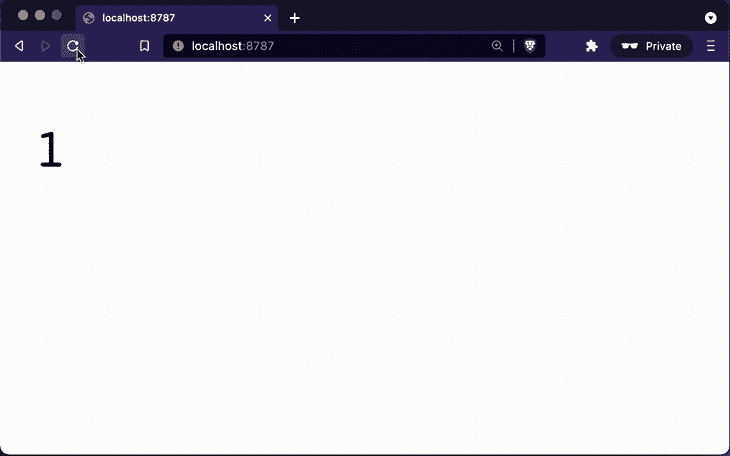

# 抛弃 Miniflare - LogRocket 博客的牧马人 CLI

> 原文：<https://blog.logrocket.com/ditch-wrangler-cli-miniflare/>

Cloudflare 工人的受欢迎程度一直在稳步上升，这是有充分理由的。它们目前是顶级功能即服务(FaaS)产品之一，利用 V8 隔离实现 0 毫秒冷启动，利用 Cloudflare 的边缘基础架构实现低延迟。总体而言，工人以合理的价格提供了卓越的性能和巨大的可扩展性。

## 有问题的开发经验

也就是说，可以说，员工唯一需要考虑的方面就是开发经验。尽管 Cloudflare 提供了高质量的开发资源，如 Wrangler CLI、Workers Dashboard 和[详细文档](https://developers.cloudflare.com/workers/)，但针对员工的独特环境进行开发仍然很困难。由于 V8 隔离介于 Node.js 和标准浏览器之间，它们需要定制的解决方案和 API 来支持存储或 WebSocket 访问。

通常，您会使用 Wrangler CLI，更具体地说，是使用`wrangler dev`命令来连接 Cloudflare 的服务器，并为 Workers 平台进行远程开发。这不仅需要良好的互联网连接，还会将您的功能集限制在您当前的 Cloudflare 计划所允许的范围内。更不用说污染生产环境(例如，使用键值(KV)存储)或者自动化测试和 CI/CD 集成的选项有限。这是一种次优的开发体验。

谢天谢地，有了名为 Miniflare 的新工具，所有这些问题都迎刃而解。

## 什么是迷你照明弹？

[Miniflare](https://miniflare.dev/) 是一个开源的 Cloudflare Workers 模拟器，用 [TypeScript 和 Node.js](https://blog.logrocket.com/design-patterns-in-typescript-and-node-js/) 实现，可以在本地运行，不需要互联网连接。

现在，Miniflare 只是最近才成为 Cloudflare Workers 生态系统的正式组成部分。正因为如此，它还没有像牧马人 CLI 那样普及或集成到生态系统中。然而，它已经功能齐全，并有[详细的文档](https://miniflare.dev/)。

Miniflare 模拟整个工作环境，包括运行时、KV 存储和支持的 Web 标准。它还实现了较新的 Workers 特性，比如持久对象，甚至像 WebSocket connection 这样的早期访问对象。让我们看看它如何让工人发展得更快更容易！

## 入门指南

要开始使用 Miniflare，您只需要 Node.js 和 npm:

```
mkdir worker
cd worker
npm init -y
npm install -D esbuild miniflare @cloudflare/workers-types

```

此外，如果您打算使用模块或类似 TypeScript 的东西，请使用您选择的 bundler。对于这个例子，我们将使用[es build](https://blog.logrocket.com/getting-started-esbuild/)——一个速度极快的 JS/TS 捆绑器——和 [@cloudflare/workers-types 包](https://www.npmjs.com/package/@cloudflare/workers-types)来获得最佳的 TypeScript 开发体验。

转到配置文件，首先通过添加`main`字段和一些脚本来设置您的`package.json`文件。

```
{
  "main": "./dist/index.js",
  "scripts": {
    "build": "esbuild --bundle --sourcemap --outdir=dist ./src/index.ts",
    "dev": "miniflare --watch --debug"
  }
}

```

接下来，移到`wrangler.toml`。

```
name = "esbuild-worker"
type = "javascript"
account_id = ""
workers_dev = true
route = ""
zone_id = ""
kv_namespaces = [
  { binding = "COUNTER_NAMESPACE", id = "", preview_id = "" },
]

[build]
command = "npm run build"
[build.upload]
format = "service-worker"

```

如果你以前用过牧马人 CLI，你会有宾至如归的感觉。Miniflare 接受并尊重[牧马人 CLI 的配置密钥](https://developers.cloudflare.com/workers/cli-wrangler/configuration)，并为 [Miniflare 专用的](https://miniflare.dev/cli.html#wrangler-configuration)选项增加了一个`\[miniflare\]`部分。

最后，为了让 TypeScript 正常工作，创建一个引用 Cloudflare Workers 类型的`tsconfig.json`文件。

```
{
  "compilerOptions": {
    "target": "ES2020",
    "module": "CommonJS",
    "lib": ["ES2020"],
    "types": ["@cloudflare/workers-types"]
  }
}

```

## 创建 Cloudflare 工作线程

设置好 Miniflare 后，您现在就可以开始为您的新员工工作了，就像这样！创建一个`src/index.ts`文件作为入口点，并使用`addEventListener()`函数监听传入的请求。

```
addEventListener("fetch", (event) => {
  event.respondWith(new Response("test"));
});

```

工作流程和代码与使用 Wrangler CLI 时相同。

要测试您的 Worker，请使用`npm run dev`命令启动 Miniflare 的开发环境。打开 CLI 提供的本地 URL(默认为 [`port 8787`](http://localhost:8787) ，您应该会看到 Worker 的输出。

Miniflare 可以在每次文件更改后自动重建工作进程，并显示有用的调试信息。为此，您应该分别使用`\--watch`和`\--debug`标志。

## 使用 Cloudflare Workers 功能

如我所说，Miniflare 模拟了整个工作环境，包括它的所有专用功能，如 KV。让我们看看它在实践中是如何工作的。

首先，创建一个单独的`src/bindings.d.ts`文件。您可以使用它来声明特定于您的工作者的全局变量，如 KV 名称空间或 env 变量。在本例中，这是一个 KV 名称空间。

```
export {};

declare global {
  const COUNTER_NAMESPACE: KVNamespace;
}

```

接下来，在您的主文件中，创建一个处理请求并与 KV 存储交互的函数。

```
const handleRequest = async (request: Request) => {
  const url = new URL(request.url);
  const currentValue = await COUNTER_NAMESPACE.get(url.pathname);
  const newValue = (parseInt(currentValue || "0") + 1).toString();

  await COUNTER_NAMESPACE.put(url.pathname, newValue);

  return new Response(newValue);
};

addEventListener("fetch", (event) => {
  event.respondWith(handleRequest(event.request));
});

```

现在，您应该看到计数器在每次页面刷新时都会增加，这意味着 KV 存储正常工作。



## 使用 Miniflare API

因此，凭借本地开发、详细的调试信息、快速重新加载以及对所有 Workers 功能的访问，Miniflare 已经大获全胜。也就是说，可能它最大的优势——是的，一个我们还没有谈到的优势——是它的 API。

使用 [Miniflare API](https://miniflare.dev/api.html) ，您可以自动化构建、运行和测试您的工作人员的整个过程。您还可以在 Worker 外部控制 KV 存储或耐用对象，从而为 Worker 测试带来全新的可能性。

要使用 Miniflare API，请在根目录下创建一个新的`start.js`文件。在该文件中，`require()` Miniflare 使用其 API 向 Worker 发出请求并访问 KV 存储。

```
const { Miniflare } = require("miniflare");
const mf = new Miniflare();
const makeRequest = async () => {
  const res = await mf.dispatchFetch("http://localhost:8787/");

  return res.text();
};
const testNamespace = async () => {
  const counterNamespace = await mf.getKVNamespace("COUNTER_NAMESPACE");
  const count = await counterNamespace.get("/");

  console.log("KV:", count);

  return count;
};
const testRequests = async (times) => {
  for (let i = 0; i < times; i++) {
    console.log("Response:", await makeRequest());
  }
};
const test = async () => {
  await testRequests(3);
  await testNamespace();
};

test();

```

一个专用的`Miniflare`实例处理构建和加载 Worker，同时提供对必要 API 的访问。

* * *

### 更多来自 LogRocket 的精彩文章:

* * *

上述函数作为一个例子，说明了如何在真实的场景中测试您的员工。`testNamespace()`从 KV 存储器的`COUNTER\_NAMESPACE`中检索一个特定的值，而`testRequests()`函数向 Worker 发送三个请求，使其写入 KV，并记录结果。

运行上面的代码片段应该会输出以下结果:

```
Response 1
Response 2
Response 3
KV: 3

```

## 结论

如您所见，Miniflare 是一款非常强大的模拟器和开发工具。由于它巨大的特性和优势，我可以推荐它用于所有的工作者开发和测试目的。它大大加快和简化了整个过程，同时允许更多的测试可能性。

也就是说，Wrangler CLI 不会消失，它仍然是在生产环境中部署和验证员工的最佳工具。在具有实际生产级环境的实际 Cloudflare 服务器上测试您的员工是 Miniflare 无法做到的。

总而言之，看起来 Cloudflare 工作人员有一个光明的未来，我迫不及待地想看看接下来会发生什么！

## 使用 [LogRocket](https://lp.logrocket.com/blg/signup) 消除传统错误报告的干扰

[](https://lp.logrocket.com/blg/signup)

[LogRocket](https://lp.logrocket.com/blg/signup) 是一个数字体验分析解决方案，它可以保护您免受数百个假阳性错误警报的影响，只针对几个真正重要的项目。LogRocket 会告诉您应用程序中实际影响用户的最具影响力的 bug 和 UX 问题。

然后，使用具有深层技术遥测的会话重放来确切地查看用户看到了什么以及是什么导致了问题，就像你在他们身后看一样。

LogRocket 自动聚合客户端错误、JS 异常、前端性能指标和用户交互。然后 LogRocket 使用机器学习来告诉你哪些问题正在影响大多数用户，并提供你需要修复它的上下文。

关注重要的 bug—[今天就试试 LogRocket】。](https://lp.logrocket.com/blg/signup-issue-free)