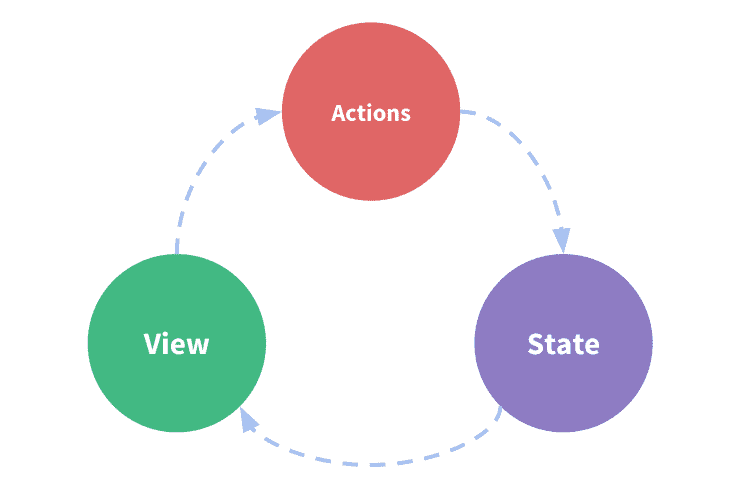
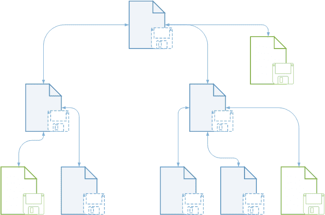
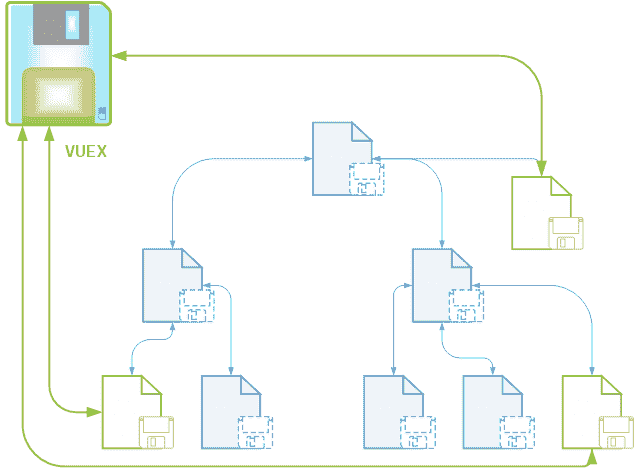
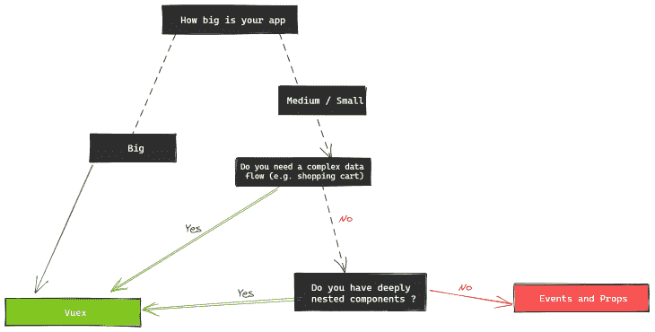
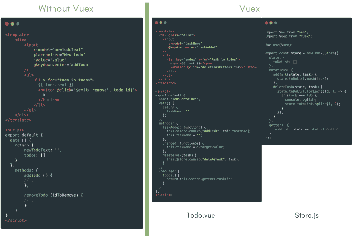

# 真的需要 Vuex 吗？

> 原文：<https://blog.logrocket.com/do-you-really-need-vuex/>

Vue 已经成为主流的 JavaScript 框架。这是由于多种原因，从其流畅的开发者体验到其广泛的生态系统。Vue 的核心生态系统和工具尤其令人钦佩，这也是它有资格被称为成熟框架的原因。

Vue 被设计成多功能的，然而，这种多功能性经常被新手和某些经验丰富的开发人员误解，他们倾向于包括许多工具，因为他们认为他们可能“以后需要它们”。事实上，这些工具并不总是需要的。因此，在添加一个工具之前，了解它如何能让我们受益是非常重要的，否则它可能会变成一个缺点而不是有帮助的东西。

我们现在来看看 Vue.js: Vuex 中的核心 flux 库。

Vuex 是 Vue.js 中的状态管理系统。它是一个遵循严格规则的集中存储，以便帮助管理 Vue 应用程序中所有组件的状态。

听起来非常重要。对吗？实际上，它是一个强大的工具，根据使用情况，可能有帮助，也可能没有帮助。

## 你为什么需要 Vuex？

Vuex 是一个状态管理系统。因此，要理解 Vuex 做什么，您首先应该很好地理解 SPA 中的状态概念，以及它如何与其他元素交互。



基本上，状态就是组件所依赖的数据。例如，待办事项列表上的待办事项，或者博客上的帖子。这个数据称为状态，每个 Vue 组件都允许有一个状态。

随着应用程序的增长，组件可能会显著增加。如果您不使用像 Vuex 这样的状态管理库，这些组件中的每一个都将通过利用专门设计的 Vue.js APIs 来管理它们自己的状态。



请记住，Vue 保持了如上图所示的树状组件架构，并且还通过`props`实现了父子通信，通过`events`实现了父子通信。您可以想象，如果两个相距遥远的兄弟组件需要对相同的数据更改做出反应，会有多困难——我们需要将数据从子组件传递到父组件，直到到达最近的祖先，然后从该祖先传递到特定的子组件(参见上图中突出显示的组件)。

这非常费力且容易出错。

这正是 Vuex 的用武之地。Vuex 负责提取整个模块的状态，并将其保存在一个集中的存储中，它遵循 Vuex 的状态管理模式，并相应地与您的组件进行通信。

这就是为什么它经常被称为“真理的唯一来源”。尽管 Vuex 的别名是这样的，但这并不能改变组件仍然可以有自己的状态这一事实。您可以决定与其他组件共享这些状态。



既然你已经理解了为什么我们需要一个像 Vuex 这样的状态管理系统，我们可以继续做这个大胆的假设:只有两个主要因素决定你是否应该使用 Vue 来管理状态。

## 应用程序大小

人们经常说“随着应用的增长，你将需要 Vuex”。其实要看它生长的方式。你的应用可能会增长，但你的数据流仍然是核心的(即亲子关系和兄弟姐妹关系)。

最终，您可以使用 to props 和 events 来共享这些数据，而不必添加 Vuex 和附带的样板文件。

另一方面，一旦你注意到你的组件需要一个抽象的数据源，明智的做法是停止使用道具和事件，转而求助于 Vuex。这为您节省了大量时间，因为您越晚切换到 Vuex，就越需要重构。

## 逻辑和数据复杂性

有时我们需要将某个复杂逻辑的实现从我们的组件中分离出来，特别是当这个逻辑与我们系统中的其他组件相关时。这个用例的一个很好的例子是身份验证。

Vuex 是在 Vue 中处理复杂应用认证的一种流行方式。借助 Vuex，您可以在整个应用中处理令牌的可用性和访问控制以及路由块。突变、getters 和 setters 帮助完成这项任务。

该模式允许您将身份验证逻辑与应用程序逻辑完全分离，同时保持身份验证流程的可跟踪性和数据的可访问性。

Vuex 还简化了对整个应用程序的单元测试，如果你的应用程序越来越复杂，使你的状态难以管理，这可能是有帮助的。然而，你完全可以在不使用 Vuex 的情况下完成测试。

## 我什么时候需要 Vuex？

丹·阿布拉莫夫引用了一句有趣的话:

> 通量库就像眼镜:你会知道什么时候需要它们。

这是一个非常真实的说法。然而，有人说，你需要一个通量库的时候可能会发现得太晚了。不幸的是，这将迫使您向一个已经很复杂的应用程序引入一个复杂的流程。

基于我上面提到的两个主要因素(应用程序大小和数据复杂性)，我创建了这个小流程图，以帮助开发人员从项目规划阶段就决定他们是否需要 Vuex 来增强他们的应用程序:



Vuex 文档中还有一节简要解释了何时应该使用 Vuex。

## 你为什么要离开 Vuex？

当您使用 Vue-CLI 创建新的 Vue.js 应用程序时，它不会询问您是否需要状态管理系统。只是不包括而已。虽然 Vue.js 非常通用，但它的目标是非常平易近人，并试图让你的新项目尽可能简单。

人们避免使用 Vuex 的一个主要原因是 Vuex 过于冗长。它需要——它必须遵循一种模式，以确保你的状态的改变是有意发生的。下面是一个使用 Vuex 的基本 todo 组件，与另一个不使用 Vuex 的组件进行了比较:



上面的代码显示了在一个非常简单的应用程序中使用 Vuex 来管理您的状态时，您的代码会变得多么麻烦。在这种情况下，最好跳过 Vuex，求助于道具和事件或其他简单的状态管理模式。

## 如何跳过 Vuex

在开发中小型应用程序时，如果你不想纠缠于 Vuex 的冗长，你可以探索一些选项。其中一些方法要求您从头开始编写简单的状态管理，其他方法要求使用第三方库。你可以根据你想要构建代码的方式来选择最适合你的方式。

### 其他助焊剂库

除了 Vuex 之外，使用另一个通量库也不失为一个好主意。虽然它们可能服务于相同的目的，但它们在用法上经常不同。与 Vuex 相比，有些可能提供较少的样板文件，这可能适合您的使用案例。

> 直观、类型安全且灵活的 Vue Pinia 商店适用于 Vue 2 和 Vue 3。Pinia 是菠萝一词在西班牙语中最相似的英语发音:pia。菠萝实际上是一组独立的花，它们结合在一起形成一个多重的果实。

> 一个受 Redux & Vuex 启发的微型库，帮助你管理你的 JavaScript 应用程序的状态——GitHub——Andy-set-studio/beedle:一个受 Redux & Vuex 启发的微型库，帮助你管理你的 JavaScript 应用程序的状态

> 受 Vuex 启发的 VueJS 的 Redux 绑定。Redux 和 vuex 真的很难比。Vuex 是一种状态管理模式，它清楚地定义了状态生命周期的每个主体。对于大多数项目来说，这有助于构建您的应用程序，但也留下了大量的架构足迹。

> Vue 3 强大而简单的全局状态管理。前往 harlemjs.com 开始吧，或者看一下演示，看看它的实际效果。Harlem 有一个简单的函数式 API 来创建、读取和改变状态。从最基本的全球国家管理需求到最复杂的需求，哈莱姆区都能满足。

> NPM 地位:📦Vue 3.0 的快速、简单和轻量级状态管理，采用复合 API 构建，灵感来自 Vuex。运行示例:从 NPM 安装这个包:＄NPM install @ mediv 0/v-bucket 或 yarn:＄yarn add @ mediv 0/v-bucket 首先需要创建您的 bucket。

从头开始通量

### 我建议任何人选择 Vuex，而不是遵循这种方法，因为实际上你最终只会重新创建 Vuex。然而，如果您需要一个“定制”的真实来源，您也可以使用`Vue.reactive`方法自己实现一个。

请记住，为了让它成为可靠的真理来源，变化应该只发生在突变的基础上，否则你会发现自己有无法追踪的错误。


在它的文档中，Vue 提供了一个[小指南](https://v3.vuejs.org/guide/state-management.html#simple-state-management-from-scratch)来帮助开发者创建他们自己的集中式状态管理系统。

事件总线

### Vue 还支持您通过全局事件总线在整个应用中传递数据。你可以阅读这篇文章来获得如何做到这一点的详细教程:[https://blog . log rocket . com/using-event-bus-in-vue-js-to-pass-data-between-components/](https://blog.logrocket.com/using-event-bus-in-vue-js-to-pass-data-between-components/)。

如果你正在使用 Vue 3，使用第三方库作为你的活动中心是个好主意，比如[微型发射器](https://github.com/scottcorgan/tiny-emitter)或[米特](https://github.com/developit/mitt)，正如[文档](https://v3.vuejs.org/guide/migration/events-api.html#migration-strategy)中所建议的。

组合 API

### Vue 的 composition API 的动机是在 Vue 应用中实现更好的逻辑重用和代码组织。composition API 在 Vue 中引入了模块化模式，使您能够灵活地组合组件的逻辑。

正如 Andrej Galuf 所解释的，有了这个优雅的模式，就有可能将组合 API 用作存储。您可以编写一个函数，稍后用作您的共享存储。与 Vuex 可能带来的相比，这将大大减少较小应用程序上的样板文件。

插件

```
// @/services/counter.js
import { ref, computed } from '@vue/composition-api'
const count = ref(0)
export const getCount = computed(() => count.value)
export const increment = () => count.value += 1
```

```
// @/components/ComponentA.vue
<template>
    <div id="component-a">
        <button @click="increment()">Increment Counter</button>
    </div>
</template>

<script>
import { createComponent } from '@vue/composition-api'
import { increment } from '@/services/click-counter'

export default createComponent({
    setup() {
        return {
            increment
        }
    }
})
</script>

```

```
// @/components/ComponentB.vue
<template>
    <div id="component-b">
        Clicks: {{ getCount }}
    </div>
</template>

<script lang="ts">
import { createComponent } from '@vue/composition-api'
import { getCount } from '@/services/click-counter'

export default createComponent({
    setup() {
        return {
            getCount
        }
    }
})
</script>

```

### Vuex 也有插件可以帮助简化样板文件。例如，我们有 Vuex-pathify 插件，它可以帮助您在不使用 getters 属性的情况下访问状态中的深层属性——您可以使用路径来这样做。比如可以用`[[email protected]](/cdn-cgi/l/email-protection)`。Vuex pathify 还使您能够用单一路径设置突变。

Pathify 通过声明性的、基于状态的路径语法使使用 Vuex 变得简单:路径可以引用任何模块、属性或子属性:Pathify 的目标是通过抽象出 Vuex 的复杂设置和对手动编写代码的依赖来简化整体 Vuex 开发体验。

> 结论

毫无疑问，Vuex 是一个很棒的工具。然而，权力越大，责任越大。其中一项职责是了解它的功能，并决定是否以拥有更复杂的代码库为代价来利用它。

## 大多数简单的应用程序都很适合 Vue 的事件和道具数据通信模式。如果我们加入 Vuex，这些应用将变得更加复杂。此外，Vue.js 提供了很棒的工具，如 composition API 和 top tier reactivity，它们可以以比 Vuex 更好、更简单的方式完成这项工作。

下一次你在做你的超棒的 Vue 项目时，确保你在添加它之前确实需要 Vuex。

像用户一样体验您的 Vue 应用

调试 Vue.js 应用程序可能会很困难，尤其是当用户会话期间有几十个(如果不是几百个)突变时。如果您对监视和跟踪生产中所有用户的 Vue 突变感兴趣，

## .

LogRocket 就像是网络和移动应用程序的 DVR，记录你的 Vue 应用程序中发生的一切，包括网络请求、JavaScript 错误、性能问题等等。您可以汇总并报告问题发生时应用程序的状态，而不是猜测问题发生的原因。

[try LogRocket](https://lp.logrocket.com/blg/vue-signup)

LogRocket Vuex 插件将 Vuex 突变记录到 LogRocket 控制台，为您提供导致错误的环境，以及出现问题时应用程序的状态。

[](https://lp.logrocket.com/blg/vue-signup)[https://logrocket.com/signup/](https://lp.logrocket.com/blg/vue-signup)

现代化您调试 Vue 应用的方式- [开始免费监控](https://lp.logrocket.com/blg/vue-signup)。

The LogRocket Vuex plugin logs Vuex mutations to the LogRocket console, giving you context around what led to an error, and what state the application was in when an issue occurred.

Modernize how you debug your Vue apps - [Start monitoring for free](https://lp.logrocket.com/blg/vue-signup).