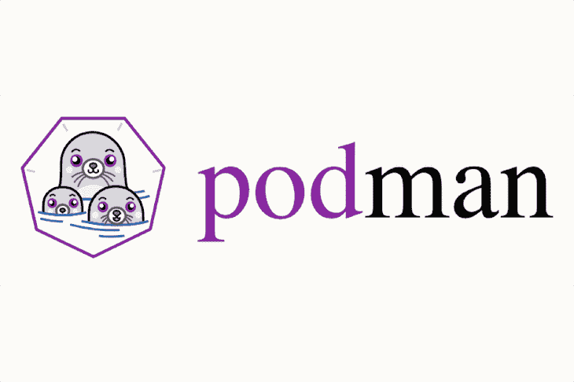
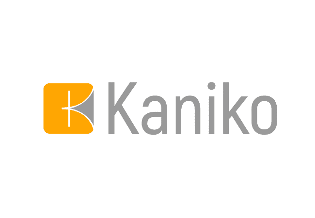
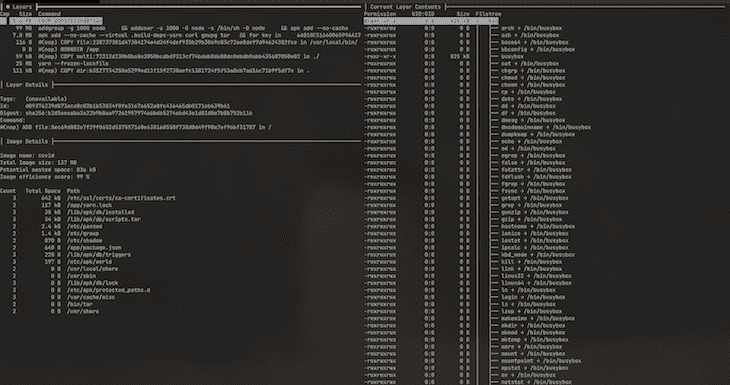
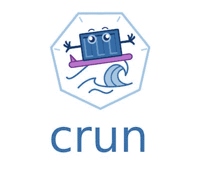
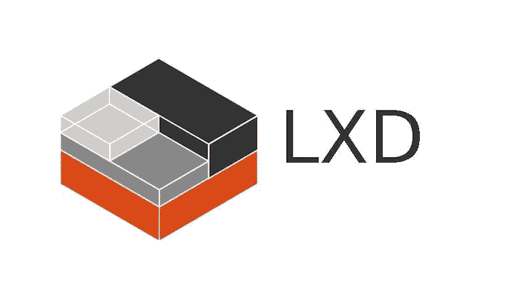
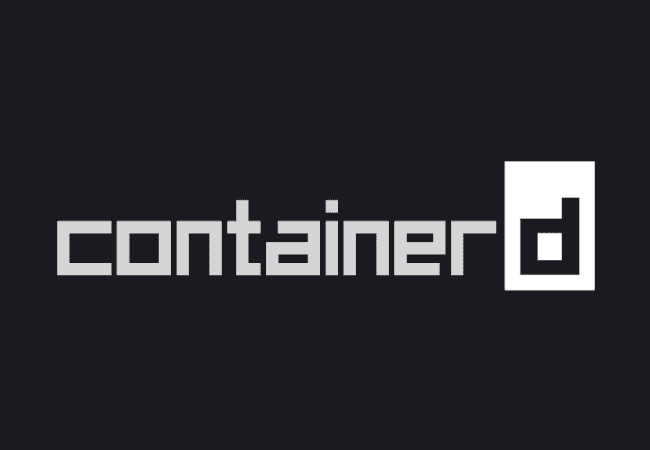
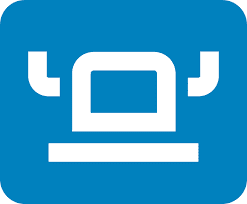
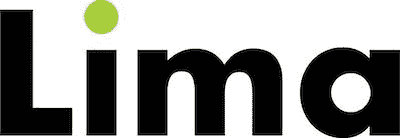

# 顶级 Docker 和 Docker 桌面替代品- LogRocket 博客

> 原文：<https://blog.logrocket.com/docker-desktop-alternatives/>

***编者按**:这篇 Docker 和 Docker Desktop alternatives 的文章最后一次更新是在 2022 年 10 月 28 日，以包括更多几个工具的信息。*

作为使用最广泛的容器平台之一， [Docker，一个单体工具](https://blog.logrocket.com/dockerizing-a-django-app/)，处理容器化过程的每个方面，从构建、运行和检查容器图像。

Docker 桌面是一个功能齐全的软件，允许 Mac 和 Windows 建立一个运行 Docker 引擎的 Linux 虚拟机。它允许你创建和共享容器化的应用程序和微服务。2021 年 8 月，Docker Desktop 宣布了对其许可的[变更，这意味着它将不再对员工超过 250 人或收入超过 1000 万美元的公司免费。然而，有几种容器化的替代方法，通常是独立工具的形式，有时比 Docker 提供的结果更好。](https://www.docker.com/blog/updating-product-subscriptions/)

Docker 容器在虚拟机中运行，这是 Docker 和 Docker 桌面的一个显著区别。其他一切都是结果。您不需要使用 Docker Desktop 设置虚拟机或客户端-服务器连接。Docker 桌面允许你在 Windows 或 MacOS 上运行 Linux 容器。

在本文中，我们将介绍一些 Docker 替代产品，以及作为 Docker 生态系统各个方面的替代产品的 Docker 桌面替代产品。本教程中涉及的每个工具都遵循[开放容器倡议(OCI)](https://opencontainers.org/) 规范，其中包括容器运行时、容器分发和容器映像的规范。我们开始吧！

向前跳:

## 坞站备选方案

## 1.波曼！波曼



由 RedHat 开发的容器引擎 Podman ，是构建、运行和存储容器映像的最著名的 Docker 替代工具之一。就像 Docker 一样，Podman 保持与 OCI 容器映像规范的兼容性，这意味着 Podman 可以运行 Docker 生成的容器映像，反之亦然。

Podman 的命令行界面与 Docker 的完全相同，包括参数。您可以简单地将`docker`命令别名为`podman`，而不会注意到其中的区别，这使得现有 Docker 用户很容易过渡到 Podman:

```
# .bashrc
alias docker=podman

```

与 Docker 使用`dockerd`守护进程来管理其控制下的所有容器不同，Podman 是无守护进程的。因此，没有与一些长期存在的进程的持久连接，消除了 Docker 中的单点故障问题，即守护进程中的突然崩溃可能会杀死正在运行的容器或导致它们成为孤儿。

Podman 与映像注册表、存储和 Linux 内核交互，其容器独立于任何中央进程。相反，容器作为 Podman 进程的子进程启动，大量使用用户名称空间和网络名称空间。

Podman 还通过默认使用无根容器来区别于 Docker。Root 访问对于启动和操作容器不是必需的，但它有助于减少容器运行时中可能导致权限提升的潜在漏洞。

请注意，Docker 现在支持一种[无根模式](https://docs.docker.com/engine/security/rootless/)，这是 Docker 引擎 v19.03 中的一个实验性功能，在 v20.10 中稳定下来之前。然而，它的使用尚未在生态系统中广泛使用。

Docker 中还没有的 Qodman 的附加功能是创建和运行 pod 的能力。pod 是一个或多个容器的集合，这些容器利用共享的资源池并紧密协作以实现特定的功能。Pods 也是 Kubernetes 中最小的执行单元，如果需要的话，可以更容易地过渡到 Kubernetes。

## 2.Buildah


[Buildah](https://buildah.io/) 是一个 Docker 的替代建筑形象。同样由 RedHat 开发，Buildah 经常与 Podman 一起使用。事实上，Podman 使用 Buildah 功能的子集来实现它的`build`子命令。

如果您需要对图像进行细粒度控制，请使用完整的 Buildah CLI 工具。在撰写本文时，Buildah 可以在几个 Linux 发行版上运行，但在 Windows 或 macOS 上不受支持。

Buildah 生成的图像完全符合 OCI 规范，其操作方式与用 Docker 构建的图像相同。Buildah 还可以使用现有的`Dockerfile`或`Containerfile`创建映像，这使得迁移变得更加容易。Buildah 还允许您使用避开 docker 文件限制的 Bash 脚本，从而更容易地实现过程自动化。

像 Podman 一样，Buildah 遵循一种 fork-exec 模型，不需要中央守护进程或 root 访问来运行。

与 Docker 相比，使用 Buildah 的一个优势是它能够将许多更改提交到一个层，这是容器用户长期以来一直要求的功能。Buildah 还提供了创建只存储元数据的空容器映像的能力，这使得只添加映像中需要的包变得很容易。反过来，最终输出小于其 Docker 等价物。

另一个区别是 Buildah 图像是特定于用户的，所以只有用户构建的图像对他们是可见的。

## 3.构建工具包


[BuildKit](https://github.com/moby/buildkit) 是 Docker 新的图像构建引擎，作为[莫比项目](https://mobyproject.org/)的一部分开发。从 Docker ≥v18.09 开始，BuildKit 已经[集成到](https://docs.docker.com/develop/develop-images/build_enhancements/) [`docker build`](https://docs.docker.com/develop/develop-images/build_enhancements/) 中，但它也作为一个独立的工具出现。

BuildKit 的标题功能之一包括通过并行处理互不依赖的图像层来提高性能。另一个特性是更好的缓存，这减少了重建图像每一层的需要。最后，BuildKit 通过更具可插拔性的架构提供了可扩展性。BuildKit 还引入了无根构建和跳过未使用阶段的能力。

在撰写本文时，BuildKit 可以选择加入。要在构建映像之前启用 Buildkit，必须在 shell 中使用`DOCKER_BUILDKIT`环境变量:

```
$ DOCKER_BUILDKIT=1 docker build .

```

还可以配置 Docker 默认使用 BuildKit。只需编辑或创建`/etc/docker/daemon.json`文件:

```
{
  "features": {
    "buildkit": true
  }
}

```

保存文件后，重新加载守护程序以应用更改:

```
$ systemctl reload docker

```

很容易判断 BuildKit 何时被使用，因为它的输出与默认引擎不同:

```
$ DOCKER_BUILDKIT=1 docker build . [+] Building 30.8s (7/7) FINISHED => [internal] load build definition from Dockerfile 0.1s => => transferring dockerfile: 142B 0.1s => [internal] load .dockerignore 0.0s => => transferring context: 2B 0.0s => [internal] load metadata for docker.io/library/centos:latest 0.6s => [auth] library/centos:pull token for registry-1.docker.io 0.0s => [1/2] FROM docker.io/library/centos:[email protected]:a27fd8080b517143cbbbab9dfb7c8571c40d67d534bbdee55bd6 14.3s => => resolve docker.io/library/centos:[email protected]:a27fd8080b517143cbbbab9dfb7c8571c40d67d534bbdee55bd6c 0.0s => => sha256:a27fd8080b517143cbbbab9dfb7c8571c40d67d534bbdee55bd6c473f432b177 762B / 762B 0.0s => => sha256:a1801b843b1bfaf77c501e7a6d3f709401a1e0c83863037fa3aab063a7fdb9dc 529B / 529B 0.0s => => sha256:5d0da3dc976460b72c77d94c8a1ad043720b0416bfc16c52c45d4847e53fadb6 2.14kB / 2.14kB 0.0s => => sha256:a1d0c75327776413fa0db9ed3adcdbadedc95a662eb1d360dad82bb913f8a1d1 83.52MB / 83.52MB 2.0s => => extracting sha256:a1d0c75327776413fa0db9ed3adcdbadedc95a662eb1d360dad82bb913f8a1d1 10.8s => [2/2] RUN yum -y install httpd 14.7s => exporting to image 1.0s => => exporting layers 1.0s => => writing image sha256:c18170a407ca85218ee83526075a3f2a2e74f27d7bd5908ad68ba2328b4f4783 0.0s

```

## 4\. Kaniko



由 Google 开发的, [Kaniko](https://github.com/GoogleContainerTools/kaniko) 用于开发容器或 Kubernetes 集群内部的容器图像。像 Buildah 一样，Kaniko 不需要守护进程，它可以从 Docker 文件构建映像，而不依赖于 Docker。

Docker 和 Kaniko 之间的主要区别是 Kaniko 更专注于 Kubernetes 的工作流，并且它是作为映像运行的，这使得它不便于本地开发。

## 5.斯科佩奥


Skopeo 是 RedHat 开发的另一个工具，用于对容器图像和图像存储库进行各种操作。Skopeo 可以作为 Podman 和 Buildah 的配套工具，这两个工具都旨在检查图像，将图像从一个注册表转移到另一个注册表，并在必要时批量删除它们。

Skopeo 提供了一个`inspect`子命令，它向`docker inspect`提供了类似于容器映像的底层信息。

与 Docker 相比，Skopeo 可以帮助您收集关于存储库或标签的有用信息，而不必先下载它:

```
$ skopeo inspect docker://docker.io/fedora # inspect remote image
{
    "Name": "docker.io/library/fedora",
    "Digest": "sha256:72c6c48a902baff1ab9948558556ef59e3429c65697287791be3c709738955b3",
    "RepoTags": [
        "20",
        "21",
        "22",
        "23",
        "24",
        "25",
        "26",
        "26-modular",
        "27",
        "28",
        "29",
        "30",
        "31",
        "32",
        "33",
        "34",
        "35",
        "36",
        "branched",
        "heisenbug",
        "latest",
        "modular",
        "rawhide"
    ],
    "Created": "2021-11-02T21:29:22.547065293Z",
    "DockerVersion": "20.10.7",
    "Labels": {
        "maintainer": "Clement Verna \[email protected]\u003e"
    },
    "Architecture": "amd64",
    "Os": "linux",
    "Layers": [
        "sha256:fc811dadee2400b171b0e1eed1d973c4aa9459c6f81c77ce11c014a6104ae005"
    ],
    "Env": [
        "PATH=/usr/local/sbin:/usr/local/bin:/usr/sbin:/usr/bin:/sbin:/bin",
        "DISTTAG=f35container",
        "FGC=f35",
        "FBR=f35"
    ]
}

```

您可以使用`skopeo copy`将容器映像从一个远程注册表复制到另一个远程注册表或本地目录。另一个相关的特性是 Skopeo 能够使用`skopeo sync`命令在容器注册中心和本地目录之间同步图像。

## 6.跳水

[Dive](https://github.com/wagoodman/dive) 是 Docker 检测、分析和优化容器图像的另一种选择。Dive 可以按层显示图像内容，突出显示每层之间的差异。Dive 还可以分析您的图像，通过估计浪费的空间来提供效率的百分比分数，这在您试图缩小图像大小时很有帮助。

另一个有用的特性是 Dive 的 CI 集成，它根据映像的效率和浪费的空间量提供通过或失败的结果。要访问 CI 集成特性，在调用任何有效的`dive`命令时，将`CI`环境变量设置为`true`:

```
$ CI=true dive node:alpine

```



## 7.runc 和 crun



runc 是一个 CLI 工具，它根据 OCI 规范在 Linux 上生成并运行容器。runc 以前是作为一个模块嵌入 Docker 的，但后来在 2015 年变成了一个[独立工具。](https://www.docker.com/blog/runc/)

runc 仍然是 Docker、Podman 和大多数其他容器引擎的默认容器运行时。runc 的一个替代品是 [crun](https://github.com/containers/crun) ，它是由 RedHat 开发的，用 C 编写，而不是像大多数 Linux 容器工具一样用 Go。

与 runc 相比，crun 拥有更好的性能和更低的内存使用量，并且能够对容器中允许的内存设置更严格的限制。crun 也是 OCI 兼容的，并且与 runc 功能兼容，因此您可以在 Docker、Podman、containerd 和任何其他使用 OCI 兼容的容器运行时的容器引擎中使用它来替代 runc。参见关于 crun 的介绍性文章，了解与 runc 的更详细对比。

## 8.LXD



[LXD](https://linuxcontainers.org/) 是一个虚拟机管理器和基于映像的系统容器。LXD 为各种 Linux 发行版提供了映像。它以在容器或虚拟机中运行的整个 Linux 系统为中心，提供了完整的用户体验。

LXD 提供了对许多存储后端和网络类型的兼容性，以及在笔记本电脑或云实例等硬件上运行的能力。

LXD 安全和访问控制的一个组成部分是基于组成员资格的。作为根用户，您可以创建一个`lxd`组并添加受信任的成员或用户，这样您就可以与本地守护进程通信并完全控制 LXD。它还升级您的操作系统，安装所有可用的安全补丁，并配置您的网络接口。

LXD 为许多 Linux 发行版(包括 Ubuntu、Fedora、Arch Linux、Debian 和 OpenSUSE)提供了 [snap 包](https://linuxcontainers.org/lxd/getting-started-cli/#snap-package)以方便安装。LXD 最重要的特性是它的基本 API、实例、配置文件、备份、导出和可配置性。

与每个 Docker 容器运行一个应用程序进程的 Docker 不同，LXD 在操作系统上作为一个容器运行，允许它利用虚拟机和容器的优势。

## 9.集装箱 d



[containerd](https://containerd.io/) 是 Docker 创建的容器运行时，在虚拟机上处理容器的生命周期。containerd 能够从容器注册表中检索容器映像，安装存储，并为容器启用网络。

containerd 与 Kubernetes、Envoy、Prometheus 和 CoreDNS 一起，于 2019 年 2 月从 CNCF(云原生计算基金会)毕业。它可以作为 Linux 和 Windows 守护程序使用。一些集装箱的用户包括[艾略特](https://docs.eliot.run/)、[云铸造](https://www.cloudfoundry.org/)、[码头工人](https://github.com/docker/engine)、[鞭炮](https://github.com/firecracker-microvm/firecracker)和[装瓶机](https://aws.amazon.com/bottlerocket)。

containerd 的功能包括:

### 容器

容器是 containerd 中的元数据对象。容器可以与资源相关联，例如 OCI 运行时规范、映像、根文件系统和其他功能:

```
redis, err := client.NewContainer(context, "redis-master")
defer redis.Delete(context)

```

### 名称空间

名称空间使几个消费者能够使用同一个容器而不会发生冲突。它提供了共享数据的优势，同时保持与容器和图片的隔离。

若要为 API 调用提供命名空间，请运行以下代码:

```
context = context.Background()

//create a context for docker
docker = namespaces.WithNamespace(context, "docker")

containerd, err := client.NewContainer(docker, "id")

```

要在客户机上提供默认命名空间，请执行以下操作:

```
client, err := containerd.New(address, containerd.WithDefaultNamespace("docker"))

```

### 客户

containerd 提供了一个完整的客户端包来帮助您将 containerd 集成到您的平台中:

```
import (
  "context"

  "github.com/containerd/containerd"
  "github.com/containerd/containerd/cio"
  "github.com/containerd/containerd/namespaces"
)

func main() {
        client, err := containerd.New("/run/containerd/containerd.sock")
        defer client.Close()
}

```

### OCI 运行时规范

对于操作容器，containerd 完全实现了 OCI 运行时规范。为了帮助您基于照片和其他参数生成运行时规范，containerd 开发团队包含了一些实用程序。

构造容器时，您可以指明如何更改规范:

```
redis, err := client.NewContainer(context, "redis-master", containerd.WithNewSpec(oci.WithImageConfig(image)))

```

## Docker 桌面替代品

### 1.牧场主桌面



Rancher Desktop 是 Mac、Windows 和 Linux 的 Docker 桌面替代产品。它具有内置的图形用户界面，易于使用。Kubernetes 和 Rancher Desktop 使用的容器运行时是类似的。

Rancher Desktop 为构建、推送和运行容器提供了容器管理。您可以在 Docker CLI 提供的莫比/dockerd 引擎和 nerdctl 提供的 containerd 引擎之间进行选择。containerd 项目提供了 nerdctl，这是一个“与 Docker 兼容的 container d CLI”

### 2.迷你库贝


Minikube 是一种在 macOS、Windows 或 Linux 上本地运行 Kubernetes 的方法。Minikube 没有图形用户界面，尽管它是开源的。

Minikube 几乎可以在每个方面进行配置，包括替代容器运行时的使用、自定义虚拟机映像的使用以及对 GPU 和其他硬件直通的支持。

Minikube 通过 Hypervisor 框架在 macOS 上工作，通过 Hyper-V 在 Windows 上工作，通过 native(无虚拟机)、Docker 或 KVM 在 Linux 上工作。您也可以在 VirtualBox 中运行机器。然而，如果你在 Docker 上使用 Kubernetes，Minikube 是你唯一可以使用的 Docker 桌面替代品。如果你愿意，你可以用 Minikube 运行 Docker。该架构简单明了，但却是递归的。

### 3.利马



Lima 是一个专门为 macOS 设计的容器管理应用程序，但是它也可以在 Linux 上使用。Lima 向 Mac 用户推广 containerd 和 nerd CTL([container d](https://github.com/containerd/nerdctl)[CTL](https://github.com/containerd/nerdctl))，尽管它也可能用于非容器应用。Lima 为 Linux 虚拟机提供了自动数据传输、端口转发和对 containerd 的内置支持。

您可以使用以下命令安装`lima`:

```
brew install lima

```

安装后，您可以使用以下命令启动 Lima:

```
$ limactl start

```

## 结论

在本文中，我们描述了几种用于构建、运行和分发容器映像的 Docker 和 Docker 桌面替代方案。尽管 Docker 仍然是容器化和容器管理的主导平台，但是了解一下可能更适合您的用例的替代工具还是很有好处的。

替换一个特定的 Docker 方面应该是相当无缝的，因为提到的每个工具都符合 OCI 规范。如果您认为我们遗漏了任何工具，请务必留下评论。感谢阅读！

## 使用 [LogRocket](https://lp.logrocket.com/blg/signup) 消除传统错误报告的干扰

[](https://lp.logrocket.com/blg/signup)

[LogRocket](https://lp.logrocket.com/blg/signup) 是一个数字体验分析解决方案，它可以保护您免受数百个假阳性错误警报的影响，只针对几个真正重要的项目。LogRocket 会告诉您应用程序中实际影响用户的最具影响力的 bug 和 UX 问题。

然后，使用具有深层技术遥测的会话重放来确切地查看用户看到了什么以及是什么导致了问题，就像你在他们身后看一样。

LogRocket 自动聚合客户端错误、JS 异常、前端性能指标和用户交互。然后 LogRocket 使用机器学习来告诉你哪些问题正在影响大多数用户，并提供你需要修复它的上下文。

关注重要的 bug—[今天就试试 LogRocket】。](https://lp.logrocket.com/blg/signup-issue-free)