# 用 Swag - LogRocket 博客记录 Go web APIs

> 原文：<https://blog.logrocket.com/documenting-go-web-apis-with-swag/>

想象以下场景:您已经开发了一个全新的 API，现在必须编写文档来指导您构建使用该 API 的客户端应用程序。你开始考虑各种方法来实现这一点，你列出了多种选择，如 Swagger、Docusaurus、Postman 等等。

您还记得 API 文档阶段的压力，并且想知道是否有加快速度的捷径——您不能跳过这个阶段，因为如果没有人可以使用软件，那么软件还有什么用？

我最喜欢的创建 API 文档的工具是 [Swagger](https://swagger.io/) ，因为它易于创建、维护和发布 API 文档。Swagger 是一个专业的开源工具集，可以帮助用户、团队和企业轻松地大规模创建和记录 API。这里有一个[演示](https://petstore.swagger.io/)来感受一下 Swagger 是如何工作的。

在下一个项目中使用 Swagger 的好处包括:

*   允许您快速、轻松地创建、维护和发布 API 文档
*   生成漂亮的交互式文档，允许您在没有第三方软件的情况下从浏览器验证和测试 API 端点
*   易于开发人员和非开发人员理解
*   直接从 OpenAPI 规范中为各种语言和框架生成 API 客户端库的功能

本教程将教你如何使用注释和 [Swag](https://github.com/swaggo/swag) 直接从源代码无缝创建 Go web APIs 的 Swagger 文档。在本文中，我们将使用 [Go 和 Gin](https://blog.logrocket.com/how-to-build-a-rest-api-with-golang-using-gin-and-gorm/) 构建一个演示 web API，然后使用 Swag 为它创建文档。

## 先决条件

要跟随并理解本教程，您需要以下内容:

*   API 如何运作的工作知识
*   [围棋工作知识](https://blog.logrocket.com/getting-started-with-go-for-frontend-developers/)
*   [安装在你机器上的邮递员](https://www.postman.com)
*   安装在您机器上的 Go 1.x
*   Go 开发环境

## 构建一个演示 Go web API

Gin 是 Go 最快的全功能 web 框架，具有类似 Martini 的 API，强调性能和生产力。Gin 是快速的、无崩溃的、可扩展的和内置的渲染，并且支持中间件、路由分组和方便的错误管理。

现在让我们为一个基本的“待办事项”应用程序构建 web API。

### 步骤 1:设置您的开发环境

在您的文本编辑器或 IDE 中创建一个新的 Go 项目，并初始化您的`go.mod`文件。您可以自由地为您的包使用任何名称:

```
go mod init swag-gin-demo

```

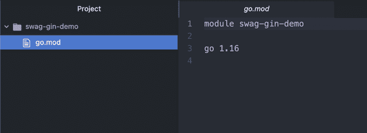

### 第二步:安装杜松子酒

在您的项目中安装 Gin web 框架。在终端中，键入以下内容:

```
go get -u github.com/gin-gonic/gin

```

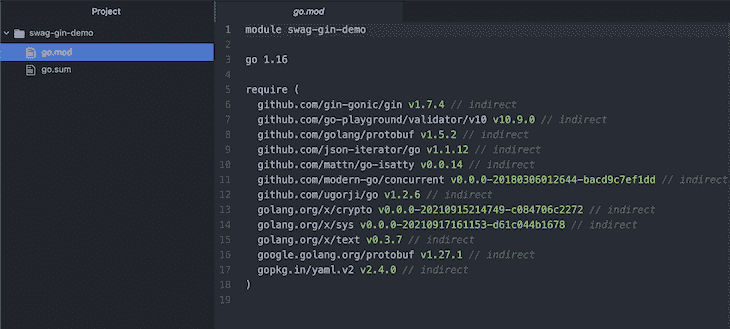

### 步骤 3:设置一个 Gin 服务器

创建一个名为`main.go`的文件，并将以下代码保存在其中:

```
package main

import (
        "github.com/gin-gonic/gin"
        "net/http"
)

func main() {
        // configure the Gin server
        router := gin.Default()

        // run the Gin server
        router.Run()
}

```

### 步骤 4:创建`getAllTodos`路线

让我们创建一个`todo`类型并用一些数据作为列表的种子。将以下代码添加到`main.go`文件中:

```
// todo represents data about a task in the todo list
type todo struct {
        ID   string `json:"id"`
        Task string `json:"task"`
}

// message represents request response with a message
type message struct {
        Message string `json:"message"`
}

// todo slice to seed todo list data
var todoList = []todo{
        {"1", "Learn Go"},
        {"2", "Build an API with Go"},
        {"3", "Document the API with swag"},
}

```

创建一个路由处理器，它将接受来自客户端的`GET`请求，然后返回待办事项列表中的所有项目。

将以下代码添加到`main.go`文件中:

```
func getAllTodos(c *gin.Context) {
        c.JSON(http.StatusOK, todoList)
}

```

将`getAllTodos`处理器注册到 Gin 路由器。用以下代码更新`main.go`中的`main`函数:

```
func main() {
        // configure the Gin server
        router := gin.Default()
        router.GET("/todo", getAllTodos)

        // run the Gin server
        router.Run()
}

```

通过运行 Gin 服务器并通过 Postman 发出请求来测试`getAllTodos`路线，如下所示:

```
go run main.go

```

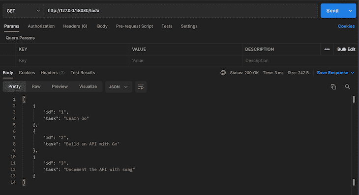

### 第五步:创建`getTodoByID`路线

创建一个路由处理程序，它将接受来自客户端的一个`GET`请求和一个`todo ID`，然后从 todo 列表中返回相关项的详细信息。

将以下代码添加到`main.go`文件中:

```
func getTodoByID(c *gin.Context) {
        ID := c.Param("id")

        // loop through todoList and return item with matching ID
        for _, todo := range todoList {
                if todo.ID == ID {
                        c.JSON(http.StatusOK, todo)
                        return
                }
        }

        // return error message if todo is not found
        r := message{"todo not found"}
        c.JSON(http.StatusNotFound, r)
}

```

将`getTodoById`处理器注册到 Gin 路由器。将以下代码添加到`main.go`中的路由器配置中:

```
router.GET("/todo/:id", getTodoByID)

```

通过邮递员发出请求来测试`getTodoById`路线，如下所示:

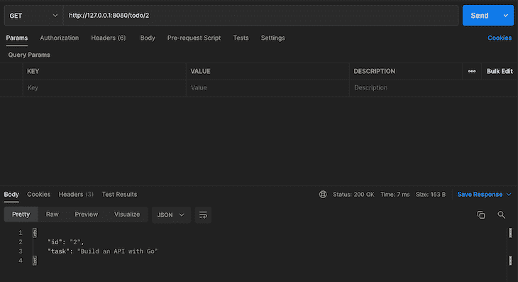

### 第六步:创建`createTodo`路线

创建一个路由处理程序，它将接受来自带有`todo ID`和`task`的客户端的`POST`请求，然后向 todo 列表添加一个新项目。

将以下代码添加到`main.go`文件中:

```
func createTodo(c *gin.Context) {
        var newTodo todo

        // bind the received JSON data to newTodo
        if err := c.BindJSON(&newTodo); err != nil {
                r := message{"an error occurred while creating todo"}
                c.JSON(http.StatusBadRequest, r)
                return
        }

        // add the new todo item to todoList
        todoList = append(todoList, newTodo)
        c.JSON(http.StatusCreated, newTodo)
}

```

将`createTodo`处理器注册到 Gin 路由器。将以下代码添加到`main.go`中的路由器配置中:

```
router.POST("/todo", createTodo)

```

通过邮递员发出请求来测试`createTodo`路线，如下所示:

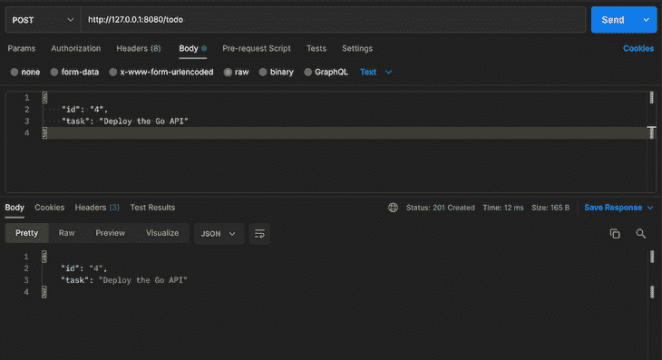

### 步骤 7:创建`deleteTodo`路线

创建一个路由处理程序，它将接受来自客户端的一个`DELETE`请求和一个`todo ID`，然后从 todo 列表中删除相关的条目。将以下代码添加到`main.go`文件中:

```
func deleteTodo(c *gin.Context) {
        ID := c.Param("id")

        // loop through todoList and delete item with matching ID
        for index, todo := range todoList {
                if todo.ID == ID {
                        todoList = append(todoList[:index], todoList[index+1:]...)
                        r := message{"successfully deleted todo"}
                        c.JSON(http.StatusOK, r)
                        return
                }
        }

        // return error message if todo is not found
        r := message{"todo not found"}
        c.JSON(http.StatusNotFound, r)
}

```

将`deleteTodo`处理器注册到 Gin 路由器。将以下代码添加到`main.go`中的路由器配置中:

```
router.POST("/todo", deleteTodo)

```

通过邮递员发出请求来测试`deleteTodo`路线，如下所示:

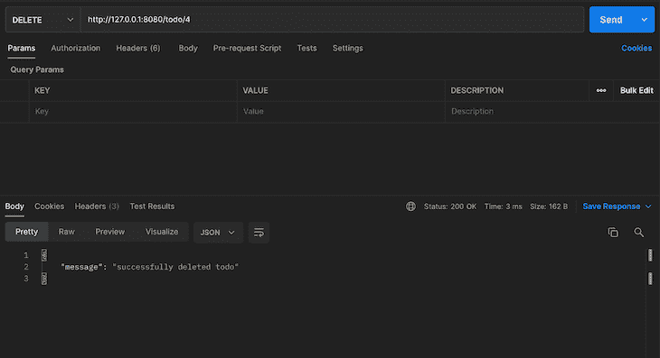

## 用 Swag 记录 web API

Swag 是一种中间件，有助于使用 Swagger 2.0 for Go 直接从源代码使用注释自动生成 RESTful API 文档。它要求您指定路线的工作方式，并自动完成整个 Swagger 文档创建过程。

Swag 与许多 [Go web 框架](https://github.com/swaggo/swag#supported-web-frameworks)兼容，并为它们提供了各种集成。本教程将使用 Gin 集成。

### 步骤 1:安装 Swag

在您的项目中安装 Swag 包。在终端中，键入:

```
go get -u github.com/swaggo/swag/cmd/swag
go get -u github.com/swaggo/gin-swagger
go get -u github.com/swaggo/files

```

### 步骤 2:初始化 Swag

初始化项目中的 Swag。在终端中，键入:

```
swag init

```

这将使 Swag 解析您的注释，并在新创建的`docs`文件夹中为您的代码生成 Swagger 文档。

如果您的终端在执行时不能识别`swag init`，您需要将`Go bin`文件夹添加到 PATH 中。

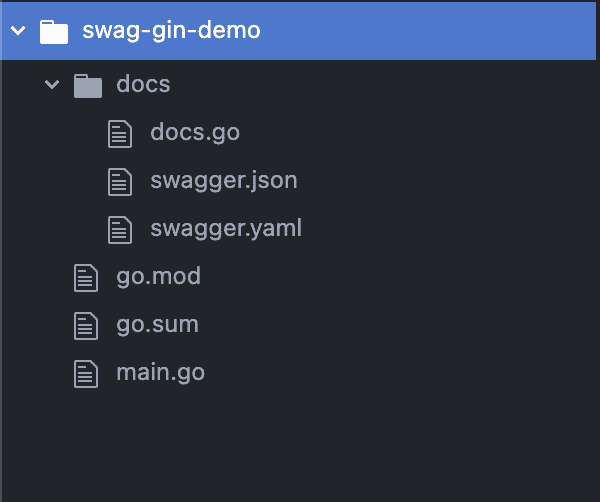

### 步骤 3:将 Swag 包导入到项目中

用下面的代码更新`main.go`文件中的导入:

```
import (
        "github.com/gin-gonic/gin"
        swaggerFiles "github.com/swaggo/files"
        ginSwagger "github.com/swaggo/gin-swagger"
        "net/http"
        _ "swag-gin-demo/docs"
)

```

如果你注意到了，我们将`swag/files`、`swaggo/gin-swagger`和`docs`包(为了效果)导入到服务器代码中。

### 步骤 4:向代码添加通用 API 注释

[通用 API 注释](https://github.com/swaggo/swag#general-api-info)包含关于 API 文档的基本信息(标题、描述、版本、联系信息、主机和许可证)。

将以下一组注释添加到`main.go`文件中(最好在`main`函数之前):

```
// @title Go + Gin Todo API
// @version 1.0
// @description This is a sample server todo server. You can visit the GitHub repository at https://github.com/LordGhostX/swag-gin-demo

// @contact.name API Support
// @contact.url http://www.swagger.io/support
// @contact.email [email protected]

// @license.name MIT
// @license.url https://opensource.org/licenses/MIT

// @host localhost:8080
// @BasePath /
// @query.collection.format multi

```

> Swag 还允许您在另一个文件中定义通用 API 注释。你可以在这里学习如何做。

### 步骤 5:向`controller`代码添加 API 操作注释

API 操作注释包含`controller`如何工作(描述、路由器、请求类型、参数和响应代码)。让我们看看如何为`getAllTodos`路线添加注释。

在`main.go`文件中的`getAllTodos`函数之前添加以下注释:

```
// @Summary get all items in the todo list
// @ID get-all-todos
// @Produce json
// @Success 200 {object} todo
// @Router /todo [get]

```

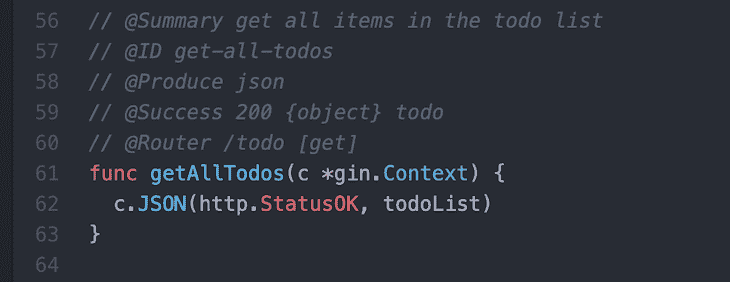

在上面的代码中，我们定义了以下内容:

*   `@Summary`，总结路线的作用
*   `@ID`，该路线的唯一标识符(每条路线必选)
*   `@Produce`，路由响应数据类型
*   `@Success 200`，预期状态码的响应模式
*   `@Router /todo [get]`、URI 的路线和接受请求的方法

我们将为`getTodoByID`路线添加注释。在`main.go`文件中的`getTodoByID`函数之前添加以下代码:

```
// @Summary get a todo item by ID
// @ID get-todo-by-id
// @Produce json
// @Param id path string true "todo ID"
// @Success 200 {object} todo
// @Failure 404 {object} message
// @Router /todo/{id} [get]

```

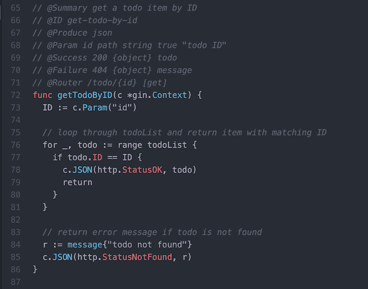

在这里，我们指定 Swag 该路由接受一个附加到请求`path`的强制`string`参数`id`。它的名字`todo ID`和`@Param id path string true "todo ID"`。

接下来，我们将为`createTodo`路线添加注释。在`main.go`文件中的`createTodo`函数之前添加以下代码:

```
// @Summary add a new item to the todo list
// @ID create-todo
// @Produce json
// @Param data body todo true "todo data"
// @Success 200 {object} todo
// @Failure 400 {object} message
// @Router /todo [post]

```

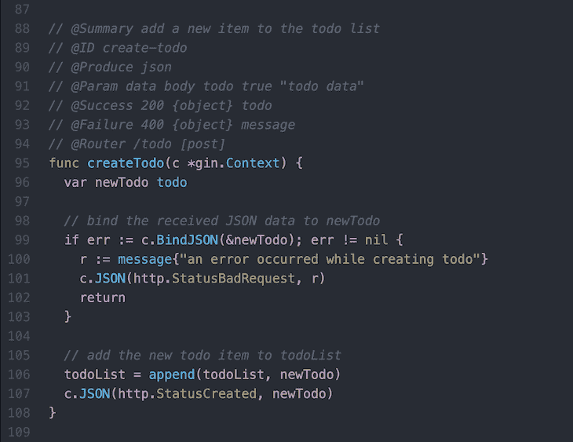

在这里，我们指定 Swag 该路由接受一个附加到请求`body`的强制`todo`参数`data`。它的名字`todo data`和`@Param data body todo true "todo data"`。

我们将为`deleteTodo`路线添加注释。在`main.go`文件中的`deleteTodo`函数之前添加以下代码:

```
// @Summary delete a todo item by ID
// @ID delete-todo-by-id
// @Produce json
// @Param id path string true "todo ID"
// @Success 200 {object} todo
// @Failure 404 {object} message
// @Router /todo/{id} [delete]

```

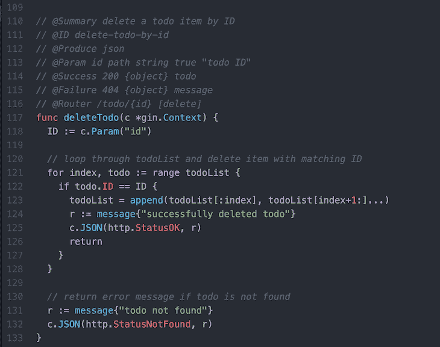

# 查看并测试文档

现在您已经为服务器和路由定义了所有的注释，让我们来查看和测试文档。

要从代码中生成文档，在终端中再次运行`swag init`,如下所示:

```
swag init

```

每次更新代码中的注释时，我们都必须运行`swag init`,因此文档会相应地重新生成和更新。

我们还必须向 Gin 路由器注册一个路由处理程序，负责呈现由 Swag 创建的 Swagger 文档。将以下代码添加到`main.go`中的路由器配置中:

```
// docs route
router.GET("/docs/*any", ginSwagger.WrapHandler(swaggerFiles.Handler))

```

现在我们已经配置了文档路径，运行服务器并在浏览器中导航到`/docs/index.html` URI，您将看到生成的 Swagger 文档:

```
go run main.go

```


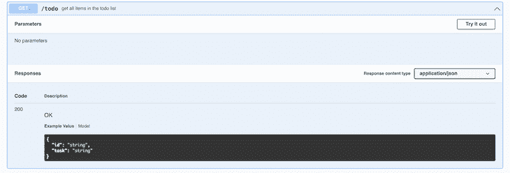


# 结论

本文向您展示了如何使用 Swag 无缝地为用 Go 构建的 web APIs 生成 Swagger 文档。你可以从它的[官方文档](https://github.com/swaggo/swag)中了解更多关于 Swag 的信息。

我们选择使用 Swagger 是因为它的众多特性和功能使得创建和维护 web APIs 文档变得很容易。

本教程中构建和记录的 web API 的源代码可以在 [GitHub](https://github.com/LordGhostX/swag-gin-demo) 上找到，供您探索。

## 使用 [LogRocket](https://lp.logrocket.com/blg/signup) 消除传统错误报告的干扰

[](https://lp.logrocket.com/blg/signup)

[LogRocket](https://lp.logrocket.com/blg/signup) 是一个数字体验分析解决方案，它可以保护您免受数百个假阳性错误警报的影响，只针对几个真正重要的项目。LogRocket 会告诉您应用程序中实际影响用户的最具影响力的 bug 和 UX 问题。

然后，使用具有深层技术遥测的会话重放来确切地查看用户看到了什么以及是什么导致了问题，就像你在他们身后看一样。

LogRocket 自动聚合客户端错误、JS 异常、前端性能指标和用户交互。然后 LogRocket 使用机器学习来告诉你哪些问题正在影响大多数用户，并提供你需要修复它的上下文。

关注重要的 bug—[今天就试试 LogRocket】。](https://lp.logrocket.com/blg/signup-issue-free)