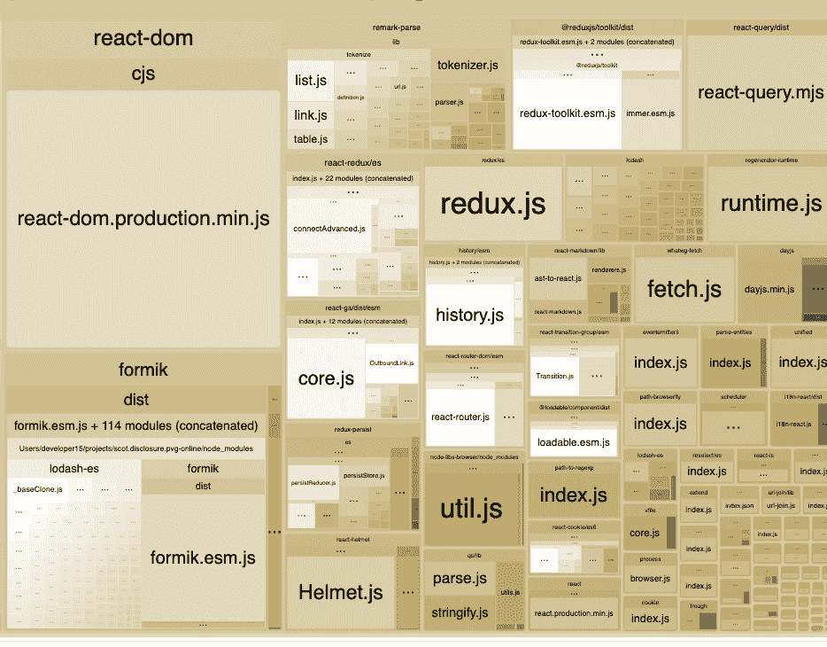
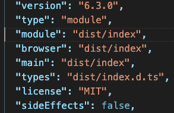

# 我的包裹穿这个看起来大吗？- LogRocket 博客

> 原文：<https://blog.logrocket.com/does-my-bundle-look-big-in-this/>

## 我们想去哪里？

以下代码与 Rollup 捆绑在一起。Rollup 已经确定了代码需要执行的最少导入，这个过程称为树摇动。

```
import React from 'react';
import { useFormikContext, useField } from 'formik';
import isEmpty from 'lodash/isEmpty';
import { DatePicker, Checkbox, CheckboxGroup, Radio, RadioGroup, TransitionComponent, TransitionType } from '@my/component-library';
```

树抖动是一种用于消除死代码的技术。Rollup 已经确定我只需要来自 [formik](https://github.com/formium/formik) 的两个组件。

## 我的包裹穿这个看起来大吗？

众所周知，大多数现代的大量使用 JavaScript 的应用程序向浏览器发送了过多的代码。



在上图中，所有人都能看到`react-dom.production.min.js`的巨大尺寸。

福米克已经毫无必要地将它的规模扩大了一倍，几乎囊括了所有的[洛达什](https://lodash.com/)。对于如此多的 JavaScript 包来说，Lodash 是一个巨大的问题。

## 怎么会？

似乎不太可能的是， [formik](https://github.com/formium/formik) 正在使用所有的进口模块，这些模块增加了包的大小。所需要的是一种消除死代码或者只导入被导入者使用的模块的方法。

为了让捆绑器识别死代码，它需要对代码库执行静态分析。

## CommonJS 增加了包的大小

这些天来，我尽可能地使用 TypeScript，直到最近，我还将`tsconfig.json`的`module`设置为`commonjs`。

CommonJS 模块更难优化，因为它支持动态导入和导出:

```
const a = require(localStorage.getItem('somekey'));

const b = 'exportThis';

module.exports[b] = (a) => a;
```

因为`require`实际上是一个函数调用，我们可以使用一个动态计算的字符串在运行时确定要加载的模块。

静态分析器甚至不会试图解密动态导入和导出，而是获取所有内容。

## ESM (Ecmascript)模块语法

`import`和`export`语句都是 ESM 模块语言的一部分。没有歧义，缺乏动态性便于静态分析。

[动态导入](https://javascript.info/modules-dynamic-imports)仍然可以在 ESM 模块中进行代码拆分。

## Rollup 是消除死代码的市场领导者

我使用 Webpack 已经很长时间了，Webpack 的工作原理是将每个模块封装在一个函数中，这个函数实现了一个加载器和一个模块缓存。在运行时，依次对这些模块中的每一个进行评估，以填充模块缓存。Webpack 方法使得像热模块替换(HMR)这样的事情成为可能，但是这种方法带来了开销。

Rollup 采用了一种不同的方法——它将所有代码放在同一个级别，这就是所谓的范围提升。最终的包更小，开销也更少，因为没有对每个模块进行评估。

代价是 rollup 依赖于 ESM 模块语义。缩小包大小的第一步是将任何 CommonJS 包变成 100%的 ESM 包。

## Package.json 模块解析

像 rollup 或 Webpack 这样的捆绑器通常有一种机制来指定`package.json`文件中的哪个字段是入口点。

如果消费包有一个导入，如:

```
import * as D3 from 'd3';
```

`package.json`的以下字段将决定模块的入口点:

*   **类型**–文件结尾为。当最近的父 package.json 文件包含值为`module`的顶级字段`type`时，js 将作为 ES 模块加载
*   **模块**–如果该字段表明导入的文件将是一个 ESM 模块
*   **main**–该字段通常用于解析 CommonJS 模块
*   **浏览器**–从未被节点使用。通过使用该字段，我们可以为 web 和 Node 生成不同的包



使用 Webpack，可以使用`mainFields`选项设置优先搜索哪些字段:

```
resolve: {
  mainFields: ['module', 'browser', 'main'],
```

使用 Rollup，您可以使用[@ roll up/plugin-node-resolve roll up](https://github.com/rollup/plugins/tree/master/packages/node-resolve)插件:

```
resolve({
  mainFields: ['module', 'browser', 'main'],
```

我们旅程的第一步应该是将`type`设置为`module`,并提供一个`module`字段:

```
{
  "name": "@ds/util",
  "version": "6.3.0",
  "type": "module",
  "module": "dist/index",
  "browser": "dist/index",
  "main": "dist/index",
}
```

如果有一个文件扩展名是`module`、`main`或`browser`，并且 Webpack 在定位`web`构建时依赖于浏览器字段的存在，那么我在使用 Webpack 时就会遇到问题。

## 用`mjs`文件抓住你

ES 模块是扩展名为`.mjs`的文件的目标。Node 的更高版本假设一个`mjs`文件的导入将符合 ESM。

在浏览器世界，或者更准确地说，在 bundler 世界，这更像是一种约定，但是 Webpack 和 Rollup 会以不同的方式处理这个文件，并编译到不同的目标。

我遇到了像 React 和 react-router 这样的依赖问题，它们是常见的依赖。解决方案是输出一个文件扩展名为`.esm.js`的文件。

## 开机`require`接触

我遇到的主要重构是删除导入`scss`文件的`require`语句:

```
const styles = require('./Start.module.scss');
```

变成了:

```
import styles from './Start.module.scss';
```

## 以打字打的文件

使用 TypeScript，我必须指示编译器将文件转换到`ESNext`。

在`tsconfig.json`中，`module`字段从:

```
"module": "CommonJS",
```

到

```
"module": "ESNext",
```

## 卷曲

这是我选定的汇总配置:

```
const bundle = await rollup({
    input: inputFile,
    external: (id: string) => {
      return !id.startsWith('.') && !path.isAbsolute(id);
    },
    treeshake: {
      moduleSideEffects: false,
    },
    plugins: [
      resolve({
        mainFields: ['module', 'browser', 'main'],
        extensions: ['.mjs', '.esm.js', 'cjs', '.js', '.ts', '.tsx', '.json', '.jsx'],
      }),
      json(),
      postcss({
        extract: false,
        modules: true,
        use: ['sass'],
      }),
      typescript({
        clean: true,
        typescript: require('typescript'),
        tsconfig: paths.tsConfig,
        abortOnError: true,
        tsconfigDefaults: {
          compilerOptions: {
            sourceMap: true,
            declaration: true,
            target: 'esnext',
            jsx: 'react',
          },
          useTsconfigDeclarationDir: true,
        },
        tsconfigOverride: {
          compilerOptions: {
            sourceMap: true,
            target: 'esnext',
          },
        },
      }),
      babel({
        exclude: /\/node_modules\/core-js\//,
        babelHelpers: 'runtime',
        ...babelConfig,
      } as RollupBabelInputPluginOptions),
      injectProcessEnv({
        NODE_ENV: 'production',
      }),
      sourceMaps(),
      minify === true &&
        terser({
          compress: {
            keep_infinity: true,
            pure_getters: true,
            passes: 10,
          },
          ecma: 2016,
          toplevel: false,
          format: {
            comments: 'all',
          },
        }),
    ],
  });
}
```

使用了以下插件:

使用上述配置调用 rollup 的 [rollup 函数](http://rollupjs.org/guide/en/)会返回一个 bundle 对象，该对象可以使用以下代码将 bundle 写入磁盘:

```
await bundle.write({
  file: path.join(paths.appBuild, 'index.js'),
  format: 'esm',
  name: packageName,
  exports: 'auto',
  sourcemap: true,
  esModule: true,
  interop: 'esModule',
});
```

该软件包现在符合 ESM 标准。

* * *

### 更多来自 LogRocket 的精彩文章:

* * *

## 包扎

世界正缓慢但坚定地转向 ESM 模块。有一个更小的包大小的承诺，引诱你到应许之地。

我使用 Rollup 来捆绑我的包，但在开发中仍然使用 Webpack 进行热模块替换。

无论捆绑者是谁，远离大众越来越有意义。

## 您是否添加了新的 JS 库来提高性能或构建新特性？如果他们反其道而行之呢？

毫无疑问，前端变得越来越复杂。当您向应用程序添加新的 JavaScript 库和其他依赖项时，您将需要更多的可见性，以确保您的用户不会遇到未知的问题。

LogRocket 是一个前端应用程序监控解决方案，可以让您回放 JavaScript 错误，就像它们发生在您自己的浏览器中一样，这样您就可以更有效地对错误做出反应。

[](https://lp.logrocket.com/blg/javascript-signup)[https://logrocket.com/signup/](https://lp.logrocket.com/blg/javascript-signup)

[LogRocket](https://lp.logrocket.com/blg/javascript-signup) 可以与任何应用程序完美配合，不管是什么框架，并且有插件可以记录来自 Redux、Vuex 和@ngrx/store 的额外上下文。您可以汇总并报告问题发生时应用程序的状态，而不是猜测问题发生的原因。LogRocket 还可以监控应用的性能，报告客户端 CPU 负载、客户端内存使用等指标。

自信地构建— [开始免费监控](https://lp.logrocket.com/blg/javascript-signup)。