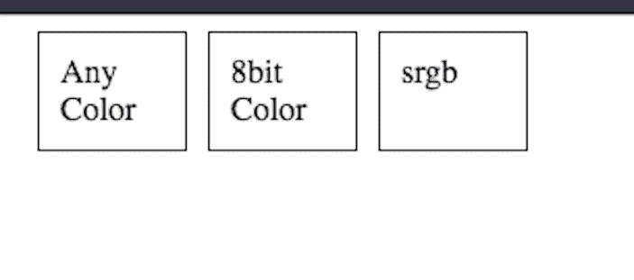
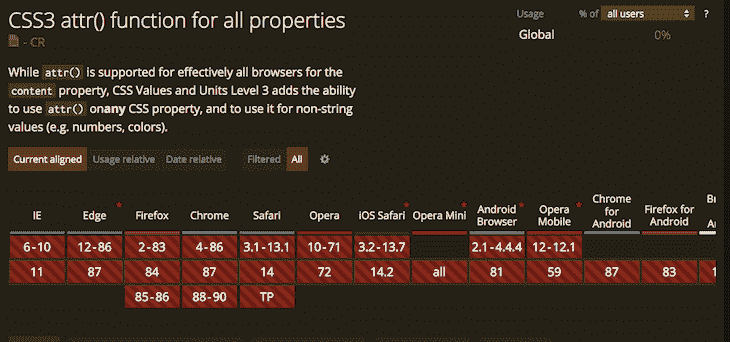

# 动态和 CSS 计算

> 原文：<https://blog.logrocket.com/dynamism-and-css-calculations/>

## 介绍

在我最近的一篇关于 CSS 中的[`min``max`和`clamp`函数的文章中，我深入研究了 CSS 中的计算，以及如何在我们通常不会看到它们的地方使用它们——例如，动态设置 HSL 颜色。但是 CSS 中的计算有一个明显的缺点，那就是缺少我们可以输入到计算中的动态值。](https://blog.logrocket.com/min-max-clamp-css-functions/)

作为一个例子，我展示了在`hsl`函数中使用`min`和`max`函数

```
hsl(min( 180, 190, 150), max(75%, 50%; 100%), 50%)
```

在那之后，我注意到这并没有给我们任何我们通过简单地在脑子里计算和写下来不能得到的东西:

```
hsl(150, 100%, 50%)
```

除非我们找到某种方法来引入我们实际上已经不知道的值，否则使用这些函数会增加不必要的复杂性。当然，这也是为什么我们在字体大小或宽度属性中使用它们的原因。

它们有多种方式来指定我们在编写样式时不知道的值——与百分比或屏幕大小相关的值，或者以度量单位定义的值，这些度量单位本质上只在浏览器需要它们时才确定(例如，像 em 这样的单位)。

但是碰巧的是，有许多方法可以在呈现时而不是写时动态地确定值。本文将对其中一些方法进行概述，并展示我们如何使用它们在我们可能想不到要使用它们的地方进行计算。

## CSS 变量的动态性

一般来说，CSS 变量将是向 CSS 函数提供动态值的最常用方式，因此本文的大部分内容将集中在这一点上。CSS 变量的值可以用各种方式改变；在最初的文章中，我在媒体提问中展示了它们的变化:

见笔 [Min，Max 随 HSL 媒体查询](https://codepen.io/bryanrasmussen/pen/eYZKvqp)by Bryan Rasmussen([@ Bryan Rasmussen](https://codepen.io/bryanrasmussen))
于 [CodePen](https://codepen.io) 。

稍后会详细介绍。

我还展示了 JavaScript 对它们的改变:

请看 [CodePen](https://codepen.io) 上 Bryan Rasmussen([@ Bryan Rasmussen](https://codepen.io/bryanrasmussen))
用 HSL JavaScript 更新的 Pen[Min，Max。](https://codepen.io/bryanrasmussen/pen/abNKWOp)

但是有很多其他的方法可以改变 CSS 变量的值。在这些例子的其余部分，我将关注至少三种不同浏览器支持的方式。

改变变量值的最明显的方法是通过使用不同的选择器设置不同的值——换句话说，允许我们像通常设置属性值一样设置变量值。

切换变量

## 使用 CSS 变量的一个强大技术是提供开关变量，Ana Tudor 在她的文章“[CSS 变量的干切换:一个声明的差异](https://css-tricks.com/dry-switching-with-css-variables-the-difference-of-one-declaration/)”和“[CSS 变量的逻辑运算](https://css-tricks.com/logical-operations-with-css-variables/)”中介绍了这一点

基本上，这种方法的工作原理是让一个变量有两个可能的值——1 或 0——起到一种开关的作用(想想电灯开关)。1 表示开关打开，0 表示开关关闭。

它通过在数学运算中使用这些变量来工作。举个例子，如果我们想要旋转或者不旋转一个元素 30 度，我们会说`calc(i * 30deg)`。如果`calc`为 0，则什么都不会发生；如果为 1，则元素旋转 30 度。

但是当然，一旦我们有了这些可用的变量名，我们就可以创建强大的逻辑操作，这些操作可以直接在 CSS 中完成，而不需要任何 JavaScript。

通过使用选择器实现的动态性

## 很明显，我们可以在一个特定的选择器中设置变量值，但是这个显而易见的事实使得许多复杂的事情变得可能不那么显而易见，而不考虑其含义。显然，我想我可能会在本文中大量使用“显而易见”这个词。

脸书的重新设计

### 脸书最近对他们如何编写和构造 CSS 做了一些[改变，他们使用了这种在类内改变变量的方法。从文章中引用:](https://engineering.fb.com/2020/05/08/web/facebook-redesign/)

CSS 变量是在一个类下定义的，当这个类被应用于一个 DOM 元素时，它的值被应用于它的 DOM 子树中的样式。这使我们能够将主题合并到一个样式表中，这意味着切换不同的主题不需要重新加载页面，不同的页面可以有不同的主题而不需要下载额外的 CSS，不同的产品可以在同一页面上并排使用不同的主题。


这使得主题的性能影响与调色板的大小成比例，而不是与组件库的大小或复杂性成比例。单个原子 CSS 包也包括黑暗模式实现。”

但是除了类和 id 的明显用法之外，还有许多潜在的选择器。让我们仔细看看这些。

使用伪类的动态性

### 如果我们可以使用类来改变变量，从而通过使用 CSS 继承的规则来改变我们的输入，那么我们可以使用伪类来做同样的事情[。](https://blog.logrocket.com/css-pseudo-classes-you-might-need/)

下面是一个使用`hover`状态改变变量值的简单例子:

请看 [CodePen](https://codepen.io) 上布莱恩·拉斯姆森([@布莱恩·拉斯姆森](https://codepen.io/bryanrasmussen) )
的笔 [悬停变量变化](https://codepen.io/bryanrasmussen/pen/MWjevWW)。

See the Pen [hover variable change](https://codepen.io/bryanrasmussen/pen/MWjevWW) by Bryan Rasmussen ([@bryanrasmussen](https://codepen.io/bryanrasmussen))
on [CodePen](https://codepen.io).

不幸的是，我们所做的任何更改都必须在已更改元素的上下文中完成，因此不可能在一个子树中更改一个变量并使它影响 DOM 的一个单独部分—例如，在这里:

参见 [CodePen](https://codepen.io) 上布莱恩·拉斯姆森([@布莱恩·拉斯姆森](https://codepen.io/bryanrasmussen) )
的笔 [悬停变量变化 2](https://codepen.io/bryanrasmussen/pen/ZEpOjYM) 。

在这里，`hover`事件将`--box-background`变量设置为红色耐火砖:

但是因为具有`.box`类的元素不在`.example`类中:

```
.example:hover {
--size: 3rem;
--box-background: hsl(0, 100%, 59%);
}
```

`.box`类中的实际元素将保留黑色背景。但是，如果我们将其更改为`.example`的后代，如下所示:

```
<div class="example">Example</div>
<div class="box">Box</div>
```

参见 [CodePen](https://codepen.io) 上布莱恩·拉斯姆森([@布莱恩·拉斯姆森](https://codepen.io/bryanrasmussen) )
的笔 [悬停变量变化 3](https://codepen.io/bryanrasmussen/pen/oNzLMqL) 。

See the Pen [hover variable change 3](https://codepen.io/bryanrasmussen/pen/oNzLMqL) by Bryan Rasmussen ([@bryanrasmussen](https://codepen.io/bryanrasmussen))
on [CodePen](https://codepen.io).

然后当`.example`悬停时背景变成红色。

```
<div class="example">Example
<div class="box">Box&lt;/div>
</div>
```

虽然伪类有很多种类型，但我将只关注伪类，它允许我们用 css 变量做更多有趣的事情。

语言伪类

#### 这些让我们根据语言或脚本方向性来选择[。就语言而言，这可以通过组合`lang`属性和`meta`元素来确定。](https://developer.mozilla.org/en-US/docs/Web/CSS/:lang)

理论上，语言也可以由`Content-Language` HTTP 头决定，但是如果有人在本地保存我们的页面，样式就会改变。作为获得最佳结果的一般规则，语言[应该设置有`lang`属性](https://www.w3.org/International/questions/qa-html-language-declarations)。

位置伪类

#### 顾名思义，这些是与位置相关的伪类。一般来说，这些都与链接到位置的元素有关——例如，根据元素是处于`hover`还是`active`状态，或者链接是否已经被访问过，元素可以有不同的样式。

但是在 location 类别中有一个我不常看到使用的伪类:`target`伪类，它允许我们对当前活动目标页面的一部分进行样式化。换句话说，如果我们有一个链接指向页面的一部分，那么当链接被点击时，我们可以对页面的这一部分进行样式化。

请参见下面的示例:

见 [CodePen](https://codepen.io) 上布莱恩·拉斯姆森([@布莱恩·拉斯姆森](https://codepen.io/bryanrasmussen) )
的笔 [目标伪选择器](https://codepen.io/bryanrasmussen/pen/WNGxgMV)。

用户操作伪类

这些可能是使用最广泛的伪类，大多数人使用`hover`、`active`和`focus`类。

#### 就`focus`而言，在设置变量的上下文中还有另一个非常有趣的伪类:`[focus-within](https://developer.mozilla.org/en-US/docs/Web/CSS/:focus-within)`伪类。

下面是我们之前的`target`伪类变成了`focus-within`:

请看 [CodePen](https://codepen.io) 上布莱恩·拉斯姆森([@布莱恩·拉斯姆森](https://codepen.io/bryanrasmussen) )
的笔 [focus-in 伪选择器](https://codepen.io/bryanrasmussen/pen/wvzgOmW)。

Here is our previous `target` pseudo-class turned into a `focus-within`:

因此，当用户单击链接时，框背景变为绿色，文本变为黑色，从而使链接获得焦点。

这个例子进一步说明了这一点:

请看 [CodePen](https://codepen.io) 上布莱恩·拉斯姆森([@布莱恩·拉斯姆森](https://codepen.io/bryanrasmussen) )
的笔 [focus-in 伪选择器 2](https://codepen.io/bryanrasmussen/pen/ExgZMOd) 。

Take this a bit further with this example:

要查看实际效果，首先点击**示例**链接。当链接获得焦点时，我们将看到两个框改变颜色。然后，如果我们按下 tab 键，这应该会将焦点再次移动到链接上—再次使两个框变成相同的绿色—原因如下:

然后再次按 tab，将焦点移到按钮上——与之前的行为相同。

然后再次按 tab 键。现在，我们用标签将 div 与带有`tabindex="0"`的类`focusableDiv`连接起来。第二个框有绿色背景和黑色文本，因为它仍在获取如上所示的`focus-within`变量集，但是`focusableDiv`是白色背景和黑色文本，因为它使用了`focus`伪类，如下所示:

```
.example:focus-within {
--box-background: hsl(90, 100%, 49%);
--box-color: hsl(0, 0%, 2%);
}
```

我们不会在这里查看[输入伪类](https://developer.mozilla.org/en-US/docs/Web/CSS/Pseudo-classes#The_input_pseudo-classes)或[树形结构伪类](https://developer.mozilla.org/en-US/docs/Web/CSS/Pseudo-classes#Tree-structural_pseudo-classes)，因为我认为大多数人都非常了解它们。

通过使用媒体查询的动态

```
.focusableDiv:focus {
--box-background: #fff;
--box-color: hsl(0, 0%, 2%);
}
```

当使用媒体查询来改变变量时，我们必须考虑变量的范围。如果我们想全局改变变量，最好使用`::root`选择器。

## 通常，当使用媒体查询来改变变量时，该查询是基于屏幕尺寸的变化，因此，主要用于确定屏幕上的元素应该有多大，或者它们之间应该有多远的距离。还有其他媒体查询通常也与屏幕尺寸相关，例如，`aspect-ratio`和`orientation`查询。

有些问题与媒体本身有关，例如，它是否用于印刷。还有许多不同的媒体查询可用于设置与设备颜色相关的变量值。

然而，一般来说，这些颜色规则在实践中并不像它们的 CanIuse 页面所显示的那样有用。

`@media (color)`规则

[`color`媒体查询](https://developer.mozilla.org/en-US/docs/Web/CSS/@media/color)可用于测试输出设备的每个颜色分量(红、绿、蓝)的位数，或者是否有任何颜色可用。

### 

`@media (color-gamut)`规则

[`color-gamut`媒体查询](https://developer.mozilla.org/en-US/docs/Web/CSS/@media/color-gamut)可用于测试用户代理和输出设备支持的大致颜色范围。

### 

请注意，这在 Firefox 中不起作用。

`@media (monochrome)`规则

[`monochrome`媒体查询](https://developer.mozilla.org/en-US/docs/Web/CSS/@media/monochrome)可用于测试输出设备单色帧缓冲器中每个像素的位数。

### 

我做了一个小代码笔来告诉用户他们有什么设置(除了它在 Firefox 中不能用于`color-gamut`查询):

请看笔 [彩色媒体查询支票](https://codepen.io/bryanrasmussen/pen/JjRWvqY)由布莱恩·拉斯姆森([@布莱恩·拉斯姆森](https://codepen.io/bryanrasmussen) )
于 [CodePen](https://codepen.io) 。

I’ve made a little CodePen to tell users what settings they have (except it does not work in Firefox for the `color-gamut` query):

所以在我的 Chrome 旧 Macbook Air 上，它向我显示:



这基本上是我们对旧 Macbook Air 的预期。不幸的是，这也是它在我的 Touch Lux 4 上告诉我的。

在我测试过的单色设备上——一个朋友的 Nook、一个 Pocketbook Touch Lux 4 和一个旧的 Kindle——媒体查询不起作用。

有一件事确实有效，那就是媒体询问

`@media: prefers-color-scheme`规则

[`prefers-color-scheme`媒体查询](https://blog.logrocket.com/new-media-queries-you-need-to-know/#preferscolorscheme)用于检测用户是否请求系统使用浅色或深色主题。

### 

下面是一个使用它的例子:

参见 [CodePen](https://codepen.io) 上布莱恩·拉斯姆森([@布莱恩·拉斯姆森](https://codepen.io/bryanrasmussen) )
的笔[、明暗模式 HSL](https://codepen.io/bryanrasmussen/pen/RwGgQrG) 。

如果我们有默认的灯光配色方案，我们应该看到类似这样的东西


如果你想知道如何打开深色配色方案，方法因浏览器和操作系统而异，所以你可能应该查找你的特定设备来找出答案。

例如，在我的 Mac 上的 Chrome 中，路径似乎包括通过 DevTools，而在我的 Android 平板电脑上的 Chrome 中，我可以在**设置** - > **主题**中完成。在 Firefox 中，大概最确定的是打开`about:config`，键入`ui.systemUsesDarkTheme`，设置为 1。

无论你选择哪种方法，之后，你可能需要重新启动你的浏览器或者至少打开一个新的标签页来看到改变生效。我在 Firefox 上使用了`ui.systemUsesDarkTheme`方法，下面是上面的样式在我的浏览器上的样子:


通过使用`@supports`查询的动态性

[`@supports` CSS 规则](https://developer.mozilla.org/en-US/docs/Web/CSS/@supports)允许我们根据浏览器对 CSS 规范特性的具体支持来改变变量。

显然,`@supports`查询对于设置我们将在检查的属性中使用的变量更有用。与媒体查询类似，关于范围的相同条件也适用于此——因此，显然，您应该在`::root`选择器上设置变量

## 你可能会考虑的问题

瀑布的危险

CSS 级联对于开发者来说有时很难控制。就我个人而言，我从来没有发现这一点，但我必须承认现实，有很多错误和开发人员的时间浪费在处理冲突的风格。

## 在下面的例子中，变量的值通过一个`counter`写到`content`属性，该值由多个选择器设置，这些选择器与设置该值的选择器具有相同的上下文。

### 参见 [CodePen](https://codepen.io) 上布莱恩·拉斯姆森([@布莱恩·拉斯姆森](https://codepen.io/bryanrasmussen) )
的笔[级联和开关变量](https://codepen.io/bryanrasmussen/pen/xxEdQEL)。

The [CSS cascade](https://developer.mozilla.org/en-US/docs/Web/CSS/Cascade) is sometimes problematic for developers to control. Personally, I have never found it so, but I have to acknowledge the reality that there are lots of bugs and developer time wasted dealing with colliding styles.

基于 CodePen CSS 面板中间的这个特定选择器，`content`中写出的值是 4(出于教学目的，使用可怕的`!important`)。

还要考虑以下几点:

参见 [CodePen](https://codepen.io) 上布莱恩·拉斯姆森([@布莱恩·拉斯姆森](https://codepen.io/bryanrasmussen) )
的笔[级联和开关变量 2](https://codepen.io/bryanrasmussen/pen/mdrmQvY) 。

The value written out in the `content` is 4, based on this particular selector in the middle of the CodePen CSS panel (using the dreaded `!important` for pedagogical purposes).

```
div > div {
--pos: 4 !important;
}
```

这里，`content`中的值是 3。

我们的标记是:

而我们的 CSS 设置变量值是:

给定 CSS 级联的规则，`pos`变量将接受样式表中最后一个类中定义的内容，因此我们输出数字 3——即使我们的类`_pos3`位于我们的类中间的`class`属性中。

当然，当规则更具体时，它将优先，如下所示:

```
<div class="example">
<div class="switcher _pos4 _pos3 _pos2"></div>
</div>
```

参见 [CodePen](https://codepen.io) 上布莱恩·拉斯姆森([@布莱恩·拉斯姆森](https://codepen.io/bryanrasmussen) )
的笔[级联和开关变量 3](https://codepen.io/bryanrasmussen/pen/yLabGop) 。

```
._pos2 {
--pos: 2;
}
```

```
._pos4 {
--pos: 4;
}
```

```
._pos3 {
--pos: 3;
}
```

Given the rules of the CSS cascade, the `pos` variable will take that which is defined in the last class in the stylesheet, and thus we output the number 3 — even though our class `_pos3` came in the middle of our classes in the `class` attribute.

输出到`content`的值是 2，通过改变:

更具体地说:

考虑到开发人员经常在控制大型 CSS 代码库中的级联方面存在问题，已经为组织 CSS 制定了不同的指导方针——特别是 [OOCSS、BEM 和 smacs](https://medium.com/@Intelygenz/how-to-organize-your-css-with-oocss-bem-smacss-a2317fa083a7)。

我不会进一步讨论这些不同的方法，只是指出它们不是为了帮助开发人员维护和使用设置和覆盖 CSS 变量的类而开发的。因此，它们无助于处理之前讨论的[切换变量](#switchvariables)技术或类似的变量重的解决方案如[脸书重新设计](#facebookredesign)可能发生的碰撞。

```
._pos2 {
--pos: 2;
}
```

最后，我们可以在 CSS 中使用的一些函数，比如`clamp`、`min`、`max`，或者不同的`color`函数，比如`hsl`，可能会诱使我们使用非常原子的变量(我在这里没有深入讨论)。

```
.example ._pos2 {
--pos: 2;
}
```

如果由特定的选择器设置，当后代元素以我们不期望的方式使用原子变量时，原子变量可能特别难以调试。当与用于进行更高级计算的原子变量结合使用时，cascade 可能比仅仅使用它来设置元素的实际属性更成问题。

改变变量的危险

除了级联可能遇到的危险之外，在改变变量值时，我们还可能遇到其他问题。问题是改变变量和改变属性的方式不同。

让我们假设你有下面的 css 代码

### 假设您的构建工具出于某种原因让它通过，那么`.example`类的背景颜色会是什么呢？显然，无论你的浏览器使用什么黑色，因为`"howdy"`是一个无效的值，然后将被丢弃。

无效的属性值可以被丢弃，因为我们知道什么是属性值。大多数 CSS 属性都是强类型的(我说“大多数”是以防我忘记了什么，但即使是内容也只接受字符串，不会将`10px`转换为`"10px"`，所以我对这件事相当有信心)。

但是 CSS 变量，由于可以在任何属性中使用，是弱类型的，并且没有内在的方法来阻止你将你的变量从一个颜色变成一个数字，再变成一个除了常识以外的字符串。

```
.example {
background: black;
background: "howdy";
}
```

例如，检查以下代码笔:

参见 [CodePen](https://codepen.io) 上布莱恩·拉斯姆森([@布莱恩·拉斯姆森](https://codepen.io/bryanrasmussen) )
的 Pen [attr()变量变化](https://codepen.io/bryanrasmussen/pen/poEWxXZ)。

But CSS variables, by virtue of being usable in any property, are weakly typed, and there is no intrinsic method to keep you from changing your variable from being a color to being a number to being a string other than common sense.

我们会看到这有级联问题，因为在`attribute`选择器之前使用了`:hover`选择器，这意味着当你悬停在`.example`元素上时，`--box-background`变量不会被重置。

但它也用以下代码更改了 `--box-background`类型:

使用 [`attr()`函数](https://developer.mozilla.org/en-US/docs/Web/CSS/attr())从 HSL 颜色到目前不支持作为背景值的东西，该函数只返回一个字符串，用于几乎任何浏览器的`content`属性:



那么当不支持`--box-variable`时，我们的`.box`元素是什么背景色呢？没什么。

```
.example[data-color] {
background: navy;
background: attr(data-color color);
--box-background: attr(data-color color);
}
```

现在，我们的`.example`元素是什么背景颜色，它将背景设置成这样:

是海军。

当然，当所有属性都支持`attr()`函数，而不仅仅是`content`时，就有可能运行上面显示的代码，并使`.box`元素的背景颜色为绿色。因此，如果您正在阅读这篇来自未来的文章，那么恭喜您，您正在使用的浏览器支持对所有属性和数据类型使用`attr()`函数。

如何避免这些问题

```
background: navy;
background: attr(data-color color);
```

不幸的是，我不打算在这里给出如何组织变量来最小化这些问题的建议，因为文章已经变得相当大了。但是，如果您开始使用更多的变量操作进行开发，那么这个问题可能应该被考虑。我打算在以后的文章中更深入地探讨避免和解决这些问题的可能策略。

结论

## 我希望这是一个有用的概述，介绍了在您通常考虑的方法之外，您可以控制和更改属性值的一些方法。

你的前端是否占用了用户的 CPU？

## 随着 web 前端变得越来越复杂，资源贪婪的特性对浏览器的要求越来越高。如果您对监控和跟踪生产环境中所有用户的客户端 CPU 使用情况、内存使用情况等感兴趣，

.

## LogRocket 就像是网络和移动应用的 DVR，记录你的网络应用或网站上发生的一切。您可以汇总和报告关键的前端性能指标，重放用户会话和应用程序状态，记录网络请求，并自动显示所有错误，而不是猜测问题发生的原因。

现代化您调试 web 和移动应用的方式— [开始免费监控](https://lp.logrocket.com/blg/css-signup)。

[try LogRocket](https://lp.logrocket.com/blg/css-signup)

.

[](https://lp.logrocket.com/blg/css-signup)[https://logrocket.com/signup/](https://lp.logrocket.com/blg/css-signup)

[LogRocket](https://lp.logrocket.com/blg/css-signup) is like a DVR for web and mobile apps, recording everything that happens in your web app or site. Instead of guessing why problems happen, you can aggregate and report on key frontend performance metrics, replay user sessions along with application state, log network requests, and automatically surface all errors.

Modernize how you debug web and mobile apps — [Start monitoring for free](https://lp.logrocket.com/blg/css-signup).