# 具有 Unity 地形特征的简单环境设计

> 原文：<https://blog.logrocket.com/easy-environment-design-unity-terrain-features/>

Unity Terrain 是一款 Unity 原生的、强大的、多功能的关卡和环境设计工具。它提供了使用高度图的概念来塑造和修改地形的简单机制。

在本文中，我们将了解如何使用该工具的基本知识及其主要特性。我们从使用高度图生成地形的原理开始。然后我们将讨论修改地形的主要机制。在文章的最后，我展示了一个使用免费资源和 Unity 地形工具制作漂亮的 Unity 场景的典型工作流程。

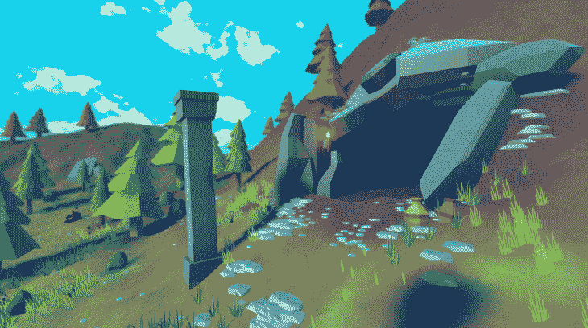

## 从高度图到地形

一个[高度贴图](https://docs.unity3d.com/Manual/StandardShaderMaterialParameterHeightMap.html)是一个纹理，它改变了玩家对一个特定网格的看法，类似于普通贴图的工作方式。更具体地说，高度贴图信息会移动网格的顶点，以显示海拔、悬崖、平原和陨石坑等要素。

由于其 2D 性质，一个单独的高度贴图一次只能干扰顶点的一个轴。值得注意的是，统一地形高度图改变了 y 轴上顶点的位置。

当我们通过升高或降低 Unity 地形的部分来处理它时，我们在技术上改变了它的高度图。改变会立即发生，我们可以看到地形改变的结果。或者，也可以直接在 Unity 外部更改高度图，并将高度图导入引擎。

例如，网站[Cities:Skylines Height Map Generator](https://heightmap.skydark.pl)提供了从现实世界中提取高度图信息的机制。虽然该网站是为了在[城市:天际线游戏](https://store.steampowered.com/app/255710/Cities_Skylines/)中使用，但地图在 Unity 中也同样适用。但是，请考虑它们将包含真实世界的距离，并且可能需要在外部工具中进行调整，以便在 Unity 中实现最佳使用。

下面的图片显示了从网站上提取的高度图，并导入到一个统一的地形。

Height Map in a Unity Terrain.

Height Map visualized (values adjusted to improve the visibility).

## Unity 地形设置

选中后，可以使用地形工具栏编辑统一地形。工具栏包含地形的主要功能，分为 5 个部分:**相邻的地形块**；**雕塑绘画**；**加树**年代；**添加细节**；和**通用设置**。

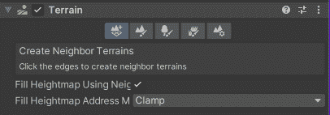

**邻近地形图块**允许你在当前地形附近以类似网格的格式创建其他地形。当你已经有了一个很好的地形，但是旁边需要更多的空间时，使用它是有益的。

这是一个比增加地形尺寸更合适的解决方案。改变尺寸将影响高度图的读取方式，比例因子将应用于地形及其所有元素。

关于高度图，创建一个新的相邻地形将创建一个新的地形游戏对象及其高度图。新创建的高度图将尝试匹配其边界中的值，将其无缝耦合到之前连接的地形。

**雕刻和绘制**选项直接用于高度贴图。这个选项包含了它的[地形工具](https://docs.unity3d.com/Manual/terrain-Tools.html)，我们将在下一节中介绍。简而言之，这个选项允许我们变形高度图并隐藏它的一部分来创建洞和入口。

**添加树木**和**添加细节**这两个选项都用于在地形中填充 Unity 自动处理的元素，比如树木、灌木丛、灌木、石头、草地等等。在场景中使用 Unity 地形优于使用用户放置的游戏对象的一个优点是 Unity 为地形的元素管理许多优化技术。在可见性剔除相关算法和[广告牌](https://docs.unity3d.com/Manual/class-BillboardRenderer.html)中，树木和细节被自动计算在内。

最后，[通用设置选项](https://www.google.com/url?q=https://docs.unity3d.com/Manual/terrain-OtherSettings.html&sa=D&source=docs&ust=1657805743251478&usg=AOvVaw3K8QeDnLaGTeiLNdLHHrqj)保存了关于地形游戏对象的所有相关信息，例如优化技术(细节距离、广告牌距离、阴影等)。)和地形的大小。

**通用设置**分为**基本人族**、**树&细节对象**、**风设置为草**、**网格分辨率**、**孔洞设置**、**纹理分辨率**、**光照**、**光照贴图**。广泛讨论每个选项超出了本文的范围，但是我们将讨论最常用的选项。

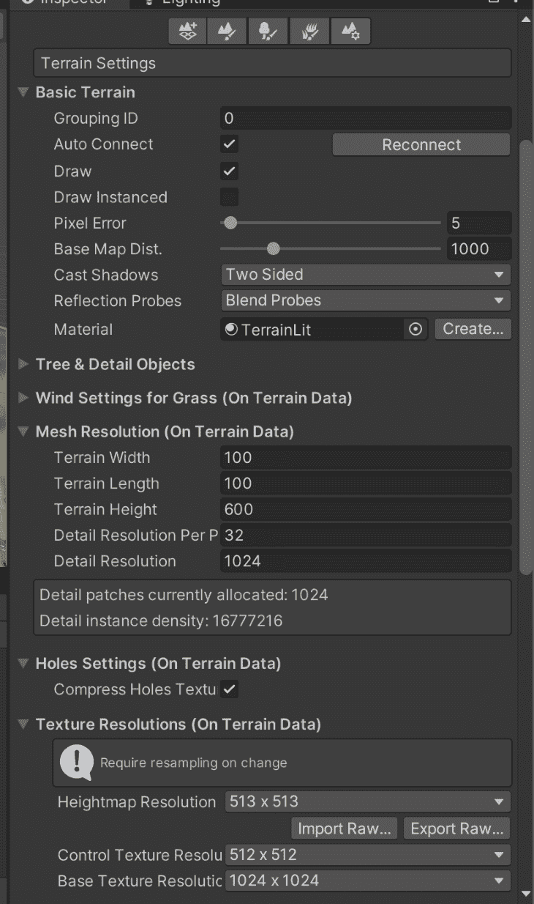

**基本地形**部分涵盖了地形的主要渲染方面，如地形材质、阴影属性和使用的绘制模式。请注意，如果您希望使用自制的后处理着色器或脚本渲染过程，需要禁用选项**绘制实例**。

**网格分辨率**值决定了地形的大小。改变地形的宽度和长度将立即改变高度图信息的读取方式。地形的宽度、长度和高度决定了地形在 x、y 和 z 轴上的大小。

**纹理分辨率**部分处理更具体的高度贴图纹理信息。您可以在这里设置高度图和[导入/导出高度图](https://docs.unity3d.com/Manual/terrain-Heightmaps.html)的分辨率。使用导入功能，您可以将从其他来源(如前面介绍的来源)获取的数据用于您的地图。通常还会导出当前的高度贴图，在外部工具中对其进行修改，然后再将其导入回来。

## 雕刻和改变地形的选项

如前所述，[雕刻和绘制](https://docs.unity3d.com/Manual/terrain-Tools.html)选项允许我们通过改变高度贴图来改变地形。这些选项有六个工具:**升高或降低地形**、**绘制孔洞**、**绘制纹理**、**设置高度**、**平滑高度**、**戳地形**。

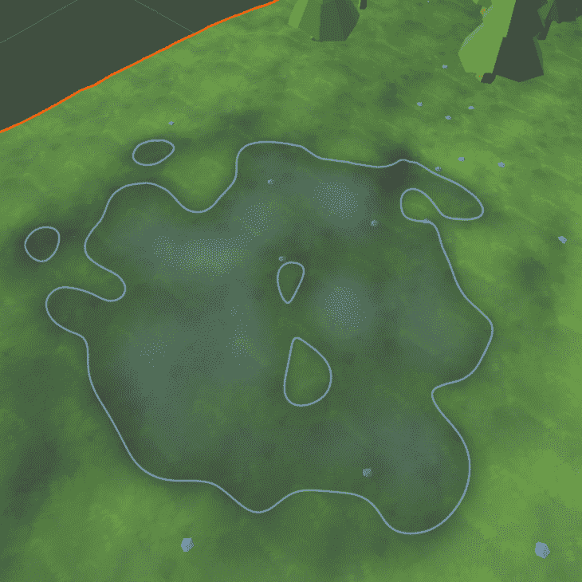

**升高或降低地形**、**设定高度**和**平滑高度**的选项都用于通过增加或减少其值来直接影响高度图。**设置高度**用于改变高度图以满足特定的期望结果，而**平滑高度**使地形变得柔和，就像模糊了高度图中的选定区域一样。所有这些选项都是通过使用地形笔刷来完成的(如上图所示)。

地形笔刷类似于其他图像编辑软件中的笔刷，如 GIMP 和 Photoshop。一个笔刷在灰色和 alpha 的阴影中显示一个图案，这个图案被应用到地形上，使用它的值来塑造地形。笔刷的透明区域不会影响地形，较暗的区域比较亮的区域对地形的影响更大。Unity 的默认地形笔刷设置有超过 10 个笔刷。

**绘制纹理**选项用于在地形中应用[纹理层](https://docs.unity3d.com/Manual/class-TerrainLayer.html)，主动添加颜色和其他纹理属性。使用与其他雕刻和绘制工具相同的地形笔刷来应用纹理层。然而，Unity 的默认地形没有纹理层。

A list of terrain layers.

The properties for one terrain layer.

每个地形层都是它自己的资产，可以被多个地形重用，甚至在不同的场景中。添加的第一个地形层将自动覆盖整个地形。用它来快速设置你的基色。每个地形层可以有**漫反射**、**法线**和**蒙版贴图**。

漫射贴图是由地形显示的纹理。设置完成后，更改其色调的选项将变得可见。更改色调是创建地形变化的一种快速有效的方法，而无需使用更多纹理或在外部程序中编辑资源。

虽然法线贴图用于传达层上的法线信息，并且通常与常规法线贴图的工作方式相同，但遮罩贴图明确用于高清晰度和通用渲染管道，以传达更多信息，如金属、环境光遮挡、高度和平滑度。

最后，平铺设置是地形层的便利选项。大小和偏移值改变纹理在地形中平铺的频率，以及每次重复的基本偏移。

一般来说，对于大型地形，最好有几个不同的地形层，它们的大小值也各不相同，因为这有助于打破地形底部的可见重复。

如前所述，地形笔刷默认带有 Unity 的地形，但在创建新的地形对象时没有地形层。

此外，有必要有地图和纹理来创建您的地形层。在这篇文章中，我使用了一些来自资产商店的新的免费笔刷([通用地形笔刷](https://assetstore.unity.com/packages/tools/terrain/generic-terrain-brushes-52974)来自燃烧的沙子和 [StampIT！Rowlan Inc .的收集示例](https://assetstore.unity.com/packages/tools/terrain/stampit-collection-examples-218286)以及地形层的免费纹理包([手绘草&Chromisu 的地面纹理](https://assetstore.unity.com/packages/2d/textures-materials/handpainted-grass-ground-textures-187634#description))。

带有一些纹理的基础地形的结果如下所示:

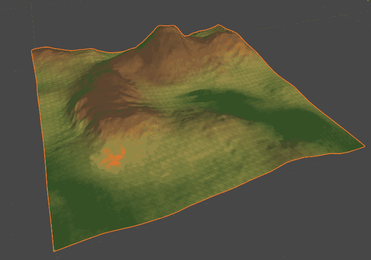

在处理地形的时候，我通常会试着平衡高峰区域和平原区域。这往往会给我足够的空间来种植植物，而不是过度拥挤的空间。此外，我试图在地形中有一个关键元素来保持它的主要组成部分和焦点，例如一座山、一片空地或一条河。

拥有一个主要组件有助于决定使用哪些资产以及如何分配它们。在这种情况下，我们将制作一个带有洞穴状入口的小山，以探索更多的地形选项和一些感兴趣的小区域，从而使视图多样化。

此外，请注意，我试图探索多个地形层，以打破他们往往使视觉重复。在这个阶段，我试图只屏蔽掉主要的点，将山丘与普通的草地和平原区分开，并在这里和那里用一些沙子和深色的草地点缀一些多样性。

## 种树，种草，还有…石头？

有两种方式可以添加植被，要么用**添加树**选项，要么用**添加细节**选项。**添加树**非常简单，允许你放置具有树状特征的物体。

为了更好的协同，应该使用 Unity 工具创建树，例如[速度树](https://docs.unity3d.com/Manual/SpeedTree.html)或[树编辑器](https://docs.unity3d.com/Manual/class-Tree.html)，或者使用特定的地形树材质。但这不是强制性的，在接下来的部分中，我将展示另一种方法，它可以产生类似的结果并允许更多的创作自由。

在任何情况下，地形树都有每个网格最多 2 个材质的限制(一个用于树皮，另一个用于树叶)。如果你的网格有两个以上的材质，它可能无法正确渲染。解决这一限制的常见方法是求助于纹理图谱。此外，为了获得更有趣的效果，通常会将树叶材质与树皮材质分开，这允许我们仅为树叶编写着色器(例如伪造风的运动)。

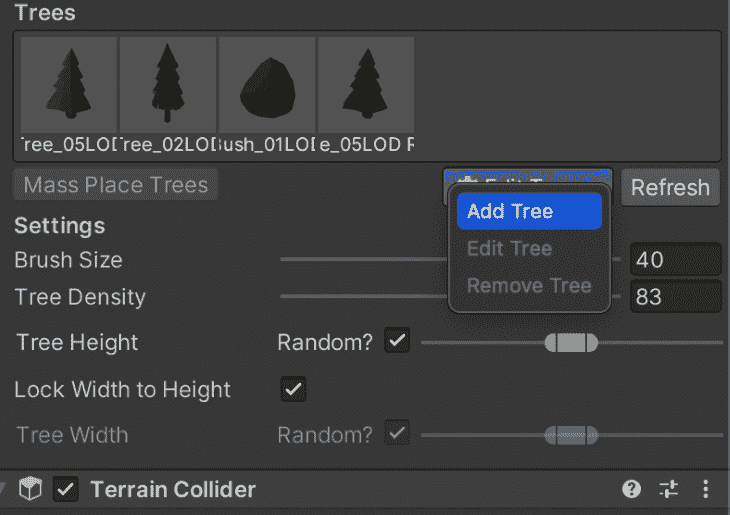

类似于地形层，树木也必须单独添加到地形中，然后使用地形的笔刷放置。树木可以作为裸网格添加，也可以作为预置添加。

请注意，添加一棵树作为预设，并不一定会添加所有的预设元素，也不会完全按照你的预设行为。例如，放置一个带有动画制作人的树预置将忽略动画制作人，并作为一个静态树。

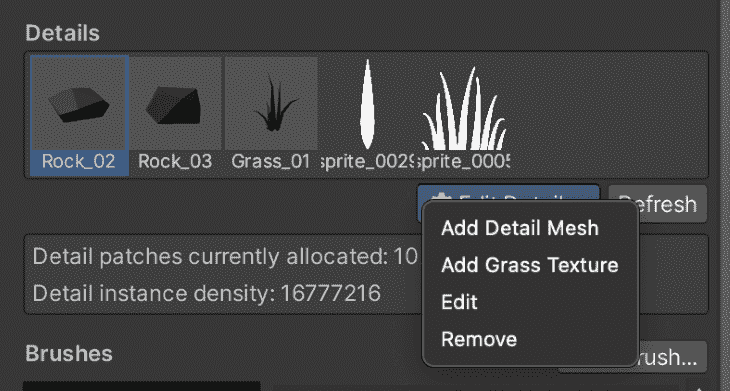

以类似的方式，细节是可以放置在地形中以使其视觉多样化的元素。[细节可以有两种类型](https://docs.unity3d.com/Manual/terrain-Grass.html):细节网格和草纹理。细节网格的工作方式类似于在场景中保持静态的常规网格，例如石头、鹅卵石甚至灌木。

细节网格仅限于一种材质。如果您尝试使用具有多种材质的网格，它们将不会被正确渲染。

细节网格也可以渲染为顶点照明或草地。顶点照明会将网格渲染为常规的照明游戏对象，并且不会对风做出反应，这适用于石头和树桩。草地渲染的工作方式类似于草地纹理，允许地形的风影响网格。

然而，从经验来看，只有当风弯属性设置为较低值时(在**地形常规设置**下)，草渲染才会产生视觉上令人愉悦的结果。否则，细节网格可能会不真实地移动。

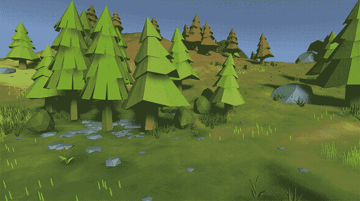

草纹理是在地形中渲染的精灵，根据地形的风来表现。正如 Unity 文档中所述,“草纹理”这个术语是误导性的，因为你可以使用任何普通的纹理，比如花或树枝，使用同一个工具。与渲染为草的细节网格不同，草纹理将保持其在地面上的枢轴，并随风移动，保持相同的位置-正如您所期望的草的行为。

对于本文，我使用了资产商店中的树和其他网格(JustCreate 的[低多边形简单自然包](https://assetstore.unity.com/packages/3d/environments/landscapes/low-poly-simple-nature-pack-162153#description)，breaked Vector 的[低多边形岩石包](https://assetstore.unity.com/packages/3d/environments/landscapes/low-poly-simple-nature-pack-162153#description))。对于草的纹理，我使用了来自肯尼的优秀的[树叶精灵](https://www.kenney.nl/assets/foliage-sprites)，这是一个无版权、高质量资产的伟大来源。最后，作为额外的装饰资产，我使用了 JustCreate 的[低聚地下城建兴](https://assetstore.unity.com/packages/3d/environments/dungeons/low-poly-dungeons-lite-177937)。

将这些应用到我们的地形，我们有以下结果:

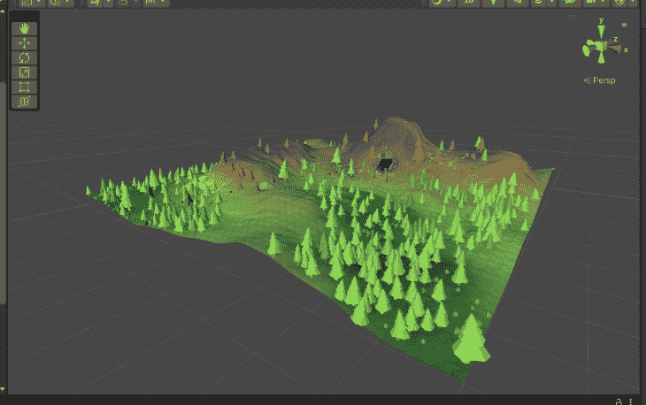

## 具有 LOD 组的更通用的树

如前所述，由于地形系统的优化，Unity 的树是有限的。如果你使用自定义材质或其他变化，一些树的位置选项可能会被忽略，导致一个非常乏味和重复的场景。

然而，该系统也允许我们绕过它的一些限制，以实现关于材料使用和风格的更高层次的通用性。为此，我们必须遵循特定的流程。

首先，您必须为树创建一个新的预设，其中根游戏对象(层次中的第一个)是一个空游戏对象，带有 [LOD 组](https://docs.unity3d.com/Manual/class-LODGroup.html)组件。然后，你可以把你的树预置放在根游戏对象下面的层级中。之后，把树预置加入 LOD 组，就这样了。

树预设将与您的自定义着色器一起工作，并接收来自地形的常规树放置属性，如更改树的宽度、高度和旋转。对于颜色变化，有必要改变着色器以读取 _TreeInstanceColor 属性，但这一步超出了本文的范围。

当然，您可以使用 LOD 组特性来处理树的其他层次的细节。然而，如果你只是想在你的树上有一个更通用的材质，同时仍然使用地形放置属性，你可以将 LODs 的数量改为 1，并且只使用一个单独的树预置。

完成这些步骤后，您应该会得到与下面类似的结果:

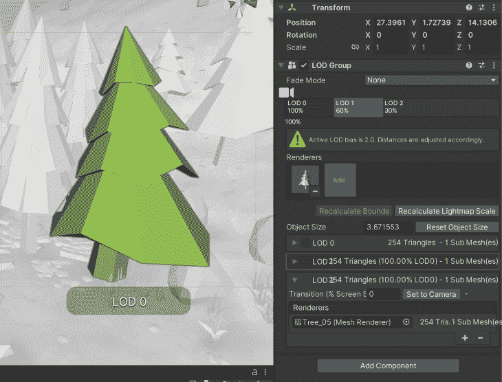

## 为获得更好的结果而建议的地形工作流

现在，我们已经介绍了如何使用地形工具的主要方面，我想提供一个简单的工作流程，我用它来获得相当好的结果，而不需要太多的努力，同时还包括一些其他的渲染方面，可以改善您的环境。

### 制作洞穴入口

让我们从我之前提到的洞穴开始。Unity 地形不允许我们创建入口或水平绘制高度图(在 x-z 平面应用高度信息)。然而，它将使我们能够在它上面画洞。

Unity 地形中的洞隐藏了部分地形网格，就像我们在切割一样。可以使用地形笔刷像雕刻地形工具中的其他元素一样绘制孔。

为了创造一个视觉上令人兴奋的洞穴入口，我建议你抬高地形，保持仰角在 40 到 60 度之间。超过这一点可能会使地形网格被拉伸得太多，使它更难被其他元素和预设覆盖。这样，我们应该会得到如下所示的结果:

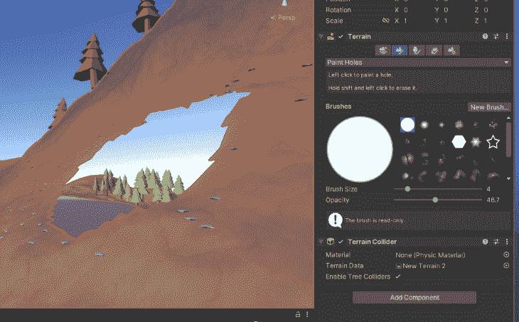

如你所见，地形洞以二元方式隐藏了部分地形:它们要么完全消失，要么完全可见。为此，有必要用资源和其他元素覆盖接缝，以获得更好的视觉质量。

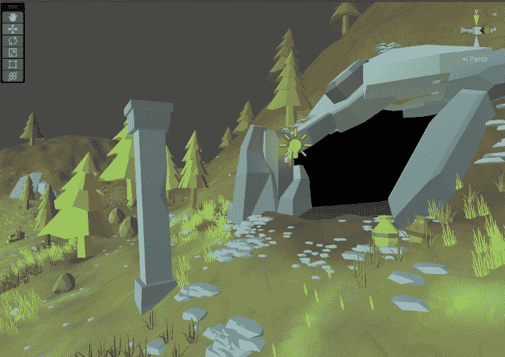

使用前面提到的免费资源，我缩放并旋转了洞口周围的不同石头，以隐藏洞口和可见地形之间的接缝。我也试着添加更多的石头和鹅卵石来创造一个更自然的外观。调整高度贴图以更好地适应与岩石的连接是常见的。

此外，在感兴趣的区域周围添加额外的道具总是有利于增加玩家的注意力。为此，我添加了一些半埋在地上的罐子和一根位于洞穴正前方的柱子，这有助于创造一些神秘感和故事性。我在洞口旁边加了一盏小灯来引导眼睛看得更远。

如前所述，这个洞也允许用户透视地形。为了避免这种情况，我使用了一种特殊材质的平面，这种材质忽略了光照(无光)。这很重要，因为否则，场景光线的变化会将这些黑暗的墙显示为实心的，而我们想要的视觉效果是让它看起来像一个黑暗/阴影区域。

此外，我使用了低多边形包中的一些网格作为洞穴的地面，因为我们不能使用到目前为止一直使用的相同地形。

值得注意的是，如果你想让你的玩家进入洞穴并在里面导航，我们到目前为止所做的并不理想。为此，你需要在洞的周围设置适当的网格，从各个角度模拟洞穴的内部。使用一个新的地形对象来实现这一点是可能的，但是我认为这样做可能不是最佳的。

另一方面，这个解决方案对你来说非常有效，你可以把玩家带到一个新的洞穴内部场景。

### 手动环境遮挡

我用来改善一个统一地形中的照明的一个常用技术是在地面上放置的物体下面手动使用一个更暗的地形层。这有助于提高地形元素的内聚性，因为一些照明效果(如环境遮挡)不会应用于地形对象，尤其是在使用自定义着色器和其他技术的情况下。

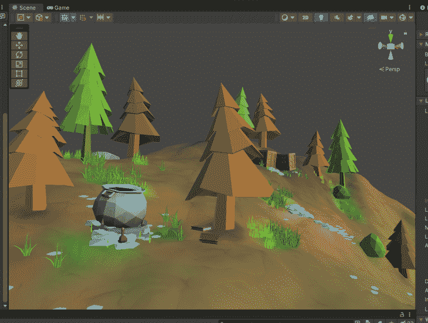

请注意，这不同于投射阴影。Unity 地形将正确地投射物体的阴影，但这可能仍然会造成物体漂浮或没有真正连接的印象。在某些地方使用黑暗地形层有助于拉近物体和地面的距离，而不需要更多的资源或昂贵的光照计算。

而且，我经常把这个应用到其他不是地形物体的物体和预设的底部。如上图所示，我在书和大锅下面使用了一点较暗的色调，以帮助元素更紧密地结合在一起。

### 真实环境遮挡和灯光烘焙

较暗的图层在一定程度上有助于假照明，但它可以通过烘焙场景中的灯光来放大。关于光照烘焙的完整讨论超出了本文的范围，但是它的一些主要元素将被讨论如何使用它们来改善地形的视觉效果。

首先，[光照烘焙](https://docs.unity3d.com/Manual/LightMode-Baked.html)是一个过程，在这个过程中，我们预先计算场景中的光照，并存储数据，然后将其应用到场景中的对象上。Unity 特别使用了[光照贴图](https://docs.unity3d.com/Manual/Lightmappers.html)，它在纹理贴图中烘焙物体表面的亮度。

然而，这些纹理不能在运行时改变，并且需要为场景中的每次改变再次预先计算，例如将对象移动到不同的位置或更新灯光的变换。此外，它仅适用于标记为静态的对象。

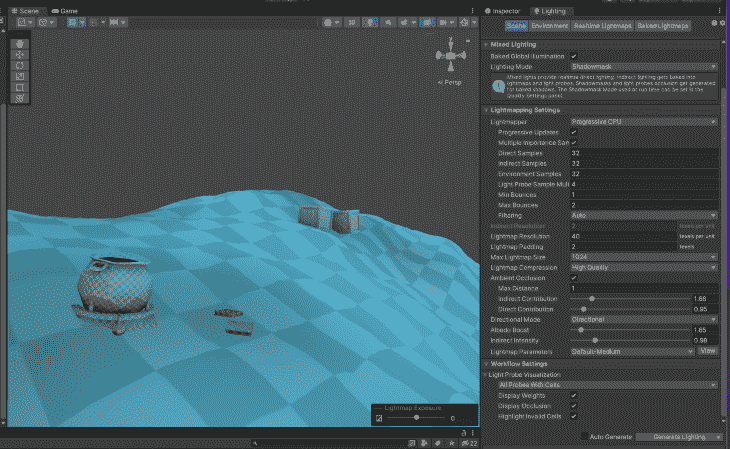

灯光烘焙可以在灯光选项卡中完成(你可以通过**窗口**菜单进入，然后是**渲染**，然后是**灯光**)。Unity 的灯光烘焙默认值相当高，可能需要很长时间来处理。为此，我建议您将所有的**直接样本**、**间接样本**和**环境样本**减少到一个较低的数字，比如 16 或 32。

这些属性与光照贴图计算场景中任意给定点的光照所需的步骤直接相关(对于静态元素)。增加它们中的任何一个都会产生更好和更真实的结果，但是会大大增加烘焙时间。

我通常从低值开始评估场景中的第一印象，然后在我认为合适的时候逐步增加它们。对于更多的风格或自定义材料，使用较低的值通常足以实现良好的视觉效果。

此外，第一次烘焙可能会向您显示对象放置中的不一致和其他错误，这些错误应该在应用更彻底和更真实的灯光贴图过程之前修复。

我还建议在烘焙的光照属性中打开光照烘焙[环境遮挡](https://docs.unity3d.com/Manual/LightingBakedAmbientOcclusion.html)。环境遮挡是当曲面彼此靠近时发生的视觉效果，遮挡光线并在它们的交点投射阴影，使它们看起来更暗。我们之前使用较暗的地形图层颜色伪造了它，但是光照贴图实际上可以计算适当的环境遮挡并将其烘焙到纹理中。

下面的图片显示了轻微烘焙和不轻微烘焙的结果。

Without light baking.

With light baking.

如你所见，树干和地面之间没有环境遮挡。然而，大锅的底部和图像背面板条箱之间的交叉点比没有烘焙的版本更暗，也更真实。

### 放置天空盒并应用后处理

最后，为了进一步改善视觉效果并将元素结合在一起，这两个步骤是必不可少的:放置一个更好的天空盒并应用一些后期处理效果。

对于这篇文章，我使用了 Yuki2022 的免费风格化天空盒。这些天空盒非常适合低聚风格的卡通外观。

天空盒可以添加在**灯光**标签下(与灯光烘焙相同)，在**环境**标签下。

后处理效果需要更多的步骤。首先，必须根据安装的渲染管道将后处理包添加到项目中。使用内置的渲染管道，您需要使用包管理器在您的项目中安装[后处理堆栈](https://docs.unity3d.com/Manual/com.unity.postprocessing.html)。

否则，如果您使用通用渲染管道或高清晰度渲染管道，您已经安装了等效的后处理系统。我在这篇文章中使用了[通用渲染管道](https://docs.unity3d.com/Packages/com.unity.render-pipelines.universal@15.0/manual/EffectList.html)，但是效果和配置与其他管道相似。

下图显示了我用于地形最终版本的最终后处理体积:

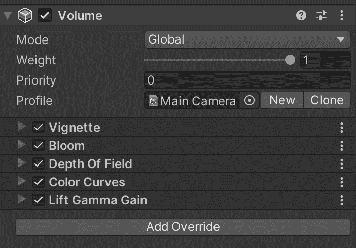

使用的效果有:

*   使屏幕的角落变暗，将玩家的注意力集中在中心元素上
*   **Bloom** :扩展场景中的高光元素，用相邻的物体模糊它们的区域，这是一个假的(但是很好的)全局照明替代方案
*   **景深**:通过使离我们更近的元素(在焦点上)清晰，模拟我们眼睛和真实相机的焦点，而其他元素则根据它们的距离而模糊
*   **颜色曲线**:改变渲染的最终颜色，以匹配更理想的外观。在这种情况下，我增加了红色，稍微增加了蓝色
*   **提升伽玛增益**:改变渲染的整体颜色，以及增加对暗色调、中间色调和高光的控制

我们在本文中所做的两个位置的最终结果可以在下面的图片中看到:

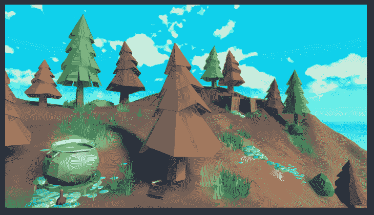

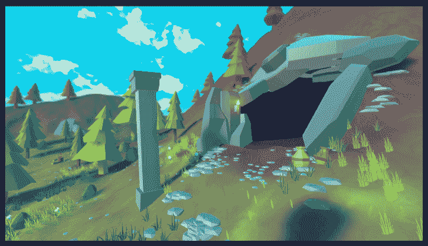

感谢您的阅读，如果您想了解更多关于本文范围之外的话题，请告诉我。他们每个人都应该有自己的文章。你可以在 www.dagongraphics.com 看到更多我的作品。

## 使用 [LogRocket](https://lp.logrocket.com/blg/signup) 消除传统错误报告的干扰

[LogRocket](https://lp.logrocket.com/blg/signup) 是一个数字体验分析解决方案，它可以保护您免受数百个假阳性错误警报的影响，只针对几个真正重要的项目。LogRocket 会告诉您应用程序中实际影响用户的最具影响力的 bug 和 UX 问题。

然后，使用具有深层技术遥测的会话重放来确切地查看用户看到了什么以及是什么导致了问题，就像你在他们身后看一样。

LogRocket 自动聚合客户端错误、JS 异常、前端性能指标和用户交互。然后 LogRocket 使用机器学习来告诉你哪些问题正在影响大多数用户，并提供你需要修复它的上下文。

关注重要的 bug—[今天就试试 LogRocket】。](https://lp.logrocket.com/blg/signup-issue-free)