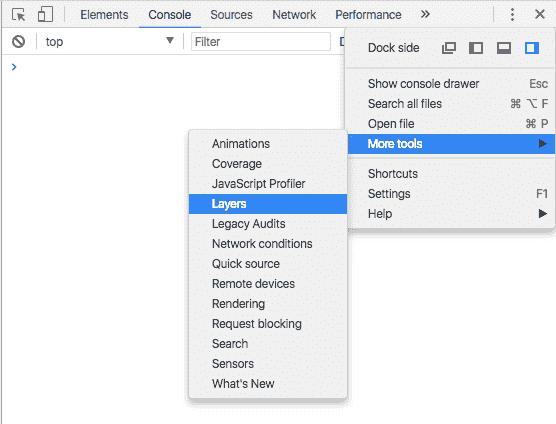
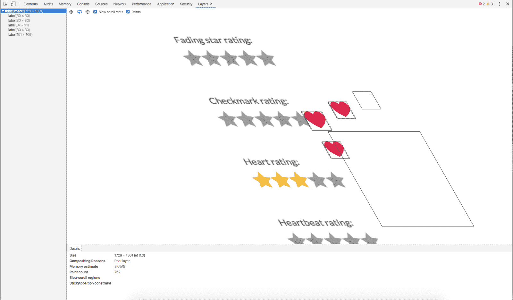
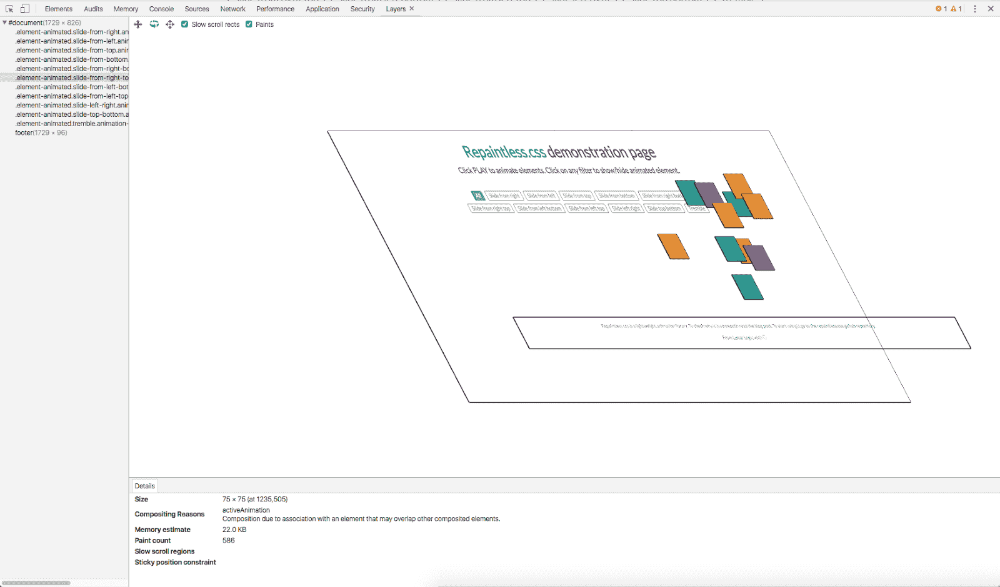

# 使用 Chrome 中的新图层面板消除内容重绘

> 原文：<https://blog.logrocket.com/eliminate-content-repaints-with-the-new-layers-panel-in-chrome-e2c306d4d752/>

所以，在花了几个小时试图找出你制作精美的网站浏览速度如此之慢的原因后，你已经黔驴技穷了。你使用了最新的技术堆栈，加载时间比任何同类页面都要短，第一个有意义的绘图可以在眨眼之间看到。

然而，当你试图真正使用这个网站时，这是很痛苦的。令人沮丧。“为什么？!"我敢打赌，在大多数情况下，问题在于内容回流和重绘。

### 重排和重画

好吧，那么什么是回流和重画？为了充分理解这个概念，最好从浏览器如何呈现页面的一些背景知识开始。

#### 布局

在 DOM(文档对象模型)被创建并且样式被重新计算之后，浏览器花一些时间来计算每个可见的 HTML 节点将要占用多少空间以及它将被放置在哪里。这一阶段被称为“布局”，在这一点上，元素只表示为矢量盒。

#### 颜料

一旦这一部分完成，浏览器就会在“绘制”步骤中获取这些矢量框并将其栅格化(将矢量转换为像素)。栅格化的元素被放在“层”上(默认情况下只有一层，除非有理由将它们移走——稍后将详细介绍)。

#### 作文

各层放在一起，最后显示在屏幕上。

当我们只想向用户显示一帧时，所有这些工作都会发生。但是，如果界面发生了任何变化(例如滚动、触发动画)，浏览器需要创建一系列帧来表示这种变化。

#### 什么时候期望回流和重画

当我们引入改变，迫使浏览器重新计算元素的位置或几何形状，触发布局、绘制和合成步骤时，就会发生**重排**。例如，可以通过改变“显示”属性、将元素附加到文档或动画显示元素的大小或位置来强制重排。

当我们的改变只影响绘画属性时，重画被引入——绘画和合成都会被触发。例如，当改变“背景色”或“方框阴影”属性时，我们可以看到重画。

重要的是要知道重画只影响与改变的节点在同一层的元素。我们可以利用这一点，通过在一些浏览器中使用“will-change”属性或 translate3D hack 来帮助浏览器找出哪些元素应该移动到它们自己的层(也有其他元素被“提升”到它们自己的层的情况，例如，当我们有一个

<canvas>时，或者当元素由于堆叠上下文而位于现有层的顶部时)。</canvas>

我们应该考虑页面的大块如何被我们的重排或重绘所影响，如果可行的话，尝试使用层将它们划分到更小的文档部分。这个技巧不应该被过度使用——每一层都会消耗设备的内存。太多的错误会导致浏览器崩溃。

另一件要注意的事情是，层是最流行的浏览器中的实现特性。这意味着我们不能假设它们会永远存在于浏览器中，它们可能会被浏览器供应商替换或删除。

此时，例如在 Chrome 中，创建新层的同时:

*   使用 3D 或透视变换属性
*   使用动画 2D 变换或不透明度属性
*   元素位于复合层的顶部或子层上
*   使用加速 CSS 滤镜
*   嵌入、

    <canvas>，Silverlight 或 Flash 之类的插件(特殊情况下)</canvas> 

你可能已经猜到了，重绘和重绘都是很昂贵的，如果可能的话，我们应该避免它们。

唯一可以安全动画或过渡的属性是“不透明度”和“变换”，因为它们是在所有层都准备好的合成阶段添加的。在许多情况下，我们可以坚持在动画中使用这两个属性，避免回流和重画。如果我们真的需要重新呈现内容，我们应该研究它如何影响整个体验，以及使用单独的层是否能帮助我们。

### 图层面板

虽然发现回流的损害通常很简单(就像附加的元素影响其他元素的位置一样)，但猜测页面的哪一部分被重画可能不是那么明显。

这可能是一个巨大的问题，因为通常绘画可能是渲染管道中最昂贵的任务。幸运的是，有一个工具可以让重画定位变得更容易 Chrome Dev Tools 中的图层面板。要显示面板，你需要在 Chrome 开发工具中打开一个定制菜单，在“更多工具”中选择“层”选项。

在该选项卡中，您将能够看到网站中当前存在的所有图层，它们以元素周围的边框表示，或者可以在 3D 模式下查看，这也有助于了解页面的堆叠上下文。如果你与一个元素交互，层视图将会更新，向你显示你的操作是如何影响网站的，以及界面的哪些部分因为这个改变而需要重新绘制。

图层面板中另一个值得注意的有趣特性是，它提供了每个现有图层的详细信息。理解为什么有些元素会被提升为新层(即使它们不是本意)或者一个元素的重绘会如何影响后面的节点可能会有所帮助。

### 图层面板真实示例

不幸的是，层标签很重，我经常看到它在检查交互时崩溃。然而，即使它存在性能问题，它也帮助我发现了一些不可能的瓶颈，否则我永远也不会发现。一个有趣的例子是这个动画:

动画可以在任何时候触发，因此整个带有星星的评级小部件(一个“字段集”元素)已经被提升到具有“will-change: contents”属性的新层。这应该足以避免在该区域之外重新绘制。

我总是在发布代码之前测试我的动画，所以我决定对这个动画也这样做。我打开图层标签，选中最后两颗星星中的一颗——没有发生回流。但是，当我试图突出显示左边的星星时，令我惊讶的是，评级小部件下面的整个文档都被重新绘制了。原因？在堆叠上下文中，星星不在“心率”文本之上。我改变了星星的“z-index”属性，重画不见了(我仔细检查了一下！).

如果没有图层选项卡，这种行为可能永远不会被发现。或者直到我发现我的页面因为那个小部件变得越来越慢。

### 听起来是不是很梦幻？

如果你想开始使用图层面板，有几件事要注意:它使用起来很笨重，会使网站崩溃。如果你的电脑不是最强的机器，也没有太多的空闲内存，使用“层”标签可能会很令人沮丧。

老实说，为了记录这篇文章的浏览器行为，我的浏览器崩溃了几次(并且浪费了相当多的时间咒骂和试图删除-然后-恢复丢失的文章)。但我还是推荐尝试一下。在我的工作电脑上，这个标签非常好用，是我最喜欢的工具之一。

如果你不够幸运，没有一个好的环境来使用它，我建议在 Chrome 中启用“渲染”选项卡(可以像打开层选项卡一样打开——在“更多工具”菜单选项中)。“渲染”选项卡不如“层”选项卡精确，但它是一个很好的后备选项。它仍然让你有可能看到油漆闪烁和层边界(以及其他一些很酷的东西)。实际上，我通常使用这两个标签以及“性能”标签中的记录来全面了解网站的行为。

如果你在文章中做到了这一点，我想你可能必须有足够的耐心彻底地测试你的页面。现在去尝试所有提到的工具。我敢打赌，你会发现你的页面是否可以变得更好，让你的用户更开心。🙂

## 使用 [LogRocket](https://lp.logrocket.com/blg/signup) 消除传统错误报告的干扰

[LogRocket](https://lp.logrocket.com/blg/signup) 是一个数字体验分析解决方案，它可以保护您免受数百个假阳性错误警报的影响，只针对几个真正重要的项目。LogRocket 会告诉您应用程序中实际影响用户的最具影响力的 bug 和 UX 问题。

然后，使用具有深层技术遥测的会话重放来确切地查看用户看到了什么以及是什么导致了问题，就像你在他们身后看一样。

LogRocket 自动聚合客户端错误、JS 异常、前端性能指标和用户交互。然后 LogRocket 使用机器学习来告诉你哪些问题正在影响大多数用户，并提供你需要修复它的上下文。

关注重要的 bug—[今天就试试 LogRocket】。](https://lp.logrocket.com/blg/signup-issue-free)