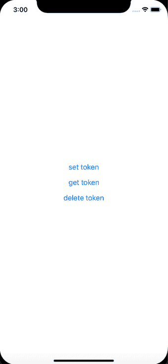
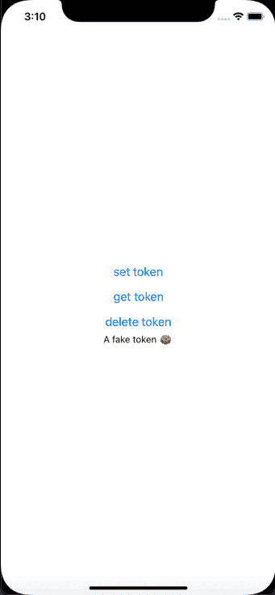

# React Native 和 Expo SecureStore:加密本地数据- LogRocket 博客

> 原文：<https://blog.logrocket.com/encrypted-local-storage-in-react-native/>

## 什么是异步存储？

您可以将 [AsyncStorage](https://reactnative.dev/docs/asyncstorage) 视为 React Native 的本地存储。那是因为它是！正如 React Native 网站上所描述的:“AsyncStorage 是一个未加密的、异步的、持久的、键值存储系统，对应用程序来说是全局的。”

很拗口。但简单来说，它允许你在用户的设备上本地保存数据。比方说，你想回忆用户的主题设置，或者让他们在重启手机或应用程序后回到离开的地方，能够离线保存数据让异步存储成为你最好的朋友！

## 为什么不应该对敏感数据使用异步存储

另一方面，如果您需要存储敏感数据，例如 JWT 令牌，那么异步存储就是那个总是给你带来麻烦的好朋友。请记住，使用 AsyncStorage 保存的数据是不加密的，因此任何有访问权限的人都可以读取它，这对于敏感数据来说不是好事。

## 加密数据存储替代方案

对于敏感信息，我们需要一种加密且安全的方式在本地存储数据。幸运的是，我们有选择:

所有这三个都是很好的选择，但是在本文中，我们将讨论 [Expo SecureStore](https://docs.expo.io/versions/latest/sdk/securestore/) 。

Expo 是一个很棒的 SDK，有几个很棒的库，尽管你需要配置 unimodules 来使用 Expo 和一个裸露的 React 应用程序。但一旦完成，世界就是你的了。

## 创建 React 本机项目

如果你想看看最终的代码，你可以在我的 GitHub 上找到它:

要初始化您的项目，请将以下内容粘贴到“终端”中:

```
npx react-native init yourAppNameHere --template react-native-template-typescript

```

这将使用 TypeScript 模板创建一个新的 React 本机项目。但是不要相信我的话，让我们构建应用程序，自己去看看吧。

```
yarn run ios

```

一段时间后，你会在你的 iOS 模拟器上看到你闪亮的新应用。现在，对于 Android:

```
yarn run android
/pre>
To use Expo packages in a bare React Native project, we first need to install and configure react-native-unimodules. So in your Terminal, type:
```

```
yarn add react-native-unimodules expo-secure-store && cd ios && pod install && cd ..

```

上面的命令将安装库，导航到 iOS 文件夹，安装项目的 CocoaPods，然后导航回项目文件夹。

💡提示:在 package.json 文件中添加一个安装后脚本，以避免手动安装 pod:

```
"scripts": {
    ...
    "postinstall": "cd ios && pod install"
  },

```

## 在 iOS 中开发加密的本地存储

如果您正在向现有项目添加 unimodules，并且，如果您不熟悉原生 iOS 开发，请格外注意您删除和添加新代码行的位置。

点击[此处](https://gist.github.com/claysimps/9d1a30aea24556393dfc379c79bd32d9/revisions)查看变更的完整对比。

### AppDelegate.h

首先，让我们修改以下代码:

```
#import <React/RCTBridgeDelegate.h>
#import <UIKit/UIKit.h>

@interface AppDelegate : UIResponder <UIApplicationDelegate, RCTBridgeDelegate>

@property (nonatomic, strong) UIWindow *window;

@end
```

对此:

```
#import <React/RCTBridgeDelegate.h>
#import <UIKit/UIKit.h>

#import <UMCore/UMAppDelegateWrapper.h>

@interface AppDelegate : UMAppDelegateWrapper <UIApplicationDelegate, RCTBridgeDelegate>

@property (nonatomic, strong) UIWindow *window;

@end
```

## AppDelegate.m

现在，将您的代码从:

```
#import "AppDelegate.h"

#import <React/RCTBridge.h>
#import <React/RCTBundleURLProvider.h>
#import <React/RCTRootView.h>

#ifdef FB_SONARKIT_ENABLED
#import <FlipperKit/FlipperClient.h>
#import <FlipperKitLayoutPlugin/FlipperKitLayoutPlugin.h>
#import <FlipperKitUserDefaultsPlugin/FKUserDefaultsPlugin.h>
#import <FlipperKitNetworkPlugin/FlipperKitNetworkPlugin.h>
#import <SKIOSNetworkPlugin/SKIOSNetworkAdapter.h>
#import <FlipperKitReactPlugin/FlipperKitReactPlugin.h>

static void InitializeFlipper(UIApplication *application) {
FlipperClient *client = [FlipperClient sharedClient];
SKDescriptorMapper *layoutDescriptorMapper = [[SKDescriptorMapper alloc] initWithDefaults];
[client addPlugin:[[FlipperKitLayoutPlugin alloc] initWithRootNode:application withDescriptorMapper:layoutDescriptorMapper]];
[client addPlugin:[[FKUserDefaultsPlugin alloc] initWithSuiteName:nil]];
[client addPlugin:[FlipperKitReactPlugin new]];
[client addPlugin:[[FlipperKitNetworkPlugin alloc] initWithNetworkAdapter:[SKIOSNetworkAdapter new]]];
[client start];
}
#endif

@implementation AppDelegate

- (BOOL)application:(UIApplication *)application didFinishLaunchingWithOptions:(NSDictionary *)launchOptions
{
#ifdef FB_SONARKIT_ENABLED
InitializeFlipper(application);
#endif

RCTBridge *bridge = [[RCTBridge alloc] initWithDelegate:self launchOptions:launchOptions];
RCTRootView *rootView = [[RCTRootView alloc] initWithBridge:bridge
moduleName:@"secureStoreExample"
initialProperties:nil];

rootView.backgroundColor = [[UIColor alloc] initWithRed:1.0f green:1.0f blue:1.0f alpha:1];

self.window = [[UIWindow alloc] initWithFrame:[UIScreen mainScreen].bounds];
UIViewController *rootViewController = [UIViewController new];
rootViewController.view = rootView;
self.window.rootViewController = rootViewController;
[self.window makeKeyAndVisible];
return YES;
}

- (NSURL *)sourceURLForBridge:(RCTBridge *)bridge
{
#if DEBUG
return [[RCTBundleURLProvider sharedSettings] jsBundleURLForBundleRoot:@"index" fallbackResource:nil];
#else
return [[NSBundle mainBundle] URLForResource:@"main" withExtension:@"jsbundle"];
#endif
}

@end
```

对此:

```
#import "AppDelegate.h"

#import <React/RCTBridge.h>
#import <React/RCTBundleURLProvider.h>
#import <React/RCTRootView.h>

#import <UMCore/UMModuleRegistry.h>
#import <UMReactNativeAdapter/UMNativeModulesProxy.h>
#import <UMReactNativeAdapter/UMModuleRegistryAdapter.h>

#ifdef FB_SONARKIT_ENABLED
#import <FlipperKit/FlipperClient.h>
#import <FlipperKitLayoutPlugin/FlipperKitLayoutPlugin.h>
#import <FlipperKitUserDefaultsPlugin/FKUserDefaultsPlugin.h>
#import <FlipperKitNetworkPlugin/FlipperKitNetworkPlugin.h>
#import <SKIOSNetworkPlugin/SKIOSNetworkAdapter.h>
#import <FlipperKitReactPlugin/FlipperKitReactPlugin.h>

static void InitializeFlipper(UIApplication *application) {
  FlipperClient *client = [FlipperClient sharedClient];
  SKDescriptorMapper *layoutDescriptorMapper = [[SKDescriptorMapper alloc] initWithDefaults];
  [client addPlugin:[[FlipperKitLayoutPlugin alloc] initWithRootNode:application withDescriptorMapper:layoutDescriptorMapper]];
  [client addPlugin:[[FKUserDefaultsPlugin alloc] initWithSuiteName:nil]];
  [client addPlugin:[FlipperKitReactPlugin new]];
  [client addPlugin:[[FlipperKitNetworkPlugin alloc] initWithNetworkAdapter:[SKIOSNetworkAdapter new]]];
  [client start];
}
#endif

@interface AppDelegate () <RCTBridgeDelegate>

@property (nonatomic, strong) UMModuleRegistryAdapter *moduleRegistryAdapter;

@end

@implementation AppDelegate

- (BOOL)application:(UIApplication *)application didFinishLaunchingWithOptions:(NSDictionary *)launchOptions
{
#ifdef FB_SONARKIT_ENABLED
  InitializeFlipper(application);
#endif

self.moduleRegistryAdapter = [[UMModuleRegistryAdapter alloc] initWithModuleRegistryProvider:[[UMModuleRegistryProvider alloc] init]];

  RCTBridge *bridge = [[RCTBridge alloc] initWithDelegate:self launchOptions:launchOptions];
  RCTRootView *rootView = [[RCTRootView alloc] initWithBridge:bridge
                                                   moduleName:@"secureStoreExample"
                                            initialProperties:nil];

  rootView.backgroundColor = [[UIColor alloc] initWithRed:1.0f green:1.0f blue:1.0f alpha:1];

  self.window = [[UIWindow alloc] initWithFrame:[UIScreen mainScreen].bounds];
  UIViewController *rootViewController = [UIViewController new];
  rootViewController.view = rootView;
  self.window.rootViewController = rootViewController;
  [self.window makeKeyAndVisible];
  [super application:application didFinishLaunchingWithOptions:launchOptions];
  return YES;
}

- (NSArray<id<RCTBridgeModule>> *)extraModulesForBridge:(RCTBridge *)bridge
{
    NSArray<id<RCTBridgeModule>> *extraModules = [_moduleRegistryAdapter extraModulesForBridge:bridge];
    // If you'd like to export some custom RCTBridgeModules that are not Expo modules, add them here!
    return extraModules;
}

- (NSURL *)sourceURLForBridge:(RCTBridge *)bridge
{
#if DEBUG
  return [[RCTBundleURLProvider sharedSettings] jsBundleURLForBundleRoot:@"index" fallbackResource:nil];
#else
  return [[NSBundle mainBundle] URLForResource:@"main" withExtension:@"jsbundle"];
#endif
}

@end

```

### Podfile

接下来，我们来看看这段代码:

```
require_relative '../node_modules/react-native/scripts/react_native_pods'
require_relative '../node_modules/@react-native-community/cli-platform-ios/native_modules'

platform :ios, '10.0'

target 'secureStoreExample' do
  config = use_native_modules!

  use_react_native!(:path => config["reactNativePath"])

  target 'secureStoreExampleTests' do
    inherit! :complete
    # Pods for testing
  end

  # Enables Flipper.
  #
  # Note that if you have use_frameworks! enabled, Flipper will not work and
  # you should disable these next few lines.
  use_flipper!
  post_install do |installer|
    flipper_post_install(installer)
  end
end

target 'secureStoreExample-tvOS' do
  # Pods for secureStoreExample-tvOS

  target 'secureStoreExample-tvOSTests' do
    inherit! :search_paths
    # Pods for testing
  end
end

```

并将其更改为:

```
require_relative '../node_modules/react-native/scripts/react_native_pods'
require_relative '../node_modules/@react-native-community/cli-platform-ios/native_modules'
require_relative '../node_modules/react-native-unimodules/cocoapods.rb'

platform :ios, '10.0'

target 'secureStoreExample' do
  config = use_native_modules! use_unimodules!

  use_react_native!(:path => config["reactNativePath"])

  target 'secureStoreExampleTests' do
    inherit! :complete
    # Pods for testing
  end

  # Enables Flipper.
  #
  # Note that if you have use_frameworks! enabled, Flipper will not work and
  # you should disable these next few lines.
  use_flipper!
  post_install do |installer|
    flipper_post_install(installer)
  end
end

target 'secureStoreExample-tvOS' do
  # Pods for secureStoreExample-tvOS

  target 'secureStoreExample-tvOSTests' do
    inherit! :search_paths
    # Pods for testing
  end
end
```

既然我们已经对 iOS 文件夹进行了必要的更改，我们需要再次安装我们的 CocoaPods:

```
cd ios && pod install

```

在撰写本文时，最新版本的 Expo SecureStore 与 CocoaPods 不兼容。如果您遇到此问题，请安装以前的版本。就我而言:

```
yarn add [email protected] && cd ios && pod install && cd ..

```

## 机器人

点击[此处](https://gist.github.com/claysimps/deb23e21905298f2e9088e8df2e063e9/revisions)查看变更的完整对比。

### android/build.gradle

让我们从下面更新代码。

```
// Top-level build file where you can add configuration options common to all sub-projects/modules.

buildscript {
    ext {
        buildToolsVersion = "29.0.2"
        minSdkVersion = 16
        compileSdkVersion = 29
        targetSdkVersion = 29
    }
    repositories {
        google()
        jcenter()
    }
    dependencies {
        classpath("com.android.tools.build:gradle:3.5.3")
        // NOTE: Do not place your application dependencies here; they belong
        // in the individual module build.gradle files
    }
}

allprojects {
    repositories {
        mavenLocal()
        maven {
            // All of React Native (JS, Obj-C sources, Android binaries) is installed from npm
            url("$rootDir/../node_modules/react-native/android")
        }
        maven {
            // Android JSC is installed from npm
            url("$rootDir/../node_modules/jsc-android/dist")
        }

        google()
        jcenter()
        maven { url 'https://www.jitpack.io' }
    }
}

```

并将其更改为:

```
// Top-level build file where you can add configuration options common to all sub-projects/modules.

buildscript {
    ext {
        buildToolsVersion = "29.0.2"
        minSdkVersion = 21
        compileSdkVersion = 29
        targetSdkVersion = 29
    }
    repositories {
        google()
        jcenter()
    }
    dependencies {
        classpath("com.android.tools.build:gradle:3.5.3")
        // NOTE: Do not place your application dependencies here; they belong
        // in the individual module build.gradle files
    }
}

allprojects {
    repositories {
        mavenLocal()
        maven {
            // All of React Native (JS, Obj-C sources, Android binaries) is installed from npm
            url("$rootDir/../node_modules/react-native/android")
        }
        maven {
            // Android JSC is installed from npm
            url("$rootDir/../node_modules/jsc-android/dist")
        }

        google()
        jcenter()
        maven { url 'https://www.jitpack.io' }
    }
}
```

### android/app/build.gradle

由此可知:

```
apply plugin: "com.android.application"

import com.android.build.OutputFile

....
//roughly line 183
dependencies {
    implementation fileTree(dir: "libs", include: ["*.jar"])
    //noinspection GradleDynamicVersion
    implementation "com.facebook.react:react-native:+"  // From node_modules

    implementation "androidx.swiperefreshlayout:swiperefreshlayout:1.0.0"

    debugImplementation("com.facebook.flipper:flipper:${FLIPPER_VERSION}") {
      exclude group:'com.facebook.fbjni'
    }

    debugImplementation("com.facebook.flipper:flipper-network-plugin:${FLIPPER_VERSION}") {
        exclude group:'com.facebook.flipper'
        exclude group:'com.squareup.okhttp3', module:'okhttp'
    }

    debugImplementation("com.facebook.flipper:flipper-fresco-plugin:${FLIPPER_VERSION}") {
        exclude group:'com.facebook.flipper'
    }

    if (enableHermes) {
        def hermesPath = "../../node_modules/hermes-engine/android/";
        debugImplementation files(hermesPath + "hermes-debug.aar")
        releaseImplementation files(hermesPath + "hermes-release.aar")
    } else {
        implementation jscFlavor
    }
}

```

对此:

```
apply plugin: "com.android.application"
apply from: '../../node_modules/react-native-unimodules/gradle.groovy'

import com.android.build.OutputFile

...
//roughly line 184:
dependencies {
    implementation fileTree(dir: "libs", include: ["*.jar"])
    //noinspection GradleDynamicVersion
    implementation "com.facebook.react:react-native:+"  // From node_modules

    implementation "androidx.swiperefreshlayout:swiperefreshlayout:1.0.0"
// Add this line here addUnimodulesDependencies()
addUnimodulesDependencies()

    debugImplementation("com.facebook.flipper:flipper:${FLIPPER_VERSION}") {
      exclude group:'com.facebook.fbjni'
    }

    debugImplementation("com.facebook.flipper:flipper-network-plugin:${FLIPPER_VERSION}") {
        exclude group:'com.facebook.flipper'
        exclude group:'com.squareup.okhttp3', module:'okhttp'
    }

    debugImplementation("com.facebook.flipper:flipper-fresco-plugin:${FLIPPER_VERSION}") {
        exclude group:'com.facebook.flipper'
    }

    if (enableHermes) {
        def hermesPath = "../../node_modules/hermes-engine/android/";
        debugImplementation files(hermesPath + "hermes-debug.aar")
        releaseImplementation files(hermesPath + "hermes-release.aar")
    } else {
        implementation jscFlavor
    }
}
```

### android/settings.gradle

现在，让我们从:

```
rootProject.name = 'secureStoreExample'
apply from: file("../node_modules/@react-native-community/cli-platform-android/native_modules.gradle"); applyNativeModulesSettingsGradle(settings)
include ':app'
```

对此:

```
rootProject.name = 'secureStoreExample'
apply from: '../node_modules/react-native-unimodules/gradle.groovy'; includeUnimodulesProjects()
apply from: file("../node_modules/@react-native-community/cli-platform-android/native_modules.gradle"); applyNativeModulesSettingsGradle(settings)
include ':app'
```

### Android/app/src/main/Java/com/your app name/main application . Java

将您的代码从:

```
package com.securestoreexample;

import android.app.Application;
import android.content.Context;
import com.facebook.react.PackageList;
import com.facebook.react.ReactApplication;
import com.facebook.react.ReactInstanceManager;
import com.facebook.react.ReactNativeHost;
import com.facebook.react.ReactPackage;
import com.facebook.soloader.SoLoader;
import java.lang.reflect.InvocationTargetException;
import java.util.List;

public class MainApplication extends Application implements ReactApplication {

  private final ReactNativeHost mReactNativeHost =
      new ReactNativeHost(this) {
        @Override
        public boolean getUseDeveloperSupport() {
          return BuildConfig.DEBUG;
        }

        @Override
        protected List<ReactPackage> getPackages() {
          @SuppressWarnings("UnnecessaryLocalVariable")
          List<ReactPackage> packages = new PackageList(this).getPackages();
          // Packages that cannot be autolinked yet can be added manually here, for example:
          // packages.add(new MyReactNativePackage());
          return packages;
        }

        @Override
        protected String getJSMainModuleName() {
          return "index";
        }
      };
...

```

收件人:

```
package com.securestoreexample;

import com.secureStoreExample.generated.BasePackageList;

import android.app.Application;
import android.content.Context;
import com.facebook.react.PackageList;
import com.facebook.react.ReactApplication;
import com.facebook.react.ReactInstanceManager;
import com.facebook.react.ReactNativeHost;
import com.facebook.react.ReactPackage;
import com.facebook.soloader.SoLoader;
import java.lang.reflect.InvocationTargetException;
import java.util.List;

import java.util.Arrays;

import org.unimodules.adapters.react.ModuleRegistryAdapter;
import org.unimodules.adapters.react.ReactModuleRegistryProvider;
import org.unimodules.core.interfaces.SingletonModule;
public class MainApplication extends Application implements ReactApplication {
  private final ReactModuleRegistryProvider mModuleRegistryProvider = new ReactModuleRegistryProvider(new BasePackageList().getPackageList(), null);

  private final ReactNativeHost mReactNativeHost =
      new ReactNativeHost(this) {
        @Override
        public boolean getUseDeveloperSupport() {
          return BuildConfig.DEBUG;
        }

        @Override
        protected List<ReactPackage> getPackages() {
          @SuppressWarnings("UnnecessaryLocalVariable")
          List<ReactPackage> packages = new PackageList(this).getPackages();
          // Packages that cannot be autolinked yet can be added manually here, for example:
          // packages.add(new MyReactNativePackage());
          // Add unimodules
          List<ReactPackage> unimodules = Arrays.<ReactPackage>asList(
            new ModuleRegistryAdapter(mModuleRegistryProvider)
          );
          packages.addAll(unimodules);
          return packages;
        }

        @Override
        protected String getJSMainModuleName() {
          return "index";
        }
      };
...

```

## Expo SecureStore API

SecureStore 有三个主要的 API 方法:set、get 和 delete。让我们清除 App.tsx 文件并研究它们。首先，将 App.tsx 的内容替换为:

```
import React, {useState} from 'react';
import {SafeAreaView, StyleSheet, StatusBar, Button, Text} from 'react-native';

const App = () => {

  return (
    <>
      <StatusBar barStyle="dark-content" />
      <SafeAreaView style={styles.container}>
        <Button title="set token" onPress={() => {}} />
        <Button title="get token" onPress={() => {}} />
        <Button title="delete token" onPress={() => {}} />
        <Text>Token will appear here</Text>
      </SafeAreaView>
    </>
  );
};

const styles = StyleSheet.create({
  container: {
    flex: 1,
    justifyContent: 'center',
    alignItems: 'center',
  },
});

export default App;
```



这为我们在屏幕中间提供了三个按钮。他们现在什么都不做，所以让我们来解决这个问题吧！像 AsyncStorage 一样，SecureStore 使用键-值对，并且当我们使用 TypeScript 时，我们可以利用枚举:

```
import React, {useState} from 'react';
import {SafeAreaView, StyleSheet, StatusBar, Button, Text} from 'react-native';

export enum SecureStoreEnum {
  TOKEN = 'token',
}

const App = () => {
  return (
    <>
      <StatusBar barStyle="dark-content" />
      <SafeAreaView style={styles.container}>
        <Button title="set token" onPress={() => {}} />
        <Button title="get token" onPress={() => {}} />
        <Button title="delete token" onPress={() => {}} />
        <Text>{token}</Text>
      </SafeAreaView>
    </>
  );
};

const styles = StyleSheet.create({
  container: {
    flex: 1,
    justifyContent: 'center',
    alignItems: 'center',
  },
});

export default App;
```

我们使用这个枚举(键)来配对我们要存储在设备上的值。

接下来，我们将配置一个 useState 钩子来存储我们的状态变量——从我们的设备中检索的值——以及我们将要存储的模拟变量。

```
import React, {useState} from 'react';
import {SafeAreaView, StyleSheet, StatusBar, Button, Text} from 'react-native';

export enum SecureStoreEnum {
  TOKEN = 'token',
}

const App = () => {
  const [token, setToken] = useState<string>('');
  const fakeToken = 'A fake token 🍪';

  return (
    <>
      <StatusBar barStyle="dark-content" />
      <SafeAreaView style={styles.container}>
        <Button title="set token" onPress={() => {}} />
        <Button title="get token" onPress={() => {}} />
        <Button title="delete token" onPress={() => {}} />
        <Text>{token}</Text>
      </SafeAreaView>
    </>
  );
};

const styles = StyleSheet.create({
  container: {
    flex: 1,
    justifyContent: 'center',
    alignItems: 'center',
  },
});

export default App;
```

你可以在这个[要点](https://gist.github.com/claysimps/bc943ad58e6bf0e7abd0635965537d22)中查看代码。

## SecureStore.setItemAsync (key，value)；

好了，一切都准备好了，现在我们真的要用煤气做饭了！是时候玩 SecureStore 了。😃

因为 SecureStore 是异步的，所以我们需要在异步函数中调用它。将以下内容添加到 App.tsx:

```
import React, {useState} from 'react';
import {
  SafeAreaView,
  StyleSheet,
  StatusBar,
  Button,
  Text,
  Alert,
} from 'react-native';
import * as SecureStore from 'expo-secure-store';

export enum SecureStoreEnum {
  TOKEN = 'token',
}

const App = () => {
  const [token, setToken] = useState<string>('');
  const fakeToken = 'A fake token 🍪';

  const handleSetToken = async () => {
    SecureStore.setItemAsync(SecureStoreEnum.TOKEN, fakeToken).then;
    setToken(fakeToken);
  };

  return (
    <>
      <StatusBar barStyle="dark-content" />
      <SafeAreaView style={styles.container}>
        <Button title="set token" onPress={handleSetToken} />
        <Button title="get token" onPress={() => {}} />
        <Button title="delete token" onPress={() => {}} />
        <Text>{token}</Text>
      </SafeAreaView>
    </>
  );
};

const styles = StyleSheet.create({
  container: {
    flex: 1,
    justifyContent: 'center',
    alignItems: 'center',
  },
});

export default App;
```

`setItemAsync`使用我们之前创建的枚举作为我们正在保存的值`A fake token 🍪`的键。然后，它等待函数完成。一旦我们的异步函数完成，我们用`setToken`将同一个变量保存到我们的 useState 钩子中。

现在，如果您单击设置令牌，您将看到我们的假令牌出现在三个按钮下方。



## securestore . getitem async(key)；

接下来，我们将为“get token”按钮提供一些功能，以便我们可以检索存储在设备上的值。复制并粘贴到 App.tsx:

```
import React, {useState} from 'react';
import {
  SafeAreaView,
  StyleSheet,
  StatusBar,
  Button,
  Text,
  Alert,
} from 'react-native';
import * as SecureStore from 'expo-secure-store';

export enum SecureStoreEnum {
  TOKEN = 'token',
}

const App = () => {
  const [token, setToken] = useState<string>('');
  const fakeToken = 'A fake token 🍪';

  const handleSetToken = async () => {
    await SecureStore.setItemAsync(SecureStoreEnum.TOKEN, fakeToken);
    setToken(fakeToken);
  };

  const handleGetToken = async () => {
    const tokenFromPersistentState = await SecureStore.getItemAsync(
      SecureStoreEnum.TOKEN,
    );
    if (tokenFromPersistentState) {
      Alert.alert(
        "This token is stored on your device, isn't that cool!:",
        tokenFromPersistentState,
      );
    }
  };

  return (
    <>
      <StatusBar barStyle="dark-content" />
      <SafeAreaView style={styles.container}>
        <Button title="set token" onPress={handleSetToken} />
        <Button title="get token" onPress={handleGetToken} />
        <Button title="delete token" onPress={() => {}} />
        <Text>{token}</Text>
      </SafeAreaView>
    </>
  );
};

const styles = StyleSheet.create({
  container: {
    flex: 1,
    justifyContent: 'center',
    alignItems: 'center',
  },
});

export default App;
```

我们在第 29 行使用了一个 if 语句，以确保只有在检索到一个值时，警告框才会打开。

现在魔术:关闭您的应用程序或重启您的设备，并点击获取令牌。哒哒！你的令牌回来了。


## securestore . deleteitemsync(key)；

如果这是一个真实的应用程序，我们需要能够在用户注销时删除他们的令牌。最后一段代码，我保证😇。

```
import React, {useState} from 'react';
import {
  SafeAreaView,
  StyleSheet,
  StatusBar,
  Button,
  Text,
  Alert,
} from 'react-native';
import * as SecureStore from 'expo-secure-store';

export enum SecureStoreEnum {
  TOKEN = 'token',
}

const App = () => {
  const [token, setToken] = useState<string>('');
  const fakeToken = 'A fake token 🍪';

  const handleSetToken = async () => {
    await SecureStore.setItemAsync(SecureStoreEnum.TOKEN, fakeToken);
    setToken(fakeToken);
  };

  const handleGetToken = async () => {
    const tokenFromPersistentState = await SecureStore.getItemAsync(
      SecureStoreEnum.TOKEN,
    );
    if (tokenFromPersistentState) {
      Alert.alert(
        "This token is stored on your device, isn't that cool!:",
        tokenFromPersistentState,
      );
    }
  };

  const handleDeleteToken = async () => {
    await SecureStore.deleteItemAsync(SecureStoreEnum.TOKEN);
    setToken('');
  };

  return (
    <>
      <StatusBar barStyle="dark-content" />
      <SafeAreaView style={styles.container}>
        <Button title="set token" onPress={handleSetToken} />
        <Button title="get token" onPress={handleGetToken} />
        <Button title="delete token" onPress={handleDeleteToken} />
        <Text>{token}</Text>
      </SafeAreaView>
    </>
  );
};

const styles = StyleSheet.create({
  container: {
    flex: 1,
    justifyContent: 'center',
    alignItems: 'center',
  },
});

export default App;
```

这里，第 37 行的`handleDeleteToken`删除令牌，然后将令牌状态设置为空字符串(初始状态)。

现在您的数据是安全和加密的！

## [LogRocket](https://lp.logrocket.com/blg/react-native-signup) :即时重现 React 原生应用中的问题。

[](https://lp.logrocket.com/blg/react-native-signup)

[LogRocket](https://lp.logrocket.com/blg/react-native-signup) 是一款 React 原生监控解决方案，可帮助您即时重现问题、确定 bug 的优先级并了解 React 原生应用的性能。

LogRocket 还可以向你展示用户是如何与你的应用程序互动的，从而帮助你提高转化率和产品使用率。LogRocket 的产品分析功能揭示了用户不完成特定流程或不采用新功能的原因。

开始主动监控您的 React 原生应用— [免费试用 LogRocket】。](https://lp.logrocket.com/blg/react-native-signup)