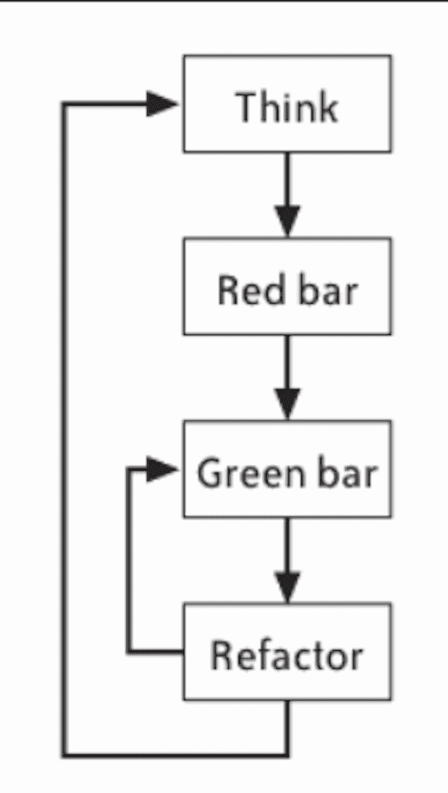
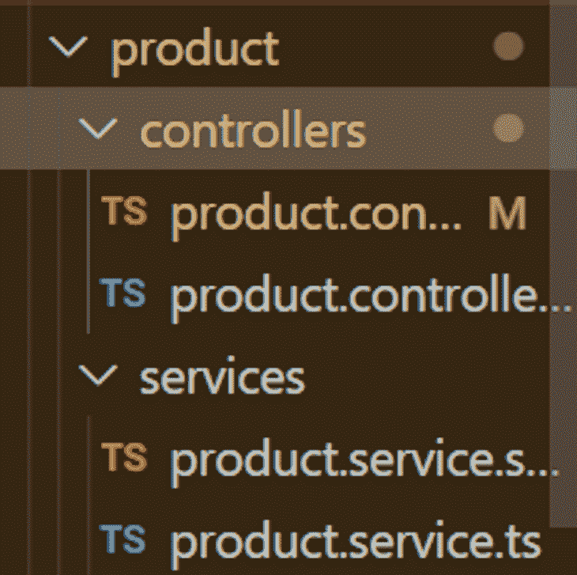
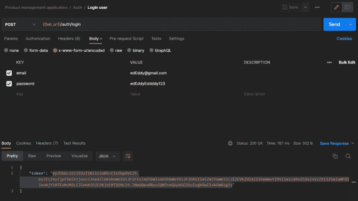
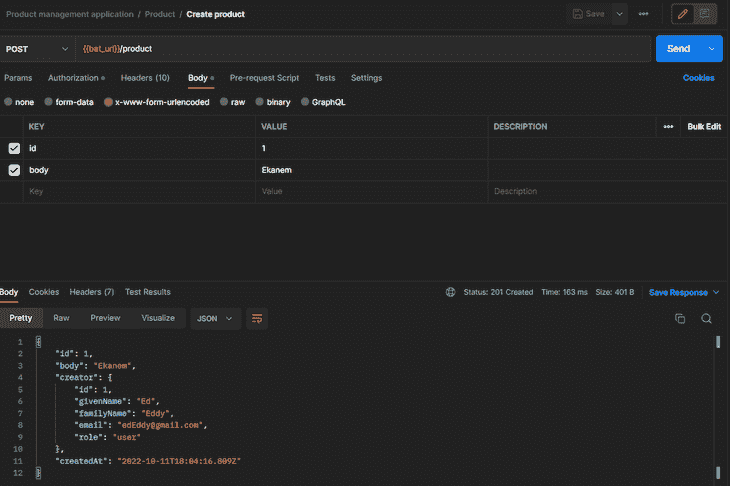
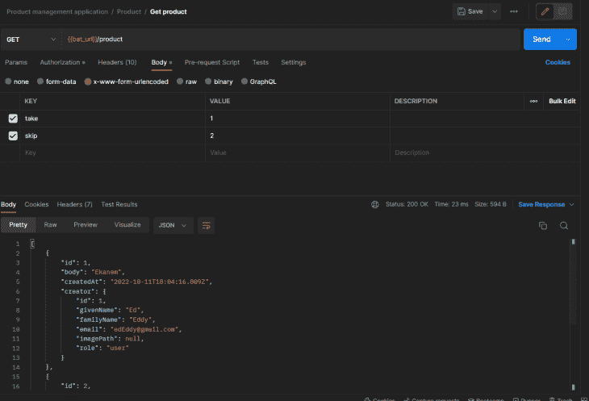
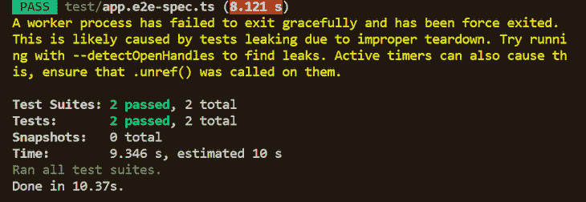

# 使用 TypeORM 在 NestJS 中进行端到端测试

> 原文：<https://blog.logrocket.com/end-end-testing-nestjs-typeorm/>

质量保证策略是软件开发的一个关键方面。高端测试，比如单元测试和端到端测试，是 QA 策略的重要方面。

在这篇文章中，我们的重点将是在 [NestJS](https://nestjs.com/) 中创建端到端测试。NestJS 自带 Jest 和 Supertest 来创建单元测试。我们将探索测试驱动开发和开发单元测试背后的思维过程。

我们将使用单元测试来指导 API 中产品创建特性的开发，而端到端测试将模拟应用程序的最终用户。在我们的应用程序中，TypeORM 和 [PostgreSQL](https://www.postgresql.org/) 提供了数据库连接。

NestJS 为构建服务器端应用程序提供了一个框架。NestJS 依赖于 TypeScript 和依赖注入，使开发人员能够编写测试。NestJS CLI scaffolds 项目支持创建控制器和服务，并在创建服务器或控制器时生成测试文件。

*向前跳转:*

## 什么是测试驱动开发？

测试驱动开发(TDD)使开发人员能够在测试的指导下构建软件。这使得快速测试、编码和重构成为可能。Kent Beck 在 20 世纪 90 年代晚期开发了 TDD。

遵循测试驱动开发有三个简单的规则:

1.  为下一个功能编写一个测试
2.  在测试通过之前，代码必须是有效的
3.  重构对于确保新旧代码结构良好至关重要

实践时，测试驱动开发提供了很大的优势。使用 TDD 的开发人员必须对代码的接口建模，这使得接口与实现分离。测试是从类的公共接口的角度创建的，这意味着关键的焦点是类的行为而不是实现。

在生产管道中，这些测试几乎在每个构建上运行，确保代码的行为。如果一个团队成员对代码进行了修改，从而改变了行为，那么测试就会失败，发出出错的信号。这节省了调试时间。

下图强调了测试驱动开发背后的理念:



要使用 TDD，“红”、“绿”和“重构”循环是强制性的。该循环将一直运行，直到新特性准备好并且所有测试都通过。

让我们探索 TDD 方法背后的步骤。

## 测试驱动的开发步骤

### 1.想

TDD 的要点是创建小的测试并编写迫使测试通过的代码。迭代过程一直持续到特征完成。在“思考”步骤中，重要的是想象并注意代码应该表现出什么行为。需要最少代码行的最小增量是关键——您可以创建一个小的测试单元，直到行为以这种方式出现。

### 2.红色酒吧

在红色条中，存在的单元测试应该覆盖行为的当前增量。测试可以包含尚不存在的方法和类名。类接口的设计是从类用户的角度创建的。

一旦测试就绪，并且您运行了整个套件，新的测试应该会失败。在大多数 TDD 测试工具中，失败的测试会产生一个红条，在这里我们可以深入了解失败的原因。

### 3.绿色条

在这一步中，我们将重点放在编写生产就绪代码以通过测试。一旦测试运行，我们的结果应该是一个绿色的进度条，这取决于正在使用的 TDD 测试工具。绿条步骤提供了另一个机会来对照现实检查我们的意图。

## 创建我们的应用程序

用 [NestJS CLI](https://docs.nestjs.com/cli/overview) 创建一个 NestJS 项目。我们将创建一个产品管理应用程序。

### 先决条件

*   npm :用于向公共 npm 注册中心发布和安装软件包
*   [Node.js](https://nodejs.org/en/) v ≥ 12，v 13 除外

### 安装 NestJS CLI

运行以下命令安装 NestJS CLI:

```
$ npm install -g @nestjs/cli
```

### 创建我们的单元测试

我们将要测试的代码库可以在 GitHub 库中找到。克隆并导航到项目的根目录。

根据包管理器，运行以下命令。

对于纱线:

```
$ yarn
```

对于国家预防机制:

```
$ npm install
```

安装完依赖项后，使用下面的命令启动项目。

```
$ yarn start:dev
```

如果没有依赖问题或错误，项目应该在终端中开始:


## 用 TDD 开发我们的产品 API

产品控制器处理产品的创建并检索产品。

使用终端，使用 CLI 工具创建产品控制器和服务。控制器和服务现在可以使用测试文件了。

```
$ nest g controller product
$ nest g service product
```

当使用 Nest CLI 创建控制器和服务时，会创建一个附带的测试文件:



我们希望产品控制者的第一个行为是创造新产品的能力。为了考虑产品表中的数据结构，让我们创建一个产品接口和实体对象。

在终端窗口中写入以下内容:

```
$ mkdir src/product/models
$ touch src/product/models/product.interface.ts
$ touch src/product/models/product.entity.ts
$ code src/product/models/product.entity.ts
```

最后一个脚本在代码编辑器中打开`product.entity.ts`文件。将以下代码复制并粘贴到文件中:

```
import {
  Column,
  CreateDateColumn,
  Entity,
  ManyToOne,
  PrimaryGeneratedColumn,
} from "typeorm";
import { UserEntity } from "../../auth/models/user.entity";

@Entity("product")
export class ProductEntity {
  @PrimaryGeneratedColumn()
  id: number;

  @Column({ default: "" })
  body: string;

  @CreateDateColumn()
  createdAt: Date;

  @ManyToOne(() => UserEntity, (userEntity) => userEntity.products)
  creator: UserEntity;
}

```

用下面的命令在代码编辑器中打开`product.entity.ts`文件:

```
$ code src/product/models/product.interface.ts
```

将下面的代码块粘贴到`product.interface.ts`文件中:

```
import { User } from "src/auth/models/user.class";

export interface Product {
  id?: number;
  body?: string;
  createdAt: Date;
  creator?: User;
}

```

### 创建产品特征

在我们创建产品创建路线之前，需要有一个单元测试。这个单元测试确认了函数的实现。

在终端窗口中，运行以下命令，在代码编辑器中打开测试文件:

```
$ code src/product/controllers/product.controller.spec.ts
```

我们的第一个测试需要确认产品创建服务创建了一个产品。测试模拟`UserService`和`ProductService`。Jest 创建了服务中函数实现的模拟。

在`product.controller.spec.ts`中实现的`describe`块可用。打造产品服务的`mockImplementation`；这是`createProduct`实现的宿主。这个`createProduct`方法接受一个请求并返回一个创建的产品和 ID。

* * *

### 更多来自 LogRocket 的精彩文章:

* * *

为了帮助模仿 HTTP 对象，我们将使用`[node-mocks-http library](https://www.npmjs.com/package/node-mocks-http)`。将以下代码添加到我们的`product.controller.spec.ts`文件中:

```
import { Test, TestingModule } from "@nestjs/testing";
import { DeleteResult, UpdateResult } from "typeorm";
import { User } from "../../auth/models/user.class";
import { JwtGuard } from "../../auth/guards/jwt.guard";
import { UserService } from "../../auth/services/user.service";
import { ProductController } from "./product.controller";
import { ProductService } from "../services/product.service";
import { Product } from "../models/product.interface";

const httpMocks = require("node-mocks-http");

describe("ProductController", () => {
  let productController: ProductController;

  const mockRequest = httpMocks.createRequest();
  mockRequest.user = new User();
  mockRequest.user = "DUE";

 const mockProduct: Product = {
    body: "nivea",
    createdAt: new Date(),
    creator: mockRequest.user,
  };

  const mockProductService = {
    createProduct: jest
      .fn()
      .mockImplementation((user: User, product: Product) => {
        return {
          id: 1,
          ...product,
        };
      })
  };
  const mockUserService = {};

  // create fake module
  beforeEach(async () => {
    const moduleRef: TestingModule = await Test.createTestingModule({
      controllers: [ProductController],
      providers: [
        ProductService,
        { provide: UserService, useValue: mockUserService },
        {
          provide: JwtGuard,
          useValue: jest.fn().mockImplementation(() => true),
        },
      ],
    })
      .overrideProvider(ProductService)
      .useValue(mockProductService)
      .compile();

    productController = moduleRef.get<ProductController>(ProductController);
  });
});

```

为了结束单元测试，需要设置动作及其响应。将以下代码粘贴在`describe`函数的末尾。

```
 it("should create a product", () => {
    expect(productController.create(mockProduct, mockRequest)).toEqual({
      id: expect.any(Number),
      ...mockProduct,
    });
  });

```

在`product.controller.ts`文件中，设置`create`方法。导入依赖项、产品界面和产品实体。

```
import { Body, Controller, Post, Request, UseGuards } from "@nestjs/common";
import { Observable } from "rxjs";

import { JwtGuard } from "../auth/guards/jwt.guard";
import { Product } from "../product/models/product.interface";
import { ProductService } from "../product/services/product.service";

@Controller("product")
export class ProductController {
  constructor(private productService: ProductService) {}
  @UseGuards(JwtGuard)
  @Post()
  create(@Body() product: Product, @Request() req): Observable<Product> {
    return this.productService.createProduct(req.user, product);
  }
}

```

### 运行第一个单元测试

在新的终端窗口中，使用以下命令运行创建的测试:

```
$ yarn test product.controller
```

测试应该会失败，因为实现还没有完成。这为我们如何利用 TDD 来改进我们的开发和捕获 bug 提供了洞察力。我们的测试失败了，因为这个方法不在`product.service.ts`文件中。


在终端窗口中，打开`product.service.ts`文件并粘贴下面的代码块:

```
import { Inject, Injectable } from "@nestjs/common";
import { InjectRepository } from "@nestjs/typeorm";
import { from, Observable } from "rxjs";
import { DeleteResult, Repository, UpdateResult } from "typeorm";

import { User } from "src/auth/models/user.class";
import { ProductEntity } from "../models/product.entity";
import { Product } from "../models/product.interface";

@Injectable()
export class ProductService {
  constructor(
    @InjectRepository(ProductEntity)
    private readonly productRepository: Repository<ProductEntity>
  ) {}

  createProduct(user: User, product: Product): Observable<Product> {
    product.creator = user;
    return from(this.productRepository.save(product));
  }
}

```

在终端窗口中，使用以下命令重新运行`product.controller`测试:

```
$ yarn test product.controller
```

通过在我们的服务类中添加`createProduct`方法来解决这个问题。


这个周期对于开发应用程序中的新功能来说更长。这个循环保证了创建的方法是经过深思熟虑的。

### 使用 NestJS 应用程序创建创建产品功能

Create Product route 有一个用于保护的 AuthGuard，因此为了测试它，我们需要创建一个用户和登录凭证。登录后，令牌会对创建产品的用户进行身份验证。

下面的截图显示了如何注册和登录用户。


如何注册用户:



用户登录后，检索令牌并使用它来创建产品。



**创建产品**功能运行顺畅。👌

### 创建获取产品特征

在这里，我们将探索我们刚刚用来创建 Get Product 特性的 TDD 技术。“获取产品”功能允许根据输入值检索产品。

在`product.controller.spec.ts`文件中，传播一个单元测试来测试检索项目的行为。

在`product.controller.spec.ts`文件中，创建一个新的模拟请求，作为请求中预期对象的表示，然后创建一个`mockProducts`变量。

```
const mockProducts: Product[] = [
    mockProduct,
    { ...mockProduct, body: "Vanilla" },
    { ...mockProduct, body: "Ice" },
  ];

```

`mockProductService`对象拥有一个新方法，可以在检索期间接收值。

```
  const mockProductService = {
    createProduct: jest
      .fn()
      .mockImplementation((user: User, product: Product) => {
        return {
          id: 1,
          ...product,
        };
      }),
    findProducts: jest
      .fn()
      .mockImplementation((numberToTake: number, numberToSkip: number) => {
        const productsAfterSkipping = mockProducts.slice(numberToSkip);
        const filteredProducts = productsAfterSkipping.slice(0, numberToTake);
        return filteredProducts;
      }),
  };

```

下一步是定义我们想要运行的测试。我们的`take`和`skip`值分别是`2`和`1`。这些值用作参数。

```
 it("should get 2 products, skipping the first", () => 
    expect(productController.findSelected(2, 1)).toEqual(mockProducts.slice(1));
  });

```

运行测试。它应该会失败，因为控制器中没有必要的方法。

在`product.controller.ts`文件中，创建`GET`路线:

```
import {
  Body,
  Controller,
  Get,
  Param,
  Post,
  Query,
  Req,
  Request,
  Res,
  UseGuards,
} from "@nestjs/common";
import { Observable } from "rxjs";
import { JwtGuard } from "../../auth/guards/jwt.guard";
import { Product } from "../models/product.interface";
import { ProductService } from "../services/product.service";

@Controller("product")
export class ProductController {
  constructor(private productService: ProductService) {}

  @UseGuards(JwtGuard)
  @Post()
  create(@Body() product: Product, @Request() req): Observable<Product> {
    return this.productService.createProduct(req.user, product);
  }

  @UseGuards(JwtGuard)
  @Get()
  findSelected(
    @Query("take") take: number = 1,
    @Query("skip") skip: number = 1
  ): Observable<Product[]> {
    take = take > 20 ? 20 : take;
    return this.productService.findProducts(take, skip);
  }
}

```

在`product.service.ts`文件中，定义`findProduct`方法；`findSelected`路线调用这个方法。

```
import { Inject, Injectable } from "@nestjs/common";
import { InjectRepository } from "@nestjs/typeorm";
import { from, Observable } from "rxjs";
import  Repository} from "typeorm";

import { User } from "src/auth/models/user.class";
import { ProductEntity } from "../models/product.entity";
import { Product } from "../models/product.interface";

@Injectable()
export class ProductService {
  constructor(
    @InjectRepository(ProductEntity)
    private readonly productRepository: Repository<ProductEntity>
  ) {}

  createProduct(user: User, product: Product): Observable<Product> {
    product.creator = user;
    return from(this.productRepository.save(product));
  }

  findProducts(take: number = 10, skip: number = 0): Observable<Product[]> {
    return from(
      this.productRepository
        .createQueryBuilder("product")
        .innerJoinAndSelect("product.creator", "creator")
        .orderBy("product.createdAt", "DESC")
        .take(take)
        .skip(skip)
        .getMany()
    );
  }
} 

```

在终端窗口中，运行`product.controller.spec`测试。

```
$ yarn test product.controller
```

我们的测试成功通过。


### 使用 NestJS 应用程序检索产品

令牌在收到成功登录后对路由进行身份验证。这条路线可以检索已创建产品的列表。



## 什么是端到端测试？

端到端测试套件使开发人员能够测试软件产品。该测试的最终目标是确保应用程序的行为符合预期。

模拟用户如何在端到端测试套件中与应用程序交互是关键。该模拟使开发人员能够确认系统在测试中是如何运行的。我们将为认证控制器建立一个端到端的测试套件。

## NestJS 中的端到端测试

默认情况下，NestJS 提供 E2E 测试。为了创建应用程序的实例，我们依赖 Supertest。 [Supertest](https://www.npmjs.com/package/supertest) 支持在我们的应用程序中检测端点并创建请求。

创建 E2E 测试时，有两种方法可供探索:

1.  模拟所有测试模块，然后调用控制器和服务
2.  用数据库测试端点

我们的方法支持对 API 端点的直接请求。

## 在身份验证控制器上创建端到端测试

在 auth controller 中，注册用户和登录的 E2E 测试的实现是关键。一个文件保存了我们需要的 E2E 测试。

在根目录中，找到测试文件夹，并创建一个`auth.e2e-spec.ts`文件。`authController`的`describe`方法和认证 URL 将与我们的 E2E 测试一起保存在这个文件中。

```
$ touch test/auth.e2e-spec.ts
$ code test/auth.e2e-spec.ts
```

将下面的代码块粘贴到`auth.e2e-spec.ts`文件中:

```
import { HttpStatus } from '@nestjs/common';

import * as jwt from 'jsonwebtoken';
import * as request from 'supertest';

import { User } from '../src/auth/models/user.class';

describe('AuthController (e2e)', () => {
      const authUrl = `http://localhost:3000/api/auth`;
});

```

测试注册服务和控制器，以检查注册后的`user`对象。

下面的代码块是要测试的`registerAccount`方法。

```
 doesUserExist(email: string): Observable<boolean> {
    return from(this.userRepository.findOne({ email })).pipe(
      switchMap((user: User) => {
        return of(!!user);
      })
    );
  }

registerAccount(user: User): Observable<User> {
    const { givenName, familyName, email, password } = user;

    return this.doesUserExist(email).pipe(
      tap((doesUserExist: boolean) => {
        if (doesUserExist)
          throw new HttpException(
            "A user has already been created with this email address",
            HttpStatus.BAD_REQUEST
          );
      }),
      switchMap(() => {
        return this.hashPassword(password).pipe(
          switchMap((hashedPassword: string) => {
            return from(
              this.userRepository.save({
                givenName,
                familyName,
                email,
                password: hashedPassword,
              })
            ).pipe(
              map((user: User) => {
                delete user.password;
                return user;
              })
            );
          })
        );
      })
    );
  }

```

上面的代码片段提供了注册用户所需变量的信息。返回的用户对象表示在客户端应用程序中收到的响应。

在`describe`块中，有一个嵌套的`describe`块，用于定位`'/auth/register/'`端点。在`it`块中，创建一个请求，并作为响应的一部分返回 mockUser 对象。`expect`变量是检查响应有效性的关键。

```
import { HttpStatus } from "@nestjs/common";

import * as jwt from "jsonwebtoken";
import * as request from "supertest";

import { User } from "../src/auth/models/user.class";

describe("AuthController (e2e)", () => {
  const authUrl = `http://localhost:6000/auth`;

  const mockUser: User = {
    givenName: "givenName",
    familyName: "familyName",
    email: "[email protected]",
    password: "password",
  };

  describe("/auth/register (POST)", () => {
    it("it should register a user and return the new user object", () => {
      return request(authUrl)
        .post("/register")
        .set("Accept", "application/json")
        .send(mockUser)
        .expect((response: request.Response) => {
          const {
            id,
            givenName,
            familyName,
            password,
            email,
            imagePath,
            role,
          } = response.body;

          expect(typeof id).toBe("number"),
            expect(givenName).toEqual(mockUser.givenName),
            expect(familyName).toEqual(mockUser.familyName),
            expect(email).toEqual(mockUser.email),
            expect(password).toBeUndefined();
          expect(imagePath).toBeNull();
          expect(role).toEqual("user");
        })
        .expect(HttpStatus.CREATED);
    });
  });
});

```

运行测试:

```
$ yarn run test:e2e
```

端点上的测试结果如下。



### 测试注册服务，以确保新用户没有使用现有的电子邮件注册

创建另一个`it`函数来检查注册时使用现有电子邮件是否会触发错误请求。

```
it('it should not register a new user if the passed email already exists', () => {
      return request(authUrl)
        .post('/register')
        .set('Accept', 'application/json')
        .send(mockUser)
        .expect(HttpStatus.BAD_REQUEST);
    });

```

运行测试:

```
$ yarn run test:e2e
```

我们的测试触发并返回以下结果:


## 结论

实现的测试正在运行，并且一个新的质量保证层是可用的。在 NestJS 中需要注意的一个关键点是将依赖项作为相对路径导入。我希望这篇文章能够成为在您的应用程序中创建大量 E2E 测试的可靠指南。

## [LogRocket](https://lp.logrocket.com/blg/typescript-signup) :全面了解您的网络和移动应用

[](https://lp.logrocket.com/blg/typescript-signup)

LogRocket 是一个前端应用程序监控解决方案，可以让您回放问题，就像问题发生在您自己的浏览器中一样。LogRocket 不需要猜测错误发生的原因，也不需要向用户询问截图和日志转储，而是让您重放会话以快速了解哪里出错了。它可以与任何应用程序完美配合，不管是什么框架，并且有插件可以记录来自 Redux、Vuex 和@ngrx/store 的额外上下文。

除了记录 Redux 操作和状态，LogRocket 还记录控制台日志、JavaScript 错误、堆栈跟踪、带有头+正文的网络请求/响应、浏览器元数据和自定义日志。它还使用 DOM 来记录页面上的 HTML 和 CSS，甚至为最复杂的单页面和移动应用程序重新创建像素级完美视频。

[Try it for free](https://lp.logrocket.com/blg/typescript-signup)

.