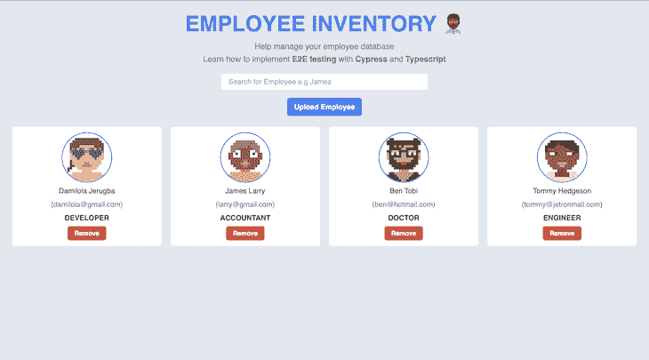
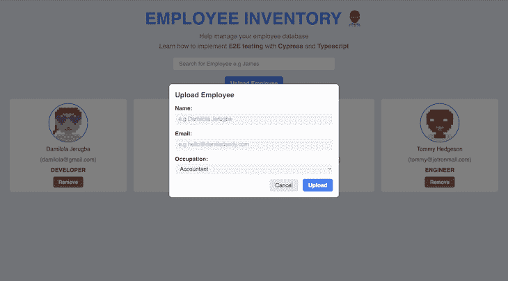
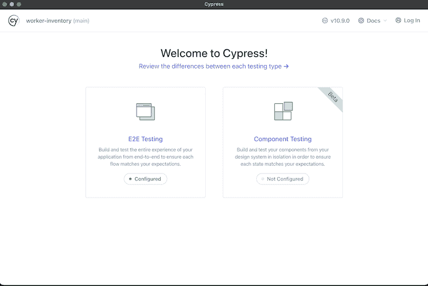
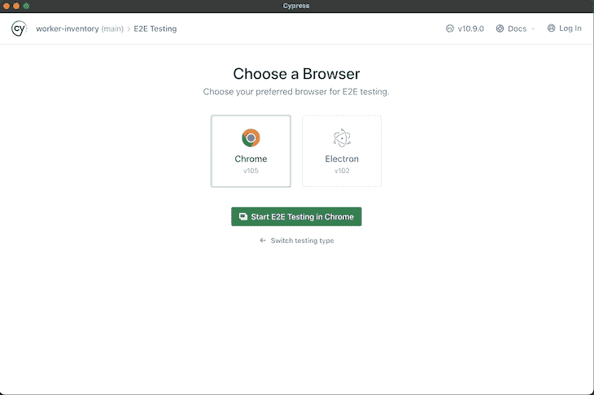
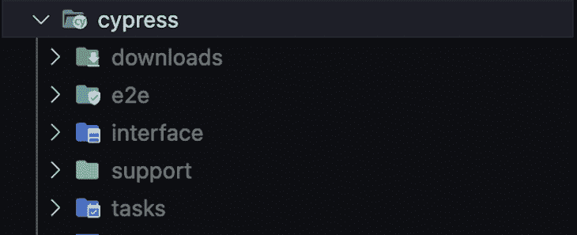
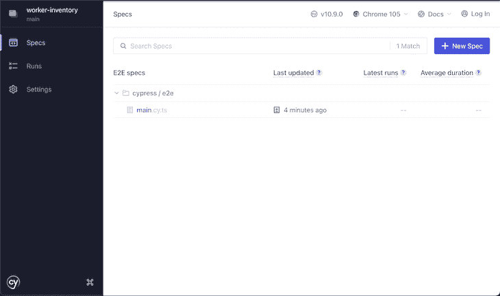
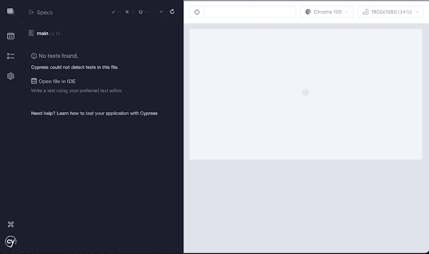
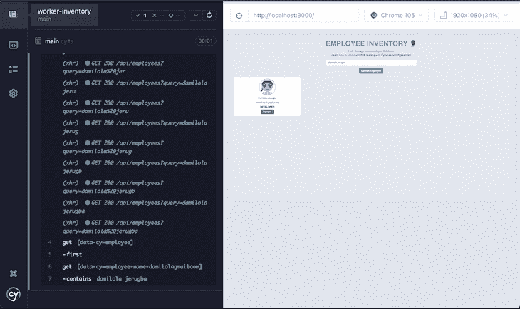
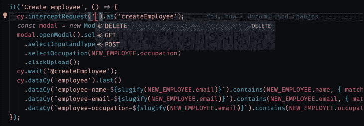
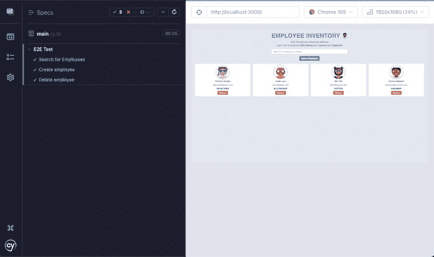

# 用 Cypress 和 TypeScript 在 Next.js 中进行 E2E 测试

> 原文：<https://blog.logrocket.com/end-to-end-testing-next-js-apps-cypress-typescript/>

写好代码是一回事；对你的代码有信心完全是另一回事！端到端测试通过模拟真实场景，帮助您测试应用的用户体验。这可以让您更全面地了解应用程序的性能，因为您已经从头到尾运行了应用程序，以确保应用程序流的行为符合预期。

在本文中，我们将介绍您需要了解的关于使用 Next.js 应用程序进行端到端测试的知识，以及如何使用 Cypress 和 Typescript 进行测试。

*向前跳转:*

## **什么是**端到端测试？

在我们开始使用 Cypress 之前，我们需要快速给出什么是端到端测试以及它给我们的项目带来什么好处的上下文。

如上所述，端到端测试，也称为 E2E 测试，通过从头到尾模拟真实世界的用户场景和用例，确保应用程序按照预期运行。

端到端测试中采取的一些步骤包括:

*   转到特定的 URL
*   点击登录按钮
*   填写您的用户名和密码
*   导航用户设置
*   注销

在这个例子中，您可以看到上面的过程是如何模拟用户如何登录到一个应用程序，然后注销，这是一个常见的场景。

## **端到端测试与单元测试**

端到端测试和[单元测试](https://blog.logrocket.com/unit-testing-react-cypress/)都是非常重要的测试手段；有些开发人员两种都用，而有些人特别喜欢其中一种方法。让我们简单了解一下它们之间的区别。

*   单元测试:一种测试类型，其中测试应用程序的单个单元、功能或组件(例如，当您在 React 应用程序中测试组件时)
*   端到端测试:E2E 测试多个组件的组合如何相互交互，以满足预期目标(例如，登录或更改设置)

编写单元测试比编写 E2E 测试简单，因为您可以在构建每个组件时编写它们。相比之下，E2E 测试是在所有必要的组件都已经构建和集成之后编写的。

## **为什么** **要用 e** nd 去- **e** nd 测试**？**

1.  它确保了整个应用程序生产的效率
2.  轻松测试应用程序的业务逻辑
3.  满足您可能有的任何端到端测试要求
4.  确保应用程序流程针对最终用户的体验进行了优化
5.  减少 bug
6.  增强对整个应用程序功能的信心

## **设定** **u** p 下一个**。js**应用

在本教程中，您将看到如何借助 TypeScript 在您的 [Next.js](https://nextjs.org/) 应用程序中实现 [Cypress](https://www.cypress.io/) 。

我们将使用我构建的一个简单的 Next.js 应用程序。使用以下说明启动并运行 Next.js 应用程序:

```
# clone the repository
git clone https://github.com/damiisdandy/employee-inventory-learn-cypress-with-typescript.git

# install all dependencies
yarn install

# setting up the database with docker-compose
yarn docker-compose

# create the .env file based on the template.env and put the database URL for your prisma client

# run application
yarn dev

```

正如你在上面看到的，我们简单地克隆了应用程序，安装了所有的依赖项，然后使用 [docker-compose](https://docs.docker.com/compose/) ( [了解更多关于安装 docker-compose 的](https://docs.docker.com/compose/install/))。我们用它来创建一个 PostgreSQL 数据库，供我们的应用程序使用。

> **N.B.** ，这个 repo 已经安装并配置了 Cypress，您可以在关注本文时以此为参考。

## **了解 app**

这是一个简单的应用程序，通过允许我们上传员工基本信息，如姓名、电子邮件和职业，让我们管理员工数据库。它还允许我们删除员工并搜索特定员工。





## **立柏**

Cypress 是一个 JavaScript 库，帮助你编写[端到端测试](https://blog.logrocket.com/real-confidence-with-cypress-e2e-tests/)和单元测试。你可以在[官方网站](https://www.cypress.io/)上了解更多关于赛普拉斯的信息。

让我们在 Next.js 应用程序中设置 Cypress。

### 安装 Cypress

要安装 Cypress，请运行:

```
yarn add cypress #npm install cypress

```

### 奔跑的柏树

完成后，您可以使用以下命令运行 Cypress:

```
yarn cypress open #npx cypress open

```

在 repo 中，我创建了一个简单的脚本，使用以下命令来完成此任务:

```
yarn cypress:open

```

这将运行柏树应用程序——您会看到下面的屏幕。



点击 **E2E 测试**，你会看到这个屏幕:



选择**Chrome**——因为 E2E 测试需要模拟用户的体验，我们需要在浏览器上运行测试，而不是像单元测试那样直接在终端上运行。完成后，关闭它。

现在，我们来配置 Cypress！🚀

### 创建配置文件

在应用程序的根目录下，创建一个名为`cypress.config.ts`的文件——我们将使用这个文件来配置 Cypress 的运行方式。你可以在他们的[文件](https://docs.cypress.io/api/plugins/configuration-api#Usage)中读到更多相关信息。

在配置文件中写入以下内容:

```
import { loadEnvConfig } from '@next/env';
import { defineConfig } from 'cypress';

const { combinedEnv } = loadEnvConfig(process.cwd());
export default defineConfig({
  env: combinedEnv,
  e2e: {
    baseUrl: 'http://localhost:3000',
    retries: {
      runMode: 3,
    },
    viewportHeight: 1080,
    viewportWidth: 1920,
    video: false,
    screenshotOnRunFailure: false,
    experimentalSessionAndOrigin: true,
  },
});

```

我们现在已经从`cypress`导入了`defineConfig`，用于在 Cypress 中编写配置。其中，我们指定了应用程序的基本 URL、我们将使用的 Chrome 浏览器的宽度和高度，以及其他一些配置。

### 设置测试环境变量

您可能不希望使用开发环境的数据库运行测试，因为您可能会执行删除数据库或播种等操作。因此，我们需要指定一个单独的`.env`文件，它将在测试环境`NODE_ENV=test`中使用。

令人欣慰的是，Next.js [让我们可以根据测试环境](https://nextjs.org/docs/basic-features/environment-variables)轻松地指定环境变量。

正如我们在应用程序设置中看到的，我们创建了一个`.env`，它将包含一个名为`DATABASE_URL`的变量，该变量包含用于我们的 Prisma 客户端的数据库的 URL。

为了测试，我们将创建另一个名为`.env.test`的`.env`文件。当我们运行 Cypress 测试时，只有这些环境变量会被获取。

### 柏树目录

一旦运行了`yarn cypress open`命令，就会自动创建一个名为`cypress`的目录。如果没有，自己创建一个目录，并在其中放置以下目录:

1.  这就是我们编写 E2E 测试的地方
2.  稍后我们将回到这个话题；Cypress 并不要求这样，但是我们将使用它来组织我们的代码
3.  这是我们用 TypeScript 编写自定义命令的地方
4.  这是我们编写自定义任务的地方

完成后，您的文件结构应该如下所示:



## Cypress 任务

Cypress 任务帮助我们在测试中执行 Node.js 命令。我们将创建两个任务；一个用来重置数据库，另一个用来播种数据库(播种是指用一些默认的测试数据填充数据库)。

在任务目录中，我们将创建两个名为`resetDB.ts`和`seedDB.ts`的文件，并分别在其中编写以下代码:

```
// /cypress/tasks/resetDB.ts

import { prisma } from '../../pages/api/employees';

export default async function resetDB() {
  return prisma.employee.deleteMany({});
};

// /cypress/tasks/seedDB.ts

import { prisma } from '../../pages/api/employees';
import { DEFAULT_EMPLOYEES } from '../constants';

export default async function seedDB() {
  return await prisma.employee.createMany({
    data: DEFAULT_EMPLOYEES,
  });
};

```

您会注意到我们在数据库播种文件中导入了一个名为`constants`的文件；这是 Cypress 目录根目录下的一个文件，我们用它来存储 Cypress 测试的常量。

在这个文件中，您将看到以下代码:

```
// /cypress/constants.ts

import { Employee } from "@prisma/client";
export const DEFAULT_EMPLOYEES: Omit<Employee, 'id'>[] = [
  {
    email: '[email protected]',
    name: 'damilola jerugba',
    occupation: 'DEVELOPER'
  },
  {
    email: '[email protected]',
    name: 'james larry',
    occupation: 'ACCOUNTANT'
  },
  {
    email: '[email protected]',
    name: 'ben tobi',
    occupation: 'DOCTOR'
  },
  {
    email: '[email protected]',
    name: 'tommy hedgeson',
    occupation: 'ENGINEER'
  },
  {
    email: '[email protected]',
    name: 'damiisdandy',
    occupation: 'DEVELOPER'
  },
];
export const NEW_EMPLOYEE: Omit<Employee, 'id'> = {
  name: "Fiyin Jerugba",
  email: "[email protected]",
  occupation: "DOCTOR",
}

```

因此，现在，我们应该有以下文件结构:


现在，是时候将我们的任务导入到 Cypress 中了！为此，我们只需转到 Cypress 配置文件，并向其中添加以下内容:

```
// /cypress.config.ts
// ... previous code imports
import resetDB from './cypress/tasks/resetDB';
import seedDB from './cypress/tasks/seedDB';

const { combinedEnv } = loadEnvConfig(process.cwd());
export default defineConfig({
    // .... previous code
    setupNodeEvents(on, config) {
      on('task', {
        resetDB,
        seedDB,
      });
    },
  },
});

```

好的；现在我们已经添加了任务，让我们测试一下。

在`cypress`目录的`e2e`目录中，我们将创建第一个名为`main.cy.ts`的测试文件，在这里我们将编写所有的端到端测试。


现在让我们编写第一个测试:

```
// /cypress/e2e/main.cy.ts

describe('E2E Test', () => {
  beforeEach(() => {
    cy.task('resetDB');
    cy.task('seedDB');
    cy.visit('/');
  });
})

```

这里，我们只是使用`cy.task()`函数来指定我们想要运行的任务；我们使用了`beforeEach`函数，因为我们希望在每次测试后运行以下所有任务。

添加完毕后，运行`yarn cypress open`并点击**在 Chrome** 中开始 E2E 测试。您应该看到以下内容:



点击 **main.cy.ts** ，应该会看到这样一个屏幕:



我们看到“没有找到测试”,因为我们没有列出任何测试，但是我们已经设置了测试环境。

## 使用 TypeScript 的自定义命令

现在，是时候使用 TypeScript 的强大功能来创建一些方便的命令，以帮助使用自动完成功能更容易地编写测试了。

让我们在 Cypress 文件夹中创建一个`tsconfig.json`文件，它扩展了 Next.js 应用程序中使用的文件:

```
// /cypress/tsconfig.json

{
  "extends": "../tsconfig.json",
  "compilerOptions": {
    "types": ["cypress", "node", "./support"]
  },
  "include": ["**/*.ts"],
  "exclude": []
}

```

与数组`"compilerOptions.types"`一起列出，可以看到我们从相对目录`./support`中声明了一个类型。

在`support`目录中，我们将列出我们的定制命令和它们各自的类型([阅读更多](https://docs.cypress.io/api/cypress-api/custom-commands))。

在该目录中，我们将创建三个文件:

1.  `commands.ts`:自定义命令的功能
2.  `e2e.ts`:导入我们命令的必需文件
3.  我们将在这里编写类型声明

您的文件夹结构应该如下所示:


We’ll create two custom commands: one to easily select DOM elements and another to intercept API calls.

在`commands.ts`文件中，编写以下内容:

```
// /cypress/support/commands.ts

Cypress.Commands.add('dataCy', (value) => {
  cy.get(`[data-cy=${value}]`)
});
Cypress.Commands.add('interceptRequest', (method) => {
  cy.intercept({ method, path: '/api/employees' }, (req) => {
    req.alias = method;
  })
})
export { };

```

第一个命令的名字叫做`dataCy`。这是一个方便的命令，允许我们选择具有`data-cy`属性的 DOM 元素；我们需要为我们的测试选择 DOM 元素来触发点击、键入、选择等事件。

下面是一个具有该属性的 html/jsx lemon 示例:

```
<button data-cy="modal-open-button" className="...">Upload Employee</button> 
```

第二个命令[帮助我们拦截请求](https://docs.cypress.io/api/commands/intercept)。

### 在 TypeScript 中声明类型

在`index.d.ts`文件中，让我们编写以下内容:

```
// /cypress/support/index.d.ts
/// <reference  types="cypress" />
import './commands';

type Method = 'POST' | 'GET' | 'DELETE';

declare global {
  namespace Cypress {
    interface Chainable {
      dataCy(value: string): Chainable<Element>;
      interceptRequest(method: Method): Chainable<null>;
    }
  }
}

```

然后，在`e2e.ts`文件中，我们简单地导入定制命令:

```
// /cypress/support/e2e.ts

import './commands';
export { };

```

我们已经正式编写了自定义命令！现在，是时候写一些实际的测试了。

## 编写端到端测试

我们将编写一个 E2E 测试，根据应用程序执行以下操作:

1.  搜索员工
2.  上传员工
3.  删除员工

### 搜索员工

这将是一个简单的测试，自动在搜索框中键入员工的姓名，并检查该员工是否在应用程序中列出。

在`main.cy.ts`文件中，我们将编写以下内容:

```
// cypress/e2e/main.cy.ts

import { slugify } from '../../helper';
import { DEFAULT_EMPLOYEES, } from "../constants";

describe('E2E Test', () => {
  beforeEach(() => {
    cy.task('resetDB');
    cy.task('seedDB');
    cy.visit('/');
  });
  it('Search for Employees', () => {
    cy.dataCy("search-bar").click().type(DEFAULT_EMPLOYEES[0].name);
    cy.dataCy("employee").first()
      .dataCy(`employee-name-${slugify(DEFAULT_EMPLOYEES[0].email)}`)
      .contains(DEFAULT_EMPLOYEES[0].name, { matchCase: false });
  });
})

```

我们正在导入两个文件。第一个是名为`helper`的文件，它位于我们应用程序的根目录，用于[编辑](https://itnext.io/whats-a-slug-f7e74b6c23e0)一个员工的电子邮件，这样我们就可以很容易地识别它。你可能想知道为什么我们不仅仅使用 ID。我们不能使用 ID，因为删除和植入数据库会使其不可预测。

显然，在我们的 React 代码中，我们将使用相同的`slugify()`函数动态设置`data-cy`。

```
<p data-cy={`employee-name-${slugify(email)}`} className="text-center capitalize">
  {name}
</p>

```

### 测试步骤:

1.  点击搜索栏并输入员工姓名
2.  选择具有属性`data-cy="employee"`的`first` DOM 元素
3.  找到具有该属性的 DOM 元素(例如，`data-cy="employee-name-damilolagmail.com"`)
4.  请检查它是否存在以及是否具有正确的名称

使用`yarn cypress open`运行 Cypress 测试应显示以下内容:



### 上传员工

这个测试打开模型来上传一个员工，填写表单，然后最后上传这个员工。

在`main.cy.ts`文件中，我们将编写以下内容:

```
import { slugify } from '../../helper';
import { DEFAULT_EMPLOYEES, NEW_EMPLOYEE } from "../constants";
import Modal from '../interface/Modal';

describe('E2E Test', () => {
// ...previous code
  it('Create employee', () => {
    cy.interceptRequest('POST').as('createEmployee');
    const modal = new Modal();
    modal.openModal().selectInputandType('name', NEW_EMPLOYEE.name)
      .selectInputandType('email', NEW_EMPLOYEE.email)
      .selectOccupation(NEW_EMPLOYEE.occupation)
      .clickUpload();
    cy.wait('@createEmployee');
    cy.dataCy('employee').last()
      .dataCy(`employee-name-${slugify(NEW_EMPLOYEE.email)}`).contains(NEW_EMPLOYEE.name, { matchCase: false })
      .dataCy(`employee-email-${slugify(NEW_EMPLOYEE.email)}`).contains(NEW_EMPLOYEE.email, { matchCase: false })
      .dataCy(`employee-occupation-${slugify(NEW_EMPLOYEE.email)}`).contains(NEW_EMPLOYEE.occupation, { matchCase: false })
  });
})

```

您会注意到我们在`interface`目录中导入了一个名为`Modal`的类；这是一个简单的类，它帮助我们创建一个模态用户界面的模型，这样我们就可以编写更简洁、更具描述性的代码。

在`interface`目录中，使用以下类创建一个`Modal.ts`文件:

```
// cypress/interface/Modal.ts

import { Occupation, Employee } from "@prisma/client";

export default class Modal {
  openModal() {
    cy.dataCy('modal-open-button').click();
    return this;
  }
  selectInputandType(name: keyof Omit<Employee, 'id' | 'occupation'>, value: string) {
    cy.dataCy(`modal-input-${name}`).click().type(value);
    return this;
  }
  selectOccupation(value: Occupation) {
    cy.dataCy(`modal-input-occupation`).select(value);
    return this;
  }
  clickUpload() {
    cy.dataCy('modal-button').click();
    return this;
  }
}

```

这个类有一些助手方法，它们与模态的 UI 交互——我们返回`this`,这样我们可以链接这些方法。

### **测试步骤:**

1.  我们首先用自定义命令拦截任何`POST`请求
2.  打开模式并填写员工的详细信息
3.  点击上传按钮，等待请求完成
4.  请求完成后，检查上传的新员工是否存在于列出的员工中

注意这里 TypeScript 如何帮助我们自动完成定制命令的参数。



### 删除员工

这个测试只是删除一个雇员，并通过检查删除后列出的雇员数量来验证这一点。

```
import { slugify } from '../../helper';
import { DEFAULT_EMPLOYEES, NEW_EMPLOYEE } from "../constants";
import Modal from '../interface/Modal';

describe('E2E Test', () => {
// ...previous code
  it('Delete employee', () => {
    cy.dataCy('employee-delete-button').last().click();
    cy.dataCy('employees').children().should('have.length', DEFAULT_EMPLOYEES.length - 1)
  })
})

```

### **测试步骤:**

1.  点击最后一个删除按钮
2.  检查员工列表的长度，并确保其递减 1

用`yarn cypress open`运行 Cypress 测试应该会显示:



祝贺您，您已经用 Cypress 编写了一个端到端的测试！

## 结论

在本文中，我们看到了使用 Cypress 和 Typescript 进行端到端测试的强大功能。

E2E 测试允许我们测试应用程序的整个流程，以模拟实际用户的流程，这给了我们在测试应用程序时所需的信心。

凭借 TypeScript 的强大功能，我们在自动完成类型和捕捉错误的速度方面获得了更好的开发经验。

## [LogRocket](https://lp.logrocket.com/blg/nextjs-signup) :全面了解生产 Next.js 应用

调试下一个应用程序可能会很困难，尤其是当用户遇到难以重现的问题时。如果您对监视和跟踪状态、自动显示 JavaScript 错误、跟踪缓慢的网络请求和组件加载时间感兴趣，

[try LogRocket](https://lp.logrocket.com/blg/nextjs-signup)

.

[](https://lp.logrocket.com/blg/nextjs-signup)[](https://lp.logrocket.com/blg/nextjs-signup)

LogRocket 就像是网络和移动应用的 DVR，记录下你的 Next.js 应用上发生的一切。您可以汇总并报告问题发生时应用程序的状态，而不是猜测问题发生的原因。LogRocket 还可以监控应用程序的性能，报告客户端 CPU 负载、客户端内存使用等指标。

LogRocket Redux 中间件包为您的用户会话增加了一层额外的可见性。LogRocket 记录 Redux 存储中的所有操作和状态。

让您调试 Next.js 应用的方式现代化— [开始免费监控](https://lp.logrocket.com/blg/nextjs-signup)。