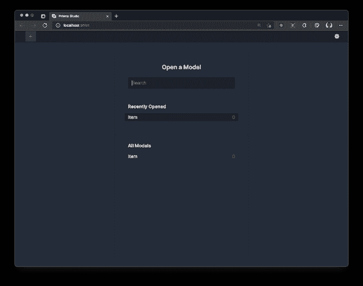
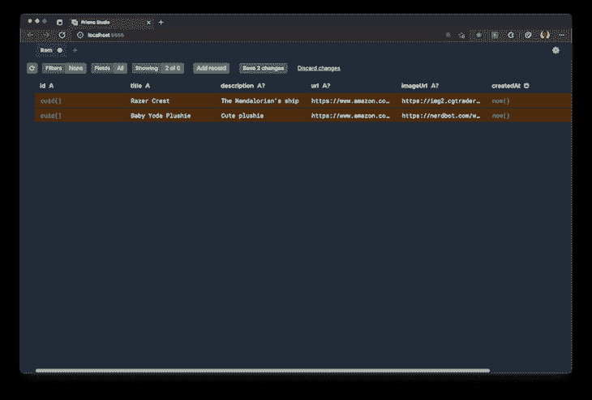
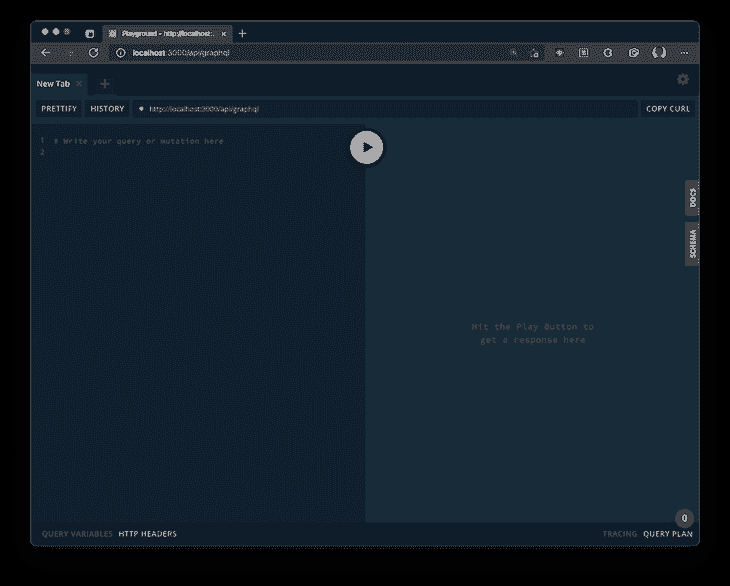
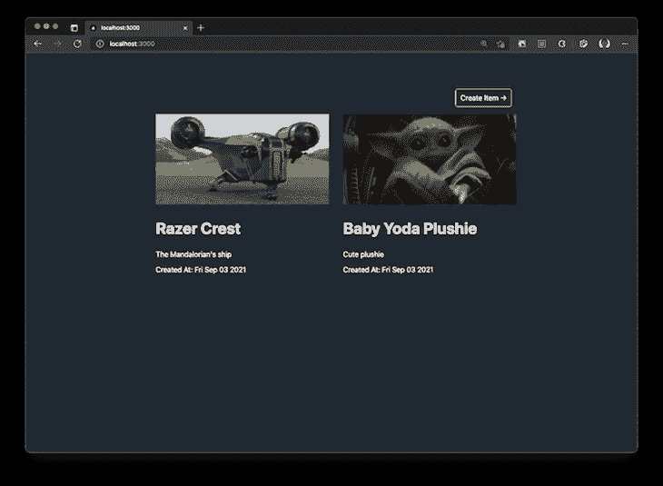
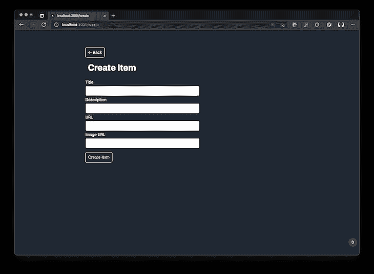
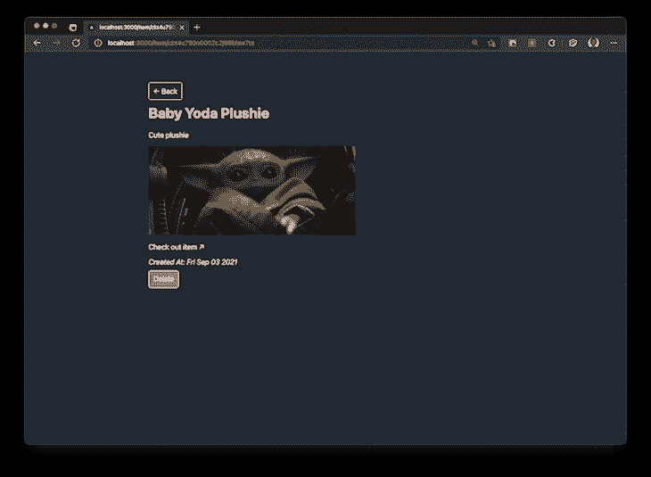

# Next.js、Prisma 和 GraphQL 的端到端类型安全

> 原文：<https://blog.logrocket.com/end-to-end-type-safety-nextjs-prisma-graphql/>

对于许多开发团队来说，在整个堆栈中使用一致的类型是一个重大挑战。虽然您可能尝试手动定义类型和接口，但是如果没有足够的工具来检测更改和抛出错误，则在项目的一部分更改类型可能会破坏整个应用程序。

为了提供更好的开发人员体验并减少总体错误，我们可以通过在整个堆栈中使用一致的类型在应用程序中实现端到端的类型安全。

在本教程中，我们将通过构建一个简单的愿望列表应用程序来探索端到端的类型安全，该应用程序允许用户为来自互联网的项目添加书签。我们将使用 Next.js、GraphQL 和 Prisma 构建我们的类型安全的全栈应用程序。

### 先决条件

要跟随本教程，您需要以下内容:

*   Node.js 已安装
*   基本了解 [JavaScript 和类型脚本](https://blog.logrocket.com/pattern-matching-and-type-safety-in-typescript-1da1231a2e34/)
*   熟悉 React
*   熟悉关系数据库
*   对 GraphQL 的基本理解

我们将使用以下堆栈和工具:

*   Genql :一个类型安全的 GraphQL 查询构建器，为 GraphQL 查询提供自动完成和验证
*   Nexus:为在 API 层构建 GraphQL 模式和类型安全提供了一种代码优先的方法
*   Prisma:一个保证类型安全并简化关系数据库工作的开源数据库工具包
*   [`apollo-server-micro`](https://www.apollographql.com/docs/apollo-server/integrations/middleware/#apollo-server-micro):graph QL API 的 HTTP 服务器

为了跟随本教程，您可以在 [GitHub](https://github.com/ruheni/e2e-type-safe-app) 上查看最终代码。

## 项目架构

构建应用程序的常见模式是三层架构，它由三个组件组成:表示层(前端)、逻辑层(API)和数据层(数据库)。

为了降低应用程序崩溃的几率，我们需要在三个层中使用一致的数据，并在每个层提供验证:


为了正确理解这一点，假设在数据库中，您对表中的列进行了更改。

在对数据库应用模式时，编译器会检测到类型的偏移，抛出错误，突出显示前端和 API 中应用程序所有受影响的部分。然后，开发人员可以应用更改并修复应用程序的类型。

## 入门指南

通过运行以下命令，导航到工作目录并初始化 Next.js 应用程序:

```
npx create-next-app --typescript [app-name]

```

在您选择的编辑器上打开新应用程序。如果你使用的是 VS 代码，你可以使用`code .`简写从终端打开应用程序，如下所示:

```
cd [app-name]
code .  #for vs-code users

```

### 安装开发依赖项

若要安装开发依赖项，请运行以下命令:

```
npm install --save-dev prisma @genql/cli ts-node nodemon

```

*   `prisma`:命令行工具，用于管理数据库迁移，生成数据库客户端，使用 Prisma Studio 浏览数据
*   `@genql/cli`:一个 Genql CLI 工具，用于生成发出 GraphQL 请求的客户端
*   `ts-node`:将打字脚本代码转换成 JavaScript
*   一个文件监视器，用于监视我们的 GraphQL API 代码和重新生成类型

```
npm install graphql nexus graphql-scalars @prisma/client [email protected] @genql/runtime swr
```

*   `nexus`:建立一种代码优先的方法来构建 GraphQL APIs
*   `graphql-scalars`:提供自定义 GraphQL 标量类型的库
*   `@prisma/client`:基于数据库模式的类型安全查询生成器
*   `apollo-server-micro`:用于 GraphQL APIs 的 HTTP 服务器
*   `@genql/runtime`和`graphql`:Genql 的运行时依赖性
*   一个轻量级的库，提供 React 钩子来处理数据获取

现在，在项目的根目录下创建一个名为`nexus.tsconfig.json`的文件:

```
touch nexus.tsconfig.json

```

为了允许重新生成模式，将以下代码添加到`nexus.tsconfig.json`:

```
{
  "compilerOptions": {
    "sourceMap": true,
    "outDir": "dist",
    "strict": true,
    "lib": ["esnext"],
    "esModuleInterop": true
  }
}

```

在您的`package.json`文件中，添加以下两个脚本，`generate:nexus`和`generate:genql`:

```
"scripts": {
  //next scripts
  "generate:nexus": "nodemon --exec 'ts-node --transpile-only -P nexus.tsconfig.json pages/api/graphql' --ext 'ts' --watch '*/graphql/**/*.ts'",
  "generate:genql": "nodemon --exec 'genql --schema ./graphql/schema.graphql --output ./graphql/generated/genql'  --watch 'graphql/schema.graphql'" 
}

```

在构建 GraphQL API 时，`generate:nexus`在`graphql`文件夹中生成文件更改的类型。当 GraphQL 模式更新后，`generate:genql`将重新生成 Genql 客户端。

默认情况下，`generate:genql`生成的类型将存储在`graphql/generated/genql`中，但是，您可以根据需要更新输出路径。

## 设置数据库

要在项目中设置 Prisma，请运行以下命令:

```
npx prisma init

```

上面的命令在项目的根目录下创建一个新的`.env`文件和一个`prisma`文件夹。`prisma`文件夹包含一个`schema.prisma`文件，用于建模我们的数据。

要使用默认数据库提供者 PostgreSQL，请用指向您的数据库的有效连接字符串更新`.env`。要更改提供者，只需在`schema.prisma`的`datasource db`块中更改提供者。在撰写本文时，Prisma 支持 PostgreSQL、MySQL、SQL Server 和 MongoDB 作为预览版。

当对数据建模时，Prisma 使用 Prisma 模式语言，它几乎类似于 GraphQL 语法，并使数据库模式易于阅读和更新。对于自动完成和语法突出显示，可以安装 [Prisma VS 代码扩展](https://marketplace.visualstudio.com/items?itemName=Prisma.prisma)。

对于数据库提供者，我们将使用 SQLite，但是，您可以随意选择使用数据库提供者。按如下方式更新提供者和 URL:

```
datasource db {
  provider = "sqlite"
  url      = "file:./dev.db"
}
generator client {
  provider = "prisma-client-js"
}

```

让我们创建一个新的模型`Item`来映射到数据库中的一个表。添加以下字段:

```
/// schema.prisma
model Item {
  id          String  @id @default(cuid())
  title       String
  description String?
  url         String?
  imageUrl    String?
  createdAt   DateTime @default(now())
  updatedAt   DateTime @default(now()) @updatedAt
}

```

我们的表格有`id`、`title`、`description`、网页`url`、`imageUrl`的字段，以及`createdAt`和`updatedAt`的时间戳。

`id`作为我们的表的主键，用`@id`表示。`?`符表示该字段是可选的，默认值为`null`。Prisma 自动创建并更新`createdAt`和`updatedAt`值。

接下来，我们将创建一个数据库迁移:

```
npx prisma migrate dev --name project_init

```

上面的代码用 SQL 生成了一个数据库迁移，您可以在`/prisma/migrations`中找到它。在对您的数据库应用迁移之后，它生成 Prisma 客户机，该客户机将访问数据库。

现在，让我们打开 Prisma Studio 并在应用程序中添加一些要测试的数据:

```
npx prisma studio

```



选择**项** **型号**和**添加记录**按钮向数据库添加一些数据。我从亚马逊上选了两件商品:



点击**保存 2 项更改**以应用更改。

## 设置您的 API

我们将把我们的 GraphQL API 代码包含在项目根目录下的一个`graphql`文件夹中，创建一个关注点分离。通过运行以下代码创建`graphql`文件夹:

```
mkdir graphql

```

在`graphql`文件夹中，创建两个名为`schema.ts`和`context.ts`的文件:

```
touch graphql/schema.ts graphql/context.ts

```

在您的`schema.ts`文件中，添加以下代码:

```
// /graphql/schema.ts
import { makeSchema, queryType, mutationType } from "nexus";
import * as path from 'path'

const Query = queryType({
  definition(t) {
    // your queries will go here
  }
})

const Mutation = mutationType({
  definition(t) {
    // your mutations will go here
  }
})

export const schema = makeSchema({
  types: [Query, Mutation],
  outputs: {
    schema: path.join(process.cwd(), 'graphql/schema.graphql'),
    typegen: path.join(process.cwd(), 'graphql/generated/nexus.d.ts'),
  },
  contextType: {
    module: path.join(process.cwd(), 'graphql/context.ts'),
    export: 'Context'
  },
  sourceTypes: {
    modules: [
      {
        module: '@prisma/client',
        alias: 'db'
      }
    ]
  }
})

```

上面的代码片段包含我们将在应用程序的其余部分使用的默认配置。它导入了`makeSchema`方法，该方法定义了以下内容:

*   GraphQL 模式的输出路径(默认为`graphql/schema.graphql`)
*   从 Nexus 生成的类型定义的输出路径(默认为`graphql/generated/nexus.d.ts`)
*   上下文模块的名称和路径
*   Nexus 应该用来访问数据库的模块

配置还将清空`queryType`和`mutationType`，我们将在其中添加查询和变异。

在`graphql/context.ts`文件中，添加以下代码:

```
// /graphql/context.ts
import { PrismaClient } from '@prisma/client'

const db = new PrismaClient()

export type Context = {
  db: PrismaClient
}
export const context: Context = {
  db
}

```

上面的代码片段:

*   进口`@prisma/client`
*   创建 Prisma 客户端的新实例
*   创建上下文类型，可以用接口替换
*   创建一个上下文对象，将`db`添加到 GraphQL 上下文中，使其在 GraphQL 解析器中可用

在`/pages/api/`文件夹中，创建一个名为`graphql.ts`的文件，我们将用它来定义 Next.js 的 API 路由:

```
// /pages/api/graphql.ts
import { ApolloServer } from 'apollo-server-micro'
import { context } from '../../graphql/context'
import { schema } from '../../graphql/schema'

export const config = {
  api: {
    bodyParser: false,
  },
}

const server = new ApolloServer({ schema, context }).createHandler({
  path: '/api/graphql'
})

export default server

```

使用上面的代码，我们初始化`apollo-server-micro`并创建一个处理程序，每当用户在浏览器上访问`[http://localhost:3000/api/graphql](http://localhost:3000/api/graphql)`时，该处理程序将启动 GraphQL Playground。

### 生成 GraphQL 类型

> 为了避免同时运行以下三个命令，您可以同时使用[和](https://www.npmjs.com/package/concurrently)来自动化这个过程。有关并发安装的说明，请继续阅读下一节。

现在，在终端窗口中启动 Next.js 应用服务器:

```
npm run dev

```

在第二个终端窗口中，运行以下命令来生成 Nexus 类型和 GraphQL 模式:

```
npm run generate:nexus

```

最后，在第三个终端窗口中，运行下面的命令为前端生成 GraphQL 类型:

```
npm run generate:genql

```

在`graphql`中，创建了一个名为`generated`的新目录，其中包含以下文件:

*   `nexus.d.ts`:包含 Nexus 自动生成的类型
*   `genql`:生成位于`graphql/generated/genql`的类型

该文件夹的内容将随着您构建 GraphQL API 而更新。

#### 可选:同时设置

让我们作为开发依赖项并发安装:

```
npm install --save-dev concurrently

```

在您的`package.json`文件中添加一个新脚本，它将同时运行`npm run generate:nexus`和`npm run generate:genql`:

```
"scripts": {
  //other scripts
  "generate": "concurrently \"npm run generate:nexus\" \"npm run generate:genql\"",
}

```

现在，您可以取消`npm run generate:nexus`和`npm run generate:genql`脚本，并运行新脚本，如下所示:

```
npm run generate

```

## GraphQL 对象类型

让我们从`graph-scalars`库中定义一个定制的`DateTime` GraphQL 标量。Nexus 提供了`asNexusMethod`属性，使得标量在 GraphQL API 的其余部分中可用:

```
// /graphql/schema.ts
import { asNexusMethod, /** other imports */ } from "nexus";
import { DateTimeResolver, } from 'graphql-scalars'

const DateTime = asNexusMethod(DateTimeResolver, 'DateTime')

```

将`DateTime`标量添加到 API 的 GraphQL 模式中:

```
// /graphql/schema.ts
export const schema = makeSchema({
  types: [/** existing types */, DateTime],
)}

```

创建一个新变量`Item`，它将定义 GraphQL 对象类型的字段和属性:

```
// /graphql/schema.ts
import { objectType, /** other imports */ } from "nexus";

const Item = objectType({
  name: 'Item',
  definition(t) {
    t.nonNull.id('id')
    t.nonNull.string('title')
    t.string('description')
    t.string('url')
    t.string('imageUrl')
    t.field('createdAt', { type: 'DateTime' })
    t.field('updatedAt', { type: 'DateTime' })
  }
})

```

`objectType`使您能够定义 GraphQL 对象类型，它也是一种`root`类型。`objectType`字段映射到数据库中的属性和字段。

`Item`对象类型将 [`id`和`title`作为不可空字段](https://blog.logrocket.com/defining-types-for-your-graphql-api/)。如果`nonNull`未指定，默认情况下这些字段将为空。您可以根据需要更新其余的字段。

用新创建的 GraphQL 对象类型更新`types`:

```
// /graphql/schema.ts
export const schema = makeSchema({
  types: [/** existing types */, Item],
)}

```

每次更新`types`的内容，生成的类型和 GraphQL 模式都会更新。

## 枚举类型

让我们定义一个`SortOrder`枚举值，我们将在下一节中使用它对值进行升序或降序排序:

```
// /graphql/schema.ts
import { enumType, /** other imports */ } from "nexus";

const SortOrder = enumType({
  name: "SortOrder",
  members: ["asc", "desc"]
})

export const schema = makeSchema({
  types: [/** existing types */, SortOrder],
)}

```

## 问题

查询允许我们从 API 中读取数据。更新您的`Query`文件以包含以下代码:

```
// /graphql/schema.ts

const Query = queryType({
  definition(t) {
    t.list.field('getItems', {
      type: 'Item',
      args: {
        sortBy: arg({ type: 'SortOrder' }),
      },
      resolve: async (_, args, ctx) => {
        return ctx.db.item.findMany({
          orderBy: { createdAt: args.sortBy || undefined }
        })
      }
    })

    t.field('getOneItem', {
      type: 'Item',
      args: {
        id: nonNull(stringArg())
      },
      resolve: async (_, args, ctx) => {
        try {
          return ctx.db.item.findUnique({ where: { id: args.id } })
        } catch (error) {
          throw new Error(`${error}`)
        }
      }
    })
  }
})

```

在上面的代码中，我们定义了两个查询:

*   `getItems`:返回一个`Item`数组，并允许您根据`createdAt`值对值进行升序或降序排序
*   `getOneItem`:返回一个基于 ID 的`Item`，一个不可为空的唯一值

当编写数据库查询`ctx.db._query here_`时，VS 代码提供自动完成。

## GraphQL 突变

GraphQL 突变用于操纵数据。让我们回顾一下创建、更新和删除数据的三种变化，并将它们添加到我们的应用程序中。

### 创造

让我们在`Mutation`定义块中添加一个`createItem`突变:

```
t.field('createItem', {
  type: 'Item',
  args: {
    title: nonNull(stringArg()),
    description: stringArg(),
    url: stringArg(),
    imageUrl: stringArg(),
  },
  resolve: (_, args, ctx) => {
    try {
      return ctx.db.item.create({
        data: {
          title: args.title,
          description: args.description || undefined,
          url: args.url || undefined,
          imageUrl: args.imageUrl || undefined,
        }
      })
    } catch (error) {
      throw Error(`${error}`)
    }
  }
})

```

变异将接受以下参数:

*   `title`:强制
*   `description` : optional
*   `url` : optional
*   `imageUrl` : optional

如果没有提供可选值，Prisma 会将这些值设置为`null`。如果 GraphQL 操作成功，变异也会返回一个`Item`。

### 更新

让我们创建一个`updateItem`变异，它接受与`createItem`变异类似的参数，但是，有一个新的、强制的 `id` 参数和一个可选的 `title` 参数。

如果未提供可选值，Prisma 客户端将不会更新数据库中的现有值，而是使用`|| undefined`:

```
t.field('updateItem', {
  type: 'Item',
  args: {
    id: nonNull(idArg()),
    title: stringArg(),
    description: stringArg(),
    url: stringArg(),
    imageUrl: stringArg(),
  },
  resolve: (_, args, ctx) => {
    try {
      return ctx.db.item.update({
        where: { id: args.id },
        data: {
          title: args.title || undefined,
          description: args.description || undefined,
          url: args.url || undefined,
          imageUrl: args.imageUrl || undefined,
        }
      })
    } catch (error) {
      throw Error(`${error}`)
    }
  }
})

```

### 删除

最后，让我们创建一个`deleteItem`突变。`deleteItem`需要一个`id`参数来执行操作:

```
t.field('deleteItem', {
  type: 'Item',
  args: {
    id: nonNull(idArg())
  },
  resolve: (_, args, ctx) => {
    try {
      return ctx.db.item.delete({
        where: { id: args.id }
      })
    } catch (error) {
      throw Error(`${error}`)
    }
  }
})

```

为了测试您的查询和变化，您可以查看位于`[http://localhost:3000/api/graphql](http://localhost:3000/api/graphql)`的 GraphQL Playground 上的 API:



例如，尝试在操场上运行以下查询:

```
query GET_ITEMS {
  getItems {
    id
    title
    description
    imageUrl
  }
}

```

## 与前端交互

现在我们已经完成了 API 的设置，让我们试着从应用程序的前端与它进行交互。首先，让我们添加下面的代码，减少我们创建新的`genql`实例的次数:

```
mkdir util
touch util/genqlClient.ts

```

如下所示实例化您的客户端:

```
// /util/genqlClient.ts
import { createClient } from "../graphql/generated/genql"

export const client = createClient({
  url: '/api/graphql'
})

```

客户端需要一个`url`属性，它定义了 GraphQL API 的路径。鉴于我们的是一个全栈应用，将其设置为`/api/graphql`，并根据环境对其进行定制。

其他属性包括头和一个定制的 HTTP fetch 函数，该函数处理对 API 的请求。对于样式，您可以在`global.css`中添加来自 [GitHub](https://github.com/ruheni/e2e-type-safe-app/blob/main/styles/globals.css) 的内容。

## 列出所有愿望清单项目

要列出我们的愿望列表中的所有项目，请将以下代码片段添加到`index.tsx`:

```
// /pages/index.tsx
import Link from 'next/link'
import useSWR from 'swr'
import { client } from '../util/genqlClient'

export default function Home() {
  const fetcher = () =>
    client.query({
      getItems: {
        id: true,
        title: true,
        description: true,
        imageUrl: true,
        createdAt: true,
      }
    })

  const { data, error } = useSWR('getItems', fetcher)

  return (
    <div>
      <div className="right">
        <Link href="/create">
          <a className="btn"> Create Item &#8594;</a>
        </Link>
      </div>
      {error && <p>Oops, something went wrong!</p>}
      <ul>
        {data?.getItems && data.getItems.map((item) => (
          <li key={item.id}>
            <Link href={`/item/${item.id}`}>
              <a>
                {item.imageUrl ?
                   :
                  
                }
                <h2>{item.title}</h2>
                <p>{item.description ? item?.description : "No description available"}</p>
                <p>Created At: {new Date(item?.createdAt).toDateString()}</p>
              </a>
            </Link>
          </li>
        ))}
      </ul>
    </div>
  )
}

```

`SWR`处理 API 的数据获取。`getItems`标识查询和缓存值。最后，`fetcher`函数向 API 发出请求。

Genql 使用查询构建器语法来指定必须从某个类型返回哪些字段。`data`是基于所做的请求完全键入的。

该查询将使用一个数组来传递参数。该数组将包含两个对象，第一个通过参数传递，第二个通过字段选择传递:

```
client.query({
    getItems: [
      { sortBy: "asc" },
      {
        id: true,
        title: true,
        description: true,
        url: true,
        imageUrl: true,
        createdAt: true,
      }
    ]
})

```

要查询所有字段，您可以使用`…everything`对象，如下所示:

```
import { everything } from './generated'

client.query({
  getItems: {
     ...everything
   }
})

```

或者，您可以使用`chain`语法来执行指定应该返回哪些参数和字段的请求。`chain`语法也适用于突变:

```
client.chain.query.
  getItems({ sortBy: 'desc' }).get({
    id: true,
    title: true,
    description: true,
    url: true,
    imageUrl: true,
    createdAt: true,
})

```

## 显示单个意愿列表项目

为了在我们的愿望列表中显示单个项目，让我们在`pages`中创建新的文件夹`item`。在创建的目录中添加一个名为`[id].tsx`的文件。

`[_file_name_]`注释向 Next.js 表明该路由是动态的:

```
mkdir pages/item
touch pages/item/[id].tsx

```

将以下代码添加到您的页面中:

```
// /pages/item/[id].tsx
import { useRouter } from 'next/router'
import useSWR from 'swr'
import Link from 'next/link'
import { client } from '../../util/genqlClient'

export default function Item() {
  const router = useRouter()
  const { id } = router.query

  const fetcher = async (id: string) =>
    client.query({
      getOneItem: [
        { id },
        {
          id: true,
          title: true,
          description: true,
          imageUrl: true,
          url: true,
          createdAt: true,
        }]
    })

  const { data, error } = useSWR([id], fetcher)

  return (
    <div>
      <Link href="/">
        <a className="btn">&#8592; Back</a>
      </Link>
      {error && <p>Oops, something went wrong!</p>}
      {data?.getOneItem && (
        <>
          <h1>{data.getOneItem.title}</h1>
          <p className="description">{data.getOneItem.description}</p>
          {data.getOneItem.imageUrl ?
             :
            
          }
          {data.getOneItem.url &&
            <p className="description">
              <a href={data.getOneItem.url} target="_blank" rel="noopener noreferrer" className="external-url">
                Check out item &#8599;
              </a>
            </p>
          }
          <div>
            <em>Created At: {new Date(data.getOneItem?.createdAt).toDateString()}</em>
          </div>
        </>
      )
      }
    </div >
  )
}

```

当页面初始化时，`id`将从路由中检索，并用作`getOneItem` GraphQL 请求中的参数。

## 创建项目

为了在我们的应用程序中创建一个新项目，让我们通过添加以下代码来创建一个新页面，作为`/create`路径:

```
touch pages/create.tsx

```

将下面的代码块添加到我们刚刚创建的文件中:

```
// /pages/create.tsx
import React, { useState } from "react"
import { useRouter } from "next/router"
import Link from 'next/link'
import { client } from '../util/genqlClient'

export default function Create() {
  const router = useRouter()
  const [title, setTitle] = useState("")
  const [description, setDescription] = useState("")
  const [url, setUrl] = useState("")
  const [imageUrl, setImageUrl] = useState("")
  const [error, setError] = useState()

  const handleSubmit = async (event: React.SyntheticEvent) => {
    event.preventDefault()
    await client.mutation({
      createItem: [{
        title,
        description,
        url,
        imageUrl,
      }, {
        id: true,
      }]
    }).then(response => {
      console.log(response)
      router.push('/')
    }).catch(error => setError(error.message))
  }
  return (
    <>
      {error && <pre>{error}</pre>}
      <Link href="/">
        <a className="btn">&#8592; Back</a>
      </Link>
      <form onSubmit={handleSubmit}>
        <h2>Create Item</h2>
        <div className="formItem">
          <label htmlFor="title">Title</label>
          <input name="title" value={title} onChange={(e) => setTitle(e.target.value)} required />
        </div>
        <div className="formItem">
          <label htmlFor="description">Description</label>
          <input name="description" value={description} onChange={(e) => setDescription(e.target.value)} />
        </div>
        <div className="formItem">
          <label htmlFor="url">URL</label>
          <input name="url" value={url} onChange={(e) => setUrl(e.target.value)} />
        </div>
        <div className="formItem">
          <label htmlFor="imageUrl">Image URL</label>
          <input name="imageUrl" value={imageUrl} onChange={(e) => setImageUrl(e.target.value)} />
        </div>
        <button type="submit"
          disabled={title === ""}
        >Create Item</button>
      </form>
    </>
  )
}

```

在上面的代码片段中，表单值的状态存储在`useState`值中。当用户选择**创建**按钮时，将触发`handleSubmit`功能。当调用`handleSubmit`时，将检索表单值。

如果出现错误，表单值将保存在错误状态并显示给用户。

## 删除项目

最后，在`[id].tsx`页面中，让我们添加一个选项来删除一个愿望列表项目。当请求成功时，它将返回一个`id`并导航到索引路由`/`:

```
// /pages/item/[id].tsx

export default function Item() {
  /** exiting code/ functionality */
  const deleteItem = async (id: string) => {
    await client.mutation({
      deleteItem: [{ id }, { id: true }],
    }).then(_res => router.push('/'))
  }

  return (
  <div>
         {data?.getOneItem && (
        <>
          {/* existing code */}
          <button className="delete" onClick={(evt) => deleteItem(data?.getOneItem.id)}>Delete</button>
        </>
      )
      }
    )
}

```

如果一切运行正常，您的最终应用程序将类似于下图:







试用应用程序，以确保一切按预期运行。您应该能够查看您的愿望清单项目，创建一个新的项目，并删除项目。

## 结论

恭喜你！🚀您已经构建了一个端到端、类型安全的 fullstack 应用程序。遵循本教程中的方法可以减少因使用不一致的类型而导致的错误。我希望你喜欢这个教程！

## [LogRocket](https://lp.logrocket.com/blg/nextjs-signup) :全面了解生产 Next.js 应用

调试下一个应用程序可能会很困难，尤其是当用户遇到难以重现的问题时。如果您对监视和跟踪状态、自动显示 JavaScript 错误、跟踪缓慢的网络请求和组件加载时间感兴趣，

[try LogRocket](https://lp.logrocket.com/blg/nextjs-signup)

.

[](https://lp.logrocket.com/blg/nextjs-signup)[](https://lp.logrocket.com/blg/nextjs-signup)

LogRocket 就像是网络和移动应用的 DVR，记录下你的 Next.js 应用上发生的一切。您可以汇总并报告问题发生时应用程序的状态，而不是猜测问题发生的原因。LogRocket 还可以监控应用程序的性能，报告客户端 CPU 负载、客户端内存使用等指标。

LogRocket Redux 中间件包为您的用户会话增加了一层额外的可见性。LogRocket 记录 Redux 存储中的所有操作和状态。

让您调试 Next.js 应用的方式现代化— [开始免费监控](https://lp.logrocket.com/blg/nextjs-signup)。