# 以太坊区块链开发使用 Web3.js 

> 原文：<https://blog.logrocket.com/ethereum-blockchain-development-using-web3-js/>

区块链是一项出色的技术，已经引起了全球企业、技术领袖和开发者的关注。数字支付的新希望催生了一个加密货币的世界，而区块链让这一切成为可能。

在这个全面的教程中，我们将向您展示如何使用 Web3.js 开发区块链应用程序。我们还将回顾以太坊和去中心化区块链的基本知识，并介绍一些关键概念来帮助您开始区块链开发之旅。

以下是我们将要介绍的内容:

## 什么是区块链？

让我们试着用最简单的术语，通过分解它的词源来理解区块链。区块链是一种数据库，将信息存储在区块中，然后用链将这些区块连接在一起。你可以把它想象成一个链表，其中连续的块用它们唯一的散列连接起来。

加密货币使用分散的区块链，这意味着数据库分散在许多设备中，因此没有一方拥有它，但所有人都拥有它。所有交易都是不可变的，也就是说一旦记录下来就不能更改。在本文中，我们将了解交易、智能合约、硬币、代币以及更多内容。

## 分散式区块链与客户机/服务器网络

去中心化的区块链是一个没有信任的系统，在那里没有必要信任。这意味着如果你是网络的一部分，你将拥有自己的数据库的副本。这是一个点对点的网络，所有的节点都是相互连接的。数据是不可变的，不能改变。但是可以添加新数据。

另一方面，客户机-服务器配置需要握手。数据由一个服务器或一组服务器管理。他们可以随时改变它。

因为[区块链](https://blog.logrocket.com/top-blockchain-development-frameworks/)是不可变的，所以它非常适合保护数据不被改变。它可以用于合同、分类账、成绩单、学位、执照，甚至选举投票。但是，请记住，数据是公开的，任何人都可以访问它，所以您不应该在公共链上加载机密数据。区块链技术更适合公开透明的信息。

与集中式服务器相比，分散式区块链非常安全。首先，一切都用 SHA 算法高度加密。第二，数据是不可变的，通过链连接。如果试图更改数据，该链将会断开，整个事务将被清空。

例如，如果一个坏的参与者要改变块，他们也需要改变连接的块，因为它保存了易受攻击的块的散列。如果这个连接的块用一个改变的块的散列更新，它的散列也将改变，这将要求在另外的连接的块中的改变。

换句话说，改变任何块中的单个数据需要改变所有的块。如果一个难以置信的坚持不懈的黑客以某种方式实现了这一点，即使这样，正确的数据也会在世界上成千上万的对等节点上持续存在，并且他们会将错误的数据标记为无效。坏的参与者需要攻击成千上万的节点，同时改变所有地方的数据，这几乎是不可能的。


Source: [https://iotbl.blogspot.com/2017/03/ethereum-and-blockchain-2.html](https://iotbl.blogspot.com/2017/03/ethereum-and-blockchain-2.html)

## 以太坊是什么？

以太坊是一个支持智能合约的去中心化区块链。智能合约是用 [Solidity](https://docs.soliditylang.org/) 语言编写的字节码，在[以太坊虚拟机(EVM)](https://ethereum.org/en/developers/docs/evm/) 上编译。由于这些智能合约，以太坊允许外部应用在其网络上构建和运行。

区块链以太坊运行着一种著名的加密货币，名为[以太](https://en.wikipedia.org/wiki/Ethereum#Ether)。这个链条上的每一笔交易都需要支付天然气费。

许多分散式金融(DeFi)应用都建立在 Ethereum 上。它不受经纪、交易所、银行等所有金融交易中介的影响。它只需要支付汽油费，这并不取决于金额。需要这笔煤气费来维持网络运行。

除了以太币，许多代币都是使用 [ERC-20](https://github.com/ethereum/EIPs/blob/master/EIPS/eip-20.md) 协议在以太坊上构建的。该协议定义了将令牌投入市场所需的所有功能。代币可以代表任何东西，如彩票、货币、公司股票等。这就是为什么初创公司正在创造自己的代币，并在市场上流通，如[比特币基地](https://www.coinbase.com/)、[币安](https://www.binance.com/en)、 [Gate.io](https://www.gate.io/) 等交易所。

## Web3.js 是什么？

[Web3.js](https://web3js.readthedocs.io/en/v1.5.2/) 是一个通过以太坊节点对话的 JavaScript 库。这可以是本地部署的以太坊网络或活链。它可以用来访问有关代币和以太币的信息。

您也可以使用 Web3 部署自己的应用程序和访问。这个库使您能够使用 HTTP、IPC 和 [WebSockets](https://blog.logrocket.com/websockets-tutorial-how-to-go-real-time-with-node-and-react-8e4693fbf843/) 将基于 JavaScript 的前端连接到以太坊网络。

## 使用 Infura 访问以太坊网络

Web3 可以用来和以太坊节点通话，但是需要一个节点来通话。就像当你想连接一个 torrent 网络的时候，你需要像 [BitTorrent](https://www.bittorrent.com/) 这样的 torrent 客户端。这里我们需要一个跑步的同伴。区块链是一个点对点的网络，所以要与网络连接，你要么需要连接到一个对等点，要么你自己成为一个对等点。

要成为对等节点，可以使用 [Geth](https://geth.ethereum.org/docs/getting-started) ，也称为 Go Ethereum。Geth 是一个用 Go 语言编写的开源库，用于实现以太坊协议。在您的系统上运行它之后，您可以通过监听本地主机，使用 Web3 将您的 JavaScript 应用程序与实时网络连接起来。

如果不想运行 node，可以连接另一个运行网络的对等体。 [Infura](https://infura.io/) 就是其中之一。您可以创建一个免费帐户，创建一个新项目，并获得 API 密钥。

Infura 提供了五个端点:一个用于生产，四个用于测试网络。生产终点为`Mainnet`，测试终点为`Ropsten`、`Kovan`、`Rinkeby`和`goerli`。

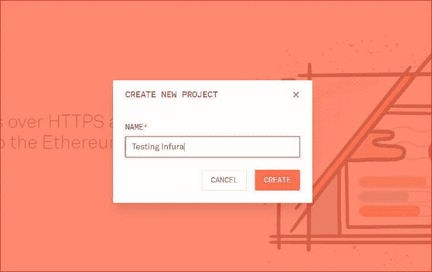

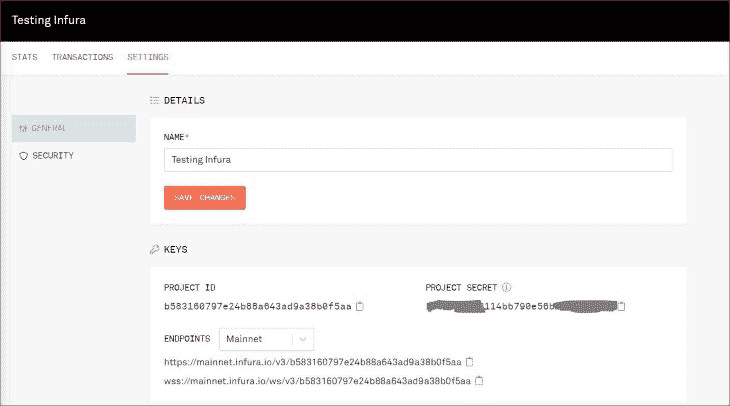

得到`mainnet`端点后，我们就可以使用 Web3.js 与 live the Ethereum 网络连接了。

如果想在本地运行自己的以太坊网络，可以使用 [Ganache](https://www.trufflesuite.com/ganache) 。Ganache 不是一个活的以太坊网络，而是你拥有的一个克隆体。这使您能够轻松地测试协议，而无需花费真正的天然气费。您将无法访问任何令牌，因为它们在生产链上，而不是在您自己的链上。然而，以太币已经实现，它提供了 10 个帐户，每个帐户有 100 个以太币。

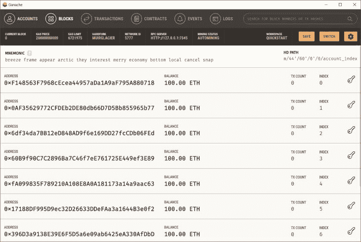

您可以看到 RPC 服务器正在本地主机的 7545 端口上运行。可以配置气价和气限。此外，一些帐户默认提供 100 ETH。

## 安装和运行 Web3.js

因为 Web3.js 是一个 JavaScript 库，你可以把它包含在你的网页或者任何基于 js 的框架中。为了测试功能，我们将在 Node.js 客户机上运行它。

使用以下命令安装 Web3.js:

```
npm install web3

```

安装 Web3.js 后，打开节点控制台并将其加载到一个变量中:

```
var Web3 = require('web3')

```

现在，让我们看看这个变量包含什么:

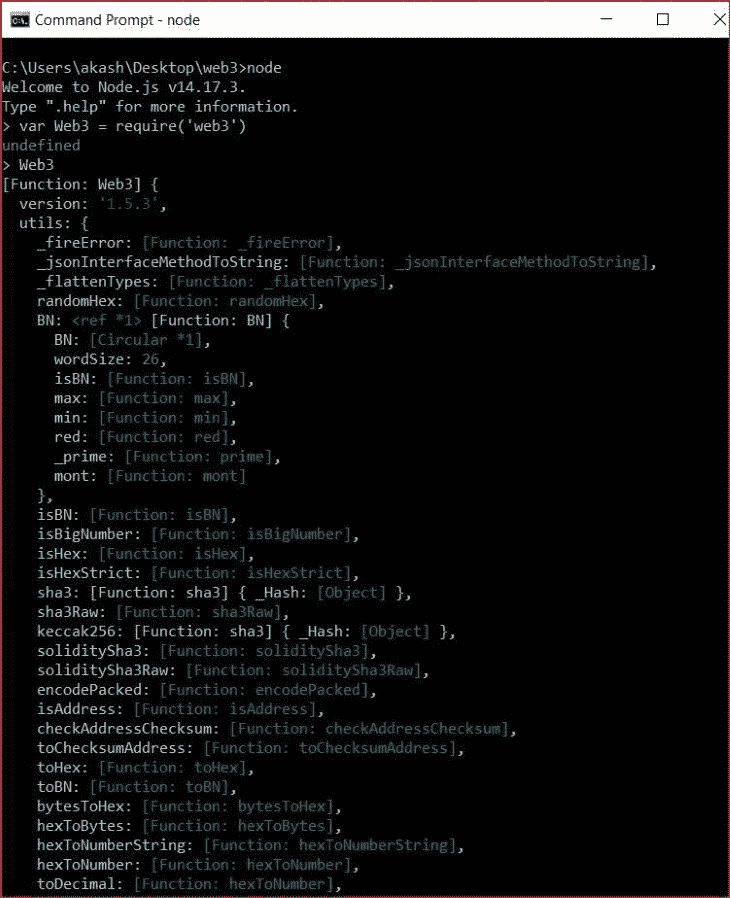

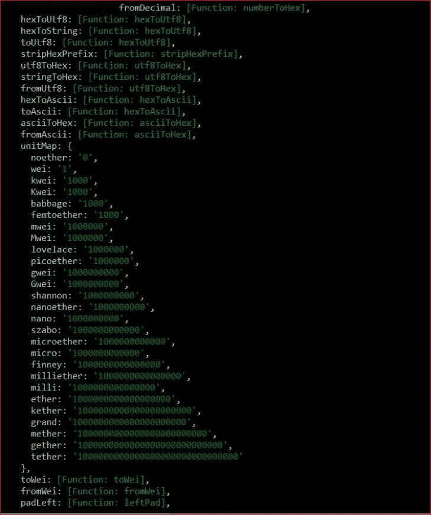

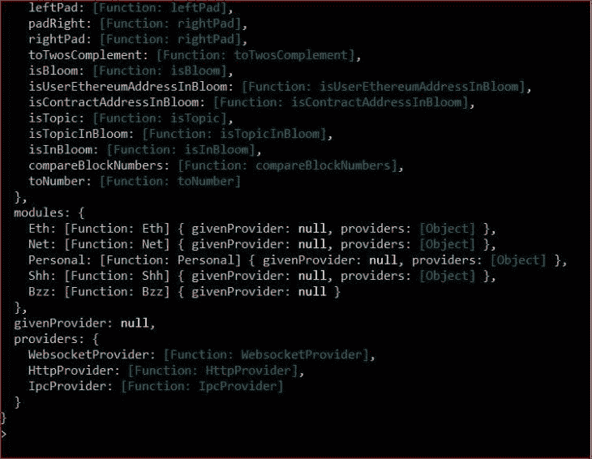

这个对象显示了我们可以通过 Web3.js 访问的所有功能。但是以太坊特定的功能还不可用，因为我们没有与链连接。我们需要用 Infura mainnet 端点实例化它。

```
var web3 = new Web3('https://mainnet.infura.io/v3/b583160797e24b88a643ad9a38b0f5aa')

```

现在如果你检查`web3`，你会发现一个巨大的函数列表。这些功能提供了与以太坊链网络相关的所有信息。

```
Web3 {
  currentProvider: [Getter/Setter],
  _requestManager: RequestManager {
    provider: HttpProvider {
      withCredentials: false,
      timeout: 0,
      headers: undefined,
      agent: undefined,
      connected: false,
      host: 'https://mainnet.infura.io/v3/b583160797e24b88a643ad9a38b0f5aa',
      httpsAgent: [Agent]
    },
    providers: {
      WebsocketProvider: [Function: WebsocketProvider],
      HttpProvider: [Function: HttpProvider],
      IpcProvider: [Function: IpcProvider]
    },
    subscriptions: Map(0) {}
  },
  givenProvider: null,
  providers: {
    WebsocketProvider: [Function: WebsocketProvider],
    HttpProvider: [Function: HttpProvider],
    IpcProvider: [Function: IpcProvider]
  },
  _provider: HttpProvider {
    withCredentials: false,
    timeout: 0,
    headers: undefined,
    agent: undefined,
    connected: false,
    host: 'https://mainnet.infura.io/v3/b583160797e24b88a643ad9a38b0f5aa',
    httpsAgent: Agent {
      _events: [Object: null prototype],
      _eventsCount: 2,
      _maxListeners: undefined,
      defaultPort: 443,
      protocol: 'https:',
      options: [Object],
      requests: {},
      sockets: {},
      freeSockets: {},
      keepAliveMsecs: 1000,
      keepAlive: true,
      maxSockets: Infinity,
      maxFreeSockets: 256,
      scheduling: 'lifo',
      maxTotalSockets: Infinity,
      totalSocketCount: 0,
      maxCachedSessions: 100,
      _sessionCache: [Object],
      [Symbol(kCapture)]: false
    }
  },
  setProvider: [Function (anonymous)],
  setRequestManager: [Function (anonymous)],
  BatchRequest: [Function: bound Batch],
  extend: [Function: ex] {
    formatters: {
      inputDefaultBlockNumberFormatter: [Function: inputDefaultBlockNumberFormatter],
      inputBlockNumberFormatter: [Function: inputBlockNumberFormatter],
      inputCallFormatter: [Function: inputCallFormatter],
      inputTransactionFormatter: [Function: inputTransactionFormatter],
      inputAddressFormatter: [Function: inputAddressFormatter],
      inputPostFormatter: [Function: inputPostFormatter],
      inputLogFormatter: [Function: inputLogFormatter],
      inputSignFormatter: [Function: inputSignFormatter],
      inputStorageKeysFormatter: [Function: inputStorageKeysFormatter],
      outputProofFormatter: [Function: outputProofFormatter],
      outputBigNumberFormatter: [Function: outputBigNumberFormatter],
      outputTransactionFormatter: [Function: outputTransactionFormatter],
      outputTransactionReceiptFormatter: [Function: outputTransactionReceiptFormatter],
      outputBlockFormatter: [Function: outputBlockFormatter],
      outputLogFormatter: [Function: outputLogFormatter],
      outputPostFormatter: [Function: outputPostFormatter],
      outputSyncingFormatter: [Function: outputSyncingFormatter]
    },
    utils: {
      _fireError: [Function: _fireError],
      _jsonInterfaceMethodToString: [Function: _jsonInterfaceMethodToString],
      _flattenTypes: [Function: _flattenTypes],
      randomHex: [Function: randomHex],
      BN: [Function],
      isBN: [Function: isBN],
      isBigNumber: [Function: isBigNumber],
      isHex: [Function: isHex],
      isHexStrict: [Function: isHexStrict],
      sha3: [Function],
      sha3Raw: [Function: sha3Raw],
      keccak256: [Function],
      soliditySha3: [Function: soliditySha3],
      soliditySha3Raw: [Function: soliditySha3Raw],
      encodePacked: [Function: encodePacked],
      isAddress: [Function: isAddress],
      checkAddressChecksum: [Function: checkAddressChecksum],
      toChecksumAddress: [Function: toChecksumAddress],
      toHex: [Function: toHex],
      toBN: [Function: toBN],
      bytesToHex: [Function: bytesToHex],
      hexToBytes: [Function: hexToBytes],
      hexToNumberString: [Function: hexToNumberString],
      hexToNumber: [Function: hexToNumber],
      toDecimal: [Function: hexToNumber],
      numberToHex: [Function: numberToHex],
      fromDecimal: [Function: numberToHex],
      hexToUtf8: [Function: hexToUtf8],
      hexToString: [Function: hexToUtf8],
      toUtf8: [Function: hexToUtf8],
      stripHexPrefix: [Function: stripHexPrefix],
      utf8ToHex: [Function: utf8ToHex],
      stringToHex: [Function: utf8ToHex],
      fromUtf8: [Function: utf8ToHex],
      hexToAscii: [Function: hexToAscii],
      toAscii: [Function: hexToAscii],
      asciiToHex: [Function: asciiToHex],
      fromAscii: [Function: asciiToHex],
      unitMap: [Object],
      toWei: [Function: toWei],
      fromWei: [Function: fromWei],
      padLeft: [Function: leftPad],
      leftPad: [Function: leftPad],
      padRight: [Function: rightPad],
      rightPad: [Function: rightPad],
      toTwosComplement: [Function: toTwosComplement],
      isBloom: [Function: isBloom],
      isUserEthereumAddressInBloom: [Function: isUserEthereumAddressInBloom],
      isContractAddressInBloom: [Function: isContractAddressInBloom],
      isTopic: [Function: isTopic],
      isTopicInBloom: [Function: isTopicInBloom],
      isInBloom: [Function: isInBloom],
      compareBlockNumbers: [Function: compareBlockNumbers],
      toNumber: [Function: toNumber]
    },
    Method: [Function: Method]
  },
  version: '1.5.3',
  utils: {
    _fireError: [Function: _fireError],
    _jsonInterfaceMethodToString: [Function: _jsonInterfaceMethodToString],
    _flattenTypes: [Function: _flattenTypes],
    randomHex: [Function: randomHex],
    BN: <ref *1> [Function: BN] {
      BN: [Circular *1],
      wordSize: 26,
      isBN: [Function: isBN],
      max: [Function: max],
      min: [Function: min],
      red: [Function: red],
      _prime: [Function: prime],
      mont: [Function: mont]
    },
    isBN: [Function: isBN],
    isBigNumber: [Function: isBigNumber],
    isHex: [Function: isHex],
    isHexStrict: [Function: isHexStrict],
    sha3: [Function: sha3] { _Hash: [Object] },
    sha3Raw: [Function: sha3Raw],
    keccak256: [Function: sha3] { _Hash: [Object] },
    soliditySha3: [Function: soliditySha3],
    soliditySha3Raw: [Function: soliditySha3Raw],
    encodePacked: [Function: encodePacked],
    isAddress: [Function: isAddress],
    checkAddressChecksum: [Function: checkAddressChecksum],
    toChecksumAddress: [Function: toChecksumAddress],
    toHex: [Function: toHex],
    toBN: [Function: toBN],
    bytesToHex: [Function: bytesToHex],
    hexToBytes: [Function: hexToBytes],
    hexToNumberString: [Function: hexToNumberString],
    hexToNumber: [Function: hexToNumber],
    toDecimal: [Function: hexToNumber],
    numberToHex: [Function: numberToHex],
    fromDecimal: [Function: numberToHex],
    hexToUtf8: [Function: hexToUtf8],
    hexToString: [Function: hexToUtf8],
    toUtf8: [Function: hexToUtf8],
    stripHexPrefix: [Function: stripHexPrefix],
    utf8ToHex: [Function: utf8ToHex],
    stringToHex: [Function: utf8ToHex],
    fromUtf8: [Function: utf8ToHex],
    hexToAscii: [Function: hexToAscii],
    toAscii: [Function: hexToAscii],
    asciiToHex: [Function: asciiToHex],
    fromAscii: [Function: asciiToHex],
    unitMap: {
      noether: '0',
      wei: '1',
      kwei: '1000',
      Kwei: '1000',
      babbage: '1000',
      femtoether: '1000',
      mwei: '1000000',
      Mwei: '1000000',
      lovelace: '1000000',
      picoether: '1000000',
      gwei: '1000000000',
      Gwei: '1000000000',
      shannon: '1000000000',
      nanoether: '1000000000',
      nano: '1000000000',
      szabo: '1000000000000',
      microether: '1000000000000',
      micro: '1000000000000',
      finney: '1000000000000000',
      milliether: '1000000000000000',
      milli: '1000000000000000',
      ether: '1000000000000000000',
      kether: '1000000000000000000000',
      grand: '1000000000000000000000',
      mether: '1000000000000000000000000',
      gether: '1000000000000000000000000000',
      tether: '1000000000000000000000000000000'
    },
    toWei: [Function: toWei],
    fromWei: [Function: fromWei],
    padLeft: [Function: leftPad],
    leftPad: [Function: leftPad],
    padRight: [Function: rightPad],
    rightPad: [Function: rightPad],
    toTwosComplement: [Function: toTwosComplement],
    isBloom: [Function: isBloom],
    isUserEthereumAddressInBloom: [Function: isUserEthereumAddressInBloom],
    isContractAddressInBloom: [Function: isContractAddressInBloom],
    isTopic: [Function: isTopic],
    isTopicInBloom: [Function: isTopicInBloom],
    isInBloom: [Function: isInBloom],
    compareBlockNumbers: [Function: compareBlockNumbers],
    toNumber: [Function: toNumber]
  },
  eth: <ref *2> Eth {
    currentProvider: [Getter/Setter],
    _requestManager: RequestManager {
      provider: [HttpProvider],
      providers: [Object],
      subscriptions: Map(0) {}
    },
    givenProvider: null,
    providers: {
      WebsocketProvider: [Function: WebsocketProvider],
      HttpProvider: [Function: HttpProvider],
      IpcProvider: [Function: IpcProvider]
    },
    _provider: HttpProvider {
      withCredentials: false,
      timeout: 0,
      headers: undefined,
      agent: undefined,
      connected: false,
      host: 'https://mainnet.infura.io/v3/b583160797e24b88a643ad9a38b0f5aa',
      httpsAgent: [Agent]
    },
    setProvider: [Function (anonymous)],
    setRequestManager: [Function (anonymous)],
    BatchRequest: [Function: bound Batch],
    extend: [Function: ex] {
      formatters: [Object],
      utils: [Object],
      Method: [Function: Method]
    },
    handleRevert: [Getter/Setter],
    defaultCommon: [Getter/Setter],
    defaultHardfork: [Getter/Setter],
    defaultChain: [Getter/Setter],
    transactionPollingTimeout: [Getter/Setter],
    transactionConfirmationBlocks: [Getter/Setter],
    transactionBlockTimeout: [Getter/Setter],
    defaultAccount: [Getter/Setter],
    defaultBlock: [Getter/Setter],
    maxListenersWarningThreshold: [Getter/Setter],
    clearSubscriptions: [Function: bound ],
    removeSubscriptionById: [Function: bound ],
    net: Net {
      currentProvider: [Getter/Setter],
      _requestManager: [RequestManager],
      givenProvider: null,
      providers: [Object],
      _provider: [HttpProvider],
      setProvider: [Function (anonymous)],
      setRequestManager: [Function (anonymous)],
      BatchRequest: [Function: bound Batch],
      extend: [Function],
      getId: [Function],
      isListening: [Function],
      getPeerCount: [Function],
      getNetworkType: [Function: bound getNetworkType]
    },
    accounts: Accounts {
      currentProvider: [Getter/Setter],
      _requestManager: [RequestManager],
      givenProvider: null,
      providers: [Object],
      _provider: [HttpProvider],
      setProvider: [Function (anonymous)],
      setRequestManager: [Function (anonymous)],
      _ethereumCall: [Object],
      wallet: [Wallet]
    },
    personal: Personal {
      currentProvider: [Getter/Setter],
      _requestManager: [RequestManager],
      givenProvider: null,
      providers: [Object],
      _provider: [HttpProvider],
      setProvider: [Function (anonymous)],
      setRequestManager: [Function (anonymous)],
      BatchRequest: [Function: bound Batch],
      extend: [Function],
      net: [Net],
      defaultAccount: [Getter/Setter],
      defaultBlock: [Getter/Setter],
      getAccounts: [Function],
      newAccount: [Function],
      unlockAccount: [Function],
      lockAccount: [Function],
      importRawKey: [Function],
      sendTransaction: [Function],
      signTransaction: [Function],
      sign: [Function],
      ecRecover: [Function]
    },
    Contract: [Function: Contract] {
      setProvider: [Function (anonymous)],
      defaultAccount: null,
      defaultBlock: 'latest',
      transactionBlockTimeout: 50,
      transactionConfirmationBlocks: 24,
      transactionPollingTimeout: 750,
      handleRevert: false,
      _requestManager: [RequestManager],
      _ethAccounts: [Accounts],
      currentProvider: [HttpProvider]
    },
    Iban: [class Iban],
    abi: ABICoder {},
    ens: ENS {
      eth: [Circular *2],
      _detectedAddress: null,
      _lastSyncCheck: null,
      registry: [Getter],
      resolverMethodHandler: [Getter],
      registryAddress: [Getter/Setter]
    },
    getNodeInfo: [Function: send] {
      method: [Method],
      request: [Function: bound ],
      call: 'web3_clientVersion'
    },
    getProtocolVersion: [Function: send] {
      method: [Method],
      request: [Function: bound ],
      call: 'eth_protocolVersion'
    },
    getCoinbase: [Function: send] {
      method: [Method],
      request: [Function: bound ],
      call: 'eth_coinbase'
    },
    isMining: [Function: send] {
      method: [Method],
      request: [Function: bound ],
      call: 'eth_mining'
    },
    getHashrate: [Function: send] {
      method: [Method],
      request: [Function: bound ],
      call: 'eth_hashrate'
    },
    isSyncing: [Function: send] {
      method: [Method],
      request: [Function: bound ],
      call: 'eth_syncing'
    },
    getGasPrice: [Function: send] {
      method: [Method],
      request: [Function: bound ],
      call: 'eth_gasPrice'
    },
    getFeeHistory: [Function: send] {
      method: [Method],
      request: [Function: bound ],
      call: 'eth_feeHistory'
    },
    getAccounts: [Function: send] {
      method: [Method],
      request: [Function: bound ],
      call: 'eth_accounts'
    },
    getBlockNumber: [Function: send] {
      method: [Method],
      request: [Function: bound ],
      call: 'eth_blockNumber'
    },
    getBalance: [Function: send] {
      method: [Method],
      request: [Function: bound ],
      call: 'eth_getBalance'
    },
    getStorageAt: [Function: send] {
      method: [Method],
      request: [Function: bound ],
      call: 'eth_getStorageAt'
    },
    getCode: [Function: send] {
      method: [Method],
      request: [Function: bound ],
      call: 'eth_getCode'
    },
    getBlock: [Function: send] {
      method: [Method],
      request: [Function: bound ],
      call: [Function: blockCall]
    },
    getUncle: [Function: send] {
      method: [Method],
      request: [Function: bound ],
      call: [Function: uncleCall]
    },
    getBlockTransactionCount: [Function: send] {
      method: [Method],
      request: [Function: bound ],
      call: [Function: getBlockTransactionCountCall]
    },
    getBlockUncleCount: [Function: send] {
      method: [Method],
      request: [Function: bound ],
      call: [Function: uncleCountCall]
    },
    getTransaction: [Function: send] {
      method: [Method],
      request: [Function: bound ],
      call: 'eth_getTransactionByHash'
    },
    getTransactionFromBlock: [Function: send] {
      method: [Method],
      request: [Function: bound ],
      call: [Function: transactionFromBlockCall]
    },
    getTransactionReceipt: [Function: send] {
      method: [Method],
      request: [Function: bound ],
      call: 'eth_getTransactionReceipt'
    },
    getTransactionCount: [Function: send] {
      method: [Method],
      request: [Function: bound ],
      call: 'eth_getTransactionCount'
    },
    sendSignedTransaction: [Function: send] {
      method: [Method],
      request: [Function: bound ],
      call: 'eth_sendRawTransaction'
    },
    signTransaction: [Function: send] {
      method: [Method],
      request: [Function: bound ],
      call: 'eth_signTransaction'
    },
    sendTransaction: [Function: send] {
      method: [Method],
      request: [Function: bound ],
      call: 'eth_sendTransaction'
    },
    sign: [Function: send] {
      method: [Method],
      request: [Function: bound ],
      call: 'eth_sign'
    },
    call: [Function: send] {
      method: [Method],
      request: [Function: bound ],
      call: 'eth_call'
    },
    estimateGas: [Function: send] {
      method: [Method],
      request: [Function: bound ],
      call: 'eth_estimateGas'
    },
    submitWork: [Function: send] {
      method: [Method],
      request: [Function: bound ],
      call: 'eth_submitWork'
    },
    getWork: [Function: send] {
      method: [Method],
      request: [Function: bound ],
      call: 'eth_getWork'
    },
    getPastLogs: [Function: send] {
      method: [Method],
      request: [Function: bound ],
      call: 'eth_getLogs'
    },
    getChainId: [Function: send] {
      method: [Method],
      request: [Function: bound ],
      call: 'eth_chainId'
    },
    requestAccounts: [Function: send] {
      method: [Method],
      request: [Function: bound ],
      call: 'eth_requestAccounts'
    },
    getProof: [Function: send] {
      method: [Method],
      request: [Function: bound ],
      call: 'eth_getProof'
    },
    getPendingTransactions: [Function: send] {
      method: [Method],
      request: [Function: bound ],
      call: 'eth_pendingTransactions'
    },
    subscribe: [Function (anonymous)]
  },
  shh: Shh {
    currentProvider: [Getter/Setter],
    _requestManager: RequestManager {
      provider: [HttpProvider],
      providers: [Object],
      subscriptions: Map(0) {}
    },
    givenProvider: null,
    providers: {
      WebsocketProvider: [Function: WebsocketProvider],
      HttpProvider: [Function: HttpProvider],
      IpcProvider: [Function: IpcProvider]
    },
    _provider: HttpProvider {
      withCredentials: false,
      timeout: 0,
      headers: undefined,
      agent: undefined,
      connected: false,
      host: 'https://mainnet.infura.io/v3/b583160797e24b88a643ad9a38b0f5aa',
      httpsAgent: [Agent]
    },
    setProvider: [Function (anonymous)],
    setRequestManager: [Function (anonymous)],
    BatchRequest: [Function: bound Batch],
    extend: [Function: ex] {
      formatters: [Object],
      utils: [Object],
      Method: [Function: Method]
    },
    net: Net {
      currentProvider: [Getter/Setter],
      _requestManager: [RequestManager],
      givenProvider: null,
      providers: [Object],
      _provider: [HttpProvider],
      setProvider: [Function (anonymous)],
      setRequestManager: [Function (anonymous)],
      BatchRequest: [Function: bound Batch],
      extend: [Function],
      getId: [Function],
      isListening: [Function],
      getPeerCount: [Function]
    },
    subscribe: [Function (anonymous)],
    getVersion: [Function: send] {
      method: [Method],
      request: [Function: bound ],
      call: 'shh_version'
    },
    getInfo: [Function: send] {
      method: [Method],
      request: [Function: bound ],
      call: 'shh_info'
    },
    setMaxMessageSize: [Function: send] {
      method: [Method],
      request: [Function: bound ],
      call: 'shh_setMaxMessageSize'
    },
    setMinPoW: [Function: send] {
      method: [Method],
      request: [Function: bound ],
      call: 'shh_setMinPoW'
    },
    markTrustedPeer: [Function: send] {
      method: [Method],
      request: [Function: bound ],
      call: 'shh_markTrustedPeer'
    },
    newKeyPair: [Function: send] {
      method: [Method],
      request: [Function: bound ],
      call: 'shh_newKeyPair'
    },
    addPrivateKey: [Function: send] {
      method: [Method],
      request: [Function: bound ],
      call: 'shh_addPrivateKey'
    },
    deleteKeyPair: [Function: send] {
      method: [Method],
      request: [Function: bound ],
      call: 'shh_deleteKeyPair'
    },
    hasKeyPair: [Function: send] {
      method: [Method],
      request: [Function: bound ],
      call: 'shh_hasKeyPair'
    },
    getPublicKey: [Function: send] {
      method: [Method],
      request: [Function: bound ],
      call: 'shh_getPublicKey'
    },
    getPrivateKey: [Function: send] {
      method: [Method],
      request: [Function: bound ],
      call: 'shh_getPrivateKey'
    },
    newSymKey: [Function: send] {
      method: [Method],
      request: [Function: bound ],
      call: 'shh_newSymKey'
    },
    addSymKey: [Function: send] {
      method: [Method],
      request: [Function: bound ],
      call: 'shh_addSymKey'
    },
    generateSymKeyFromPassword: [Function: send] {
      method: [Method],
      request: [Function: bound ],
      call: 'shh_generateSymKeyFromPassword'
    },
    hasSymKey: [Function: send] {
      method: [Method],
      request: [Function: bound ],
      call: 'shh_hasSymKey'
    },
    getSymKey: [Function: send] {
      method: [Method],
      request: [Function: bound ],
      call: 'shh_getSymKey'
    },
    deleteSymKey: [Function: send] {
      method: [Method],
      request: [Function: bound ],
      call: 'shh_deleteSymKey'
    },
    newMessageFilter: [Function: send] {
      method: [Method],
      request: [Function: bound ],
      call: 'shh_newMessageFilter'
    },
    getFilterMessages: [Function: send] {
      method: [Method],
      request: [Function: bound ],
      call: 'shh_getFilterMessages'
    },
    deleteMessageFilter: [Function: send] {
      method: [Method],
      request: [Function: bound ],
      call: 'shh_deleteMessageFilter'
    },
    post: [Function: send] {
      method: [Method],
      request: [Function: bound ],
      call: 'shh_post'
    },
    unsubscribe: [Function: send] {
      method: [Method],
      request: [Function: bound ],
      call: 'shh_unsubscribe'
    }
  },
  bzz: Bzz {
    givenProvider: null,
    currentProvider: null,
    isAvailable: [Function (anonymous)],
    upload: [Function (anonymous)],
    download: [Function (anonymous)]
  }
}

```

在整个对象中，我们感兴趣的是`eth`和`utils`键。`web3.utils`拥有实用功能，这将有助于与区块链，和`web3.eth`拥有所有以太坊区块链相关的功能。

### 理解以太单元

了解以太中的不同单位是很重要的。如果你看上面的对象，你可以在`utils`中找到`unitMap`属性。您也可以通过运行以下命令来获取列表:

```
web3.utils.unitMap

```

| 单位 | 重量 |
| --- | --- |
| `noether` | 0 |
| `wei` | 一 |
| `kwei` / `babbage` / `femtoether` | 1,000 |
| `mwei` / `lovelace` / `picoether` | 1,000,000 |
| `gwei` / `shannon` / `nanoether` / `nano` | 1,000,000,000 |
| `szabo` / `microether` / `micro` | 1,000,000,000,000 |
| `finney` / `milliether` / `milli` | 1,000,000,000,000,000 |
| `ether` | 1,000,000,000,000,000,000 |
| `kether` / `grand` | 1,000,000,000,000,000,000,000 |
| `mether` | 1,000,000,000,000,000,000,000,000 |
| `gether` | 1,000,000,000,000,000,000,000,000,000 |
| `tether` | 1,000,000,000,000,000,000,000,000,000,000 |

最小的单位是`wei`，最大的是`tether`。有三个重要的单位，分别用于不同的任务:`wei`、`Gwei`、`ether` (1 乙醚= 10 亿魏):

| 单位 | 用例 |
| --- | --- |
| `wei` | 一切都在内部用`wei`表示。所以，如果你正在寻找一个帐户持有的硬币数量，它将在`wei`中被图书馆返回。 |
| `Gwei` | 煤气费用`Gwei`单位表示。每笔交易都需要交燃气费。这些费用是不固定的，交易处理时间取决于它可以支付多少汽油。 |
| `ether` | 加密货币用这个单位表示。 |

`web3.utils`提供了两个可以用来将一个单位转换成另一个单位的函数:`toWei`和`fromWei`。`toWei`从另一个单位转换到魏。

```
web3.utils.toWei(count_to_convert, unit_to_convert_from)

```

`count_to_convert`是需要换算的金额。应该在字符串里。`unit_to_convert_from`是当前量的单位(例如乙醚)。像这样使用它:

```
> web3.utils.toWei('34', 'ether')
'34000000000000000000'

```

`fromWei`用于从魏转换到另一个单位。

```
web3.utils.fromWei(count_to_convert, unit_to_convert_to)

```

例如:

```
> web3.utils.fromWei('48593000000000000000', 'micro')
'48593000'

```

您可以组合使用这些功能将任何单位转换成另一个单位。

```
web3.utils.fromWei(web3.utils.toWei(count_to_convert, unit_to_convert_from), unit_to_convert_to)

```

例如，假设您想将 23 Ether 转换为 micro:

```
> web3.utils.fromWei(web3.utils.toWei('23', 'ether'), 'micro')
'23000000'

```


我们将回顾一些其他函数，但在此之前，我们需要回顾一下 Etherscan。

## 什么是以太扫描？

[以太扫描](https://etherscan.io/)是以太坊区块链探索者。你可以得到关于以太币、代币、智能合约、账户等各种信息。所以 Web3 能做的所有操作都可以通过查看以太扫描来确认。

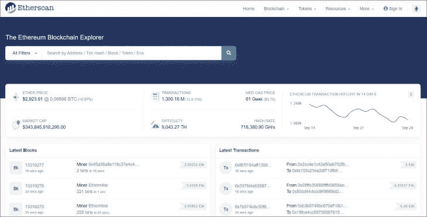

主页显示与以太币相关的信息。您可以通过在栏中搜索来获取有关令牌的信息。在撰写本文时，统计数据如下:

| 斯达 | 价值 |
| --- | --- |
| 价格 | $2,923 |
| 处理 | 1300 米 |
| 天然气价格 | 61 Gwei |
| 市值 | 大约 3430 亿美元 |
| 困难 | 第 9043 街 |
| 哈希速率 | 718，380 千兆赫/秒 |
| 最新区块 | 133192777 |

让我们通过 Web3.js 来看看这些统计数据——除了价格，因为它不是一个技术数字。价格是一个交易问题，与区块链无关。这是由供求关系决定的。如果你想知道价格，你需要调用交易所的 API，比如波洛涅克斯、币安、Coinmarketcap 等等。

要获得所有事务的计数，您需要从链中的每个块获得事务计数。以太坊不直接提供交易总数。Etherscan 必须将该计数单独保存在其数据库中。

### 最新区块

首先，获取最新的块号:

```
web3.eth.getBlock('latest').then(console.log)

```

注意，我们在这个函数中使用了`then`块。这是因为所有的`eth`分支函数都在链上发出网络请求。他们返回一个[承诺](https://blog.logrocket.com/improve-async-programming-with-javascript-promises/)，`then`函数用于获得响应。

这将显示关于最新块的信息。

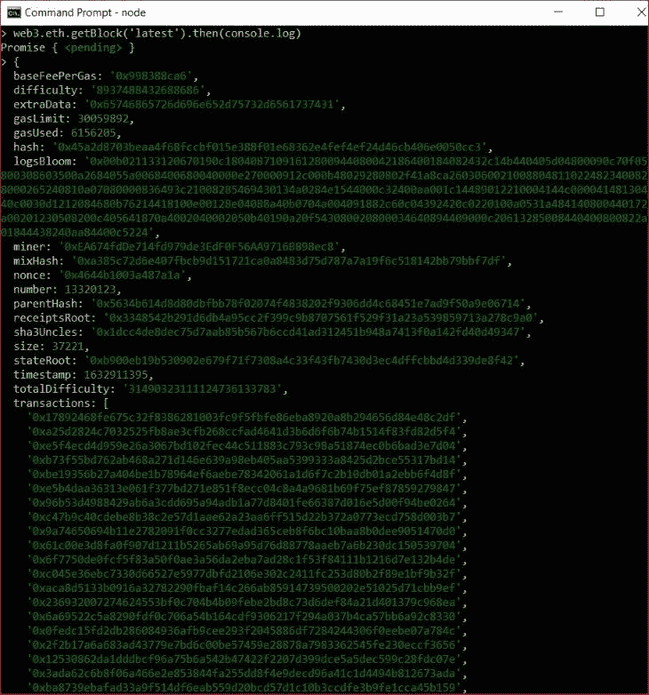

在这里，您可以看到关于单个块的一些有用信息。首先，它是运行代码时的最新块。

### `gasLimit`和`gasUsed`

还可以看到`gasLimit`和`gasUsed`。`gasLimit`是用户愿意为开采该区块支付的最高金额，而`gasUsed`是实际使用的金额。

该金额乘以基本燃气费，即`baseFeePerGas`，得出总费用。在这个对象中，`baseFeePerGas`用十六进制表示。你可以使用`web3.utils`函数将其转换成十进制:

```
> web3.utils.toDecimal('0x998388ca6')
45677054459

```

记住，所有的金额都存储在这个链中的`wei`单元中。因此，该区块的天然气价格为 45677054459 魏。但是在`gasUsed`键中列出了使用了多少气体？为了得到该区块的总气费，我们可以使用以下公式:

```
> var singleGasFee = web3.utils.toDecimal('0x998388ca6')
> var totalGas = 6156205
> var totalFeeInWei = singleGasFee * totalGas
> totalFeeInWei
253688272429254180
> var totalFeeInEther = web3.utils.fromWei(totalFeeInWei.toString(), 'ether')
> totalFeeInEther
'0.25368827242925418'

```

我们可以看到，这个区块已经向矿工支付了 0.2537 乙醚。

### 困难

还有其他参数，如`difficulty`，它决定了矿工需要解决的难题的复杂程度。这种情况持续增加，使得矿工很难开采硬币。这就是为什么需要更多的计算和沉重的硬件，更不用说大量的时间。

对于这一块，难度是 8，937，488，432，688，686。如果和第一块的难度对比，会看到另一个巨大的数字。

第一块难度:

```
> web3.eth.getBlock(1).then(res => {console.log(res.difficulty)})
17171480576

```

第一个方块的难度是 17，171，480，576，但我们的方块是 8，937，488，432，688，686。

### 批号

该对象还列出了`number`键中的块号。这意味着已经开采了 13，320，123 个区块。

对所有块运行循环，以获得每个块中的总交易量，然后将它们相加，以获得以太坊链中的总交易量。

```
var totalTransactions = 0;
for(var i=1; i <= 13320123; i++){
    web3.eth.getBlockTransactionCount(i).then(res => {
      totalTransactions += res;
    })
}

```

这里我使用的是`getBlockTransactionCount`函数，但是您也可以使用`getBlock`函数并从提供的数组中计算事务数。您可以在上面的图像中看到，我们正在块中获取一组事务。您可以使用 JavaScript 的`length`属性来获取总交易量。

**注意:不要运行上述循环**。我展示它是为了演示如何获得总交易量，但这非常昂贵。会有 1300 万个 API 调用，简直是灾难。如果您需要总的事务计数，只需从 Etherscan 获取并将其存储在数据库中。对于所有额外的块，您可以点击 API 并将事务添加到存储计数中。

### 天然气价格

要获取当前的网络气价，可以使用`web3.eth`的`getGasPrice`功能。

```
> web3.eth.getGasPrice().then(console.log)
110063065122
> web3.utils.fromWei('110063065122', 'gwei')
'110.063065122'

```

截稿时网络气价 110 Gwei。

## 访问区块链帐户信息

区块链的所有东西都有一个用 SHA3 字符串表示的地址。这可能是一个帐户，令牌，硬币，智能合同，或任何其他东西。如果你在以太坊区块链有一个账户，它必须用一个唯一的 SHA3 字符串表示。

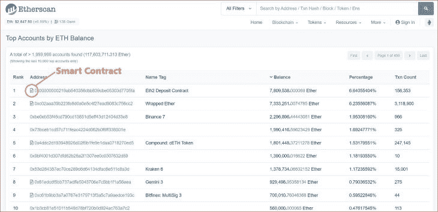

这是持有以太币最多的 10 个账户。您可以看到还有智能合约账户。合同也可以持有硬币。

让我们对一个帐户执行一些操作。我们将使用列表中的第三个帐户，它的名称标签为`Binance 7`。

首先，将帐户地址存储在一个变量中:

```
> var accountAddress = '0xbe0eb53f46cd790cd13851d5eff43d12404d33e8'

```

可以看到地址是用 SHA3 算法编码的十六进制字符串。

要读取该帐户的余额:

```
> web3.eth.getBalance(accountAddress).then(console.log)
2296896444430813427853147

```

数字在`wei`里，所以我们需要把它转换成`Ether`:

```
> web3.utils.fromWei('2296896444430813427853147', 'ether')
'2296896.444430813427853147'

```

这个账户有 2，296，896 乙醚:


### 交易计数

要获取此帐户发送的交易总数，请使用以下命令:

```
> web3.eth.getTransactionCount(accountAddress).then(console.log)
891

```

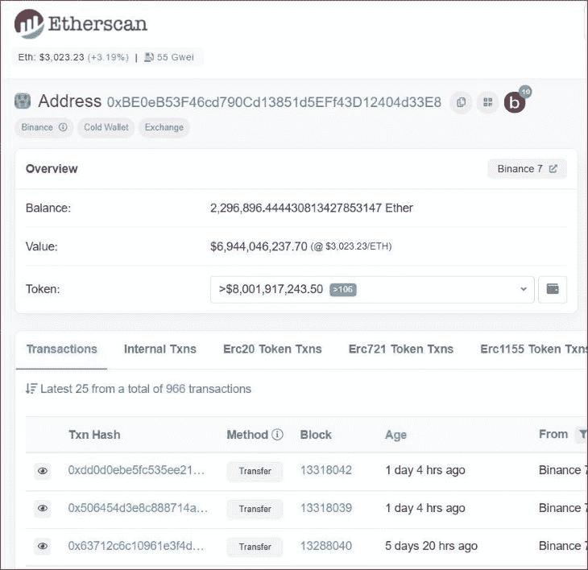

以太网扫描显示 966 个交易，因为它也包括收到的交易。

### 创建新帐户

您可以使用 Web3.js 在以太坊区块链上创建一个新帐户:

```
> web3.eth.accounts.create()
{
  address: '0x8F0cE820cecf482D0909501508E730cb0d8C806d',
  privateKey: '0x1912e5bc09cc0def85ae95cdd******************35c96230a59a834ee',
  signTransaction: [Function: signTransaction],
  sign: [Function: sign],
  encrypt: [Function: encrypt]
}

```

可以看到地址和私钥。虽然我不打算使用这个帐户做任何事情，但为了防止其他人通过这个帐户进行交易，我混淆了一些字符。**不要向该帐户添加任何硬币或代币，因为它将保持孤立状态**。


该帐户将在 Etherscan 上可用。它将是空的，但是可用:

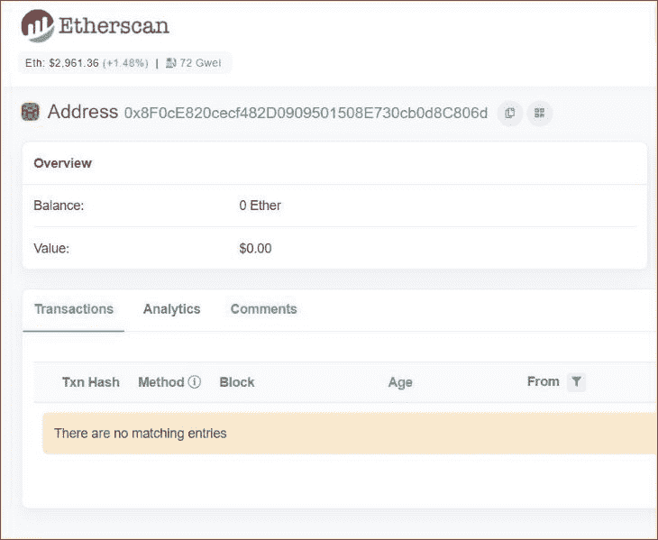

## 连接到本地以太坊链

假设您正在开发一个应用程序，并且想要测试它。如果你在直播链上测试，你将不得不为你所做的任何操作支付一笔油费。这些操作被记录为交易，因此需要天然气费。

要解决这个问题，您可以使用 Ganache 在本地运行您的私有链，并在其上部署您的应用程序。那样的话，你就不需要支付真正的油费了。你需要支付汽油费，但是你可以免费使用所有的乙醚。

我们已经安装了 Ganache，并看到它运行在本地主机的 7545 端口上。让我们使用 Web3.js 来连接它。

```
> var web3G = new Web3('http://127.0.0.1:7545')

```

我们在`web3G`变量中实例化 Ganache，因为`web3`用于 Infura 活链。此外，Ganache 已经创建了几个帐户。

让我们再创建一个帐户。这里我们需要使用 Web3.js 的`personal`属性，因为我们可以在我们的节点上创建一个帐户。

首先，检查我们在 Ganache 上有多少帐户:

```
> web3G.eth.getAccounts().then(console.log)
[
  '0xF148563F7968cEcea44957aDa1A9aF795A880718',
  '0x0AF35629772CFDEb2DE80db66D7D5Bb855965b77',
  '0x6df34da7BB12eD848AD9f6e169DD27fcCDb06FEd',
  '0x60B9f90C7C2896Ba7C46f7eE761725E449ef3E89',
  '0xfA099835F789210A108E8A0A181173a14a9aac63',
  '0x17188DF995D9ec32D26633DDeFAa3a1644B3e0f2',
  '0x396D3a9138E39E6F5D5a6e09ab6425eA330AfDbD',
  '0x17d8c3dDe00Fb8f686591430cCB6a517FB97Ea96',
  '0xDF5CC5f9Fed1B9a091C6B73984C52D2555d62BEe',
  '0x55a4AdC17c6903f064E181f3BD2A34374B7C6543'
]

```

有 10 个账户。你也可以在 Ganache UI 上看到这些账户。

让我们使用 Web3.js 再创建一个:

```
> web3G.eth.personal.newAccount('this|is|password').then(console.log)
0x84D8FA3a23ac9066066Dd6c63680BC0FBd31aEe6

```

这是新帐户，它应该在列表中:

```
> web3G.eth.getAccounts().then(console.log)
[
  '0xF148563F7968cEcea44957aDa1A9aF795A880718',
  '0x0AF35629772CFDEb2DE80db66D7D5Bb855965b77',
  '0x6df34da7BB12eD848AD9f6e169DD27fcCDb06FEd',
  '0x60B9f90C7C2896Ba7C46f7eE761725E449ef3E89',
  '0xfA099835F789210A108E8A0A181173a14a9aac63',
  '0x17188DF995D9ec32D26633DDeFAa3a1644B3e0f2',
  '0x396D3a9138E39E6F5D5a6e09ab6425eA330AfDbD',
  '0x17d8c3dDe00Fb8f686591430cCB6a517FB97Ea96',
  '0xDF5CC5f9Fed1B9a091C6B73984C52D2555d62BEe',
  '0x55a4AdC17c6903f064E181f3BD2A34374B7C6543',
  '0x84D8FA3a23ac9066066Dd6c63680BC0FBd31aEe6'
]

```

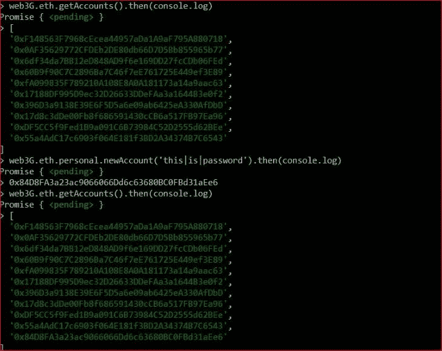

UI 可能不会显示新帐户，因为它只显示自动生成的帐户。

### 检查余额

我们可以轻松地检查任何帐户的余额，就像我们对实时链所做的那样:

```
> web3G.eth.getBalance('0xF148563F7968cEcea44957aDa1A9aF795A880718').then(console.log)
100000000000000000000

```

量以`wei`为单位，相当于 100 乙醚。

### 在账户间发送硬币

因为我们在 Ganache 上，所以不用花任何真金白银就能看到这个功能。

这里，我们将从列表中的第一个帐户向第二个帐户发送 1 ether。我们需要提供汽油价格和汽油限量，因此了解这些值非常重要。网络有一个变化的气体限制，但我们需要保持我们的价值低于这一点，而不是太多，它不能被开采。

如果您在上面的图像中看到，Ganache 提供了以下值。

*   天然气价格:20 亿英镑
*   气体极限:6721975

在我们的交易中，我们将限额设为 6500000，价格如下所示:

```
web3G.eth.sendTransaction({
    from: '0xF148563F7968cEcea44957aDa1A9aF795A880718',
    gasPrice: "20000000000",
    gas: "6500000",
    to: '0x0AF35629772CFDEb2DE80db66D7D5Bb855965b77',
    value: "1000000000000000000",
    data: ""
}, 'this|is|password').then(console.log);

```

这将返回交易信息:

```
{
  transactionHash: '0x7652e3cf6a4dcb522c897385d1a0acf092f890a4f38685d2141878a9a981e650',
  transactionIndex: 0,
  blockHash: '0x7bef068531cba78022cd01bd160663f27f2ccb2a2cebf94f03be08d09f19c111',
  blockNumber: 1,
  from: '0xf148563f7968cecea44957ada1a9af795a880718',
  to: '0x0af35629772cfdeb2de80db66d7d5bb855965b77',
  gasUsed: 21000,
  cumulativeGasUsed: 21000,
  contractAddress: null,
  logs: [],
  status: true,
  logsBloom: '0x00000000000000000000000000000000000000000000000000000000000000000000000000000000000000000000000000000000000000000000000000000000000000000000000000000000000000000000000000000000000000000000000000000000000000000000000000000000000000000000000000000000000000000000000000000000000000000000000000000000000000000000000000000000000000000000000000000000000000000000000000000000000000000000000000000000000000000000000000000000000000000000000000000000000000000000000000000000000000000000000000000000000000000000000000000000'
}

```

如您所见，所用的天然气为 21，000，尽管我们输入了 6，500，000，因为网络取走了所用的天然气。所以用气支付的总费用= 21000×2000000000 魏= 0.00042 乙醚。

让我们检查一下两个账户的余额:

```
> web3G.eth.getBalance('0xF148563F7968cEcea44957aDa1A9aF795A880718').then(console.log)
98999580000000000000
> web3G.eth.getBalance('0x0AF35629772CFDEb2DE80db66D7D5Bb855965b77').then(console.log)
101000000000000000000

```

第一个帐户的余额为 98.99958 乙醚，因为转账了 1 乙醚，0.00042 乙醚用于支付汽油费。

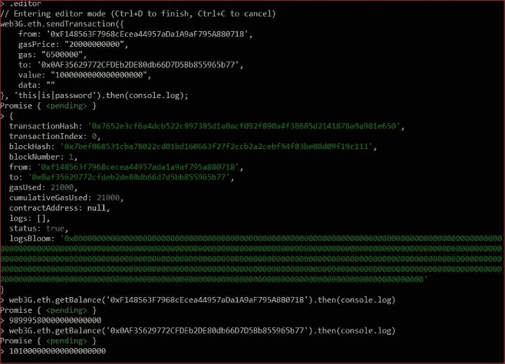

同样的情况也会反映在 GUI 上:

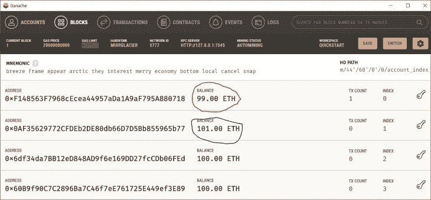

您可以在**块**和**交易**选项卡中获得更多信息:


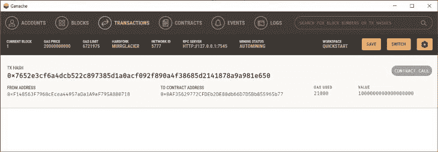

## 使用 Web3.js 访问令牌

以太是一枚硬币，使用智能合约在链上实现的其他一切都是令牌。用于交易的令牌需要使用 [ERC-20 协议](https://www.investopedia.com/news/what-erc20-and-what-does-it-mean-ethereum/)来实现。这定义了要遵循的一组规则。

如果你在 Etherscan 上查看，你会发现网络上所有 ERC-20 令牌的列表。

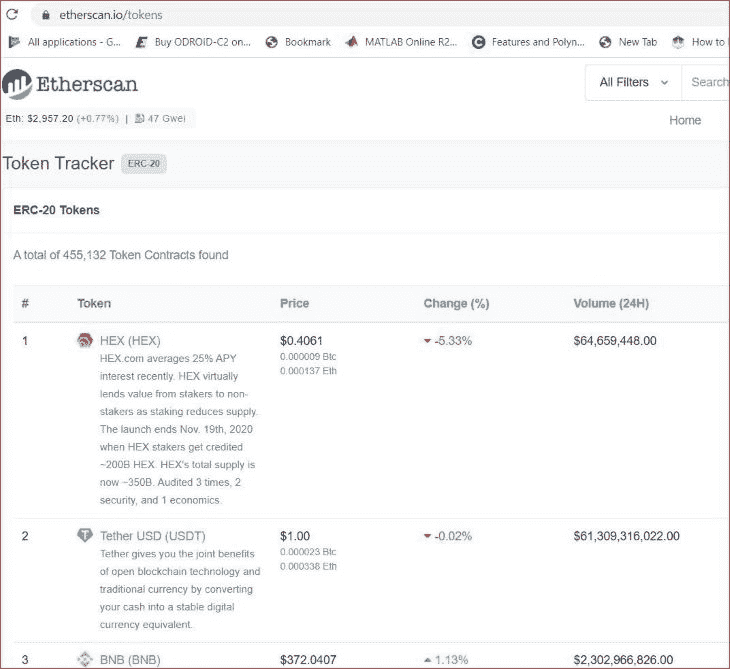

让我们选择一个令牌并对其执行操作。对于本教程，我选择 BNB。

当你在 Etherscan 上打开它时，你会发现诸如合同地址、令牌供应总量、持有者等信息。

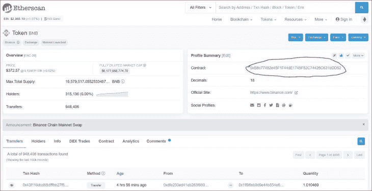

如果你点击合同地址(红色轮廓)，你会得到有用的信息。

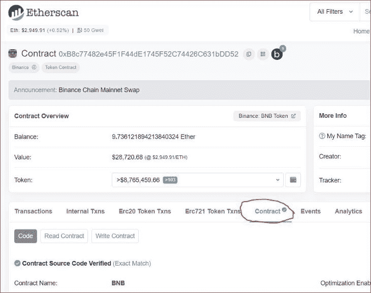

我们没有讨论创建智能契约，因为这超出了本文的范围。但简单来说，就是应用的代码。如果我们谈论的是令牌，那么智能合约就是编译后的代码。这个代码是用 Solidity 语言写的。

以太网扫描上的合同页面将向您显示 BNB 令牌的实体代码:

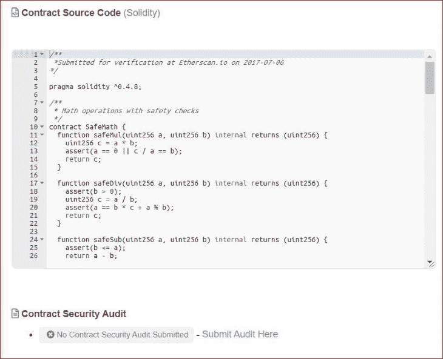

编译这段代码时，会创建一个字节码和一个 JSON 对象，这就是所谓的契约 ABI。这个 ABI 文件保存了在 Solidity 代码中声明的函数定义。

您还可以在以太网扫描的下一页找到 BNB 的 ABI:

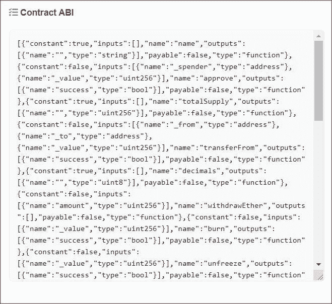

这种可靠性代码和 ABI 并不专用于 BNB 令牌，因为它们是 ERC-20 协议中定义的标准功能。

你可能会想，如果坚固性代码不是 BNB 特有的，那么它的符号、总供应量和所有其他属性是怎么来的呢？该信息作为参数传递给构造函数。

以下是论点:


但是它们是如何传递给构造函数的呢？通过附加到合同的字节码。

首先，这些参数被转换成字节码:

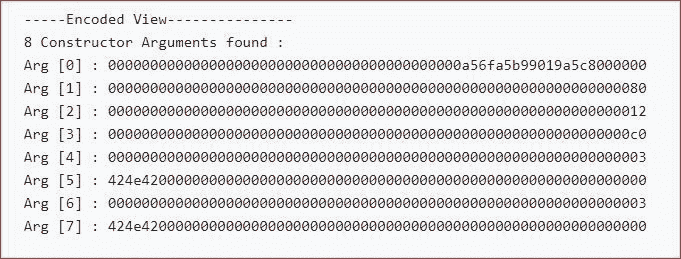

这些不同的字节码被连接成一个字符串。让我们称下面的参数为字节码:


我们知道合同源代码被编译成字节码和 ABI。所以它的字节码看起来像这样:

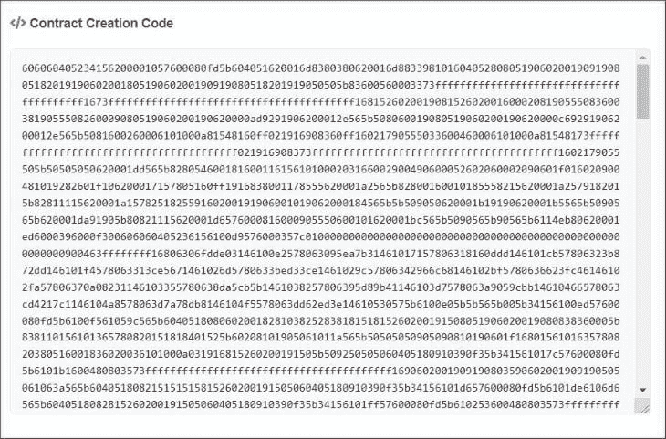

这个字节码是智能合约的可靠性代码的低级表示。它是在以太坊虚拟机(EVM)编译 Solidity 代码时创建的。为了将参数传递给 Solidity 构造函数，参数字节码被附加到这个契约字节码上。

完整的契约字节码将如下所示:

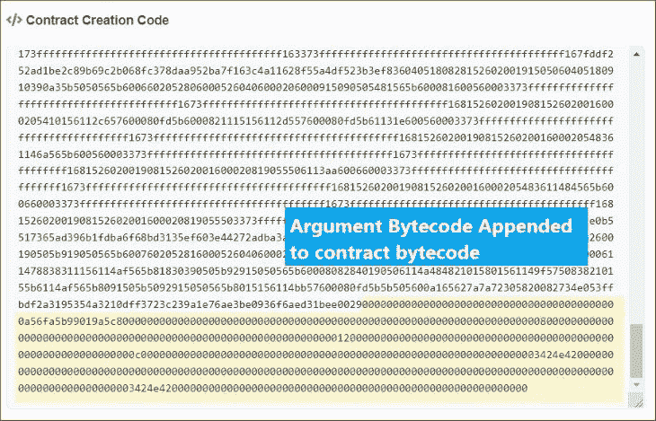

## 在 Web3.js 中使用合同

要在 Web3.js 中使用合同，我们需要两件东西:ABI 和合同地址。我们已经了解了什么是 ABI 以及如何获得它，我们也知道合同地址。

Web3.js 在`eth`属性上提供了一个`Contract`属性。我们需要将其实例化并存储在一个变量中。该函数的格式如下:

```
> var newContract = new web3.eth.Contract(ABI, contractAddress)

```

让我们将 ABI 和合同地址存储在它们各自的变量中:

```
> var ABI = [{"constant":true,"inputs":[],"name":"name","outputs":[{"name":"","type":"string"}],"payable":false,"type":"function"},{"constant":false,"inputs":[{"name":"_spender","type":"address"},{"name":"_value","type":"uint256"}],"name":"approve","outputs":[{"name":"success","type":"bool"}],"payable":false,"type":"function"},{"constant":true,"inputs":[],"name":"totalSupply","outputs":[{"name":"","type":"uint256"}],"payable":false,"type":"function"},{"constant":false,"inputs":[{"name":"_from","type":"address"},{"name":"_to","type":"address"},{"name":"_value","type":"uint256"}],"name":"transferFrom","outputs":[{"name":"success","type":"bool"}],"payable":false,"type":"function"},{"constant":true,"inputs":[],"name":"decimals","outputs":[{"name":"","type":"uint8"}],"payable":false,"type":"function"},{"constant":false,"inputs":[{"name":"amount","type":"uint256"}],"name":"withdrawEther","outputs":[],"payable":false,"type":"function"},{"constant":false,"inputs":[{"name":"_value","type":"uint256"}],"name":"burn","outputs":[{"name":"success","type":"bool"}],"payable":false,"type":"function"},{"constant":false,"inputs":[{"name":"_value","type":"uint256"}],"name":"unfreeze","outputs":[{"name":"success","type":"bool"}],"payable":false,"type":"function"},{"constant":true,"inputs":[{"name":"","type":"address"}],"name":"balanceOf","outputs":[{"name":"","type":"uint256"}],"payable":false,"type":"function"},{"constant":true,"inputs":[],"name":"owner","outputs":[{"name":"","type":"address"}],"payable":false,"type":"function"},{"constant":true,"inputs":[],"name":"symbol","outputs":[{"name":"","type":"string"}],"payable":false,"type":"function"},{"constant":false,"inputs":[{"name":"_to","type":"address"},{"name":"_value","type":"uint256"}],"name":"transfer","outputs":[],"payable":false,"type":"function"},{"constant":true,"inputs":[{"name":"","type":"address"}],"name":"freezeOf","outputs":[{"name":"","type":"uint256"}],"payable":false,"type":"function"},{"constant":false,"inputs":[{"name":"_value","type":"uint256"}],"name":"freeze","outputs":[{"name":"success","type":"bool"}],"payable":false,"type":"function"},{"constant":true,"inputs":[{"name":"","type":"address"},{"name":"","type":"address"}],"name":"allowance","outputs":[{"name":"","type":"uint256"}],"payable":false,"type":"function"},{"inputs":[{"name":"initialSupply","type":"uint256"},{"name":"tokenName","type":"string"},{"name":"decimalUnits","type":"uint8"},{"name":"tokenSymbol","type":"string"}],"payable":false,"type":"constructor"},{"payable":true,"type":"fallback"},{"anonymous":false,"inputs":[{"indexed":true,"name":"from","type":"address"},{"indexed":true,"name":"to","type":"address"},{"indexed":false,"name":"value","type":"uint256"}],"name":"Transfer","type":"event"},{"anonymous":false,"inputs":[{"indexed":true,"name":"from","type":"address"},{"indexed":false,"name":"value","type":"uint256"}],"name":"Burn","type":"event"},{"anonymous":false,"inputs":[{"indexed":true,"name":"from","type":"address"},{"indexed":false,"name":"value","type":"uint256"}],"name":"Freeze","type":"event"},{"anonymous":false,"inputs":[{"indexed":true,"name":"from","type":"address"},{"indexed":false,"name":"value","type":"uint256"}],"name":"Unfreeze","type":"event"}]
```

```
> var contractAddress = '0xB8c77482e45F1F44dE1745F52C74426C631bDD52'

```


现在我们可以对这个`newContract`对象执行不同的操作。各种方法在`newContract.methods`分支中定义。您可以在节点上运行它并检查列表:

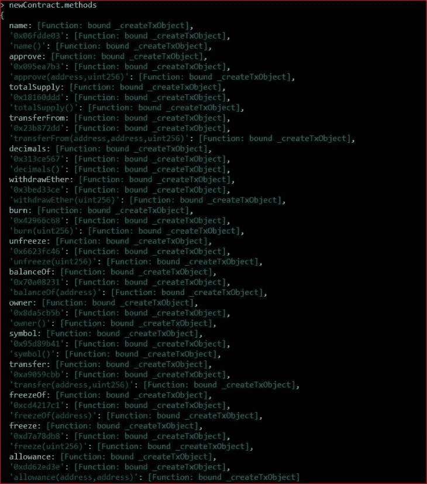

如果您想获得令牌的名称，请运行:

```
> newContract.methods.name().call().then(console.log)
BNB

```

要获得总供应量，请运行:

```
> newContract.methods.totalSupply().call().then(console.log)
16579517055253348798759097

```

类似地，我们可以执行与令牌相关所有其他操作。

## 结论

在本教程中，我们讨论了 Web3.js、区块链、以太坊、Infura、Ganache、智能合约、令牌等基础知识。

如果你想进入区块链和 DApp 开发的世界，你的下一步应该包括熟悉 Solidity 和 MetaMask，并学习如何创建和部署智能合约，在区块链上构建 DeFi 应用程序，以及使用 ERC-20 创建令牌。

区块链世界规模庞大，发展迅速，充满了各种可能性。我希望这篇教程能给你在区块链之旅中前进所需的洞察力和动力。

## 您是否添加了新的 JS 库来提高性能或构建新特性？如果他们反其道而行之呢？

毫无疑问，前端变得越来越复杂。当您向应用程序添加新的 JavaScript 库和其他依赖项时，您将需要更多的可见性，以确保您的用户不会遇到未知的问题。

LogRocket 是一个前端应用程序监控解决方案，可以让您回放 JavaScript 错误，就像它们发生在您自己的浏览器中一样，这样您就可以更有效地对错误做出反应。

[](https://lp.logrocket.com/blg/javascript-signup)[https://logrocket.com/signup/](https://lp.logrocket.com/blg/javascript-signup)

[LogRocket](https://lp.logrocket.com/blg/javascript-signup) 可以与任何应用程序完美配合，不管是什么框架，并且有插件可以记录来自 Redux、Vuex 和@ngrx/store 的额外上下文。您可以汇总并报告问题发生时应用程序的状态，而不是猜测问题发生的原因。LogRocket 还可以监控应用的性能，报告客户端 CPU 负载、客户端内存使用等指标。

自信地构建— [开始免费监控](https://lp.logrocket.com/blg/javascript-signup)。