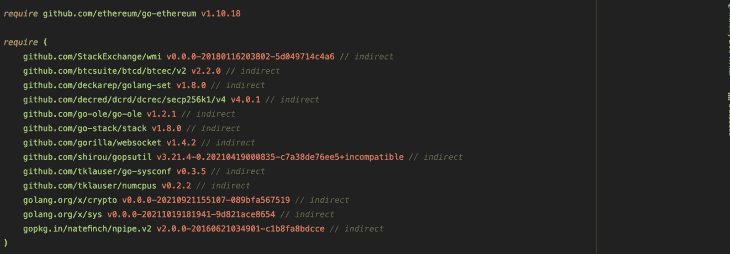
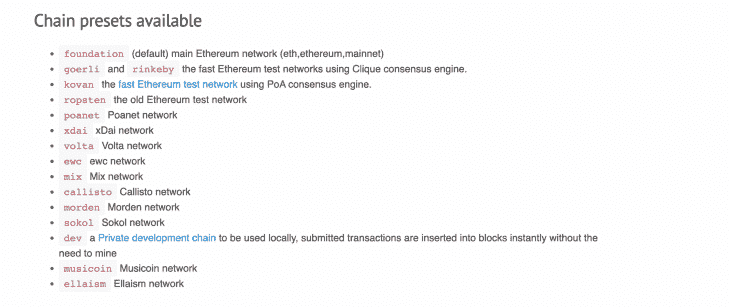

# 使用 Go-Ethereum - LogRocket 博客在 Go 中开发以太坊

> 原文：<https://blog.logrocket.com/ethereum-development-using-go-ethereum/>

从交易数量到用户和开发者总数，以太坊区块链在每一项重要的智能合约区块链指标上都排名第一。

开发人员经常需要在以太坊区块链的基础上用除了 Solidity 之外的语言来构建。

许多 SDK 和以太坊客户端帮助非 solidity 开发人员构建以太坊区块链并与之交互，如 Web3JS、Web3Py、OpenEthereum 和 Go-Ethereum。

[Go-Ethereum](http://geth.ethereum.org/) ，俗称 Geth，是使用 Go 编程语言构建去中心化应用的官方以太坊客户端。Geth 是运行、设置节点和与以太坊区块链交互的首选选择之一，因为它易于使用。

在本教程中，您将学习如何使用 Go-Ethereum 软件包，通过 Go 编程语言与以太坊区块链进行交互。

### 目录

### 先决条件

要学习本教程，您需要满足以下基本要求:

## Go-以太坊入门

使用 Go-以太坊需要您连接到以太坊区块链。有很多选项供你选择。你可以决定使用像 Infura 或 Alchemy 这样的以太坊节点提供商，或者你可以使用像 Ganache、Hardhat 和 Foundry 这样的区块链开发网络。

在本教程中，您将使用最流行的以太坊节点提供商 Infura 来连接以太坊区块链。

Infura 提供连接以太坊 [mainnet、testnet](https://blog.logrocket.com/mainnet-vs-testnet-environments-explained/#:~:text=Mainnet%20(main%20network)%20and%20testnet,the%20blockchain%20for%20public%20use.) 和以太坊层 2s 的功能，如 Arbitrum、Near 和 Polygon 网络。


使用 Infura 连接到以太坊节点要求您从您的 Infura 帐户获得一个 URL。在 LogRocket 博客上查看这个 Web3Py 教程,学习如何获得你的 Infura URL。

下一步是安装 Geth，Go-Ethereum 包。在 Go 工作区中运行此命令。

```
go get github.com/ethereum/go-ethereum

```

该命令将安装您在学习本教程时需要的所有依赖项。完成后，您的`go.mod`文件应该是这样的。



如果您遇到任何安装错误，请尝试将您的 Go 编译器更新到一个更新的版本。

## 使用 Infura 和 Go 连接到以太坊节点

在您的 Go 工作区中，为这个教程创建一个`main.go`文件，并导入这些模块。

```
import (
    "context"
    "fmt"
    "github.com/ethereum/go-ethereum/ethclient"
    "github.com/ethereum/go-ethereum/common/hexutil"
    "github.com/ethereum/go-ethereum/crypto"
    "log"
)

```

上下文`package`用于设置时间限制；`ethclient`包提供了与以太坊区块链交互的功能，`log`包用于处理错误。

下一步是全局声明上下文和客户机实例，以便在程序的各个部分使用。

```
var (
    ctx         = context.Background()
    url         = "Your Infura URL here"
    client, err = ethclient.DialContext(ctx, url)
)

```

上下文变量`ctx`是使用后台方法声明的，所以没有截止日期；然后使用`ethClient`包的`DialContext`方法声明了一个`client`实例客户端，该方法接受一个上下文和一个连接 URL。

您可以通过查询以太坊区块链的当前块号来验证您与以太坊节点的连接。以下是方法。

```
func currentBlock() {
    block, err := client.BlockByNumber(ctx, nil)
    if err != nil {
        log.Println(err)
    }
    fmt.Println(block.Number())
}

```

使用您的客户端实例`client`的`BlockByNumber`方法的`Number`方法，您可以查询以太坊区块链的当前块号。在撰写本文时，当前的块号是 14893193。

您还可以在您的 [Infura 仪表板](https://infura.io/dashboard)上监控您的查询状态。以下是块号查询的状态。


## 使用 Geth 查询以太坊钱包余额

还可以使用 Geth 和钱包的公共地址查询以太坊钱包地址。要检查钱包的余额，你必须先将公共地址(十六进制代码)转换成一个字节的字符串。

使用 Go-Ethereum 包的`common`子包的`HexToAddress`方法可以很容易地将公有地址 hex 转换成字符串的字节；以下是方法。

```
address := common.HexToAddress("0x8335659d19e46e720e7894294630436501407c3e")

```

之后，您可以使用客户端实例的`BalanceAt`方法来检查余额。`BalanceAt`方法接受一个上下文，

```
balance, err := client.BalanceAt(ctx, address, nil)
    if err != nil {
        log.Print("There was an error", err)
    }
    fmt.Println("The balance at the current block number is", balance)

```

结果`balance`将是 Gwei，而不是 Ether。一个 Gwei 等于 0.0000000144 以太。

* * *

### 更多来自 LogRocket 的精彩文章:

* * *

## 使用 Go-Ethereum 创建以太坊钱包

创建钱包是区块链客户端的关键功能之一。

钱包由三个主要部分组成:公钥、私钥和公共地址。

下面是如何使用 Geth 为以太坊钱包生成这三个组件。

```
func createWallet() (string, string) {

}

```

createWallet 函数不接受任何参数，它返回两个字符串。

您可以使用 Go-Ethereum 包的`crypto`子包的 GenerateKey 方法生成一个私钥，如下面的 getPrivateKey 变量所示。请记住将私钥保存在安全的存储中。

```
  getPrivateKey, err := crypto.GenerateKey()

    if err != nil {
        log.Println(err)
    }

```

您可以使用 crypto 子包的 FromECDSA 方法从私钥生成公钥。FromECDSA 方法返回一个字节，可以使用 Go-Ethereum 包的 hexutil 子包的 Encode 方法将其编码为十六进制。

```
  getPublicKey := crypto.FromECDSA(getPrivateKey)
    thePublicKey := hexutil.Encode(getPublicKey)

```

您可以使用 crypto 子包的 PubkeyToAddress 方法从公钥生成用户的公共地址。PubkeyToAddress 接受您声明的私钥变量的 PublicKey 方法，并返回一个地址，该地址可以通过调用 Hex 方法转换为常规的十六进制形式。

```
 thePublicAddress := crypto.PubkeyToAddress(getPrivateKey.PublicKey).Hex()
return thePublicAddress, thePublicKey

```

该函数返回您刚刚创建的钱包的公共地址和公共密钥。

## 使用 Go-Ethereum 在 Go 中进行以太坊交易

您可以使用 Geth 软件包在以太坊区块链主网/测试网上进行交易。

每笔交易都必须有一个发送者的地址和一个接收者的地址。必须使用发送方的私钥对交易进行签名。

```
  RecipientAddress := common.HexToAddress("0x4592d8f8d7b001e72cb26a73e4fa1806a51ac79d")

    privateKey, err := crypto.HexToECDSA("The Hexadecimal Private Key ")
    if err != nil {
        log.Fatal(err)
    }

    publicKey := privateKey.Public()
    publicKeyECDSA, ok := publicKey.(*ecdsa.PublicKey)
    if !ok {
        log.Fatal("Public Key Error")
    }

    SenderAddress := crypto.PubkeyToAddress(*publicKeyECDSA)

```

您使用 common 声明了收件人的地址参数。HexToAddress 和使用加密的私钥。处理错误的位置。此外，您还声明了一个公钥变量 public key，其中公钥是使用 public 方法从私钥派生而来的，就像创建钱包时一样。

最后，您使用(*ecdsa 从 public key 变量中声明了一个 ECDSA 公钥变量 publicKeyECDSA。PubicKey)方法，处理可能的错误，使用 PubKeyToAddress 方法从变量中生成发件人地址，该方法接受一个指向 ECDSA 公钥变量的指针。

您需要声明发送的乙醚量(以 Gwei 为单位)、nonce(来自该地址的交易次数)、汽油价格、汽油限制和 ChainID 的变量。

这里有一个来自 [OpenEthereum 文档](https://openethereum.github.io/Chain-specification#:~:text=ChainID%20is%20an%20additional%20way,value%20is%20equal%20to%20networkID%20.)的链列表。



```
nonce, err := client.PendingNonceAt(ctx, SenderAddress)
    if err != nil {

        log.Println(err)
    }

    amount := big.NewInt("amount    In Wei")
    gasLimit := 3600
    gas, err := client.SuggestGasPrice(ctx)

    if err != nil {
        log.Println(err)
    }

    ChainID, err := client.NetworkID(ctx)
    if err != nil {
        log.Println(err)
    }

```

这里，您声明了一个变量，以使用 PendingNonceAt 方法获取钱包地址的挂起 nonce，该方法接受一个上下文和地址并处理一个错误。您将气体限制和数量的变量分别声明为数量和气体限制。

您使用客户端实例的 SuggestGasPrice 方法为天然气价格声明了一个变量，然后使用 NetworkID 方法为 NetworkID 声明了一个变量，其中变量参与了一场竞争并处理了错误。

设置完所有这些参数后，您现在就可以发送事务了，方法是创建事务，签署事务，然后将其发送到区块链，在那里可以批准或拒绝事务。

```
transaction := types.NewTransaction(nonce, RecipientAddress, amount, uint64(gasLimit), gas, nil)
    signedTx, err := types.SignTx(transaction, types.NewEIP155Signer(ChainID), privateKey)
    if err != nil {
        log.Fatal(err)
    }
    err = client.SendTransaction(ctx, signedTx)
    if err != nil {
        log.Fatal(err)
    }

    fmt.Printf("transaction sent: %s", signedTx.Hash().Hex())

```

您使用 Go-Ethereum 包的 types 子包创建了一个使用 new transaction 方法的新事务 transaction；该方法接收 nonce、收件人地址、数量、气体限制(转换为无符号整数)、气体价格和设置为 nil 的可选数据参数。

您使用接受事务的类型包的 SignTx 方法声明了一个变量来对事务进行签名，signer 方法接受链 ID 类型。new EIP 155 签名者(ChainID)和私钥。

最后，您使用客户机的 SendTransaction 方法发送事务，该方法接收一个上下文，并处理已签名的事务变量和错误。

如果没有错误，print 语句将返回已签名事务的十六进制哈希。

### 查询块中的事务数量

您还可以使用 Go-Ethereum 包评估任何块中的事务数量。该过程类似于评估当前块号的过程。

```
func getTransactionsPerBlock() {
    block, err := client.BlockByNumber(ctx, nil)
    figure, err := client.TransactionCount(ctx, block.Hash())
    if err != nil {
        log.Fatal(err)
    }

    fmt.Println(figure)
}

```

在 getTransactionsPerBlock 函数中，您声明了一个块变量，通过编号查询了一个块，并使用您声明的块变量的 Hash 方法查询了事务计数。您处理了来自查询的错误，并打印了包含块中事务数量的数字变量。

### 查询块中交易的详细信息

此外，您可以查询块中交易的各种详细信息，如金额、汽油、汽油价格、nonce 和接收者。

```
func QueryTransactions() {
    block, _ := client.BlockByNumber(ctx, nil)
    for _, transaction := range block.Transactions() {
        fmt.Println(transaction.Value().String())
        fmt.Println(transaction.Gas())
        fmt.Println(transaction.GasPrice().Uint64())
        fmt.Println(transaction.Nonce())
        fmt.Println(transaction.To().Hex())
    }
}

```

在 QueryTransactions 函数中，您使用 block by number 方法声明了一个 block 变量来按编号获取块，并传入 nil 来指定当前块。然后使用基于范围的 for 循环遍历块中的交易，并分别打印出金额、汽油、汽油价格、nonce 和接收者。

## 结论

您已经学习了如何使用 Go-Ethereum 包在 Go 中开发您的应用程序，例如传送以太坊和查询区块链。

以太坊生态系统正在快速发展，有许多开发工具可供您选择来构建以太坊区块链。LogRocket 博客上有以太坊客户端的教程，比如 [Web3Py](https://blog.logrocket.com/web3-py-tutorial-guide-ethereum-blockchain-development-with-python/) 、 [Web3JS](https://blog.logrocket.com/ethereum-blockchain-development-using-web3-js/) 和[很多区块链的文章](https://blog.logrocket.com/tag/blockchain/)你可以从中学习。

## 加入像 Bitso 和 Coinsquare 这样的组织，他们使用 LogRocket 主动监控他们的 Web3 应用

影响用户在您的应用中激活和交易的能力的客户端问题会极大地影响您的底线。如果您对监控 UX 问题、自动显示 JavaScript 错误、跟踪缓慢的网络请求和组件加载时间感兴趣，

[try LogRocket](https://lp.logrocket.com/blg/web3-signup)

.

[](https://lp.logrocket.com/blg/web3-signup)[https://logrocket.com/signup/](https://lp.logrocket.com/blg/web3-signup)

LogRocket 就像是网络和移动应用的 DVR，记录你的网络应用或网站上发生的一切。您可以汇总和报告关键的前端性能指标，重放用户会话和应用程序状态，记录网络请求，并自动显示所有错误，而不是猜测问题发生的原因。

现代化您调试 web 和移动应用的方式— [开始免费监控](https://lp.logrocket.com/blg/web3-signup)。