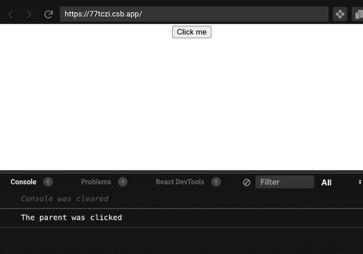
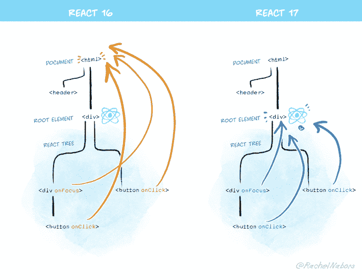
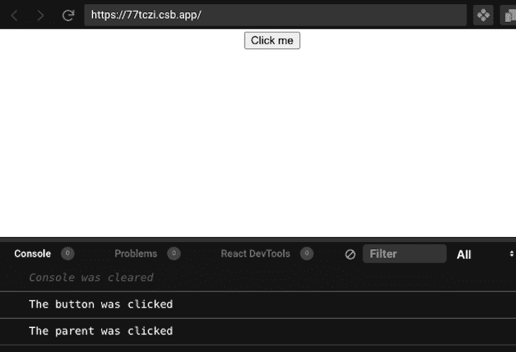

# React 中的事件冒泡和捕获

> 原文：<https://blog.logrocket.com/event-bubbling-capturing-react/>

事件是程序中常用来触发功能的可检测的动作或事件。这些动作包括用户点击按钮和网页加载。

本文将介绍事件捕获和冒泡如何在 [React](https://blog.logrocket.com/tag/react/) 中工作。在我们讨论什么是事件捕获和冒泡之前，我们将了解事件委托及其工作原理。我们还将看看 React 中的`[SyntheticEvent](https://reactjs.org/docs/events.html)`,它是如何工作的，以及它与 React 中的事件捕获和冒泡的联系。

*向前跳转:*

## 了解 React 中的事件委托

事件委托是一种处理事件的技术，涉及到向父元素添加单个事件监听器，而不是向单个子元素添加[事件监听器](https://blog.logrocket.com/deep-dive-into-event-bubbling-and-capturing/)。当子元素上发生事件时，父元素上的事件侦听器会得到通知，并且父元素可以处理该事件。当您有许多子元素并且希望避免向它们添加事件侦听器时，这很有用。

想象一个场景，其中您有以下代码:

```
function App() {
  const parentFunction = () => {
    console.log('Hello from the parent');
  };
  const firstChildFunction = () => {
    console.log('Hello from the first child');
  };
  const secondChildFunction = () => {
    console.log('Hello from the second child');
  };
  const thirdChildFunction = () => {
    console.log('Hello from the third child');
  };
  return ( 
    <div className="App">
      <div className="parent-div" onClick={parentFunction}>
        <button className="first-child-button" onClick={firstChildFunction}>
          First child button
        </button>
        <button className="second-child-button" onClick={secondChildFunction}>
          Second child button
        </button>
        <button className="third-child-button" onClick={thirdChildFunction}>
          Third child button
        </button>
      </div>
    </div>
  );
}
export default App;

```

在上面的代码中，我们有一个带有一个`[onClick](https://blog.logrocket.com/react-onclick-event-handlers-guide/)`处理程序的父节点`div`。父母`div`有三个孩子`buttons`，他们都有`onClick`的训导员。`onClick`处理所有将文本打印到控制台的`PointTo`功能。

当我们单击任何按钮并检查控制台时，我们会获得该按钮(第二个按钮)的日志。然而，我们还得到另一个日志，显示父节点`div`被点击，如下图所示:


我们知道事件委托发生了，因为父元素也处理子元素的事件。现在，让我们看看 React 处理事件的顺序。

## 事件传播简介

事件传播是网页上发生事件时调用事件处理程序的顺序。为了理解事件传播是如何工作的，了解 DOM 中的[事件流的三个阶段是有帮助的:捕获阶段、目标阶段和冒泡阶段。](https://blog.logrocket.com/react-reference-guide-refs-dom/)

在捕获阶段，事件从文档顶部向下传播到发生事件的元素。捕获不如冒泡常用。简单地说，这就是所谓的从文档顶部向下移动到发生事件的元素的事件。

在目标阶段，事件处理程序在发生事件的元素上执行，并且可以通过`event.target`进行评估。

在冒泡阶段，事件从发生事件的元素沿 DOM 树向上移动到其父元素，依此类推，直到到达文档的顶部。这是 DOM 中大多数事件的默认行为。这与捕获阶段相反。

下图描述了事件传播的三个阶段及其工作原理:


> 注意:事件传播的第四个阶段称为 none 阶段，在这个阶段不执行任何事件。

## 什么是`SyntheticEvent`？

React 依赖于一个[虚拟 DOM](https://blog.logrocket.com/virtual-dom-react/) ，并使用这个概念来处理 DOM 操作。`[SyntheticEvent](https://blog.logrocket.com/getting-started-react-synthetic-event/)`包装器包装了 React 用来抽象浏览器可以处理的事件之间的差异的原生 DOM 事件。这允许你[编写跨所有浏览器一致工作的事件处理程序](https://blog.logrocket.com/creating-hover-events-synthetic-event-react-hover/)。

例如，考虑以下将点击`EventListener`附加到`button`的代码:

```
document.getElementById('myButton').addEventListener('click', () => {
  console.log('Button was clicked');
});

```

在上面的代码中，`click`事件是一个本地 DOM 事件。在 React 中，您应该这样写事件:

```
<button onClick={() => console.log('Button was clicked')}>Click me</button>

```

本例中的`onClick`事件是一个合成事件。当按钮被点击时，React 将调用您提供的事件处理函数。在内部，React 会将合成事件转换为原生 DOM 事件，并将其传递给事件侦听器。

React 创建了`SyntheticEvents`,允许你以自己熟悉的方式编写事件处理程序，而不用担心浏览器可以处理的各种事件之间的差异。`SyntheticEvents`还包括`stopPropagation`、`preventDefault`等方法，这些方法有助于 React 的事件系统。

## 在 React 中使用`event.stopPropagation()`

我们已经了解了事件传播、其阶段以及它们是如何工作的。但是，也有不希望某个事件冒泡的时候。这就是`event.stopPropagation()`方法的用武之地。

在 React 中，`event.stopPropagation()`方法防止父组件处理子组件处理的事件。您可以在事件对象上调用`event.stopPropagation()`来阻止事件在树中进一步传播。这在父组件的事件处理程序与子组件的事件处理程序冲突的情况下很有用。

让我们来看一个用例的例子，在这个用例中，您想要使用`event.stopPropagation()`来避免父组件和子组件之间的冲突。在下面的代码中，我们有一个`header`组件，它有一个用于注销的`button`:

```
import './App.css';
function App() {
  const handleHeaderClick = () => {
    console.log('Header was clicked');
  };
  const handleButtonClick = () => {
    console.log('The logout button was clicked');
  };
  return (
    <>
      <div className="styleHeader" onClick={handleHeaderClick}>
        <div>Header</div>
        <button type="button" onClick={handleButtonClick}>
          Log Out
        </button>
      </div>
    </>
  );
}
export default App;

```

上面的代码块将显示如下图所示的`header`组件:


在这种情况下，我们不希望事件由父组件处理。此时，如果您单击**注销按钮**，父节点仍会处理该事件，如下所示:


我们可以通过将`event.stopPropagation()`传递给子组件(按钮)来阻止父组件处理事件，如下所示:

```
import './App.css';
function App() {
  const handleHeaderClick = () => {
    console.log('Header was clicked');
  };
  const handleButtonClick = (event) => {
    event.stopPropagation();
    console.log('The logout button was clicked');
  };

// The code down here remains the same 
}
export default App;

```

我们首先将`event`对象作为参数传递给`handleButtonClick`函数，然后使用`event.stopPropagation()`阻止事件冒泡到父组件中。现在，如果我们点击**按钮**，不会出现冒泡，我们只会得到按钮组件的日志。它应该是这样的:


## React v16 与 React v17 中的事件委托

在 React v16 和更早的版本中，事件委托是通过在每个事件的文档节点附加事件处理程序来处理的。这意味着 React 将计算出在一个事件中调用了哪个组件，并将该事件冒泡到 React 附加了事件处理程序的文档节点。

由于嵌套的[反应树](https://blog.logrocket.com/comparing-react-tree-components/)，这种方法存在[问题](https://github.com/facebook/react/pull/8117)。如果您的应用程序中有嵌套的 React 树，那么`event.stopPropagation()`方法将不会像预期的那样工作。让我们看下面的例子:

```
// Nested React trees in the index.html
<div id="parent">
   <div id="root"></div>
</div>

```

将以下代码粘贴到`App.js`文件中:

```
import "./styles.css";
import React from "react";

export default function App() {
  const handleButtonClick = () => {
    console.log("The button was clicked");
  };
  return (
    <div className="App">
      <button onClick={handleButtonClick}>Click me</button>
    </div>
  );
}

```

在上面的代码块中，我们有一个带有`onClick`处理程序的`button`,它指向一个函数，该函数在被点击时将一些文本记录到控制台。

在`index.js`文件中，粘贴以下代码:

```
import React from "react";
import ReactDOM from "react-dom";
import App from "./App";

const parent = document.getElementById("parent");
parent.addEventListener("click", (e) => {
  console.log("The parent was clicked");
  e.stopPropagation();
});

ReactDOM.render(<App />, document.getElementById("root"));

```

在上面的代码块中，我们从 DOM 中获得了`parent`元素，并为其附加了一个`EventListener`。`EventListener`监听到一个`click`事件，并向控制台记录了一个不同的文本。然后，我们在下面的代码中调用了`event.stopPropagation()`方法。

当我们点击按钮时，我们期望得到两个不同的文本字符串。但是，相反，我们得到了一个，它甚至不是我们期望的那个，如下图所示:



发生这种情况是因为当你有嵌套的 React 树时，React 仍然会将事件冒泡到外层树，即使在调用了`event.stopPropagation()`之后。

### 对 DOM 树的更改

在 React v17 和更高版本中，React 的开发人员改变了将事件附加到 DOM 树的方式。事件处理程序现在附加到呈现 React 树的根 DOM 容器，而不再附加到文档节点。以下是这些变化的形象化描述:



If we change the `index.js` file to reflect React v17 changes, we get the appropriate logs in the console, as shown below:

```
// index.js
import { createRoot } from "react-dom/client";
import App from "./App";

const parent = document.getElementById("parent");
parent.addEventListener("click", (e) => {
  console.log("The parent was clicked");
  e.stopPropagation();
});

const rootElement = document.getElementById("root");
const root = createRoot(rootElement);
root.render(<App />);

```

现在，当我们点击**按钮**时，我们得到日志，如下图所示:



## 结论

本文研究了在 React 中如何处理事件。我们在 React 中看到了事件委托、传播、冒泡、捕获和`SyntheticEvents`。此外，我们研究了`event.stopPropagation()`方法，以及如何使用它来停止事件传播。我们还研究了 React 以前版本中事件的处理方式，以及 React 当前版本中事件的处理方式。

## [LogRocket](https://lp.logrocket.com/blg/react-signup-general) :全面了解您的生产 React 应用

调试 React 应用程序可能很困难，尤其是当用户遇到难以重现的问题时。如果您对监视和跟踪 Redux 状态、自动显示 JavaScript 错误以及跟踪缓慢的网络请求和组件加载时间感兴趣，

[try LogRocket](https://lp.logrocket.com/blg/react-signup-general)

.

[ ](https://lp.logrocket.com/blg/react-signup-general) [](https://lp.logrocket.com/blg/react-signup-general) 

LogRocket 结合了会话回放、产品分析和错误跟踪，使软件团队能够创建理想的 web 和移动产品体验。这对你来说意味着什么？

LogRocket 不是猜测错误发生的原因，也不是要求用户提供截图和日志转储，而是让您回放问题，就像它们发生在您自己的浏览器中一样，以快速了解哪里出错了。

不再有嘈杂的警报。智能错误跟踪允许您对问题进行分类，然后从中学习。获得有影响的用户问题的通知，而不是误报。警报越少，有用的信号越多。

LogRocket Redux 中间件包为您的用户会话增加了一层额外的可见性。LogRocket 记录 Redux 存储中的所有操作和状态。

现代化您调试 React 应用的方式— [开始免费监控](https://lp.logrocket.com/blg/react-signup-general)。