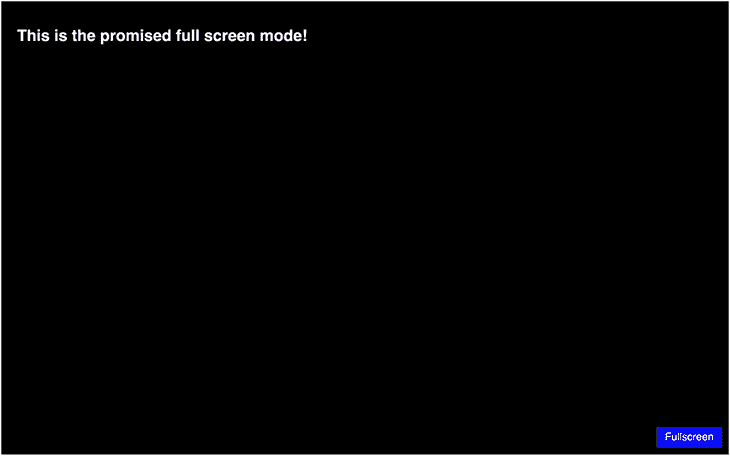
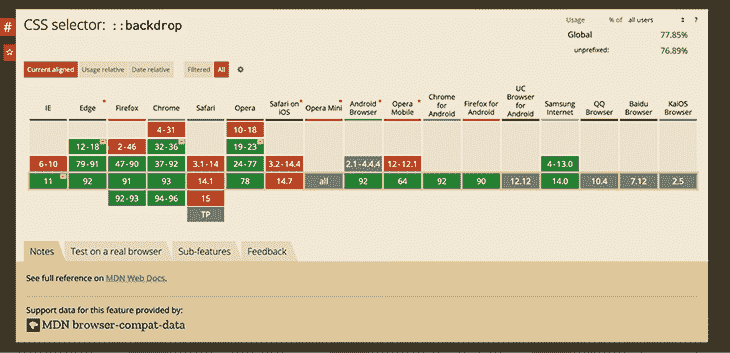
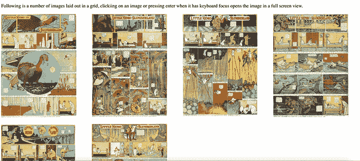

# 尝试全屏 API - LogRocket 博客

> 原文：<https://blog.logrocket.com/experimenting-with-fullscreen-api/>

全屏 API 允许你在你的页面上创建一个全屏视图。通常，您会在不同的图形或媒体资源(例如，视频或图像)中看到这种情况，但实际上您可以让页面上的任何元素具有全屏视图。

目前 Chrome、Firefox、Opera 和 Edge 都很好地支持全屏 API。在 Safari 中使用供应商前缀应该可以得到部分支持，但是我还没有尝试这样做。


Source: [CanIUse.com](https://caniuse.com/?search=Full%20Screen%20API)

如果你需要全屏 API 的跨平台支持，有很多这样的 API，比如 [fscreen](https://github.com/rafgraph/fscreen) 或者 [screenfull](https://github.com/sindresorhus/screenfull.js) 。还有一个 [React 钩子实现](https://github.com/garth/react-hooks-full-screen)和一个高阶组件[让孩子进入全屏区域](https://github.com/ggingell/react-fullscreenable)。

但是这篇文章将只关注使用指定的全屏 API，所以你应该知道只有在列出的浏览器中才能工作。

## 入门指南

要在用户的浏览器上启用全屏视图，你首先需要通过 [`Element.requestFullScreen`功能](https://developer.mozilla.org/en-US/docs/Web/API/Element/requestFullScreen)请求许可。这与请求访问位置数据不同——浏览器基本上通过确定用户是否执行了特定的动作来批准或拒绝全屏访问来确定请求是否被接受，如单击**允许**按钮。

如果用户想要退出全屏视图，他们可以使用他们通常使用的所有方法来退出全屏窗口，以及按下 escape 键，假设他们在一个为他们提供的环境中。

现在，让我们继续看一些例子。

## 基本示例:全屏部分

全屏 API 最常用于嵌入图像和视频，但它们都有自己的小问题要考虑，所以我将从更简单的东西开始:一个 HTML5 部分，其中有一个按钮可以将该部分转换为全屏视图。

请看 [CodePen](https://codepen.io) 上布莱恩·拉斯姆森([@布莱恩·拉斯姆森](https://codepen.io/bryanrasmussen) )
的笔 [全屏部分](https://codepen.io/bryanrasmussen/pen/yLbzaXR)。

我在示例中的按钮样式从 [LogRocket CSS 参考指南](https://blog.logrocket.com/css-reference-guide-button-styling/)重用到按钮样式。

该页面看起来有点像下面这样:


当您点击**全屏**按钮时，它会切换该部分的全屏视图，并显示文本“更多信息在全屏模式下可用…”

全屏看起来是这样的(白边还在，只是在屏幕边缘)。



这里的文本是不同的，因为我们使用了 [`:fullscreen`伪选择器](https://developer.mozilla.org/en-US/docs/Web/CSS/:fullscreen)将 H2 文本“全屏模式下有更多可用信息…”切换到了另一个 H2 文本“这是承诺的全屏模式！”从`display:none`到`display:block`。

请看下面的代码片段:

```
.fullscreenMoreInfo {
  display: none;
}

.fullscreenEnabled:fullscreen
.fullscreenintro{
  display: none;
}

.fullscreenEnabled:fullscreen .fullscreenMoreInfo {
  display: block;
}

```

这里要注意的是，`:fullscreen`伪选择器必须应用在已经切换到全屏模式的元素上；在本例中，它是带有类`fullscreenEnabled`的部分。

全屏 API 还指定了另一个[潜在的伪选择器](https://blog.logrocket.com/5-css-pseudo-elements-you-never-knew-existed/):选择器`::backdrop`。


这用于样式化页面上不在`:fullscreenEnabled`元素中的其余内容。现在，你可能会问自己，什么？为什么呢？

一个潜在的用途是在背景上放置一种背景色，这样会影响全屏显示。MDN 有一个全屏视频元素的[例子。](https://developer.mozilla.org/en-US/docs/Web/CSS/::backdrop)

另一个更重要的用途是满足背景的可访问性要求；然而，这目前不起作用。我们将在本文的后面讨论这个问题，在关于使用全屏 API 处理图片的章节中。

## 扩展基本示例:全屏模式

`:fullscreen`元素与对话框和模态窗口非常相似，因为它将内容与页面的其余部分分开，以强调内容。

自然，对该技术进行类似模态的使用是合乎逻辑的，为了做到这一点，我将重用来自 MDN 的[纯 CSS Lightbox](https://developer.mozilla.org/en-US/docs/Web/CSS/:target) 中的一些代码，用于**关闭**按钮。

首先，我将改变 click 处理程序的一些逻辑，因为我既想要一个打开模态的按钮，又想要一个关闭模态的按钮。

看看下面的代码:

请看 [CodePen](https://codepen.io) 上布莱恩·拉斯姆森([@布莱恩·拉斯姆森](https://codepen.io/bryanrasmussen) )
的笔 [全屏模态](https://codepen.io/bryanrasmussen/pen/QWvReaR)。

我们的变化主要是小的，给多个元素添加了`makeFullScreen`函数(因为它关闭了`:fullscreen`元素，如果有的话，我们也可以将其用于我们的模态关闭器)，并为事件键添加了一个`keydown`处理程序，如下所示:

```
const  buttons = document.querySelectorAll(".fullscreener");
buttons.forEach( (button) => {
  button.addEventListener("click", () => {
   makeFullScreen(document.querySelector(".fullscreenEnabled"))
  });
  button.addEventListener('keydown', (e) => {
    if (e.key === "Enter") {
    makeFullScreen(fullScreenEnabledEl);
    }
  });
});

```

然后，我们将在模态区域添加一些结构，使我们的模态具有更好的样式，包括模态打开按钮和关闭按钮的一些焦点样式。

这是模态关闭时的样子:


这是模态显示时的样子:


出于可访问性的目的，它在 Firefox 中用 [VoiceOver](https://blog.mozilla.org/accessibility/voiceover-support-for-macos-in-firefox-87/) 和键盘导航进行了测试。显然，由于这是一个概念验证，并且是在 CodePen 的嵌套框架内编写的，因此在其他浏览器/屏幕阅读器组合上可能存在可访问性问题。

## 最常见的全屏使用

正如我们之前提到的，人们关注的`:fullscreen`元素基本上有两种常见用途，它们是全屏显示视频或图像的能力。

我已经决定不制作一个全屏视频示例，因为制作一个令人满意的示例需要太多的部分，我无法将它作为本文的一个次要部分。相反，我将把重点放在图像上，因为我相信我们可以对它做一些有趣的补充。

## 对图像使用全屏 API

在这个例子中，我将一些图像放在一个网格中。为了让这些图像值得在全屏视图中观看，我使用了一些从互联网档案馆下载的小尼莫中的[例子。](https://archive.org/details/LittleNemo1905-1914ByWinsorMccay)

以下是网格示例:

请看 [CodePen](https://codepen.io) 上布莱恩·拉斯姆森([@布莱恩·拉斯姆森](https://codepen.io/bryanrasmussen) )
的笔 [图像网格](https://codepen.io/bryanrasmussen/pen/OJmaRBj)。

第一行图像如下所示:


我们对我们的`makeFullScreen`函数做了和以前类似的事情:每个图像都在一个`span`中，有一个按钮角色用于访问，还有一个类`fullscreenEnabled`。我们在`span`中添加了`click`和`keydown`事件处理程序，并让`span`全屏显示。

这样做的原因是在我们的全屏跨度及其子图像的 CSS 中，它允许我们滚动全屏显示图像。

```
span:fullscreen {
  overflow: auto;
}

span:fullscreen img {
  object-fit: contain;
  border: 0;
}

```

这当然是因为如果图像是全屏的，它将被缩小以适合你正在观看它的任何屏幕(假设屏幕区域小于图像)，而如果包裹图像的元素是全屏的，我们可以允许它溢出，然后用户可以按照他们的意愿滚动图像。

出于可访问性的目的，我们没有在每个 span 上放置一个`aria-label`属性并告诉用户他们可以点击以全屏模式查看它，这看起来可能过于冗长，而是在上面的一段中添加了一个通知。

然而，这并不是您在这个解决方案中可能遇到的唯一的可访问性问题。如果你使用的是屏幕阅读器，它如何处理页面中没有全屏显示的部分，或者说，[留在背景](https://developer.mozilla.org/en-US/docs/Web/CSS/::backdrop)中？

在[全屏 API 规范](https://fullscreen.spec.whatwg.org/#css-pe-backdrop)中，它对背景做了如下描述:

"`::backdrop`伪元素可以用来创建一个背景，隐藏[顶层](https://fullscreen.spec.whatwg.org/#top-layer)中元素的底层文档(比如全屏显示的元素)。"

这意味着您应该能够做到以下几点:

```
span::backdrop {
  display: none;
}

```

但这不起作用。

根据我使用 Chrome 的经验，你无法用屏幕阅读器访问背景内容。你可以进入浏览器的地址栏，但你必须真的尝试这样做。

然而，在 Firefox 中，当你全屏显示一个元素时，你将能够阅读所有不在全屏显示的内容。我已经输入了一个关于这个的 bug，但是现在还不能说会有什么反应。

目前，如果你让一个元素全屏显示，可访问性的解决方案可能是设置所有在`:fullscreen`元素之外的元素，让一个`aria-hidden`元素设置为`true`。希望 Firefox 能尽快解决这个问题。

我还没有在其他浏览器上测试过`::backdrop`伪选择器行为或者`:fullscreen`元素的可访问性，所以要小心。

## 带有 SVG 的全屏图像

这看起来与我们上一个图像网格的例子相似，你点击一个图像，它以全屏模式打开。事实上，除了现在在网格中看到四个项目之外，您可能会认为这是同一个示例。这是因为我使用 SVG `image`元素将小 Nemo jpegs 嵌入到 SVG 中。

区别如下所示。在最终的 SVG 中会有额外的代码，但是这向我们展示了相同的图像。

* * *

### 更多来自 LogRocket 的精彩文章:

* * *

```
<div role="button"
   class="fullscreenEnabled"
>
  <svg version="1.1" >
    <title>Little Nemo ThanksGiving Day Dream embedded in SVG</title>
    <image     
      href="https://assets.codepen.io/1281712/little-nemo-19051126-l.jpeg"  
    />
  </svg>
</div>

```

当您处理嵌入在 SVG 中的图像时，您必须考虑这些图像的实际大小(通常，如果您想要良好的视觉体验)。这是因为 SVG 处理不适合其容器的图像的方式与 HTML 不同。

当我第一次尝试制作这个时，它让我陷入了一个循环，因为我试图只是猜测图像的尺寸，而不是计算它，并且非常遥远。这在 SVG 的顶部创建了一堆前导空格，因为 SVG 解析器试图调整图像的大小以保持纵横比。

这导致我浪费了一两个小时，因为我没有正确的心态去发现我错在哪里——所以，这是一个提醒我们自己首先用 SVG 弄清楚我们的维度的好时机。

我们嵌入到 SVG 中的图像的尺寸是宽 1738px，高 2378px，所以选择了相同纵横比的尺寸组合(当然去掉了小数位),我选择了宽 250px，高 345px。因此，为了让 SVG 中的一切看起来更好，我们可以这样做:

```
.fullscreenEnabled {
  width: 250px;
  height: 345px;
}

.fullscreenEnabled > svg {
  width: 100%;
  height: 100%;
}

.fullscreenEnabled image {
  width: 100%;
  height: 100%;
}

```

然后我们设置`grid-template-columns`值来跟随我们的图像宽度:

```
grid-template-columns: repeat(auto-fill, minmax(250px, 1fr));

```

然后我们得到了如下的结果:


But we’re going to want to replace all of these values, so maybe we should use CSS variables, like so:

```
:root {
  --grid-item-width: 250px;
  --grid-item-height: 345px;
  --svg-width: 100%;
  --svg-height: 100%;
}

.fullscreenEnabled {
  width: var(--grid-item-width);
  height: var(--grid-item-height);
}

.fullscreenEnabled > svg {
  width: var(--svg-width);
  height: var(--svg-height);
}

.fullscreenEnabled image {
  width: var(--svg-width);
  height: var(--svg-height);
}

```

当然，`grid-item-width`变量将在`grid-template-columns`属性中使用。

然后，当我们启用全屏模式时，我们可以简单地做:

```
.fullscreenEnabled:fullscreen {
  --grid-item-width: 1738px;
  --grid-item-height: 2378px;
  --svg-width: var(--grid-item-width);
  --svg-height: var(--grid-item-height);
  overflow: auto;
}

```

这是因为我们可以在全屏模式下更改变量的值，并让它们像在任何其他类或虚拟选择器中一样被继承。

这点可以从下面看出来。

请看 [CodePen](https://codepen.io) 上布莱恩·拉斯姆森([@布莱恩·拉斯姆森](https://codepen.io/bryanrasmussen) )
用 SVG 制作的 Pen [图像网格。](https://codepen.io/bryanrasmussen/pen/JjJjBor)

SVG 在全屏 API 环境中的主要好处是，当`.fullscreenEnabled` div 实际上在全屏视图中时，SVG 中的动画和其他效果(当然，在比图像更高的 z 索引处)将变得可见并被激活。

## 结论

全屏 API 非常简单，但是通过一些创造性，你可以得到有趣的结果。我们已经看到了如何为各种类型的元素切换全屏，提供大图像视图和全屏模式。显然，这些例子可以扩展到全屏幻灯片或类似的效果。

然而，就可访问性而言，当前实现的全屏 API 肯定有缺点，在使用它构建解决方案时应该考虑到这一点。

## 你的前端是否占用了用户的 CPU？

随着 web 前端变得越来越复杂，资源贪婪的特性对浏览器的要求越来越高。如果您对监控和跟踪生产环境中所有用户的客户端 CPU 使用、内存使用等感兴趣，

[try LogRocket](https://lp.logrocket.com/blg/css-signup)

.

[](https://lp.logrocket.com/blg/css-signup)[https://logrocket.com/signup/](https://lp.logrocket.com/blg/css-signup)

LogRocket 就像是网络和移动应用的 DVR，记录你的网络应用或网站上发生的一切。您可以汇总和报告关键的前端性能指标，重放用户会话和应用程序状态，记录网络请求，并自动显示所有错误，而不是猜测问题发生的原因。

现代化您调试 web 和移动应用的方式— [开始免费监控](https://lp.logrocket.com/blg/css-signup)。