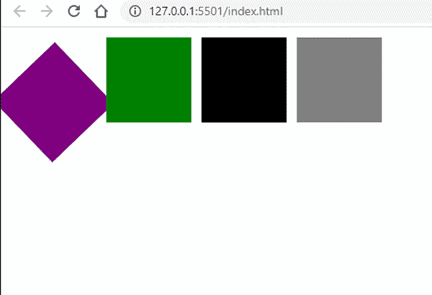
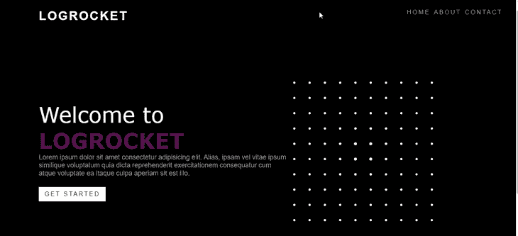

# 通过一个示例站点动画项目探索 Anime.js

> 原文：<https://blog.logrocket.com/exploring-anime-js-example-site-animation-project/>

动画是让你的网站领先一步的好方法。您可以使用富有想象力的对象运动和无缝页面过渡等动画来吸引用户的注意力，并通过丰富、引人入胜的体验给他们留下美好的第一印象。

有很多 [JavaScript 动画库](https://blog.logrocket.com/comparing-javascript-animation-libraries/)可以帮助我们实现这一点。Anime.js 就是这样一个库，它是最好最快的 JavaScript 动画库之一。

在本文中，我们将探索 Anime.js 库，并使用它向示例网站添加一些基本动画。我们将涵盖:

让我们直接跳进来吧！

## 什么是 Anime.js？

Anime.js 是一个轻量级的库，在 GitHub 上有超过 [43k 颗星星，它在网页上制作 CSS 属性、DOM 元素和 SVG 的动画。使用 Anime.js 创建站点动画是一个简单的过程。](https://github.com/juliangarnier/anime)

这个库拥有一个内置的交错系统，可以产生波纹并降低重叠动画的复杂性。您可以使用它来创建您选择的简单和复杂的动画效果，同步多个实例并控制所有动画功能。

## 了解 Anime.js 属性

在使用 Anime.js 时，我们需要了解许多不同的属性。让我们在下面探索一些。

目标指的是我们想要制作动画的一个或多个元素。这些可以是 [CSS 选择器，比如](https://blog.logrocket.com/level-up-your-css-selector-skills/)、`div`、`class`或`id`，DOM 节点或节点数组，或者简单的 JavaScript 对象。也可以在阵列中使用上述的组合。

属性指定元素的哪些视觉方面应该被动画化，例如它的颜色、大小或位置。我们可以使用以下类型的数据定义要制作动画的属性:

*   标准 CSS 属性，如`color`或`font-size`
*   [CSS 变换属性](https://blog.logrocket.com/deep-dive-css-individual-transform-properties/)，如`rotate`或`scale`
*   对象属性，例如 JavaScript 对象的属性
*   DOM 属性，比如输入元素的`value`属性
*   SVG 属性，比如圆形元素的`points`属性

不要将属性参数与 Anime.js 中的属性混淆，这一点很重要。虽然属性指的是我们要制作动画的元素的视觉方面，但属性参数是我们为属性定义的设置，控制动画的行为。

属性参数的例子包括动画的`duration`，动画开始前的`delay`，以及要使用的`easing`函数。在文档中可以看到 Anime.js 属性参数的完整列表。

与其他动画工具和库中的标准参数相比，Anime.js 中的属性参数的行为方式类似。但是，Anime.js 中使用的确切属性参数是特定于该工具的，在其他工具中可能不会以相同的方式使用。

Anime.js 中的动画参数用于控制动画播放前后的`direction`、`loop`、`autoplay`行为:

*   `direction`指定动画是向前播放还是向后播放
*   `loop`指定动画应该重复的次数，或者是否应该无限循环
*   `autoplay`决定动画创建时是否自动开始

与属性参数一样，Anime.js 中的动画参数类似于其他动画工具和库中使用的标准参数，但在其他工具中可能不会以相同的方式使用。

## 如何为你的项目设置 Anime.js

您可以通过直接下载库、使用 npm 命令安装或通过 CDN 来设置 Anime.js。

如果你从 [Anime.js 网站](https://animejs.com/)下载这个库，在你的 HTML 代码中包含 Anime.js JavaScript 文件，就像这样:

```
<script src="path/to/anime.min.js"></script>

```

[节点包管理器(npm)](https://blog.logrocket.com/javascript-package-managers-compared/) 是另一个选项。如果使用 npm，脚本将位于节点`modules/animejs/lib/anime.min.js`中。请参见下面的安装命令:

```
$ npm install animejs --save

```

另一种选择是利用 CDN 上提供的库的最新版本:

```
<script src="https://cdnjs.cloudflare.com/ajax/libs/animejs/3.2.1/anime.min.js">

```

一旦建立了库，就可以立即在项目中使用它。让我们通过将动画应用到一个示例网站来探索如何做到这一点。

## Anime.js 的好处

Anime.js 如此受欢迎的原因有很多。首先，它使用起来很简单。一切都基于单个函数调用，您只需要向其中输入参数，这非常方便。

Anime.js 也[有很棒的文档](https://animejs.com/documentation/)。您可以通过该库看到每个不同动画的示例，这些示例通过交互式动画视觉效果向您展示代码、它是如何工作的以及它完成了什么。

最后，这个库提供了极好的学习曲线。Anime.js 学起来一点挑战性都没有！如果你对 CSS 和 JavaScript 有一个基本的了解，你可以看看文档，想出一个你选择的漂亮的动画。

让我们看一个动画例子，看看它是如何工作的。

## 简单的动画示例

让我们创建一个名为`index.html`的文件，并添加以下代码:

```
<!DOCTYPE html>
<html lang="en">
  <head>
    <meta charset="UTF-8" />
    <meta http-equiv="X-UA-Compatible" content="IE=edge" />
    <meta name="viewport" content="width=device-width, initial-scale=1.0" />
    <link rel="stylesheet" href="style.css" />
    <title>Anime App</title>
  </head>
  <body>
    <div class="box purple"></div>
    <div class="box green"></div>
    <div class="box black"></div>
    <div class="box grey"></div>
    <script src="https://cdnjs.cloudflare.com/ajax/libs/animejs/3.2.1/anime.min.js"></script>
    <script src="main.js"></script>
  </body>
</html>

```

在上面的代码中，我们在 HTML 中插入了 Anime.js CDN 链接。我们还构建了四个`divs`来表示我们的盒子，我们将在 CSS 中对它们进行样式化。这个代码块还包括一个到`main.js`脚本的链接，我们将在这里编写动画这些盒子的代码。

接下来，创建一个名为`style.css`的文件，并粘贴以下内容:

```
.box{

    position: relative;
    width: 100px;
    height: 100px;
    margin: 4px;
    display: inline-block;
}
.purple{background-color: purple;}
.green{background-color: green;}
.black{background-color: black;}
.grey{background-color: grey;}

```

在上面的代码中，我们给了每个盒子一个宽度`100px`和一个高度`100px`，以及一个边距`4px`和一个设置为`inline-block`的显示属性。我们还为每个盒子分配了不同的颜色。

现在是时候使用 Anime.js 来制作这些盒子的动画了。创建一个名为`main.js`的文件，并粘贴以下内容:

```
anime({
  targets: "div.box",
  translateY: [
    { value: 200, duration: 500 },
    { value: 0, duration: 800 },
  ],
  rotate: {
    value: "1turn",
    easing: "easeInOutSine",
  },
  delay: function (el, i, l) {
    return i * 1000;
  },
  loop: true,
});

```

使用 Anime.js，我们创建了一个接受配置对象的函数`anime()`。在函数内部，我们指定了目标——也就是我们想要动画的对象。在这种情况下，我们希望制作名为`div.box`的 CSS 选择器的动画。

我们还设置了属性`translateY`的属性。我们使用`translateY`是因为我们希望盒子向下移动，这种移动发生在 y 轴上。如果我们向左或向右移动，那么它会在 x 轴上。

如果您注意到，我们的`translateY`属性包含两个对象的数组。这是因为我们希望我们的盒子有两个动作——首先向下，然后向上。因此，数组中的第一个值是让我们的盒子向下移动，而另一个值是让盒子向上返回到正常位置。

* * *

### 更多来自 LogRocket 的精彩文章:

* * *

数组中的`value`描述了我们希望它走多远，而持续时间描述了我们希望它发生多长时间，通常以毫秒为单位。

我们还通过将`rotate`值设置为`1turn`来添加旋转运动。我们还将`easing`属性设置为`easeInOut`。将缓动视为对象开始和停止的方式。

因为我们希望我们的盒子一次向下移动一个而不是一起移动，所以我们需要设置一个延迟。`delay`属性使用一个接受元素、迭代和总目标的函数。我们采用迭代并乘以总目标，这将帮助我们实现我们想要的动画。

最后，我们添加了一个`loop`属性。我们将循环设置为`true`,这样我们的动画可以在完成后重启。

结果如下:



我们来看一个更详细的例子，这次是用 Anime.js 为一个网站制作背景动画。

## 介绍我们的 Anime.js 网站动画项目

开始这个项目需要对 CSS 和 JavaScript 有基本的了解。你可以选择任何你想要的方法来设置 Anime.js。我将使用 CDN URL，和我在前面的例子中使用的方法一样。

我们的项目结构仍然和以前一样——我们将有三个名为`index.html`、`style.css`和`main.js`的文件。

### 构建背景动画

导航到为此项目创建的文件夹。创建一个名为`index.html`的文件，并粘贴如下内容:

```
<!DOCTYPE html>
<html lang="en">
  <head>
    <meta charset="UTF-8" />
    <meta http-equiv="X-UA-Compatible" content="IE=edge" />
    <meta name="viewport" content="width=device-width, initial-scale=1.0" />
    <link rel="stylesheet" href="style.css" />
    <script
      src="https://cdnjs.cloudflare.com/ajax/libs/animejs/3.2.0/anime.min.js"
      type="text/javascript"
    ></script>
    <title>background animation</title>
  </head>
  <body>
    <div class="container">
      <h1>
        <span>Welcome to </span><br />
        logrocket blog
      </h1>
    </div>
    <script src="main.js"></script>
  </body>
</html>

```

像往常一样，我们的 HTML 包含 Anime.js 的链接和动画代码的`main.js`文件。我们还创建了一个名为`container`的`div`，并在里面添加了一些基本的文本。

接下来，我们想要创建我们的`style.css`文件并编写以下内容:

```
* {
  margin: 0;
  padding: 0;
  border: 0;
  outline: 0;
  box-sizing: border-box;
  font-family: 'Open Sans', sans-serif;
}
body {
  position: relative;
  display: -webkit-box;
  display: -ms-flexbox;
  display: flex;
  -webkit-box-pack: center;
  -ms-flex-pack: center;
  justify-content: center;
  -webkit-box-align: center;
  -ms-flex-align: center;
  align-items: center;
  min-height: 100vh;
  overflow: hidden;
  background: #514b55;
}
.container {
  height: 100%;
  width: 100%;
  position: absolute;
  display: -webkit-box;
  display: -ms-flexbox;
  display: flex;
  -webkit-box-pack: center;
  -ms-flex-pack: center;
  justify-content: center;
  -webkit-box-align: center;
  -ms-flex-align: center;
  align-items: center;
}
h1 {
  color: white;
  text-align: center;
  font-size: 9vw;
  z-index: 999;
  font-weight: 600;
  line-height: 0.6em;
  text-transform: uppercase;
}
h1 span {

  font-size: 50px;
  letter-spacing: 0.2em;
  font-weight: bold;
  text-transform: uppercase;
}
.block {
  position: absolute;
  height: 60px;
  width: 60px;
  background: #514b55;
  -webkit-box-shadow: 10px 10px 50px rgba(0, 0, 0, 0.2);
  box-shadow: 10px 10px 50px rgba(0, 0, 0, 0.2);
}

```

你会注意到有一个名为`block`的`div`，我们在这个文件中设计了它的样式，但是它不在我们的 HTML 标记中。这是因为接下来我们将在我们的`main.js`文件中创建它。

让我们现在创建我们的`main.js`文件并粘贴以下内容:

```
const background = document.querySelector(".container");
for (var i = 0; i <= 100; i++) {
  const blocks = document.createElement("div");
  blocks.classList.add("block");
  background.appendChild(blocks);
}
let animateBlocks = () => {
  anime({
    targets: ".block",
    translateX: () => {
      return anime.random(-700, 700);
    },
    translateY: () => {
      return anime.random(-500, 500);
    },
    scale: () => {
      return anime.random(1, 5);
    },
    easing: "linear",
    duration: 3000,
    delay: anime.stagger(10),
    complete: animateBlocks,
  });
};
animateBlocks();

```

在上面的代码中，我们选择了 div 类`container`，并将其赋给一个名为`background`的变量。然后我们使用`for`循环来创建 100 个 div 元素，它们都有相同的名为`block`的类，然后将这些 div 添加到代表`container`类的变量`b` ackground 中。

接下来，我们制作了每个区块的动画，给我们一个漂亮的背景。

让我们看看我们的结果:


玩得开心吗？让我们做一些重大的改变，把这个背景动画变成一个动画网站。

### 建立动画网站

导航到项目文件夹并创建一个`index.html`文件。将以下内容粘贴到文件中:

```
<!DOCTYPE html>
<html lang="en">
  <head>
    <meta charset="UTF-8" />
    <meta http-equiv="X-UA-Compatible" content="IE=edge" />
    <meta name="viewport" content="width=device-width, initial-scale=1.0" />
    <link rel="stylesheet" href="style.css" />
    <script
      src="https://cdnjs.cloudflare.com/ajax/libs/animejs/3.2.0/anime.min.js"
      type="text/javascript"
    ></script>
    <title>Document</title>
  </head>
  <body>
    <header>
      <a href="#" class="logo">logo</a>
      <ul>
        <li><a href="#">Home</a></li>
        <li><a href="#">About</a></li>
        <li><a href="#">contact</a></li>
      </ul>
    </header>
    <section>
      <div class="content">
        <h2>Welcome to <b>LOGROCKET</b></h2>
        <p>
          Lorem ipsum dolor sit amet consectetur adipisicing elit. Alias, ipsam
          vel vitae ipsum similique voluptatum quia dicta reprehenderit
          exercitationem consequatur cum atque voluptate ea itaque culpa aperiam
          sit est illo.
        </p>
        <a href="#" class="btn">Get started</a>
      </div>
      <div class="container"></div>
    </section>
    <script src="main.js"></script>
  </body>
</html>

```

上面的代码建立了一个简单的示例网站，有一个徽标、三个导航页面、一个页面标题、一些虚拟内容和一个显示`Get started`的按钮。

接下来是造型。创建一个`style.css`文件，并将其复制到:

```
*{
    margin: 0;
    padding: 0;
    font-family: sans-serif;
}
body{
    min-height: 100vh;
    background: rgb(0, 0, 0);
}
header{
    position: fixed;
    padding: 30px 100px;
    width: 90%;
    display: flex;
    justify-content: space-between;
}
header .logo{
  color: #fff;
  font-size: 2em;
  text-decoration: none;
  text-transform: uppercase;
  font-weight: 700;
  letter-spacing: 0.1em;
}
header ul{
    display: flex;
    gap: 10px;
}
header ul li{
     list-style: none;
}
header ul li a{
    text-decoration: none;
    color: #999;
    text-transform: uppercase;
    letter-spacing: 0.2em;
    transition: 0.5s;
}
header ul li a:hover,a.active{
    color: #fff;
}
section{
    display: flex;
    justify-content: space-between;
    align-items: center;
    min-height: 100vh;
    padding: 100px;
    gap: 100px;
}
section .content{
    max-width: 700px;
}
section .content h2{
    font-size: 3.5em;
    color: #fff;
    font-weight: 500;
    font-family: Verdana, Geneva, Tahoma, sans-serif;
}
section .content h2 b{
    color: rgb(87, 21, 78);
    font-family: Verdana, Geneva, Tahoma, sans-serif;
}
section .content p{
    color: #999;
    font-size: 1.1em;
}
section .content .btn{
 padding: 10px 15px;
 background: #fff;
 color: #222;
 text-decoration: none;
 text-transform: uppercase;
 font-weight: 500;
 display: inline-block;
 margin-top: 25px;
 letter-spacing: 0.2em;
}
section .content .btn:hover{
    letter-spacing: 0.4em;
}
section .container{
    position: relative;
    right: 100px;
    min-width: 400px;
    width: 400px;
    height: 400px;
    display: flex;
    justify-content: center;
    align-items: center;
    flex-wrap: wrap;
}
.element{
    position: relative;
    width: 40px;
    height: 40px;
    background: #fff;
    scale: 0.75;

}

```

在上面的 CSS 中，我们使用`position: fixed`给标题和导航链接赋予样式，使它们成为静态的。

我们还对按钮和页面内容应用了[样式和定位，配置了自定义字体，并设置了显示颜色。我们为按钮使用了`hover`属性，当鼠标停留在按钮上时增加了`line-spacing`。](https://blog.logrocket.com/css-style-button-accessibility/)

然后，对于我们的`.container`和`.element`，我们使用了`position:` `relative`属性，以避免影响我们的布局。

最后，让我们创建我们的`main.js file`:

```
let container = document.querySelector(".container");
for (let i = 1; i <= 100; i++) {
  let squares = document.createElement("div");
  squares.classList.add("element");
  container.appendChild(circle);
}
let animation = anime.timeline({
  targets: ".element",
  easing: "easeInOutExpo",
  loop: true,
  delay: anime.stagger(80, { grid: [10, 10], from: "center" }),
});
animation
  .add({
    scale: 0,
    rotate: "-45deg",
    borderTopLeftRadius: "0%",
    opacity: "0",
  })
  .add({
    borderRadius: 50,
  })
  .add({
    scale: 1,
    opacity: 1,
    rotateZ: "360deg",
  })
  .add({
    scale: 0.2,
    opacity: 1,
  })
  .add({
    opacity: 0,
    scale: 1,
    rotate: "100deg",
  });

```

就像我们的动画背景例子一样，我们通过`for`循环创建了一个`div`——我们称之为`.element`。这是因为我们正在创建这个`div`的数百次迭代来代表我们的动画方块。

在创建这些迭代之后，我们使用 Anime.js 代码来制作动画。我们将元素`div`作为目标，并为`delay`、`easing`和`loop`属性参数和动画参数(如延迟、放松和循环)赋值。

这是我们的结果:



## 结论

本文介绍了 Anime.js，探索了它的一些用于动画的属性，并讨论了为什么这个库是一个很好的选择。我们还研究了如何用最少的代码创建动画。自己尝试一下，让我知道你的想法！

## 您是否添加了新的 JS 库来提高性能或构建新特性？如果他们反其道而行之呢？

毫无疑问，前端变得越来越复杂。当您向应用程序添加新的 JavaScript 库和其他依赖项时，您将需要更多的可见性，以确保您的用户不会遇到未知的问题。

LogRocket 是一个前端应用程序监控解决方案，可以让您回放 JavaScript 错误，就像它们发生在您自己的浏览器中一样，这样您就可以更有效地对错误做出反应。

[](https://lp.logrocket.com/blg/javascript-signup)[https://logrocket.com/signup/](https://lp.logrocket.com/blg/javascript-signup)

[LogRocket](https://lp.logrocket.com/blg/javascript-signup) 可以与任何应用程序完美配合，不管是什么框架，并且有插件可以记录来自 Redux、Vuex 和@ngrx/store 的额外上下文。您可以汇总并报告问题发生时应用程序的状态，而不是猜测问题发生的原因。LogRocket 还可以监控应用的性能，报告客户端 CPU 负载、客户端内存使用等指标。

自信地构建— [开始免费监控](https://lp.logrocket.com/blg/javascript-signup)。