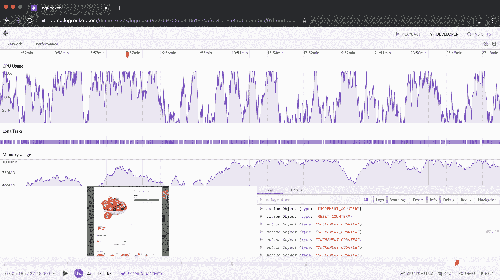

# 探索区块链视频流平台- LogRocket 博客

> 原文：<https://blog.logrocket.com/exploring-blockchain-video-streaming-platforms/>

如今，似乎每个人都喜欢视频流。疫情加速了全球流媒体平台的增长，Hulu、Disney+和 HBO Max 等热门视频流媒体平台也因此受益。不过也有很多尝试失败的例子，包括 Quibi 和 CNN+。

视频流是最残酷的行业之一。归根结底，有两种类型的视频流媒体平台，基于广告和基于订阅的平台。YouTube 就是一个基于广告的平台，而网飞则是一个基于订阅的平台。

中心化是这两个平台之间的连接器。虽然基于订阅的平台正面临越来越多的竞争，网飞正在失去其在市场上的主导地位，但基于广告的平台仍处于 YouTube 的垄断之下。

反对者通常批评 YouTube 的算法，该算法可以审查内容。不介入政治，当前生态系统缺乏透明度正在滋生强调去中心化的新型平台。这些新的去中心化平台的有趣之处在于，它们如何将技术作为其理想的保证来实施，以防止审查或由单一实体控制整个网络。

在本文中，我们将探索这些分散平台的技术方面。

## 什么是去中心化视频流？

当单个实体不能控制流服务的内容传递时，视频流是分散的。注意分散式和分布式视频流之间的区别很重要。

虽然分布式视频流意味着内容交付网络遍布全球，背后有一个实体，但分散化完全消除了这种控制。它创建了一个网络，参与者可以就该网络将做什么达成共识，增加了一层额外的民主，并给予社区更多的权力。

分散的视频流平台通常是社区所有的。区块链支持平台内的所有权，是去中心化的基础，为应用程序提供了完美的基础层。区块链层作为一个薄层，通过一个分散的分类帐将所有部分连接起来。

所有离线交易都必须向区块链层提交证据，以验证交易是否合法。因此，区块链成为真理的唯一来源。尽管如此，因为区块链不能存储像视频或图像这样的复杂数据源，[像 IPFS](https://blog.logrocket.com/how-build-dapp-host-ipfs-fleek/) 这样的链外解决方案或简单的点对点存储使数据可用。

### 点对点技术是区块链视频流的先决条件

当区块链成为基础层时，像 IPFS 或 BitTorrent 这样的对等协议是完全去中心化的先决条件。区块链本质上是分散的，任何人如果决定运行自己的节点，都可以拥有整个区块链的副本。另一方面，如果没有对等协议，通常是集中式的文件系统会变得越来越难以使用。

像谷歌云存储、亚马逊 S3 和 Azure Storage 这样的服务可以作为集中存储如何有效的例子。但是，要给用户一个完全去中心化的体验，你不能依赖去中心化生态系统中的那些技术。

## 分散式视频流中的技术问题

货币化仍然是分散式视频流媒体平台的突出问题。与 YouTube 等集中式平台的便利性相比，分散式视频流根本没有机会。

然而，在这一节中，我们将探索技术问题，而不是纯粹的商业模式问题。首先想到的问题包括文件存储和权限管理。此外，一个分散的生态系统不能摆脱保护原创艺术家创作的版权材料的必要性。创作者必须考虑实施检查和平衡，以阻止试图破坏生态系统的恶意用户。

在对等网络中，用户需要存储视频文件，并为对等连接提供强大的互联网连接。最后，还有针对具体内容的货币化方案的问题。让我们更深入地探讨这些问题，分析可能的解决方案。

## 文件存储问题

对等文件系统总是会遇到文件可用性的问题。存储是昂贵的，如果没有明确的激励措施，用户将不会在他们的系统上托管文件，更不用说保持健康的互联网连接供其他用户访问了。

作为文件共享生态系统的替代方案，对等文件共享可能会因为缺乏提供者而失败。只有当另一个对等方在线并愿意向您提供文件时，您才能获得您的文件。因此，您至少需要另外一个对等点来共享文件。在像这样的对等生态系统中，当所有对等点断开连接时，创建者可以求助于中央中继节点来提供丢失的文件。

但是，这样做会导致原来的中心化问题。如果有一种中央集权的力量可以供养整个社区，那么社区自我维持的动机是什么？在这种情况下，许多项目提供了持久分散数据共享的解决方案。像 [Arweave](https://www.arweave.org/) 、 [Filecoin](https://filecoin.io/) 和 [BitTorrent](https://www.bittorrent.com/) 这样的项目为同一个问题提供了不同的解决方案。

### 阿尔韦弗

Arweave 是一个永久的、分散的数据存储系统，主要用于网络存档。Arweave 依靠一站式支付方案来确保档案的可用性。用户预先付费在网络内存档他们的文件。

### Filecoin

Filecoin 是一种允许用户出租可用硬盘空间的协议。Filecoin 作为一个点对点的文件系统，建立在 IPFS 之上，允许有多余硬盘空间的用户出租他们的系统来挖掘 Filecoin。Filecoin 听起来像是一个现收现付的系统，类似于 Google Drive。在我看来，它是对等文件系统的最佳替代方案之一。

### IPFS 吗

你也可以使用星际文件系统 IPFS 来存储数据。但是，[普通的 IPFS 仍然要求你托管你的文件](https://blog.logrocket.com/guide-ipfs-garbage-collection/)或者支付托管你的文件的服务，如果你想让它们在网络中可用的话。 [DTube](https://d.tube/) ，一个去中心化的视频流媒体应用，是 YouTube 的直接竞争对手，利用 IPFS 进行文件存储，并使用 [Steemit 区块链](https://steem.com/SteemWhitePaper.pdf)来激励其创作者创作优质内容。

### 比特流

[BitTorrent](https://www.bittorrent.com/token/btt/) 在我看来是五个选项中最有趣的。BitTorrent 是一种点对点协议，不依赖用户托管节点。相反，它使用了一个叫做播种者和吸血者的概念。种子用户是下载文件并提供给其他用户的用户，实质上是使用他们的网络带宽将文件上传到网络。吸血鬼是请求文件并将文件下载到文件系统的用户。蜂群是 BitTorrent 生态系统中播种者和吸血者的集合。

在 BitTorrent 中，种子选手因其对网络的贡献而获得 BitTorrent 币奖励。相比之下，水蛭将需要花费 BitTorrent 令牌来下载文件或提高下载速度。

虽然 BitTorrent 听起来可能是最分散的选择，但它依赖于一个中央跟踪服务器来记录种子的 IP 并将其提供给文件的请求者。像任何其他点对点文件共享协议一样，如果没有种子，你就不能下载文件。

### 希腊字母的第八字

[Theta 是区块链的一个基础设施](https://assets.thetatoken.org/theta-mainnet-4-whitepaper.pdf)，它提供分散式视频流，是上述基础设施项目中领先且最知名的项目。Theta 使用了一个名为 Theta EdgeStore 的集中式点对点存储解决方案[。作为其存储解决方案的一部分，Theta 的分散存储与集中式云基础设施兼容，包括 AWS S3 和谷歌云存储。集中式云提供高可靠性的存储，而分散式部分则在使用集中式系统的成本过高时起到容错的作用。](https://docs.thetatoken.org/docs/theta-edge-store-overview)

Theta 还将拥有一个点对点的共享网络，以协助流媒体的传输。然而，对等共享网络并不存储视频，而是仅协助传送内容。

## 内容保护

一旦你搞清楚了持久存储，下一个主要问题就是版权。你不能把版权材料公开给所有人看而不侵犯原创者的权利。这是对等文件共享背后的主要问题之一。虽然 P2P 文件共享背后的技术并不违法，但用它来共享受版权保护的材料仍然是违法的。

不幸的是，你不能依靠陌生人的诚实或善良来保护你的版权。理想情况下，你会找到一种方法来直接保护你的文件，而不妨碍你如何赚钱。权限管理应用程序通常会对您的内容进行编码和加密，使任何直接访问存储中文件的人都无法使用这些内容。但是，如果你想对内容进行编码，一个单独的代码转换器将会把它传输出去。

在对等文件共享解决方案中有许多内容加密的例子。通常，那些依赖按次付费体系结构的网站需要文件编码来防止内容从网络中流失。目前有三个知名平台提供这些服务:LBRY、Livepeer 和 Theta。

### LBRY

LBRY 是一个去中心化的内容共享平台,旨在对抗 YouTube 等中心化的内容共享服务，并创建一个用户拥有的生态系统。LBRY 用户在这个平台上构建他们的应用程序，T2 奥德赛 T3 就是一个很好的例子。在用户将内容存储到他们的分散式生态系统之前，LBRY 通过将内容分成更小的块并加密来对其进行编码。每个块可以在不同的服务器上，LBRY 反过来看视频。然后，它会将所有较小的块收集在一起，解密它们，并将它们连接成一个文件。

### 直播同行

[Livepeer 是一种激励分散直播视频流的协议](https://github.com/livepeer/wiki/blob/master/WHITEPAPER.md)。Livepeer 提供经济激励来存储内容，并让用户托管可以传输内容的代码转换器。与 LBRY 相比，Livepeer 在内容存储和内容转码过程中都实现了盈利。存储货币化使用 [IPFS/Filecoin，](https://filecoin.io/)用户向存储提供商付费以保存他们的数据。然而，Livepeer 解决方案的新颖之处在于他们的转码过程。

Livepeer 为代码转换实现了一种风险证明机制。每个转码器都必须投入一定数量的 Livepeer 令牌，才能从 Livepeer 生态系统接收转码作业。Livepeer 不使用加密技术，而是依靠激励来保护内容。转码器将完全访问整个 Livepeer 媒体库。尽管如此，重要的是要注意，要赚钱，每个代码转换器都要维护声誉。如果疏忽被证实，转码器通过削减他们的股份来抑制 Livepeer 节点的不诚实。

### 希腊字母的第八字

在提到的三个中，Theta 是最发达的，在其整体基础设施中有多个分布式和分散式系统。θ有一个元链，它将是真理的唯一来源。虽然 Theta 生态系统中的所有操作都是离线的，但 Theta 利用零知识证明来验证提交到元链中的数据。

Theta 的内容加密平台非常依赖元链。要验证自己的身份并查看付费内容，用户必须购买 NFT。

编码过程类似于 Livepeer 的解决方案。首先，一个单独的 [Theta 视频 API](https://www.thetavideoapi.com/) 将作为编码和交付基础设施的抽象层。编码基础设施中的密钥服务器将为每段内容存储所有现有的解密密钥。

通过 Theta Video API，消费者必须购买 NFT，并用元链验证他们的所有权。如果验证成功，Theta Video API 将检索解密密钥。一旦 Theta Video API 检索到解密密钥，它将连接到交付基础设施，为消费者解密内容。

内容加密是集中式和分散式视频流应用共有的问题。受版权保护的材料很有价值，需要加密。到目前为止，分散的内容保护是最难解决的问题。

## 创建一个不可信的生态系统

当使用点对点视频流生态系统时，您相信网络中的其他电脑会为您提供正确、未经篡改的数据。但是，你如何在一个点对点的生态系统中执行呢？像 BitTorrent、IPFS 和 Arweave 这样的项目是相对安全的软件。然而，你必须足够勤奋，仔细检查你从这些平台下载的内容，因为危险大多是文件本身。

为了避免疏忽的存储提供商和恶意协议， [Filecoin 削减了其奖励](https://docs.filecoin.io/storage-provider/slashing/)以激励良好行为。关键是提供商在游戏中有利益，因此有动机保存文件。

因为您将流式传输视频，所以您将只接受视频扩展名文件类型。虽然文件可靠性仍然是一个问题，但如果您收到不同的文件扩展名，您可以轻松地将其作为潜在的漏洞风险。

此外，大多数分散式视频流平台都不允许你直接访问文件。相反，您通过他们的 web 应用程序与他们进行交互。它为您提供了额外的安全保障，让您知道您不会在您的设备上执行视频，浏览器会复制视频而不保存它们。

基于区块链的视频流媒体平台为每个设备转码视频。因此，每个平台都需要一种安全的方式将文件转码给消费者。在分散的生态系统中，代码转换本身可能会成为一个问题，因为无法保证每个代码转换器的可靠性。然而，通过激励良好的行为，许多在游戏中有利益关系的转码器将会遵守，否则他们的奖励将会被削减。或者，就 Livepeer 而言，他们冒着被削减股份的风险。

[Livepeer 的 proof-of-stage](https://github.com/livepeer/wiki/blob/master/WHITEPAPER.md#transcoder-transaction)转码机制类似于 proof-of-work，需要你押上足够数量的 Livepeer 令牌作为抵押品。通过锁定令牌，每个代码转换器都有令牌，如果他们行为不当，就会丢失这些令牌，这使得攻击整个生态系统的成本非常高。

创建一个不可信的生态系统需要激励最重要的参与者适当地执行。如果没有对不良行为的惩罚，恶意软件和不良用户行为会使整个生态系统变得不可靠。

## 流式货币化方案

内容创作并不便宜，创作者需要通过在平台上发布内容来获得收入。每个平台的收入流不同；有些使用订阅模式，有些使用按次付费或基于广告的模式。尽管并非所有的商业模式都是平等的，但在特定条件下，一些收入流比其他收入流更好。

例如，如果你想让这个平台免费使用，YouTube 基于广告的模式可能是最好的方法。一个很好的例子就是 Chainflix。

### 链条弯曲

Chainflix 是一个分散的视频流媒体基础设施，可以作为基于广告的流媒体的一体化包。视频流内容并不便宜，需要花费大量精力来制作。Chainflix 专注于为用户创造创造好内容的激励措施，同时也给观察者一个免费使用的内容平台。它的商业模式类似于 YouTube，因为它们完全依靠广告为创作者创造收入。

不同的是，Chainflix 使用一种分散的架构来放弃对其平台上发布的内容的控制，并利用观看证明(PoV)区块链来货币化其广告。PoV 机制的好处是，它可以保护系统不被试图通过观看视频获利的机器人游戏化。虽然 PoV 听起来像一个革命性的概念，但它与其他项目的竞争越来越激烈。在撰写本文时，[very ity](https://bitcoinist.com/how-verasity-proof-of-view-pov-is-granted-a-us-patent/#:~:text=Over%20the%20last%203%20years,been%20granted%20a%20US%20patent)领先于空格。

为了控制内容的流动，Chainflix 使用控制器通过 API 将客户端与分散的后端存储连接起来。Chainflix 还使用人工智能来提高存储效率，并创建更智能的分散存储方案。Chainflix 生态系统以效率为中心，而不是真正的去中心化，利用区块链来货币化和存储内容，不像 LBRY 那样使用按次付费模式。

### LBRY

LBRY 拥有自己的令牌，称为 LBRY 令牌 (LBC)。LBRY 有两个收入来源，[网络内的工作证明挖掘](https://lbry.com/faq/mining-credits)和按次付费模式。内容创作者的主要收入来源将是[的按次付费模式](https://lbry.com/faq/earn-credits)。您可以锁定您的内容，并为消费者设置最低观看价格。但是，LBRY 并不局限于按次付费。消费者也可以用 LBC 给你小费。你不需要第三方 Patreon 帐户来启用小费。

矿业交易也可能有利可图。LBC 开采期为[20 年](https://lbry.com/faq/block-rewards)，每开采 100 个区块，区块奖励将增加，在 500 个区块时达到峰值，之后缓慢下降。但挖矿奖励不仅限于区块生成，因为挖矿者还会从交易验证费中获得 LBC。为了激励矿工验证每笔交易， LBRY 有一个按发布付费的模式。这也阻止了创作者向区块链发送低质量内容的垃圾邮件。这种模式唯一的缺点是，你需要资本在 LBRY 上发表文章，尽管费用很少。

### 斯蒂米特

基于广告和按次付费或订阅模式是整个行业的标准。然而，第三个相对较新的选择是内容奖励。

Steemit 是一个建立在 [Steem 区块链](https://steem.com/SteemWhitePaper.pdf)上的激励性公共内容平台。建立在 Steem 平台上的用户将会因为他们发布的每一条内容而获得奖励。内容越好，他们获得的奖励就越多。Steem 通过受欢迎程度来衡量优质内容，主要使用向上投票和向下投票来确定奖励。

这是一个相当新的概念，主要缺点是 Steem 令牌基本上可以凭空创建。视频流媒体平台 DTube 使用 Steemit，但不清楚它是否仍然盈利。基于发布的内容和内容的声誉创造经济不是好兆头，因为人们没有动力去制作高质量的内容。在 Steemit 上定义高质量内容背后的参数可以很容易地用机器人串起来。一项研究甚至显示，16%的 Steemit 加密货币交易是机器人进行的。

根据您的项目所追求的模式，为内容创作者创建正确的激励可能会很困难。每一种都有它的缺点，可以孕育不同类型的社区。

免费网站通常会采用基于广告的系统，而付费网站将不可避免地依靠内容的质量来获得浏览量。创造内容以获得回报的新方法，或者我喜欢称之为内容挖掘，是一种新颖的方法，但它如何经受住时间的考验仍有待讨论。

## 通用区块链视频流基础设施

在所有区块链视频流项目中，基础设施基本保持不变。每个区块链视频流基础设施通常由智能合约、文件存储、内容转码器和 API 层组成。

虽然通用基础设施通常利用这四个组件，但是像 Theta 这样的项目也有一个额外的区块链运行时来适当地扩展它们的底层基础设施。但是，所有这些是如何相互作用的呢？

通常，希望传输视频的用户将首先通过平台的应用程序接口和 API 层访问内容。然后，当用户找到他们正在寻找的内容时，他们将使用智能合同购买访问权限，并使用加密货币支付。

然后，平台可以使用两种方法之一进行身份验证:要么是可过期的 NFT，要么是无需任何身份验证就可以立即提供内容。

然后，用户通过 API 层检索内容，连接到内容代码转换器并访问文件存储中的原始数据。内容转码器充当内容网关，在用户需要时解密内容。

虽然这一切听起来很简单，对许多人来说可能很有意义，但创建一个连接到分散存储的分散代码转换器对大多数人来说仍然是一个巨大的挑战。内容创作者如何才能相信转码器是公平的？分散式内容转码器不是由有动机保护视频的公司运营的。他们可以由像你我这样的正常人来经营。

Livepeer 试图通过创建一个基于 PoS 的代码转换生态系统来解决这个问题，在这个生态系统中，任何托管代码转换服务器的人都必须拥有足够数量的令牌才能被允许进入网络。如果恶意代码转换器违反了生态系统，他们的股份将被削减，赌注奖励将不复存在。

下一个问题是 API 层。虽然它是项目中较简单的组件之一，但是 API 层仍然需要集中。可靠性是大多数项目需要考虑的一个因素，如果 API 层是分散的，您将遇到在哪里存储所有数据的问题。

当然你可以说可以查询智能合约。但是，如果智能合约是在以太坊这种高气费的平台上呢？

您可能会考虑创建一个新的区块链运行时。尽管这是可能的，但您最终会在 API 层后面添加一个额外的层，从而增加项目本身的复杂性。查询 NoSQL 或关系数据库比查询区块链更快，您甚至可以在数据库中创建复杂的查询，而在区块链中很难或几乎不可能有效地这样做。

即使在所有这些忙乱之后，我们仍然没有触及分散文件存储的问题。您需要视频流的高可靠性，但是您如何确定您的分散式文件系统能够胜任这项任务呢？如果你经常失败怎么办？

您将需要添加一个额外的层到您提供的视频。你可以使用 CDN，甚至外部存储。但是，将视频存储在分散文件系统之外的外部存储上有点违背了这个目的。甚至 Theta 也将云提供商作为其视频流生态系统的重要组成部分。

当然，点对点存储是一个可行的替代方案，但点对点永远无法击败现代世界中开发人员可用的一贯可靠的云存储。这是一个有趣的困境。

从概念上讲，真正分散的视频流平台可能是工程上最难实现的壮举之一。如果没有云存储、集中式 API 和数据库等云服务的可靠性，很难提供一个可行的流媒体平台来与 YouTube 和网飞等巨头竞争。

## 结论

区块链正以尖端的技术和解决方案革新视频流行业。在本文中，我们探讨了几个分散式视频流基础设施项目，包括 Theta、Livepeer、LBRY 和 Chainflix。此外，我们还探索了其他相关的区块链存储项目，如 IPFS、Arweave、Filecoin，以及一个鼓励内容创作的区块链社交项目 Steem。

最后，我们分析了常见的基于区块链的视频流基础设施在概念上是如何工作的，以及制作一个真正去中心化的流平台所带来的问题。

加密货币开启了广泛的新激励模式，以在去中心化的混乱中维持秩序。区块链视频流媒体领域最有趣的事情是，许多项目尝试不同的模式，试图找到最有利可图和可持续的模式。但是只有时间能告诉我们哪些项目能够持续下去。

## 加入像 Bitso 和 Coinsquare 这样的组织，他们使用 LogRocket 主动监控他们的 Web3 应用

影响用户在您的应用中激活和交易的能力的客户端问题会极大地影响您的底线。如果您对监控 UX 问题、自动显示 JavaScript 错误、跟踪缓慢的网络请求和组件加载时间感兴趣，

[try LogRocket](https://lp.logrocket.com/blg/web3-signup)

.

[https://logrocket.com/signup/](https://lp.logrocket.com/blg/web3-signup)

LogRocket 就像是网络和移动应用的 DVR，记录你的网络应用或网站上发生的一切。您可以汇总和报告关键的前端性能指标，重放用户会话和应用程序状态，记录网络请求，并自动显示所有错误，而不是猜测问题发生的原因。

现代化您调试 web 和移动应用的方式— [开始免费监控](https://lp.logrocket.com/blg/web3-signup)。