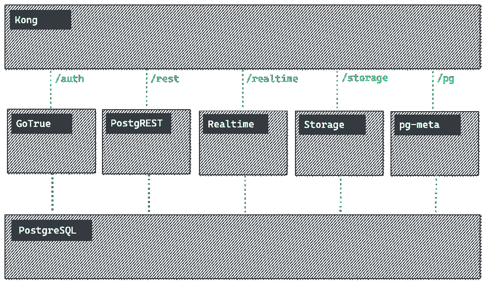
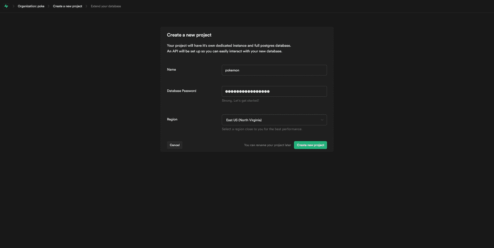
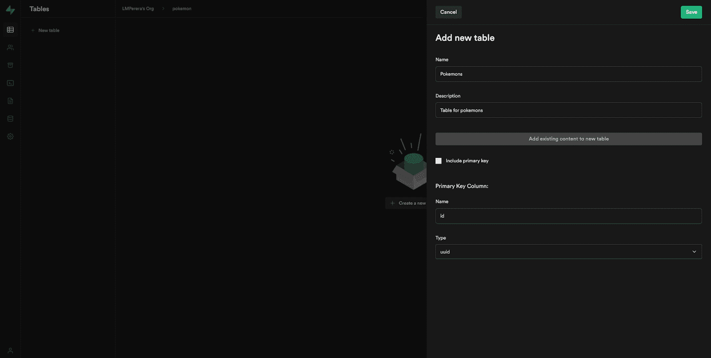
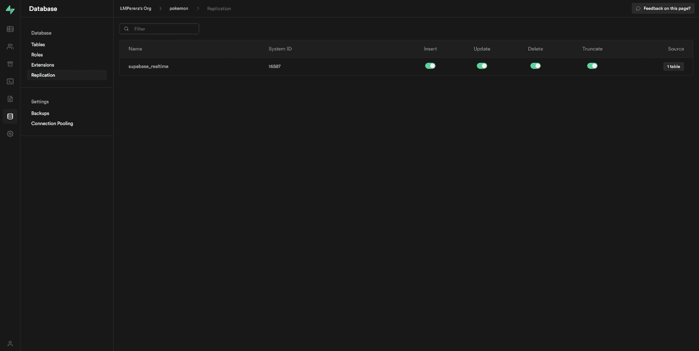
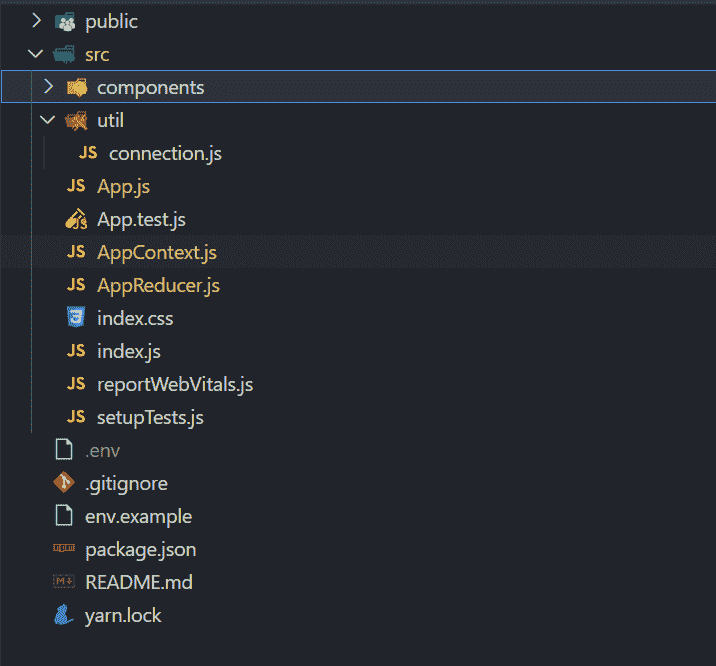

# 探索 Supabase，开源 Firebase 替代方案

> 原文：<https://blog.logrocket.com/exploring-supabase-the-open-source-firebase-alternative/>

## 介绍

Supabase 是一个开源的 Firebase 替代方案。这是一个大胆的标题，因为 Firebase 旨在作为一个完整的解决方案，具有各种功能，如身份验证、文件存储、无服务器功能、SDK 等等。

尽管 Firebase 有很多功能，但 Supabase 可能更有用，因为它使用了开源技术。Supabase 让您可以灵活地托管在本地机器上、云服务提供商中，甚至作为 Docker 容器。这意味着它不受限制，所以没有供应商锁定。

Supabase 在数据库中使用 [PostgreSQL](https://supabase.io/docs/guides/database) ，并通过他们构建的几个工具监听实时变化。

目前，Supabase 仅支持数据库、认证和存储等功能。它们也有无服务器功能，尽管这些仍处于开发阶段。

Supabase 脱颖而出的原因如下:

*   Supabase 为您处理缩放(即使它使用 SQL 数据库)
*   与 Firebase 不同，您可以执行复杂的查询或文本搜索
*   Supabase 中的数据迁移非常简单，因为它使用 PostgreSQL，所以您可以通过. SQL 文件导入数据

然而，使用 Supabase 有几个缺点。它们包括:

*   有限的功能
*   它要求您为表启用复制功能，以便接收实时更新
*   启用实时更新时，Supabase 的安全策略不适用
*   它的 SDK 只支持 JavaScript(对其他语言的支持还在测试阶段)

## 用 Supabase 存储

Supabase 提供开源对象存储，可以保存任何具有高可伸缩性的文件类型。它提供了一个方便的 API，允许定制策略和权限。

一些功能，如 CDN 集成和自动转换和优化(调整大小和压缩您的媒体)将很快推出。随着这些功能的增加，Supabase 存储将成为 Firebase 存储的有力竞争对手。

## 使用 Supabase 认证

每个 Supabase 项目都有内置的认证、授权和用户管理，不需要任何其他工具。

Supabase 提供了一个简单的 API 来集成第三方认证服务提供商，如 Google、Apple、Twitter、脸书、Github、Azure、Gitlab 和 Bitbucket。它还支持像 SAML 这样的企业登录。

## Supabase 如何管理实时数据

Supabase 使用 PostgreSQL 的几个工具来提供实时更新。它们如下:

*   [Realtime](https://github.com/supabase/realtime) 允许您监听 PostgreSQL 中的事件，如插入、更新和删除，并使用 WebSockets 将数据转换为 JSON 格式
*   Postgres-meta 允许您通过 REST API 查询 PostgreSQL
*   [PostgREST](http://postgrest.org/) 将 PostgreSQL 数据库转变为 RESTful API
*   GoTrue 通过一个生成 SWT 令牌的 SWT API 来管理用户
*   [孔](https://github.com/Kong/kong)是一个云原生 API 网关



通过上面的架构图，可以看到 Supabase 是如何用 PostgreSQL 实现实时数据的。

## Supabase 入门

在这一节中，让我们看看如何在 Supabase 中创建一个数据库并对其进行实时更新。

首先，让我们从 Supabase 仪表板登录并创建一个组织。然后，在**项目**选项卡下，点击**创建项目**按钮。这将提示您输入数据库名称、密码和您想要托管数据库的区域:



接下来，我们需要从项目仪表板的**表**选项卡下创建一个表。这一部分将提示您输入数据库名称和数据库字段(主键和其他)以及数据类型。

我们将创建一个启用了自动生成的数据类型为 UUID 的主键:



现在我们需要让这个表接收实时更新。从左侧边栏移动到**数据库**选项卡。

接下来，选择**复制**选项卡。这一部分将显示您创建的表格。为特定的表启用复制特性，如下所示:




既然我们已经创建了一个数据库和一个启用了复制的表，那么让我们看看如何使用 Supabase JavaScript SDK 的 API 方法。

## Supabase JavaScript API

Supabase JavaScript API 提供了易于理解的方法。因为我们处理的是 SQL，所以 API 方法看起来类似于 SQL 查询:

```
const { data, error } = await supabase
  .from('pokemon')
  .insert([
    { name:'Pikachu', power: 'Fire', description: 'Fluffy' },
  ])

```

上面的代码是在一个名为`pokemon`的表中插入一行。注意 Supabase 连接对象是如何选择表和操作的，就像 SQL 查询一样。

Supabase 中的数据查询类似于 SQL 中的 select 语句:

```
let { data: pokemon, error } = await supabase
  .from('pokemon')
  .select("*")

```

Supabase 查询对象提供了更多的过滤器选项。这些看起来类似于 SQL 查询中的`where` 和`like` 子句:

```
  .eq() ,
  .gt() ,
  .lt() ,
  .like() ,
  .is() ,
  .in() 

```

## 使用 Supabase 和 React

让我们看看如何用[创建 React 应用](https://reactjs.org/docs/create-a-new-react-app.html#create-react-app)来集成 Supabase 和 React。对于这个例子，让我们创建一个小的神奇宝贝应用程序来维护关于你最喜欢的神奇宝贝的数据。

首先，让我们创建一个 React 应用程序:

```
npx create-react-app supabase-pokemons 

```

现在让我们安装构建这个神奇宝贝应用程序所需的依赖项。我们将使用[语义 UI](https://semantic-ui.com/) 来构建 UI:

```
yarn add @supabase/supabase-js semantic-ui-react semantic-ui-css react-router-dom

```

现在让我们构建项目目录。由于这是一个小应用程序，我们将使用 React 的上下文 API。



首先，让我们使用以下键在项目根目录下创建一个. env 文件:

```
REACT_APP_SUPABASE_URL= <SUPABASE_URL>
REACT_APP_SUPABASE_KEY= <SUPABASE_KEY>

```

这些键可在 Supabase 仪表板上的**设置**部分找到:


现在，让我们用下面的代码片段在 **util/connection.js** 下创建 Supabase 连接:

```
import { createClient } from '@supabase/supabase-js';
const REACT_APP_SUPABASE_URL = process.env.REACT_APP_SUPABASE_URL;
const REACT_APP_SUPABASE_KEY = process.env.REACT_APP_SUPABASE_KEY;
export const supabase = createClient(REACT_APP_SUPABASE_URL, REACT_APP_SUPABASE_KEY);

                                               connection.js file

```

让我们通过内置的第三方服务提供商(如 Google 和 Github)为应用程序添加登录功能:

```
const signIn = async () => {
        await supabase.auth.signIn({ email: credentials.email, password: credentials.password });
        clear();
    }

    const signUp = async () => {
        await supabase.auth.signUp({ email: credentials.email, password: credentials.password })
        clear();
    }

```

如您所见，用户管理易于维护。您可以用几行代码创建它。

### 与 Google 和 Github 集成

接下来，我们来看看如何与 Google 和 Github 整合。首先，您需要从特定的身份验证提供者创建密钥，并通过仪表板将它们添加到 Supabase:

`const gitHub = async () => {`

```
        await supabase.auth.signIn({
            provider: 'github'
        })
    }

```

您可以使用上述代码集成 Supabase 支持的任何其他第三方身份验证提供者。

这只是更改提供商名称的问题，Supabase 会为您处理剩下的事情:

```
import { useState, useEffect, useContext } from "react"
import AppContext from "../AppContext";
import { useHistory } from "react-router-dom";
import { Grid, GridColumn, GridRow, Form, FormField, Input, Icon, Button, Header, Segment } from "semantic-ui-react"

const initState = { email: '', password: '', passwordConfirm: '' }

function Login({ supabase }) {
    let history = useHistory();
    const [isSignIn, setSignIn] = useState(false);
    const [credentials, setCredentials] = useState(initState);
    const { user, isLoggedIn, login, logout } = useContext(AppContext)

    useEffect(() => {
        const { data: authListener } = supabase.auth.onAuthStateChange(
            async (event, session) => {
                const currentUser = session?.user;
                login(session.user)
            }
        );
        return () => {
            authListener?.unsubscribe();
        };
    }, [user]);

    useEffect(() => {
        if (isLoggedIn) {
            history.push("/home");
        }
    }, [isLoggedIn])

    const onChange = (type, value) => {
        setCredentials({ ...credentials, [type]: value })
    }

    const clear = () => {
        setCredentials(initState)
    }

    const signIn = async () => {
        await supabase.auth.signIn({ email: credentials.email, password: credentials.password });
        clear();
    }

    const signUp = async () => {
        await supabase.auth.signUp({ email: credentials.email, password: credentials.password })
        clear();
    }

    const gitHub = async () => {
        await supabase.auth.signIn({
            provider: 'github'
        })
    }

    const google = async () => {
        await supabase.auth.signIn({
            provider: 'google'
        })
    }

    return (
        <Grid padded>
            <GridRow>
                <GridColumn width={5}></GridColumn>
                <GridColumn width={6}></GridColumn>
                <GridColumn width={5}></GridColumn>
            </GridRow>
            <GridRow>
                <GridColumn width={5}></GridColumn>
                <GridColumn width={6}>
                    <Segment>
                        <Form>
                            <FormField>
                                <Header as="h5">Email</Header>
                                <Input placeholder="Email" value={credentials.email} onChange={(e, { value }) => onChange('email', value)}></Input>
                            </FormField>
                            <FormField>
                                <Header as="h5">Password</Header>
                                <Input placeholder="Password" value={credentials.password} onChange={(e, { value }) => onChange('password', value)}></Input>
                            </FormField>
                            {isSignIn ?
                                <FormField>
                                    <Header as="h5">Confirm Password</Header>
                                    <Input placeholder="Password" value={credentials.passwordConfirm} onChange={(e, { value }) => onChange('passwordConfirm', value)}></Input>
                                </FormField>
                                : null}
                            <FormField>
                                <Button onClick={() => isSignIn ? setSignIn(false) : signIn()}>Login</Button>
                                <Button onClick={() => isSignIn ? signUp() : setSignIn(true)}>SignIn</Button>
                            </FormField>
                        </Form>
                    </Segment>
                    <Segment>
                        <Grid>
                            <GridRow>
                                <GridColumn width={8}>
                                    <Button icon labelPosition='left' fluid onClick={gitHub}>
                                        <Icon name='github' />
                                        Github
                                    </Button>
                                </GridColumn>
                                <GridColumn width={8}>
                                    <Button icon labelPosition='left' fluid onClick={google}>
                                        <Icon name='google' />
                                        Google
                                    </Button>
                                </GridColumn>
                            </GridRow>
                        </Grid>
                    </Segment>
                </GridColumn>
                <GridColumn width={5}></GridColumn>
            </GridRow>
            <GridRow>
                <GridColumn width={5}></GridColumn>
                <GridColumn width={6}></GridColumn>
                <GridColumn width={5}></GridColumn>
            </GridRow>
        </Grid>
    )
}

export default Login

                                               Login.js file

```

### 创建一个`AppContext.js`文件

接下来，让我们为保存应用程序数据的应用程序创建上下文。

* * *

### 更多来自 LogRocket 的精彩文章:

* * *

在 src 目录下为名为`AppReducer.js`的应用上下文添加一个`AppContext.js`文件和一个 reducer:

```
import { createContext, useReducer } from "react";
import AppReducer from "./AppReducer"

const initialState = {
    user: null,
    pokemon: null,
    pokemons: [],
    isEditing: false,
    isLoggedIn: false,
}

const AppContex = createContext(initialState)

export const AppContextProvider = ({ children }) => {
    const [state, dispatch] = useReducer(AppReducer, initialState);

    const login = (data) => { dispatch({ type: 'LOGIN', payload: data }) }
    const logout = (data) => { dispatch({ type: 'LOGOUT', payload: data }) }
    const getPokemons = (data) => { dispatch({ type: 'GET_POKEMONS', payload: data }) }
    const selectPokemon = (data) => { dispatch({ type: 'SELECT_POKEMON', payload: data }) }
    const createPokemon = (data) => { dispatch({ type: 'CREATE_POKEMON', payload: data }) }
    const updatePokemon = (data) => { dispatch({ type: 'UPDATE_POKEMON', payload: data }) }
    const deletePokemon = (data) => { dispatch({ type: 'DELETE_POKEMON', payload: data }) }

    return (
        <AppContex.Provider value={{ ...state, login, logout, getPokemons, selectPokemon, createPokemon, updatePokemon, deletePokemon }}>
            {children}
        </AppContex.Provider >
    )
}

export default AppContex;

                                               AppContex.js file

const deleteItem = (pokemons, { id }) => {
    return pokemons.filter((pokemon) => pokemon.id !== id)
}

const updateItem = (pokemons, data) => {
    let pokemon = pokemons.find((pokemon) => pokemon.id === data.id);
    let updatedPokemon = { ...pokemon, ...data };
    let pokemonIndex = pokemons.findIndex((pokemon) => pokemon.id === data.id);
    return [
        ...pokemons.slice(0, pokemonIndex),
        updatedPokemon,
        ...pokemons.slice(++pokemonIndex),
    ];
}

const AppReducer = (state, action) => {
    switch (action.type) {
        case 'GET_POKEMONS':
            return {
                ...state,
                pokemons: action.payload
            };
        case 'SELECT_POKEMON':
            return {
                ...state,
                isEditing: true,
                pokemon: action.payload
            }
        case 'CREATE_POKEMON':
            return {
                ...state,
                pokemons: [action.payload, ...state.pokemons]
            };
        case 'UPDATE_POKEMON':
            return {
                ...state,
                isEditing: false,
                pokemons: updateItem(state.pokemons, action.payload)
            };
        case 'DELETE_POKEMON':
            return {
                ...state,
                pokemons: deleteItem(state.pokemons, action.payload)
            };
        case 'LOGIN':
            return {
                ...state,
                user: action.payload,
                isLoggedIn: true
            };
        case 'LOGOUT':
            return {
                ...state,
                user: null,
                isLoggedIn: false
            };
        default:
            return state
    }
}

export default AppReducer

                                               AppReducer.js file

```

### 向应用程序添加数据

现在我们开始第一次使用 Supabase。在这里，我们将从一个名为`PokemonForm.jsx`的组件开始向神奇宝贝表添加数据。

在这个文件下，让我们创建两个函数来创建和更新神奇宝贝:

```
    const createPokemon = async ({ name, power, description }) => {
        try {
            await supabase
                .from('pokemon')
                .insert([
                    { name, power, description }
                ]);
        } catch (error) {

        } finally {
            clear();
        }
    }

```

上面的函数负责创建一个神奇宝贝。由于我们有一个 ID 字段类型为 UUID 的表，它将为每个数据行创建一个惟一的 ID。

现在请注意，来自 Supabase 的每个命令都返回一个承诺，这样您就可以使用`Async` / `Await`来处理异步操作。更新功能如下:

`const updatePokemon = async ({ id, name, power, description }) => {`

```
        try {
            await supabase
                .from('pokemon')
                .update([
                    { name, power, description }
                ]).match({ id: id })
        } catch (error) {

        } finally {
            clear();
        }
    }

```

您可以参考下面代码片段中的完整代码:

```
import { useEffect, useState, useContext } from "react"
import AppContex from "../AppContext"
import { Form, FormField, Header, Input, Button, Segment } from 'semantic-ui-react'

const initState = { name: '', power: '', description: '' }

function PokemonForm({ supabase }) {
    const { isEditing, pokemon } = useContext(AppContex)
    const [newPokemon, setNewPokemon] = useState(initState);

    useEffect(() => {
        if (pokemon) {
            setNewPokemon(pokemon)
        }
    }, [pokemon])

    const createPokemon = async ({ name, power, description }) => {
        try {
            await supabase
                .from('pokemon')
                .insert([
                    { name, power, description }
                ]);
        } catch (error) {

        } finally {
            clear();
        }
    }

    const updatePokemon = async ({ id, name, power, description }) => {
        try {
            await supabase
                .from('pokemon')
                .update([
                    { name, power, description }
                ]).match({ id: id })
        } catch (error) {

        } finally {
            clear();
        }
    }

    const onChange = (type, value) => {
        setNewPokemon({ ...pokemon, [type]: value })
    }

    const clear = () => {
        setNewPokemon(initState)
    }

    const cancel = () => {
        clear()
    }

    return (
        <Segment>
            <Form>
                <FormField>
                    <Header as="h5">Name</Header>
                    <Input value={newPokemon.name} onChange={(e, { value }) => onChange('name', value)} />
                </FormField>
                <FormField>
                    <Header as="h5">Power</Header>
                    <Input value={newPokemon.power} onChange={(e, { value }) => onChange('power', value)} />
                </FormField>
                <FormField>
                    <Header as="h5">Description</Header>
                    <Input value={newPokemon.description} onChange={(e, { value }) => onChange('description', value)} />
                </FormField>
                <Button onClick={() => isEditing ? updatePokemon(newPokemon) : createPokemon(newPokemon)}>{isEditing ? 'Update' : 'Save'}</Button>
                <Button onClick={() => cancel()}>Cancel</Button>
            </Form>
        </Segment>
    )
}

export default PokemonForm

```

同样，您可以通过运行以下代码来删除特定的神奇宝贝:

```
const deletePokemon = async (id) => {
        await supabase
            .from('pokemon')
            .delete().match({ id: id })
    }

```

请注意，我们传入了 ID(这是 Supabase 自动生成的 UUID ),它将根据给定的 ID 搜索神奇宝贝并执行删除。

### 创建事件监听器

接下来，让我们创建一个事件订阅者，它将在整个应用程序中监听实时事件。因为我们订阅了事件，所以收听它们的理想地点是 React 中的`useEffect`生命周期挂钩。

让我们在`Home.jsx`文件中创建事件监听器:

```
    useEffect(() => {
        supabase
            .from('pokemon')
            .select().then(({ data }) => { getPokemons(data) })

        const subscription = supabase
            .from('pokemon')
            .on('*', payload => {
                alterPokemons(payload)
            })
            .subscribe()

        return () => supabase.removeSubscription(subscription)
    }, []);

```

注意我们是如何为应用程序的卸载阶段创建事件监听器和清理函数，并返回`useEffect`。

Supabase 对象提供了一个名为`.on()` 的 API 函数，它接受两个参数。第一个参数是事件类型，第二个参数是回调函数。

Supabase 监听几个事件。它们是:

*   `INSERT`:监听数据插入事件
*   `UPDATE`:监听数据更新事件
*   `DELETE`:监听数据删除事件
*   `*`:监听应用程序中发生的所有事件

现在，为了监听应用程序中发生的所有事件，让我们创建一个函数，该函数将根据事件类型触发 reducer 函数:

```
    const alterPokemons = (payload) => {
        switch (payload.eventType) {
            case "INSERT":
                createPokemon(payload.new);
                break;
            case "DELETE":
                deletePokemon(payload.old);
                break;
            case "UPDATE":
                return updatePokemon(payload.new)
            default:
                createPokemon(payload.new);
        }
    }

```

该功能将在`.on()`功能内触发。注意，有效负载返回三个重要的值。

它们是:

*   `eventType`:事件类型`INSERT`、`UPDATE`和`DELETE`
*   `new`:新数据/更新数据
*   `old`:旧数据

通过上面的代码片段，你可以看到为什么 Supabase 正在成为 Firebase 的一个有竞争力的替代品。与其他服务相比，Supabase 的 API 仅用几行代码就提供了所有很酷的功能。

你可以通过下面的 [GitHub repo](https://github.com/LMPerera/supabase-pokemons) 来浏览这个项目的代码。

## 结论

总之，Supabase 是谷歌 Firebase 的最佳开源替代方案。它利用 PostgreSQL 的强大功能提供了一些很酷的特性，并且不像其他实时数据库解决方案那样对数据类型有任何限制。

你可以通过参考它的[文档](https://supabase.io/docs)找到更多关于 Supabase 的信息。

感谢您花时间阅读本文。我希望在下面的评论区看到你对这个话题的问题和评论。干杯！

## 使用 [LogRocket](https://lp.logrocket.com/blg/signup) 消除传统错误报告的干扰

[](https://lp.logrocket.com/blg/signup)

[LogRocket](https://lp.logrocket.com/blg/signup) 是一个数字体验分析解决方案，它可以保护您免受数百个假阳性错误警报的影响，只针对几个真正重要的项目。LogRocket 会告诉您应用程序中实际影响用户的最具影响力的 bug 和 UX 问题。

然后，使用具有深层技术遥测的会话重放来确切地查看用户看到了什么以及是什么导致了问题，就像你在他们身后看一样。

LogRocket 自动聚合客户端错误、JS 异常、前端性能指标和用户交互。然后 LogRocket 使用机器学习来告诉你哪些问题正在影响大多数用户，并提供你需要修复它的上下文。

关注重要的 bug—[今天就试试 LogRocket】。](https://lp.logrocket.com/blg/signup-issue-free)