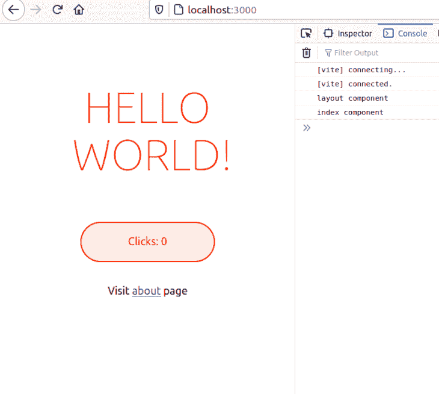
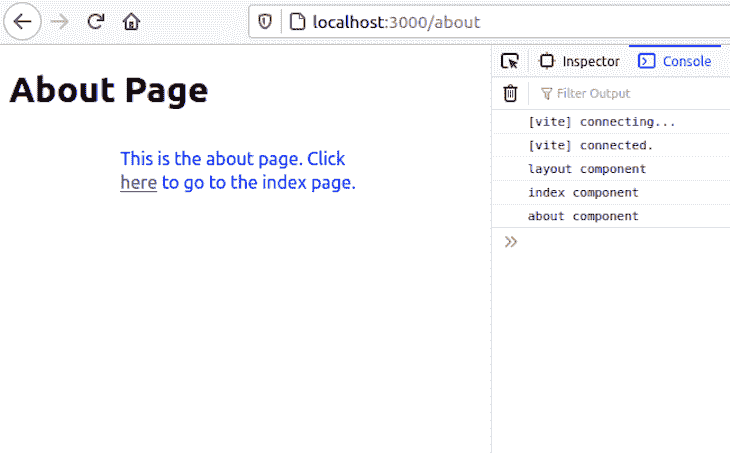

# 探索 SvelteKit，最新的基于 Svelte 的框架

> 原文：<https://blog.logrocket.com/exploring-sveltekit-the-newest-svelte-based-framework/>

创建 web 应用程序的最新框架在这里:SvelteKit。这个框架很容易使用，即使是经验不足的开发人员。

SvelteKit 是由 Svelte 支持的紧凑而强大的 JavaScript 框架 [Sapper、](https://blog.logrocket.com/exploring-sapper-svelte-a-quick-tutorial/)的继承者。SvelteKit 的新版本是对 Sapper 提供的版本的升级，目前处于公开测试阶段。

我自己探索 SvelteKit 给我留下了深刻的印象，它非常容易理解；与 React 等其他流行框架相比，它需要学习的概念更少。

让我们深入研究 Svelte 和 SvelteKit 的基础知识，并最终探索一个 SvelteKit 示例。

## 什么是 Svelte 和 SvelteKit？

Svelte 是一个类似 React 的组件库，SvelteKit 是类似 Next.js 的应用框架。虽然类似，但 Svelte 与 React 不同的原因是因为它提供了一种不同的方式来思考 web 应用程序。

React 使用虚拟 DOM diffing 来决定更新一个 UI 所需的更改，但 Svelte 是一个编译器，它编译你的代码，并将 Svelte 组件转换为 JavaScript 来呈现和更新它们，使它更快更轻。

然后，SvelteKit 会像 Next.js 一样，通过服务器端渲染、路由等方式来完成设置应用程序的所有繁重工作。然而，SvelteKit 还使用一个适配器，可以将应用程序导出到特定的平台，并很好地适应无服务器架构。由于无服务器架构变得越来越突出，这是尝试 SvelteKit 的好理由。

你可以使用 Netlify 和 Vercel 等平台的官方 SvelteKit 适配器。

SvelteKit 还提供了包括服务器端渲染、代码分割等特性，对于初学者来说尤其有用。

至此，让我们看看如何用 SvelteKit 创建一个新项目。

## 设置苗条工具包

在我们编写一个示例应用程序之前，我们将使用您用 SvelteKit 创建一个新项目时获得的演示应用程序，并回顾一些将使您熟悉该框架的关键概念。

### 装置

从在终端中输入下面的代码片段开始。这将在当前目录中设置一个应用程序。

```
npm init [email protected]

```

然后输入以下内容来安装所有的依赖项，我们就可以开始了。

```
npm install

```

另外，如果你使用的是 Visual Studio 代码，安装[官方的苗条扩展](https://marketplace.visualstudio.com/items?itemName=svelte.svelte-vscode)用于语法高亮显示和其他用于编写苗条组件的特性，比如应用程序页面。

SvelteKit 设置了一个路线系统，你的`src/routes`中的文件决定了你的应用程序中的路线。该目录可以通过编辑`svelte.config.cjs`进行更改。

注意`src/routes/index.svelte`是主页。

通过输入`npm run dev`，你启动了一个开发服务器。SvelteKit 在幕后使用 [Vite](https://blog.logrocket.com/whats-new-in-vite-2-0/) 进行快速更新。

此时，使用以下代码安装静态适配器以构建整个应用程序的预呈现版本:

```
npm i -D @sveltejs/[email protected]

```

现在，让我们探索一些代码，做一些修改，看看结果。

### 按指定路线发送

我们将通过将`about.svelte`输入到`src/routes/`目录，为 SvelteKit 为我们自举的 counter app 添加另一条路线。

```
<!-- about page -->
<svelte:head>
    <title>About</title>
</svelte:head>
<h1>About Page</h1>
<p>This is the about page. Click <a href="/">here</a> to go to the index page.</p>

```

你大概能猜到，这将在`/about`为我们设置另一条路线。为了导航到这个页面，我们还将添加一个到索引页面的链接。

索引页已经有以下行:

```
<p>Visit <a href="https://svelte.dev">svelte.dev</a> to learn how to build Svelte apps.</p>

```

我们将把它改为下面的代码:

```
<p>Visit the <a href="/about">about</a> page</p>

```

当我们点击链接时，内部路由器开始工作并处理导航。事实上，SvelteKit 默认处理导航。初始加载在服务器端处理，然后 SvelteKit 的内置路由器处理客户端的后续导航，除非我们另有说明。

SvelteKit 允许您通过更改 Svelte 配置文件`svelte.config.cjs`来禁用该路由器。将`router`属性设置为 false 会禁用应用范围内的路由器。这将导致应用程序为每个页面发送新的请求，这意味着导航将在服务器端处理。

* * *

### 更多来自 LogRocket 的精彩文章:

* * *

如果需要，您也可以逐页禁用路由器。我们将通过在`about.svelte`的顶部添加以下内容来继续查看它的运行情况:

```
<script context="module" lang="ts">
    export const router=false;
</script>

```

我一会儿会谈到`context="module"`和`lang="ts"`。现在，让我们通过`npm run`T3 运行这个应用程序。我们应该预料到来自 About 页面的所有路由将由服务器处理，这意味着当从 About 页面导航时，将向服务器发出新的请求。这是一个很好的小功能 SvelteKit 提供给我们完全开箱即用。

### 脚本和样式

看看我们刚刚使用的脚本，包含`context="module"`的脚本被直接添加到模块中。这意味着它们在组件初始化时运行一次，而其他没有`context="module"`的脚本则成为实例(组件)的一部分，并在创建和初始化实例时运行。

因此，`<script context="module"></script>`中的变量在模块的默认导出实例之间共享，默认导出是组件本身。

`lang="ts"`告诉编译器使用的语言是 TypeScript。如果您在安装过程中选择了 TypeScript 作为语言，则需要使用它。如果您使用的是 JavaScript，那么这里不需要做任何事情。

作为一个小实验，我们将把它添加到`src/lib/Counter.svelte`的顶部:

```
<script context="module">
    console.log("module code");
</script>

```

然后，将这一行添加到已经存在的实例级脚本的顶部:

```
console.log("component code");

```

我们还将通过添加`<Counter/>`在`index.svelte`中包含另一个计数器组件。

那么，当我们运行这个时，我们看到了什么？由于两个计数器相互独立，日志显示“模块代码”首先运行，然后出现两个“组件代码”消息。

现在，让我们把这个加到`about.svelte`的底部:

```
<style>
    p {
        color:blue;
        max-width: 14rem;
        margin: 2rem auto;
        line-height: 1.35;
    }
</style>

```

在 Svelte 中，应用于组件的样式的范围是组件。此样式将仅应用于“关于”页面。

您还会注意到`routes/`中的`$layout.svelte`组件；这可以显示和样式化跨不同路线持久的东西，例如页脚。

### 布局

让我们深入了解布局组件如何将每个组件包装在其自身中，使其成为执行诸如提供商店和设置上下文等功能的理想场所。

首先，让我们将它添加到`$layout.svelte`文件中:

```
<script>
  console.log("layout component");
</script>  

```

然后将类似的日志语句添加到路由`index.svelte`和`about.svelte`中。启动开发服务器，在浏览器中查看控制台；布局消息首先出现，然后是索引消息。



现在，当我们导航到 About 页面时，日志显示了添加的`about component`行



由于首先呈现的是`$layout`组件，因此当路由器需要页面时，会从布局中添加和删除页面。

您还可以使用生命周期方法`onDestroy`，Svelte 提供该方法来验证布局组件只呈现一次，并且在导航到不同页面时不会被卸载。通过将这些行添加到`$layout.svelte`，您会注意到控制台中没有出现日志:

```
import { onDestroy } from 'svelte';
onDestroy(() => console.log("$layout unmounted")); 

```

即使我们在页面间导航，也不会被调用。

我们可以通过获取许多页面需要的一些数据或者建立一个其他页面可以用来相互传递数据的集中存储(我们将在后面看到)来利用这种行为。

如果您熟悉 Svelte 或 React，那么在代码中添加上下文可以让我们免于繁琐的练习。在我们的例子中，我们可以在`$layout.svelte`中为所有要接收的页面及其组件添加数据上下文。

### 服务器端

我们知道，默认情况下，SvelteKit 会在第一次加载时在服务器端呈现应用程序。但是，如果我们想在 SSR 期间用数据填充我们的应用程序，而不向用户显示加载微调器，该怎么办呢？或者说，我们如何将数据从服务器传递到客户端？

嗯，SvelteKit 提供了只在服务器上运行的钩子，帮助我们实现这些目标。但是在我们探讨钩子之前，我想先谈谈端点，以便更好地理解服务器端。

端点是服务器端的，其创建类似于页面和路由。然而，作为端点的文件将在`routes`目录中以扩展名`.js`或`.ts`结尾。

```
// src/routes/dogs.ts
import type { RequestHandler, Response } from "@sveltejs/kit";

interface dog{
name: string
}
const dogs:dog[]=[{name:"German Shepherd"},{name:"BullDog"},{name:"Poodle"}]
export const get:RequestHandler= async () =>{
    const res:Response={
        body:{
            dogs
        }
     }
    return res;
}

```

方法名`get`对应于 HTTP 方法 GET。此端点在`/dogs`可用。如果你在浏览器中导航到`/dogs`，你会发现一个包含狗的列表的 JSON 响应。

使用钩子，您可以更好地控制服务器端，创建一个理想的地方来执行像身份验证这样的功能，因为它们也从客户机接收 HTTP 请求对象。SvelteKit 中有三个钩子，我们将在下一节中使用`getContext`和`getSession`。

## 苗条的建筑

了解了 SvelteKit 生态系统的基础，我们可以构建一个非常简单的玩具应用程序，它将从我们将要设置的源中获取数据，执行一些简单的身份验证，并建立一个中央商店。

我们的应用程序将包含以下路线:`/counter1`、`/counter2`、`/about`和`/login`。计数器页面将受到保护，而“关于”页面不受保护。

因此，让我们首先关注一下认证逻辑。

### 证明

由于钩子在服务器上运行每个请求，然后再运行其他任何东西，并且因为它们可以访问请求参数，`src/hooks.ts`是提取 cookies 和为用户创建会话的理想位置。

请注意，该会话不是典型意义上的会话；服务器端不会保留任何会话记录。我们将在这里使用的会话将简单地帮助我们将数据传递到客户端并提供初始状态。

`getContext`钩子接收请求头，它可能包含也可能不包含 cookies，这取决于请求的认证。当我们提取认证令牌并返回它时，下一个钩子将接收这个上下文作为参数。

从`getSession`钩子返回的任何东西都可以作为会话变量用于每个页面。

```
// src/hooks.ts
import {defaultState} from '$lib/store';
import * as cookie from 'cookie';
const auth_token='demo_token_for_example';
const userDetails={name:"Deb",age:45}

export const getContext:GetContext=({ headers })=>{
    const cookies = cookie.parse(headers.cookie || '');
    return {
        token:cookies['token']
    };
}
export const getSession:GetSession=async ({context})=>{
    let initialState={...defaultState};
    if (context['token']===auth_token){
        console.log("tokens match");
        initialState.authenticated=true
        initialState.user=userDetails;
    }
    console.log(initialState)
    return initialState
}

```

为了简洁起见，我们将身份验证令牌和用户详细信息存储在文件本身中。在实际项目中，您可能会为此使用数据库或身份验证后端。

这个想法是从`getContext`的头中提取一个 cookie，然后检查它是否有正确的令牌。如果它包含正确的令牌，我们返回“已验证”的初始状态。不要担心`initialState`，我们将在这篇文章的后面看看`$lib/store`。

我们现在将设置一个端点，它将接受 GET 请求并返回一个包含令牌的 cookie。这在登录组件中很有用。

```
// src/routes/auth.ts
const auth_token='demo_token_for_example';
const cookie=`token=${auth_token};HttpOnly;Secure`
const header:Headers={'set-cookie':cookie}
export const get:RequestHandler=()=>{
    return{
        headers:header,
        body:{
            token:auth_token,
            success:true,
            user:{
                name:"Deb",
                age:45
            }
        }
    }

}

```

同样，用户详细信息通常从数据库中获取。但是在这里，为了简单起见，我们将它们硬编码。

### 建设商店

如果你不熟悉 Svelte 的可写商店，它们可以在应用程序中的任何地方写入，并且是反应式的。这是建立一个可写存储的简单方法，它将存储我们应用程序的全局状态。

```
// src/lib/store.ts
import {Writable, writable} from 'svelte/store';
export type User={
    name:string|null,
    age?:number
}
export interface stateType{
    authenticated:boolean,
    user:User,
    counter:number
}
export const defaultState:stateType={
    authenticated:false,
    user:{
        name:null,
    },
    counter:0
}
export default class Store{
    state:Writable<stateType>;
    constructor(initialState:stateType=defaultState){
        this.state=writable({...initialState})
    }
    changeAuthenticationState=(user:User)=>{
        this.state.update((obj)=>{
            console.log("old state")
            console.log(obj)
            return {
                ...obj,
                authenticated:!obj.authenticated,
                user:user
            }
        })
    }
    updateCounter=(val:number)=>{
        this.state.update((obj)=>{
            return {
                ...obj,
                counter:val
            }
        })
    }
}

```

接下来，我们将在`$layout.svelte`根设置一个上下文，并向所有后代提供我们的存储，使所有页面都能够访问存储。

```
<!-- src/routes/$layout.svelte -->
<script context="module" lang="ts">
    import Store from '$lib/store';
    import {setContext} from 'svelte';
</script>
<script lang="ts">
    import '../app.css';
    import {session} from '$app/stores';
    const store=new Store($session)
    setContext<Store>('store',store);
</script>
<slot />

```

注意我们是如何使用从会话中收到的初始状态创建一个新的商店，并将其传递给`setContext`。现在可以通过键`'store'`在任何页面访问商店。

### `load`功能

我们的页面还可以导出一个名为`load`的特殊函数。该函数可以在组件呈现之前提取数据或写入会话，首先在服务器端运行，然后在客户端运行。这在服务器端呈现期间特别有用，因为我们可能需要用必须预先获取的数据填充页面。

```
<!-- src/routes/login.svelte -->
<script context="module" lang="ts">
    import type { Load } from '@sveltejs/kit';
    export const load:Load=async ({session})=>{

                if(session.authenticated){
                    return{  
                        redirect:'/counter1',
                        status:302
                    }
                }   
            return {}
    }
</script>
<script lang="ts">
    import type Store from '$lib/store';
    import {goto} from '$app/navigation';
    import {setContext,getContext} from 'svelte';
    const store=getContext<Store>('store');
    const login=async ()=> {
        let res= await fetch('/auth');
        let data=await res.json();
        if(data.success){
            store.changeAuthenticationState(data.user);
            goto('/counter1');
        }
    }
</script>
<h1>Login Page</h1>
<button on:click={login}>Login</button>

```

在登录页面的`load`函数中，我们可以检查用户是否通过了身份验证，因为我们不想向通过身份验证的用户显示登录页面。

如果他们通过了身份验证，我们会将他们重定向到`/counter1`页面。如果没有，我们获取令牌并更新状态。一旦通过身份验证，我们就可以导航到受保护的路由，如`/counter1`。

### 柜台

`counter1.svelte`的`load`函数检查用户是否通过了身份验证，如果没有，就将他们重定向到登录页面。我们只在服务器端执行这种检查，因为我们的应用程序的结构不提供任何导航到`/counter1`页面的方法，除非对服务器执行完整的请求。

```
<script context="module" lang="ts">
    import {browser} from '$app/env';
    export const load:Load=async ({session})=>{
        if(!browser)
            {
                if(!session.authenticated){
                    return{ 
                        redirect:'login',
                        status:302
                    }
                }
                else{
                    session.counter=1; //set counter to 1 during ssr
                }
            }
            return {}
    }
</script>
<script lang="ts">
    import type Store from '$lib/store';
    import Counter from '$lib/Counter.svelte';
    import {setContext,getContext} from 'svelte';
    const store=getContext<Store>('store');
    const state=store.state;
</script>
<svelte:head>
    <title>Counter 1</title>
</svelte:head>
<main>
    <h1>Hello {$state.user.name}</h1>
    <Counter update={store.updateCounter} count={$state.counter}/>
    <p>Visit <a href="/counter2"> Counter2</a> </p>
</main>

```

但是，我们不会在任何未受保护的页面中包含指向受保护页面的链接，因此，如果没有完全加载，就无法导航到这些页面。这意味着将向服务器发出请求。

当发出对`/counter1`的请求时，`getSession`运行并分配初始状态，将计数器设置为 0。然后，`load`函数运行并将计数器值更新为 1，将更新的会话发送到布局组件，用更新的状态设置商店。

注意，如果我们在`$layout.svelte`中有一个加载函数，它将在`counter1.svelte`的加载函数之前运行。

除了我们将计数器初始化为 2，提示第 13 行变成`session.counter=2`，页面`/counter2`与`/counter1`相同。

在下面的代码中，我们可以在`/counter1`和`/counter2`页面中使用计数器组件:

```
<!-- Counter.svelte -->
<script lang="ts">
    export let count:number;
    export let update:Function;
    const increment = () => {
        update(count+1)
    };
</script>
<button on:click={increment}>
    Clicks: {count}
</button>

```

### 收尾工作

为了完成这个应用程序，我们必须添加`about.svelte`页面:

```
<!-About.svelte -->
<h1> About page </h1>

```

### 创建生产版本

将为我们创建一个生产版本。因为我们使用默认的节点适配器，所以我们在`/build`中获得一个节点服务器，并使用`node build`为应用程序提供服务。

## 结论

通过使用 SvelteKit，我们能够在几分钟内创建一个包含 SSR、认证和商店的应用程序！

由于 SvelteKit 的框架仍处于测试阶段，如果您在使用它时遇到任何问题，可能很难找到答案。然而，如果它适合您的项目需求，它会非常有效。

## 使用 [LogRocket](https://lp.logrocket.com/blg/signup) 消除传统错误报告的干扰

[](https://lp.logrocket.com/blg/signup)

[LogRocket](https://lp.logrocket.com/blg/signup) 是一个数字体验分析解决方案，它可以保护您免受数百个假阳性错误警报的影响，只针对几个真正重要的项目。LogRocket 会告诉您应用程序中实际影响用户的最具影响力的 bug 和 UX 问题。

然后，使用具有深层技术遥测的会话重放来确切地查看用户看到了什么以及是什么导致了问题，就像你在他们身后看一样。

LogRocket 自动聚合客户端错误、JS 异常、前端性能指标和用户交互。然后 LogRocket 使用机器学习来告诉你哪些问题正在影响大多数用户，并提供你需要修复它的上下文。

关注重要的 bug—[今天就试试 LogRocket】。](https://lp.logrocket.com/blg/signup-issue-free)