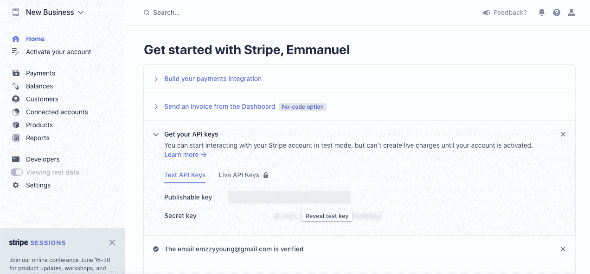
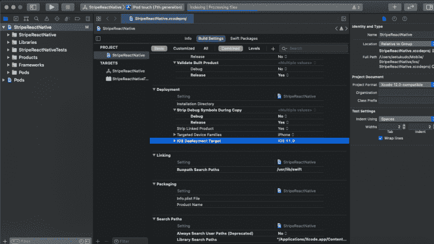
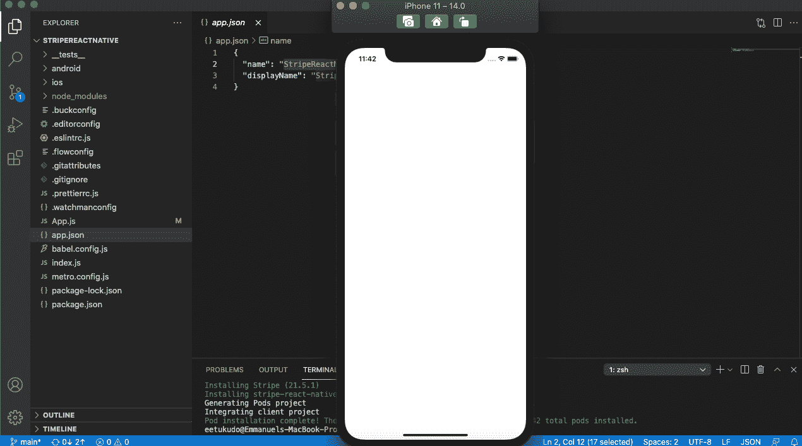
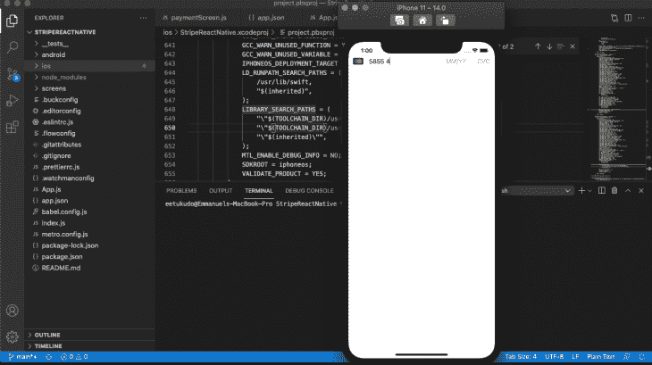
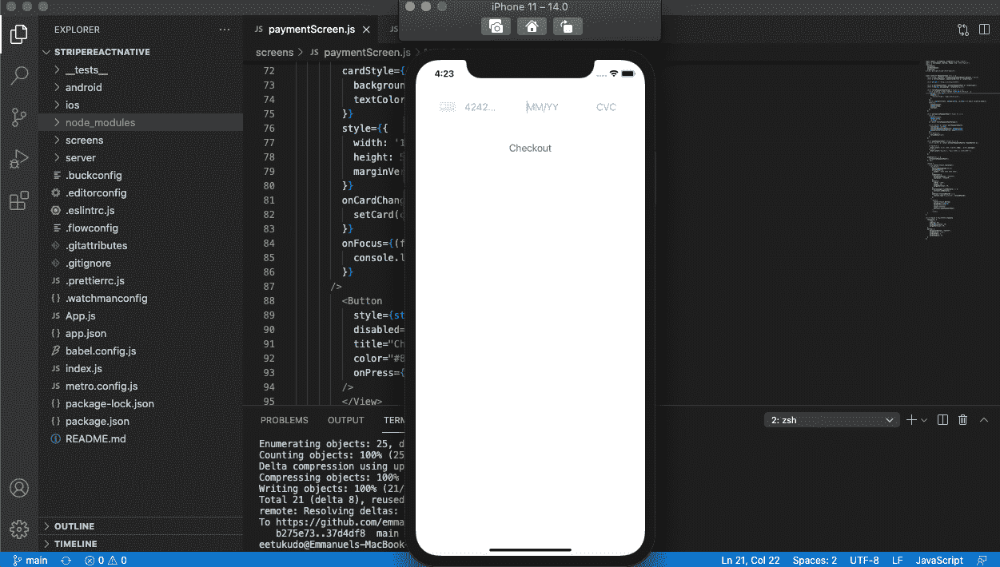

# 探索新的 Stripe React Native SDK 

> 原文：<https://blog.logrocket.com/exploring-the-new-stripe-react-native-sdk/>

## 介绍

尽管 Stripe 只是第二大最受欢迎的支付网关(PayPal 仍然是第一)，但它正受到全球新老公司的稳步增长的使用。据报道，Stripe 已经处理了价值超过 2000 亿美元的交易。

尽管有很多其他支付处理器，Stripe 可以轻松处理国际交易，尤其是当您希望接受美元、英镑、欧元或任何其他国际货币的支付时。

随着官方 [Stripe React Native SDK](https://github.com/stripe/stripe-react-native) 的发布，在 React Native 应用中通过 Stripe 接受支付或设置订阅变得更加容易。虽然 SDK 仍处于测试阶段，但深入研究该 SDK 所提供的功能以及它如何减少集成时间和增强 UI/UX 是很有意义的。

在本教程中，我将向您展示如何使用新发布的官方 Stripe React Native SDK 接受付款。

以下是我们将要介绍的内容:

*   什么是条纹？
*   条带反应原生 SDK
*   设置条带帐户
*   构建 React 原生条纹应用
*   构建支付屏幕

要跟随 React 原生样式教程，您应该具备:

*   熟悉 CSS、HTML 和 Javascript (ES6)
*   Node.js 和 Watchman 安装在您的开发机器上
*   用于测试的 iOS 模拟器或 Android 模拟器
*   安装在开发机器上的代码编辑器(例如 VS Code)
*   对 React 的基本理解

## 什么是条纹？

Stripe 是一项金融和软件服务，帮助软件开发商和电子商务公司通过其 API 实现无缝支付。你可以称 Stripe 为软件即服务(SaaS)公司。

随着金融科技不断获得全球新老 SaaS 公司的青睐，[在线发布的三分之一付费服务](https://trends.builtwith.com/payment/Stripe)使用 Stripe 作为支付选项。深入了解如何在 React 原生应用中集成 Stripe 将是减少 iOS 和 Android 应用中支付集成麻烦的最佳方式。

## 条带反应原生 SDK

既然您已经了解了 Stripe 是什么，那么开始使用 Stripe API 的最佳方式就是通读这里的官方 [Stripe 文档](https://stripe.com/docs)。

但是你猜怎么着？Stripe React Native SDK 可以减少大约 60%进程。

让我们探索 Stripe React Native SDK，看看它能提供什么。下面是 v0.1.2 版本附带的特性列表。

### 安全性

Stripe React Native SDK 可以帮助您收集信用卡号码等敏感数据，并通过将数据发送到 Stripe 的 API 而不是通过后端服务器来安全地接受支付。

### Apple Pay 和其他支付方式

SDK 支持多种支付方式，如银行转账、借记和重定向；信用卡；现在购买，以后付款；凭证；和数字钱包。它还支持 Apple Pay。你可以在这里阅读 Stripe 关于[整合 Apple pay 的官方文档，以及](https://stripe.com/docs/apple-pay)[如何在这里](https://stripe.com/docs/payments/payment-methods/overview)整合其他支付方式。

### SCA 就绪

默认情况下，SDK 根据 Stripe 提供的强客户身份认证执行 3D 身份认证。点击阅读更多关于[卡认证和条带 3D 安全的信息。](https://stripe.com/docs/payments/3d-secure)

### 本机用户界面

Stripe React Native SDK 附带了原生屏幕和元素，可以在 Android 和 iOS 中安全地接受支付。

### 预建支付用户界面(测试版)

SDK 支持 Stripe 提供的预建支付 ui。该功能处于测试阶段，支持 Apple Pay、Google Pay 和卡支付 ui。然而，有计划在未来建立对更多支付选项的支持。你可以在这里阅读[条纹支付 ui。](https://stripe.com/docs/payments/accept-a-payment)

在这些教程中，我们将通过在 React 本地应用程序中构建和测试支付屏幕来探索上面列出的一些功能。让我们开始下一部分。

## 设置条带帐户

每个 SDK 都需要个人访问密钥，Stripe 也不例外。要继续学习 React Native 教程，我们必须创建一个 Stripe 帐户，并获取我们的个人密钥，以便接受付款。

第一步是访问[https://dashboard.stripe.com/register](https://dashboard.stripe.com/register)，创建一个帐户，或者登录到您现有的帐户。

接下来，获取您的公钥。请确保您的密钥是私有的；这是您的 Stripe 帐户的访问密钥。

下面的屏幕截图显示了您可以在 Stripe 帐户中找到您的公钥的位置:



## React 原生条纹应用

现在您已经创建了您的 Stripe 帐户并获得了您的公钥，让我们初始化一个新的 React Native 应用程序并安装 Stripe React Native SDK。

导航到您的开发目录并粘贴下面的命令，以安装一个全新的 React 本机应用程序:

```
npx react-native StripeReactNative

```

安装完成后，通过终端导航到`StripeReactNative`，粘贴下面的代码，在你的应用中安装 Stripe React Native SDK 包:

```
yarn add @stripe/stripe-react-native
or
npm install @stripe/stripe-react-native

```

Stripe React Native SDK 对 Android 和 iOS 上的支持有一些要求。您可以在此处参考它们:

机器人

*   Android 5.0 (API 等级 21)及以上
*   Android Gradle 插件 4.x 及以上版本

ios

*   兼容以 iOS 11 或以上版本为目标的应用。

## 使用 iOS 安装

在 iOS 中安装 Stripe React Native SDK 比在 Android 中要复杂一些。

为了避免通过 npm 安装软件包后出现错误，请在`XCode`中打开您的`StripeReactNative.xcworkspace`,并将您的部署目标设置为`iOS 11.0.`。参见下面的截图示例:



从 Xcode 运行您的项目以确保所有更改都已应用，然后导航到 iOS 文件夹。打开`podfile`，更新`platform :ios, '10.0'`为`platform :ios, '11.0'`，运行`pod install`。这将为 iOS 安装条带本机依赖项。

接下来，让我们从`App.js`中去掉默认的 React 原生代码。用下面的代码更新`App.js`文件:

```
/**
 * Sample React Native App
 * https://github.com/facebook/react-native
 *
 * @format
 * @flow strict-local
 */
import React from 'react';
import {
  SafeAreaView,
  StyleSheet,
} from 'react-native';

const App = ()  => {
  return (
    <SafeAreaView>
    </SafeAreaView>
  );
};
const styles = StyleSheet.create({
});
export default App;

```

如果您运行该应用程序，您应该会看到一个类似于下图的空白屏幕:



## 构建支付屏幕

现在我们已经成功安装了 SDK，让我们继续构建我们的第一个支付屏幕。

### 构建卡组件

首先，在 React 本地应用程序的根目录下创建一个名为`screens`的新文件夹。

导航到该文件夹并创建一个名为`paymentScreen.js`的新文件，然后粘贴以下代码:

```
import React, {useState} from "react";
import {
    CardField,
    CardFieldInput,
    useStripe,
  } from '@stripe/stripe-react-native';

  export default PaymentScreen = () => {
    const [card, setCard] = useState(CardFieldInput.Details | null);
    const {confirmPayment, handleCardAction} = useStripe()
    return(
        <CardField
      postalCodeEnabled={true}
      placeholder={{
        number: '4242 4242 4242 4242',
      }}
      cardStyle={{
        backgroundColor: '#FFFFFF',
        textColor: '#000000',
      }}
      style={{
        width: '100%',
        height: 50,
        marginVertical: 30,
      }}
      onCardChange={(cardDetails) => {
        setCard(cardDetails);
      }}
      onFocus={(focusedField) => {
        console.log('focusField', focusedField);
      }}
    />
    )
  }

```

接下来，让我们将`paymentScreen.js`导入到我们项目的根中。

打开`App.js`并更新其代码，如下所示:

```
/**
 * Sample React Native App
 * https://github.com/facebook/react-native
 *
 * @format
 * @flow strict-local
 */
import React from 'react';
import {
  SafeAreaView,
  StyleSheet,
} from 'react-native';
import { StripeProvider } from '@stripe/stripe-react-native';
import PaymentScreen from "./screens/paymentScreen";
const App = ()  => {
  const publishableKey = "pk_test_AtN3VLAFhzbLNqf3Y9z50iNQ";
  return (
    <StripeProvider
      publishableKey={publishableKey}
    >
      <PaymentScreen />
    </StripeProvider>
  );
};
const styles = StyleSheet.create({
});
export default App;

```

让我们运行我们的应用程序来测试我们到目前为止已经构建了什么。运行`npx react-native run-ios`来运行 iOS 的构建。

您可能会遇到一个`undefined symbols for architecture x86_64`错误，但是不要惊慌！要修复错误，请按照以下步骤操作:

```
LIBRARY_SEARCH_PATHS = (
remove: "\"$(TOOLCHAIN_DIR)/usr/lib/swift/$(PLATFORM_NAME)\"",
remove: "\"$(TOOLCHAIN_DIR)/usr/lib/swift-5.0/$(PLATFORM_NAME)\"",
"\"$(inherited)\"",
);

```

在`Xcode`中打开你的项目，新建一个 Swift 文件(**文件** > **新建** > **文件** > **Swift** )。将文件命名为任意名称(如`Fix.swift`)，并在 Xcode 提示时选择**创建桥接头**。

再次运行`npx react-native run-ios`，错误将被修复。如果成功，您的应用程序在加载后应该看起来像下面的屏幕截图:



我们刚刚创建了一个简单的卡组件，它将卡的详细信息直接发送到 Stripe 服务器进行实时验证，并随后存储组件的状态。

## 预构建的用户界面(单步)

该功能结合了使用信用卡详细信息接受 Stripe 付款的所有步骤。这种集成需要一个端点从您的服务器与 Stripe API 进行通信。

### 创建端点

要设置服务器与 React Native 中的 Stripe 通信，我们需要用`install express body-parser`和`dotenv`初始化一个新的`node.js`应用。

创建一个名为`server`的新文件夹，导航到该文件夹，运行`npm init -y`，并按照说明创建一个新的节点应用程序。然后，运行`npm i express body-parser dotenv`。

最后，在服务器文件夹的根级别创建一个`server.js`文件，并将下面的代码粘贴到该文件中:

```
require("dotenv").config();
const express = require("express");
const app = express();
const { resolve } = require("path");
const stripe = require("stripe")(process.env.secret_key); // https://stripe.com/docs/keys#obtain-api-keys
app.use(express.static("."));
app.use(express.json());
// An endpoint for your checkout 
app.post("/checkout", async (req, res) => { 
  // Create or retrieve the Stripe Customer object associated with your user.
  let customer = await stripe.customers.create(); // This example just creates a new Customer every time

  // Create an ephemeral key for the Customer; this allows the app to display saved payment methods and save new ones
  const ephemeralKey = await stripe.ephemeralKeys.create(
    {customer: customer.id},
    {apiVersion: '2020-08-27'}
  );  

  // Create a PaymentIntent with the payment amount, currency, and customer
  const paymentIntent = await stripe.paymentIntents.create({
    amount: 973,
    currency: "usd",
    customer: customer.id
  });

  // Send the object keys to the client
  res.send({
    publishableKey: process.env.publishable_key, // https://stripe.com/docs/keys#obtain-api-keys
    paymentIntent: paymentIntent.client_secret,
    customer: customer.id,
    ephemeralKey: ephemeralKey.secret
  });
});

app.listen(process.env.PORT, () =>
  console.log(`Node server listening on port ${process.env.PORT}!`)
);

```

不要忘记用下面的代码创建一个`.env`文件:

```
secret_key=Your_Secret_Key
PORT=8000

```

接下来，用下面的代码更新`paymentScreen.js`,向应用程序添加一个结帐按钮:

```
import React, { useState, useEffect } from "react";
import { StyleSheet, Button, View} from 'react-native';
import {
  CardField,
  CardFieldInput,
  useStripe,
} from '@stripe/stripe-react-native';

export default PaymentScreen = () => {
  const [card, setCard] = useState(CardFieldInput.Details | null);
  const { confirmPayment, handleCardAction } = useStripe()
  const API_URL = "http://localhost:8000";
  const { initPaymentSheet, presentPaymentSheet } = useStripe();
  const [loading, setLoading] = useState(false);

  const fetchPaymentSheetParams = async () => {
    const response = await fetch(`${API_URL}/checkout`, {
      method: 'POST',
      headers: {
        'Content-Type': 'application/json',
      },
    });
    const { paymentIntent, ephemeralKey, customer } = await response.json();
    return {
      paymentIntent,
      ephemeralKey,
      customer,
    };
  };
  const initializePaymentSheet = async () => {
    const {
      paymentIntent,
      ephemeralKey,
      customer,
    } = await fetchPaymentSheetParams();
    const { error } = await initPaymentSheet({
      customerId: customer,
      customerEphemeralKeySecret: ephemeralKey,
      paymentIntentClientSecret: paymentIntent,
    });
    if (!error) {
      setLoading(true);
    }
  };
  const openPaymentSheet = async () => {
    const { error } = await presentPaymentSheet({ clientSecret });
    if (error) {
      Alert.alert(`Error code: ${error.code}`, error.message);
    } else {
      Alert.alert('Success', 'Your order is confirmed!');
    }
  };
  useEffect(() => {
    initializePaymentSheet();
  }, []);
  return (
    <View style={styles.container}>
      <CardField
        postalCodeEnabled={false}
        placeholder={{
          number: '4242 4242 4242 4242',
        }}
        cardStyle={{
          backgroundColor: '#FFFFFF',
          textColor: '#000000',
        }}
        style={{
          width: '100%',
          height: 50,
          marginVertical: 30,
        }}
        onCardChange={(cardDetails) => {
          setCard(cardDetails);
        }}
        onFocus={(focusedField) => {
          console.log('focusField', focusedField);
        }}
      />
        <Button
          style={styles.button}
          disabled={!loading}
          title="Checkout"
          color="#841584"
          onPress={openPaymentSheet}
        />
        </View>
  )
}
const styles = StyleSheet.create({
  container: {
     flex: 1,
     padding: 20,
     marginHorizontal: 10,
     marginVertical: 10,
  },
  button: {
     backgroundColor: '#00aeef',
     borderColor: 'red',
     borderWidth: 5,
     borderRadius: 15       
  }
})

```

如上所示，创建一个单独的`node.js`项目，并用端口 8000 设置服务器。从 React Native 向服务器上的`/checkout`端点发送一个请求。一旦请求成功，将使用`useEffect`钩子调用`initializePaymentSheet`。

在此过程中，按钮保持禁用状态，直到从后端收到响应。请注意，只要您打算与后端服务器通信，您的后端服务器就必须启动并运行。

此时，您的应用程序应该类似于下面的屏幕截图:



## 结论

按条带反应本机 SDK 非常容易实现。随着对预构建用户界面的支持(包括未来支持更多预构建用户界面的计划)和支付选择，它正成为开发者的最爱。

## [LogRocket](https://lp.logrocket.com/blg/react-native-signup) :即时重现 React 原生应用中的问题。

[](https://lp.logrocket.com/blg/react-native-signup)

[LogRocket](https://lp.logrocket.com/blg/react-native-signup) 是一款 React 原生监控解决方案，可帮助您即时重现问题、确定 bug 的优先级并了解 React 原生应用的性能。

LogRocket 还可以向你展示用户是如何与你的应用程序互动的，从而帮助你提高转化率和产品使用率。LogRocket 的产品分析功能揭示了用户不完成特定流程或不采用新功能的原因。

开始主动监控您的 React 原生应用— [免费试用 LogRocket】。](https://lp.logrocket.com/blg/react-native-signup)

## [LogRocket](https://lp.logrocket.com/blg/ecommerce-signup) :看看用户为什么不完成你的电子商务流程中的一个步骤的技术和 UX 原因。

[](https://lp.logrocket.com/blg/ecommerce-signup)

LogRocket 就像是一个网络和移动应用程序和网站的 DVR，记录你的电子商务应用程序上发生的一切。LogRocket 没有猜测用户不转化的原因，而是主动揭示了阻止你转化的根本原因，比如 JavaScript 错误或死点击。LogRocket 还可以监控应用的性能，报告客户端 CPU 负载、客户端内存使用等指标。

开始主动监控您的电子商务应用程序— [免费试用](https://lp.logrocket.com/blg/ecommerce-signup)。