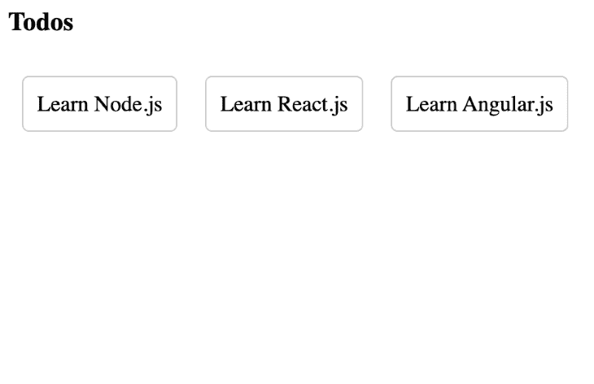

# Express.js 5 迁移指南

> 原文：<https://blog.logrocket.com/express-js-5-migration-guide/>

Express.js 是[最流行的 Node.js 框架](https://stackdiary.com/node-js-frameworks/)之一，并且经常发布新版本来升级或添加新功能。过去的一些版本已经最小化了框架的内存占用，提高了页面加载速度，增加了新的 API 和框架集成，确保了代码的可维护性，并为调用和使用函数提供了更好的简化技术。

新发布的 Express.js v5 包含大量新特性和增强功能，旨在提高框架的效率。但是，此更新可能会导致问题或生成不赞成的警告，使迁移有点令人不安。

在本教程中，我们将演示如何从 Express v4 升级到 Express v5。我们还将了解 Express 5 中的升级和新功能，以及如何在 Express 5 中构建 web 应用程序。

我们走吧！

*向前跳转:*

## Express.js 概述

Express 是一个 Node.js 后端 web 应用程序框架，在 MIT 许可下作为免费开源软件发布。这种流行的节点 web 框架是许多其他节点 web 框架的基础，其机制可以:

*   为具有各种 HTTP 动词和 URL 路径(路由)的请求创建处理程序
*   与“视图”呈现引擎集成，通过用数据填充模板来提供回复
*   设置常见的 web 应用程序设置，例如用于生成答案的连接端口和模板位置
*   在请求处理管道的每个阶段，容纳额外的请求处理中间件的添加

Express 的原作者 TJ Holowaychuk 称其为一个受 Sinatra 启发的服务器，指的是它的简单性和作为插件的众多功能。

Express 与 MongoDB 数据库软件以及 JavaScript 前端框架或库一起，是 MEAN、MERN 和 MEVN 等流行技术栈的后端组件。

## 为什么要迁移到 Express 5？

Express 5 仍处于测试阶段，但正如我之前提到的，它比 Express 4 提供了几个更新。这些改进旨在提高框架的效率。最显著的变化与路径路由匹配语法有关。让我们仔细看看。

### 路径路由匹配语法

在 Express 5 中，对路径字符串与传入请求的匹配方式进行了一些更改:

*   新增参数修饰符:`?`、`*`和`+`
*   命名匹配组:在`req.params`中的位置不再可用
*   正则表达式:只能在匹配组中使用；`/(d+)`取代`/\\d+`
*   匹配组表达式:只能使用 regex 语法；`(.*)` *取代了* `(*)`
*   特殊`*`路径段行为:该行为已被移除；`/id/*/user`将匹配一个文字`*`作为中间段

作为第一个输入传递给`app.all()`、`app.use()`、`app.METHOD()`、`router.all()`、`router.METHOD()`或`router.use()`API 的字符串被称为路径路由匹配语法。

### 拒绝的承诺和中间件处理程序

在 Express 4 中，用户依靠像`express-async-handler`这样的包或者编写他们的助手函数来捕捉返回承诺的处理程序的拒绝。

然而，在 Express 5 中，任何被拒绝的承诺或中间件或处理程序抛出的错误都会作为错误转发给错误处理中间件。这有助于防止应用程序崩溃。

这使得使用异步函数作为中间件和处理程序更加容易。当一个异步函数抛出一个错误或者一个被拒绝的承诺在异步函数中等待时，通过调用`next (err)`函数将错误发送给错误处理程序。

```
app.use(async (req, res, next) => {
  throw new Error("Something went wrong");
});

```

上述内容相当于从 Express 4 中的中间件或路由处理器显式返回一个承诺:

```
app.use((req, res, next) => {
  return new Promise((resolve, reject) => {
    reject(new Error("Something went wrong"));
  });
});

```

### 返回`app.router`对象

Express 5 已经恢复了在 Express 4 中被移除的`app.router`对象。与 Express 3 不同，在 Express 3 中需要应用程序来显式加载对象，Express 5 中的对象本质上是对底层 Express 路由器的引用。

### 在`req.host`对象中维护的端口

Express 5 在`req.host`对象中维护端口号。以前，如果提供了端口号，Express 4 中的`req.host`方法会不正确地删除该号码。

### `req.query`对象被更改为 getter

Express 5 中的`req.query`属性已经从可写属性更改为 getter。此外，默认的查询解析器已经从“扩展”重命名为“简单”。

## 快速 v4 与快速 v5

除了前面提到的更新，Express 5 与 Express 4 非常相似。从 v3 到 v4，API 的变化并没有那么大。然而，尽管底层 API 保持不变，但还是有一些突破性的变化。换句话说，更新旧的 Express 4 程序以使用 Express 5 可能会导致它失败。

让我们仔细看看这些突破性的变化:

*   `app.del()`:Express 5 不再支持此功能，如果使用此功能将会出现错误
*   `app.param(name, fn)`:该功能从 v4.11.0 开始已被弃用，Express 5 不支持；使用`app.param(fn)`签名改变了它的功能
*   `req.acceptsCharset()`、`req.acceptsEncoding()`、`req.acceptsLanguage()`被复数化是表达 5
    *   **解**:用以下代替:`req.acceptsCharsets()`、`req.acceptsEncodings()`、`req.acceptsLanguages()`
*   `req.param(name)`:在 Express 5 中无法使用此功能检索表单数据
    *   **解决方案**:检索表单数据，在`req.params`、`req.body`或`req.query`对象中查找提交的参数名，如下例:

        ```
        app.get(‘/user/:id’, (req, res) => {   res.send(User.find(req.param(‘id’))); }); // Will give deprecation warning in Express v4 // Will throw TypeError in express v5 "req.param is not a function"  // Do this instead in v5 app.get(‘/user/:id’, (req, res) => {   res.send(User.find(req.params.id)); });
        ```

*   Express 5 不支持此签名。(obj，status)。
    *   **解决方案**:使用`res.status(status).json(obj`语法改变状态，然后链接到`res.json()`方法，像这样:

        ```
        // Version 4 app.get(‘/user/:id’, (req, res) => {   res.json(200, {user: User.find(req.param.id)}); });   // Version 5 app.get(‘/user/:id’, (req, res) => {   res.status(200).json({     user: User.find(req.param.id)   }); });
        ```

*   `res.send(obj, status)`:Express 5 不支持此签名
    *   **解决方案**:用`res.status(status).send()`设置状态，然后链接到`res.send()`方法，像这样:

        ```
        // Version 4 app.get(‘/user/:id’, (req, res) => {   res.send(200, {user: User.find(req.param.id)}); });  // Version 5 app.get(‘/user/:id’, (req, res) => {   res.status(200).send({     user: User.find(req.params.id)   }); });
        ```

*   `res.send(status)`:Express 5 不支持此签名，其中`status`是一个整数

## 将 Express 4 应用程序迁移到 Express 5

将您的 Express 4 应用程序迁移到 Express 5 并不像您想象的那样困难。

首先，进入项目的根目录，使用以下命令安装 Express 5:

```
npm install "[email protected]>=5.0.0-beta.1" --save

```

该命令将更新您的项目依赖项，并且还会更新`package.json`文件。

接下来，重新构建项目或重新运行测试来确定是否有任何失败。使用本教程中介绍的更新来修复可能出现的任何问题。

如果您想更新项目中的任何其他 npm 包，请运行`npm outdated`命令。这将使您能够看到项目中需要更新的其他包。然后，使用`npm update`命令更新它们。

## Express v5 web 应用程序演示

为了演示我们到目前为止所学到的关于 Express 5 的知识，让我们使用 Express 5 语法创建一个演示 todo 应用程序。

* * *

### 更多来自 LogRocket 的精彩文章:

* * *

首先，为应用程序创建一个新文件夹，如下所示:

```
mkdir express-5-demo && cd express-5-demo

```

然后，初始化一个新的 Node.js 项目:

```
npm init -y

```

上面的命令会生成一个`package.json`文件。打开文件并添加启动脚本:

```
{
  ...
  "start": "node index.js"
}

```

### 安装依赖项

现在，使用以下命令安装 Express 5 和该应用程序所需的其他软件包:

```
npm i [email protected] body-parser

```

请等待安装完成，然后继续。确定安装完成后，在项目的根目录下创建一个`index.js`文件，并使用下面的代码片段设置一个基本的 Express 服务器:

```
const express = require("express");
const app = express();  
app.listen(3000, ()=>console.log("Express server running on port 3000"));

```

### 创建路线

配置好 Express 服务器后，让我们为应用程序创建一些基本的路由。用以下代码片段更新`index.js`文件:

```
  const todos = [{
        id: 1,
        title: "Learn Node.js",
        completed: true
    },
    {
        id: 2,
        title: "Learn React.js",
        completed: false
    },
    {
        id: 3,
        title: "Learn Angular.js",
        completed: false
    }
    ]
    app.get("/todos", (req, res) => {
        res.status(200).json(todos);
    });
    app.post("/todos", (req, res) => {
        const todo = req.body;
        console.log(req.body);
        todos.push(todo);
        res.status(200).json(todos);
    });
    app.get("/todos/:id", (req, res) => {
        const id = parseInt(req.params.id);
        const todo = todos.find(todo => todo.id === id);
        res.status(200).json(todo);
    });
    app.put("/todos/:id", (req, res) => {
        const id = parseInt(req.params.id);
        const todo = todos.find(todo => todo.id === id);
        todo.completed = !todo.completed;
        res.status(200).json(todos);
    });
    app.delete("/todos/:id", (req, res) => {
        const id = parseInt(req.params.id);
        const todo = todos.find(todo => todo.id === id);
        todos.splice(todos.indexOf(todo), 1);
        res.status(200).json(todos);
    });

```

在上面的代码中，我们用一些虚拟数据创建了一个`todos`数组。然后，我们定义了四个 API 路由来从应用程序中获取、添加、更新和删除一个`todo`。

### 创建中间件

为了允许用户创建一个新的`todo`，我们需要为我们刚刚安装的 body-parser 包定义一个中间件。在`todos`数组前添加以下代码:

```
 app.use(bodyParser.json());

```

### 提供静态文件

我们已经完成了路由的设置，所以让我们创建另一个路由器和中间件来提供一个 HTML 页面，向用户显示 todos。

首先，创建一个新文件夹，并将其命名为`public`。然后，创建一个名为`index.html`的新文件。打开`index.html`文件并添加以下代码片段:

```
    <html lang="en">
    <head>
        <meta charset="UTF-8">
        <meta http-equiv="X-UA-Compatible" content="IE=edge">
        <meta name="viewport" content="width=device-width, initial-scale=1.0">
        <title>Todos</title>
    </head>
    <body>
        <div>
            <h3>Todos</h3>
            <ul id="data"></ul>
        </div>
    </body>
    </html>
    <style>
        #data{
            list-style: none;
            padding: 0;
        }
        #data li{
            display: inline-block;
            margin: 10px;
            padding: 10px;
            border: 1px solid #ccc;
            border-radius: 5px;
        }
    </style>
    <script src="app.js"></script>

```

在上面的代码中，我们创建了一个 HTML 文档来显示待办事项。todos 将显示在页面的`<ul id="data"></ul>`部分，我们将用 JavaScript 来处理。我们还定义了一些样式并引用了 JavaScript 文件，我们将很快创建该文件来获取所有的 todos。

现在在公共文件夹中创建一个`app.js`文件，并添加以下代码:

```
const Tododata = document.getElementById('data');
    fetch('http://localhost:3001/todos', {
        method: 'GET',
        headers: {
          'Content-Type': 'application/json',
          'Accept': 'application/json'
        }
      })
        .then(res => res.json())
        .then(data => {
          if(data){
              data.forEach(element => {
                  const li = document.createElement('li');
                  li.innerHTML = element.title;
                  Tododata.appendChild(li);
              });
          }
        })
        .catch(err => console.log(err));

```

这里，我们使用 JavaScript `fetch` API 向后端发送一个请求，以检查`todo`是否存在于`todos`数组中。然后我们创建一个列表元素来显示待办事项的细节。
对于要呈现的页面，我们需要在根文件`index.js`中再添加一个配置。在`const app = express();`后添加下面的代码

```
app.use(express.static(__dirname + "/public"));

```

现在我们将能够渲染`public`目录中的所有静态文件。

### 测试应用程序

要测试应用程序，请运行以下命令启动 Express 服务器:

```
npm start

```

然后，在浏览器中导航到`localhost:3000`，您应该会看到以下输出:



## 结论

在本文中，我们探索了 Express.js v5 中可用的新特性和改进，并回顾了如何将现有的 Express 4 应用程序迁移到 Express 5。为了演示如何利用版本 5 中的新功能，我们创建了一个分步演示，展示如何在 Express 5 中创建 web 应用程序。

你对 Express 4 和 Express 5 有什么看法？您是否计划在下一个项目中迁移到 Express 5？有关 Express 5 的更多信息，请查看官方文档。

## 200 只显示器出现故障，生产中网络请求缓慢

部署基于节点的 web 应用程序或网站是容易的部分。确保您的节点实例继续为您的应用程序提供资源是事情变得更加困难的地方。如果您对确保对后端或第三方服务的请求成功感兴趣，

[try LogRocket](https://lp.logrocket.com/blg/node-signup)

.

[](https://lp.logrocket.com/blg/node-signup)[https://logrocket.com/signup/](https://lp.logrocket.com/blg/node-signup)

LogRocket 就像是网络和移动应用程序的 DVR，记录下用户与你的应用程序交互时发生的一切。您可以汇总并报告有问题的网络请求，以快速了解根本原因，而不是猜测问题发生的原因。

LogRocket 检测您的应用程序以记录基线性能计时，如页面加载时间、到达第一个字节的时间、慢速网络请求，还记录 Redux、NgRx 和 Vuex 操作/状态。

[Start monitoring for free](https://lp.logrocket.com/blg/node-signup)

.