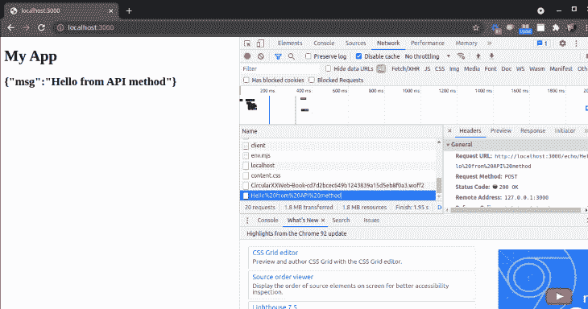

# Fastify-vite:通过 SSR 和客户端水合作用提供 vite 应用程序

> 原文：<https://blog.logrocket.com/fastify-vite-serving-vite-ssr-hydration/>

[Fastify](https://www.fastify.io/) 是 Node.js 的一个流行的 web 服务器框架， [Vite](https://vitejs.dev/guide/) 是一个构建工具——由 Vue 团队创建——最近，它为[提供了服务器端渲染的实验性支持](https://vitejs.dev/guide/ssr.html)。将这两个工具连接在一起以获得带有客户端水合作用的服务器端渲染是很棘手的。

幸运的是，有一个 fastify 插件 [fastify-vite](https://github.com/terixjs/fastify-vite) ，它使得在 Fastify 应用程序中使用 vite 的所有好处变得更加容易。

在这篇博文中，我将展示如何开始使用 fastify-vite，并解释它如何处理服务器端渲染和资产绑定。请记住，在撰写本文时， [fastify-vite 的自述文件](https://github.com/terixjs/fastify-vite)称该项目是“高度实验性的，尚未准备好用于生产”，所以不要将该代码用于重要的生产应用程序！

这篇博文假设你对 Fastify 语法和 Vue 单文件组件有基本的了解。

## 什么是 fastify-vite？

首先，您需要安装一些依赖项。下面是开始使用 fastify-vite 的最简单的`package.json`。你需要同时安装 fastify-vite 和 fastify-vite-vue，因为 fastify-vite 被设计成可以与[几种不同的前端框架](https://vitejs.dev/guide/#scaffolding-your-first-vite-project)一起工作。

```
{
  "dependencies": {
    "fastify": "3.17.0",
    "fastify-vite": "2.2.0-beta.5",
    "fastify-vite-vue": "2.2.0-beta.5"
  }
}

```

您需要创建六个文件，以便使用 fastify-vite 设置一个最小的应用程序:

1.  `server.js`
2.  `main.js`
3.  `base.vue`
4.  `routes.js`
5.  `views/index.vue`
6.  `entry/server.js`

你可以在 GitHub 这里找到完整的“你好，世界”应用程序[。应用程序的主要入口点是`server.js`，它负责设置一个 Fastify 服务器，并将其配置为使用 fastify-vite。](https://github.com/vkarpov15/fastify-vite-example/tree/234f36d85c099fa535ca4a8f09f64685d71b6603)

对于一个“Hello，World”应用程序来说，下面是您使用 Fastify 需要做的所有事情。Fastify-vite 处理其余代码的导入和执行。

```
const fastify = require('fastify')()
const fastifyVite = require('fastify-vite')
const fastifyViteVue = require('fastify-vite-vue')

async function main () {
  await fastify.register(fastifyVite, {
    api: true,
    root: __dirname, // <-- fastify-vite looks for `main.js` in this directory
    renderer: fastifyViteVue,
  })

  return fastify
}

if (require.main === module) {
  fastifyVite.app(main, (fastify) => {
    fastify.listen(3000, (err, address) => {
      if (err) {
        console.error(err)
        process.exit(1)
      }
      console.log(`Server listening on ${address}`)
    })
  })
}

module.exports = main

```

Fastify-vite 在`root`目录中寻找一个`main.js`文件，该文件负责创建和配置一个 [Vue 应用](https://v3.vuejs.org/api/application-api.html)。特别是`main.js`需要设置 [Vue 路由器](https://masteringjs.io/tutorials/vue/router)。以下是`main.js`的内容:

```
import { createSSRApp } from 'vue'
import { createMemoryHistory, createRouter, createWebHistory } from 'vue-router'
import { createHead } from '@vueuse/head'
import routes from './routes'

import base from './base.vue'

export function createApp (ctx) {
  const app = createSSRApp(base)
  const head = createHead()
  const history = import.meta.env.SSR
    ? createMemoryHistory()
    : createWebHistory()
  const router = createRouter({ history, routes })
  app.use(router)
  app.use(head)
  return { ctx, app, head, router }
}

```

首先注意`server.js`用的是 CommonJS `require()`，但是`main.js`用的是 ESM `import`。

这是故意的！Vite 使用 [esbuild](https://github.com/evanw/esbuild) 捆绑并编译`main.js`，因此`main.js`可以在浏览器和节点中运行。

`main.js`文件导入两个新文件:`routes.js`和`base.vue`。`base.vue`文件负责设置你的 Vue app 的基本布局，包括设置`[router-view](https://router.vuejs.org/api/#router-view)` [组件](https://router.vuejs.org/api/#router-view)，如下图。

```
<template>
  <router-view v-slot="{ Component }">
    <h1>My App</h1>
    <component :key="route.path" :is="Component" />
  </router-view>
</template>

<script>
import { useRoute } from 'vue-router'
export default {
  setup () {
    return { route: useRoute() }
  }
}
</script>

```

接下来是`routes.js`文件。该文件负责为您的应用程序导出所有路线。

`main.js`文件将这些路由添加到 Vue 路由器，`entry/server.js`会将这些路由添加到 Fastify。fastify-vite-vue 包有一个`loadRoutes()`功能，可以将路由转换成 vue 路由器和 fastify 的正确格式。

为了导入多条路线，可以使用 [Vite 的](https://vitejs.dev/guide/features.html#glob-import) `[globEager()](https://vitejs.dev/guide/features.html#glob-import)` [函数](https://vitejs.dev/guide/features.html#glob-import)，但是下面的例子使用香草`import`来避免引入不必要的新概念。

```
import { loadRoutes } from 'fastify-vite-vue/app'
import * as index from './views/index.vue'

export default loadRoutes({ './views/index.vue': index })

```

最后，`entry/server.js`是 fastify-vite 的服务器端入口点。它负责创建服务器端渲染功能和导出路线。您可以将该函数视为标准样板文件。

```
import { createApp } from '../main'
import { createRenderFunction } from 'fastify-vite-vue/server'
import routes from '../routes'

export default {
  routes,
  render: createRenderFunction(createApp),
}

```

一旦您运行`node ./server.js`并访问`[http://localhost:3000/](http://localhost:3000/)`，您应该会看到下面的 HTML 输出:

```
<div id="app">
  <h1>My App</h1>

  <h2>index.vue</h2>
</div>

```

## 使用 fastify-vite 进行服务器端渲染

fastify-vite 的最大好处是，它为您设置了具有完全客户端水合作用的服务器端渲染。使用 Vue 进行纯粹的服务器端渲染很容易，但是让客户端从服务器停止的地方继续就很棘手了。

Fastify-vite 确保了从客户端到服务器的无缝切换，而不需要太多额外的工作。下面是 fastify-vite 的服务器端渲染工作原理。

首先，你需要添加 [fastify-api 插件](https://www.npmjs.com/package/fastify-api)。Fastify-vite 与 fastify-api 配合得很好，允许您的 Vue 组件在服务器端渲染期间发出 api 请求，因此您的 routes 不必在`[mounted()](https://masteringjs.io/tutorials/vue/mounted)` [钩子](https://masteringjs.io/tutorials/vue/mounted)中向服务器发出 API 请求来获取数据。

```
{
  "dependencies": {
    "fastify": "3.17.0",
    "fastify-api": "0.2.0",
    "fastify-vite": "2.2.0-beta.5",
    "fastify-vite-vue": "2.2.0-beta.5"
  }
}

```

接下来，您需要向`server.js`文件添加一个 API 端点。这个端点将回显它接收到的任何信息。简单，但足以说明 fastify-vite 将能够在不向`/echo`发出 HTTP 请求的情况下呈现`index.vue`。

```
const fastify = require('fastify')()
const fastifyVite = require('fastify-vite')
const fastifyViteVue = require('fastify-vite-vue')
const fastifyApi = require('fastify-api')

async function main () {
  await fastify.register(fastifyApi)
  await fastify.register(fastifyVite, {
    api: true,
    root: __dirname,
    renderer: fastifyViteVue,
  })

  fastify.api(({ post }) => ({
    echo: post('/echo/:msg', ({ msg }, req, reply) => { // <-- new API endpoint `echo`
      reply.send({ msg })
    })
  }))

  return fastify
}

```

接下来，将数据提取添加到`index.vue`。fastify-vite-vue 包有一个简洁的`useHydration()`钩子。它采用一个负责加载初始数据的`getData()`函数，并注入一个让您访问`echo` API 端点的`$api`对象。

注意:不要直接使用 HTTP 客户端，如 Axios 或`fetch()`。使用`$api`是因为 fastify-vite-vue 足够聪明，可以跳过服务器端的 HTTP 请求。

```
<template>
  <h2>{{ctx.$loading ? 'Loading...' : ctx.$data.result.body}}</h2>
</template>

<script>
import { useHydration } from 'fastify-vite-vue/client'

export const path = '/'

export async function getData ({ req, $api }) {
  return {
    result: await $api.echo({
      msg: 'Hello from API method',
    }),
  }
}
export default {
  async setup () {
    const ctx = await useHydration({ getData })
    return { ctx }
  }
}
</script>

```

为了充分融合客户端应用，您需要在`entry/client.js`中创建一个客户端入口点来融合应用。下面是`entry/client.js`:

```
import { createApp } from '../main'
import { hydrate } from 'fastify-vite-vue/client'
const { app, router } = createApp()

hydrate(app)

// Wait until router is ready before mounting to ensure hydration match
router.isReady().then(() => app.mount('#app'))

```

当您打开`[http://localhost:3000](http://localhost:3000)`时，注意到`index.vue`包含了来自`echo`的响应，没有对`/echo`的任何 HTTP 请求。


然而，假设您添加了一个新的视图— `views/hello.vue` —它有一个 [Vue](https://masteringjs.io/tutorials/vue/router-link) `[router-link](https://masteringjs.io/tutorials/vue/router-link)`回到索引中。

```
<template>
  <router-link to="/">Back to Home</router-link>
</template>

<script>
export const path = '/hello'
</script>

```

导航到`[http://localhost:3000/hello](http://localhost:3000/hello)`，点击链接，并在`[http://localhost:3000](http://localhost:3000)`加载时仔细查看网络选项卡。您将看到`getData()`现在向`/echo` API 端点发出一个单独的 HTTP 请求。



## **结论**

Fastify-vite 是一个强大的 Fastify 插件，可以帮助您将 vite 的强大功能集成到您的 Fastify 应用程序中，包括完整的服务器端渲染支持。

虽然 fastify-vite 还没有投入生产，但你应该在你正在开发的任何 fastify 应用程序上亲自尝试一下。它使得服务器端渲染和客户端水合更加容易！

## 您是否添加了新的 JS 库来提高性能或构建新特性？如果他们反其道而行之呢？

毫无疑问，前端变得越来越复杂。当您向应用程序添加新的 JavaScript 库和其他依赖项时，您将需要更多的可见性，以确保您的用户不会遇到未知的问题。

LogRocket 是一个前端应用程序监控解决方案，可以让您回放 JavaScript 错误，就像它们发生在您自己的浏览器中一样，这样您就可以更有效地对错误做出反应。

[](https://lp.logrocket.com/blg/javascript-signup)[https://logrocket.com/signup/](https://lp.logrocket.com/blg/javascript-signup)

[LogRocket](https://lp.logrocket.com/blg/javascript-signup) 可以与任何应用程序完美配合，不管是什么框架，并且有插件可以记录来自 Redux、Vuex 和@ngrx/store 的额外上下文。您可以汇总并报告问题发生时应用程序的状态，而不是猜测问题发生的原因。LogRocket 还可以监控应用的性能，报告客户端 CPU 负载、客户端内存使用等指标。

自信地构建— [开始免费监控](https://lp.logrocket.com/blg/javascript-signup)。